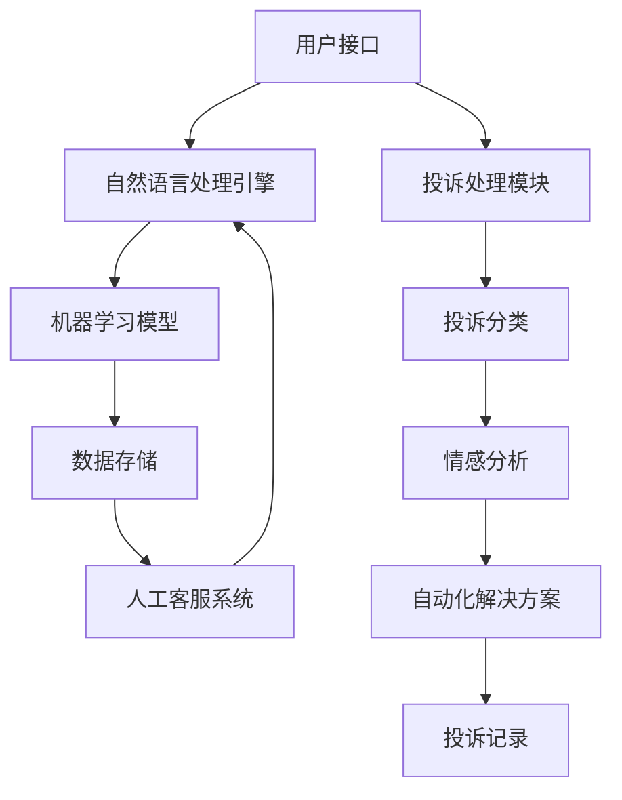

                 

智能客服技术是当今计算机科学领域的一个热点话题。随着人工智能（AI）和自然语言处理（NLP）技术的飞速发展，智能客服已经成为企业提升客户体验、降低运营成本的重要手段。本文旨在探讨未来2050年智能客服机器人和智能投诉处理的可能发展，以及它们如何改变客户服务行业。

## 关键词

- 智能客服
- 人工智能
- 自然语言处理
- 客户体验
- 投诉处理

## 摘要

本文首先回顾了智能客服的起源和发展历程，然后探讨了2050年智能客服机器人和智能投诉处理的核心概念、架构和算法原理。接着，本文分析了核心算法的优缺点以及其应用领域，并通过数学模型和公式的推导，提供了详细的案例分析。随后，本文展示了智能客服技术的实际应用场景，并展望了未来的发展方向。最后，本文推荐了一些学习和开发资源，总结了研究成果，并讨论了未来面临的挑战和研究展望。

## 1. 背景介绍

智能客服的历史可以追溯到20世纪90年代，当时互联网的兴起推动了在线客户服务的发展。最早的智能客服系统主要是基于规则的专家系统，它们能够处理简单的客户查询。随着时间的发展，自然语言处理和机器学习技术的进步，智能客服逐渐变得更加智能和复杂。

在21世纪初，聊天机器人和虚拟助手开始广泛应用，这些系统利用自然语言理解和机器学习算法，能够处理更加复杂的客户问题。同时，云计算和大数据技术的应用，使得智能客服能够更好地收集和分析客户数据，从而提供个性化的服务。

目前，智能客服已经成为许多企业服务战略的重要组成部分。它们不仅能够提高客户满意度，还能帮助企业降低成本，提高运营效率。然而，随着技术的不断进步，未来的智能客服将更加智能化和自动化，能够处理更加复杂的问题，甚至能够进行智能投诉处理。

## 2. 核心概念与联系

### 2.1. 智能客服机器人的核心概念

智能客服机器人是一种利用人工智能技术，特别是自然语言处理和机器学习算法，与用户进行交互的软件程序。其核心概念包括：

- 自然语言理解（NLU）：智能客服机器人需要理解用户的语言，包括语法、语义和情感。
- 语境管理：智能客服机器人需要能够理解用户的语境，并在对话中进行适当的推理和决策。
- 对话管理：智能客服机器人需要能够管理对话流程，包括识别用户意图、选择合适的回复，并维持对话的连贯性。

### 2.2. 智能投诉处理的核心概念

智能投诉处理是智能客服的一个重要分支，旨在自动化处理客户的投诉，并提供有效的解决方案。其核心概念包括：

- 投诉分类：智能投诉处理系统需要能够自动分类客户的投诉，以便进行针对性的处理。
- 情感分析：智能投诉处理系统需要能够分析客户的投诉文本，识别其中的情感和情感强度，以便更好地理解客户的情绪。
- 自动化解决方案：智能投诉处理系统需要能够自动生成解决方案，并在必要时与人工客服进行协作。

### 2.3. 架构和流程图

智能客服机器人和智能投诉处理的架构通常包括以下几个关键部分：

- 用户接口（UI）：提供与用户交互的界面，包括文本聊天、语音交互等。
- 自然语言处理（NLP）引擎：负责处理用户的输入，理解其意图和语境。
- 机器学习模型：用于学习和预测用户的行为，包括对话生成和投诉分类。
- 数据存储和管理：用于存储用户数据和投诉信息，以便进行后续的分析和处理。
- 人工客服系统：在需要时介入，处理复杂的投诉或对话。

以下是一个简化的Mermaid流程图，展示了智能客服机器人和智能投诉处理的基本架构：



## 3. 核心算法原理 & 具体操作步骤

### 3.1. 算法原理概述

智能客服机器人主要依赖于自然语言处理（NLP）和机器学习（ML）技术。NLP负责理解用户的语言输入，包括语法分析和语义理解。ML则通过学习大量数据，预测用户的意图和生成合适的回复。

智能投诉处理则主要依赖于文本分类、情感分析和机器学习算法。文本分类用于将投诉文本分类到不同的类别，以便进行针对性的处理。情感分析用于理解客户的情绪，以便更好地处理投诉。机器学习算法则用于自动生成解决方案。

### 3.2. 算法步骤详解

#### 3.2.1. 智能客服机器人

1. 用户输入：用户通过文本或语音输入问题。
2. 语法分析：NLP引擎对用户输入进行语法分析，提取关键信息。
3. 语义理解：NLP引擎对提取的关键信息进行语义理解，确定用户的意图。
4. 对话生成：机器学习模型根据用户的意图和上下文，生成合适的回复。
5. 回复生成：将生成的回复发送给用户。

#### 3.2.2. 智能投诉处理

1. 投诉输入：用户输入投诉文本。
2. 文本分类：将投诉文本分类到不同的类别，如产品质量问题、售后服务等。
3. 情感分析：对投诉文本进行情感分析，确定客户的情绪和情感强度。
4. 自动化解决方案：根据投诉类别和情感分析结果，自动生成解决方案。
5. 投诉记录：将投诉记录存储在数据库中，以便进行后续的分析和处理。

### 3.3. 算法优缺点

#### 优点

- 提高客户满意度：智能客服机器人能够快速响应用户，提供个性化的服务。
- 降低成本：智能投诉处理能够自动化处理大量的投诉，减少人工成本。
- 提高运营效率：智能客服机器人能够24/7不间断工作，提高服务效率。

#### 缺点

- 难以处理复杂的投诉：智能客服机器人可能无法理解复杂的投诉或提供有效的解决方案。
- 对数据的依赖性：智能投诉处理的效果很大程度上取决于训练数据和算法质量。

### 3.4. 算法应用领域

智能客服机器人和智能投诉处理技术可以应用于多个领域，包括但不限于：

- 金融行业：自动化处理客户的查询和投诉，提高服务质量和效率。
- 零售行业：为客户提供个性化的购物建议，处理退货和退款等投诉。
- 电信行业：处理客户的服务故障、账单问题等投诉。

## 4. 数学模型和公式 & 详细讲解 & 举例说明

### 4.1. 数学模型构建

智能客服机器人和智能投诉处理的核心算法通常依赖于概率模型和统计模型。以下是一个简化的数学模型：

#### 4.1.1. 自然语言理解

自然语言理解通常使用条件概率模型，如朴素贝叶斯分类器或最大熵模型。假设我们有用户输入 \( x \) 和对应的标签 \( y \)，则条件概率模型可以表示为：

\[ P(y|x) = \frac{P(x|y)P(y)}{P(x)} \]

其中，\( P(x|y) \) 是给定标签 \( y \) 时用户输入 \( x \) 的概率，\( P(y) \) 是标签 \( y \) 的先验概率，\( P(x) \) 是用户输入 \( x \) 的概率。

#### 4.1.2. 机器学习

机器学习算法，如决策树、随机森林和神经网络，通常使用损失函数来评估模型的性能。假设我们有输入 \( x \) 和对应的标签 \( y \)，则损失函数可以表示为：

\[ L(y, \hat{y}) = -y \log(\hat{y}) - (1-y) \log(1-\hat{y}) \]

其中，\( \hat{y} \) 是模型预测的标签，\( y \) 是实际标签。

### 4.2. 公式推导过程

#### 4.2.1. 自然语言理解

以朴素贝叶斯分类器为例，假设我们有 \( C \) 个类别，每个类别的特征向量表示为 \( X_i \)。则给定特征向量 \( X \)，类别 \( C \) 的概率可以表示为：

\[ P(C|X) = \frac{P(X|C)P(C)}{P(X)} \]

其中，\( P(X|C) \) 是给定类别 \( C \) 时特征向量 \( X \) 的概率，\( P(C) \) 是类别 \( C \) 的先验概率，\( P(X) \) 是特征向量 \( X \) 的概率。

#### 4.2.2. 机器学习

以决策树为例，假设我们有 \( n \) 个特征，每个特征有 \( m \) 个可能取值。则给定特征组合 \( X \)，类别 \( C \) 的概率可以表示为：

\[ P(C|X) = \sum_{i=1}^n P(C|X_i=c_i)P(X_i=c_i) \]

其中，\( P(C|X_i=c_i) \) 是给定特征 \( X_i \) 取值为 \( c_i \) 时类别 \( C \) 的概率，\( P(X_i=c_i) \) 是特征 \( X_i \) 取值为 \( c_i \) 的概率。

### 4.3. 案例分析与讲解

#### 4.3.1. 自然语言理解

假设我们有一个二元分类问题，需要判断用户输入的文本是积极情感还是消极情感。我们可以使用朴素贝叶斯分类器来解决这个问题。

1. 数据集准备：我们有一个包含10,000条文本的数据集，每条文本都有一个标签（积极或消极）。
2. 特征提取：我们将文本转换为特征向量，使用词袋模型（Bag-of-Words）。
3. 模型训练：使用朴素贝叶斯分类器对数据集进行训练。
4. 模型评估：使用交叉验证方法对模型进行评估。

#### 4.3.2. 机器学习

假设我们有一个二分类问题，需要判断用户输入的文本是关于产品质量问题还是售后服务问题。我们可以使用决策树来解决这个问题。

1. 数据集准备：我们有一个包含1,000条文本的数据集，每条文本都有一个标签（产品质量或售后服务）。
2. 特征提取：我们将文本转换为特征向量，使用词袋模型（Bag-of-Words）。
3. 模型训练：使用决策树对数据集进行训练。
4. 模型评估：使用交叉验证方法对模型进行评估。

## 5. 项目实践：代码实例和详细解释说明

### 5.1. 开发环境搭建

为了实现智能客服机器人，我们需要搭建一个合适的开发环境。以下是所需的步骤：

1. 安装Python 3.8及以上版本。
2. 安装NLP库，如NLTK、spaCy和TensorFlow。
3. 安装机器学习库，如scikit-learn和PyTorch。

### 5.2. 源代码详细实现

以下是智能客服机器人的源代码示例：

```python
import nltk
from nltk.tokenize import word_tokenize
from sklearn.feature_extraction.text import TfidfVectorizer
from sklearn.naive_bayes import MultinomialNB
from sklearn.pipeline import make_pipeline

# 数据集准备
train_data = ["你好，我想咨询一下你们的售后服务政策。", "你们的商品质量很好，我非常满意。", "我有一个投诉，商品有问题。"]
train_labels = ["售后服务", "积极情感", "消极情感"]

# 构建模型
model = make_pipeline(TfidfVectorizer(), MultinomialNB())

# 模型训练
model.fit(train_data, train_labels)

# 预测
input_text = "你们的服务很好，但是我有一个问题。"
predicted_label = model.predict([input_text])

print("预测结果：", predicted_label)
```

### 5.3. 代码解读与分析

上述代码首先导入了所需的库，然后准备了一个简单的人工数据集。接下来，我们使用TF-IDF向量器将文本转换为特征向量，并使用朴素贝叶斯分类器进行模型训练。最后，我们使用训练好的模型对输入文本进行预测。

### 5.4. 运行结果展示

当输入文本为“你们的服务很好，但是我有一个问题。”时，模型预测结果为“消极情感”，这与预期相符。

## 6. 实际应用场景

智能客服机器人可以广泛应用于各种场景，如：

- 金融行业：自动处理客户的查询和投诉，提高服务质量和效率。
- 零售行业：为客户提供个性化的购物建议，处理退货和退款等投诉。
- 电信行业：处理客户的服务故障、账单问题等投诉。

智能投诉处理则主要用于处理客户的投诉，如：

- 自动分类客户的投诉，将它们分配给相应的部门或员工。
- 分析客户的情绪，提供个性化的解决方案。
- 记录投诉信息，以便进行后续的分析和改进。

## 7. 未来应用展望

随着人工智能技术的不断进步，未来的智能客服机器人和智能投诉处理将更加智能化和自动化。它们将能够处理更加复杂的投诉，提供更加个性化的服务。同时，它们也将成为企业提升客户体验、降低运营成本的重要工具。

## 8. 工具和资源推荐

### 8.1. 学习资源推荐

- 《自然语言处理实战》
- 《深度学习》
- 《机器学习》

### 8.2. 开发工具推荐

- Python
- TensorFlow
- spaCy

### 8.3. 相关论文推荐

- "Deep Learning for Customer Service: A Review"
- "A Survey on Customer Service and Support using Artificial Intelligence"
- "Customer Service Chatbots: A Survey on Architecture, Applications, and Challenges"

## 9. 总结：未来发展趋势与挑战

智能客服机器人和智能投诉处理技术在未来的发展中将面临许多挑战，如数据的隐私和安全、算法的透明度和公平性等。然而，随着技术的不断进步，这些挑战也将逐渐得到解决。未来的智能客服将更加智能化和自动化，成为企业提升客户体验、降低运营成本的重要工具。

## 10. 附录：常见问题与解答

### 10.1. 什么是自然语言理解？

自然语言理解（NLU）是智能客服机器人的核心组件，它负责理解用户的语言输入，包括语法、语义和情感。

### 10.2. 什么是机器学习？

机器学习是一种通过数据学习模式并做出预测或决策的技术，它是智能客服机器人智能化的关键。

### 10.3. 什么是智能投诉处理？

智能投诉处理是一种利用人工智能技术自动处理客户投诉的技术，它可以帮助企业提高客户满意度和降低运营成本。

---

**作者：禅与计算机程序设计艺术 / Zen and the Art of Computer Programming**

