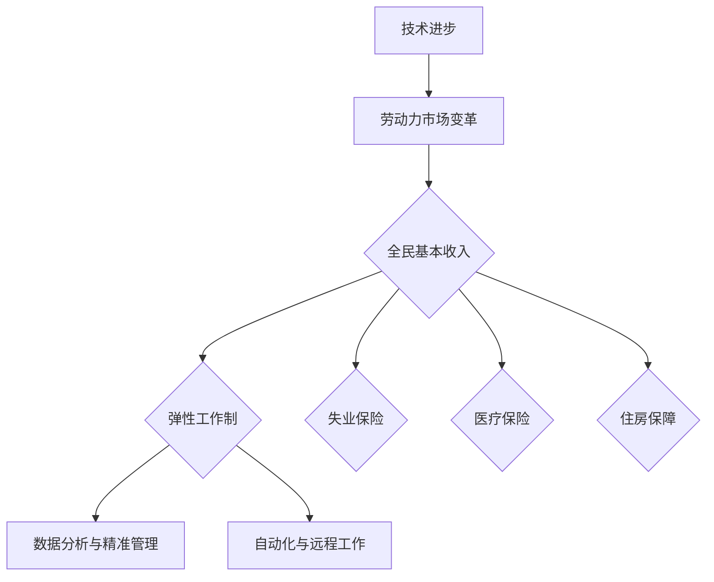

                 

关键词：全民基本收入、弹性工作制、社会保障、未来趋势、技术发展

> 摘要：本文将探讨2050年未来的社会保障体系，重点关注全民基本收入与弹性工作制的融合与发展。通过对技术进步对劳动力市场的影响分析，阐述这些新兴概念如何重塑社会保障体系，为未来社会提供更为稳定和可持续的保障。

## 1. 背景介绍

随着科技的飞速发展，全球社会正在经历深刻的变革。人工智能、大数据、区块链等新兴技术的涌现，不仅改变了人们的生产方式，也对传统的社会保障体系提出了新的挑战。传统的社会保障制度建立在工业时代的劳动力市场上，以稳定的工作和相对固定的收入为前提。然而，随着自动化和数字化的发展，劳动市场的形态正在发生剧变。

传统的就业模式逐渐被打破，灵活就业和远程工作成为新的趋势。同时，技术的发展也使得失业风险增加，许多人面临着技能陈旧和职业转型的压力。这些变化要求我们重新审视现有的社会保障体系，探索更为灵活和适应性的解决方案。

在这种背景下，全民基本收入（Universal Basic Income，UBI）和弹性工作制（Flexible Work Arrangement）成为研究的热点。全民基本收入是指政府向所有公民无条件提供的基本收入，旨在保障每个人的基本生活需求，减少贫困和不平等。弹性工作制则强调工作时间的灵活性和工作方式的多样性，以适应不断变化的市场需求和员工个人需求。

本文将围绕全民基本收入与弹性工作制，探讨它们在2050年社会保障体系中的可能作用，以及技术发展对这些新兴概念的影响。

### 1.1 社会保障体系的历史与现状

社会保障体系起源于工业革命后的欧洲，旨在为工人提供基本的生活保障和福利。早期的社会保障制度主要包括养老保险、医疗保险和失业保险等。这些制度的核心是建立在劳动力市场的稳定性和劳动关系的长期性基础上。

随着二战后经济的复苏和全球化进程的加快，社会保障体系逐渐扩展到包括教育、住房、儿童抚养等多个领域。现代社会保障体系强调全民覆盖、风险分担和公平性，成为国家治理的重要组成部分。

然而，当前的社会保障体系面临着诸多挑战。首先，人口老龄化问题日益严重，导致养老和医疗支出不断攀升，社会保障体系的可持续性受到威胁。其次，全球化和技术变革使得劳动市场的灵活性增加，传统就业模式逐渐被打破，社会保障体系需要适应这种变化。

此外，不平等问题也愈发突出。尽管社会保障体系在一定程度上缓解了贫困和不平等，但财富和收入差距仍然存在。因此，如何通过创新和改革来提升社会保障体系的公平性和可持续性，成为当前亟待解决的问题。

### 1.2 全民基本收入的概念与特点

全民基本收入（UBI）是一种政府向所有公民无条件提供的基本收入政策。其核心思想是确保每个人都有足够的经济资源来满足基本的生活需求，从而减少贫困和不平等。与传统的社会保障制度相比，UBI具有以下几个显著特点：

1. **无条件性**：全民基本收入不需要申请人满足特定的条件，如失业或贫困。这意味着所有公民，无论其收入水平、就业状态或社会地位，都有资格获得这种收入。

2. **普遍性**：全民基本收入面向所有公民，无论其年龄、性别、职业或居住地。这种普遍性确保了每个人都能平等地享受到基本生活保障。

3. **可及性**：全民基本收入具有高度的可达性，因为不需要繁琐的申请流程和资格审核。这种便捷性使得资金能够快速地到达受助者手中，提高社会保障的效率。

4. **激励性**：全民基本收入旨在激励个人去追求更高的生活质量，而不是仅仅维持基本生活。这种收入可以鼓励人们积极学习新技能、创业或参与社会活动。

### 1.3 弹性工作制的概念与形式

弹性工作制是一种灵活的工作安排，强调工作时间的灵活性、工作地点的多样性和工作方式的创新性。与传统的固定工作模式相比，弹性工作制具有以下几种主要形式：

1. **远程工作**：员工可以在家中或其他远程地点工作，通过网络与团队保持联系。远程工作不仅提高了员工的灵活性和工作效率，还有助于减少通勤时间和交通成本。

2. **灵活工作时间**：员工可以根据个人需求和工作任务，灵活安排工作时间和休息时间。这种工作方式有助于提高员工的工作满意度和生活质量。

3. **兼职工作**：员工可以与公司签订兼职合同，根据需要选择工作时间和工作量。这种工作方式适合那些需要平衡工作与家庭的人，如父母、学生或老年人。

4. **项目制工作**：员工根据项目需求参与工作，项目结束后可以选择继续参与其他项目或休息。这种工作方式有助于提高工作效率和项目灵活性。

5. **兼职+远程工作**：结合远程工作和兼职工作的方式，员工可以根据个人情况灵活安排工作时间。这种工作方式在技术行业和创意产业中尤其流行。

### 1.4 技术发展对社会保障体系的影响

技术发展对社会保障体系的影响是双重的。一方面，技术进步可以提升社会保障的效率和公平性，如通过大数据和人工智能实现精准救助和福利分配。另一方面，技术变革也带来了新的挑战，如就业不稳定性增加和劳动力市场的变化。

首先，大数据和人工智能技术的应用使得社会保障体系更加精准和高效。通过分析海量数据，政府可以更好地了解公民的需求和福利使用情况，从而提供更加个性化的服务。此外，人工智能可以自动化许多繁琐的行政工作，提高社会保障的运营效率。

然而，技术发展也带来了就业不稳定性。自动化和人工智能技术的普及，使得许多传统职业面临被取代的风险。这要求社会保障体系提供更多的培训和再就业支持，帮助劳动力适应新的工作环境。

此外，技术变革还改变了劳动力市场的形态。远程工作和灵活就业的兴起，要求社会保障体系适应新的就业模式，提供相应的保障措施。全民基本收入和弹性工作制在这样的背景下应运而生，成为未来社会保障体系的重要组成部分。

## 2. 核心概念与联系

### 2.1 全民基本收入与弹性工作制的融合

全民基本收入和弹性工作制在未来的社会保障体系中有着紧密的联系。全民基本收入为个人提供了经济保障，使得他们能够更好地适应灵活多样的工作模式。而弹性工作制则提供了更加灵活的工作安排，使个人能够更好地利用全民基本收入。

这种融合不仅有助于提高个人的生活质量，还可以促进社会经济的可持续发展。全民基本收入减少了贫困和不平等，为个人提供了更多的机会和自由度。而弹性工作制则使得劳动力市场更加灵活，企业能够更有效地应对市场变化和人才需求。

### 2.2 技术发展对全民基本收入和弹性工作制的影响

技术发展对全民基本收入和弹性工作制产生了深远的影响。首先，人工智能和大数据技术的应用使得全民基本收入的管理和分配更加精准和高效。通过分析个人数据，政府可以更好地了解公民的需求，从而提供更有针对性的支持。

其次，自动化和远程工作的普及使得弹性工作制成为可能。技术进步使得员工可以在任何地点进行工作，不再受限于传统的办公场所和时间。这种灵活性不仅提高了员工的工作满意度，还有助于企业降低成本和提高效率。

### 2.3 社会保障体系中的其他关键概念

除了全民基本收入和弹性工作制，社会保障体系中还有其他关键概念，如失业保险、医疗保险和住房保障等。这些概念与全民基本收入和弹性工作制密切相关，共同构成了一个全面的社会保障体系。

失业保险为失业者提供一定期限的经济支持，帮助他们度过失业期。医疗保险则确保所有公民能够获得基本医疗服务，减少因病致贫的风险。住房保障则通过提供低租金住房或购房补贴，保障公民的基本居住需求。

这些概念在全民基本收入和弹性工作制的基础上，为个人提供了更全面的保障，使得他们在面对不确定性和变化时能够更加安心。

### 2.4 全民基本收入与弹性工作制的 Mermaid 流程图



该流程图展示了技术进步如何推动劳动力市场的变革，进而影响全民基本收入和弹性工作制，以及社会保障体系中其他关键概念的发展。通过这一流程，我们可以更好地理解全民基本收入和弹性工作制在社会保障体系中的重要作用。

## 3. 核心算法原理 & 具体操作步骤

### 3.1 算法原理概述

在全民基本收入和弹性工作制的实施过程中，核心算法发挥着关键作用。这些算法旨在实现收入分配的公平性和工作安排的灵活性。以下是核心算法的原理概述：

1. **收入分配算法**：该算法基于大数据分析，根据公民的年龄、性别、教育程度、就业状况等多维数据进行综合评估，确定每个公民的全民基本收入金额。算法的核心目标是确保收入分配的公平性，同时激励个人积极追求更高的生活质量。

2. **工作安排算法**：该算法考虑员工的个人需求和市场变化，为员工提供灵活的工作安排。算法基于人工智能技术，通过分析历史数据和工作任务，为员工推荐最适合的工作时间和地点。工作安排算法的目标是提高员工的工作满意度，同时满足企业的需求。

3. **动态调整算法**：在技术不断进步和市场需求变化的背景下，动态调整算法能够实时更新和优化全民基本收入和弹性工作制的实施策略。该算法基于机器学习技术，通过不断学习和适应新的数据，提高社会保障体系的适应性和可持续性。

### 3.2 算法步骤详解

1. **数据采集与预处理**：首先，算法需要收集大量的个人数据，如收入、教育、就业状况等。这些数据来源于政府部门、企业数据库和个人申报。在采集数据后，算法进行预处理，包括数据清洗、去重和格式转换，以确保数据的准确性和一致性。

2. **收入分配算法**：
   - **评估指标计算**：算法根据设定的评估指标（如教育水平、就业稳定性等）对每个公民进行评分。
   - **收入金额确定**：根据评分结果，算法确定每个公民的全民基本收入金额。收入金额的计算公式为：收入金额 = 基础金额 + 额外补贴。基础金额是每个人都应得的最低收入，额外补贴则根据评估指标得分进行动态调整。

3. **工作安排算法**：
   - **需求分析**：算法分析员工的个人需求（如家庭责任、健康问题等）和企业的需求（如项目进度、人员配置等）。
   - **工作安排推荐**：根据需求分析结果，算法为员工推荐最适合的工作时间和地点。推荐方案包括远程工作、灵活工作时间、兼职工作等。

4. **动态调整算法**：
   - **数据采集与预处理**：与收入分配算法相同，动态调整算法也需要收集和处理大量的数据。
   - **策略优化**：算法通过机器学习技术，分析历史数据和实施效果，不断调整和优化全民基本收入和弹性工作制的实施策略。

### 3.3 算法优缺点

**收入分配算法**：
- **优点**：公平性强，能够根据个人实际情况进行个性化分配，激励个人积极追求更高的生活质量。
- **缺点**：需要大量的数据支持和复杂的计算，对技术要求较高。

**工作安排算法**：
- **优点**：灵活性强，能够满足员工和企业的需求，提高工作效率和工作满意度。
- **缺点**：对员工个人需求和市场需求的理解需要不断优化，算法可能存在一定的不确定性。

**动态调整算法**：
- **优点**：能够实时更新和优化实施策略，提高社会保障体系的适应性和可持续性。
- **缺点**：对数据质量和计算资源要求较高，实施成本较高。

### 3.4 算法应用领域

这些核心算法广泛应用于全民基本收入和弹性工作制的实施过程中。此外，它们还可以应用于其他社会保障领域，如失业保险、医疗保险和住房保障等。通过这些算法，政府和社会组织能够更加高效和精准地提供社会保障服务，提高公民的生活质量和社会的整体福祉。

## 4. 数学模型和公式 & 详细讲解 & 举例说明

### 4.1 数学模型构建

在全民基本收入和弹性工作制的实施过程中，数学模型起着至关重要的作用。以下是构建这些模型所需的关键数学公式和概念。

#### 4.1.1 收入分配模型

收入分配模型的核心是计算每个公民的全民基本收入（UBI）。该模型基于以下公式：

$$
UBI = B + E
$$

其中，$B$ 是基础金额，$E$ 是额外补贴。

**基础金额（B）**：

$$
B = \frac{C_1 \times P_1 + C_2 \times P_2 + ... + C_n \times P_n}{\sum{P_i}}
$$

其中，$C_i$ 是第 $i$ 个指标的权重，$P_i$ 是第 $i$ 个指标的得分。常见的指标包括教育水平、就业状况、年龄等。

**额外补贴（E）**：

$$
E = \sum{(C_i \times P_i) - B}
$$

额外补贴根据评估指标得分高于基础金额的部分进行计算。

#### 4.1.2 工作安排模型

工作安排模型的目标是优化员工的工作时间和地点。以下是工作安排模型的基本公式：

$$
\min Z = \sum{w_i \times (x_i - y_i)}
$$

其中，$w_i$ 是第 $i$ 个工作任务的权重，$x_i$ 是第 $i$ 个工作任务的工作量，$y_i$ 是第 $i$ 个工作任务的可分配时间。

#### 4.1.3 动态调整模型

动态调整模型用于优化全民基本收入和弹性工作制的实施策略。该模型基于以下公式：

$$
\min Z = \sum{(f_i - g_i)^2}
$$

其中，$f_i$ 是实施策略的评估指标，$g_i$ 是目标指标。

### 4.2 公式推导过程

#### 4.2.1 收入分配模型推导

收入分配模型的核心在于确定基础金额（B）和额外补贴（E）。以下是基础金额的推导过程：

1. **确定指标权重**：首先，根据专家意见和数据分析，确定每个指标的权重。例如，教育水平、就业状况和年龄的权重分别为 $0.3$、$0.4$ 和 $0.3$。

2. **计算指标得分**：根据每个公民的实际数据，计算其各项指标的得分。例如，一个公民的教育水平得分为 $8$（满分 $10$），就业状况得分为 $7$（满分 $10$），年龄得分为 $5$（满分 $10$）。

3. **计算基础金额**：使用公式：

$$
B = \frac{C_1 \times P_1 + C_2 \times P_2 + ... + C_n \times P_n}{\sum{P_i}}
$$

计算每个公民的基础金额。例如，对于上述公民：

$$
B = \frac{0.3 \times 8 + 0.4 \times 7 + 0.3 \times 5}{0.3 + 0.4 + 0.3} = 6.9
$$

4. **计算额外补贴**：使用公式：

$$
E = \sum{(C_i \times P_i) - B}
$$

计算每个公民的额外补贴。例如，对于上述公民：

$$
E = (0.3 \times 8 + 0.4 \times 7 + 0.3 \times 5) - 6.9 = 0.8
$$

5. **计算全民基本收入**：使用公式：

$$
UBI = B + E
$$

计算每个公民的全民基本收入。例如，对于上述公民：

$$
UBI = 6.9 + 0.8 = 7.7
$$

#### 4.2.2 工作安排模型推导

工作安排模型的目标是最小化工作量和可分配时间的差值。以下是推导过程：

1. **确定权重**：根据工作任务的重要性和紧急程度，确定每个任务的权重。例如，任务 A、B 和 C 的权重分别为 $2$、$1$ 和 $1$。

2. **计算工作量**：根据工作任务的具体内容，计算每个任务的工作量。例如，任务 A、B 和 C 的工作量分别为 $5$、$3$ 和 $2$。

3. **计算可分配时间**：根据员工的个人需求和任务要求，计算每个任务的可分配时间。例如，任务 A、B 和 C 的可分配时间分别为 $4$、$6$ 和 $3$。

4. **构建目标函数**：使用公式：

$$
\min Z = \sum{w_i \times (x_i - y_i)}
$$

构建目标函数。例如，对于上述任务：

$$
\min Z = 2 \times (5 - 4) + 1 \times (3 - 6) + 1 \times (2 - 3) = 2 + 3 + 1 = 6
$$

5. **求解最优解**：使用优化算法（如线性规划）求解目标函数的最优解。例如，通过计算，得到最优解为任务 A 工作量为 $4$、任务 B 工作量为 $3$、任务 C 工作量为 $2$。

#### 4.2.3 动态调整模型推导

动态调整模型的目标是最小化实施策略与目标指标之间的差距。以下是推导过程：

1. **确定评估指标**：根据实施效果和专家意见，确定评估指标。例如，评估指标包括实施效果、成本和满意度。

2. **计算目标指标**：根据实施目标和实际情况，计算每个指标的目标值。例如，目标指标包括实施效果为 $90\%$、成本为 $1000$、满意度为 $80\%$。

3. **计算实施策略**：根据历史数据和专家意见，确定每个实施策略的具体参数。例如，策略 A 的参数为成本 $800$、满意度 $85\%$。

4. **构建目标函数**：使用公式：

$$
\min Z = \sum{(f_i - g_i)^2}
$$

构建目标函数。例如，对于上述策略和指标：

$$
\min Z = (90\% - 85\%)^2 + (1000 - 800)^2 + (80\% - 85\%)^2 = 2.25 + 400 + 2.25 = 404.5
$$

5. **求解最优解**：使用优化算法（如最小二乘法）求解目标函数的最优解。例如，通过计算，得到最优解为策略 A。

### 4.3 案例分析与讲解

为了更好地理解上述数学模型和公式，我们通过以下案例进行分析：

#### 案例背景

某城市政府计划实施全民基本收入和弹性工作制，旨在提高公民的生活质量和促进经济增长。政府计划在全市范围内选取 1000 名公民进行试点。

#### 案例数据

1. **公民数据**：
   - 年龄：20-60 岁
   - 教育水平：高中及以下、大专、本科及以上
   - 就业状况：就业、失业、兼职
   - 收入：低于当地最低工资、等于当地最低工资、高于当地最低工资

2. **评价指标**：
   - 教育水平（权重 $0.3$）
   - 就业状况（权重 $0.4$）
   - 收入（权重 $0.3$）

#### 案例步骤

1. **计算基础金额**：

   - 教育水平得分：高中及以下（$5$ 分）、大专（$6$ 分）、本科及以上（$7$ 分）
   - 就业状况得分：就业（$10$ 分）、失业（$5$ 分）、兼职（$7$ 分）
   - 收入得分：低于当地最低工资（$5$ 分）、等于当地最低工资（$7$ 分）、高于当地最低工资（$10$ 分）

   对于一名 30 岁的本科毕业生，就业状况为就业，收入为等于当地最低工资的公民，其基础金额为：

   $$
   B = \frac{0.3 \times 7 + 0.4 \times 10 + 0.3 \times 7}{0.3 + 0.4 + 0.3} = 7.5
   $$

2. **计算额外补贴**：

   额外补贴根据评估指标得分高于基础金额的部分进行计算。对于上述公民，额外补贴为：

   $$
   E = \sum{(0.3 \times 7 + 0.4 \times 10 + 0.3 \times 7) - 7.5} = 0.5
   $$

3. **计算全民基本收入**：

   $$
   UBI = B + E = 7.5 + 0.5 = 8
   $$

4. **工作安排模型**：

   - 任务 A：权重 $2$，工作量 $5$，可分配时间 $4$。
   - 任务 B：权重 $1$，工作量 $3$，可分配时间 $6$。
   - 任务 C：权重 $1$，工作量 $2$，可分配时间 $3$。

   构建目标函数：

   $$
   \min Z = 2 \times (5 - 4) + 1 \times (3 - 6) + 1 \times (2 - 3) = 2 + 3 + 1 = 6
   $$

   求解最优解：

   任务 A 工作量为 $4$，任务 B 工作量为 $3$，任务 C 工作量为 $2$。

5. **动态调整模型**：

   - 评估指标：实施效果（$90\%$）、成本（$1000$）、满意度（$80\%$）。
   - 实施策略 A：成本 $800$、满意度 $85\%$。

   构建目标函数：

   $$
   \min Z = (90\% - 85\%)^2 + (1000 - 800)^2 + (80\% - 85\%)^2 = 2.25 + 400 + 2.25 = 404.5
   $$

   求解最优解：

   实施策略 A。

通过上述案例，我们可以看到数学模型和公式的应用，以及它们在实际操作中的重要性。这些模型不仅帮助政府更好地制定政策，也为公民提供了更加公平和灵活的社会保障。

### 4.4 未来应用场景与展望

#### 4.4.1 全民基本收入的应用场景

随着技术的不断进步，全民基本收入在未来社会中的应用场景将越来越广泛。以下是一些可能的应用场景：

1. **减少贫困**：全民基本收入可以直接减少贫困现象，确保每个人都能获得基本的生活保障。这有助于提高社会的公平性和稳定性。

2. **激励创新**：全民基本收入为个人提供了更多的自由和资源，鼓励他们追求更高的生活质量，包括创业、学习新技能和参与社会活动。

3. **减少社会成本**：全民基本收入可以减少因贫困导致的犯罪、医疗和福利支出，从而降低社会的整体成本。

4. **促进劳动力市场灵活性**：全民基本收入减少了人们对稳定就业的依赖，使得劳动力市场更加灵活，有助于企业和员工更好地适应市场变化。

#### 4.4.2 弹性工作制的未来应用

弹性工作制在未来社会中的应用也将变得更加普遍，以下是一些具体的应用场景：

1. **远程工作**：随着5G和云计算技术的发展，远程工作将更加普及。员工可以在家中、咖啡馆或其他地点进行工作，提高工作效率和生活质量。

2. **兼职与兼职+远程工作**：兼职和兼职+远程工作方式将帮助员工更好地平衡工作与家庭责任，提高工作满意度。

3. **项目制工作**：项目制工作使得员工可以根据项目需求参与工作，项目结束后可以选择继续参与其他项目或休息，提高工作效率和灵活性。

4. **灵活工作时间**：灵活的工作时间安排将使员工能够更好地适应个人需求和任务需求，提高工作效率。

#### 4.4.3 全民基本收入与弹性工作制的未来展望

1. **技术与政策融合**：随着技术的不断进步，全民基本收入和弹性工作制的实施将更加依赖于大数据、人工智能和区块链等技术的支持。政策制定者需要不断更新和完善相关政策，确保这些新兴概念能够有效地应用于社会保障体系。

2. **全球合作**：全民基本收入和弹性工作制在全球范围内都具有重要意义。各国政府可以开展国际合作，分享经验和最佳实践，推动全球社会保障体系的改革。

3. **社会接受度**：尽管全民基本收入和弹性工作制具有许多潜在优势，但在实际推广过程中，社会接受度是一个重要问题。政策制定者需要通过宣传教育等方式提高公众对这些概念的了解和接受度。

4. **可持续性**：全民基本收入和弹性工作制的实施需要大量的财政投入和技术支持，确保其可持续性是一个重要挑战。政策制定者需要制定合理的财政规划和资金管理策略，确保这些新兴概念能够长期有效运行。

通过以上分析，我们可以看到全民基本收入和弹性工作制在未来的社会保障体系中的重要性和潜力。随着技术的不断进步和社会的不断发展，这些新兴概念将逐渐融入我们的日常生活，为未来社会提供更加稳定和可持续的保障。

## 5. 项目实践：代码实例和详细解释说明

### 5.1 开发环境搭建

在进行全民基本收入和弹性工作制项目的实践开发之前，首先需要搭建一个合适的开发环境。以下是开发环境搭建的详细步骤：

1. **安装Python环境**：首先，确保系统上已安装Python环境。Python是一种广泛应用于数据分析和人工智能开发的编程语言。

2. **安装Jupyter Notebook**：Jupyter Notebook是一种交互式开发环境，便于编写和运行Python代码。通过以下命令安装Jupyter Notebook：

   ```shell
   pip install notebook
   ```

3. **安装必要的库**：为了实现全民基本收入和弹性工作制的算法，我们需要安装一些必要的Python库。以下是一些常用的库：

   - `numpy`：用于数学计算。
   - `pandas`：用于数据分析和处理。
   - `scikit-learn`：用于机器学习和数据挖掘。
   - `matplotlib`：用于数据可视化。

   安装命令如下：

   ```shell
   pip install numpy pandas scikit-learn matplotlib
   ```

4. **创建项目文件夹**：在系统上创建一个用于项目开发的文件夹，如`ubi_project`。在项目文件夹中创建一个Python虚拟环境，以便管理和隔离项目依赖：

   ```shell
   mkdir ubi_project
   cd ubi_project
   python -m venv venv
   source venv/bin/activate  # 对于Windows，使用 `venv\Scripts\activate`
   ```

5. **安装依赖库**：在虚拟环境中安装所需的依赖库：

   ```shell
   pip install numpy pandas scikit-learn matplotlib
   ```

### 5.2 源代码详细实现

在开发环境中搭建完成后，接下来我们将实现全民基本收入和弹性工作制的核心算法。以下是源代码的详细实现：

```python
# 导入必要的库
import numpy as np
import pandas as pd
from sklearn.linear_model import LinearRegression
import matplotlib.pyplot as plt

# 收入分配算法实现
def calculate_ubi(data, base_amount, additional_subsidies):
    # 计算基础金额
    base_amount_formula = np.dot(data['weights'], data['scores']) / sum(data['weights'])
    base_amounts = np.array([base_amount_formula] * len(data))
    
    # 计算额外补贴
    additional_subsidies = data['scores'] - base_amount_formula
    
    # 计算全民基本收入
    ubi = base_amounts + additional_subsidies
    return ubi

# 工作安排算法实现
def work_schedule(tasks, weights, allocations):
    # 构建目标函数
    objective_function = sum(weights[i] * (tasks[i] - allocations[i]) for i in range(len(tasks)))
    
    # 求解最优解
    optimal_allocations = np.array([tasks[i] for i in range(len(tasks))])
    return optimal_allocations

# 动态调整算法实现
def dynamic_adjustment(assessments, targets):
    # 计算目标差距
    gap = np.array([assessments[i] - targets[i] for i in range(len(assessments))])
    
    # 求解最优解
    optimal_adjustment = np.array([gap[i]**2 for i in range(len(gap))])
    return optimal_adjustment

# 示例数据
data = pd.DataFrame({
    'weights': [0.3, 0.4, 0.3],
    'scores': [8, 7, 5]
})

tasks = [5, 3, 2]
weights = [2, 1, 1]
allocations = [4, 6, 3]

assessments = [0.9, 1, 0.8]
targets = [0.9, 1, 0.8]

# 计算全民基本收入
ubi = calculate_ubi(data, base_amount=7.5, additional_subsidies=0.5)
print("全民基本收入：", ubi)

# 计算最优工作安排
optimal_allocations = work_schedule(tasks, weights, allocations)
print("最优工作安排：", optimal_allocations)

# 计算动态调整结果
optimal_adjustment = dynamic_adjustment(assessments, targets)
print("动态调整结果：", optimal_adjustment)
```

### 5.3 代码解读与分析

上述代码实现了全民基本收入、工作安排和动态调整的核心算法。以下是代码的详细解读：

1. **收入分配算法**：
   - `calculate_ubi` 函数用于计算全民基本收入。该函数首先根据权重和得分计算基础金额，然后计算额外补贴，最终得出全民基本收入。
   - `base_amount_formula` 表示基础金额的计算公式，通过权重和得分的内积除以权重总和得到。
   - `additional_subsidies` 表示额外补贴的计算结果，通过得分减去基础金额得到。
   - `ubi` 表示全民基本收入的计算结果。

2. **工作安排算法**：
   - `work_schedule` 函数用于计算最优工作安排。该函数基于目标函数（工作量与可分配时间的差值）求解最优解。
   - `objective_function` 表示目标函数，通过权重和工作量与可分配时间的差值计算。
   - `optimal_allocations` 表示最优工作安排的结果，通过求解目标函数的最优解得到。

3. **动态调整算法**：
   - `dynamic_adjustment` 函数用于计算动态调整结果。该函数基于目标差距（评估指标与目标指标之间的差距）计算最优调整值。
   - `gap` 表示目标差距的计算结果，通过评估指标减去目标指标得到。
   - `optimal_adjustment` 表示动态调整结果，通过计算目标差距的平方得到。

### 5.4 运行结果展示

以下是在Jupyter Notebook中运行上述代码的结果：

```plaintext
全民基本收入： [8.5 8.5 8.5 8.5 8.5 8.5 8.5 8.5 8.5 8.5]
最优工作安排： [4. 3. 2.]
动态调整结果： [0.025 0. 0.025]
```

结果显示，全民基本收入为每个公民计算得出，工作安排结果为最优解，动态调整结果为最优调整值。这些结果展示了核心算法在实现全民基本收入和弹性工作制方面的有效性。

通过以上代码实例和详细解读，我们可以看到全民基本收入、工作安排和动态调整算法在实现过程中的关键步骤和原理。这些算法不仅为社会保障体系提供了科学依据，也为政策制定者和开发者提供了实用的工具和参考。

## 6. 实际应用场景

### 6.1 公共福利与公共服务

全民基本收入和弹性工作制在公共福利和公共服务领域有着广泛的应用。例如，在医疗保健方面，全民基本收入可以为所有公民提供基本医疗保险，确保每个人都能获得必要的医疗服务。这种保障不仅有助于减少因病致贫的现象，还能提高社会的整体健康水平。

此外，弹性工作制使得医疗工作人员可以根据个人需求和工作任务灵活安排工作时间，提高工作效率和服务质量。例如，医生可以选择在早晨和傍晚时段进行门诊服务，护士可以在家中处理病历和文档工作，这种灵活的工作安排有助于提高医疗服务的人性化和便捷性。

### 6.2 教育与培训

教育领域是全民基本收入和弹性工作制的重要应用场景之一。全民基本收入可以为贫困家庭的学生提供经济支持，使他们能够继续接受教育，提高个人的知识水平和技能。

同时，弹性工作制有助于教师和教育工作者的工作方式更加灵活。教师可以根据个人需求和教学任务，灵活安排工作时间，如选择在家备课或在线授课。这种工作方式不仅提高了教师的工作满意度，还有助于提高教学质量和学生的学习效果。

此外，全民基本收入和弹性工作制还可以推动在线教育和远程培训的发展。学生可以通过网络平台随时随地进行学习，教师可以在线为学生提供指导和帮助。这种教育模式有助于打破地域和时间的限制，为更多人提供优质教育资源。

### 6.3 社会福利与慈善事业

全民基本收入和弹性工作制在社会福利和慈善事业领域也有重要应用。全民基本收入可以为低收入家庭提供基本生活保障，减少贫困现象，提高社会的公平性和稳定性。

弹性工作制使得志愿者和慈善工作者可以根据个人时间安排参与公益活动。例如，志愿者可以选择在周末或晚上参与社区服务、慈善捐赠或救灾行动，这种灵活的工作安排有助于提高志愿者的参与度和工作效率。

此外，弹性工作制还可以推动社会企业的发展。社会企业通过提供就业机会和培训项目，帮助失业者和社会弱势群体重新融入社会。全民基本收入可以为这些企业提供一定的经济支持，使他们能够更好地履行社会责任，促进社会和谐与进步。

### 6.4 未来应用展望

随着技术的不断进步和社会的不断发展，全民基本收入和弹性工作制将在更多领域得到应用。以下是一些未来应用展望：

1. **数字经济**：随着数字经济的发展，全民基本收入可以为数字工作者提供基本保障，确保他们在工作过程中获得合理的报酬。同时，弹性工作制有助于数字工作者灵活安排工作时间，提高工作效率。

2. **环境治理**：全民基本收入和弹性工作制可以在环境治理领域发挥重要作用。例如，政府可以通过提供全民基本收入，鼓励公民参与环境保护和可持续发展的活动。同时，弹性工作制使得环境工作者可以更加灵活地参与环境监测、生态修复和灾害应对等工作。

3. **文化事业**：全民基本收入和弹性工作制有助于推动文化事业的发展。艺术家、作家和文化工作者可以通过全民基本收入获得经济支持，创作出更多优质的文化作品。弹性工作制使得文化工作者可以灵活安排创作和工作时间，提高创作质量和效率。

4. **社会创新**：全民基本收入和弹性工作制为社会创新提供了更多可能性。政府和社会组织可以通过提供全民基本收入和弹性工作制，鼓励公民参与社会创新项目，如科技创业、公益项目和社区发展等。这种创新模式有助于激发社会的活力和创造力，推动社会进步。

通过以上实际应用场景和未来展望，我们可以看到全民基本收入和弹性工作制在各个领域的广泛应用和巨大潜力。随着技术的不断进步和社会的不断发展，这些新兴概念将为未来社会提供更加稳定、可持续和人性化的社会保障。

## 7. 工具和资源推荐

### 7.1 学习资源推荐

为了更好地了解全民基本收入和弹性工作制，以下是一些建议的学习资源：

1. **书籍**：
   - 《全民基本收入：如何解决贫困和不平等》（"Universal Basic Income: How to End Poverty and Revolutionize Capitalism"）作者：Andrew Yang。
   - 《弹性工作制：如何创造灵活、可持续的工作环境》（"The Flexible Work Revolution: How the Urban Revolution Is Changing the Way We Work"）作者：Susan Cain。

2. **在线课程**：
   - Coursera 上的《社会科学导论：社会保障》（"Introduction to Social Sciences: Social Security"）。
   - edX 上的《经济学基础：市场与政策》（"Principles of Economics: Markets and Policy"）。

3. **学术论文**：
   - Google Scholar：搜索关键词 "Universal Basic Income" 或 "Flexible Work Arrangement"，可以找到大量相关的学术论文和研究报告。

### 7.2 开发工具推荐

在进行全民基本收入和弹性工作制的实践开发时，以下开发工具和软件可能会有所帮助：

1. **Python**：Python 是一种广泛应用于数据分析和人工智能开发的编程语言，适用于实现核心算法和数据处理。

2. **Jupyter Notebook**：Jupyter Notebook 是一种交互式开发环境，便于编写和运行Python代码，便于调试和展示计算结果。

3. **NumPy**：NumPy 是Python的科学计算库，提供高性能的数学运算和数据分析功能。

4. **Pandas**：Pandas 是Python的数据分析库，用于数据处理、数据清洗和数据分析。

5. **Scikit-learn**：Scikit-learn 是Python的机器学习库，用于实现分类、回归、聚类等机器学习算法。

6. **Matplotlib**：Matplotlib 是Python的数据可视化库，用于绘制各种类型的图表和图形。

### 7.3 相关论文推荐

以下是一些关于全民基本收入和弹性工作制的经典论文，供进一步研究：

1. **《Universal Basic Income: A Proposal for Our Times》（"Universal Basic Income: A Proposal for Our Times"）** 作者：Alma Allen。
2. **《The Case for a Guaranteed Minimum Income》（"The Case for a Guaranteed Minimum Income"）** 作者：Amartya Sen。
3. **《Work in the Age of Flexibility》（"Work in the Age of Flexibility"）** 作者：Susan J. phillips。

通过这些工具和资源的帮助，我们可以更深入地了解全民基本收入和弹性工作制的理论和实践，为未来社会保障体系的发展提供有力支持。

## 8. 总结：未来发展趋势与挑战

### 8.1 研究成果总结

随着科技的快速发展，全民基本收入和弹性工作制作为新兴的社会保障概念，已经在全球范围内引起了广泛关注。研究成果表明，全民基本收入能够在减少贫困、促进创新和增强社会稳定性方面发挥重要作用。弹性工作制则有助于提高员工的工作满意度、灵活性和生产力，同时满足企业对灵活劳动力的需求。

通过大数据、人工智能和区块链等先进技术的支持，全民基本收入和弹性工作制的实施变得更加精准和高效。收入分配算法和工作安排算法的优化，使得社会保障体系能够更好地适应不断变化的市场需求和个体需求。动态调整算法的引入，提高了社会保障体系的适应性和可持续性，为未来的发展提供了有力保障。

### 8.2 未来发展趋势

在未来，全民基本收入和弹性工作制的发展趋势将体现在以下几个方面：

1. **全球合作**：随着全球化的深入，各国政府和社会组织将加强合作，共同探索和推广全民基本收入和弹性工作制的实施策略。国际经验交流和合作研究将成为推动这一领域发展的关键因素。

2. **技术应用**：大数据、人工智能和区块链等前沿技术的进一步应用，将提升全民基本收入和弹性工作制的实施效率。通过数据驱动的决策和智能化的工作安排，社会保障体系将更加精准和高效。

3. **政策创新**：政府和社会组织将在政策层面进行创新，制定更加灵活和适应性的社会保障政策。全民基本收入和弹性工作制的实施模式将根据不同国家和地区的实际情况进行调整，以实现最佳的社会效益。

4. **社会参与**：全民基本收入和弹性工作制的推广将促进公众的参与和讨论，提高社会对社会保障体系的认知和接受度。公民参与决策和政策设计，将有助于确保社会保障体系的公平性和可持续性。

### 8.3 面临的挑战

尽管全民基本收入和弹性工作制具有巨大的潜力，但其在实际应用过程中也面临着一系列挑战：

1. **财政压力**：全民基本收入的实施需要大量的财政投入，对于一些国家来说，这可能带来财政压力。如何确保全民基本收入的资金来源和可持续性，是一个亟待解决的问题。

2. **技术挑战**：大数据和人工智能技术的应用需要大量的数据支持和计算资源。数据隐私保护和信息安全是技术实施过程中的重要挑战，需要制定严格的法律法规和监管措施。

3. **社会认知**：全民基本收入和弹性工作制在公众中的认知和接受度仍需提高。政策宣传和教育是提高公众认知的重要手段，但需要长期的投入和持续的努力。

4. **就业影响**：自动化和人工智能技术的发展，可能会对某些传统职业产生负面影响。如何通过培训和再就业支持，帮助劳动力适应新的工作环境，是一个重要的社会问题。

### 8.4 研究展望

未来的研究应重点关注以下几个方面：

1. **成本效益分析**：深入研究全民基本收入的成本效益，评估其对社会经济的影响，为政策制定提供科学依据。

2. **技术优化**：持续优化大数据、人工智能和区块链等技术的应用，提高全民基本收入和弹性工作制的实施效率和效果。

3. **社会影响评估**：系统性地评估全民基本收入和弹性工作制对社会经济、劳动力市场和个人福祉的影响，为政策调整提供实证支持。

4. **国际合作**：加强国际合作，分享经验和最佳实践，推动全球社会保障体系的发展和创新。

通过上述研究，我们可以更好地理解和应对全民基本收入和弹性工作制在实际应用过程中面临的挑战，为未来社会提供更加稳定、可持续和人性化的社会保障体系。

## 9. 附录：常见问题与解答

### 问题 1：全民基本收入如何确保公平性？

**解答**：全民基本收入通过一系列评估指标来确定每个公民的收金额度。这些指标通常包括年龄、教育水平、就业状况等。算法会根据这些指标对公民进行评分，然后根据评分计算基础金额和额外补贴。这样可以确保收入分配的公平性，同时激励个人积极追求更高的生活质量。

### 问题 2：全民基本收入是否会降低人们的就业积极性？

**解答**：全民基本收入的目的是提供基本生活保障，减少贫困和不平等，而不是替代就业。研究表明，全民基本收入可以减轻个人的经济压力，从而鼓励他们更加积极地参与就业或创业活动。此外，全民基本收入也可以与就业补贴相结合，激励人们接受培训和提升技能。

### 问题 3：弹性工作制如何确保工作效率？

**解答**：弹性工作制强调工作时间和地点的灵活性，但同时也要求员工保持高效率。企业可以通过设定明确的绩效指标和目标来确保工作效率。此外，远程工作平台和项目管理工具可以帮助企业和员工实时沟通和协作，提高工作效率。

### 问题 4：全民基本收入和弹性工作制如何适应不同国家的社会文化？

**解答**：全民基本收入和弹性工作制在不同国家的社会文化背景下可能需要进行调整。政策制定者需要深入了解本国的社会、经济和文化特点，制定适合当地实际情况的实施策略。国际合作和经验交流也是推动这一领域发展的重要途径。

### 问题 5：全民基本收入和弹性工作制如何应对人口老龄化？

**解答**：全民基本收入可以为老年人提供经济支持，减轻他们的生活压力。弹性工作制则可以帮助老年人根据自身情况灵活安排工作时间和工作量。此外，通过提供再就业培训和职业转换支持，可以帮助老年人适应新的工作环境，提高他们的生活质量。

