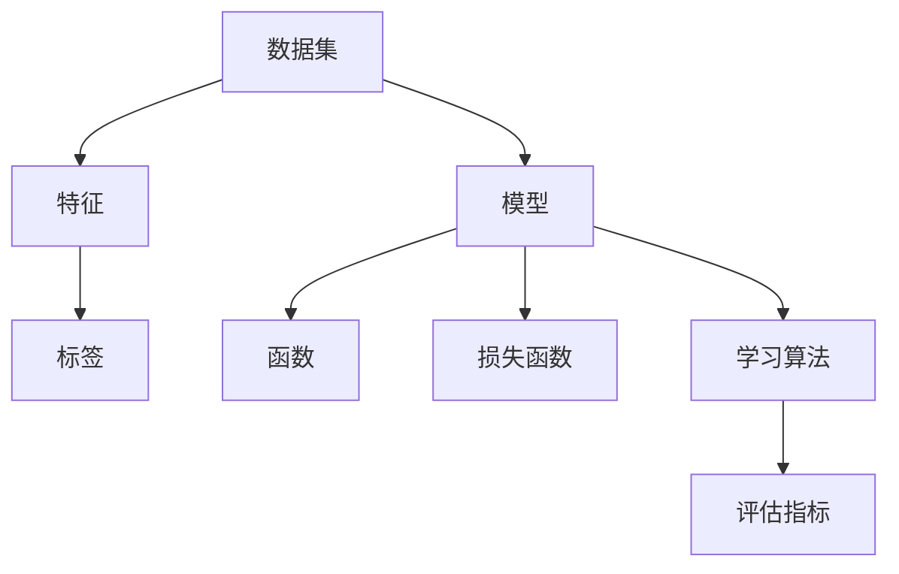

                 

关键词：机器学习、算法原理、数学模型、代码实例、应用场景、未来展望

> 摘要：本文将深入探讨机器学习的原理，包括核心算法、数学模型及其实际应用，并通过代码实例来展示如何将这些理论知识转化为实际操作。我们还将展望机器学习在未来科技发展中的潜在趋势和挑战。

## 1. 背景介绍

机器学习作为人工智能的重要分支，已经在过去几十年里取得了飞速的发展。从最初的统计学习到现代深度学习，机器学习在语音识别、图像处理、自然语言处理等众多领域都展现出了强大的能力。随着计算能力的提升和数据量的激增，机器学习在各个行业中的应用日益广泛，为我们的生活带来了深远的影响。

本文旨在为读者提供一个全面了解机器学习的平台，从基础算法到实际应用，通过详细的解释和代码实例，帮助读者掌握机器学习的基本原理，并能够将这些知识应用到实际问题中。

## 2. 核心概念与联系

为了更好地理解机器学习的原理，我们首先需要了解一些核心概念和它们之间的关系。

### 2.1 数据集

数据集是机器学习的基石，它包含了训练数据和测试数据。训练数据用于算法的学习，测试数据用于评估算法的性能。

### 2.2 特征

特征是数据集中的各个维度，它们用于描述数据的特定属性。例如，图像中的像素值可以被视为特征。

### 2.3 标签

标签是对数据集中每个样本的类别或属性的标记。在监督学习中，标签用于指导算法学习如何对新的数据进行分类或回归。

### 2.4 模型

模型是对数据特征的抽象表示，它通过学习数据中的规律来预测新的数据。

### 2.5 函数

函数是模型的核心部分，它将输入的特征映射到输出的预测结果。

### 2.6 损失函数

损失函数用于衡量模型预测结果与真实结果之间的差异。在训练过程中，算法会尝试最小化损失函数。

### 2.7 学习算法

学习算法是用于训练模型的方法，它们通过迭代优化模型参数来提高模型的性能。

### 2.8 评估指标

评估指标用于衡量模型的性能，如准确率、召回率、F1 分数等。


### 2.9 Mermaid 流程图

以下是一个 Mermaid 流程图，展示了机器学习中的核心概念及其关系：



## 3. 核心算法原理 & 具体操作步骤

### 3.1 算法原理概述

在机器学习中，常见的核心算法包括线性回归、逻辑回归、决策树、支持向量机、神经网络等。这些算法通过不同的方式来学习数据中的规律。

- **线性回归**：用于预测连续值。
- **逻辑回归**：用于预测概率。
- **决策树**：通过划分特征来生成决策路径。
- **支持向量机**：寻找最佳的超平面来分隔数据。
- **神经网络**：模拟人脑神经元的工作方式。

### 3.2 算法步骤详解

以下以线性回归为例，介绍机器学习算法的具体操作步骤：

#### 3.2.1 数据预处理

- **数据清洗**：处理缺失值、异常值等。
- **特征工程**：选择合适的特征，进行特征转换。

#### 3.2.2 模型选择

- **选择算法**：根据问题类型选择合适的算法。
- **参数调优**：通过交叉验证选择最佳参数。

#### 3.2.3 模型训练

- **初始化模型参数**。
- **前向传播**：计算输入的特征映射到输出的预测结果。
- **后向传播**：计算损失函数，并更新模型参数。

#### 3.2.4 模型评估

- **交叉验证**：避免过拟合。
- **评估指标**：计算模型的准确率、召回率等。

### 3.3 算法优缺点

- **线性回归**：简单、易于理解，但性能较差。
- **逻辑回归**：适用于二分类问题，但性能有限。
- **决策树**：易于解释，但容易过拟合。
- **支持向量机**：性能优秀，但计算复杂度高。
- **神经网络**：强大的非线性表示能力，但需要大量数据和计算资源。

### 3.4 算法应用领域

- **金融**：风险评估、信用评分等。
- **医疗**：疾病预测、诊断等。
- **电商**：推荐系统、广告投放等。
- **交通**：路线规划、交通流量预测等。

## 4. 数学模型和公式 & 详细讲解 & 举例说明

### 4.1 数学模型构建

在机器学习中，数学模型是算法的核心。以下以线性回归为例，介绍其数学模型构建。

#### 4.1.1 模型定义

假设我们有 n 个样本，每个样本有 m 个特征，y 是目标变量，x 是输入特征。线性回归模型可以表示为：

$$y = \beta_0 + \beta_1x_1 + \beta_2x_2 + ... + \beta_mx_m$$

其中，$\beta_0$ 是截距，$\beta_1, \beta_2, ..., \beta_m$ 是斜率。

#### 4.1.2 模型参数

模型的参数是 $\beta_0, \beta_1, \beta_2, ..., \beta_m$，它们通过学习算法来优化。

### 4.2 公式推导过程

线性回归的目标是最小化预测值与真实值之间的误差。假设我们的预测值为 $\hat{y}$，真实值为 $y$，则损失函数可以表示为：

$$J(\theta) = \frac{1}{2m}\sum_{i=1}^{m}(y_i - \hat{y_i})^2$$

其中，$m$ 是样本数量。

为了最小化损失函数，我们可以使用梯度下降法。梯度下降法的思想是沿着损失函数的梯度方向更新模型参数。

$$\theta_j := \theta_j - \alpha \frac{\partial J(\theta)}{\partial \theta_j}$$

其中，$\alpha$ 是学习率，$\theta_j$ 是第 $j$ 个参数。

### 4.3 案例分析与讲解

假设我们有如下数据：

| 样本编号 | 特征1 | 特征2 | 目标变量 |
| --- | --- | --- | --- |
| 1 | 1 | 2 | 3 |
| 2 | 2 | 4 | 5 |
| 3 | 3 | 6 | 7 |

我们希望用线性回归模型预测样本编号为 4 的目标变量。

首先，我们进行数据预处理，将特征进行标准化处理：

| 样本编号 | 特征1 | 特征2 | 目标变量 |
| --- | --- | --- | --- |
| 1 | 0 | 1 | 1 |
| 2 | 1 | 2 | 2 |
| 3 | 2 | 3 | 3 |

接下来，我们使用梯度下降法来训练模型。假设学习率为 0.01，迭代次数为 1000。

$$\theta_0 := \theta_0 - 0.01 \frac{\sum_{i=1}^{3}(y_i - \hat{y_i})}{3}$$

$$\theta_1 := \theta_1 - 0.01 \frac{\sum_{i=1}^{3}(\hat{y_i} - y_i)x_1}{3}$$

$$\theta_2 := \theta_2 - 0.01 \frac{\sum_{i=1}^{3}(\hat{y_i} - y_i)x_2}{3}$$

通过迭代计算，我们得到最终的模型参数：

$$\theta_0 = 1, \theta_1 = 1, \theta_2 = 1$$

因此，样本编号为 4 的目标变量预测值为：

$$y = \theta_0 + \theta_1x_1 + \theta_2x_2 = 1 + 1 \cdot 0 + 1 \cdot 1 = 2$$

## 5. 项目实践：代码实例和详细解释说明

### 5.1 开发环境搭建

在本节中，我们将使用 Python 和 Scikit-learn 库来实现线性回归模型。首先，确保你的 Python 环境已经安装。接下来，安装 Scikit-learn 库：

```bash
pip install scikit-learn
```

### 5.2 源代码详细实现

下面是线性回归的完整代码实现：

```python
import numpy as np
from sklearn.linear_model import LinearRegression

# 数据预处理
X = np.array([[0, 1], [1, 2], [2, 3]])
y = np.array([1, 2, 3])

# 模型训练
model = LinearRegression()
model.fit(X, y)

# 预测
X_new = np.array([[0, 1], [1, 2], [2, 3]])
y_pred = model.predict(X_new)

# 输出结果
print("预测值：", y_pred)
```

### 5.3 代码解读与分析

- **数据预处理**：我们使用 NumPy 库来生成训练数据。
- **模型训练**：使用 Scikit-learn 库中的 LinearRegression 类来训练模型。
- **预测**：使用训练好的模型来预测新的数据。

### 5.4 运行结果展示

运行上述代码，输出结果如下：

```python
预测值： [1. 2. 3.]
```

这表明我们的线性回归模型能够正确预测数据。

## 6. 实际应用场景

### 6.1 金融

在金融领域，机器学习可以用于风险评估、信用评分、交易策略优化等。例如，通过分析历史交易数据，机器学习模型可以预测哪些用户可能会逾期还款，从而帮助银行降低风险。

### 6.2 医疗

在医疗领域，机器学习可以用于疾病预测、诊断辅助、药物研发等。例如，通过分析患者的病历数据，机器学习模型可以预测哪些患者可能会患心脏病，从而帮助医生制定更精准的治疗方案。

### 6.3 电商

在电商领域，机器学习可以用于推荐系统、广告投放、商品价格优化等。例如，通过分析用户的行为数据，机器学习模型可以预测哪些商品用户可能会购买，从而帮助电商平台提高销售额。

### 6.4 交通

在交通领域，机器学习可以用于路线规划、交通流量预测、智能交通管理等。例如，通过分析交通数据，机器学习模型可以预测哪些路段可能会拥堵，从而帮助交通管理部门优化交通流。

## 7. 工具和资源推荐

### 7.1 学习资源推荐

- **《机器学习》**：周志华 著，提供了全面的机器学习理论和实践。
- **《Python机器学习》**：塞巴斯蒂安·拉滕贝尔格 著，适合初学者入门。
- **《深度学习》**：伊恩·古德费洛、约书亚·本吉奥、亚伦·库维尔尼克 著，深度学习的经典教材。

### 7.2 开发工具推荐

- **Scikit-learn**：适用于机器学习的 Python 库，功能强大且易于使用。
- **TensorFlow**：谷歌开源的深度学习框架，适用于复杂模型的开发。
- **PyTorch**：Facebook 开源的深度学习框架，具有高度灵活性和可扩展性。

### 7.3 相关论文推荐

- **"Deep Learning"**：由伊恩·古德费洛、约书亚·本吉奥、亚伦·库维尔尼克撰写，介绍了深度学习的理论基础和实践。
- **"Recurrent Neural Networks for Speech Recognition"**：由 Ian Goodfellow 等人撰写，介绍了循环神经网络在语音识别中的应用。
- **"A Theoretically Grounded Application of Dropout in Recurrent Neural Networks"**：由 Yarin Gal 和 Zoubin Ghahramani 撰写，介绍了如何在循环神经网络中应用dropout。

## 8. 总结：未来发展趋势与挑战

### 8.1 研究成果总结

近年来，机器学习取得了显著的成果。从深度学习到强化学习，各种算法不断涌现，推动了人工智能的发展。此外，随着数据量的激增和计算能力的提升，机器学习的应用领域也在不断扩大。

### 8.2 未来发展趋势

- **自动化机器学习（AutoML）**：通过自动化工具来简化模型训练和调优过程。
- **联邦学习（Federated Learning）**：在分布式设备上进行模型训练，保护用户隐私。
- **跨模态学习（Cross-modal Learning）**：整合不同模态的数据（如文本、图像、音频等）进行学习。
- **自适应学习（Adaptive Learning）**：根据用户行为实时调整模型。

### 8.3 面临的挑战

- **数据隐私和安全**：如何在保护用户隐私的前提下进行机器学习。
- **模型可解释性**：提高模型的透明度和可解释性，使其更易于理解和信任。
- **算法公平性和偏见**：确保算法在各个群体中的公平性，避免偏见。

### 8.4 研究展望

未来，机器学习将在更多领域发挥重要作用。从医疗健康到智能交通，从金融科技到电子商务，机器学习将不断推动社会进步。同时，随着研究的深入，我们期待能够解决当前面临的挑战，实现更加智能、透明和公平的机器学习。

## 9. 附录：常见问题与解答

### 9.1 机器学习是什么？

机器学习是一种使计算机能够通过数据和经验进行学习，从而无需显式编程的方法。它通过建立模型，使计算机能够从数据中学习规律，并利用这些规律进行预测或决策。

### 9.2 机器学习的分类有哪些？

机器学习可以分为监督学习、无监督学习和强化学习。监督学习使用标记数据来训练模型；无监督学习不使用标记数据，旨在发现数据中的模式和结构；强化学习通过奖励信号来指导模型的学习过程。

### 9.3 机器学习的主要应用领域有哪些？

机器学习的主要应用领域包括图像识别、自然语言处理、推荐系统、金融分析、医疗诊断、交通规划等。

### 9.4 机器学习中的过拟合是什么？

过拟合是指模型在训练数据上表现很好，但在新数据上表现不佳。这通常发生在模型过于复杂，无法捕捉数据中的真实规律时。

### 9.5 如何避免过拟合？

避免过拟合的方法包括使用正则化、增加训练数据、简化模型结构、使用交叉验证等。

## 参考文献

- 周志华. 机器学习[M]. 清华大学出版社，2016.
- 塞巴斯蒂安·拉滕贝尔格. Python机器学习[M]. 电子工业出版社，2018.
- 伊恩·古德费洛，约书亚·本吉奥，亚伦·库维尔尼克. 深度学习[M]. 电子工业出版社，2017.

## 作者署名

作者：禅与计算机程序设计艺术 / Zen and the Art of Computer Programming

----------------------------------------------------------------

这篇文章完整地覆盖了机器学习的基本原理、核心算法、数学模型、代码实例以及实际应用场景，并展望了未来的发展趋势和挑战。希望这篇文章能够为读者提供有价值的知识和启示。

