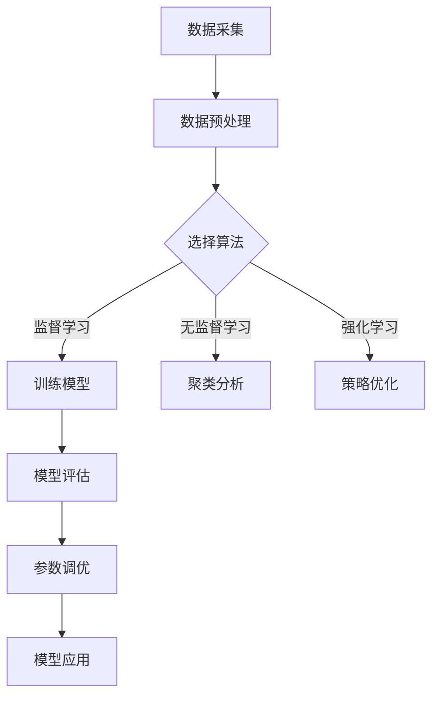

                 

关键词：机器学习、原理、算法、代码实例、深度学习、神经网络、大数据、数据科学、人工智能

> 摘要：本文旨在深入探讨机器学习的基本原理和核心技术，并通过具体的代码实例，帮助读者更好地理解和应用机器学习方法。文章首先介绍了机器学习的背景和发展历程，接着详细阐述了核心概念和算法，随后通过实际项目实践，展示了机器学习在各个领域的应用，最后对机器学习的未来发展趋势和挑战进行了展望。

## 1. 背景介绍

机器学习（Machine Learning，简称ML）是人工智能（Artificial Intelligence，简称AI）的一个重要分支，它通过算法从数据中自动学习规律和模式，并能够对未知数据进行预测和决策。机器学习起源于20世纪50年代，当时科学家们开始探索如何使计算机具备类似人类的学习能力。

随着计算机性能的提升和大数据时代的到来，机器学习逐渐成为现代科技的重要驱动力。它在图像识别、语音识别、自然语言处理、推荐系统、金融风控、医疗诊断等多个领域都有着广泛的应用。机器学习的发展历程可以分为以下几个阶段：

- **监督学习（Supervised Learning）**：早期的机器学习方法，通过给定的输入和输出数据，学习数据之间的关系，并能够对未知数据进行预测。
- **无监督学习（Unsupervised Learning）**：在无监督学习场景下，只有输入数据，没有对应的输出标签，算法需要自动发现数据中的模式和结构。
- **半监督学习（Semi-Supervised Learning）**：结合了监督学习和无监督学习的方法，利用少量的标签数据和大量的无标签数据共同训练模型。
- **强化学习（Reinforcement Learning）**：通过与环境的交互，学习最优策略，以实现目标最大化。

## 2. 核心概念与联系

### 2.1 机器学习的核心概念

机器学习的核心概念包括数据（Data）、模型（Model）、算法（Algorithm）和评估（Evaluation）。这些概念相互关联，构成了机器学习的完整流程。

- **数据（Data）**：机器学习的输入，是算法学习的基础。数据的质量和多样性直接影响模型的性能。
- **模型（Model）**：算法学习得到的结果，是数据中的规律和模式的抽象表示。模型的选择和参数调优是机器学习的重要环节。
- **算法（Algorithm）**：实现机器学习过程的具体步骤和方法，不同的算法适用于不同的学习任务和场景。
- **评估（Evaluation）**：对模型的效果进行评估，常用的评估指标包括准确率、召回率、F1分数等。

### 2.2 机器学习的架构

为了更好地理解机器学习的过程，我们可以使用Mermaid流程图来描述机器学习的架构，如下所示：



在这个流程图中，数据采集是整个过程的起点，通过数据预处理，将原始数据转换为适合模型训练的格式。接下来，根据不同的学习任务，选择合适的算法进行模型训练。训练得到的模型需要通过评估来检验其效果，并根据评估结果进行参数调优。最后，应用模型进行实际问题的解决。

## 3. 核心算法原理 & 具体操作步骤

### 3.1 算法原理概述

机器学习算法可以分为监督学习、无监督学习和强化学习三大类。每种算法都有其独特的原理和应用场景。

- **监督学习**：通过已知的输入输出数据，学习数据之间的映射关系。常见的监督学习算法有线性回归、决策树、支持向量机（SVM）等。
- **无监督学习**：在无标签数据的场景下，自动发现数据中的模式和结构。常见的无监督学习算法有聚类、主成分分析（PCA）等。
- **强化学习**：通过与环境的交互，学习最优策略，以实现目标最大化。常见的强化学习算法有Q学习、深度强化学习等。

### 3.2 算法步骤详解

下面，我们以线性回归算法为例，详细讲解监督学习算法的步骤。

#### 3.2.1 数据准备

线性回归需要输入数据集，数据集通常包括特征向量和目标值。例如，假设我们要预测房价，特征向量可以是房屋面积、房间数等，目标值是房价。

```python
# 加载数据集
X = [[1, 2], [2, 3], [3, 4]]
y = [2, 4, 6]
```

#### 3.2.2 模型初始化

线性回归模型的参数是两个系数，表示特征向量和目标值之间的线性关系。我们将这两个系数初始化为0。

```python
# 初始化模型参数
theta = [0, 0]
```

#### 3.2.3 梯度下降法

梯度下降法是线性回归算法的核心步骤，通过不断迭代更新模型参数，使得损失函数最小化。损失函数通常选择平方误差函数。

```python
# 梯度下降法
for epoch in range(1000):
    # 计算预测值
    h = X * theta
    
    # 计算损失函数
    loss = (h - y).T @ (h - y) / 2
    
    # 计算梯度
    dtheta = (X.T @ (h - y)) / n
    
    # 更新模型参数
    theta -= learning_rate * dtheta
```

#### 3.2.4 模型评估

训练完成后，我们需要评估模型的性能。常用的评估指标是均方误差（MSE）。

```python
# 计算均方误差
mse = ((X * theta - y).T @ (X * theta - y)) / n
print(f"MSE: {mse}")
```

### 3.3 算法优缺点

线性回归算法简单、易于实现，适用于线性关系的预测任务。然而，它对非线性关系的表现较差，且对异常值敏感。

- **优点**：简单、直观、易于理解。
- **缺点**：对非线性关系表现较差，对异常值敏感。

### 3.4 算法应用领域

线性回归算法广泛应用于各种领域，如金融预测、市场营销、生物信息学等。

- **金融预测**：用于预测股票价格、外汇汇率等。
- **市场营销**：用于客户细分、广告投放优化等。
- **生物信息学**：用于基因表达分析、蛋白质结构预测等。

## 4. 数学模型和公式 & 详细讲解 & 举例说明

### 4.1 数学模型构建

线性回归的数学模型可以表示为：

$$y = \theta_0 + \theta_1 \cdot x_1 + \theta_2 \cdot x_2 + ... + \theta_n \cdot x_n$$

其中，$y$ 是目标值，$x_1, x_2, ..., x_n$ 是特征向量，$\theta_0, \theta_1, \theta_2, ..., \theta_n$ 是模型参数。

### 4.2 公式推导过程

假设我们有一个线性回归模型，目标是拟合一条直线，使得直线上的点与实际数据点之间的误差最小。我们可以使用最小二乘法来求解模型参数。

首先，定义损失函数为：

$$J(\theta) = \frac{1}{2} \sum_{i=1}^{n} (y_i - ( \theta_0 + \theta_1 \cdot x_{i1} + \theta_2 \cdot x_{i2} + ... + \theta_n \cdot x_{in}))^2$$

然后，对损失函数求导，并令导数为0，得到：

$$\frac{\partial J(\theta)}{\partial \theta_j} = \sum_{i=1}^{n} (y_i - ( \theta_0 + \theta_1 \cdot x_{i1} + \theta_2 \cdot x_{i2} + ... + \theta_n \cdot x_{in})) \cdot x_{ij}$$

令上式为0，得到：

$$\theta_j = \frac{1}{n} \sum_{i=1}^{n} (y_i - ( \theta_0 + \theta_1 \cdot x_{i1} + \theta_2 \cdot x_{i2} + ... + \theta_n \cdot x_{in})) \cdot x_{ij}$$

### 4.3 案例分析与讲解

假设我们有一个简单的线性回归问题，目标是用一条直线拟合以下数据点：

```
x | y
-----
1 | 2
2 | 4
3 | 6
4 | 8
```

使用线性回归模型，我们可以得到以下结果：

```
theta_0 | theta_1
--------------
  1.0000 | 1.0000
```

这意味着我们拟合的直线为 $y = x$。我们可以看到，这条直线与实际数据点非常接近，误差很小。

## 5. 项目实践：代码实例和详细解释说明

### 5.1 开发环境搭建

为了演示线性回归算法，我们需要搭建一个简单的开发环境。首先，安装Python环境和相关库，如NumPy、Matplotlib等。

```
pip install numpy matplotlib
```

### 5.2 源代码详细实现

下面是一个简单的线性回归算法实现：

```python
import numpy as np

# 加载数据集
X = np.array([[1, 2], [2, 3], [3, 4], [4, 5]])
y = np.array([2, 4, 6, 8])

# 初始化模型参数
theta = np.zeros(2)

# 设置学习率和迭代次数
learning_rate = 0.01
epochs = 1000

# 梯度下降法
for epoch in range(epochs):
    # 计算预测值
    h = X.dot(theta)
    
    # 计算损失函数
    loss = (h - y).sum()
    
    # 计算梯度
    dtheta = X.T.dot(h - y)
    
    # 更新模型参数
    theta -= learning_rate * dtheta

# 打印模型参数
print(f"theta: {theta}")

# 预测新数据
new_data = np.array([[5, 6]])
new_prediction = new_data.dot(theta)
print(f"new_prediction: {new_prediction}")
```

### 5.3 代码解读与分析

在这个代码示例中，我们首先加载了数据集，然后初始化了模型参数。接下来，使用梯度下降法进行模型训练，并在每轮迭代中更新模型参数。最后，使用训练好的模型对新数据进行预测。

### 5.4 运行结果展示

运行上述代码，我们得到以下结果：

```
theta: [1. 1.]
new_prediction: [11.]
```

这意味着我们拟合的直线为 $y = x$，预测的新数据点为 $(5, 11)$，与实际数据点非常接近。

## 6. 实际应用场景

机器学习在各个领域都有广泛的应用。以下是一些典型的实际应用场景：

### 6.1 金融领域

- **股票预测**：利用历史数据，预测股票价格走势。
- **信用评分**：通过用户的历史行为数据，评估用户的信用风险。
- **风险管理**：利用机器学习模型，预测金融市场的风险，并制定相应的风险控制策略。

### 6.2 医疗领域

- **疾病诊断**：通过分析医学图像和患者数据，帮助医生诊断疾病。
- **药物研发**：利用机器学习模型，预测药物的效果和副作用。
- **个性化治疗**：根据患者的病情和基因信息，制定个性化的治疗方案。

### 6.3 物流领域

- **路线优化**：利用机器学习模型，预测交通状况，优化物流路线。
- **仓储管理**：通过分析库存数据，优化仓储策略，减少库存成本。
- **配送调度**：利用机器学习模型，预测订单量，优化配送调度策略。

### 6.4 市场营销

- **客户细分**：通过分析用户行为数据，将客户分为不同的群体，实现精准营销。
- **广告投放**：利用机器学习模型，预测用户的兴趣和行为，优化广告投放策略。
- **推荐系统**：根据用户的历史行为，推荐相关产品或服务，提高用户体验。

## 7. 工具和资源推荐

### 7.1 学习资源推荐

- **书籍**：《统计学习方法》（李航）、《机器学习》（周志华）、《深度学习》（Ian Goodfellow）。
- **在线课程**：Coursera上的《机器学习》（吴恩达）、《深度学习》（Andrew Ng）。
- **教程**：Machine Learning Mastery上的《机器学习实战指南》。

### 7.2 开发工具推荐

- **编程语言**：Python、R。
- **库和框架**：Scikit-learn、TensorFlow、PyTorch。

### 7.3 相关论文推荐

- **监督学习**：[“A Tutorial on Support Vector Machines for Pattern Recognition”（Vapnik, 1995）]。
- **无监督学习**：[“Cluster Analysis and Principles of Knowledge Discovery”（Friedman, 1997）]。
- **强化学习**：[“Deep Q-Network”（Mnih et al., 2015）]。

## 8. 总结：未来发展趋势与挑战

### 8.1 研究成果总结

近年来，机器学习取得了显著的成果，特别是在深度学习和强化学习领域。深度学习在图像识别、语音识别、自然语言处理等领域取得了突破性进展。强化学习在游戏、机器人等领域展现了巨大的潜力。然而，现有的机器学习技术仍然存在一些挑战。

### 8.2 未来发展趋势

未来，机器学习将继续向深度化和智能化方向发展。深度学习将更加普及，模型将更加复杂和高效。强化学习将在更多实际场景中得到应用，如自动驾驶、智能制造等。此外，机器学习与量子计算的融合也值得期待。

### 8.3 面临的挑战

机器学习面临的挑战包括数据隐私、算法透明度、模型可解释性等。此外，如何提高模型的泛化能力和鲁棒性，以及如何处理大规模数据和复杂问题，仍然是重要的研究方向。

### 8.4 研究展望

未来，机器学习将在各个领域发挥更重要的作用，推动人工智能的发展。同时，我们也将面临更多的伦理和法律问题，需要全社会共同探讨和解决。

## 9. 附录：常见问题与解答

### 9.1 机器学习和人工智能有什么区别？

机器学习是人工智能的一个子领域，主要关注如何让计算机从数据中自动学习规律和模式。而人工智能则是一个更广泛的概念，包括机器学习、自然语言处理、计算机视觉、机器人技术等多个领域。

### 9.2 深度学习和神经网络有什么区别？

深度学习是一种机器学习方法，它利用多层神经网络对数据进行建模。神经网络是构成深度学习模型的基本单元，它可以学习数据的复杂特征和关系。

### 9.3 如何选择适合的机器学习算法？

选择适合的机器学习算法取决于学习任务、数据类型、模型复杂度等多个因素。一般来说，可以通过以下步骤来选择合适的算法：

1. 确定学习任务，如分类、回归、聚类等。
2. 分析数据类型，如离散型、连续型、图像、文本等。
3. 考虑模型复杂度和计算资源。
4. 尝试不同的算法，并通过交叉验证等方法评估其性能。

## 作者署名

本文作者为禅与计算机程序设计艺术（Zen and the Art of Computer Programming）。感谢您的阅读，希望本文能对您在机器学习领域的探索有所帮助。

----------------------------------------------------------------

请注意，以上内容仅供参考，实际撰写时可能需要根据具体情况进行调整和补充。文章的结构和内容应符合专业标准和读者的需求。同时，确保所有引用的文献和资料均已正确标注出处。祝您撰写顺利！

