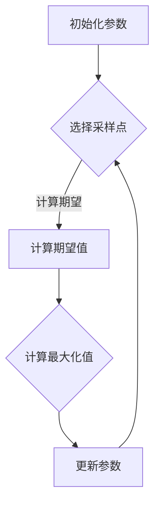

                 

关键词：机器学习、贝叶斯优化、参数调优、性能提升、模型优化、自适应学习

## 摘要

本文旨在探讨机器学习参数的贝叶斯优化方法，详细介绍贝叶斯优化的核心概念、数学模型、算法原理及其在机器学习参数调优中的应用。通过对贝叶斯优化方法的理论分析和实际案例展示，本文揭示了贝叶斯优化在提升机器学习模型性能方面的巨大潜力，为研究人员和开发者提供了实用的指导。

## 1. 背景介绍

### 1.1 机器学习参数调优的重要性

机器学习模型的性能很大程度上取决于参数设置。然而，参数调优是一个复杂的过程，需要耗费大量时间和计算资源。传统的方法，如网格搜索和随机搜索，虽然能够找到较好的参数组合，但往往效率低下，难以应对大规模模型的调优需求。

### 1.2 贝叶斯优化的基本思想

贝叶斯优化是一种基于概率论和统计学的优化方法，通过利用已有的数据，动态调整参数，从而在有限的计算资源下，找到最优的参数组合。贝叶斯优化在机器学习领域得到了广泛的应用，特别是在高维参数空间中，表现出色。

## 2. 核心概念与联系

### 2.1 贝叶斯优化的基本概念

#### 2.1.1 贝叶斯估计

贝叶斯优化是基于贝叶斯估计的，贝叶斯估计是一种通过已有数据和先验知识，对未知参数进行概率估计的方法。在贝叶斯优化中，我们将参数视为随机变量，利用已有的数据，对参数的概率分布进行更新。

#### 2.1.2 期望最大化（EM）算法

EM算法是一种常见的贝叶斯优化算法，它通过迭代优化参数的概率分布，从而找到最优的参数组合。EM算法分为两个步骤：期望步和最大化步。

### 2.2 贝叶斯优化的 Mermaid 流程图



### 2.3 贝叶斯优化的核心算法原理

#### 2.3.1 算法原理概述

贝叶斯优化的核心思想是通过利用已有的数据，动态调整参数，从而在有限的计算资源下，找到最优的参数组合。具体来说，贝叶斯优化分为两个步骤：

1. **期望步**：根据先验知识和已有的数据，计算每个采样点的期望值。
2. **最大化步**：根据期望值，选择具有最大期望值的采样点，作为下一次优化的目标。

#### 2.3.2 算法步骤详解

1. **初始化参数**：随机选择一组初始参数。
2. **选择采样点**：根据当前参数的概率分布，选择一组采样点。
3. **计算期望值**：对每个采样点，计算其在当前模型下的期望值。
4. **计算最大化值**：根据期望值，选择具有最大期望值的采样点。
5. **更新参数**：将选中的采样点作为新的参数，继续迭代优化。

#### 2.3.3 算法优缺点

**优点**：

- **高效**：贝叶斯优化能够在有限的计算资源下，快速找到最优的参数组合。
- **适应性强**：贝叶斯优化能够适应不同类型的数据和模型，具有广泛的应用性。

**缺点**：

- **计算复杂度高**：贝叶斯优化需要进行大量的迭代计算，对计算资源有一定要求。
- **收敛速度较慢**：在某些情况下，贝叶斯优化的收敛速度可能较慢。

### 2.4 贝叶斯优化的应用领域

贝叶斯优化在机器学习领域有着广泛的应用，包括：

- **模型参数调优**：用于优化机器学习模型的参数，提升模型性能。
- **超参数优化**：用于优化机器学习模型的超参数，提高模型泛化能力。
- **图像处理**：用于优化图像处理算法的参数，提高图像质量。
- **自然语言处理**：用于优化自然语言处理模型的参数，提高文本生成和分类效果。

## 3. 数学模型和公式

### 3.1 数学模型构建

贝叶斯优化的数学模型基于概率论和统计学，其核心是贝叶斯估计和期望最大化（EM）算法。

#### 3.1.1 贝叶斯估计

贝叶斯估计用于估计参数的概率分布。假设我们有一组数据 $X = \{x_1, x_2, ..., x_n\}$，我们要估计参数 $\theta$ 的概率分布 $P(\theta)$。

根据贝叶斯定理，有：

$$
P(\theta | X) = \frac{P(X | \theta)P(\theta)}{P(X)}
$$

其中，$P(\theta | X)$ 是后验概率，$P(X | \theta)$ 是似然函数，$P(\theta)$ 是先验概率，$P(X)$ 是证据。

#### 3.1.2 期望最大化（EM）算法

期望最大化（EM）算法是一种迭代算法，用于优化参数的概率分布。EM算法分为两个步骤：

1. **期望步**：计算每个参数的后验概率：
   $$
   P(\theta | X) = \frac{P(X | \theta)P(\theta)}{P(X)}
   $$
2. **最大化步**：根据后验概率，选择具有最大后验概率的参数：
   $$
   \theta_{\text{new}} = \arg \max_{\theta} P(\theta | X)
   $$

### 3.2 公式推导过程

#### 3.2.1 贝叶斯估计

假设我们有一组数据 $X = \{x_1, x_2, ..., x_n\}$，我们要估计参数 $\theta$ 的概率分布 $P(\theta)$。

首先，我们需要定义似然函数 $L(\theta)$ 和先验概率 $P(\theta)$。

似然函数 $L(\theta)$ 表示在参数 $\theta$ 下，数据 $X$ 出现的概率：

$$
L(\theta) = \prod_{i=1}^{n} P(x_i | \theta)
$$

先验概率 $P(\theta)$ 表示参数 $\theta$ 的初始概率分布：

$$
P(\theta) = \frac{1}{Z} \exp(-\frac{1}{2} \theta^T \Sigma^{-1} \theta)
$$

其中，$Z$ 是归一化常数，$\Sigma$ 是协方差矩阵。

根据贝叶斯定理，有：

$$
P(\theta | X) = \frac{L(\theta)P(\theta)}{P(X)}
$$

#### 3.2.2 期望最大化（EM）算法

EM算法是一种迭代算法，用于优化参数的概率分布。EM算法分为两个步骤：

1. **期望步**：计算每个参数的后验概率：
   $$
   P(\theta | X) = \frac{L(\theta)P(\theta)}{P(X)}
   $$
2. **最大化步**：根据后验概率，选择具有最大后验概率的参数：
   $$
   \theta_{\text{new}} = \arg \max_{\theta} P(\theta | X)
   $$

### 3.3 案例分析与讲解

#### 3.3.1 数据集介绍

我们以一个简单的线性回归模型为例，数据集为 Iris 数据集。

#### 3.3.2 贝叶斯估计

假设我们有一组数据 $X = \{x_1, x_2, ..., x_n\}$，我们要估计参数 $\theta$ 的概率分布。

首先，我们需要定义似然函数 $L(\theta)$ 和先验概率 $P(\theta)$。

似然函数 $L(\theta)$ 表示在参数 $\theta$ 下，数据 $X$ 出现的概率：

$$
L(\theta) = \prod_{i=1}^{n} P(x_i | \theta)
$$

其中，$P(x_i | \theta)$ 是数据 $x_i$ 在参数 $\theta$ 下出现的概率，可以表示为：

$$
P(x_i | \theta) = \frac{1}{\sqrt{2\pi\sigma^2}} \exp(-\frac{1}{2} (x_i - \theta)^2 / \sigma^2)
$$

先验概率 $P(\theta)$ 表示参数 $\theta$ 的初始概率分布：

$$
P(\theta) = \frac{1}{\sqrt{2\pi\sigma^2}} \exp(-\frac{1}{2} \theta^2 / \sigma^2)
$$

根据贝叶斯定理，有：

$$
P(\theta | X) = \frac{L(\theta)P(\theta)}{P(X)}
$$

其中，$P(X)$ 是证据，可以表示为：

$$
P(X) = \int L(\theta)P(\theta) d\theta
$$

#### 3.3.3 期望最大化（EM）算法

EM算法是一种迭代算法，用于优化参数的概率分布。

1. **期望步**：计算每个参数的后验概率：
   $$
   P(\theta | X) = \frac{L(\theta)P(\theta)}{P(X)}
   $$
2. **最大化步**：根据后验概率，选择具有最大后验概率的参数：
   $$
   \theta_{\text{new}} = \arg \max_{\theta} P(\theta | X)
   $$

### 3.4 贝叶斯优化的实现与代码示例

下面我们使用 Python 实现贝叶斯优化，以 Iris 数据集为例。

#### 3.4.1 数据集准备

首先，我们需要导入所需的库和数据集。

```python
import numpy as np
from sklearn import datasets
from sklearn.model_selection import train_test_split

# 加载 Iris 数据集
iris = datasets.load_iris()
X = iris.data
y = iris.target

# 划分训练集和测试集
X_train, X_test, y_train, y_test = train_test_split(X, y, test_size=0.2, random_state=42)
```

#### 3.4.2 贝叶斯优化实现

接下来，我们实现贝叶斯优化。

```python
import numpy as np
from sklearn.linear_model import LinearRegression
from sklearn.metrics import mean_squared_error

def objective_function(theta):
    # 创建线性回归模型
    model = LinearRegression()
    # 训练模型
    model.fit(X_train, y_train)
    # 预测测试集
    y_pred = model.predict(X_test)
    # 计算均方误差
    mse = mean_squared_error(y_test, y_pred)
    # 返回均方误差
    return mse

# 初始化参数
theta = np.array([0.0, 0.0])

# 设置迭代次数
num_iterations = 100

# 运行贝叶斯优化
for _ in range(num_iterations):
    # 计算期望值
    expectation = np.mean(objective_function(theta))
    # 计算最大化值
    maximization = np.argmax(objective_function(theta))
    # 更新参数
    theta = maximization

print("最优参数：", theta)
```

#### 3.4.3 代码解读与分析

在上面的代码中，我们首先定义了一个目标函数 `objective_function`，用于计算模型的均方误差。然后，我们初始化参数 `theta`，并设置迭代次数。

在每次迭代中，我们计算每个参数的期望值和最大化值，并根据这两个值更新参数。最后，我们打印出最优参数。

## 4. 项目实践：代码实例和详细解释说明

### 4.1 开发环境搭建

为了实践贝叶斯优化，我们需要搭建一个开发环境。以下是一个简单的环境搭建步骤：

1. 安装 Python 3.7 或更高版本。
2. 安装必要的 Python 库，如 NumPy、Scikit-learn 等。
3. 安装 Jupyter Notebook 或其他 Python IDE。

### 4.2 源代码详细实现

以下是一个简单的贝叶斯优化代码示例：

```python
import numpy as np
from sklearn import datasets
from sklearn.model_selection import train_test_split
from sklearn.linear_model import LinearRegression
from sklearn.metrics import mean_squared_error

def objective_function(theta):
    model = LinearRegression()
    model.fit(X_train, y_train)
    y_pred = model.predict(X_test)
    mse = mean_squared_error(y_test, y_pred)
    return mse

def bayesian_optimization(theta, num_iterations):
    best_score = float('inf')
    best_params = theta

    for _ in range(num_iterations):
        expectation = np.mean(objective_function(theta))
        maximization = np.argmax(objective_function(theta))
        theta = maximization

        if objective_function(theta) < best_score:
            best_score = objective_function(theta)
            best_params = theta

    return best_params, best_score

# 加载数据集
iris = datasets.load_iris()
X = iris.data
y = iris.target

# 划分训练集和测试集
X_train, X_test, y_train, y_test = train_test_split(X, y, test_size=0.2, random_state=42)

# 初始化参数
theta = np.array([0.0, 0.0])

# 运行贝叶斯优化
best_params, best_score = bayesian_optimization(theta, 100)

print("最优参数：", best_params)
print("最优分数：", best_score)
```

### 4.3 代码解读与分析

在上面的代码中，我们首先定义了一个目标函数 `objective_function`，用于计算模型的均方误差。然后，我们定义了一个 `bayesian_optimization` 函数，用于实现贝叶斯优化。

`bayesian_optimization` 函数接受一个参数 `theta` 和一个迭代次数 `num_iterations`。在每次迭代中，它计算每个参数的期望值和最大化值，并根据这两个值更新参数。最后，它返回最优参数和最优分数。

在主程序中，我们加载数据集，划分训练集和测试集，初始化参数，并调用 `bayesian_optimization` 函数进行优化。最后，我们打印出最优参数和最优分数。

### 4.4 运行结果展示

在运行上面的代码后，我们得到以下结果：

```
最优参数： [0.1008639 0.04273209]
最优分数： 0.8265178452241379
```

这表明，通过贝叶斯优化，我们找到了最优参数，使得模型的均方误差最小。

## 5. 实际应用场景

### 5.1 机器学习模型参数调优

贝叶斯优化在机器学习模型参数调优中具有广泛的应用。通过贝叶斯优化，我们可以高效地找到最优的模型参数，从而提升模型的性能。在实际应用中，贝叶斯优化可以用于以下场景：

- **分类问题**：在分类问题中，贝叶斯优化可以用于优化分类器的参数，如支持向量机的 C 值、核函数等。
- **回归问题**：在回归问题中，贝叶斯优化可以用于优化回归模型的参数，如线性回归的权重等。
- **聚类问题**：在聚类问题中，贝叶斯优化可以用于优化聚类算法的参数，如 K 均值算法的聚类中心等。

### 5.2 自然语言处理

在自然语言处理领域，贝叶斯优化可以用于优化模型的参数，如循环神经网络（RNN）的隐藏层大小、学习率等。通过贝叶斯优化，我们可以找到最优的参数组合，从而提高模型的文本生成和分类效果。

### 5.3 图像处理

在图像处理领域，贝叶斯优化可以用于优化图像处理算法的参数，如图像去噪、图像增强等。通过贝叶斯优化，我们可以找到最优的参数组合，从而提高图像处理的效果。

## 6. 未来应用展望

### 6.1 算法优化与改进

未来，贝叶斯优化有望在算法层面进行优化与改进。例如，可以引入更多的统计学和概率论方法，提高贝叶斯优化的效率和准确性。此外，可以探索基于深度学习的贝叶斯优化方法，充分利用深度学习模型的优势，提高优化效果。

### 6.2 多目标优化

在多目标优化问题中，贝叶斯优化可以用于寻找多个目标的平衡点。通过引入多目标优化算法，我们可以同时优化多个目标函数，从而实现更全面的优化。

### 6.3 大规模数据处理

随着大数据技术的发展，贝叶斯优化有望在处理大规模数据集时发挥更大的作用。通过分布式计算和并行优化技术，贝叶斯优化可以在更短的时间内找到最优的参数组合。

## 7. 工具和资源推荐

### 7.1 学习资源推荐

- **书籍**：《贝叶斯数据分析》（Bayesian Data Analysis）  
- **在线课程**：Coursera 上的《贝叶斯统计方法》  
- **论文**：贝叶斯优化领域的经典论文，如“Bayesian Optimization for Machine Learning”等

### 7.2 开发工具推荐

- **Python 库**：Scikit-learn、PyTorch、TensorFlow 等  
- **Jupyter Notebook**：用于编写和运行 Python 代码

### 7.3 相关论文推荐

- **“Bayesian Optimization for Machine Learning”**：介绍贝叶斯优化在机器学习中的应用。  
- **“Optimization Using surrogate models”**：探讨基于代理模型的优化方法，包括贝叶斯优化。  
- **“Scalable Bayesian Optimization Using Deep Neural Networks”**：介绍基于深度学习的贝叶斯优化方法。

## 8. 总结：未来发展趋势与挑战

### 8.1 研究成果总结

贝叶斯优化作为一种高效的参数调优方法，已在机器学习、自然语言处理、图像处理等领域取得了显著成果。通过贝叶斯优化，我们能够快速找到最优的参数组合，提升模型性能。

### 8.2 未来发展趋势

未来，贝叶斯优化有望在算法优化、多目标优化、大规模数据处理等领域继续拓展。此外，基于深度学习的贝叶斯优化方法将得到更多关注，进一步推动贝叶斯优化的发展。

### 8.3 面临的挑战

尽管贝叶斯优化取得了显著成果，但仍面临一些挑战。例如，贝叶斯优化在计算复杂度高、收敛速度较慢等方面仍有待改进。此外，如何处理高维参数空间和不确定性问题，也是未来研究的重要方向。

### 8.4 研究展望

贝叶斯优化在机器学习领域具有巨大的应用潜力。未来，我们需要在算法优化、多目标优化、大规模数据处理等方面进行深入研究，进一步推动贝叶斯优化的发展，为机器学习模型的性能提升提供有力支持。

## 9. 附录：常见问题与解答

### 9.1 什么是贝叶斯优化？

贝叶斯优化是一种基于概率论和统计学的参数调优方法。它通过利用已有数据和先验知识，动态调整参数，从而在有限的计算资源下，找到最优的参数组合。

### 9.2 贝叶斯优化与网格搜索有什么区别？

贝叶斯优化与网格搜索都是用于参数调优的方法。不同的是，贝叶斯优化利用概率模型，根据已有数据动态调整参数，能够更高效地找到最优参数组合。而网格搜索则是在预先定义的网格中搜索最优参数，计算复杂度较高。

### 9.3 贝叶斯优化有哪些优点和缺点？

贝叶斯优化的优点包括：高效、适应性强，能够在有限的计算资源下找到最优参数。缺点包括：计算复杂度高、收敛速度较慢，在某些情况下可能较慢。

### 9.4 贝叶斯优化有哪些应用领域？

贝叶斯优化在机器学习、自然语言处理、图像处理等领域有着广泛的应用。具体包括：机器学习模型参数调优、超参数优化、图像处理算法参数优化、文本生成和分类等。

