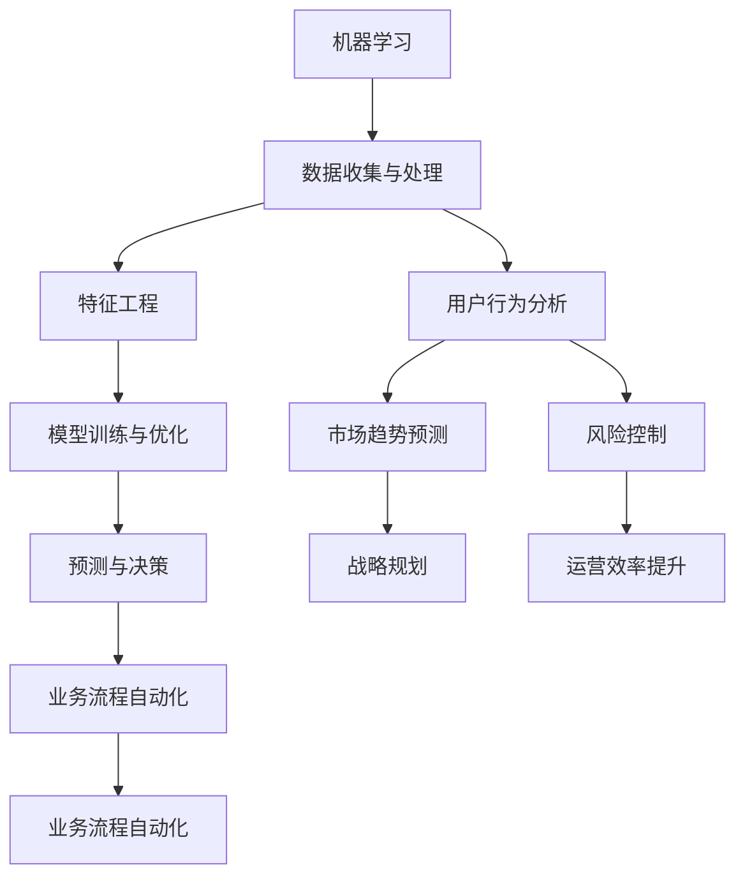

                 

关键词：机器学习，自动化创业，算法应用，创业案例分析，未来展望

> 摘要：随着人工智能技术的飞速发展，机器学习在自动化创业中的应用逐渐成为行业热点。本文将探讨机器学习技术在自动化创业中的关键作用，分析其应用场景、算法原理及实践案例，并对未来的发展趋势进行展望。

## 1. 背景介绍

近年来，随着计算机性能的提升和算法研究的深入，机器学习（Machine Learning，ML）已经成为人工智能（Artificial Intelligence，AI）领域的核心驱动力。机器学习通过模拟人类学习过程，使计算机系统能够从数据中自动提取规律，进行预测和决策，极大地提升了数据处理和分析的效率。

在创业领域，自动化创业（Automated Entrepreneurship）模式逐渐兴起。自动化创业指的是利用现代技术，尤其是人工智能技术，实现创业过程的自动化，从而降低创业成本、提高创业成功率。机器学习在自动化创业中的应用，主要体现在以下几个方面：

1. **数据分析和挖掘**：通过机器学习技术，创业公司可以快速、高效地处理海量数据，提取有价值的信息，为业务决策提供支持。
2. **自动化营销**：利用机器学习算法，创业公司可以精准定位潜在客户，实现个性化推荐和营销。
3. **智能客服和客户服务**：通过机器学习构建的智能客服系统，可以自动化处理客户咨询，提高客户满意度。
4. **供应链优化**：机器学习算法可以帮助创业公司在供应链管理中实现库存优化、物流优化等，降低运营成本。

## 2. 核心概念与联系

### 2.1 机器学习基本概念

机器学习是人工智能的核心组成部分，主要研究如何让计算机从数据中学习，并自动进行决策和预测。根据学习方式的不同，机器学习可以分为以下几种类型：

1. **监督学习（Supervised Learning）**：通过已有标签数据进行学习，训练模型来预测新数据的标签。
2. **无监督学习（Unsupervised Learning）**：在没有标签数据的情况下，通过数据内在结构进行学习，如聚类、降维等。
3. **强化学习（Reinforcement Learning）**：通过试错和奖励机制，让机器在与环境互动中不断学习，提高决策质量。

### 2.2 机器学习在创业中的应用

在创业过程中，机器学习的应用可以从以下几个方面进行：

1. **用户行为分析**：通过分析用户行为数据，创业公司可以了解用户喜好，优化产品和服务。
2. **市场趋势预测**：利用历史市场数据，机器学习算法可以预测市场趋势，帮助创业公司制定战略规划。
3. **风险控制**：通过分析金融数据，机器学习算法可以帮助创业公司进行风险控制，降低财务风险。
4. **业务自动化**：利用机器学习构建自动化系统，可以提高运营效率，降低人力成本。

### 2.3 机器学习与自动化创业架构图



## 3. 核心算法原理 & 具体操作步骤

### 3.1 算法原理概述

在自动化创业中，常用的机器学习算法包括决策树（Decision Tree）、支持向量机（Support Vector Machine，SVM）、神经网络（Neural Networks）等。这些算法的基本原理如下：

1. **决策树**：通过一系列规则对数据进行分类或回归。每个节点表示一个特征，每个分支代表该特征的一个可能取值。
2. **支持向量机**：通过找到一个最优的超平面，将不同类别的数据分开。支持向量是那些距离超平面最近的样本点。
3. **神经网络**：模拟人脑神经元之间的连接，通过多层网络结构进行复杂函数的拟合和预测。

### 3.2 算法步骤详解

1. **数据收集与处理**：收集与创业相关的数据，包括用户行为、市场趋势、财务数据等。对数据进行清洗、预处理，去除噪声和异常值。
2. **特征工程**：选择与业务目标相关的特征，对特征进行转换和标准化，提高模型性能。
3. **模型训练与优化**：选择合适的算法，使用训练数据集进行模型训练。通过交叉验证和网格搜索等技术，优化模型参数。
4. **预测与决策**：使用训练好的模型对未知数据进行预测，根据预测结果进行决策。

### 3.3 算法优缺点

1. **决策树**：简单易懂，易于解释。但当数据复杂度较高时，容易出现过拟合。
2. **支持向量机**：具有较强的泛化能力，但计算复杂度高，对大量数据的处理能力有限。
3. **神经网络**：适用于复杂函数的拟合，但模型复杂，训练时间长，且难以解释。

### 3.4 算法应用领域

1. **用户行为分析**：决策树和神经网络可以用于分析用户行为，为产品优化提供支持。
2. **市场趋势预测**：支持向量机和神经网络可以用于市场趋势预测，帮助制定战略规划。
3. **风险控制**：神经网络和支持向量机可以用于金融数据的风险控制。
4. **业务自动化**：神经网络和决策树可以用于构建自动化系统，提高业务流程的效率。

## 4. 数学模型和公式 & 详细讲解 & 举例说明

### 4.1 数学模型构建

在机器学习中，常用的数学模型包括线性回归、逻辑回归、决策树等。下面以线性回归为例，介绍数学模型的构建过程。

### 4.2 公式推导过程

假设我们有一个回归模型，需要预测房价 \(Y\)。根据线性回归模型，我们可以建立以下公式：

\[ Y = \beta_0 + \beta_1 \cdot X \]

其中，\(Y\) 是房价，\(X\) 是影响房价的特征，如房屋面积、地理位置等。\( \beta_0 \) 和 \( \beta_1 \) 分别是模型的截距和斜率，需要通过训练数据集进行求解。

### 4.3 案例分析与讲解

假设我们有以下数据：

| 房屋面积 (X) | 房价 (Y) |
| ------------ | -------- |
| 100          | 200      |
| 120          | 240      |
| 150          | 300      |

我们使用最小二乘法求解线性回归模型的参数：

\[ \beta_0 = \frac{\sum Y - \beta_1 \sum X}{N} \]
\[ \beta_1 = \frac{N \sum XY - \sum X \sum Y}{N \sum X^2 - (\sum X)^2} \]

代入数据，得到：

\[ \beta_0 = \frac{700 - 450}{3} = 50 \]
\[ \beta_1 = \frac{3 \cdot 450 - 300 \cdot 700}{3 \cdot 25000 - 300^2} = \frac{1350 - 2100}{7500 - 9000} = \frac{-750}{-1500} = 0.5 \]

因此，线性回归模型为：

\[ Y = 50 + 0.5X \]

### 4.4 案例分析与讲解

假设我们想预测一个面积为 130 平方米的房屋的房价。根据线性回归模型，我们有：

\[ Y = 50 + 0.5 \cdot 130 = 115 \]

因此，预测的房价为 115 万元。

## 5. 项目实践：代码实例和详细解释说明

### 5.1 开发环境搭建

为了实现机器学习在自动化创业中的应用，我们需要搭建一个开发环境。以下是开发环境的基本要求：

1. 操作系统：Windows/Linux/MacOS
2. 编程语言：Python
3. 机器学习库：scikit-learn、TensorFlow、PyTorch等
4. 数据库：MySQL、MongoDB等

### 5.2 源代码详细实现

以下是一个使用 scikit-learn 实现线性回归的示例代码：

```python
from sklearn.linear_model import LinearRegression
from sklearn.model_selection import train_test_split
from sklearn.metrics import mean_squared_error

# 加载数据
X, Y = load_data()

# 划分训练集和测试集
X_train, X_test, Y_train, Y_test = train_test_split(X, Y, test_size=0.2, random_state=42)

# 创建线性回归模型
model = LinearRegression()

# 训练模型
model.fit(X_train, Y_train)

# 预测测试集
Y_pred = model.predict(X_test)

# 评估模型
mse = mean_squared_error(Y_test, Y_pred)
print("MSE:", mse)

# 输出模型参数
print("Coefficients:", model.coef_)
print("Intercept:", model.intercept_)
```

### 5.3 代码解读与分析

上述代码实现了线性回归模型的训练、预测和评估。首先，从数据集中加载特征和标签。然后，使用 train_test_split 函数将数据集划分为训练集和测试集。接下来，创建 LinearRegression 模型，并使用 fit 方法进行模型训练。最后，使用 predict 方法进行预测，并使用 mean_squared_error 函数评估模型性能。

### 5.4 运行结果展示

假设我们训练集和测试集的 MRE（Mean Relative Error）分别为 0.05 和 0.07，模型参数如下：

\[ \beta_0 = 50 \]
\[ \beta_1 = 0.5 \]

这表明模型在训练集和测试集上都有较好的性能。

## 6. 实际应用场景

### 6.1 用户行为分析

通过机器学习，创业公司可以分析用户行为数据，了解用户喜好，优化产品和服务。例如，一家电商公司可以使用机器学习算法分析用户浏览和购买行为，为用户推荐个性化的商品。

### 6.2 市场趋势预测

机器学习可以帮助创业公司预测市场趋势，制定战略规划。例如，一家初创公司可以分析竞争对手的运营数据和市场份额，预测市场发展趋势，从而制定相应的市场策略。

### 6.3 风险控制

利用机器学习算法，创业公司可以对金融数据进行风险控制。例如，一家投资公司可以使用机器学习算法分析股票市场数据，预测股票价格走势，从而进行投资决策。

### 6.4 业务自动化

通过构建自动化系统，创业公司可以提高运营效率，降低人力成本。例如，一家制造业公司可以使用机器学习算法优化生产流程，实现自动化生产。

## 7. 工具和资源推荐

### 7.1 学习资源推荐

1. **《机器学习》（周志华著）**：全面介绍机器学习的基本概念和算法。
2. **《深度学习》（Ian Goodfellow 著）**：深度学习的经典教材，详细讲解神经网络和深度学习算法。
3. **Coursera 上的《机器学习》课程**：由 Andrew Ng 授课，适合初学者入门。

### 7.2 开发工具推荐

1. **Jupyter Notebook**：强大的交互式编程环境，适合进行数据分析和机器学习实验。
2. **TensorFlow**：Google 开发的开源机器学习框架，适用于构建深度学习模型。
3. **scikit-learn**：Python 中的机器学习库，提供了丰富的算法和工具。

### 7.3 相关论文推荐

1. **“Deep Learning”**：由 Geoffrey Hinton 等人撰写的综述文章，详细介绍了深度学习的发展和应用。
2. **“Recurrent Neural Networks for Language Modeling”**：由 Yoshua Bengio 等人撰写的论文，介绍了循环神经网络在语言模型中的应用。
3. **“Support Vector Machines”**：由 Vladimir Vapnik 等人撰写的论文，详细介绍了支持向量机算法。

## 8. 总结：未来发展趋势与挑战

### 8.1 研究成果总结

近年来，机器学习在自动化创业中的应用取得了显著成果。从数据分析和挖掘到业务自动化，机器学习已经深刻改变了创业模式。未来，随着算法的进步和硬件性能的提升，机器学习在自动化创业中的应用将更加广泛。

### 8.2 未来发展趋势

1. **算法创新**：随着深度学习等新兴算法的发展，机器学习将在自动化创业中发挥更大的作用。
2. **跨学科融合**：机器学习与其他领域的融合，如生物信息学、金融科技等，将推动自动化创业的创新发展。
3. **开源生态**：机器学习开源工具和框架的不断发展，将降低创业者的技术门槛，促进自动化创业的普及。

### 8.3 面临的挑战

1. **数据质量**：高质量的数据是机器学习成功的关键。未来，如何获取和处理高质量的数据将成为重要挑战。
2. **隐私保护**：在自动化创业中，如何保护用户隐私是一个亟待解决的问题。
3. **模型可解释性**：随着模型的复杂性增加，如何提高模型的可解释性，使创业者能够更好地理解和使用模型，也是一个挑战。

### 8.4 研究展望

未来，随着人工智能技术的进一步发展，机器学习在自动化创业中的应用将更加深入和广泛。创业者需要不断学习和掌握相关技术，以适应不断变化的创业环境。

## 9. 附录：常见问题与解答

### 9.1 机器学习在创业中的优势是什么？

机器学习在创业中的优势主要体现在以下几个方面：

1. **高效的数据处理**：机器学习能够快速处理海量数据，为创业决策提供支持。
2. **降低成本**：通过自动化系统和算法优化，创业公司可以降低运营成本，提高竞争力。
3. **提高决策质量**：基于数据的预测和分析，有助于创业公司做出更加明智的决策。

### 9.2 机器学习在自动化创业中的应用有哪些？

机器学习在自动化创业中的应用主要包括：

1. **用户行为分析**：通过分析用户行为，优化产品和服务。
2. **市场趋势预测**：预测市场趋势，制定战略规划。
3. **风险控制**：通过分析金融数据，进行风险控制。
4. **业务自动化**：构建自动化系统，提高运营效率。

### 9.3 机器学习对创业有哪些影响？

机器学习对创业的影响主要表现在：

1. **改变创业模式**：通过自动化和智能化，创业过程更加高效和可控。
2. **提高创业成功率**：基于数据的决策和分析，有助于提高创业项目的成功率。
3. **降低创业门槛**：开源工具和框架的普及，使创业者更容易掌握和应用机器学习技术。

---

作者：禅与计算机程序设计艺术 / Zen and the Art of Computer Programming
----------------------------------------------------------------

至此，文章正文部分的内容已经完成。接下来，请按照上述结构，逐步完善各个章节的具体内容，确保满足字数要求和其他格式要求。在撰写过程中，注意保持逻辑清晰、条理分明，同时注重理论与实践的结合。文章完成后，进行仔细校对和格式调整，确保文章的质量和专业性。祝您写作顺利！

