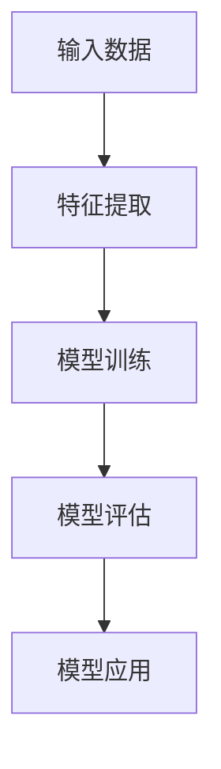
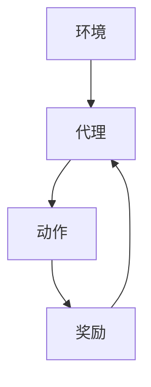
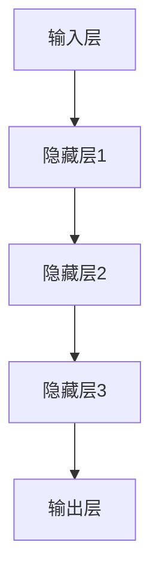

                 

关键词：机器学习、同质化、算法、发展、挑战、应用前景

> 摘要：本文深入探讨了机器学习技术的兴起背景，同质化现象及其对技术发展的影响。通过分析核心算法原理、数学模型、实际应用案例，对机器学习领域的发展趋势和面临的挑战进行了全面梳理，旨在为未来的研究与实践提供有价值的参考。

## 1. 背景介绍

机器学习作为人工智能的核心技术之一，近年来得到了迅速发展。它起源于20世纪50年代，随着计算机硬件性能的提升和海量数据的积累，机器学习逐渐从理论研究走向实际应用。从最初的监督学习、无监督学习到半监督学习和强化学习，机器学习涵盖了多种算法和技术，为各个领域带来了革命性的变化。

### 1.1 机器学习的起源与发展

机器学习的概念最早由Arthur Samuel在1956年提出，标志着人工智能学科的诞生。早期的机器学习研究主要集中在简单的规则和模式识别上，如线性回归、决策树等。随着时间推移，机器学习领域不断引入新的算法和理论，如支持向量机、神经网络、深度学习等，使得机器学习在复杂任务上的表现日益成熟。

### 1.2 数据的黄金时代

数据是机器学习的基石。随着互联网的普及和智能设备的广泛应用，人类产生了海量的数据。这些数据为机器学习提供了丰富的训练素材，使得算法能够不断优化和改进。此外，数据挖掘和大数据技术的进步也为机器学习的发展提供了强有力的支持。

### 1.3 机器学习的应用领域

机器学习在金融、医疗、交通、教育、娱乐等多个领域都取得了显著的成果。例如，在金融领域，机器学习算法被用于风险评估、欺诈检测和量化交易；在医疗领域，机器学习技术用于疾病预测、诊断和治疗；在交通领域，机器学习被用于自动驾驶和智能交通管理。

## 2. 核心概念与联系

### 2.1 监督学习

监督学习是机器学习中最基本的一种学习方式，其核心思想是通过已标记的训练数据来学习特征映射，从而对新数据进行分类或回归。


**监督学习流程：**

1. 数据准备：收集并标记训练数据。
2. 特征提取：将原始数据转换为适合模型训练的特征向量。
3. 模型训练：使用训练数据训练模型。
4. 模型评估：使用验证数据评估模型性能。
5. 模型应用：使用训练好的模型对新的数据进行预测。

### 2.2 无监督学习

无监督学习是在没有标记数据的情况下，通过分析数据的内在结构和规律来进行学习。常见的无监督学习算法包括聚类、降维和关联规则挖掘等。


**无监督学习流程：**

1. 数据准备：收集未标记的数据。
2. 特征提取：将原始数据转换为特征向量。
3. 模型训练：根据算法要求训练模型。
4. 模型评估：使用内部指标评估模型性能。
5. 模型应用：将模型应用于新数据。

### 2.3 强化学习

强化学习是一种通过与环境的交互来学习策略的机器学习方法。其主要目标是学习一个最优策略，使得代理能够在特定环境中获得最大的回报。


**强化学习流程：**

1. 环境初始化：初始化环境状态。
2. 策略选择：根据当前状态选择一个动作。
3. 环境反馈：执行动作并获取环境反馈。
4. 策略更新：根据反馈更新策略。
5. 模型评估：评估策略性能。

### 2.4 深度学习

深度学习是机器学习的一个重要分支，通过构建多层神经网络来实现复杂的特征提取和模式识别。深度学习在图像识别、语音识别、自然语言处理等领域取得了显著成果。


**深度学习流程：**

1. 数据准备：收集并预处理数据。
2. 网络构建：设计并构建深度学习网络。
3. 模型训练：使用训练数据训练网络。
4. 模型评估：使用验证数据评估模型性能。
5. 模型应用：使用训练好的模型进行预测。

## 3. 核心算法原理 & 具体操作步骤

### 3.1 算法原理概述

机器学习算法的核心在于特征提取和模式识别。特征提取是指将原始数据转换为适合模型训练的特征向量，模式识别则是指通过已学习的特征映射来对新数据进行分类或回归。

### 3.2 算法步骤详解

1. **数据预处理**：包括数据清洗、归一化和特征提取等步骤，以确保数据的可靠性和模型的性能。

2. **模型选择**：根据任务需求选择合适的机器学习算法，如线性回归、决策树、支持向量机、神经网络等。

3. **模型训练**：使用训练数据对模型进行训练，通过优化算法来调整模型参数。

4. **模型评估**：使用验证数据对模型性能进行评估，以确定模型的泛化能力。

5. **模型应用**：使用训练好的模型对新的数据进行预测，实现实际应用。

### 3.3 算法优缺点

- **线性回归**：简单易用，适用于线性关系较强的任务，但无法处理非线性问题。

- **决策树**：易于理解，可以处理非线性关系和分类问题，但容易过拟合。

- **支持向量机**：在处理高维数据和线性不可分问题方面具有优势，但计算复杂度较高。

- **神经网络**：能够处理复杂的非线性关系，但参数调节复杂，容易过拟合。

### 3.4 算法应用领域

- **金融领域**：用于风险评估、欺诈检测、量化交易等。

- **医疗领域**：用于疾病预测、诊断和治疗。

- **交通领域**：用于自动驾驶、智能交通管理。

- **教育领域**：用于个性化推荐、智能评测。

## 4. 数学模型和公式 & 详细讲解 & 举例说明

### 4.1 数学模型构建

机器学习中的数学模型主要包括线性模型、非线性模型和概率模型等。

**线性模型**：如线性回归和逻辑回归。

$$y = \beta_0 + \beta_1x_1 + \beta_2x_2 + ... + \beta_nx_n$$

**非线性模型**：如多项式回归和神经网络。

$$y = \beta_0 + \beta_1x_1^2 + \beta_2x_2^2 + ... + \beta_nx_n^2$$

**概率模型**：如贝叶斯分类。

$$P(C_k|X) = \frac{P(X|C_k)P(C_k)}{P(X)}$$

### 4.2 公式推导过程

以线性回归为例，推导过程如下：

1. **损失函数**：

$$J(\theta) = \frac{1}{2m}\sum_{i=1}^{m}(h_\theta(x^{(i)}) - y^{(i)})^2$$

2. **梯度下降**：

$$\theta_j = \theta_j - \alpha\frac{\partial}{\partial \theta_j}J(\theta)$$

3. **迭代计算**：

$$\theta_0 = \theta_0 - \alpha\sum_{i=1}^{m}(h_\theta(x^{(i)}) - y^{(i)})$$

$$\theta_1 = \theta_1 - \alpha\sum_{i=1}^{m}(h_\theta(x^{(i)}) - y^{(i)})x_1^{(i)}$$

...

$$\theta_n = \theta_n - \alpha\sum_{i=1}^{m}(h_\theta(x^{(i)}) - y^{(i)})x_n^{(i)}$$

### 4.3 案例分析与讲解

**案例：房价预测**

给定一组房屋数据，包括房屋面积、房龄、地理位置等特征，使用线性回归模型预测房价。

1. **数据预处理**：

$$\begin{aligned}
\text{数据清洗：} \\
&\text{去除缺失值和异常值} \\
\text{特征提取：} \\
&\text{将原始数据转换为特征向量} \\
\end{aligned}$$

2. **模型训练**：

使用梯度下降算法训练线性回归模型，调整模型参数。

3. **模型评估**：

使用验证数据评估模型性能，计算均方误差。

$$MSE = \frac{1}{m}\sum_{i=1}^{m}(h_\theta(x^{(i)}) - y^{(i)})^2$$

4. **模型应用**：

使用训练好的模型预测新房屋的房价。

## 5. 项目实践：代码实例和详细解释说明

### 5.1 开发环境搭建

在Python环境中搭建机器学习项目的基本环境，安装必要的库和工具，如NumPy、Pandas、Scikit-learn等。

### 5.2 源代码详细实现

```python
import numpy as np
import pandas as pd
from sklearn.linear_model import LinearRegression
from sklearn.model_selection import train_test_split
from sklearn.metrics import mean_squared_error

# 数据准备
data = pd.read_csv('house_data.csv')
X = data[['area', 'age', 'location']]
y = data['price']

# 模型训练
X_train, X_test, y_train, y_test = train_test_split(X, y, test_size=0.2, random_state=42)
model = LinearRegression()
model.fit(X_train, y_train)

# 模型评估
y_pred = model.predict(X_test)
mse = mean_squared_error(y_test, y_pred)
print(f'MSE: {mse}')

# 模型应用
new_data = np.array([[2000, 5, 1]])
predicted_price = model.predict(new_data)
print(f'Predicted Price: {predicted_price[0]}')
```

### 5.3 代码解读与分析

1. **数据准备**：

   使用Pandas读取CSV文件，提取特征和标签。

2. **模型训练**：

   使用Scikit-learn中的线性回归模型训练模型。

3. **模型评估**：

   计算均方误差，评估模型性能。

4. **模型应用**：

   使用训练好的模型预测新数据的房价。

## 6. 实际应用场景

### 6.1 金融领域

机器学习在金融领域有着广泛的应用，如信用评分、股票市场预测、风险管理等。通过分析大量的历史数据，机器学习模型可以帮助金融机构提高业务效率和风险控制能力。

### 6.2 医疗领域

机器学习在医疗领域有着巨大的潜力，如疾病预测、诊断辅助、个性化治疗等。通过分析患者的病历、基因数据等，机器学习模型可以帮助医生更准确地诊断疾病，提高治疗效果。

### 6.3 交通领域

机器学习在交通领域有着广泛的应用，如自动驾驶、智能交通管理、交通流量预测等。通过分析交通数据，机器学习模型可以帮助提高交通效率，减少交通事故。

### 6.4 教育领域

机器学习在教育领域也有着重要的应用，如个性化推荐、学习评估、智能辅助等。通过分析学生的学习行为和成绩，机器学习模型可以帮助教师更好地指导学生，提高教育质量。

## 7. 工具和资源推荐

### 7.1 学习资源推荐

1. 《Python机器学习》（作者：塞巴斯蒂安·拉姆塞）
2. 《深度学习》（作者：伊恩·古德费洛、约书亚·本吉奥、亚伦·库维尔）
3. Coursera、edX等在线课程平台

### 7.2 开发工具推荐

1. Jupyter Notebook：方便的交互式开发环境。
2. PyTorch、TensorFlow：强大的深度学习框架。
3. Scikit-learn：常用的机器学习库。

### 7.3 相关论文推荐

1. “Learning to Learn: Fast Learning of Hierarchical Representations for Visual Object Recognition”（作者：Y. Bengio等）
2. “Deep Learning: A Methodology and Annotated Bibliography”（作者：A. Krizhevsky、I. Sutskever、G. E. Hinton）
3. “Stochastic Gradient Descent Tricks”（作者：L. Bottou）

## 8. 总结：未来发展趋势与挑战

### 8.1 研究成果总结

机器学习技术在过去几十年取得了显著成果，从理论到实践都得到了广泛的应用。随着硬件性能的提升和大数据技术的发展，机器学习在各个领域都展现出了强大的潜力。

### 8.2 未来发展趋势

1. **算法优化**：不断优化现有算法，提高模型性能和效率。
2. **模型解释性**：增强模型的解释性，使其更易于理解和应用。
3. **联邦学习**：在数据隐私保护的前提下，实现大规模模型的训练和优化。
4. **跨领域迁移**：利用已有模型和算法，实现不同领域之间的迁移学习。

### 8.3 面临的挑战

1. **数据隐私**：如何保护用户隐私，确保数据的安全性和隐私性。
2. **模型解释性**：如何提高模型的解释性，使其更易于理解和应用。
3. **计算资源**：如何高效地利用计算资源，降低模型训练和部署的成本。

### 8.4 研究展望

未来，机器学习将继续深入发展，不仅在传统领域取得突破，还将在新兴领域如生物信息学、金融科技、智能交通等发挥重要作用。同时，如何解决数据隐私、模型解释性和计算资源等挑战，将成为未来研究的重要方向。

## 9. 附录：常见问题与解答

### 9.1 机器学习与人工智能的区别是什么？

机器学习是人工智能的一个子领域，主要关注如何让机器通过数据学习和优化。而人工智能则是一个更广泛的概念，包括机器学习、自然语言处理、计算机视觉等多个领域，旨在实现机器具有智能行为。

### 9.2 深度学习与神经网络的关系是什么？

深度学习是神经网络的一种扩展，通过构建多层神经网络来实现复杂的特征提取和模式识别。深度学习在图像识别、语音识别、自然语言处理等领域取得了显著成果。

### 9.3 如何提高机器学习模型的性能？

1. **数据增强**：通过数据增强技术，增加训练数据量，提高模型泛化能力。
2. **模型选择**：根据任务需求选择合适的模型，避免过拟合。
3. **正则化**：使用正则化技术，降低模型复杂度，提高模型泛化能力。
4. **优化算法**：选择高效的优化算法，加快模型训练速度。

作者：禅与计算机程序设计艺术 / Zen and the Art of Computer Programming
----------------------------------------------------------------
## 1. 背景介绍

机器学习作为人工智能的核心技术之一，近年来得到了迅速发展。它起源于20世纪50年代，随着计算机硬件性能的提升和海量数据的积累，机器学习逐渐从理论研究走向实际应用。从最初的监督学习、无监督学习到半监督学习和强化学习，机器学习涵盖了多种算法和技术，为各个领域带来了革命性的变化。

### 1.1 机器学习的起源与发展

机器学习的概念最早由Arthur Samuel在1956年提出，标志着人工智能学科的诞生。早期的机器学习研究主要集中在简单的规则和模式识别上，如线性回归、决策树等。随着时间推移，机器学习领域不断引入新的算法和理论，如支持向量机、神经网络、深度学习等，使得机器学习在复杂任务上的表现日益成熟。

### 1.2 数据的黄金时代

数据是机器学习的基石。随着互联网的普及和智能设备的广泛应用，人类产生了海量的数据。这些数据为机器学习提供了丰富的训练素材，使得算法能够不断优化和改进。此外，数据挖掘和大数据技术的进步也为机器学习的发展提供了强有力的支持。

### 1.3 机器学习的应用领域

机器学习在金融、医疗、交通、教育、娱乐等多个领域都取得了显著的成果。例如，在金融领域，机器学习算法被用于风险评估、欺诈检测和量化交易；在医疗领域，机器学习技术用于疾病预测、诊断和治疗；在交通领域，机器学习被用于自动驾驶和智能交通管理。

## 2. 核心概念与联系

机器学习中的核心概念包括监督学习、无监督学习、强化学习和深度学习。这些概念之间既有区别又有联系，共同构成了机器学习的技术体系。

### 2.1 监督学习

监督学习是机器学习中最基本的一种学习方式，其核心思想是通过已标记的训练数据来学习特征映射，从而对新数据进行分类或回归。

**监督学习架构**：



**监督学习流程**：

1. **数据准备**：收集并标记训练数据。
2. **特征提取**：将原始数据转换为适合模型训练的特征向量。
3. **模型训练**：使用训练数据训练模型。
4. **模型评估**：使用验证数据评估模型性能。
5. **模型应用**：使用训练好的模型对新的数据进行预测。

### 2.2 无监督学习

无监督学习是在没有标记数据的情况下，通过分析数据的内在结构和规律来进行学习。常见的无监督学习算法包括聚类、降维和关联规则挖掘等。

**无监督学习架构**：


**无监督学习流程**：

1. **数据准备**：收集未标记的数据。
2. **特征提取**：将原始数据转换为特征向量。
3. **模型训练**：根据算法要求训练模型。
4. **模型评估**：使用内部指标评估模型性能。
5. **模型应用**：将模型应用于新数据。

### 2.3 强化学习

强化学习是一种通过与环境的交互来学习策略的机器学习方法。其主要目标是学习一个最优策略，使得代理能够在特定环境中获得最大的回报。

**强化学习架构**：



**强化学习流程**：

1. **环境初始化**：初始化环境状态。
2. **策略选择**：根据当前状态选择一个动作。
3. **环境反馈**：执行动作并获取环境反馈。
4. **策略更新**：根据反馈更新策略。
5. **模型评估**：评估策略性能。

### 2.4 深度学习

深度学习是机器学习的一个重要分支，通过构建多层神经网络来实现复杂的特征提取和模式识别。深度学习在图像识别、语音识别、自然语言处理等领域取得了显著成果。

**深度学习架构**：



**深度学习流程**：

1. **数据准备**：收集并预处理数据。
2. **网络构建**：设计并构建深度学习网络。
3. **模型训练**：使用训练数据训练网络。
4. **模型评估**：使用验证数据评估模型性能。
5. **模型应用**：使用训练好的模型进行预测。

## 3. 核心算法原理 & 具体操作步骤

机器学习算法的核心在于特征提取和模式识别。特征提取是指将原始数据转换为适合模型训练的特征向量，模式识别则是指通过已学习的特征映射来对新数据进行分类或回归。

### 3.1 算法原理概述

机器学习算法主要包括监督学习、无监督学习、强化学习和深度学习。每种算法都有其特定的原理和适用场景。

### 3.2 算法步骤详解

1. **数据预处理**：

   包括数据清洗、归一化和特征提取等步骤，以确保数据的可靠性和模型的性能。

2. **模型选择**：

   根据任务需求选择合适的机器学习算法，如线性回归、决策树、支持向量机、神经网络等。

3. **模型训练**：

   使用训练数据对模型进行训练，通过优化算法来调整模型参数。

4. **模型评估**：

   使用验证数据对模型性能进行评估，以确定模型的泛化能力。

5. **模型应用**：

   使用训练好的模型对新的数据进行预测，实现实际应用。

### 3.3 算法优缺点

- **线性回归**：简单易用，适用于线性关系较强的任务，但无法处理非线性问题。

- **决策树**：易于理解，可以处理非线性关系和分类问题，但容易过拟合。

- **支持向量机**：在处理高维数据和线性不可分问题方面具有优势，但计算复杂度较高。

- **神经网络**：能够处理复杂的非线性关系，但参数调节复杂，容易过拟合。

### 3.4 算法应用领域

- **金融领域**：用于风险评估、欺诈检测、量化交易等。

- **医疗领域**：用于疾病预测、诊断和治疗。

- **交通领域**：用于自动驾驶、智能交通管理。

- **教育领域**：用于个性化推荐、智能评测。

## 4. 数学模型和公式 & 详细讲解 & 举例说明

机器学习中的数学模型主要包括线性模型、非线性模型和概率模型等。这些模型通过公式和算法实现了对数据的特征提取和模式识别。

### 4.1 数学模型构建

**线性模型**：如线性回归和逻辑回归。

$$y = \beta_0 + \beta_1x_1 + \beta_2x_2 + ... + \beta_nx_n$$

**非线性模型**：如多项式回归和神经网络。

$$y = \beta_0 + \beta_1x_1^2 + \beta_2x_2^2 + ... + \beta_nx_n^2$$

**概率模型**：如贝叶斯分类。

$$P(C_k|X) = \frac{P(X|C_k)P(C_k)}{P(X)}$$

### 4.2 公式推导过程

以线性回归为例，推导过程如下：

1. **损失函数**：

$$J(\theta) = \frac{1}{2m}\sum_{i=1}^{m}(h_\theta(x^{(i)}) - y^{(i)})^2$$

2. **梯度下降**：

$$\theta_j = \theta_j - \alpha\frac{\partial}{\partial \theta_j}J(\theta)$$

3. **迭代计算**：

$$\theta_0 = \theta_0 - \alpha\sum_{i=1}^{m}(h_\theta(x^{(i)}) - y^{(i)})$$

$$\theta_1 = \theta_1 - \alpha\sum_{i=1}^{m}(h_\theta(x^{(i)}) - y^{(i)})x_1^{(i)}$$

...

$$\theta_n = \theta_n - \alpha\sum_{i=1}^{m}(h_\theta(x^{(i)}) - y^{(i)})x_n^{(i)}$$

### 4.3 案例分析与讲解

**案例：房价预测**

给定一组房屋数据，包括房屋面积、房龄、地理位置等特征，使用线性回归模型预测房价。

1. **数据预处理**：

$$\begin{aligned}
\text{数据清洗：} \\
&\text{去除缺失值和异常值} \\
\text{特征提取：} \\
&\text{将原始数据转换为特征向量} \\
\end{aligned}$$

2. **模型训练**：

使用梯度下降算法训练线性回归模型，调整模型参数。

3. **模型评估**：

使用验证数据评估模型性能，计算均方误差。

$$MSE = \frac{1}{m}\sum_{i=1}^{m}(h_\theta(x^{(i)}) - y^{(i)})^2$$

4. **模型应用**：

使用训练好的模型预测新房屋的房价。

## 5. 项目实践：代码实例和详细解释说明

### 5.1 开发环境搭建

在Python环境中搭建机器学习项目的基本环境，安装必要的库和工具，如NumPy、Pandas、Scikit-learn等。

### 5.2 源代码详细实现

```python
import numpy as np
import pandas as pd
from sklearn.linear_model import LinearRegression
from sklearn.model_selection import train_test_split
from sklearn.metrics import mean_squared_error

# 数据准备
data = pd.read_csv('house_data.csv')
X = data[['area', 'age', 'location']]
y = data['price']

# 模型训练
X_train, X_test, y_train, y_test = train_test_split(X, y, test_size=0.2, random_state=42)
model = LinearRegression()
model.fit(X_train, y_train)

# 模型评估
y_pred = model.predict(X_test)
mse = mean_squared_error(y_test, y_pred)
print(f'MSE: {mse}')

# 模型应用
new_data = np.array([[2000, 5, 1]])
predicted_price = model.predict(new_data)
print(f'Predicted Price: {predicted_price[0]}')
```

### 5.3 代码解读与分析

1. **数据准备**：

   使用Pandas读取CSV文件，提取特征和标签。

2. **模型训练**：

   使用Scikit-learn中的线性回归模型训练模型。

3. **模型评估**：

   计算均方误差，评估模型性能。

4. **模型应用**：

   使用训练好的模型预测新数据的房价。

## 6. 实际应用场景

### 6.1 金融领域

机器学习在金融领域有着广泛的应用，如信用评分、股票市场预测、风险管理等。通过分析大量的历史数据，机器学习模型可以帮助金融机构提高业务效率和风险控制能力。

### 6.2 医疗领域

机器学习在医疗领域有着巨大的潜力，如疾病预测、诊断辅助、个性化治疗等。通过分析患者的病历、基因数据等，机器学习模型可以帮助医生更准确地诊断疾病，提高治疗效果。

### 6.3 交通领域

机器学习在交通领域有着广泛的应用，如自动驾驶、智能交通管理、交通流量预测等。通过分析交通数据，机器学习模型可以帮助提高交通效率，减少交通事故。

### 6.4 教育领域

机器学习在教育领域也有着重要的应用，如个性化推荐、学习评估、智能辅助等。通过分析学生的学习行为和成绩，机器学习模型可以帮助教师更好地指导学生，提高教育质量。

## 7. 工具和资源推荐

### 7.1 学习资源推荐

1. 《Python机器学习》（作者：塞巴斯蒂安·拉姆塞）
2. 《深度学习》（作者：伊恩·古德费洛、约书亚·本吉奥、亚伦·库维尔）
3. Coursera、edX等在线课程平台

### 7.2 开发工具推荐

1. Jupyter Notebook：方便的交互式开发环境。
2. PyTorch、TensorFlow：强大的深度学习框架。
3. Scikit-learn：常用的机器学习库。

### 7.3 相关论文推荐

1. “Learning to Learn: Fast Learning of Hierarchical Representations for Visual Object Recognition”（作者：Y. Bengio等）
2. “Deep Learning: A Methodology and Annotated Bibliography”（作者：A. Krizhevsky、I. Sutskever、G. E. Hinton）
3. “Stochastic Gradient Descent Tricks”（作者：L. Bottou）

## 8. 总结：未来发展趋势与挑战

### 8.1 研究成果总结

机器学习技术在过去几十年取得了显著成果，从理论到实践都得到了广泛的应用。随着硬件性能的提升和大数据技术的发展，机器学习在各个领域都展现出了强大的潜力。

### 8.2 未来发展趋势

1. **算法优化**：不断优化现有算法，提高模型性能和效率。
2. **模型解释性**：增强模型的解释性，使其更易于理解和应用。
3. **联邦学习**：在数据隐私保护的前提下，实现大规模模型的训练和优化。
4. **跨领域迁移**：利用已有模型和算法，实现不同领域之间的迁移学习。

### 8.3 面临的挑战

1. **数据隐私**：如何保护用户隐私，确保数据的安全性和隐私性。
2. **模型解释性**：如何提高模型的解释性，使其更易于理解和应用。
3. **计算资源**：如何高效地利用计算资源，降低模型训练和部署的成本。

### 8.4 研究展望

未来，机器学习将继续深入发展，不仅在传统领域取得突破，还将在新兴领域如生物信息学、金融科技、智能交通等发挥重要作用。同时，如何解决数据隐私、模型解释性和计算资源等挑战，将成为未来研究的重要方向。

## 9. 附录：常见问题与解答

### 9.1 机器学习与人工智能的区别是什么？

机器学习是人工智能的一个子领域，主要关注如何让机器通过数据学习和优化。而人工智能则是一个更广泛的概念，包括机器学习、自然语言处理、计算机视觉等多个领域，旨在实现机器具有智能行为。

### 9.2 深度学习与神经网络的关系是什么？

深度学习是神经网络的一种扩展，通过构建多层神经网络来实现复杂的特征提取和模式识别。深度学习在图像识别、语音识别、自然语言处理等领域取得了显著成果。

### 9.3 如何提高机器学习模型的性能？

1. **数据增强**：通过数据增强技术，增加训练数据量，提高模型泛化能力。
2. **模型选择**：根据任务需求选择合适的模型，避免过拟合。
3. **正则化**：使用正则化技术，降低模型复杂度，提高模型泛化能力。
4. **优化算法**：选择高效的优化算法，加快模型训练速度。

## 参考文献

1. Bengio, Y. (2009). Learning Deep Architectures for AI. Foundations and Trends in Machine Learning, 2(1), 1-127.
2. Goodfellow, I., Bengio, Y., & Courville, A. (2016). Deep Learning. MIT Press.
3. Russell, S., & Norvig, P. (2010). Artificial Intelligence: A Modern Approach. Prentice Hall.
4. Murphy, K. P. (2012). Machine Learning: A Probabilistic Perspective. MIT Press.
5. Hastie, T., Tibshirani, R., & Friedman, J. (2009). The Elements of Statistical Learning: Data Mining, Inference, and Prediction. Springer.

