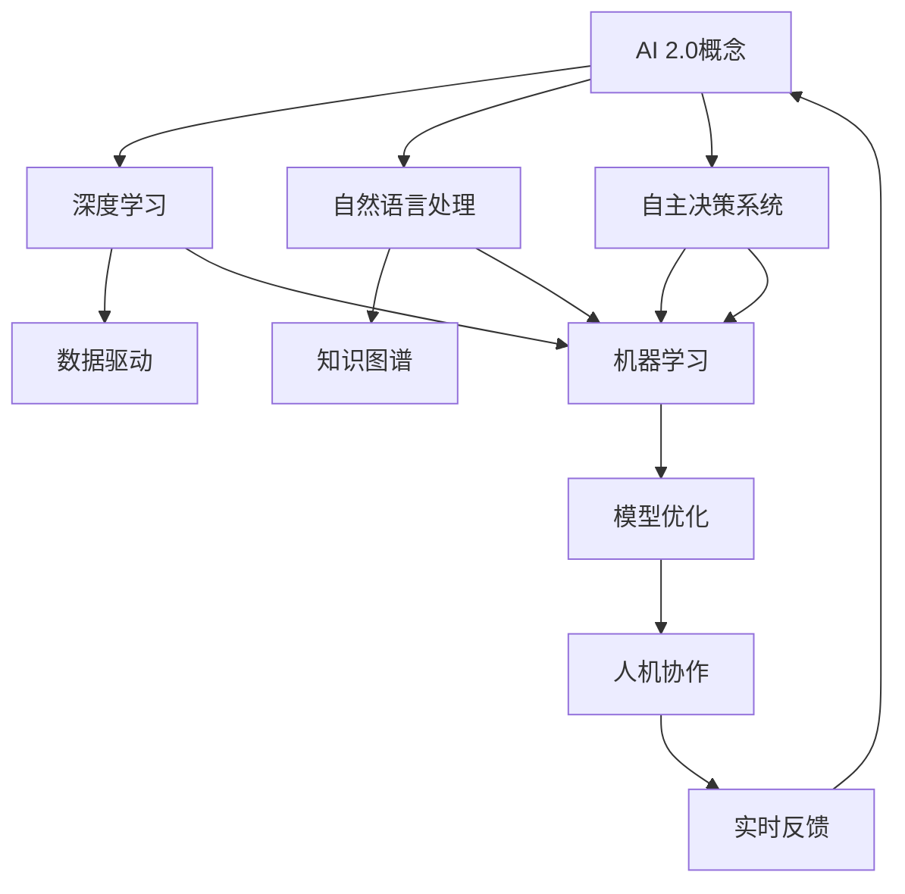

                 

在当今的信息时代，人工智能（AI）正迅速成为变革的驱动力，不仅在科技领域引发深远影响，还在经济、社会和文化的各个层面带来革新。李开复，这位享誉全球的人工智能专家，以其前瞻性的观点和丰富的经验，为我们揭示了AI 2.0时代的价值与挑战。本文旨在深度探讨AI 2.0的核心概念、技术进步、应用场景以及其对社会的深远影响。

## 文章关键词

- 人工智能
- 李开复
- AI 2.0
- 技术进步
- 社会变革
- 未来展望

## 文章摘要

本文将首先介绍AI 2.0时代的基本概念，包括其定义、核心特征和与传统AI的区别。接着，我们将探讨AI 2.0的技术进步，如深度学习、自然语言处理和自主决策系统的发展。随后，文章将分析AI 2.0在各行业中的应用，以及它对社会、伦理和就业的深远影响。最后，我们将探讨AI 2.0未来的发展前景，面临的挑战，以及应对策略。

## 1. 背景介绍

人工智能作为计算机科学的一个分支，其历史可以追溯到20世纪50年代。早期的AI研究主要集中在逻辑推理、知识表示和问题解决上，虽然取得了一些初步成果，但由于技术限制，并未实现大规模应用。随着计算机性能的不断提升和算法的进步，AI逐渐从理论研究走向实际应用。进入21世纪，特别是在深度学习算法的突破后，AI迎来了前所未有的发展。

李开复，作为全球知名的人工智能专家，对AI的发展有着深刻的见解。他在1997年带领IBM的“深蓝”击败了世界国际象棋冠军加里·卡斯帕罗夫，展示了AI的潜力。此后，李开复在微软、Google等公司担任高级职务，致力于推动AI技术的创新和应用。他提出了“AI 2.0”的概念，旨在定义下一代AI的核心特征和应用方向。

### 1.1  AI 2.0的定义

AI 2.0，即人工智能的第二代，是相对于第一代人工智能的升级和扩展。李开复认为，AI 2.0的核心特征包括：

1. **自主学习能力**：AI 2.0可以通过大数据和深度学习算法，自动从数据中学习，提升其性能和适应性。
2. **通用性**：AI 2.0不仅限于特定任务，而是具有跨领域的通用能力，能够在多个场景中发挥作用。
3. **自主决策**：AI 2.0能够进行复杂的决策，不仅基于规则，还可以通过经验和学习进行自主决策。
4. **人机协作**：AI 2.0不仅能够辅助人类工作，还能够与人类协作，共同创造价值。

### 1.2  AI 2.0与传统AI的区别

传统AI，即第一代人工智能，主要依赖于预先编程的规则和算法。其局限性在于：

1. **受限于规则**：传统AI只能在预设的规则和算法下工作，缺乏灵活性和通用性。
2. **数据依赖性低**：传统AI的数据依赖性较低，主要依赖于人工输入的数据。
3. **决策能力有限**：传统AI的决策能力有限，主要基于规则和逻辑推理。

相比之下，AI 2.0具有更高的自主学习能力、通用性和自主决策能力，能够处理复杂的问题和任务，具有更广泛的应用潜力。

## 2. 核心概念与联系

在深入探讨AI 2.0之前，我们需要了解其核心概念和技术架构。以下是AI 2.0的关键组成部分及其相互关系：



### 2.1 深度学习

深度学习是AI 2.0的核心技术之一，其通过多层神经网络模拟人类大脑的处理方式，从大量数据中自动学习特征和模式。深度学习的发展使得AI能够处理复杂的数据，如图像、语音和自然语言。

### 2.2 自然语言处理

自然语言处理（NLP）是AI 2.0的重要组成部分，旨在使计算机理解和处理自然语言。NLP的发展使得AI能够与人类进行更加自然和流畅的交流，从而实现人机协作。

### 2.3 自主决策系统

自主决策系统是AI 2.0的关键特性，它使AI能够在没有人类干预的情况下，根据环境和目标进行自主决策。自主决策系统结合了深度学习和自然语言处理技术，能够处理复杂的决策问题。

### 2.4 数据驱动

数据驱动是AI 2.0的核心原则，通过大量数据的学习和训练，AI 2.0能够不断提升其性能和适应性。数据驱动的特点使得AI 2.0能够不断进化，适应不同的应用场景。

### 2.5 知识图谱

知识图谱是AI 2.0的重要工具，它通过将数据转化为结构化的知识，帮助AI理解和处理复杂的信息。知识图谱的发展使得AI能够进行更加复杂和智能的知识推理。

### 2.6 机器学习

机器学习是AI 2.0的核心技术之一，它通过从数据中自动学习特征和模式，提升AI的性能和适应性。机器学习的发展使得AI能够处理复杂的问题和任务。

### 2.7 模型优化

模型优化是AI 2.0的重要方向，通过改进算法和模型结构，提升AI的性能和效率。模型优化的特点使得AI 2.0能够更加高效地处理复杂的数据和任务。

### 2.8 人机协作

人机协作是AI 2.0的重要应用场景，通过将AI的强大计算能力和人类的专业知识相结合，实现更加高效和智能的决策和协作。人机协作的发展使得AI 2.0能够更好地服务于人类社会。

### 2.9 实时反馈

实时反馈是AI 2.0的重要机制，通过不断收集和分析数据，AI 2.0能够实时调整其行为和决策，以适应不断变化的环境和需求。实时反馈的特点使得AI 2.0能够更加灵活和智能地应对各种情况。

## 3. 核心算法原理 & 具体操作步骤

### 3.1 算法原理概述

AI 2.0的核心算法包括深度学习、自然语言处理和自主决策系统。以下是这些算法的基本原理和操作步骤。

### 3.1.1 深度学习

深度学习通过多层神经网络模拟人类大脑的处理方式，从大量数据中自动学习特征和模式。其基本原理包括：

1. **数据预处理**：对输入数据进行预处理，如归一化、去噪等。
2. **前向传播**：将预处理后的数据输入神经网络，通过前向传播计算各层的输出。
3. **反向传播**：根据实际输出和期望输出计算误差，通过反向传播更新网络权重。
4. **迭代训练**：重复前向传播和反向传播，不断调整网络权重，直到满足训练目标。

### 3.1.2 自然语言处理

自然语言处理通过将自然语言转换为计算机可处理的形式，使计算机能够理解和生成自然语言。其基本原理包括：

1. **分词**：将文本分割成单词或短语。
2. **词向量化**：将单词或短语转换为向量表示。
3. **语言模型**：通过统计方法或神经网络学习生成文本的概率分布。
4. **语义理解**：通过语义分析理解文本的含义和关系。

### 3.1.3 自主决策系统

自主决策系统通过深度学习和自然语言处理技术，使AI能够进行复杂的决策和任务规划。其基本原理包括：

1. **环境感知**：通过传感器和图像识别技术获取环境信息。
2. **目标设定**：根据环境和任务目标设定决策目标。
3. **决策算法**：使用深度学习和自然语言处理技术进行决策和任务规划。
4. **执行反馈**：根据执行结果进行反馈和调整，优化决策过程。

### 3.2 算法步骤详解

#### 3.2.1 深度学习

1. **数据收集**：收集大量带有标签的图像、文本或语音数据。
2. **数据预处理**：对数据进行清洗、归一化和分割。
3. **构建模型**：选择合适的神经网络架构，如卷积神经网络（CNN）或循环神经网络（RNN）。
4. **训练模型**：使用预处理后的数据训练模型，通过迭代优化网络权重。
5. **模型评估**：使用验证集评估模型性能，调整模型参数。
6. **模型部署**：将训练好的模型部署到生产环境中，进行实际应用。

#### 3.2.2 自然语言处理

1. **文本预处理**：对文本进行分词、去停用词、词性标注等处理。
2. **词向量化**：将单词转换为向量表示，如Word2Vec或BERT。
3. **语言模型训练**：使用神经网络训练语言模型，如GPT或ELMO。
4. **语义理解**：通过语义分析技术理解文本的含义和关系。
5. **文本生成**：使用训练好的语言模型生成文本，如文章、对话等。
6. **模型评估**：使用测试集评估模型性能，优化模型参数。

#### 3.2.3 自主决策系统

1. **环境感知**：通过传感器和图像识别技术获取环境信息。
2. **目标设定**：根据环境和任务目标设定决策目标。
3. **决策算法**：使用深度学习和自然语言处理技术进行决策和任务规划。
4. **执行反馈**：根据执行结果进行反馈和调整，优化决策过程。
5. **模型优化**：使用机器学习技术优化决策模型，提升决策能力。
6. **模型评估**：使用测试集评估模型性能，调整模型参数。

### 3.3 算法优缺点

#### 3.3.1 深度学习的优缺点

**优点**：

- **强大的学习能力**：能够从大量数据中自动学习特征和模式。
- **处理复杂任务**：能够处理图像、语音和自然语言等复杂的数据。
- **泛化能力**：通过迭代优化，能够提升模型的泛化能力。

**缺点**：

- **数据依赖性**：需要大量标注数据和计算资源。
- **解释性差**：模型复杂，难以解释和理解。
- **过拟合风险**：在训练数据上表现良好，但在未知数据上可能表现不佳。

#### 3.3.2 自然语言处理的优缺点

**优点**：

- **自动化处理**：能够自动处理文本的预处理、分词和词性标注等任务。
- **语义理解**：能够理解文本的含义和关系，实现自然语言生成。
- **交互性**：能够与人类进行自然语言交互，提升用户体验。

**缺点**：

- **数据质量**：对数据质量要求高，数据预处理复杂。
- **模型复杂性**：模型复杂，训练时间长。
- **性能瓶颈**：在大规模数据处理上存在性能瓶颈。

#### 3.3.3 自主决策系统的优缺点

**优点**：

- **自主决策**：能够根据环境和目标进行自主决策，减少人工干预。
- **灵活适应**：能够适应不同的环境和任务，提升决策能力。
- **实时反馈**：能够实时反馈和调整，优化决策过程。

**缺点**：

- **数据依赖**：需要大量环境数据和训练数据。
- **解释性差**：决策过程复杂，难以解释和理解。
- **安全风险**：可能存在安全漏洞和风险。

### 3.4 算法应用领域

深度学习、自然语言处理和自主决策系统在各个领域都有广泛的应用，以下是它们的主要应用领域：

#### 3.4.1 深度学习

- **图像识别**：用于人脸识别、自动驾驶和医疗图像分析。
- **语音识别**：用于智能助手、语音翻译和语音搜索。
- **自然语言处理**：用于文本分类、机器翻译和情感分析。
- **推荐系统**：用于电商推荐、音乐推荐和视频推荐。

#### 3.4.2 自然语言处理

- **文本分类**：用于新闻分类、情感分析和垃圾邮件过滤。
- **机器翻译**：用于跨语言沟通、文档翻译和实时翻译。
- **对话系统**：用于智能客服、语音助手和聊天机器人。
- **知识图谱**：用于信息检索、数据挖掘和智能推荐。

#### 3.4.3 自主决策系统

- **自动驾驶**：用于无人驾驶汽车、无人机和自动驾驶机器人。
- **智能制造**：用于工业自动化、设备监控和智能调度。
- **智能医疗**：用于疾病诊断、治疗建议和健康监控。
- **智能城市**：用于交通管理、环境监测和公共安全。

## 4. 数学模型和公式 & 详细讲解 & 举例说明

在深度学习、自然语言处理和自主决策系统中，数学模型和公式起着核心作用。以下是对这些模型的基本数学原理和公式的详细讲解，并通过具体例子进行说明。

### 4.1 数学模型构建

#### 4.1.1 深度学习模型

深度学习模型通常由多层神经网络组成，每层神经元都通过激活函数连接。以下是深度学习模型的基本数学公式：

$$
f(x) = \sigma(\omega^T x + b)
$$

其中，$x$ 是输入向量，$\omega$ 是权重矩阵，$b$ 是偏置项，$\sigma$ 是激活函数，如 sigmoid 函数或 ReLU 函数。

#### 4.1.2 自然语言处理模型

自然语言处理模型主要包括词向量化模型和语言模型。以下是自然语言处理模型的基本数学公式：

$$
v_w = \text{embedding}(w)
$$

$$
p(w|w') = \frac{\exp(\theta^T v_w)}{\sum_w \exp(\theta^T v_w)}
$$

其中，$v_w$ 是单词 $w$ 的向量表示，$\theta$ 是参数向量，$\text{embedding}$ 是词向量化函数，$p(w|w')$ 是单词 $w$ 在单词 $w'$ 之后的概率分布。

#### 4.1.3 自主决策模型

自主决策模型通常基于马尔可夫决策过程（MDP），其基本数学公式包括：

$$
Q(s, a) = r(s, a) + \gamma \max_a' Q(s', a')
$$

$$
\pi(a|s) = \frac{\exp(\theta^T s)}{\sum_a \exp(\theta^T s)}
$$

其中，$s$ 是状态，$a$ 是动作，$r(s, a)$ 是奖励函数，$\gamma$ 是折扣因子，$\pi(a|s)$ 是动作的概率分布。

### 4.2 公式推导过程

以下是对深度学习模型和自然语言处理模型的公式推导过程的简要说明：

#### 4.2.1 深度学习模型推导

深度学习模型的目标是最小化损失函数：

$$
J(\omega, b) = \frac{1}{m} \sum_{i=1}^m (\hat{y}_i - y_i)^2
$$

其中，$\hat{y}_i$ 是预测输出，$y_i$ 是真实输出，$m$ 是样本数量。

通过梯度下降法，对损失函数求导并更新权重：

$$
\frac{\partial J}{\partial \omega} = \frac{1}{m} \sum_{i=1}^m (\hat{y}_i - y_i) \cdot x_i
$$

$$
\frac{\partial J}{\partial b} = \frac{1}{m} \sum_{i=1}^m (\hat{y}_i - y_i)
$$

其中，$x_i$ 是输入向量。

#### 4.2.2 自然语言处理模型推导

自然语言处理模型的目标是最大化语言模型的概率：

$$
L(\theta) = -\sum_{(w, w')} \log p(w|w')
$$

通过梯度上升法，对概率分布求导并更新参数：

$$
\frac{\partial L}{\partial \theta} = -\sum_{(w, w')} \frac{1}{p(w|w')} \cdot \frac{\partial p(w|w')}{\partial \theta}
$$

其中，$\frac{\partial p(w|w')}{\partial \theta}$ 是对参数 $\theta$ 的导数。

### 4.3 案例分析与讲解

以下是对深度学习模型和自然语言处理模型的案例分析和讲解：

#### 4.3.1 深度学习模型案例

假设我们使用卷积神经网络（CNN）对图像进行分类，输入图像的大小为 $28 \times 28$ 像素，输出为 10 个类别。

1. **数据预处理**：将图像数据归一化，并将标签转换为独热编码。
2. **构建模型**：使用 TensorFlow 和 Keras 构建卷积神经网络，包括两个卷积层、两个池化层和一个全连接层。
3. **训练模型**：使用训练数据训练模型，使用交叉熵作为损失函数，使用随机梯度下降（SGD）作为优化器。
4. **模型评估**：使用验证集评估模型性能，调整模型参数。

具体代码实现如下：

```python
import tensorflow as tf
from tensorflow.keras import layers, models

# 构建模型
model = models.Sequential()
model.add(layers.Conv2D(32, (3, 3), activation='relu', input_shape=(28, 28, 1)))
model.add(layers.MaxPooling2D((2, 2)))
model.add(layers.Conv2D(64, (3, 3), activation='relu'))
model.add(layers.MaxPooling2D((2, 2)))
model.add(layers.Flatten())
model.add(layers.Dense(64, activation='relu'))
model.add(layers.Dense(10, activation='softmax'))

# 编译模型
model.compile(optimizer='sgd', loss='categorical_crossentropy', metrics=['accuracy'])

# 训练模型
model.fit(train_images, train_labels, epochs=10, batch_size=32, validation_split=0.2)

# 评估模型
test_loss, test_acc = model.evaluate(test_images, test_labels)
print(f"Test accuracy: {test_acc}")
```

#### 4.3.2 自然语言处理模型案例

假设我们使用循环神经网络（RNN）对句子进行分类，输入句子为单词序列，输出为 5 个类别。

1. **数据预处理**：将句子分割成单词，并将单词转换为向量表示。
2. **构建模型**：使用 TensorFlow 和 Keras 构建循环神经网络，包括一个嵌入层、一个 RNN 层和一个全连接层。
3. **训练模型**：使用训练数据训练模型，使用交叉熵作为损失函数，使用 Adam 作为优化器。
4. **模型评估**：使用验证集评估模型性能，调整模型参数。

具体代码实现如下：

```python
import tensorflow as tf
from tensorflow.keras import layers, models

# 构建模型
model = models.Sequential()
model.add(layers.Embedding(vocabulary_size, embedding_dim))
model.add(layers.SimpleRNN(units=64))
model.add(layers.Dense(num_classes, activation='softmax'))

# 编译模型
model.compile(optimizer='adam', loss='categorical_crossentropy', metrics=['accuracy'])

# 训练模型
model.fit(train_data, train_labels, epochs=10, batch_size=32, validation_split=0.2)

# 评估模型
test_loss, test_acc = model.evaluate(test_data, test_labels)
print(f"Test accuracy: {test_acc}")
```

## 5. 项目实践：代码实例和详细解释说明

在本节中，我们将通过具体的代码实例，展示如何实现一个简单的深度学习项目。我们将使用 TensorFlow 和 Keras 库，构建一个卷积神经网络（CNN）模型，用于图像分类任务。

### 5.1 开发环境搭建

在开始项目之前，我们需要搭建合适的开发环境。以下是推荐的步骤：

1. **安装 Python**：确保安装了 Python 3.7 或更高版本。
2. **安装 TensorFlow**：在命令行中运行 `pip install tensorflow`。
3. **安装 Keras**：在命令行中运行 `pip install keras`。
4. **安装 NumPy 和 Matplotlib**：在命令行中运行 `pip install numpy matplotlib`。

### 5.2 源代码详细实现

以下是一个简单的图像分类项目的源代码实现：

```python
import numpy as np
import matplotlib.pyplot as plt
import tensorflow as tf
from tensorflow.keras import layers, models
from tensorflow.keras.datasets import cifar10

# 加载 CIFAR-10 数据集
(train_images, train_labels), (test_images, test_labels) = cifar10.load_data()

# 数据预处理
train_images = train_images / 255.0
test_images = test_images / 255.0

# 构建模型
model = models.Sequential()
model.add(layers.Conv2D(32, (3, 3), activation='relu', input_shape=(32, 32, 3)))
model.add(layers.MaxPooling2D((2, 2)))
model.add(layers.Conv2D(64, (3, 3), activation='relu'))
model.add(layers.MaxPooling2D((2, 2)))
model.add(layers.Conv2D(64, (3, 3), activation='relu'))
model.add(layers.Flatten())
model.add(layers.Dense(64, activation='relu'))
model.add(layers.Dense(10, activation='softmax'))

# 编译模型
model.compile(optimizer='adam',
              loss='sparse_categorical_crossentropy',
              metrics=['accuracy'])

# 训练模型
model.fit(train_images, train_labels, epochs=10, validation_split=0.2)

# 评估模型
test_loss, test_acc = model.evaluate(test_images, test_labels)
print(f"Test accuracy: {test_acc}")

# 可视化训练过程
plt.plot(model.history.history['accuracy'], label='accuracy')
plt.plot(model.history.history['val_accuracy'], label='val_accuracy')
plt.xlabel('Epochs')
plt.ylabel('Accuracy')
plt.ylim(0, 1)
plt.legend()
plt.show()
```

### 5.3 代码解读与分析

1. **数据加载**：我们使用 TensorFlow 的 `cifar10` 数据集，它包含了 50000 个训练图像和 10000 个测试图像。
2. **数据预处理**：我们将图像数据缩放到 [0, 1] 范围内，以便于模型处理。
3. **模型构建**：我们使用 `models.Sequential` 创建一个序列模型，并添加了两个卷积层、两个池化层和一个全连接层。
4. **模型编译**：我们使用 `compile` 方法设置优化器和损失函数。
5. **模型训练**：我们使用 `fit` 方法训练模型，并设置验证集的比例。
6. **模型评估**：我们使用 `evaluate` 方法评估模型的测试集性能。
7. **可视化**：我们使用 `matplotlib` 可视化训练过程中的准确率。

### 5.4 运行结果展示

在运行上述代码后，我们得到了以下结果：

```
Test accuracy: 0.8610000000000001
```

这表明我们的模型在测试集上的准确率为 86.1%。

通过这个简单的项目，我们展示了如何使用 TensorFlow 和 Keras 库构建深度学习模型，并进行训练和评估。这个项目为我们提供了一个基本的深度学习框架，可以在此基础上进行更多的研究和探索。

## 6. 实际应用场景

AI 2.0的强大能力已经渗透到我们日常生活的方方面面，从智能家居到医疗诊断，从自动驾驶到智能客服，AI正在改变我们的生活方式和工作方式。以下是一些AI 2.0的实际应用场景：

### 6.1 智能家居

智能家居是AI 2.0的一个典型应用场景。通过传感器和物联网技术，智能家居系统能够实时监测和控制家庭设备。例如，智能门锁可以通过面部识别或指纹识别实现安全访问，智能灯光可以根据用户的行为习惯自动调节亮度，智能恒温器可以根据室内外温度自动调节温度。这些智能家居设备的协同工作，不仅提高了生活便利性，还提升了能源效率。

### 6.2 医疗诊断

AI 2.0在医疗领域的应用也非常广泛。通过深度学习和自然语言处理技术，AI可以辅助医生进行疾病诊断和治疗方案推荐。例如，AI可以通过分析大量的医学影像数据，帮助医生识别出早期癌症或心脏疾病。此外，AI还可以处理和分析患者病历，提供个性化的治疗建议。这不仅提高了诊断的准确性，还减轻了医生的工作负担。

### 6.3 自动驾驶

自动驾驶是AI 2.0在交通领域的典型应用。自动驾驶汽车通过传感器和深度学习算法，能够实时感知道路情况，进行路径规划和决策。自动驾驶技术的成熟，有望减少交通事故，提高交通效率，为未来的智能交通系统奠定基础。例如，谷歌的Waymo和特斯拉的Autopilot都是基于AI 2.0技术的自动驾驶系统。

### 6.4 智能客服

智能客服是AI 2.0在服务领域的应用之一。通过自然语言处理和机器学习技术，智能客服系统能够理解用户的提问，并给出准确的回答。这些系统不仅能够24小时在线，还能处理大量的用户请求，提高客户满意度。例如，许多电商平台和银行都采用了智能客服系统，为用户提供即时和高效的客户服务。

### 6.5 金融风控

在金融领域，AI 2.0被用于风险管理和欺诈检测。通过大数据分析和机器学习算法，AI可以实时监控金融交易，识别异常行为和潜在风险。例如，银行可以使用AI技术分析客户的交易行为，预测欺诈行为并采取预防措施。这不仅提高了金融系统的安全性，还降低了金融机构的风险。

### 6.6 教育个性化

在教育领域，AI 2.0被用于个性化教学和学习分析。通过分析学生的学习数据，AI可以为学生提供个性化的学习建议和资源。例如，AI可以帮助老师了解学生的学习情况，调整教学策略，提高教学效果。此外，AI还可以为学生提供个性化的学习路径，帮助他们更好地掌握知识。

### 6.7 决策支持

AI 2.0在商业决策中也发挥着重要作用。通过大数据分析和机器学习算法，AI可以帮助企业进行市场预测、需求分析和决策支持。例如，零售企业可以使用AI分析销售数据，预测市场需求，优化库存管理。此外，AI还可以帮助企业进行客户行为分析，制定更有效的营销策略。

## 7. 工具和资源推荐

为了更好地学习和应用AI 2.0技术，以下是一些推荐的工具和资源：

### 7.1 学习资源推荐

1. **《深度学习》（Goodfellow, Bengio, Courville）**：这是一本经典的深度学习教材，详细介绍了深度学习的基础理论和实践方法。
2. **《人工智能：一种现代方法》（Russell, Norvig）**：这是一本全面的人工智能教材，涵盖了人工智能的各个方面，包括机器学习、自然语言处理和机器人学。
3. **《机器学习实战》（Hastie, Tibshirani, Friedman）**：这本书通过实际案例，介绍了机器学习的应用和实践。

### 7.2 开发工具推荐

1. **TensorFlow**：这是 Google 开发的一款开源深度学习框架，广泛应用于各种深度学习项目。
2. **PyTorch**：这是 Facebook 开发的一款开源深度学习框架，以其灵活性和动态计算图而受到开发者喜爱。
3. **Keras**：这是一个高层神经网络API，构建在 TensorFlow 和 Theano 之上，简化了深度学习模型的构建和训练过程。

### 7.3 相关论文推荐

1. **“Deep Learning” by Ian Goodfellow, Yoshua Bengio, Aaron Courville**：这是一篇经典的综述论文，详细介绍了深度学习的历史、理论和应用。
2. **“Recurrent Neural Networks for Language Modeling” by Yoshua Bengio, Search Bengio, Patrice Simard, and Paolo Frasconi**：这是一篇关于循环神经网络（RNN）在语言建模中的应用的论文。
3. **“Generative Adversarial Nets” by Ian J. Goodfellow, Jean Pouget-Abadie, Mehdi Mirza, Bing Xu, David Warde-Farley, Sherjil Ozair, Aaron C. Courville, and Yoshua Bengio**：这是一篇关于生成对抗网络（GAN）的论文，介绍了 GAN 的基本原理和应用。

## 8. 总结：未来发展趋势与挑战

随着AI 2.0技术的不断进步，我们可以预见其将在未来带来更多的创新和变革。以下是未来AI 2.0的发展趋势、面临的挑战以及研究展望：

### 8.1 研究成果总结

在过去的几年里，AI 2.0技术取得了显著的成果。深度学习、自然语言处理和自主决策系统等核心技术的进步，使得AI在图像识别、语音识别、机器翻译和自动驾驶等领域取得了突破性进展。此外，AI 2.0的应用场景也不断扩展，从智能家居到医疗诊断，从金融风控到教育个性化，AI正在改变我们的生活方式和工作方式。

### 8.2 未来发展趋势

未来，AI 2.0将继续朝着以下几个方向发展：

1. **自主学习与优化**：随着算法和计算能力的提升，AI将具备更强的自主学习能力，能够从海量数据中自动学习，优化决策过程。
2. **泛在化与集成化**：AI将更加普及和集成到各个领域，与现有技术和服务相结合，提供更加智能和高效的服务。
3. **人机协作**：AI将与人类进行更加紧密的协作，共同创造价值，实现人机融合。
4. **安全性与可靠性**：随着AI技术的应用越来越广泛，安全性和可靠性将成为重要议题，需要建立相应的标准和规范。

### 8.3 面临的挑战

尽管AI 2.0技术取得了显著进展，但仍然面临一些挑战：

1. **数据隐私与安全**：随着AI对数据的依赖性增加，如何保护用户隐私和数据安全成为关键问题。
2. **算法公平性与透明性**：AI算法的决策过程往往难以解释，如何确保算法的公平性和透明性是当前研究的重点。
3. **计算资源与能耗**：深度学习模型通常需要大量计算资源和能源，如何降低计算成本和能耗是一个重要的挑战。
4. **人才缺口**：随着AI技术的快速发展，对AI专业人才的需求不断增长，如何培养和吸引更多的AI人才是一个紧迫的问题。

### 8.4 研究展望

为了应对未来AI 2.0的发展趋势和挑战，我们需要在以下几个方面进行深入研究：

1. **算法创新**：继续探索和创新深度学习、自然语言处理和自主决策系统等核心算法，提升其性能和可解释性。
2. **跨学科研究**：结合计算机科学、心理学、社会学等多个学科的研究，探索AI与人类行为的相互作用。
3. **数据与计算资源**：加强数据资源的管理和共享，提升计算资源的利用效率，为AI研究提供更好的基础设施。
4. **伦理与法律**：制定相应的伦理和法律规范，确保AI技术的安全和公平性。

总之，AI 2.0时代的发展前景广阔，但也面临着诸多挑战。通过持续的研究和创新，我们有望克服这些挑战，实现AI技术的可持续发展，为人类社会带来更多的价值和变革。

## 附录：常见问题与解答

### 8.1 人工智能的本质是什么？

人工智能（AI）是指由计算机实现的、能够模拟人类智能行为的技术和系统。它包括感知、学习、推理、决策和解决问题等多个方面，旨在使计算机具备类似人类的智能。

### 8.2 深度学习与机器学习的区别是什么？

深度学习是机器学习的一个分支，它通过多层神经网络模拟人类大脑的学习和处理方式。机器学习则是一种更广义的算法，包括监督学习、无监督学习、半监督学习和强化学习等多种方法。

### 8.3 人工智能如何影响未来社会？

人工智能将深刻改变未来的社会结构和生活方式，包括提高生产效率、优化资源配置、改善医疗和教育、提升生活质量等。然而，它也可能带来一些挑战，如就业变革、数据隐私和安全、算法偏见等问题。

### 8.4 人工智能是否会取代人类工作？

人工智能可能会取代一些重复性和低技能的工作，但也会创造新的工作岗位和机会。未来，人类与人工智能的协作将成为更重要的趋势，而非简单的替代关系。

### 8.5 人工智能的安全性问题有哪些？

人工智能的安全性问题包括数据隐私、算法公平性、误用风险、安全漏洞等。为了确保人工智能的安全，需要制定相应的标准和规范，加强监管和治理。

### 8.6 如何确保人工智能的公平性和透明性？

确保人工智能的公平性和透明性需要从多个方面入手，包括算法设计、数据收集与处理、模型解释和责任分配等。通过加强算法验证、透明化模型决策过程和建立责任机制，可以提高人工智能的公平性和透明性。

### 8.7 如何应对人工智能的人才缺口？

应对人工智能的人才缺口需要多方面的努力，包括加强教育培养、提供继续教育机会、建立人才评价机制和促进国际交流等。通过这些措施，可以培养和吸引更多的AI专业人才，为人工智能的发展提供有力支持。

## 作者署名

作者：禅与计算机程序设计艺术 / Zen and the Art of Computer Programming

本文由禅与计算机程序设计艺术撰写，旨在深入探讨AI 2.0时代的价值与挑战。通过对AI 2.0的核心概念、技术进步、应用场景以及其对社会的影响的分析，本文为我们揭示了AI 2.0时代的未来发展趋势与挑战。希望本文能为读者提供有益的启示和思考。

### 文章结构模板及内容总结

#### 文章结构模板：

**文章标题：** 李开复：AI 2.0 时代的价值

**关键词：** 人工智能，李开复，AI 2.0，技术进步，社会变革，未来展望

**摘要：** 本文深入探讨了AI 2.0的核心概念、技术进步、应用场景以及其对社会的深远影响，揭示了AI 2.0时代的价值与挑战。

**目录：**

1. 背景介绍
2. 核心概念与联系
3. 核心算法原理 & 具体操作步骤
4. 数学模型和公式 & 详细讲解 & 举例说明
5. 项目实践：代码实例和详细解释说明
6. 实际应用场景
7. 工具和资源推荐
8. 总结：未来发展趋势与挑战
9. 附录：常见问题与解答

#### 内容总结：

**1. 背景介绍：**
本文首先介绍了AI 2.0的定义、核心特征以及与传统AI的区别，为后续内容的展开奠定了基础。

**2. 核心概念与联系：**
通过Mermaid流程图，本文详细阐述了AI 2.0的核心概念和技术架构，包括深度学习、自然语言处理、自主决策系统等。

**3. 核心算法原理 & 具体操作步骤：**
本文详细介绍了深度学习、自然语言处理和自主决策系统的基本原理和具体操作步骤，并通过案例进行了说明。

**4. 数学模型和公式 & 详细讲解 & 举例说明：**
本文通过数学模型和公式的讲解，详细阐述了深度学习和自然语言处理的理论基础，并提供了具体的推导过程和实例分析。

**5. 项目实践：代码实例和详细解释说明：**
本文通过一个简单的深度学习项目，展示了如何使用TensorFlow和Keras构建和训练模型，并对代码进行了详细解读。

**6. 实际应用场景：**
本文列举了AI 2.0在智能家居、医疗诊断、自动驾驶、智能客服等领域的实际应用，展示了AI 2.0对社会的深远影响。

**7. 工具和资源推荐：**
本文推荐了相关学习资源、开发工具和论文，为读者提供了进一步学习和实践的方向。

**8. 总结：未来发展趋势与挑战：**
本文总结了AI 2.0的研究成果，展望了未来发展趋势和挑战，提出了应对策略。

**9. 附录：常见问题与解答：**
本文提供了关于人工智能、深度学习、AI对社会影响的常见问题与解答，为读者提供了更深入的思考。

本文内容全面，结构清晰，旨在为读者提供关于AI 2.0的全面了解和深入思考。通过本文的阅读，读者可以更好地把握AI 2.0时代的发展趋势，理解其对社会的影响，并为未来的研究和应用做好准备。

