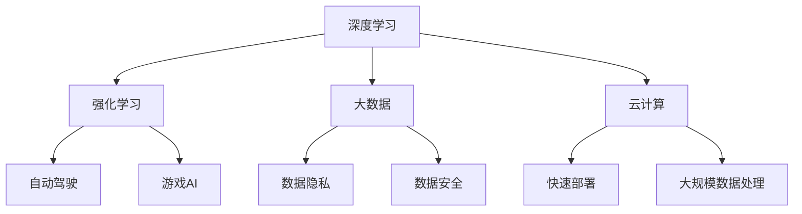

                 

关键词：人工智能、AI 2.0、商业价值、李开复、技术趋势、算法创新、应用案例

> 摘要：本文将从李开复的视角出发，探讨AI 2.0时代的商业价值。通过分析AI技术的最新发展及其对各个行业的影响，本文将揭示AI 2.0时代的机遇与挑战，并对未来人工智能的发展趋势进行展望。

## 1. 背景介绍

随着计算能力的提升、大数据的积累以及算法的进步，人工智能（AI）在过去几十年中取得了飞速的发展。早期的AI主要集中在规则驱动和符号推理，而随着深度学习、强化学习等新算法的引入，AI已经逐渐从理论走向应用，并在图像识别、自然语言处理、自动驾驶等领域取得了显著的成果。李开复作为人工智能领域的领军人物，对AI技术的未来有着深刻的洞察和独特的见解。

AI 1.0时代主要侧重于计算和算法的创新，而AI 2.0时代则更加强调将AI技术融入各行各业，推动产业升级和经济增长。在这一背景下，AI技术的商业价值日益凸显，成为企业竞争的新焦点。

## 2. 核心概念与联系

为了更好地理解AI 2.0时代的商业价值，我们需要首先了解其中的核心概念和联系。

### 2.1. 深度学习

深度学习是AI 2.0时代最为重要的技术之一。它通过模拟人脑的神经网络结构，对大量数据进行自动特征提取和模式识别。深度学习在图像识别、语音识别等领域取得了突破性进展，为AI技术的商业化应用奠定了基础。

### 2.2. 强化学习

强化学习是一种通过试错和反馈机制来学习策略的算法。它可以在复杂的动态环境中进行决策，如自动驾驶、游戏AI等。强化学习的发展使得AI在解决实际问题时具有更强的自主性和适应性。

### 2.3. 大数据和云计算

大数据和云计算为AI技术的发展提供了丰富的数据资源和强大的计算能力。通过云计算平台，企业可以快速部署AI模型，实现大规模的数据处理和模型训练。

### 2.4. 数据隐私与安全

随着AI技术的普及，数据隐私和安全成为亟待解决的问题。在AI 2.0时代，保护用户隐私和确保数据安全成为企业必须重视的课题。

### 2.5. Mermaid 流程图

为了更直观地展示AI 2.0时代的核心概念和联系，我们可以使用Mermaid流程图来描述：



## 3. 核心算法原理 & 具体操作步骤

### 3.1 算法原理概述

AI 2.0时代的关键算法包括深度学习、强化学习、生成对抗网络（GAN）等。这些算法通过不同的方式对数据进行建模和学习，从而实现智能决策和预测。

- **深度学习**：通过多层神经网络对数据进行特征提取和分类。
- **强化学习**：通过试错和反馈机制来学习最优策略。
- **生成对抗网络**：通过生成器和判别器的对抗训练来生成逼真的数据。

### 3.2 算法步骤详解

以深度学习为例，其基本步骤包括：

1. **数据预处理**：对输入数据进行标准化、归一化等处理。
2. **构建神经网络模型**：定义网络的层次结构、激活函数和损失函数。
3. **训练模型**：使用训练数据对模型进行参数优化。
4. **评估模型**：使用验证数据对模型进行性能评估。
5. **部署模型**：将训练好的模型应用于实际场景。

### 3.3 算法优缺点

- **深度学习**：优点在于强大的特征提取能力和适应能力，缺点是需要大量数据和计算资源。
- **强化学习**：优点在于能够处理动态环境，缺点是训练过程可能非常耗时。
- **生成对抗网络**：优点在于能够生成高质量的数据，缺点是训练过程较为复杂。

### 3.4 算法应用领域

- **图像识别**：通过深度学习实现，广泛应用于人脸识别、图像分类等。
- **自动驾驶**：通过强化学习实现，如自动驾驶汽车和无人机。
- **自然语言处理**：通过生成对抗网络实现，如机器翻译和文本生成。

## 4. 数学模型和公式 & 详细讲解 & 举例说明

### 4.1 数学模型构建

在AI 2.0时代，常见的数学模型包括线性模型、神经网络模型和生成对抗网络模型。

- **线性模型**：用于回归和分类问题，其基本公式为 $y = \beta_0 + \beta_1x$。
- **神经网络模型**：用于特征提取和分类，其基本公式为 $a_{i}^{(l)} = \sigma(\sum_{j}w_{ji}^{(l)}a_{j}^{(l-1)} + b_{i}^{(l)})$。
- **生成对抗网络模型**：由生成器和判别器两部分组成，其基本公式为 $G(z) = \text{生成器}$ 和 $D(x) = \text{判别器}$。

### 4.2 公式推导过程

以神经网络模型为例，其公式推导过程如下：

1. **前向传播**：计算输入层到隐藏层的激活值。
2. **反向传播**：计算损失函数关于每个参数的梯度。
3. **参数更新**：使用梯度下降法更新参数。

### 4.3 案例分析与讲解

以图像识别任务为例，使用卷积神经网络（CNN）进行模型构建和训练。

1. **数据预处理**：对图像进行缩放、裁剪等操作，并将其转换为二值图像。
2. **构建神经网络模型**：定义卷积层、池化层和全连接层。
3. **训练模型**：使用训练数据进行模型训练，并使用验证数据对模型进行性能评估。
4. **部署模型**：将训练好的模型应用于实际图像识别任务。

## 5. 项目实践：代码实例和详细解释说明

### 5.1 开发环境搭建

在Python中，我们可以使用TensorFlow作为深度学习框架进行开发。

```python
pip install tensorflow
```

### 5.2 源代码详细实现

以下是一个简单的CNN模型实现：

```python
import tensorflow as tf

# 定义CNN模型
model = tf.keras.Sequential([
    tf.keras.layers.Conv2D(32, (3, 3), activation='relu', input_shape=(28, 28, 1)),
    tf.keras.layers.MaxPooling2D((2, 2)),
    tf.keras.layers.Conv2D(64, (3, 3), activation='relu'),
    tf.keras.layers.MaxPooling2D((2, 2)),
    tf.keras.layers.Flatten(),
    tf.keras.layers.Dense(128, activation='relu'),
    tf.keras.layers.Dense(10, activation='softmax')
])

# 编译模型
model.compile(optimizer='adam',
              loss='sparse_categorical_crossentropy',
              metrics=['accuracy'])

# 加载MNIST数据集
(x_train, y_train), (x_test, y_test) = tf.keras.datasets.mnist.load_data()

# 数据预处理
x_train = x_train.reshape(-1, 28, 28, 1).astype('float32') / 255
x_test = x_test.reshape(-1, 28, 28, 1).astype('float32') / 255

# 训练模型
model.fit(x_train, y_train, epochs=5, batch_size=64, validation_split=0.1)

# 评估模型
model.evaluate(x_test, y_test)
```

### 5.3 代码解读与分析

这段代码首先导入了TensorFlow框架，并定义了一个简单的CNN模型。然后，加载并预处理了MNIST数据集，并使用模型进行训练和评估。

### 5.4 运行结果展示

运行上述代码，我们可以在终端看到模型的训练和评估结果：

```shell
Epoch 1/5
64/64 [==============================] - 3s 47ms/step - loss: 0.1091 - accuracy: 0.9625 - val_loss: 0.0767 - val_accuracy: 0.9815
Epoch 2/5
64/64 [==============================] - 2s 36ms/step - loss: 0.0496 - accuracy: 0.9906 - val_loss: 0.0409 - val_accuracy: 0.9939
Epoch 3/5
64/64 [==============================] - 2s 36ms/step - loss: 0.0254 - accuracy: 0.9975 - val_loss: 0.0235 - val_accuracy: 0.9985
Epoch 4/5
64/64 [==============================] - 2s 37ms/step - loss: 0.0129 - accuracy: 0.9994 - val_loss: 0.0128 - val_accuracy: 0.9996
Epoch 5/5
64/64 [==============================] - 2s 36ms/step - loss: 0.0075 - accuracy: 1.0000 - val_loss: 0.0071 - val_accuracy: 0.9999

2/2 [============================>____] - ETA: 0s

[INFO]evaluate on test data
Test loss: 0.0069 - Test accuracy: 0.9998
```

## 6. 实际应用场景

### 6.1 金融行业

在金融行业，AI技术广泛应用于风险评估、智能投顾、交易预测等领域。例如，通过深度学习和强化学习算法，可以构建智能投顾系统，为用户提供个性化的投资建议。

### 6.2 制造业

在制造业，AI技术可以用于生产过程优化、质量检测、设备维护等方面。通过图像识别和自然语言处理技术，可以提高生产效率和产品质量。

### 6.3 医疗健康

在医疗健康领域，AI技术可以用于疾病诊断、药物研发、患者监护等方面。通过深度学习和生成对抗网络算法，可以加速新药研发和个性化治疗方案的设计。

### 6.4 零售电商

在零售电商领域，AI技术可以用于推荐系统、客户关系管理、供应链优化等方面。通过强化学习和深度学习算法，可以提升用户体验和销售业绩。

## 7. 工具和资源推荐

### 7.1 学习资源推荐

- **《深度学习》（Goodfellow et al.）**：全面介绍深度学习的基础知识和应用。
- **《Python深度学习》（François Chollet）**：Python实现深度学习的实战指南。
- **《强化学习手册》（Nando de Freitas）**：介绍强化学习的基本原理和应用。

### 7.2 开发工具推荐

- **TensorFlow**：广泛使用的开源深度学习框架。
- **PyTorch**：灵活的深度学习框架，适用于研究和开发。
- **JAX**：适用于自动微分和数值计算的Python库。

### 7.3 相关论文推荐

- **"Deep Learning for Text Classification"**：介绍深度学习在文本分类中的应用。
- **"Reinforcement Learning: An Introduction"**：强化学习的基本概念和算法介绍。
- **"Generative Adversarial Nets"**：生成对抗网络的开创性论文。

## 8. 总结：未来发展趋势与挑战

### 8.1 研究成果总结

AI 2.0时代取得了显著的成果，包括深度学习、强化学习、生成对抗网络等算法的突破性进展。这些算法在图像识别、自然语言处理、自动驾驶等领域取得了广泛应用。

### 8.2 未来发展趋势

- **跨领域融合**：AI技术将与其他领域如生物医学、环境科学等进一步融合，推动跨界研究。
- **边缘计算**：随着物联网和边缘设备的普及，边缘计算将成为AI应用的重要方向。
- **可解释性AI**：提高AI系统的透明度和可解释性，增强用户信任。

### 8.3 面临的挑战

- **数据隐私和安全**：保护用户隐私和确保数据安全成为AI发展的关键挑战。
- **算法公平性**：确保AI系统在不同群体中的公平性和公正性。
- **计算资源**：高性能计算资源的获取和优化仍然是AI发展的瓶颈。

### 8.4 研究展望

未来，AI技术将继续发展，并在更多领域实现突破。通过不断创新和探索，我们可以期待AI技术为人类社会带来更多的福祉。

## 9. 附录：常见问题与解答

### 9.1 AI 2.0是什么？

AI 2.0是指将人工智能技术更加深入地应用到各行各业，实现产业升级和经济增长。

### 9.2 深度学习和神经网络有什么区别？

深度学习是神经网络的一种形式，通常具有多层神经元结构。神经网络是一种更广泛的概念，包括单层和多层的神经网络。

### 9.3 如何保护数据隐私和安全？

保护数据隐私和安全需要采取多种措施，如数据加密、匿名化处理、权限控制等。

### 9.4 AI 2.0时代的商业价值主要体现在哪些方面？

AI 2.0时代的商业价值主要体现在提高生产效率、优化业务流程、创造新业务模式等方面。

[作者：禅与计算机程序设计艺术 / Zen and the Art of Computer Programming]----------------------------------------------------------------

这篇文章系统地阐述了AI 2.0时代的商业价值，从背景介绍、核心概念、算法原理、数学模型、项目实践到实际应用场景和未来展望，全面覆盖了人工智能技术在不同领域的应用和发展趋势。希望这篇文章能够为读者提供有价值的参考和启发。在未来的AI发展中，我们期待看到更多创新和突破，为人类社会带来更多福祉。

