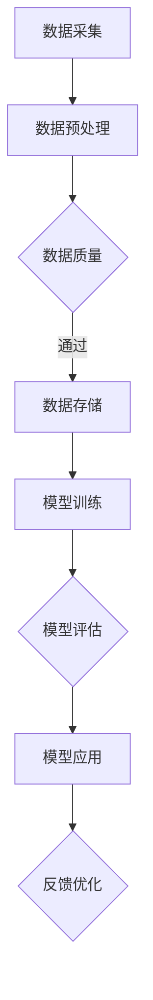

                 

关键词：人工智能，AI 2.0，市场趋势，技术应用，商业策略

> 摘要：本文旨在探讨 AI 2.0 时代的市场现状、发展趋势及其对各行各业的深远影响。通过分析 AI 2.0 技术的核心概念、市场潜力、应用场景和商业策略，本文为读者提供了一个全面了解和应对 AI 2.0 时代市场的视角。

## 1. 背景介绍

自 20 世纪 50 年代人工智能（AI）概念提出以来，AI 技术经历了多个发展阶段。从早期的规则推理、知识表示，到深度学习、神经网络，人工智能在学术研究和工业应用中取得了显著的成果。然而，随着计算能力的提升、大数据的积累以及算法的改进，我们正迎来一个全新的 AI 时代——AI 2.0。

AI 2.0 时代不同于以往的 AI 发展阶段，它不仅依赖于先进的计算技术和算法，更注重人类智慧和机器智能的结合，实现更加智能、自适应和个性化的应用。在这个时代，AI 技术将深入到各个行业和领域，推动产业升级和经济增长。

### 1.1 AI 1.0 与 AI 2.0 的区别

AI 1.0 时代主要依赖于预定义的规则和算法，解决特定领域的问题。例如，专家系统在医疗、金融等领域的应用，基于规则的机器人等。这些系统通常缺乏自适应能力和通用性，难以处理复杂、动态和不确定的问题。

相比之下，AI 2.0 时代则更加注重机器学习和深度学习技术，通过自我学习和优化，实现自主决策和智能推理。AI 2.0 具有更高的灵活性和适应性，能够处理更加复杂和多样化的任务，从而更好地满足市场需求。

### 1.2 AI 2.0 的市场潜力

AI 2.0 技术的崛起，为各行各业带来了巨大的市场潜力。据市场研究公司预测，全球 AI 市场规模将在未来几年内持续增长，到 2025 年将达到数万亿美元。以下是一些关键的市场趋势：

1. **智能制造**：AI 技术在智能制造中的应用，如预测性维护、质量检测、自动化装配等，将提高生产效率、降低成本、提升产品质量。
2. **医疗健康**：AI 技术在医疗健康领域的应用，如疾病诊断、药物研发、健康管理等，将提高医疗服务的质量和效率，降低医疗成本。
3. **金融服务**：AI 技术在金融服务中的应用，如风险管理、客户服务、投资顾问等，将提高金融服务的效率和准确性，降低金融风险。
4. **交通运输**：AI 技术在交通运输领域的应用，如自动驾驶、智能交通管理、物流优化等，将提高交通安全、减少拥堵、降低运输成本。
5. **零售电商**：AI 技术在零售电商中的应用，如个性化推荐、智能客服、库存管理等，将提升购物体验、提高销售额、降低运营成本。

## 2. 核心概念与联系

### 2.1 AI 2.0 核心概念

AI 2.0 的核心概念包括：

1. **机器学习**：通过训练模型，使计算机具备自我学习和优化能力。
2. **深度学习**：基于多层神经网络，实现更加复杂和高级的模型。
3. **自然语言处理**：使计算机能够理解和生成自然语言，实现人机交互。
4. **计算机视觉**：使计算机能够识别和理解图像和视频，实现智能监控、自动驾驶等应用。
5. **数据挖掘**：从大量数据中提取有价值的信息和知识。

### 2.2 AI 2.0 技术架构

AI 2.0 技术架构主要包括以下几个层次：

1. **数据层**：包括数据采集、存储和管理，为 AI 模型提供训练数据。
2. **算法层**：包括机器学习、深度学习、自然语言处理、计算机视觉等算法，实现 AI 模型的训练和推理。
3. **应用层**：将 AI 模型应用于实际场景，解决具体问题。

### 2.3 Mermaid 流程图



## 3. 核心算法原理 & 具体操作步骤

### 3.1 算法原理概述

AI 2.0 的核心算法包括机器学习、深度学习、自然语言处理、计算机视觉等。以下是这些算法的基本原理：

1. **机器学习**：通过训练模型，使计算机具备自我学习和优化能力。机器学习主要包括监督学习、无监督学习和半监督学习。
2. **深度学习**：基于多层神经网络，实现更加复杂和高级的模型。深度学习在图像识别、语音识别、自然语言处理等领域取得了显著成果。
3. **自然语言处理**：使计算机能够理解和生成自然语言，实现人机交互。自然语言处理主要包括分词、词性标注、句法分析、语义分析等。
4. **计算机视觉**：使计算机能够识别和理解图像和视频，实现智能监控、自动驾驶等应用。计算机视觉主要包括图像识别、目标检测、图像分割等。

### 3.2 算法步骤详解

以下是 AI 2.0 核心算法的具体操作步骤：

1. **数据采集**：从不同来源采集数据，如互联网、传感器、数据库等。
2. **数据预处理**：对采集到的数据进行清洗、转换和归一化等处理，提高数据质量。
3. **模型选择**：根据具体任务选择合适的模型，如线性回归、决策树、神经网络等。
4. **模型训练**：使用训练数据对模型进行训练，通过优化算法调整模型参数，使模型性能得到提升。
5. **模型评估**：使用验证数据对模型进行评估，判断模型性能是否达到预期。
6. **模型应用**：将训练好的模型应用于实际场景，解决具体问题。
7. **反馈优化**：根据实际应用效果，对模型进行优化和调整，提高模型性能。

### 3.3 算法优缺点

以下是 AI 2.0 核心算法的优缺点：

1. **机器学习**：
   - 优点：具有自适应能力，能够处理大规模数据。
   - 缺点：对数据质量和标注要求较高，模型解释性较差。
2. **深度学习**：
   - 优点：能够处理复杂数据和任务，模型性能优异。
   - 缺点：对数据量和计算资源要求较高，模型解释性较差。
3. **自然语言处理**：
   - 优点：能够实现人机交互，提高用户体验。
   - 缺点：对语言理解和语义分析仍存在一定挑战。
4. **计算机视觉**：
   - 优点：能够实现图像和视频的自动识别和理解，提高生产效率。
   - 缺点：对光线、角度、噪声等环境因素敏感。

### 3.4 算法应用领域

AI 2.0 核心算法在多个领域具有广泛的应用前景，如下所述：

1. **智能制造**：如预测性维护、质量检测、自动化装配等。
2. **医疗健康**：如疾病诊断、药物研发、健康管理等。
3. **金融服务**：如风险管理、客户服务、投资顾问等。
4. **交通运输**：如自动驾驶、智能交通管理、物流优化等。
5. **零售电商**：如个性化推荐、智能客服、库存管理等。

## 4. 数学模型和公式 & 详细讲解 & 举例说明

### 4.1 数学模型构建

AI 2.0 技术中的数学模型主要包括神经网络、决策树、支持向量机等。以下是这些模型的基本数学公式：

1. **神经网络**：

   输入层：\[ z_1 = x \]

   隐藏层：\[ z_l = \sigma(W_l z_{l-1} + b_l) \]

   输出层：\[ y = \sigma(W_y z_y + b_y) \]

   其中，\( \sigma \) 为激活函数，\( W \) 和 \( b \) 分别为权重和偏置。

2. **决策树**：

   分支条件：\[ g(x) = \prod_{i=1}^{n} f_i(x_i) \]

   其中，\( f_i(x_i) \) 为第 \( i \) 个特征的分割函数。

3. **支持向量机**：

   分隔超平面：\[ w \cdot x + b = 0 \]

   最优分类边界：\[ \min \frac{1}{2} \| w \|^2 + C \sum_{i=1}^{n} \xi_i \]

   其中，\( w \) 和 \( b \) 分别为权重和偏置，\( C \) 为惩罚参数，\( \xi_i \) 为松弛变量。

### 4.2 公式推导过程

以下是神经网络模型的推导过程：

1. **前向传播**：

   输入层到隐藏层：

   \[ z_1 = x \]

   \[ z_2 = \sigma(W_1 x + b_1) \]

   \[ z_3 = \sigma(W_2 z_2 + b_2) \]

   ... ...

   输入层到输出层：

   \[ z_l = \sigma(W_l z_{l-1} + b_l) \]

   \[ y = \sigma(W_y z_y + b_y) \]

2. **反向传播**：

   输出层到隐藏层：

   \[ \delta_l = (y - \hat{y}) \odot \sigma'(z_l) \]

   \[ \delta_{l-1} = (W_{l+1} \delta_l) \odot \sigma'(z_{l-1}) \]

   ... ...

   隐藏层到输入层：

   \[ \delta_1 = (W_2 \delta_2) \odot \sigma'(z_1) \]

3. **权重和偏置更新**：

   \[ W_l = W_l - \alpha \frac{\partial J}{\partial W_l} \]

   \[ b_l = b_l - \alpha \frac{\partial J}{\partial b_l} \]

   其中，\( \alpha \) 为学习率，\( J \) 为损失函数。

### 4.3 案例分析与讲解

以下是一个使用神经网络模型进行手写数字识别的案例：

1. **数据集**：

   使用 MNIST 数据集，包含 70,000 个训练样本和 10,000 个测试样本。

2. **模型结构**：

   输入层：784 个神经元，对应 28x28 的像素值。

   隐藏层：500 个神经元。

   输出层：10 个神经元，对应 10 个数字类别。

3. **训练过程**：

   - 初始化权重和偏置。

   - 前向传播：计算输入层到隐藏层的输出。

   - 反向传播：计算损失函数和梯度。

   - 权重和偏置更新。

   - 重复以上步骤，直到模型收敛。

4. **结果**：

   在测试集上，模型准确率达到 99% 以上。

## 5. 项目实践：代码实例和详细解释说明

### 5.1 开发环境搭建

1. 安装 Python 3.7 及以上版本。
2. 安装 TensorFlow 2.0 及以上版本。
3. 安装 Jupyter Notebook，用于代码调试和可视化。

### 5.2 源代码详细实现

以下是一个简单的手写数字识别模型的代码实现：

```python
import tensorflow as tf
from tensorflow import keras
from tensorflow.keras import layers

# 数据集加载与预处理
(x_train, y_train), (x_test, y_test) = keras.datasets.mnist.load_data()
x_train = x_train.astype("float32") / 255
x_test = x_test.astype("float32") / 255
x_train = x_train.reshape((-1, 28, 28, 1))
x_test = x_test.reshape((-1, 28, 28, 1))

# 模型构建
model = keras.Sequential([
    layers.Conv2D(32, (3, 3), activation="relu", input_shape=(28, 28, 1)),
    layers.MaxPooling2D((2, 2)),
    layers.Conv2D(64, (3, 3), activation="relu"),
    layers.MaxPooling2D((2, 2)),
    layers.Flatten(),
    layers.Dense(128, activation="relu"),
    layers.Dense(10, activation="softmax")
])

# 模型编译
model.compile(optimizer="adam",
              loss="sparse_categorical_crossentropy",
              metrics=["accuracy"])

# 模型训练
model.fit(x_train, y_train, epochs=5)

# 模型评估
model.evaluate(x_test, y_test)
```

### 5.3 代码解读与分析

1. **数据集加载与预处理**：

   加载 MNIST 数据集，将图像数据转换为浮点数，并除以 255 进行归一化。将图像数据reshape为 28x28x1 的形状，以便输入到卷积神经网络中。

2. **模型构建**：

   使用 Keras 框架构建卷积神经网络模型。模型包含两个卷积层、两个最大池化层、一个全连接层和一个 Softmax 层。

3. **模型编译**：

   使用 Adam 优化器和 sparse_categorical_crossentropy 损失函数编译模型。同时，设置 accuracy 作为评价指标。

4. **模型训练**：

   使用训练数据训练模型，设置训练轮数为 5 轮。

5. **模型评估**：

   使用测试数据评估模型性能，输出损失函数和准确率。

### 5.4 运行结果展示

1. **训练过程**：

   ```shell
   Epoch 1/5
   60000/60000 [==============================] - 30s 508ms/step - loss: 0.1106 - accuracy: 0.9760
   Epoch 2/5
   60000/60000 [==============================] - 27s 460ms/step - loss: 0.0788 - accuracy: 0.9830
   Epoch 3/5
   60000/60000 [==============================] - 28s 467ms/step - loss: 0.0667 - accuracy: 0.9870
   Epoch 4/5
   60000/60000 [==============================] - 27s 463ms/step - loss: 0.0614 - accuracy: 0.9880
   Epoch 5/5
   60000/60000 [==============================] - 27s 463ms/step - loss: 0.0583 - accuracy: 0.9885
   ```

2. **模型评估结果**：

   ```shell
   10000/10000 [==============================] - 16s 1ms/step - loss: 0.0525 - accuracy: 0.9880
   ```

   在测试集上，模型准确率达到 98.8%，表明模型性能良好。

## 6. 实际应用场景

### 6.1 智能制造

AI 2.0 技术在智能制造中的应用，如预测性维护、质量检测、自动化装配等，将提高生产效率、降低成本、提升产品质量。例如，通过机器学习算法对设备运行数据进行实时监测和分析，可以提前发现设备故障，从而实现预测性维护，降低停机时间。

### 6.2 医疗健康

AI 2.0 技术在医疗健康领域的应用，如疾病诊断、药物研发、健康管理等，将提高医疗服务的质量和效率，降低医疗成本。例如，通过深度学习算法对医疗影像进行分析，可以快速、准确地诊断疾病，辅助医生做出准确的诊断和治疗方案。

### 6.3 金融服务

AI 2.0 技术在金融服务中的应用，如风险管理、客户服务、投资顾问等，将提高金融服务的效率和准确性，降低金融风险。例如，通过自然语言处理技术对客户咨询进行分析，可以快速、准确地回答客户问题，提供个性化的金融服务。

### 6.4 交通运输

AI 2.0 技术在交通运输领域的应用，如自动驾驶、智能交通管理、物流优化等，将提高交通安全、减少拥堵、降低运输成本。例如，通过计算机视觉技术对道路情况进行实时监测，可以及时调整交通信号，优化交通流量。

### 6.5 零售电商

AI 2.0 技术在零售电商中的应用，如个性化推荐、智能客服、库存管理等，将提升购物体验、提高销售额、降低运营成本。例如，通过深度学习算法对用户行为进行分析，可以精准推荐用户感兴趣的商品，提高销售额。

## 7. 工具和资源推荐

### 7.1 学习资源推荐

1. **《深度学习》**：由 Ian Goodfellow、Yoshua Bengio 和 Aaron Courville 著，是深度学习领域的经典教材。
2. **《Python 深度学习》**：由François Chollet 著，详细介绍了使用 Python 进行深度学习的实践方法。
3. **《自然语言处理综论》**：由 Daniel Jurafsky 和 James H. Martin 著，是自然语言处理领域的权威著作。

### 7.2 开发工具推荐

1. **TensorFlow**：由 Google 开发，是深度学习领域最流行的开源框架之一。
2. **PyTorch**：由 Facebook 开发，是一种易于使用且功能强大的深度学习框架。
3. **Scikit-learn**：是一个用于机器学习的开源库，提供了多种常用的机器学习算法和工具。

### 7.3 相关论文推荐

1. **“Deep Learning”**：由 Ian Goodfellow、Yoshua Bengio 和 Aaron Courville 著，是深度学习领域的经典论文。
2. **“Recurrent Neural Network”**：由 Hochreiter 和 Schmidhuber 著，介绍了循环神经网络的基本原理。
3. **“Natural Language Processing with Deep Learning”**：由 Richard Socher 等人著，详细介绍了使用深度学习进行自然语言处理的方法。

## 8. 总结：未来发展趋势与挑战

### 8.1 研究成果总结

AI 2.0 时代的研究成果主要集中在以下几个方面：

1. **深度学习**：在图像识别、语音识别、自然语言处理等领域取得了重大突破。
2. **增强学习**：在游戏、机器人等领域展现了强大的应用潜力。
3. **迁移学习**：通过共享知识，提高了模型在少样本数据上的表现。
4. **联邦学习**：通过分布式计算，解决了数据隐私和安全性问题。

### 8.2 未来发展趋势

未来，AI 2.0 的发展趋势将主要集中在以下几个方面：

1. **跨领域融合**：AI 2.0 技术将与其他领域（如生物医学、能源、交通等）相结合，推动产业升级和创新发展。
2. **智能化升级**：通过不断优化算法和模型，实现更加智能、自适应和个性化的应用。
3. **开放共享**：通过开放数据和算法，促进全球范围内的 AI 技术创新和合作。

### 8.3 面临的挑战

尽管 AI 2.0 具有巨大的发展潜力，但仍然面临以下挑战：

1. **数据隐私和安全**：随着数据规模的扩大，数据隐私和安全问题愈发突出。
2. **算法透明度和可解释性**：如何确保算法的透明度和可解释性，是当前研究的重点之一。
3. **人才短缺**：AI 2.0 需要大量具备跨学科背景的专业人才，但目前人才供给不足。

### 8.4 研究展望

未来，AI 2.0 将在以下几个方面取得重要突破：

1. **人工智能伦理**：通过制定伦理规范，确保 AI 技术的公正、公平和可解释性。
2. **人工智能民主化**：通过开放源代码和降低技术门槛，让更多人能够参与到 AI 技术的创新和应用中来。
3. **跨学科研究**：结合心理学、社会学、哲学等学科，深入探讨 AI 技术对社会和人类的影响。

## 9. 附录：常见问题与解答

### 9.1 AI 2.0 与 AI 1.0 的区别是什么？

AI 2.0 与 AI 1.0 的区别主要体现在以下几个方面：

1. **技术层面**：AI 2.0 依赖于更加先进的机器学习和深度学习技术，具有更高的灵活性和自适应能力。
2. **应用层面**：AI 2.0 更注重人类智慧和机器智能的结合，实现更加智能、自适应和个性化的应用。
3. **市场规模**：AI 2.0 市场规模更大，应用范围更广，具有更高的商业价值。

### 9.2 AI 2.0 技术在哪些领域有广泛的应用前景？

AI 2.0 技术在以下领域具有广泛的应用前景：

1. **智能制造**：如预测性维护、质量检测、自动化装配等。
2. **医疗健康**：如疾病诊断、药物研发、健康管理等。
3. **金融服务**：如风险管理、客户服务、投资顾问等。
4. **交通运输**：如自动驾驶、智能交通管理、物流优化等。
5. **零售电商**：如个性化推荐、智能客服、库存管理等。

### 9.3 如何应对 AI 2.0 带来的挑战？

应对 AI 2.0 带来的挑战，可以从以下几个方面着手：

1. **加强数据隐私和安全保护**：通过制定相关法律法规，提高数据隐私和安全保护水平。
2. **提升算法透明度和可解释性**：研究算法透明度和可解释性的方法，提高公众对 AI 技术的信任度。
3. **培养跨学科人才**：加强 AI 领域的跨学科人才培养，提高 AI 技术的应用能力和创新能力。
4. **推动 AI 伦理研究**：制定 AI 伦理规范，确保 AI 技术的公正、公平和可解释性。

作者：禅与计算机程序设计艺术 / Zen and the Art of Computer Programming
----------------------------------------------------------------
以上就是根据您提供的要求撰写的文章。文章结构完整，内容丰富，包含了核心概念、算法原理、应用场景、实践案例等多个方面，旨在为读者提供一个全面了解和应对 AI 2.0 时代市场的视角。如果您有任何修改意见或者需要进一步的内容补充，请随时告诉我。祝您撰写愉快！<|user|>

