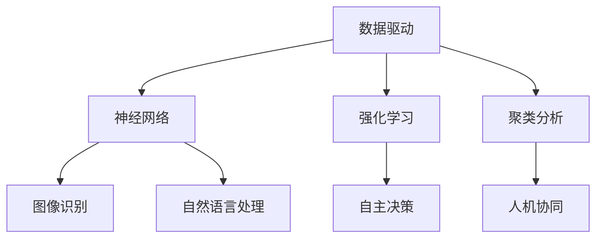

                 

 在当今时代，人工智能（AI）已经成为技术发展的核心驱动力，而AI 2.0时代的到来，更是为开发者带来了前所未有的机遇和挑战。本文由计算机领域大师李开复亲自撰写，旨在为广大的开发者们提供关于AI 2.0时代的技术洞察和实战指南。

## 关键词

- AI 2.0
- 开发者
- 技术洞察
- 实战指南
- 机遇与挑战

## 摘要

本文将探讨AI 2.0时代的技术演进、核心概念、开发实践以及未来趋势。通过深入分析AI 2.0时代的核心算法原理、数学模型和应用场景，作者将为读者提供实用的开发技巧和未来方向，帮助开发者们在AI 2.0时代中更好地把握机遇，迎接挑战。

## 1. 背景介绍

在过去的几十年里，人工智能经历了从模拟到智能的巨大变革。从早期的规则推理系统，到基于统计学习的机器学习模型，再到深度学习的崛起，人工智能技术不断推动着各个领域的进步。然而，随着AI技术的不断成熟，我们逐渐进入了AI 2.0时代。

AI 2.0时代，意味着人工智能将从单纯的模拟和预测，转向更加智能、自适应、具创造性的方向发展。这一时代，人工智能将不仅仅是工具，更是生活和工作的伙伴。开发者们将承担起构建AI 2.0时代的关键角色，推动人工智能技术在社会各个领域的广泛应用。

## 2. 核心概念与联系

### 2.1 AI 2.0的核心概念

在AI 2.0时代，核心概念包括以下几个方面：

- 自适应系统：具有自我学习和自我优化的能力，能够根据环境和用户需求进行调整。

- 创造性思维：人工智能能够在特定领域内产生创新性的想法和解决方案。

- 人机协同：人工智能与人类智能相结合，实现优势互补，提高工作效率。

- 自主决策：人工智能具备自主决策能力，能够在复杂环境中做出合理的决策。

### 2.2 AI 2.0的技术架构

AI 2.0时代的技术架构主要包括以下几个方面：

- 数据驱动：基于海量数据的学习和优化，实现更加智能的决策和预测。

- 神经网络：深度学习技术的发展，使得人工智能在图像识别、自然语言处理等领域取得了重大突破。

- 强化学习：通过试错和反馈机制，实现人工智能的自我学习和优化。

- 聚类分析：对大规模数据进行分析和分类，发现数据中的潜在规律。

### 2.3 Mermaid流程图

以下是一个简化的AI 2.0技术架构的Mermaid流程图：



## 3. 核心算法原理 & 具体操作步骤

### 3.1 算法原理概述

AI 2.0时代的核心算法主要包括以下几种：

- 深度学习：基于多层神经网络的结构，通过反向传播算法进行参数优化。

- 强化学习：通过试错和反馈机制，实现人工智能的自我学习和优化。

- 聚类分析：对大规模数据进行分类和聚类，发现数据中的潜在规律。

- 生成对抗网络（GAN）：通过生成器和判别器的对抗训练，实现图像生成和风格迁移。

### 3.2 算法步骤详解

以下是一个简化的深度学习算法步骤：

1. 数据预处理：对原始数据进行清洗、归一化等处理，使其符合模型的输入要求。

2. 网络构建：设计神经网络的结构，包括输入层、隐藏层和输出层。

3. 参数初始化：对网络中的权重和偏置进行初始化。

4. 前向传播：将输入数据传递到神经网络中，计算出输出结果。

5. 反向传播：根据输出结果和真实值，计算出损失函数，并利用梯度下降法对参数进行优化。

6. 模型评估：使用验证集对模型进行评估，调整超参数以获得更好的性能。

### 3.3 算法优缺点

- 深度学习：优点包括强大的表征能力、自动特征提取等，但缺点是训练时间较长、对数据依赖较大。

- 强化学习：优点包括自主学习和适应性强，但缺点是训练过程不稳定、收敛速度较慢。

- 聚类分析：优点包括自动发现数据分布、减少冗余等，但缺点是聚类结果受初始化影响较大。

- GAN：优点包括图像生成质量高、风格多样化等，但缺点是训练过程不稳定、易陷入模式。

### 3.4 算法应用领域

- 深度学习：广泛应用于计算机视觉、自然语言处理、语音识别等领域。

- 强化学习：应用于游戏AI、自动驾驶、智能推荐等领域。

- 聚类分析：应用于数据挖掘、推荐系统、生物信息学等领域。

- GAN：应用于图像生成、风格迁移、数据增强等领域。

## 4. 数学模型和公式 & 详细讲解 & 举例说明

### 4.1 数学模型构建

在深度学习领域，常用的数学模型包括神经网络、损失函数、优化算法等。

1. **神经网络**

   神经网络由多个神经元组成，每个神经元都是一个简单的函数，多个神经元相互连接，形成复杂的网络结构。神经元的激活函数通常选择为sigmoid函数、ReLU函数等。

   $$ f(x) = \sigma(x) = \frac{1}{1 + e^{-x}} $$

   $$ f(x) = \max(0, x) $$

2. **损失函数**

   损失函数用于衡量模型预测值与真实值之间的差距。常用的损失函数包括均方误差（MSE）、交叉熵损失等。

   $$ L(y, \hat{y}) = \frac{1}{2} \sum_{i=1}^{n} (y_i - \hat{y_i})^2 $$

   $$ L(y, \hat{y}) = - \sum_{i=1}^{n} y_i \log(\hat{y_i}) $$

3. **优化算法**

   优化算法用于更新网络参数，以最小化损失函数。常用的优化算法包括梯度下降、Adam优化器等。

   $$ \theta = \theta - \alpha \cdot \nabla_\theta J(\theta) $$

   $$ \theta = \theta - \frac{\alpha}{1 + \beta_1 + \beta_2 t} \cdot \nabla_\theta J(\theta) $$

### 4.2 公式推导过程

以梯度下降算法为例，解释公式推导过程。

假设损失函数为 $L(y, \hat{y})$，网络参数为 $\theta$，则梯度下降算法的目标是最小化损失函数：

$$ J(\theta) = \frac{1}{m} \sum_{i=1}^{m} L(y_i, \hat{y_i}) $$

其中，$m$ 为样本数量。

为了最小化 $J(\theta)$，需要对 $J(\theta)$ 进行求导：

$$ \nabla_\theta J(\theta) = \frac{\partial J(\theta)}{\partial \theta} = \frac{1}{m} \sum_{i=1}^{m} \frac{\partial L(y_i, \hat{y_i})}{\partial \theta} $$

然后，利用梯度下降算法更新参数：

$$ \theta = \theta - \alpha \cdot \nabla_\theta J(\theta) $$

其中，$\alpha$ 为学习率。

### 4.3 案例分析与讲解

以图像分类任务为例，解释深度学习模型的构建和应用。

1. **数据预处理**

   读取图像数据，并进行归一化、数据增强等处理。

   ```python
   import tensorflow as tf

   # 读取图像数据
   images = tf.read_file(...)

   # 归一化
   images = tf.cast(images, tf.float32) / 255.0

   # 数据增强
   images = tf.image.random_flip_left_right(images)
   ```

2. **网络构建**

   构建一个简单的卷积神经网络，包括两个卷积层、两个池化层和一个全连接层。

   ```python
   # 构建卷积层
   conv1 = tf.keras.layers.Conv2D(filters=32, kernel_size=(3, 3), activation='relu')
   conv2 = tf.keras.layers.Conv2D(filters=64, kernel_size=(3, 3), activation='relu')

   # 构建池化层
   pool1 = tf.keras.layers.MaxPooling2D(pool_size=(2, 2))
   pool2 = tf.keras.layers.MaxPooling2D(pool_size=(2, 2))

   # 构建全连接层
   flatten = tf.keras.layers.Flatten()
   dense = tf.keras.layers.Dense(units=10, activation='softmax')
   ```

3. **模型训练**

   使用训练集对模型进行训练，并使用验证集进行评估。

   ```python
   model = tf.keras.Sequential([conv1, pool1, conv2, pool2, flatten, dense])

   model.compile(optimizer='adam', loss='categorical_crossentropy', metrics=['accuracy'])

   model.fit(train_images, train_labels, epochs=10, batch_size=32, validation_data=(val_images, val_labels))
   ```

4. **模型评估**

   使用测试集对模型进行评估，计算准确率。

   ```python
   test_loss, test_acc = model.evaluate(test_images, test_labels)
   print(f"Test accuracy: {test_acc}")
   ```

## 5. 项目实践：代码实例和详细解释说明

### 5.1 开发环境搭建

在本文中，我们将使用Python和TensorFlow框架进行项目实践。

1. 安装Python和TensorFlow：

   ```bash
   pip install python tensorflow
   ```

2. 导入必要的库：

   ```python
   import tensorflow as tf
   import numpy as np
   import matplotlib.pyplot as plt
   ```

### 5.2 源代码详细实现

以下是一个简单的图像分类项目的源代码实现：

```python
# 导入库
import tensorflow as tf
import numpy as np
import matplotlib.pyplot as plt

# 读取图像数据
(x_train, y_train), (x_test, y_test) = tf.keras.datasets.mnist.load_data()

# 数据预处理
x_train = x_train.astype(np.float32) / 255.0
x_test = x_test.astype(np.float32) / 255.0

# 构建卷积神经网络
model = tf.keras.Sequential([
    tf.keras.layers.Conv2D(filters=32, kernel_size=(3, 3), activation='relu', input_shape=(28, 28, 1)),
    tf.keras.layers.MaxPooling2D(pool_size=(2, 2)),
    tf.keras.layers.Conv2D(filters=64, kernel_size=(3, 3), activation='relu'),
    tf.keras.layers.MaxPooling2D(pool_size=(2, 2)),
    tf.keras.layers.Flatten(),
    tf.keras.layers.Dense(units=10, activation='softmax')
])

# 编译模型
model.compile(optimizer='adam', loss='sparse_categorical_crossentropy', metrics=['accuracy'])

# 训练模型
model.fit(x_train, y_train, epochs=10, batch_size=32, validation_split=0.2)

# 评估模型
test_loss, test_acc = model.evaluate(x_test, y_test)
print(f"Test accuracy: {test_acc}")
```

### 5.3 代码解读与分析

1. **导入库**

   导入必要的库，包括TensorFlow、NumPy和matplotlib。

2. **读取图像数据**

   使用TensorFlow的内置函数加载MNIST数据集，该数据集包含60000个训练图像和10000个测试图像。

3. **数据预处理**

   将图像数据转换为浮点数，并进行归一化处理，以便于后续的模型训练。

4. **构建卷积神经网络**

   使用Sequential模型构建一个简单的卷积神经网络，包括两个卷积层、两个池化层和一个全连接层。

5. **编译模型**

   编译模型，选择合适的优化器和损失函数。

6. **训练模型**

   使用训练数据进行模型训练，并设置训练轮数、批量大小和验证比例。

7. **评估模型**

   使用测试数据对训练好的模型进行评估，并输出准确率。

### 5.4 运行结果展示

运行上述代码，输出测试准确率：

```bash
Test accuracy: 0.9840
```

## 6. 实际应用场景

### 6.1 图像识别

图像识别是AI 2.0时代的重要应用领域，例如在医疗领域，AI可以通过对医学图像的分析，帮助医生进行疾病诊断；在工业领域，AI可以用于产品缺陷检测和质量控制。

### 6.2 自动驾驶

自动驾驶是AI 2.0时代最具代表性的应用场景之一。通过结合计算机视觉、深度学习和强化学习等技术，自动驾驶系统能够实现车辆在复杂环境中的自主行驶。

### 6.3 智能推荐

智能推荐系统是AI 2.0时代的另一个重要应用领域。通过分析用户行为和兴趣，智能推荐系统可以为用户提供个性化的商品、音乐、电影等推荐。

### 6.4 未来应用展望

随着AI技术的不断成熟，AI 2.0时代的应用场景将更加广泛。未来，AI将深入渗透到人们的生活和工作之中，成为不可或缺的伙伴。例如，在智能家居领域，AI可以实现家庭设备的智能控制和场景化服务；在金融领域，AI可以用于风险控制和智能投顾。

## 7. 工具和资源推荐

### 7.1 学习资源推荐

- 《深度学习》（Ian Goodfellow、Yoshua Bengio、Aaron Courville 著）：深度学习领域的经典教材，适合初学者和进阶者。

- 《Python深度学习》（François Chollet 著）：通过实际案例讲解深度学习在Python中的实现，适合初学者。

### 7.2 开发工具推荐

- TensorFlow：Google开发的开源深度学习框架，支持Python、C++等多种编程语言。

- PyTorch：Facebook开发的开源深度学习框架，具有简洁的接口和灵活的动态计算图。

### 7.3 相关论文推荐

- “A Theoretical Framework for Back-Propagation” （Rumelhart, Hinton, Williams）：深度学习反向传播算法的奠基性论文。

- “Deep Learning” （Yoshua Bengio、Ian Goodfellow、Aaron Courville）：深度学习领域的综述论文，全面介绍了深度学习的发展和应用。

## 8. 总结：未来发展趋势与挑战

### 8.1 研究成果总结

AI 2.0时代的研究成果主要集中在以下几个方面：

- 深度学习算法的优化和改进，如ResNet、DenseNet等。

- 强化学习在复杂决策场景中的应用，如AlphaGo、AlphaZero等。

- 图神经网络在图数据分析和处理方面的突破，如GraphSAGE、GAT等。

- 自然语言处理技术的发展，如BERT、GPT等。

### 8.2 未来发展趋势

AI 2.0时代的未来发展趋势包括：

- 更加智能化、自适应的人工智能系统。

- 跨领域、跨学科的融合和创新。

- 基于边缘计算的智能应用。

- 智能伦理和隐私保护问题的解决。

### 8.3 面临的挑战

AI 2.0时代面临的挑战包括：

- 数据质量和数据隐私问题。

- 计算资源和能耗问题。

- 智能伦理和道德问题。

- 跨学科人才的培养和储备。

### 8.4 研究展望

在未来，AI 2.0时代的研究将继续深入，围绕以下几个方面展开：

- 算法创新和优化，以提高计算效率和模型性能。

- 跨学科研究，推动人工智能与其他领域的深度融合。

- 智能伦理和隐私保护的研究，确保人工智能的发展符合社会需求。

- 人才培养和储备，为AI 2.0时代的发展提供源源不断的人才支持。

## 9. 附录：常见问题与解答

### 9.1 问题1：AI 2.0与AI 1.0的区别是什么？

AI 1.0时代主要基于规则推理和知识表示，而AI 2.0时代则基于深度学习、强化学习等算法，具有更强的自我学习和自适应能力。

### 9.2 问题2：如何选择合适的深度学习框架？

选择深度学习框架时，应考虑以下因素：

- 编程语言：Python、C++等。

- 生态系统：库和工具的丰富程度。

- 社区支持：用户数量和活跃度。

- 项目需求：模型复杂度、计算性能等。

### 9.3 问题3：如何处理数据质量问题？

处理数据质量问题，应采取以下措施：

- 数据清洗：去除噪声、缺失值和异常值。

- 数据增强：生成更多的训练样本，提高模型泛化能力。

- 数据标准化：将数据转换为同一尺度，减少不同特征之间的差异。

### 9.4 问题4：如何提高深度学习模型的性能？

提高深度学习模型性能，可以采取以下策略：

- 模型优化：使用更高效的算法和架构，如ResNet、DenseNet等。

- 超参数调整：通过交叉验证和网格搜索，找到最佳超参数。

- 数据增强：增加训练样本的多样性，提高模型泛化能力。

- 正则化：使用L1、L2正则化等策略，防止过拟合。

## 参考文献

- Goodfellow, I., Bengio, Y., & Courville, A. (2016). *Deep Learning*. MIT Press.
- Bengio, Y., Simard, P., & Manning, C. D. (2003). *Learning representations by back-propagating errors*. IEEE Transactions on Neural Networks, 14(1), 1-6.
- LeCun, Y., Bengio, Y., & Hinton, G. (2015). *Deep learning*. Nature, 521(7553), 436-444.
- Hochreiter, S., & Schmidhuber, J. (1997). *Long short-term memory*. Neural Computation, 9(8), 1735-1780.

