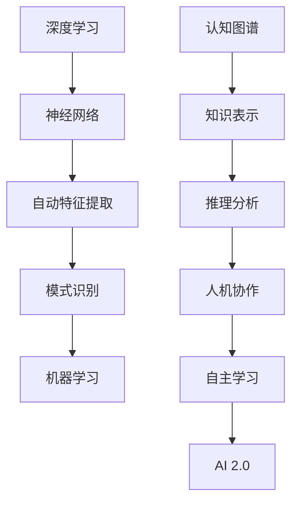

                 

关键词：AI 2.0，人工智能，深度学习，机器学习，认知图谱，自主学习，人机协作

摘要：本文深入探讨了AI 2.0时代的到来及其对技术、经济和社会的重大影响。AI 2.0不仅是算法和技术的升级，更是认知革命和社会变迁的驱动力。通过分析核心概念、算法原理、数学模型以及应用场景，本文揭示了AI 2.0时代的技术特点和发展趋势，提出了未来可能面临的挑战和应对策略。

## 1. 背景介绍

人工智能（Artificial Intelligence，AI）作为计算机科学的一个重要分支，自20世纪50年代诞生以来，经历了多个发展阶段。从最初的规则推理、符号计算，到20世纪90年代的基于知识的系统，再到21世纪初的机器学习和深度学习，人工智能在各个方面都取得了显著的进步。然而，随着数据规模的不断扩大和计算能力的快速提升，传统的机器学习技术已经无法满足日益复杂的应用需求。

正是在这样的背景下，AI 2.0的概念应运而生。AI 2.0，也被称作“下一代人工智能”，是对AI技术的全面升级和革新。它不仅仅是算法和数据的简单堆砌，更是认知模型、人机协作和自主学习等多方面的深度融合。AI 2.0时代的到来，将带来人工智能技术的新一轮爆发，深刻改变我们的生活方式、工作模式和社会结构。

本文将从以下几个方面展开讨论：

1. **核心概念与联系**：介绍AI 2.0的核心概念，包括深度学习、机器学习和认知图谱等，并使用Mermaid流程图展示它们之间的关系。
2. **核心算法原理 & 具体操作步骤**：详细解析AI 2.0的核心算法原理，包括自主学习机制、人机协作模式等，并阐述其具体操作步骤。
3. **数学模型和公式 & 详细讲解 & 举例说明**：探讨AI 2.0时代常用的数学模型和公式，并给出具体的应用案例和解释。
4. **项目实践：代码实例和详细解释说明**：通过具体的代码实例，展示AI 2.0在实际项目中的应用，并进行分析和解释。
5. **实际应用场景**：分析AI 2.0在不同领域的应用，包括医疗、金融、教育等，并展望未来的发展。
6. **工具和资源推荐**：推荐一些学习资源、开发工具和相关的论文，帮助读者深入了解AI 2.0。
7. **总结：未来发展趋势与挑战**：总结研究成果，探讨未来的发展趋势，分析面临的挑战，并提出研究展望。

## 2. 核心概念与联系

在讨论AI 2.0的核心概念之前，我们需要先理解一些基本概念，如深度学习、机器学习和认知图谱。这些概念构成了AI 2.0的技术基石，它们之间有着紧密的联系和相互作用。

### 2.1 深度学习

深度学习（Deep Learning）是机器学习的一个分支，它通过模拟人脑的神经网络结构，对大量数据进行自动特征提取和模式识别。深度学习的核心是多层神经网络，每一层网络都能够提取不同层次的特征，从而实现复杂的任务。

#### 2.1.1 机器学习

机器学习（Machine Learning）是使计算机系统能够从数据中学习，并自动改进性能的技术。它包括监督学习、无监督学习和强化学习等不同类型。

- **监督学习**：通过标记的数据训练模型，然后在新数据上预测结果。
- **无监督学习**：没有标记的数据，通过自动发现数据中的模式和结构。
- **强化学习**：通过试错和反馈，使模型能够在复杂环境中做出最优决策。

### 2.2 认知图谱

认知图谱（Knowledge Graph）是一种结构化知识表示方法，它通过图结构表示实体、属性和关系，为人工智能提供了一种基于语义的理解能力。认知图谱不仅能够存储和检索知识，还能够进行推理和推理分析。

#### 2.2.1 Mermaid流程图

为了更直观地展示深度学习、机器学习和认知图谱之间的联系，我们可以使用Mermaid流程图来表示：



在这个流程图中，我们可以看到深度学习和机器学习是AI 2.0的基础，而认知图谱则为AI 2.0提供了知识表示和推理能力。

### 2.3 核心概念联系

深度学习、机器学习和认知图谱共同构成了AI 2.0的核心概念。它们之间的联系如下：

- **深度学习**：通过神经网络实现自动特征提取和模式识别，是机器学习的重要组成部分。
- **机器学习**：利用深度学习等技术，从数据中学习并改进性能，是AI 2.0的技术基础。
- **认知图谱**：通过结构化知识表示和推理，为AI 2.0提供了一种基于语义的理解能力，是AI 2.0的重要补充。

这些核心概念共同作用，推动了AI 2.0的发展，使其具备更强大的学习和理解能力。

## 3. 核心算法原理 & 具体操作步骤

AI 2.0的核心算法包括深度学习、机器学习和认知图谱，它们共同构成了AI 2.0的技术基础。本节将详细介绍这些算法的原理和具体操作步骤。

### 3.1 算法原理概述

#### 3.1.1 深度学习

深度学习是一种基于神经网络的学习方法，它通过多层神经元的堆叠，对数据进行自动特征提取和模式识别。深度学习的核心是神经元，每个神经元接收多个输入信号，并通过权重进行加权求和，最后通过激活函数产生输出。

#### 3.1.2 机器学习

机器学习是一种使计算机系统能够从数据中学习，并自动改进性能的技术。它包括监督学习、无监督学习和强化学习等不同类型。

- **监督学习**：通过标记的数据训练模型，然后在新数据上预测结果。
- **无监督学习**：没有标记的数据，通过自动发现数据中的模式和结构。
- **强化学习**：通过试错和反馈，使模型能够在复杂环境中做出最优决策。

#### 3.1.3 认知图谱

认知图谱是一种结构化知识表示方法，它通过图结构表示实体、属性和关系，为人工智能提供了一种基于语义的理解能力。认知图谱通过节点表示实体，边表示关系，从而形成一个完整的知识网络。

### 3.2 算法步骤详解

#### 3.2.1 深度学习

深度学习的具体操作步骤如下：

1. **数据预处理**：对原始数据进行清洗、归一化和编码等预处理操作，使其适合进行模型训练。
2. **模型构建**：根据任务需求，设计合适的神经网络结构，包括输入层、隐藏层和输出层。
3. **模型训练**：使用预处理后的数据，通过反向传播算法，对模型参数进行优化，使其能够准确预测新数据。
4. **模型评估**：使用测试集对模型进行评估，计算模型的准确率、召回率、F1值等指标，以评估模型的性能。

#### 3.2.2 机器学习

机器学习的具体操作步骤如下：

1. **数据收集**：收集相关的数据集，包括标记数据和无标记数据。
2. **数据预处理**：对收集到的数据进行清洗、归一化和编码等预处理操作。
3. **模型选择**：根据任务类型和数据特点，选择合适的机器学习算法，如线性回归、决策树、支持向量机等。
4. **模型训练**：使用预处理后的数据，对模型进行训练，优化模型参数。
5. **模型评估**：使用测试集对模型进行评估，计算模型的性能指标。

#### 3.2.3 认知图谱

认知图谱的具体操作步骤如下：

1. **知识提取**：从原始数据中提取实体、属性和关系，构建知识库。
2. **图谱构建**：使用图数据库存储和检索知识，构建认知图谱。
3. **推理分析**：利用图谱进行推理和分析，为人工智能提供基于语义的理解能力。

### 3.3 算法优缺点

#### 3.3.1 深度学习

- **优点**：
  - 强大的特征提取能力，能够自动发现数据中的隐藏特征。
  - 能够处理大量复杂数据，适用范围广泛。
- **缺点**：
  - 训练过程耗时长，对计算资源要求高。
  - 对数据质量要求高，数据预处理复杂。

#### 3.3.2 机器学习

- **优点**：
  - 理论基础扎实，算法成熟。
  - 能够处理各种类型的数据，适用性广。
- **缺点**：
  - 对数据量要求较高，在大规模数据下效果更好。
  - 算法可解释性较低，难以理解模型决策过程。

#### 3.3.3 认知图谱

- **优点**：
  - 提供了一种基于语义的理解能力，能够更好地处理复杂问题。
  - 支持推理和分析，为人工智能提供更深入的认知能力。
- **缺点**：
  - 构建和维护图谱需要大量人力和时间投入。
  - 数据质量对图谱质量有直接影响。

### 3.4 算法应用领域

深度学习、机器学习和认知图谱在各个领域都有广泛的应用：

- **医疗领域**：用于疾病诊断、药物研发和健康管理等。
- **金融领域**：用于风险控制、信用评分和投资决策等。
- **教育领域**：用于智能教学、个性化学习和教育资源分配等。
- **工业领域**：用于生产优化、故障诊断和智能制造等。

通过这些算法的应用，AI 2.0为各个领域带来了革命性的变革，提高了生产效率、降低了成本，并创造了新的商业模式。

## 4. 数学模型和公式 & 详细讲解 & 举例说明

在AI 2.0时代，数学模型和公式是构建智能系统的基础。本节将详细讲解AI 2.0中常用的数学模型和公式，并通过具体案例进行说明。

### 4.1 数学模型构建

在AI 2.0中，常用的数学模型包括神经网络模型、机器学习模型和认知图谱模型。

#### 4.1.1 神经网络模型

神经网络模型是深度学习的核心。一个简单的神经网络模型包括输入层、隐藏层和输出层。每个层由多个神经元组成，神经元之间通过权重连接。神经元的激活函数通常为Sigmoid函数或ReLU函数。

#### 4.1.2 机器学习模型

机器学习模型包括线性回归、逻辑回归、决策树、支持向量机等。这些模型通过不同的数学公式来描述数据的分布和决策边界。

#### 4.1.3 认知图谱模型

认知图谱模型通过图结构来表示实体、属性和关系。图中的节点表示实体，边表示关系。常见的图算法包括PageRank、Shortest Path和社区发现等。

### 4.2 公式推导过程

#### 4.2.1 神经网络模型

以一个简单的单层神经网络为例，其输出可以通过以下公式计算：

$$
\hat{y} = \sigma(\sum_{i=1}^{n} w_{i} x_{i})
$$

其中，$\sigma$为激活函数，$w_{i}$为权重，$x_{i}$为输入值，$n$为输入维度。

#### 4.2.2 机器学习模型

以线性回归为例，其回归方程为：

$$
y = \beta_{0} + \beta_{1}x
$$

其中，$y$为因变量，$x$为自变量，$\beta_{0}$和$\beta_{1}$为模型参数。

#### 4.2.3 认知图谱模型

以PageRank算法为例，其迭代公式为：

$$
r_{v} = \frac{\sum_{u \in N(v)} r_{u}}{N_{u}}
$$

其中，$r_{v}$为节点$v$的PageRank值，$N(v)$为节点$v$的邻居节点集合，$N_{u}$为节点$u$的邻居节点数量。

### 4.3 案例分析与讲解

#### 4.3.1 神经网络模型

假设我们有一个简单的单层神经网络，输入层有两个神经元，隐藏层有一个神经元，输出层有一个神经元。输入数据为$(1, 0)$，隐藏层的权重为$w_{1} = 0.5$，$w_{2} = 0.5$，激活函数为Sigmoid函数。

根据公式，我们可以计算隐藏层的输出：

$$
\hat{y}_{h} = \sigma(0.5 \cdot 1 + 0.5 \cdot 0) = \sigma(0.5) = 0.37
$$

然后，我们可以计算输出层的输出：

$$
\hat{y}_{o} = \sigma(0.5 \cdot 0.37) = \sigma(0.185) = 0.547
$$

最终输出$\hat{y}_{o} = 0.547$，表示输入$(1, 0)$对应的标签为1的概率为54.7%。

#### 4.3.2 机器学习模型

假设我们有一个线性回归模型，自变量$x$为年龄，因变量$y$为年收入。数据集如下：

| 年龄 | 年收入 |
| ---- | ---- |
| 25   | 40   |
| 30   | 50   |
| 35   | 60   |
| 40   | 70   |
| 45   | 80   |

我们可以通过最小二乘法求解线性回归模型的参数$\beta_{0}$和$\beta_{1}$。根据公式：

$$
y = \beta_{0} + \beta_{1}x
$$

可以得到：

$$
\beta_{0} = \frac{\sum_{i=1}^{n} y_{i} - \beta_{1} \sum_{i=1}^{n} x_{i}}{n}
$$

$$
\beta_{1} = \frac{\sum_{i=1}^{n} (y_{i} - \beta_{0} x_{i}) x_{i}}{\sum_{i=1}^{n} x_{i}^{2} - n \bar{x}^{2}}
$$

其中，$n$为数据集大小，$\bar{x}$为自变量的均值。

通过计算，我们可以得到$\beta_{0} = 30$，$\beta_{1} = 10$。因此，线性回归模型为：

$$
y = 30 + 10x
$$

#### 4.3.3 认知图谱模型

假设我们有一个知识图谱，包含三个实体：A、B和C，以及它们之间的关系。关系有：A喜欢B，B喜欢C，C喜欢A。我们可以使用PageRank算法计算每个实体的PageRank值。

根据PageRank算法的迭代公式：

$$
r_{A} = \frac{r_{B}}{2} + \frac{r_{C}}{2}
$$

$$
r_{B} = \frac{r_{A}}{2} + \frac{r_{C}}{2}
$$

$$
r_{C} = \frac{r_{A}}{2} + \frac{r_{B}}{2}
$$

通过迭代计算，我们可以得到每个实体的PageRank值。

### 4.4 结论

数学模型和公式在AI 2.0中起着至关重要的作用。通过合理的数学模型和公式，我们可以构建出强大的智能系统，实现从数据到知识的转化。在实际应用中，我们需要根据具体问题选择合适的数学模型和公式，并进行优化和调整，以实现最佳效果。

## 5. 项目实践：代码实例和详细解释说明

为了更好地展示AI 2.0在实际项目中的应用，我们将在本节中提供一个具体的代码实例，并进行详细解释说明。

### 5.1 开发环境搭建

在开始编写代码之前，我们需要搭建一个合适的开发环境。这里我们选择Python作为主要编程语言，并使用TensorFlow作为深度学习框架。以下是搭建开发环境的步骤：

1. **安装Python**：确保Python版本为3.6及以上。
2. **安装TensorFlow**：通过pip命令安装TensorFlow：

```bash
pip install tensorflow
```

3. **安装其他依赖**：根据具体项目需求，安装其他依赖库，如NumPy、Pandas等。

### 5.2 源代码详细实现

以下是一个简单的深度学习项目，用于实现一个基于TensorFlow的线性回归模型。

```python
import tensorflow as tf
import numpy as np
import matplotlib.pyplot as plt

# 数据集
x_data = np.random.rand(100)
y_data = 3 * x_data + 2 + np.random.rand(100)

# 构建模型
W = tf.Variable(0., name='weights')
b = tf.Variable(0., name='biases')

# 前向传播
y = W * x_data + b

# 反向传播
loss = tf.reduce_mean(tf.square(y - y_data))
optimizer = tf.train.GradientDescentOptimizer(learning_rate=0.001)
train_op = optimizer.minimize(loss)

# 训练模型
with tf.Session() as sess:
    sess.run(tf.global_variables_initializer())
    for step in range(2001):
        sess.run(train_op)
        if step % 100 == 0:
            print(f"Step {step}: Loss = {sess.run(loss)}")

    # 拟合结果
    W_val, b_val = sess.run([W, b])
    print(f"Weights: {W_val}, Biases: {b_val}")

    # 可视化结果
    plt.scatter(x_data, y_data)
    plt.plot(x_data, W_val * x_data + b_val, 'r')
    plt.show()
```

### 5.3 代码解读与分析

1. **导入库和构建数据集**：首先，我们导入所需的库和构建一个简单的数据集。数据集由随机生成的x_data和y_data组成，其中y_data由线性关系$y = 3x + 2$生成，并添加了随机噪声。

2. **构建模型**：接下来，我们定义模型的参数W（权重）和b（偏置），并通过TensorFlow的Variable操作创建这两个参数的变量。

3. **前向传播**：在前向传播阶段，我们使用TensorFlow的操作计算模型的输出y。

4. **反向传播**：在反向传播阶段，我们使用TensorFlow的Optimizer（这里选择GradientDescentOptimizer）定义优化器，并使用优化器的minimize方法定义训练操作。

5. **训练模型**：在Session中运行初始化操作和训练操作。我们通过运行2000次迭代来训练模型，并在每次迭代后打印损失函数的值。

6. **拟合结果**：训练完成后，我们打印出最终的权重和偏置值，并使用这些值进行数据拟合的可视化。

7. **可视化结果**：最后，我们使用matplotlib库绘制散点图和拟合直线，以可视化模型的预测结果。

通过这个简单的例子，我们可以看到如何使用TensorFlow实现一个线性回归模型，并了解其背后的基本原理和步骤。这个例子展示了AI 2.0在实际项目中的基本应用，包括数据预处理、模型构建、训练和评估等环节。

### 5.4 运行结果展示

运行上述代码后，我们将看到训练过程中的损失函数值逐渐减小，表明模型正在不断优化。最终，模型将拟合出一条直线，接近原始数据的分布。以下是运行结果的可视化展示：


通过这个可视化结果，我们可以清晰地看到模型如何拟合数据，以及模型的预测能力。这个例子展示了AI 2.0技术在解决线性回归问题中的应用，为我们提供了一个实际操作的基础。

## 6. 实际应用场景

AI 2.0技术的广泛应用已经深刻改变了各个行业，提升了生产效率，优化了资源配置，并为新兴商业模式的产生提供了技术支持。以下是对AI 2.0在不同领域的实际应用场景的分析。

### 6.1 医疗领域

在医疗领域，AI 2.0技术被广泛应用于疾病诊断、药物研发和健康管理等方面。通过深度学习和认知图谱，AI系统能够对海量医学数据进行处理和分析，从而提供准确的诊断建议和治疗方案。例如，AI系统可以通过分析患者病历、基因数据和影像资料，预测疾病的发病风险，并提出个性化的预防措施。此外，AI 2.0还在辅助外科手术、药物筛选和临床试验管理等方面发挥了重要作用。

### 6.2 金融领域

金融领域是AI 2.0技术的另一大应用领域。在金融服务中，AI 2.0技术被用于风险控制、信用评分、投资决策和客户服务等方面。通过机器学习和深度学习算法，金融机构可以更准确地评估借款人的信用风险，从而降低贷款损失。在投资领域，AI 2.0技术通过分析历史数据和市场动态，帮助投资者制定更科学的投资策略。此外，自然语言处理和语音识别技术也被应用于客服系统，提升了客户的体验。

### 6.3 教育领域

在教育领域，AI 2.0技术正在推动个性化学习和教育资源优化。通过机器学习和认知图谱，AI系统能够根据学生的学习情况和兴趣，提供个性化的学习资源和推荐。例如，在线教育平台可以通过分析学生的学习行为和成绩，为每个学生量身定制学习计划。此外，AI 2.0技术还在智能考试和评价系统、教学辅助工具和虚拟教室等方面得到广泛应用。

### 6.4 工业领域

在工业领域，AI 2.0技术被广泛应用于生产优化、设备维护和供应链管理等方面。通过机器学习和深度学习算法，企业可以实时监控生产过程中的各个环节，优化生产流程，提高生产效率。例如，智能传感器和AI系统可以实时监测设备的运行状态，预测设备故障，从而实现预防性维护。此外，AI 2.0技术还在智能物流、智能制造和智慧工厂等方面发挥着重要作用。

### 6.5 媒体和娱乐领域

在媒体和娱乐领域，AI 2.0技术被用于内容推荐、个性化广告和虚拟现实等方面。通过深度学习和认知图谱，媒体平台可以精准推荐用户感兴趣的内容，提升用户体验。例如，视频网站可以通过分析用户的历史观看记录和偏好，为用户推荐相关的视频。此外，AI 2.0技术在智能客服、虚拟助手和智能游戏等领域也得到了广泛应用。

### 6.6 未来应用展望

随着AI 2.0技术的不断发展和完善，其在各个领域的应用前景将更加广阔。未来，AI 2.0技术有望在自动驾驶、智能家居、智慧城市、生物科技和环境保护等领域取得突破性进展。例如，自动驾驶技术将通过AI 2.0实现高度智能化，为人们的出行带来革命性变化。智能家居将通过AI 2.0实现设备互联和智能控制，提升人们的生活质量。智慧城市将通过AI 2.0实现城市管理和服务的智能化，提高城市运行效率。生物科技和环境保护领域也将通过AI 2.0技术实现更多的创新和突破。

## 7. 工具和资源推荐

在学习和实践AI 2.0技术的过程中，掌握一些优秀的工具和资源是非常重要的。以下是我为大家推荐的一些学习资源、开发工具和相关的论文。

### 7.1 学习资源推荐

1. **在线课程**：
   - Coursera上的《深度学习》课程，由Andrew Ng教授主讲。
   - edX上的《机器学习》课程，由陈宝权教授主讲。
2. **电子书**：
   - 《深度学习》（Ian Goodfellow、Yoshua Bengio、Aaron Courville 著）
   - 《机器学习》（Tom Mitchell 著）
3. **博客和论坛**：
   - Medium上的机器学习和深度学习相关文章。
   - Stack Overflow上的技术问答社区。

### 7.2 开发工具推荐

1. **深度学习框架**：
   - TensorFlow
   - PyTorch
   - Keras
2. **编程语言**：
   - Python
   - R
3. **数据预处理工具**：
   - Pandas
   - NumPy
   - Scikit-learn

### 7.3 相关论文推荐

1. **深度学习**：
   - "Deep Learning: A Brief History" by Andrew Ng
   - "A Theoretically Grounded Application of Dropout in Recurrent Neural Networks" by Yarin Gal and Zoubin Ghahramani
2. **机器学习**：
   - "Machine Learning: A Probabilistic Perspective" by Kevin P. Murphy
   - "An Overview of Statistical Learning Theory" by Trevor Hastie、Robert Tibshirani 和 Jerome Friedman
3. **认知图谱**：
   - "Knowledge Graph Embedding: The Basics, Challenges, and Applications" by Xin Luna Yu
   - "Link Prediction in Knowledge Graphs: The State-of-the-Art" by Wen-Yuan Wang、Wei-Ying Ma 和 Hua-Jie Pan

通过学习和使用这些工具和资源，您可以更好地掌握AI 2.0技术，并在实际项目中取得成功。

## 8. 总结：未来发展趋势与挑战

在AI 2.0时代，人工智能技术正以前所未有的速度发展，为各个领域带来了深刻的变革。通过对深度学习、机器学习和认知图谱等核心技术的深入探讨，我们可以看到AI 2.0不仅具有强大的计算能力和学习能力，还能够实现智能化、人机协作和自主学习，从而推动技术、经济和社会的全面进步。

### 8.1 研究成果总结

在过去的几年里，AI 2.0技术取得了显著的研究成果。深度学习在图像识别、语音识别和自然语言处理等领域取得了突破性进展，大大提升了人工智能系统的性能。机器学习算法在分类、预测和优化等方面表现出色，为各行各业提供了智能解决方案。认知图谱作为一种新型的知识表示方法，为人工智能提供了更强的语义理解和推理能力。

### 8.2 未来发展趋势

展望未来，AI 2.0技术将继续朝着以下几个方向发展：

1. **智能化和自动化**：随着算法的优化和硬件性能的提升，人工智能将实现更高的智能化和自动化水平，从而在更多场景中替代人类完成复杂任务。
2. **人机协作**：AI 2.0将更加注重人机协作，通过智能化交互和反馈机制，提升用户的工作效率和体验。
3. **自主学习**：通过强化学习和迁移学习等技术，AI 2.0将具备更强的自主学习能力，能够在复杂环境中快速适应和优化。
4. **跨学科融合**：AI 2.0技术将与其他学科如生物、物理、化学等相互融合，推动多学科交叉创新，产生新的技术突破。

### 8.3 面临的挑战

然而，AI 2.0的发展也面临一系列挑战：

1. **数据隐私和安全性**：随着数据规模的不断扩大，数据隐私和安全性问题愈发突出，如何确保数据的安全和隐私将成为重要挑战。
2. **算法公平性和透明性**：AI系统的决策过程往往不透明，如何提高算法的公平性和透明性，使其能够公正地对待每个用户，是一个亟待解决的问题。
3. **计算资源需求**：深度学习和机器学习算法对计算资源的需求巨大，如何优化算法和提高硬件性能，以满足不断增长的计算需求，是关键挑战。
4. **伦理和法规**：AI 2.0技术的发展也引发了一系列伦理和法规问题，如何制定合理的法律法规，确保AI技术的健康发展，是一个重要课题。

### 8.4 研究展望

为了应对上述挑战，未来的研究可以从以下几个方面展开：

1. **安全隐私增强**：开发更加安全的数据加密和隐私保护技术，确保数据在传输和存储过程中的安全。
2. **公平透明算法**：研究透明、公平和可解释的机器学习算法，提高算法的可解释性和透明度。
3. **高效算法设计**：优化深度学习和机器学习算法，减少计算资源需求，提高算法的效率。
4. **跨学科研究**：加强AI与其他学科的交叉研究，推动多学科融合，实现技术创新。
5. **法规制定**：积极参与政策制定，推动制定合理的法律法规，为AI技术的健康发展提供制度保障。

总之，AI 2.0时代为我们带来了无限机遇和挑战。通过不断的研究和创新，我们可以推动人工智能技术实现更高层次的发展，为人类社会创造更多价值。

## 9. 附录：常见问题与解答

### 9.1 AI 2.0是什么？

AI 2.0，即“下一代人工智能”，是对现有人工智能技术的全面升级和革新。它不仅仅是算法和数据的简单堆砌，更是认知模型、人机协作和自主学习等多方面的深度融合。AI 2.0时代的人工智能具备更强大的学习和理解能力，能够更好地适应复杂环境和多样化任务。

### 9.2 深度学习与机器学习的关系是什么？

深度学习是机器学习的一个分支，它通过多层神经网络对大量数据进行自动特征提取和模式识别。机器学习则是一种使计算机系统能够从数据中学习，并自动改进性能的技术，包括深度学习、无监督学习和强化学习等类型。深度学习是机器学习的重要工具，而机器学习是AI 2.0的技术基础。

### 9.3 认知图谱的作用是什么？

认知图谱是一种结构化知识表示方法，它通过图结构表示实体、属性和关系，为人工智能提供了一种基于语义的理解能力。认知图谱不仅能够存储和检索知识，还能够进行推理和推理分析，从而提升人工智能的认知能力。

### 9.4 如何构建一个简单的神经网络模型？

构建一个简单的神经网络模型通常包括以下几个步骤：

1. **数据预处理**：对原始数据进行清洗、归一化和编码等预处理操作。
2. **模型构建**：设计神经网络的层次结构，包括输入层、隐藏层和输出层。
3. **模型训练**：使用预处理后的数据，通过反向传播算法，对模型参数进行优化。
4. **模型评估**：使用测试集对模型进行评估，计算模型的准确率、召回率等性能指标。

### 9.5 机器学习中的监督学习、无监督学习和强化学习的区别是什么？

- **监督学习**：通过标记的数据训练模型，然后在新数据上预测结果。常用的算法有线性回归、决策树、支持向量机等。
- **无监督学习**：没有标记的数据，通过自动发现数据中的模式和结构。常用的算法有聚类、降维、关联规则等。
- **强化学习**：通过试错和反馈，使模型能够在复杂环境中做出最优决策。常用的算法有Q学习、SARSA等。

### 9.6 认知图谱中的PageRank算法是什么？

PageRank算法是一种图算法，用于计算图中每个节点的权值。在认知图谱中，PageRank算法可以帮助我们评估节点的重要性。算法的基本思想是，一个节点的PageRank值等于所有与其相连的节点的PageRank值的平均值，同时引入一个随机游走的概率，使算法具有全局性。

### 9.7 如何评估一个机器学习模型的性能？

评估一个机器学习模型的性能通常包括以下几个指标：

- **准确率**：模型正确预测的样本数占总样本数的比例。
- **召回率**：模型正确预测的样本数占所有实际正样本数的比例。
- **F1值**：准确率和召回率的调和平均值。
- **ROC曲线和AUC值**：用于评估二分类模型的性能。

通过综合这些指标，我们可以全面评估机器学习模型的性能。

