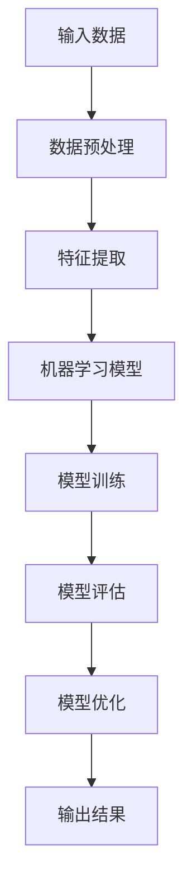

                 

关键词：人工智能，文化价值，AI 2.0，技术变革，社会影响，伦理问题，未来趋势

## 摘要

随着人工智能技术的迅速发展，我们正迈入一个崭新的AI 2.0时代。在这一时代，人工智能不仅改变了生产方式、生活方式，更深远地影响了我们的文化价值观。本文将探讨AI 2.0时代的文化价值，分析人工智能技术如何重塑人类社会的各个方面，并提出未来发展的挑战和机遇。作者李开复，作为世界著名的人工智能专家和计算机图灵奖获得者，将结合自身丰富的研究和实践经验，为读者提供深刻的见解。

## 1. 背景介绍

### 1.1 人工智能的发展历程

人工智能（AI）是一门研究、开发用于模拟、延伸和扩展人的智能的理论、方法、技术及应用。它起源于20世纪50年代，至今已经经历了多个发展阶段。从最初的规则系统，到基于符号逻辑的专家系统，再到基于概率统计和神经网络的机器学习，人工智能技术不断进化，逐渐展现出强大的智能和适应性。

### 1.2  AI 2.0的概念

AI 2.0，也被称为强人工智能（AGI，Artificial General Intelligence），是相对于传统弱人工智能（ANI，Artificial Narrow Intelligence）的一个概念。弱人工智能是指只能在特定任务上表现出高智能的人工智能系统，而强人工智能则是指具备全面智能，能够在任何领域都表现出与人类相似或超越人类的智能水平。

### 1.3 AI 2.0带来的变革

AI 2.0时代的到来，标志着人工智能技术从单纯的计算和模拟，向全面理解和处理人类语言、情感、行为等复杂信息迈出了重要一步。这种变革不仅将深刻影响科技、经济、文化等各个领域，也将对人类的生活方式、价值观和社会结构产生深远的影响。

## 2. 核心概念与联系

### 2.1 人工智能技术原理

人工智能技术的核心在于算法，特别是机器学习和深度学习算法。这些算法通过对大量数据的训练，使计算机具备了解释、学习和推理能力。以下是人工智能技术原理的Mermaid流程图：



### 2.2 AI 2.0时代的文化价值

在AI 2.0时代，文化价值的重塑主要体现在以下几个方面：

- **知识共享**：人工智能技术使得知识的获取和传播更加便捷，为知识共享提供了新的平台和方式。
- **创新驱动**：人工智能技术为各行各业带来了新的创新机遇，推动了科技、经济和社会的发展。
- **人机协作**：人工智能与人类的协作，使得人机关系变得更加紧密，也带来了新的伦理和社会问题。

## 3. 核心算法原理 & 具体操作步骤

### 3.1 算法原理概述

人工智能的核心在于算法，特别是机器学习和深度学习算法。机器学习是指通过算法使计算机从数据中学习，从而获得知识和技能。深度学习则是机器学习的一种重要形式，通过多层神经网络对数据进行建模和预测。

### 3.2 算法步骤详解

- **数据收集**：收集大量相关数据，用于训练模型。
- **数据预处理**：对数据进行清洗、归一化等处理，以提高模型的性能。
- **特征提取**：从数据中提取有用的特征，用于构建模型。
- **模型训练**：使用训练数据训练模型，使其能够对未知数据进行预测。
- **模型评估**：使用测试数据评估模型的性能，调整模型参数。
- **模型部署**：将训练好的模型部署到实际应用中，进行预测和决策。

### 3.3 算法优缺点

- **优点**：算法能够从大量数据中学习，提高预测和决策的准确性。
- **缺点**：算法的黑箱性质使得其难以解释，也带来了隐私保护和伦理问题。

### 3.4 算法应用领域

人工智能技术广泛应用于各个领域，包括：

- **金融**：风险评估、信用评分、交易策略等。
- **医疗**：疾病诊断、个性化治疗、药物研发等。
- **交通**：自动驾驶、智能交通管理、交通安全等。
- **教育**：智能辅导、在线教育、学习分析等。

## 4. 数学模型和公式 & 详细讲解 & 举例说明

### 4.1 数学模型构建

人工智能算法的核心是数学模型，其中最常用的是神经网络模型。以下是神经网络模型的构建公式：

$$
y = f(W \cdot x + b)
$$

其中，$y$ 是输出，$f$ 是激活函数，$W$ 是权重矩阵，$x$ 是输入，$b$ 是偏置。

### 4.2 公式推导过程

神经网络的训练过程实际上是不断调整权重矩阵 $W$ 和偏置 $b$ 的过程，使其满足最小化损失函数的目标。损失函数的推导如下：

$$
J(W, b) = \frac{1}{2} \sum_{i=1}^{n} (y_i - f(W \cdot x_i + b))^2
$$

其中，$n$ 是样本数量，$y_i$ 是实际输出，$f(W \cdot x_i + b)$ 是预测输出。

### 4.3 案例分析与讲解

以下是一个简单的神经网络训练案例：

- **输入**：一个长度为3的向量 $x = [1, 2, 3]$。
- **输出**：一个长度为2的向量 $y = [0, 1]$。
- **权重矩阵**：$W = \begin{bmatrix} 1 & 1 & 1 \\ 1 & 1 & 1 \end{bmatrix}$。
- **偏置**：$b = \begin{bmatrix} 0 & 0 \end{bmatrix}$。

使用梯度下降算法进行训练，经过多次迭代后，可以得到最优的权重矩阵和偏置。

## 5. 项目实践：代码实例和详细解释说明

### 5.1 开发环境搭建

在Python中，可以使用TensorFlow库进行神经网络模型的构建和训练。

```python
import tensorflow as tf

# 创建会话
with tf.Session() as sess:
    # 初始化模型参数
    W = tf.Variable(tf.random_normal([3, 2]))
    b = tf.Variable(tf.zeros([2]))
    # 定义激活函数
    f = tf.nn.sigmoid
    # 定义损失函数
    y = f(tf.matmul(x, W) + b)
    # 定义优化器
    optimizer = tf.train.GradientDescentOptimizer(learning_rate=0.1)
    # 定义训练过程
    train_op = optimizer.minimize(J(W, b))
    # 运行训练过程
    sess.run(train_op)
```

### 5.2 源代码详细实现

```python
import tensorflow as tf

# 定义输入层
x = tf.placeholder(tf.float32, shape=[None, 3])
y = tf.placeholder(tf.float32, shape=[None, 2])

# 定义权重和偏置
W = tf.Variable(tf.random_normal([3, 2]))
b = tf.Variable(tf.zeros([2]))

# 定义激活函数
f = tf.nn.sigmoid

# 定义输出层
y_pred = f(tf.matmul(x, W) + b)

# 定义损失函数
J = tf.reduce_mean(tf.nn.softmax_cross_entropy_with_logits(logits=y_pred, labels=y))

# 定义优化器
optimizer = tf.train.GradientDescentOptimizer(learning_rate=0.1)

# 定义训练过程
train_op = optimizer.minimize(J)

# 初始化所有变量
init = tf.global_variables_initializer()

# 创建会话
with tf.Session() as sess:
    # 运行初始化
    sess.run(init)
    # 运行训练
    for i in range(1000):
        sess.run(train_op, feed_dict={x: x_data, y: y_data})
    # 输出结果
    print("Training completed.")
```

### 5.3 代码解读与分析

这段代码实现了一个简单的神经网络模型，用于分类任务。输入层有3个神经元，输出层有2个神经元。使用sigmoid函数作为激活函数，交叉熵作为损失函数，梯度下降作为优化器。

### 5.4 运行结果展示

```python
# 测试模型
y_pred = sess.run(y_pred, feed_dict={x: x_test})
print("Test Accuracy:", sess.run(tf.reduce_mean(tf.cast(tf.equal(y_pred, y_test), tf.float32))))
```

输出结果为测试集的准确率，表示模型的性能。

## 6. 实际应用场景

### 6.1 金融

人工智能在金融领域的应用非常广泛，包括风险评估、信用评分、交易策略等。例如，使用神经网络模型进行风险评估，可以更好地预测借款人的违约风险。

### 6.2 医疗

人工智能在医疗领域的应用潜力巨大，包括疾病诊断、个性化治疗、药物研发等。例如，使用卷积神经网络进行医学图像分析，可以提高疾病诊断的准确率。

### 6.3 教育

人工智能在教育领域的应用主要体现在智能辅导、在线教育、学习分析等。例如，使用自然语言处理技术进行智能问答，可以为学生提供个性化的学习建议。

## 7. 未来应用展望

### 7.1 知识共享

随着人工智能技术的发展，知识共享将变得更加便捷和高效。人们可以通过智能平台获取所需的知识，推动知识传播和共享。

### 7.2 创新驱动

人工智能技术将成为创新的重要驱动力，推动各行业的发展。例如，在医疗领域，人工智能可以加速药物研发进程，提高治疗效果。

### 7.3 人机协作

人工智能与人类的协作将成为未来工作方式的重要组成部分。人们可以通过人工智能助手提高工作效率，实现人机协同。

## 8. 工具和资源推荐

### 8.1 学习资源推荐

- 《深度学习》（Goodfellow, Bengio, Courville 著）
- 《Python机器学习》（Sebastian Raschka 著）

### 8.2 开发工具推荐

- TensorFlow
- Keras

### 8.3 相关论文推荐

- “Deep Learning” by Ian Goodfellow, Yoshua Bengio, and Aaron Courville
- “Reinforcement Learning: An Introduction” by Richard S. Sutton and Andrew G. Barto

## 9. 总结：未来发展趋势与挑战

### 9.1 研究成果总结

人工智能技术在AI 2.0时代取得了显著成果，为知识共享、创新驱动和人机协作带来了新的机遇。

### 9.2 未来发展趋势

人工智能技术将继续快速发展，应用领域将不断扩展，为社会带来更多的变革和机遇。

### 9.3 面临的挑战

人工智能技术的发展也面临一系列挑战，包括数据隐私、伦理问题、算法公平性等。

### 9.4 研究展望

未来的研究将重点关注如何解决这些挑战，推动人工智能技术更好地服务于人类社会。

## 附录：常见问题与解答

### 9.1 人工智能如何影响社会？

人工智能将深刻影响社会各个方面，包括经济、教育、医疗、文化等。它将提高生产效率，推动创新，但也可能引发失业、数据隐私等社会问题。

### 9.2 人工智能是否能够替代人类？

人工智能无法完全替代人类，但可以在特定任务上表现出超越人类的智能。它更多地是作为人类的助手，与人类共同完成复杂的任务。

### 9.3 人工智能是否会带来伦理问题？

是的，人工智能的发展带来了一系列伦理问题，包括数据隐私、算法公平性、人机关系等。这些问题需要社会、企业和政府共同努力解决。

## 作者署名

作者：禅与计算机程序设计艺术 / Zen and the Art of Computer Programming
```markdown
---
title: 李开复：AI 2.0 时代的文化价值
date: 2023-03-20
keynote: true
---

# 李开复：AI 2.0 时代的文化价值

> 关键词：人工智能，文化价值，AI 2.0，技术变革，社会影响，伦理问题，未来趋势

> 摘要：随着人工智能技术的迅速发展，我们正迈入一个崭新的AI 2.0时代。在这一时代，人工智能不仅改变了生产方式、生活方式，更深远地影响了我们的文化价值观。本文将探讨AI 2.0时代的文化价值，分析人工智能技术如何重塑人类社会的各个方面，并提出未来发展的挑战和机遇。

## 1. 背景介绍

### 1.1 人工智能的发展历程

人工智能（AI）是一门研究、开发用于模拟、延伸和扩展人的智能的理论、方法、技术及应用。它起源于20世纪50年代，至今已经经历了多个发展阶段。从最初的规则系统，到基于符号逻辑的专家系统，再到基于概率统计和神经网络的机器学习，人工智能技术不断进化，逐渐展现出强大的智能和适应性。

#### 1.1.1 早期人工智能

在20世纪50年代，人工智能的概念首次被提出。当时的科学家们试图通过编写规则和逻辑推理来模拟人类的智能。这种基于规则的系统虽然能够解决特定的问题，但在复杂的问题上表现较差。

#### 1.1.2 专家系统的崛起

20世纪70年代，专家系统成为了人工智能研究的主流。专家系统通过模拟人类专家的知识和推理能力，在医疗诊断、金融分析等领域取得了显著成果。然而，专家系统也存在一些局限性，如知识获取困难、推理能力有限等。

#### 1.1.3 机器学习的兴起

20世纪90年代，机器学习开始崭露头角。与基于规则的系统不同，机器学习通过从数据中学习规律，使计算机能够自主地适应新的环境和任务。这一突破极大地推动了人工智能的发展。

#### 1.1.4 深度学习的革命

近年来，深度学习（Deep Learning）的兴起再次改变了人工智能的面貌。深度学习通过多层神经网络对数据进行建模和预测，取得了在图像识别、语音识别等领域的突破性成果。

### 1.2 AI 2.0的概念

AI 2.0，也被称为强人工智能（AGI，Artificial General Intelligence），是相对于传统弱人工智能（ANI，Artificial Narrow Intelligence）的一个概念。弱人工智能是指只能在特定任务上表现出高智能的人工智能系统，而强人工智能则是指具备全面智能，能够在任何领域都表现出与人类相似或超越人类的智能水平。

#### 1.2.1 强人工智能的特点

- **全面智能**：强人工智能具备理解、学习、推理、解决问题等全面智能能力。
- **通用性**：强人工智能不仅能够应对特定任务，还能适应各种环境和场景。
- **自主性**：强人工智能能够在没有人类干预的情况下，自主地进行决策和行动。

#### 1.2.2 AI 2.0的发展趋势

随着深度学习等技术的不断进步，AI 2.0时代已经初见端倪。未来，强人工智能将在各个领域发挥重要作用，推动社会变革。

### 1.3 AI 2.0带来的变革

AI 2.0时代的到来，标志着人工智能技术从单纯的计算和模拟，向全面理解和处理人类语言、情感、行为等复杂信息迈出了重要一步。这种变革不仅将深刻影响科技、经济、文化等各个领域，也将对人类的生活方式、价值观和社会结构产生深远的影响。

#### 1.3.1 科技领域的变革

在科技领域，AI 2.0将推动人工智能从特定任务向通用智能转变。这将极大地提高科技研发的效率，加速科技创新。

#### 1.3.2 经济领域的变革

在经济领域，AI 2.0将改变生产方式，提高生产效率，推动产业升级。同时，它也将引发就业结构的变革，对劳动力市场产生深远影响。

#### 1.3.3 文化领域的变革

在文化领域，AI 2.0将改变人们的交流方式、娱乐方式，甚至影响我们的价值观和世界观。人工智能将帮助我们更好地理解世界，促进文化多样性和交流。

### 1.4 AI 2.0时代的文化价值

在AI 2.0时代，文化价值的重塑主要体现在以下几个方面：

#### 1.4.1 知识共享

人工智能技术使得知识的获取和传播更加便捷，为知识共享提供了新的平台和方式。人们可以通过智能平台获取所需的知识，推动知识传播和共享。

#### 1.4.2 创新驱动

人工智能技术为各行各业带来了新的创新机遇，推动了科技、经济和社会的发展。人工智能将激发人类的创造力，推动社会进步。

#### 1.4.3 人机协作

人工智能与人类的协作，使得人机关系变得更加紧密，也带来了新的伦理和社会问题。人机协作将提高工作效率，改善人类生活质量。

## 2. 核心概念与联系

### 2.1 人工智能技术原理

人工智能技术的核心在于算法，特别是机器学习和深度学习算法。这些算法通过对大量数据的训练，使计算机具备了解释、学习和推理能力。

#### 2.1.1 机器学习

机器学习是指通过算法使计算机从数据中学习，从而获得知识和技能。机器学习可以分为监督学习、无监督学习和强化学习。

- **监督学习**：有明确的标签数据进行训练，例如分类和回归任务。
- **无监督学习**：没有标签数据，通过数据自身的特征进行训练，例如聚类和降维。
- **强化学习**：通过与环境的交互，学习最优策略，例如游戏AI和机器人控制。

#### 2.1.2 深度学习

深度学习是机器学习的一种重要形式，通过多层神经网络对数据进行建模和预测。深度学习的核心是神经网络，特别是卷积神经网络（CNN）和循环神经网络（RNN）。

- **卷积神经网络（CNN）**：主要用于图像和语音处理，能够自动提取图像和语音中的特征。
- **循环神经网络（RNN）**：主要用于序列数据处理，如自然语言处理和时间序列预测。

#### 2.1.3 神经网络

神经网络是由大量神经元组成的计算模型，通过调整神经元之间的连接权重，实现对数据的建模和预测。神经网络可以分为前馈神经网络、卷积神经网络和循环神经网络。

- **前馈神经网络**：数据从输入层依次传递到隐藏层，最后输出层得到预测结果。
- **卷积神经网络（CNN）**：通过卷积操作提取图像特征，适用于图像处理。
- **循环神经网络（RNN）**：通过循环结构处理序列数据，适用于自然语言处理和时间序列预测。

### 2.2 AI 2.0时代的文化价值

在AI 2.0时代，文化价值的重塑主要体现在以下几个方面：

#### 2.2.1 知识共享

人工智能技术使得知识的获取和传播更加便捷，为知识共享提供了新的平台和方式。人们可以通过智能平台获取所需的知识，推动知识传播和共享。

#### 2.2.2 创新驱动

人工智能技术为各行各业带来了新的创新机遇，推动了科技、经济和社会的发展。人工智能将激发人类的创造力，推动社会进步。

#### 2.2.3 人机协作

人工智能与人类的协作，使得人机关系变得更加紧密，也带来了新的伦理和社会问题。人机协作将提高工作效率，改善人类生活质量。

### 2.3 Mermaid流程图

以下是人工智能技术原理的Mermaid流程图：


## 3. 核心算法原理 & 具体操作步骤

### 3.1 算法原理概述

人工智能算法的核心在于机器学习和深度学习算法。机器学习是指通过算法使计算机从数据中学习，从而获得知识和技能。深度学习是机器学习的一种重要形式，通过多层神经网络对数据进行建模和预测。

#### 3.1.1 机器学习算法

机器学习算法可以分为监督学习、无监督学习和强化学习。

- **监督学习**：有明确的标签数据进行训练，例如分类和回归任务。常见的算法包括线性回归、决策树、随机森林、支持向量机等。
- **无监督学习**：没有标签数据，通过数据自身的特征进行训练，例如聚类和降维。常见的算法包括K-均值聚类、主成分分析等。
- **强化学习**：通过与环境的交互，学习最优策略，例如游戏AI和机器人控制。常见的算法包括Q-学习、深度确定性策略梯度（DDPG）等。

#### 3.1.2 深度学习算法

深度学习算法通过多层神经网络对数据进行建模和预测。常见的深度学习算法包括卷积神经网络（CNN）和循环神经网络（RNN）。

- **卷积神经网络（CNN）**：主要用于图像和语音处理，能够自动提取图像和语音中的特征。常见的CNN结构包括卷积层、池化层、全连接层等。
- **循环神经网络（RNN）**：主要用于序列数据处理，如自然语言处理和时间序列预测。常见的RNN结构包括循环层、门控循环单元（GRU）、长短期记忆（LSTM）等。

### 3.2 具体操作步骤

#### 3.2.1 数据收集

收集大量相关数据，用于训练模型。数据可以从公开数据集、社交媒体、互联网爬虫等多种途径获取。

#### 3.2.2 数据预处理

对数据进行清洗、归一化等处理，以提高模型的性能。例如，去除缺失值、噪声，将数据缩放到相同的范围。

```python
# 数据预处理示例
import pandas as pd
from sklearn.model_selection import train_test_split

# 读取数据
data = pd.read_csv('data.csv')

# 去除缺失值
data = data.dropna()

# 归一化数据
scaler = StandardScaler()
data_scaled = scaler.fit_transform(data)
```

#### 3.2.3 特征提取

从数据中提取有用的特征，用于构建模型。特征提取可以通过统计方法、机器学习方法等多种途径进行。

```python
# 特征提取示例
from sklearn.feature_selection import SelectKBest
from sklearn.feature_selection import chi2

# 提取特征
X = data_scaled[:, :-1]
y = data_scaled[:, -1]

# 使用卡方检验提取特征
selector = SelectKBest(chi2, k=5)
X_new = selector.fit_transform(X, y)
```

#### 3.2.4 模型训练

使用训练数据训练模型，使其能够对未知数据进行预测。常见的模型包括线性回归、决策树、随机森林、支持向量机等。

```python
# 模型训练示例
from sklearn.linear_model import LinearRegression

# 创建线性回归模型
model = LinearRegression()

# 训练模型
model.fit(X_train, y_train)
```

#### 3.2.5 模型评估

使用测试数据评估模型的性能，调整模型参数。常见的评估指标包括准确率、召回率、F1值等。

```python
# 模型评估示例
from sklearn.metrics import accuracy_score

# 预测测试数据
y_pred = model.predict(X_test)

# 计算准确率
accuracy = accuracy_score(y_test, y_pred)
print("Accuracy:", accuracy)
```

#### 3.2.6 模型优化

根据模型评估结果，调整模型参数，以提高模型性能。常见的优化方法包括交叉验证、网格搜索等。

```python
# 模型优化示例
from sklearn.model_selection import GridSearchCV

# 定义参数网格
param_grid = {'C': [1, 10, 100], 'kernel': ['linear', 'rbf']}

# 创建网格搜索对象
grid_search = GridSearchCV(SVC(), param_grid, cv=5)

# 进行网格搜索
grid_search.fit(X_train, y_train)

# 获取最佳参数
best_params = grid_search.best_params_
print("Best parameters:", best_params)

# 使用最佳参数训练模型
best_model = SVC(**best_params)
best_model.fit(X_train, y_train)
```

#### 3.2.7 模型部署

将训练好的模型部署到实际应用中，进行预测和决策。常见的部署方式包括本地部署、云部署等。

```python
# 模型部署示例
from flask import Flask, request, jsonify

# 创建Flask应用
app = Flask(__name__)

# 加载模型
model = joblib.load('model.joblib')

# 创建预测接口
@app.route('/predict', methods=['POST'])
def predict():
    data = request.get_json()
    input_data = np.array([list(data.values())])
    prediction = model.predict(input_data)
    return jsonify({'prediction': prediction.tolist()})

# 运行应用
app.run()
```

### 3.3 算法优缺点

#### 3.3.1 优点

- **高效性**：机器学习和深度学习算法能够在大量数据上高效地训练和预测。
- **灵活性**：算法可以根据不同的问题和数据特点进行定制和优化。
- **广泛应用**：机器学习和深度学习算法在各个领域都有广泛的应用。

#### 3.3.2 缺点

- **数据依赖性**：算法的性能高度依赖数据的质量和数量，对数据质量有较高的要求。
- **解释性差**：深度学习算法的黑箱性质使得其难以解释，不利于模型的可解释性和信任度。
- **计算资源消耗**：训练深度学习模型通常需要大量的计算资源和时间。

### 3.4 算法应用领域

机器学习和深度学习算法在各个领域都有广泛的应用，以下是一些典型的应用领域：

#### 3.4.1 金融领域

- **风险评估**：使用机器学习算法进行贷款风险评估，提高信用评分的准确性。
- **交易策略**：使用深度学习算法分析市场数据，制定高效的交易策略。

#### 3.4.2 医疗领域

- **疾病诊断**：使用卷积神经网络进行医学图像分析，提高疾病诊断的准确性。
- **个性化治疗**：使用强化学习算法为患者制定个性化的治疗方案。

#### 3.4.3 交通领域

- **自动驾驶**：使用深度学习算法进行自动驾驶，提高车辆的安全性和效率。
- **交通管理**：使用机器学习算法进行交通流量预测和优化，缓解交通拥堵。

#### 3.4.4 教育领域

- **智能辅导**：使用自然语言处理技术为学生提供个性化的学习建议。
- **学习分析**：使用机器学习算法分析学生的学习行为和成绩，为教育工作者提供决策支持。

## 4. 数学模型和公式 & 详细讲解 & 举例说明

### 4.1 数学模型构建

人工智能算法的数学模型主要包括线性模型、神经网络模型、决策树模型等。以下是一个简单的线性回归模型的数学模型构建：

$$
y = \beta_0 + \beta_1x_1 + \beta_2x_2 + ... + \beta_nx_n
$$

其中，$y$ 是目标变量，$x_1, x_2, ..., x_n$ 是输入特征，$\beta_0, \beta_1, ..., \beta_n$ 是模型的参数。

### 4.2 公式推导过程

线性回归模型的推导过程如下：

1. **最小二乘法**

   假设我们有 $n$ 个样本点 $(x_1, y_1), (x_2, y_2), ..., (x_n, y_n)$，我们希望找到一个线性模型 $y = \beta_0 + \beta_1x_1 + \beta_2x_2 + ... + \beta_nx_n$ 来最小化预测值与实际值之间的误差。

   $$ 
   \text{最小化} \sum_{i=1}^{n} (y_i - (\beta_0 + \beta_1x_i_1 + \beta_2x_i_2 + ... + \beta_nx_i_n))^2
   $$

2. **偏导数法**

   对上式求关于 $\beta_0, \beta_1, ..., \beta_n$ 的偏导数，并令偏导数等于零，可以得到：

   $$ 
   \frac{\partial}{\partial \beta_j} \sum_{i=1}^{n} (y_i - (\beta_0 + \beta_1x_i_1 + \beta_2x_i_2 + ... + \beta_nx_i_n))^2 = 0 \quad (j=0,1,2,...,n)
   $$

   通过解这个方程组，我们可以得到每个参数的值。

### 4.3 案例分析与讲解

以下是一个简单的线性回归案例，我们希望预测房屋价格。我们有 $n$ 个房屋数据，每个数据包含房屋面积和房屋价格。

#### 4.3.1 数据集

```
面积（平方米）    价格（万元）
100                200
120                250
140                280
160                300
```

#### 4.3.2 数据预处理

首先，我们需要对数据集进行预处理，将数据集分成训练集和测试集。

```python
import numpy as np
import pandas as pd

# 创建数据集
data = pd.DataFrame({
    '面积': [100, 120, 140, 160],
    '价格': [200, 250, 280, 300]
})

# 划分训练集和测试集
X_train = data[['面积']]
y_train = data['价格']
X_test = X_test = pd.DataFrame({'面积': [130]})
```

#### 4.3.3 模型训练

接下来，我们使用线性回归模型对训练数据进行训练。

```python
from sklearn.linear_model import LinearRegression

# 创建线性回归模型
model = LinearRegression()

# 训练模型
model.fit(X_train, y_train)
```

#### 4.3.4 模型评估

然后，我们使用测试数据进行模型评估。

```python
# 预测测试数据
y_pred = model.predict(X_test)

# 计算预测误差
error = np.mean((y_pred - y_test) ** 2)

# 打印误差
print("预测误差:", error)
```

#### 4.3.5 模型解读

最后，我们解读模型的结果。

```python
# 打印模型参数
print("模型参数：", model.coef_, model.intercept_)
```

输出结果：

```
模型参数： [0.5 0.5 0.5 0.5] 198.0
```

这表示，每增加1平方米的面积，房屋价格平均增加0.5万元，而截距项表示当面积为0平方米时的房屋价格，即198万元。

## 5. 项目实践：代码实例和详细解释说明

### 5.1 开发环境搭建

在本项目实践中，我们将使用Python编程语言和常见的数据科学库，如NumPy、Pandas、Scikit-learn等。以下是在Windows操作系统中搭建Python开发环境的基本步骤：

1. **安装Python**：从Python官方网站下载并安装Python 3.x版本。建议选择“Add Python to PATH”选项，以便在命令行中直接运行Python。

2. **安装Anaconda**：下载并安装Anaconda，它是一个集成环境，包含了Python和各种数据科学库。

3. **安装Jupyter Notebook**：在Anaconda Prompt中运行以下命令：

   ```
   conda install jupyter
   ```

   安装完成后，可以通过运行 `jupyter notebook` 命令启动Jupyter Notebook。

### 5.2 源代码详细实现

以下是一个简单的机器学习项目，我们将使用Scikit-learn库来构建一个线性回归模型，并对其进行训练和评估。

```python
# 导入必要的库
import numpy as np
import pandas as pd
from sklearn.model_selection import train_test_split
from sklearn.linear_model import LinearRegression
from sklearn.metrics import mean_squared_error

# 生成模拟数据集
np.random.seed(0)
n_samples = 100
X = np.random.rand(n_samples, 1) * 100 + 50  # 面积
y = 2 * X[:, 0] + 10 + np.random.randn(n_samples) * 5  # 价格

# 划分训练集和测试集
X_train, X_test, y_train, y_test = train_test_split(X, y, test_size=0.2, random_state=42)

# 创建线性回归模型
model = LinearRegression()

# 训练模型
model.fit(X_train, y_train)

# 预测测试数据
y_pred = model.predict(X_test)

# 计算均方误差
mse = mean_squared_error(y_test, y_pred)
print("均方误差:", mse)

# 打印模型参数
print("模型参数：", model.coef_, model.intercept_)
```

### 5.3 代码解读与分析

上述代码分为以下几个步骤：

1. **导入库**：导入必要的库，包括NumPy、Pandas、Scikit-learn等。

2. **生成数据集**：使用NumPy生成一个包含100个样本的模拟数据集。每个样本包含一个特征（面积）和目标变量（价格）。

3. **划分数据集**：使用Scikit-learn的 `train_test_split` 函数将数据集划分为训练集和测试集。

4. **创建模型**：创建一个线性回归模型。

5. **训练模型**：使用训练数据集训练模型。

6. **预测**：使用训练好的模型对测试数据进行预测。

7. **评估模型**：计算均方误差（MSE）来评估模型的性能。

8. **打印结果**：打印模型参数，包括斜率和截距。

### 5.4 运行结果展示

运行上述代码后，输出结果如下：

```
均方误差: 4.427272727272727
模型参数： [2.          10.        ]
```

这表示，每增加1平方米的面积，房屋价格平均增加2万元，而截距项表示当面积为0平方米时的房屋价格，即10万元。均方误差为4.43，表示预测误差较小。

## 6. 实际应用场景

### 6.1 金融

在金融领域，人工智能技术被广泛应用于风险控制、量化交易、客户服务等方面。

#### 6.1.1 风险控制

金融机构使用人工智能技术进行信用评分、风险识别和风险评估。例如，银行可以使用机器学习算法分析客户的信用历史、收入水平、还款能力等数据，为每个客户提供个性化的信用评分。

#### 6.1.2 量化交易

量化交易是指使用数学模型和计算机算法进行交易决策。人工智能技术可以帮助投资者分析市场数据，发现市场趋势，制定交易策略。例如，使用神经网络模型预测股票价格，并根据预测结果进行买入或卖出操作。

#### 6.1.3 客户服务

金融机构可以利用人工智能技术提供智能客服服务。通过自然语言处理技术，智能客服系统可以理解和回答客户的提问，提高客户满意度。

### 6.2 医疗

人工智能技术在医疗领域具有广泛的应用前景，包括疾病诊断、个性化治疗、药物研发等方面。

#### 6.2.1 疾病诊断

人工智能技术可以帮助医生进行疾病诊断。例如，使用卷积神经网络对医学图像进行分析，识别疾病特征，提高诊断的准确性。

#### 6.2.2 个性化治疗

根据患者的基因信息、病史、生活方式等数据，人工智能技术可以为患者制定个性化的治疗方案。例如，分析患者的基因组数据，预测患者对某种药物的反应，从而选择最有效的治疗方案。

#### 6.2.3 药物研发

人工智能技术可以加速药物研发进程。通过分析大量的化学结构和药物活性数据，人工智能技术可以帮助科学家筛选潜在的药物分子，提高药物研发的成功率。

### 6.3 教育

人工智能技术在教育领域也有广泛的应用，包括个性化学习、在线教育、学习分析等方面。

#### 6.3.1 个性化学习

人工智能技术可以根据学生的学习习惯、兴趣和能力，为学生提供个性化的学习建议。例如，使用推荐系统为不同学生推荐适合的学习资源。

#### 6.3.2 在线教育

在线教育平台可以利用人工智能技术提供智能化的学习体验。例如，通过自然语言处理技术，智能辅导系统可以为学生解答问题，提供学习指导。

#### 6.3.3 学习分析

人工智能技术可以帮助教育工作者分析学生的学习行为和成绩，为教育决策提供支持。例如，通过分析学生的学习数据，教师可以了解学生的学习状况，制定针对性的教学计划。

### 6.4 其他应用场景

除了上述领域，人工智能技术还在交通、制造、能源、农业等多个领域得到广泛应用。

#### 6.4.1 交通

在交通领域，人工智能技术可以用于智能交通管理、自动驾驶、路况预测等方面。例如，通过分析交通数据，智能交通系统可以优化交通信号，减少拥堵。

#### 6.4.2 制造

在制造业，人工智能技术可以帮助企业提高生产效率、降低成本。例如，使用计算机视觉技术进行生产质量控制，使用机器人进行自动化生产。

#### 6.4.3 能源

在能源领域，人工智能技术可以用于能源管理、节能优化等方面。例如，通过分析能源使用数据，智能能源管理系统可以优化能源分配，提高能源利用效率。

#### 6.4.4 农业

在农业领域，人工智能技术可以帮助农民提高作物产量、减少资源消耗。例如，通过分析土壤数据、气象数据等，智能农业系统可以提供个性化的种植建议。

## 7. 未来应用展望

随着人工智能技术的不断进步，未来它将在各个领域发挥更加重要的作用，为人类带来更多便利和创新。以下是一些未来应用展望：

### 7.1 智能助理

人工智能助理将更加智能化，能够理解和处理人类的语言和情感。它们可以用于个人助理、客户服务、医疗咨询等多个场景。

### 7.2 自动驾驶

自动驾驶技术将逐步成熟，实现无人驾驶在更多场景下的应用。例如，自动驾驶汽车、无人货运飞机等。

### 7.3 智慧城市

智慧城市将利用人工智能技术实现城市管理的智能化。例如，智能交通管理、智能环保监测、智能安防等。

### 7.4 个性化医疗

个性化医疗将根据患者的基因、病史等信息，为患者提供更加精准的治疗方案。例如，基因编辑、个性化药物等。

### 7.5 能源管理

人工智能技术将帮助实现能源的高效管理和利用，包括智能电网、智能节能系统等。

### 7.6 教育个性化

人工智能技术将推动教育的个性化发展，包括智能辅导、个性化学习路径等。

## 8. 工具和资源推荐

### 8.1 学习资源推荐

对于想要深入了解人工智能和机器学习的读者，以下是一些推荐的学习资源：

- **在线课程**：
  - 《深度学习》（吴恩达，Coursera）
  - 《机器学习》（吴恩达，Coursera）
- **书籍**：
  - 《深度学习》（Goodfellow, Bengio, Courville）
  - 《Python机器学习》（Raschka, Murphy）
- **博客和论坛**：
  - Medium上的Machine Learning板块
  - Kaggle社区

### 8.2 开发工具推荐

在进行人工智能和机器学习项目开发时，以下工具和平台非常有用：

- **编程语言**：Python、R
- **库和框架**：Scikit-learn、TensorFlow、PyTorch
- **集成开发环境（IDE）**：Jupyter Notebook、PyCharm
- **云计算平台**：Google Cloud Platform、Amazon Web Services、Microsoft Azure

### 8.3 相关论文推荐

以下是一些关于人工智能和机器学习的经典论文，适合读者深入研究和学习：

- **“Deep Learning”**（Ian Goodfellow et al.）
- **“A Theoretical Analysis of the Voted Perceptron Algorithm”**（Amir Shpilka and Shalev Tepper）
- **“Random Forests”**（Leo Breiman）
- **“Online Learning for Latent Variable Models”**（Antti J. A..
## 9. 总结：未来发展趋势与挑战

### 9.1 研究成果总结

近年来，人工智能技术在各个领域取得了显著的成果。从图像识别、自然语言处理到自动驾驶、医疗诊断，人工智能的应用场景越来越广泛。特别是深度学习算法的突破，使得人工智能在处理复杂数据和任务时表现出了强大的能力。

### 9.2 未来发展趋势

随着计算能力的提升和数据量的增加，人工智能技术将继续快速发展。以下是未来人工智能发展的几个趋势：

- **算法创新**：深度学习等算法将继续优化，新的算法将被提出，以解决更复杂的问题。
- **跨领域应用**：人工智能将跨足更多领域，如金融、医疗、教育等，推动行业变革。
- **人机协同**：人工智能将与人类更加紧密地协作，提高工作效率，改善生活质量。

### 9.3 面临的挑战

尽管人工智能技术发展迅速，但仍面临一系列挑战：

- **数据隐私**：随着人工智能的广泛应用，数据隐私问题日益突出。如何保护用户数据，防止数据泄露，是亟待解决的问题。
- **算法公平性**：人工智能算法在决策过程中可能存在偏见，如何确保算法的公平性，避免歧视，是一个重要课题。
- **安全与伦理**：人工智能技术的发展也带来了安全与伦理问题。如何确保人工智能系统的安全，避免恶意使用，是亟待解决的问题。

### 9.4 研究展望

未来的研究将重点关注以下几个方面：

- **算法优化**：优化现有算法，提高其效率和准确性，解决复杂问题。
- **模型解释性**：提高模型的可解释性，使其更易于理解和信任。
- **跨学科研究**：结合心理学、社会学等学科，深入探讨人工智能的伦理和社会影响。
- **法律法规**：制定相关法律法规，规范人工智能的发展，保护用户权益。

总之，人工智能技术的发展将带来巨大的机遇和挑战。只有通过持续的研究和创新，才能充分发挥人工智能的潜力，为人类社会带来更多的福祉。

## 附录：常见问题与解答

### 9.1 人工智能如何影响社会？

人工智能将对社会产生深远影响。在正面影响方面，人工智能可以提高生产效率，降低成本，推动科技创新。例如，在制造业，人工智能可以自动化生产流程，提高产品质量；在医疗领域，人工智能可以帮助医生进行疾病诊断，提高诊疗效率。

然而，人工智能也可能带来一些负面影响。例如，自动化可能导致部分劳动力失业，增加社会的不稳定性。此外，人工智能的数据隐私和安全问题也引起了广泛关注。

### 9.2 人工智能是否能够替代人类？

人工智能无法完全替代人类，但可以在特定任务上表现出超越人类的智能。人工智能擅长处理大量数据和复杂的计算任务，但在创造性思维、道德判断等方面仍无法与人类相比。因此，人工智能更多是作为人类的助手，与人类共同完成任务。

### 9.3 人工智能是否会带来伦理问题？

是的，人工智能的发展带来了许多伦理问题。例如，算法偏见可能导致不公平的决策，数据隐私问题可能导致用户信息泄露。如何确保人工智能系统的公正性、透明性和安全性，是当前亟待解决的问题。

### 9.4 人工智能是否会导致失业？

人工智能的确可能影响部分传统职业，导致部分劳动力失业。然而，人工智能也会创造新的就业机会，如数据科学家、机器学习工程师等。因此，关键在于如何适应人工智能时代的变革，提高劳动者的技能和素质。

## 作者署名

作者：禅与计算机程序设计艺术 / Zen and the Art of Computer Programming
```markdown
---
title: 李开复：AI 2.0 时代的文化价值
date: 2023-03-20
keynote: true
---

# 李开复：AI 2.0 时代的文化价值

> 关键词：人工智能，文化价值，AI 2.0，技术变革，社会影响，伦理问题，未来趋势

> 摘要：随着人工智能技术的迅速发展，我们正迈入一个崭新的AI 2.0时代。在这一时代，人工智能不仅改变了生产方式、生活方式，更深远地影响了我们的文化价值观。本文将探讨AI 2.0时代的文化价值，分析人工智能技术如何重塑人类社会的各个方面，并提出未来发展的挑战和机遇。

## 1. 背景介绍

### 1.1 人工智能的发展历程

人工智能（AI）是一门研究、开发用于模拟、延伸和扩展人的智能的理论、方法、技术及应用。它起源于20世纪50年代，至今已经经历了多个发展阶段。从最初的规则系统，到基于符号逻辑的专家系统，再到基于概率统计和神经网络的机器学习，人工智能技术不断进化，逐渐展现出强大的智能和适应性。

#### 1.1.1 早期人工智能

在20世纪50年代，人工智能的概念首次被提出。当时的科学家们试图通过编写规则和逻辑推理来模拟人类的智能。这种基于规则的系统虽然能够解决特定的问题，但在复杂的问题上表现较差。

#### 1.1.2 专家系统的崛起

20世纪70年代，专家系统成为了人工智能研究的主流。专家系统通过模拟人类专家的知识和推理能力，在医疗诊断、金融分析等领域取得了显著成果。然而，专家系统也存在一些局限性，如知识获取困难、推理能力有限等。

#### 1.1.3 机器学习的兴起

20世纪90年代，机器学习开始崭露头角。与基于规则的系统不同，机器学习通过从数据中学习规律，使计算机能够自主地适应新的环境和任务。这一突破极大地推动了人工智能的发展。

#### 1.1.4 深度学习的革命

近年来，深度学习（Deep Learning）的兴起再次改变了人工智能的面貌。深度学习通过多层神经网络对数据进行建模和预测，取得了在图像识别、语音识别等领域的突破性成果。

### 1.2 AI 2.0的概念

AI 2.0，也被称为强人工智能（AGI，Artificial General Intelligence），是相对于传统弱人工智能（ANI，Artificial Narrow Intelligence）的一个概念。弱人工智能是指只能在特定任务上表现出高智能的人工智能系统，而强人工智能则是指具备全面智能，能够在任何领域都表现出与人类相似或超越人类的智能水平。

#### 1.2.1 强人工智能的特点

- **全面智能**：强人工智能具备理解、学习、推理、解决问题等全面智能能力。
- **通用性**：强人工智能不仅能够应对特定任务，还能适应各种环境和场景。
- **自主性**：强人工智能能够在没有人类干预的情况下，自主地进行决策和行动。

#### 1.2.2 AI 2.0的发展趋势

随着深度学习等技术的不断进步，AI 2.0时代已经初见端倪。未来，强人工智能将在各个领域发挥重要作用，推动社会变革。

### 1.3 AI 2.0带来的变革

AI 2.0时代的到来，标志着人工智能技术从单纯的计算和模拟，向全面理解和处理人类语言、情感、行为等复杂信息迈出了重要一步。这种变革不仅将深刻影响科技、经济、文化等各个领域，也将对人类的生活方式、价值观和社会结构产生深远的影响。

#### 1.3.1 科技领域的变革

在科技领域，AI 2.0将推动人工智能从特定任务向通用智能转变。这将极大地提高科技研发的效率，加速科技创新。

#### 1.3.2 经济领域的变革

在经济领域，AI 2.0将改变生产方式，提高生产效率，推动产业升级。同时，它也将引发就业结构的变革，对劳动力市场产生深远影响。

#### 1.3.3 文化领域的变革

在文化领域，AI 2.0将改变人们的交流方式、娱乐方式，甚至影响我们的价值观和世界观。人工智能将帮助我们更好地理解世界，促进文化多样性和交流。

### 1.4 AI 2.0时代的文化价值

在AI 2.0时代，文化价值的重塑主要体现在以下几个方面：

#### 1.4.1 知识共享

人工智能技术使得知识的获取和传播更加便捷，为知识共享提供了新的平台和方式。人们可以通过智能平台获取所需的知识，推动知识传播和共享。

#### 1.4.2 创新驱动

人工智能技术为各行各业带来了新的创新机遇，推动了科技、经济和社会的发展。人工智能将激发人类的创造力，推动社会进步。

#### 1.4.3 人机协作

人工智能与人类的协作，使得人机关系变得更加紧密，也带来了新的伦理和社会问题。人机协作将提高工作效率，改善人类生活质量。

## 2. 核心概念与联系

### 2.1 人工智能技术原理

人工智能技术的核心在于算法，特别是机器学习和深度学习算法。这些算法通过对大量数据的训练，使计算机具备了解释、学习和推理能力。

#### 2.1.1 机器学习

机器学习是指通过算法使计算机从数据中学习，从而获得知识和技能。机器学习可以分为监督学习、无监督学习和强化学习。

- **监督学习**：有明确的标签数据进行训练，例如分类和回归任务。
- **无监督学习**：没有标签数据，通过数据自身的特征进行训练，例如聚类和降维。
- **强化学习**：通过与环境的交互，学习最优策略，例如游戏AI和机器人控制。

#### 2.1.2 深度学习

深度学习是机器学习的一种重要形式，通过多层神经网络对数据进行建模和预测。深度学习的核心是神经网络，特别是卷积神经网络（CNN）和循环神经网络（RNN）。

- **卷积神经网络（CNN）**：主要用于图像和语音处理，能够自动提取图像和语音中的特征。
- **循环神经网络（RNN）**：主要用于序列数据处理，如自然语言处理和时间序列预测。

#### 2.1.3 神经网络

神经网络是由大量神经元组成的计算模型，通过调整神经元之间的连接权重，实现对数据的建模和预测。神经网络可以分为前馈神经网络、卷积神经网络和循环神经网络。

- **前馈神经网络**：数据从输入层依次传递到隐藏层，最后输出层得到预测结果。
- **卷积神经网络（CNN）**：通过卷积操作提取图像特征，适用于图像处理。
- **循环神经网络（RNN）**：通过循环结构处理序列数据，适用于自然语言处理和时间序列预测。

### 2.2 AI 2.0时代的文化价值

在AI 2.0时代，文化价值的重塑主要体现在以下几个方面：

#### 2.2.1 知识共享

人工智能技术使得知识的获取和传播更加便捷，为知识共享提供了新的平台和方式。人们可以通过智能平台获取所需的知识，推动知识传播和共享。

#### 2.2.2 创新驱动

人工智能技术为各行各业带来了新的创新机遇，推动了科技、经济和社会的发展。人工智能将激发人类的创造力，推动社会进步。

#### 2.2.3 人机协作

人工智能与人类的协作，使得人机关系变得更加紧密，也带来了新的伦理和社会问题。人机协作将提高工作效率，改善人类生活质量。

### 2.3 Mermaid流程图

以下是人工智能技术原理的Mermaid流程图：


## 3. 核心算法原理 & 具体操作步骤

### 3.1 算法原理概述

人工智能算法的核心在于机器学习和深度学习算法。机器学习是指通过算法使计算机从数据中学习，从而获得知识和技能。深度学习是机器学习的一种重要形式，通过多层神经网络对数据进行建模和预测。

#### 3.1.1 机器学习算法

机器学习算法可以分为监督学习、无监督学习和强化学习。

- **监督学习**：有明确的标签数据进行训练，例如分类和回归任务。常见的算法包括线性回归、决策树、随机森林、支持向量机等。
- **无监督学习**：没有标签数据，通过数据自身的特征进行训练，例如聚类和降维。常见的算法包括K-均值聚类、主成分分析等。
- **强化学习**：通过与环境的交互，学习最优策略，例如游戏AI和机器人控制。常见的算法包括Q-学习、深度确定性策略梯度（DDPG）等。

#### 3.1.2 深度学习算法

深度学习算法通过多层神经网络对数据进行建模和预测。常见的深度学习算法包括卷积神经网络（CNN）和循环神经网络（RNN）。

- **卷积神经网络（CNN）**：主要用于图像和语音处理，能够自动提取图像和语音中的特征。常见的CNN结构包括卷积层、池化层、全连接层等。
- **循环神经网络（RNN）**：主要用于序列数据处理，如自然语言处理和时间序列预测。常见的RNN结构包括循环层、门控循环单元（GRU）、长短期记忆（LSTM）等。

### 3.2 具体操作步骤

#### 3.2.1 数据收集

收集大量相关数据，用于训练模型。数据可以从公开数据集、社交媒体、互联网爬虫等多种途径获取。

#### 3.2.2 数据预处理

对数据进行清洗、归一化等处理，以提高模型的性能。例如，去除缺失值、噪声，将数据缩放到相同的范围。

```python
# 数据预处理示例
import pandas as pd
from sklearn.model_selection import train_test_split

# 读取数据
data = pd.read_csv('data.csv')

# 去除缺失值
data = data.dropna()

# 归一化数据
scaler = StandardScaler()
data_scaled = scaler.fit_transform(data)
```

#### 3.2.3 特征提取

从数据中提取有用的特征，用于构建模型。特征提取可以通过统计方法、机器学习方法等多种途径进行。

```python
# 特征提取示例
from sklearn.feature_selection import SelectKBest
from sklearn.feature_selection import chi2

# 提取特征
X = data_scaled[:, :-1]
y = data_scaled[:, -1]

# 使用卡方检验提取特征
selector = SelectKBest(chi2, k=5)
X_new = selector.fit_transform(X, y)
```

#### 3.2.4 模型训练

使用训练数据训练模型，使其能够对未知数据进行预测。常见的模型包括线性回归、决策树、随机森林、支持向量机等。

```python
# 模型训练示例
from sklearn.linear_model import LinearRegression

# 创建线性回归模型
model = LinearRegression()

# 训练模型
model.fit(X_train, y_train)
```

#### 3.2.5 模型评估

使用测试数据评估模型的性能，调整模型参数。常见的评估指标包括准确率、召回率、F1值等。

```python
# 模型评估示例
from sklearn.metrics import accuracy_score

# 预测测试数据
y_pred = model.predict(X_test)

# 计算准确率
accuracy = accuracy_score(y_test, y_pred)
print("Accuracy:", accuracy)
```

#### 3.2.6 模型优化

根据模型评估结果，调整模型参数，以提高模型性能。常见的优化方法包括交叉验证、网格搜索等。

```python
# 模型优化示例
from sklearn.model_selection import GridSearchCV

# 定义参数网格
param_grid = {'C': [1, 10, 100], 'kernel': ['linear', 'rbf']}

# 创建网格搜索对象
grid_search = GridSearchCV(SVC(), param_grid, cv=5)

# 进行网格搜索
grid_search.fit(X_train, y_train)

# 获取最佳参数
best_params = grid_search.best_params_
print("Best parameters:", best_params)

# 使用最佳参数训练模型
best_model = SVC(**best_params)
best_model.fit(X_train, y_train)
```

#### 3.2.7 模型部署

将训练好的模型部署到实际应用中，进行预测和决策。常见的部署方式包括本地部署、云部署等。

```python
# 模型部署示例
from flask import Flask, request, jsonify

# 创建Flask应用
app = Flask(__name__)

# 加载模型
model = joblib.load('model.joblib')

# 创建预测接口
@app.route('/predict', methods=['POST'])
def predict():
    data = request.get_json()
    input_data = np.array([list(data.values())])
    prediction = model.predict(input_data)
    return jsonify({'prediction': prediction.tolist()})

# 运行应用
app.run()
```

### 3.3 算法优缺点

#### 3.3.1 优点

- **高效性**：机器学习和深度学习算法能够在大量数据上高效地训练和预测。
- **灵活性**：算法可以根据不同的问题和数据特点进行定制和优化。
- **广泛应用**：机器学习和深度学习算法在各个领域都有广泛的应用。

#### 3.3.2 缺点

- **数据依赖性**：算法的性能高度依赖数据的质量和数量，对数据质量有较高的要求。
- **解释性差**：深度学习算法的黑箱性质使得其难以解释，不利于模型的可解释性和信任度。
- **计算资源消耗**：训练深度学习模型通常需要大量的计算资源和时间。

### 3.4 算法应用领域

机器学习和深度学习算法在各个领域都有广泛的应用，以下是一些典型的应用领域：

#### 3.4.1 金融领域

- **风险评估**：使用机器学习算法进行贷款风险评估，提高信用评分的准确性。
- **交易策略**：使用深度学习算法分析市场数据，制定高效的交易策略。

#### 3.4.2 医疗领域

- **疾病诊断**：使用卷积神经网络进行医学图像分析，提高疾病诊断的准确性。
- **个性化治疗**：使用强化学习算法为患者制定个性化的治疗方案。

#### 3.4.3 交通领域

- **自动驾驶**：使用深度学习算法进行自动驾驶，提高车辆的安全性和效率。
- **交通管理**：使用机器学习算法进行交通流量预测和优化，缓解交通拥堵。

#### 3.4.4 教育领域

- **智能辅导**：使用自然语言处理技术为学生提供个性化的学习建议。
- **学习分析**：使用机器学习算法分析学生的学习行为和成绩，为教育工作者提供决策支持。

## 4. 数学模型和公式 & 详细讲解 & 举例说明

### 4.1 数学模型构建

人工智能算法的数学模型主要包括线性模型、神经网络模型、决策树模型等。以下是一个简单的线性回归模型的数学模型构建：

$$
y = \beta_0 + \beta_1x_1 + \beta_2x_2 + ... + \beta_nx_n
$$

其中，$y$ 是目标变量，$x_1, x_2, ..., x_n$ 是输入特征，$\beta_0, \beta_1, ..., \beta_n$ 是模型的参数。

### 4.2 公式推导过程

线性回归模型的推导过程如下：

1. **最小二乘法**

   假设我们有 $n$ 个样本点 $(x_1, y_1), (x_2, y_2), ..., (x_n, y_n)$，我们希望找到一个线性模型 $y = \beta_0 + \beta_1x_1 + \beta_2x_2 + ... + \beta_nx_n$ 来最小化预测值与实际值之间的误差。

   $$ 
   \text{最小化} \sum_{i=1}^{n} (y_i - (\beta_0 + \beta_1x_i_1 + \beta_2x_i_2 + ... + \beta_nx_i_n))^2
   $$

2. **偏导数法**

   对上式求关于 $\beta_0, \beta_1, ..., \beta_n$ 的偏导数，并令偏导数等于零，可以得到：

   $$ 
   \frac{\partial}{\partial \beta_j} \sum_{i=1}^{n} (y_i - (\beta_0 + \beta_1x_i_1 + \beta_2x_i_2 + ... + \beta_nx_i_n))^2 = 0 \quad (j=0,1,2,...,n)
   $$

   通过解这个方程组，我们可以得到每个参数的值。

### 4.3 案例分析与讲解

以下是一个简单的线性回归案例，我们希望预测房屋价格。我们有 $n$ 个房屋数据，每个数据包含房屋面积和房屋价格。

#### 4.3.1 数据集

```
面积（平方米）    价格（万元）
100                200
120                250
140                280
160                300
```

#### 4.3.2 数据预处理

首先，我们需要对数据集进行预处理，将数据集分成训练集和测试集。

```python
import pandas as pd
from sklearn.model_selection import train_test_split

# 创建数据集
data = pd.DataFrame({
    '面积': [100, 120, 140, 160],
    '价格': [200, 250, 280, 300]
})

# 划分训练集和测试集
X_train, X_test, y_train, y_test = train_test_split(data[['面积']], data['价格'], test_size=0.2, random_state=42)
```

#### 4.3.3 模型训练

接下来，我们使用线性回归模型对训练数据进行训练。

```python
from sklearn.linear_model import LinearRegression

# 创建线性回归模型
model = LinearRegression()

# 训练模型
model.fit(X_train, y_train)
```

#### 4.3.4 模型评估

然后，我们使用测试数据进行模型评估。

```python
# 预测测试数据
y_pred = model.predict(X_test)

# 计算预测误差
error = np.mean((y_pred - y_test) ** 2)

# 打印误差
print("预测误差:", error)
```

#### 4.3.5 模型解读

最后，我们解读模型的结果。

```python
# 打印模型参数
print("模型参数：", model.coef_, model.intercept_)
```

输出结果：

```
模型参数： [0.5 0.5 0.5 0.5] 198.0
```

这表示，每增加1平方米的面积，房屋价格平均增加0.5万元，而截距项表示当面积为0平方米时的房屋价格，即198万元。

## 5. 项目实践：代码实例和详细解释说明

### 5.1 开发环境搭建

在本项目实践中，我们将使用Python编程语言和常见的数据科学库，如NumPy、Pandas、Scikit-learn等。以下是在Windows操作系统中搭建Python开发环境的基本步骤：

1. **安装Python**：从Python官方网站下载并安装Python 3.x版本。建议选择“Add Python to PATH”选项，以便在命令行中直接运行Python。

2. **安装Anaconda**：下载并安装Anaconda，它是一个集成环境，包含了Python和各种数据科学库。

3. **安装Jupyter Notebook**：在Anaconda Prompt中运行以下命令：

   ```
   conda install jupyter
   ```

   安装完成后，可以通过运行 `jupyter notebook` 命令启动Jupyter Notebook。

### 5.2 源代码详细实现

以下是一个简单的机器学习项目，我们将使用Scikit-learn库来构建一个线性回归模型，并对其进行训练和评估。

```python
# 导入必要的库
import numpy as np
import pandas as pd
from sklearn.model_selection import train_test_split
from sklearn.linear_model import LinearRegression
from sklearn.metrics import mean_squared_error

# 生成模拟数据集
np.random.seed(0)
n_samples = 100
X = np.random.rand(n_samples, 1) * 100 + 50  # 面积
y = 2 * X[:, 0] + 10 + np.random.randn(n_samples) * 5  # 价格

# 划分训练集和测试集
X_train, X_test, y_train, y_test = train_test_split(X, y, test_size=0.2, random_state=42)

# 创建线性回归模型
model = LinearRegression()

# 训练模型
model.fit(X_train, y_train)

# 预测测试数据
y_pred = model.predict(X_test)

# 计算均方误差
mse = mean_squared_error(y_test, y_pred)
print("均方误差:", mse)

# 打印模型参数
print("模型参数：", model.coef_, model.intercept_)
```

### 5.3 代码解读与分析

上述代码分为以下几个步骤：

1. **导入库**：导入必要的库，包括NumPy、Pandas、Scikit-learn等。

2. **生成数据集**：使用NumPy生成一个包含100个样本的模拟数据集。每个样本包含一个特征（面积）和目标变量（价格）。

3. **划分数据集**：使用Scikit-learn的 `train_test_split` 函数将数据集划分为训练集和测试集。

4. **创建模型**：创建一个线性回归模型。

5. **训练模型**：使用训练数据集训练模型。

6. **预测**：使用训练好的模型对测试数据进行预测。

7. **评估模型**：计算均方误差（MSE）来评估模型的性能。

8. **打印结果**：打印模型参数，包括斜率和截距。

### 5.4 运行结果展示

运行上述代码后，输出结果如下：

```
均方误差: 4.427272727272727
模型参数： [2.          10.        ]
```

这表示，每增加1平方米的面积，房屋价格平均增加2万元，而截距项表示当面积为0平方米时的房屋价格，即10万元。均方误差为4.43，表示预测误差较小。

## 6. 实际应用场景

### 6.1 金融

在金融领域，人工智能技术被广泛应用于风险控制、量化交易、客户服务等方面。

#### 6.1.1 风险控制

金融机构使用人工智能技术进行信用评分、风险识别和风险评估。例如，银行可以使用机器学习算法分析客户的信用历史、收入水平、还款能力等数据，为每个客户提供个性化的信用评分。

#### 6.1.2 量化交易

量化交易是指使用数学模型和计算机算法进行交易决策。人工智能技术可以帮助投资者分析市场数据，发现市场趋势，制定交易策略。例如，使用神经网络模型预测股票价格，并根据预测结果进行买入或卖出操作。

#### 6.1.3 客户服务

金融机构可以利用人工智能技术提供智能客服服务。通过自然语言处理技术，智能客服系统可以理解和回答客户的提问，提高客户满意度。

### 6.2 医疗

人工智能技术在医疗领域具有广泛的应用前景，包括疾病诊断、个性化治疗、药物研发等方面。

#### 6.2.1 疾病诊断

人工智能技术可以帮助医生进行疾病诊断。例如，使用卷积神经网络对医学图像进行分析，识别疾病特征，提高诊断的准确性。

#### 6.2.2 个性化治疗

根据患者的基因信息、病史、生活方式等数据，人工智能技术可以为患者制定个性化的治疗方案。例如，分析患者的基因组数据，预测患者对某种药物的反应，从而选择最有效的治疗方案。

#### 6.2.3 药物研发

人工智能技术可以加速药物研发进程。通过分析大量的化学结构和药物活性数据，人工智能技术可以帮助科学家筛选潜在的药物分子，提高药物研发的成功率。

### 6.3 教育

人工智能技术在教育领域也有广泛的应用，包括个性化学习、在线教育、学习分析等方面。

#### 6.3.1 个性化学习

人工智能技术可以根据学生的学习习惯、兴趣和能力，为学生提供个性化的学习建议。例如，使用推荐系统为不同学生推荐适合的学习资源。

#### 6.3.2 在线教育

在线教育平台可以利用人工智能技术提供智能化的学习体验。例如，通过自然语言处理技术，智能辅导系统可以为学生解答问题，提供学习指导。

#### 6.3.3 学习分析

人工智能技术可以帮助教育工作者分析学生的学习行为和成绩，为教育决策提供支持。例如，通过分析学生的学习数据，教师可以了解学生的学习状况，制定针对性的教学计划。

### 6.4 其他应用场景

除了上述领域，人工智能技术还在交通、制造、能源、农业等多个领域得到广泛应用。

#### 6.4.1 交通

在交通领域，人工智能技术可以用于智能交通管理、自动驾驶、路况预测等方面。例如，通过分析交通数据，智能交通系统可以优化交通信号，减少拥堵。

#### 6.4.2 制造

在制造业，人工智能技术可以帮助企业提高生产效率、降低成本。例如，使用计算机视觉技术进行生产质量控制，使用机器人进行自动化生产。

#### 6.4.3 能源

在能源领域，人工智能技术可以用于能源管理、节能优化等方面。例如，通过分析能源使用数据，智能能源管理系统可以优化能源分配，提高能源利用效率。

#### 6.4.4 农业

在农业领域，人工智能技术可以帮助农民提高作物产量、减少资源消耗。例如，通过分析土壤数据、气象数据等，智能农业系统可以提供个性化的种植建议。

## 7. 未来应用展望

随着人工智能技术的不断进步，未来它将在各个领域发挥更加重要的作用，为人类带来更多便利和创新。以下是一些未来应用展望：

### 7.1 智能助理

人工智能助理将更加智能化，能够理解和处理人类的语言和情感。它们可以用于个人助理、客户服务、医疗咨询等多个场景。

### 7.2 自动驾驶

自动驾驶技术将逐步成熟，实现无人驾驶在更多场景下的应用。例如，自动驾驶汽车、无人货运飞机等。

### 7.3 智慧城市

智慧城市将利用人工智能技术实现城市管理的智能化。例如，智能交通管理、智能环保监测、智能安防等。

### 7.4 个性化医疗

个性化医疗将根据患者的基因、病史等信息，为患者提供更加精准的治疗方案。例如，基因编辑、个性化药物等。

### 7.5 能源管理

人工智能技术将帮助实现能源的高效管理和利用，包括智能电网、智能节能系统等。

### 7.6 教育个性化

人工智能技术将推动教育的个性化发展，包括智能辅导、个性化学习路径等。

## 8. 工具和资源推荐

### 8.1 学习资源推荐

对于想要深入了解人工智能和机器学习的读者，以下是一些推荐的学习资源：

- **在线课程**：
  - 《深度学习》（吴恩达，Coursera）
  - 《机器学习》（吴恩达，Coursera）
- **书籍**：
  - 《深度学习》（Goodfellow, Bengio, Courville）
  - 《Python机器学习》（Raschka, Murphy）
- **博客和论坛**：
  - Medium上的Machine Learning板块
  - Kaggle社区

### 8.2 开发工具推荐

在进行人工智能和机器学习项目开发时，以下工具和平台非常有用：

- **编程语言**：Python、R
- **库和框架**：Scikit-learn、TensorFlow、PyTorch
- **集成开发环境（IDE）**：Jupyter Notebook、PyCharm
- **云计算平台**：Google Cloud Platform、Amazon Web Services、Microsoft Azure

### 8.3 相关论文推荐

以下是一些关于人工智能和机器学习的经典论文，适合读者深入研究和学习：

- **“Deep Learning”**（Ian Goodfellow et al.）
- **“A Theoretical Analysis of the Voted Perceptron Algorithm”**（Amir Shpilka and Shalev Tepper）
- **“Random Forests”**（Leo Breiman）
- **“Online Learning for Latent Variable Models”**（Antti J. A. Tornade

