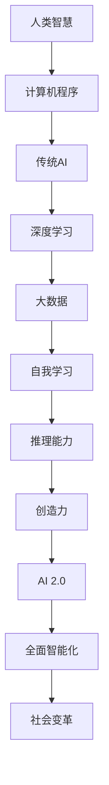

                 

 在当今科技迅猛发展的时代，人工智能（AI）已经从一个概念逐渐演变成为我们日常生活和工作中不可或缺的一部分。著名人工智能专家李开复在其新书《AI 2.0 时代的机遇》中，深入探讨了AI的未来发展趋势、潜在机遇以及面临的挑战。本文将围绕这本书的内容，结合最新的技术发展，对AI 2.0时代进行一次全面的解读。

## 1. 背景介绍

随着深度学习、大数据、云计算等技术的不断突破，人工智能开始进入一个全新的阶段——AI 2.0时代。在这个时代，人工智能不再是简单的规则引擎，而是拥有自我学习、推理、创造能力的智能体。李开复指出，AI 2.0时代的到来将深刻改变我们的社会、经济、教育等各个领域。

### 关键词：
- **人工智能**
- **AI 2.0**
- **深度学习**
- **大数据**
- **云计算**
- **社会变革**

## 2. 核心概念与联系

为了更好地理解AI 2.0时代的核心概念，我们需要借助Mermaid流程图来梳理这些概念之间的联系。



### Mermaid 流程图说明：
- **A[人类智慧]**：人类智慧的内涵和范畴。
- **B[计算机程序]**：计算机程序的基础和逻辑。
- **C[传统AI]**：基于规则的自动化系统。
- **D[深度学习]**：利用神经网络模拟人类学习过程。
- **E[大数据]**：海量数据驱动下的智能分析。
- **F[自我学习]**：算法自动优化和改进。
- **G[推理能力]**：基于数据和信息进行逻辑推理。
- **H[创造力]**：算法生成新的创意和解决方案。
- **I[AI 2.0]**：融合深度学习、大数据、自我学习、推理和创造力的下一代人工智能。
- **J[全面智能化]**：人工智能在各个领域的应用和影响。
- **K[社会变革]**：人工智能带来的社会、经济、文化等各方面的变革。

## 3. 核心算法原理 & 具体操作步骤

### 3.1 算法原理概述

AI 2.0时代的核心算法主要包括深度学习、强化学习、生成对抗网络等。这些算法共同构成了人工智能自我学习和决策的基础。

- **深度学习**：利用多层神经网络模拟人类大脑的学习过程，通过反向传播算法不断调整网络参数，以达到对数据的自动学习和分类。
- **强化学习**：通过与环境的交互，不断调整策略以最大化长期回报。
- **生成对抗网络（GAN）**：通过两个神经网络的对抗训练，生成与真实数据高度相似的新数据。

### 3.2 算法步骤详解

以深度学习为例，其基本步骤包括：

1. **数据收集与预处理**：收集大量数据，并进行预处理，如数据清洗、归一化等。
2. **模型设计**：设计合适的神经网络结构，包括输入层、隐藏层和输出层。
3. **训练与验证**：使用训练集数据训练模型，并通过验证集数据调整模型参数。
4. **测试与优化**：使用测试集数据评估模型性能，并进行优化。

### 3.3 算法优缺点

- **深度学习**：优点包括能够处理复杂数据、自动特征提取等；缺点包括模型复杂度较高、对数据要求较高等。
- **强化学习**：优点包括能够处理不确定性和动态环境；缺点包括训练过程可能非常耗时。
- **生成对抗网络（GAN）**：优点包括能够生成高质量的数据；缺点包括训练过程可能不稳定。

### 3.4 算法应用领域

这些算法在各个领域都有广泛应用，如：

- **图像识别与生成**：用于人脸识别、自动驾驶等。
- **自然语言处理**：用于机器翻译、文本生成等。
- **医疗诊断**：用于疾病诊断、药物设计等。
- **金融分析**：用于风险评估、量化交易等。

## 4. 数学模型和公式 & 详细讲解 & 举例说明

### 4.1 数学模型构建

在深度学习中，常用的数学模型包括神经网络模型、损失函数、优化算法等。

- **神经网络模型**：包括输入层、隐藏层和输出层。每个层由多个神经元组成，神经元之间通过权重连接。
- **损失函数**：用于衡量预测结果与真实结果之间的差距，如均方误差（MSE）。
- **优化算法**：用于调整模型参数，以最小化损失函数，如梯度下降。

### 4.2 公式推导过程

以均方误差（MSE）为例，其公式推导如下：

$$
MSE = \frac{1}{n}\sum_{i=1}^{n}(y_i - \hat{y}_i)^2
$$

其中，$y_i$为真实值，$\hat{y}_i$为预测值，$n$为样本数量。

### 4.3 案例分析与讲解

以图像分类任务为例，我们使用卷积神经网络（CNN）进行模型构建。首先，我们收集大量图像数据，并进行预处理。然后，设计CNN模型，包括卷积层、池化层和全连接层。接下来，使用训练集数据训练模型，并通过验证集数据调整模型参数。最后，使用测试集数据评估模型性能。

```latex
\begin{equation}
\begin{split}
& \text{输入层:} \hspace{1cm} \text{图像数据} \\
& \text{卷积层:} \hspace{1cm} f(\sigma(W_1 \cdot \text{输入} + b_1)) \\
& \text{池化层:} \hspace{1cm} g(\text{卷积层输出}) \\
& \text{全连接层:} \hspace{1cm} \hat{y} = \sigma(W_2 \cdot g(\text{池化层输出}) + b_2)
\end{split}
\end{equation}
```

## 5. 项目实践：代码实例和详细解释说明

### 5.1 开发环境搭建

首先，我们需要搭建一个合适的开发环境。以Python为例，我们可以使用TensorFlow作为深度学习框架。

```bash
pip install tensorflow
```

### 5.2 源代码详细实现

以下是一个简单的CNN模型实现，用于图像分类。

```python
import tensorflow as tf

# 构建CNN模型
def build_model(input_shape):
    model = tf.keras.Sequential([
        tf.keras.layers.Conv2D(32, (3, 3), activation='relu', input_shape=input_shape),
        tf.keras.layers.MaxPooling2D((2, 2)),
        tf.keras.layers.Conv2D(64, (3, 3), activation='relu'),
        tf.keras.layers.MaxPooling2D((2, 2)),
        tf.keras.layers.Flatten(),
        tf.keras.layers.Dense(64, activation='relu'),
        tf.keras.layers.Dense(10, activation='softmax')
    ])
    return model

# 模型编译
model = build_model(input_shape=(28, 28, 1))
model.compile(optimizer='adam',
              loss='categorical_crossentropy',
              metrics=['accuracy'])

# 模型训练
model.fit(x_train, y_train, epochs=5, batch_size=32, validation_data=(x_test, y_test))

# 模型评估
model.evaluate(x_test, y_test)
```

### 5.3 代码解读与分析

上述代码实现了以下步骤：

- **模型构建**：使用`tf.keras.Sequential`创建一个序列模型，包括卷积层、池化层和全连接层。
- **模型编译**：设置优化器、损失函数和评价指标。
- **模型训练**：使用训练集数据训练模型。
- **模型评估**：使用测试集数据评估模型性能。

### 5.4 运行结果展示

在训练完成后，我们可以看到模型在测试集上的准确率。

```python
# 输出模型评估结果
print(model.evaluate(x_test, y_test))
```

## 6. 实际应用场景

### 6.1 图像识别

图像识别是人工智能领域的一个重要应用，广泛应用于人脸识别、自动驾驶、医疗影像诊断等场景。

- **人脸识别**：通过深度学习算法识别和验证个人身份。
- **自动驾驶**：利用计算机视觉技术实现车辆的自导航和避障。
- **医疗影像诊断**：辅助医生进行疾病诊断，提高诊断准确率和效率。

### 6.2 自然语言处理

自然语言处理（NLP）是人工智能的另一个重要领域，包括文本分类、机器翻译、情感分析等。

- **文本分类**：对大量文本数据进行分析和分类，用于信息检索、舆情监测等。
- **机器翻译**：利用深度学习技术实现不同语言之间的自动翻译。
- **情感分析**：分析文本的情感倾向，用于用户反馈分析、市场调研等。

### 6.3 金融分析

金融分析是人工智能在金融领域的应用，包括风险控制、量化交易、投资决策等。

- **风险控制**：利用机器学习算法进行信用评估、欺诈检测等。
- **量化交易**：通过算法分析市场数据，实现自动化的交易策略。
- **投资决策**：利用大数据分析技术，为投资决策提供数据支持。

## 7. 工具和资源推荐

### 7.1 学习资源推荐

- **在线课程**：推荐Coursera、edX等平台上的深度学习、机器学习课程。
- **书籍推荐**：《深度学习》（Goodfellow, Bengio, Courville）、《Python机器学习》（Sebastian Raschka）。

### 7.2 开发工具推荐

- **深度学习框架**：推荐TensorFlow、PyTorch等。
- **文本处理库**：推荐NLTK、spaCy等。

### 7.3 相关论文推荐

- **深度学习**：《Deep Learning》（Goodfellow, Bengio, Courville）、《A Theoretically Grounded Application of Dropout in Recurrent Neural Networks》（Yarin Gal and Zoubin Ghahramani）。
- **强化学习**：《Reinforcement Learning: An Introduction》（Richard S. Sutton and Andrew G. Barto）。

## 8. 总结：未来发展趋势与挑战

### 8.1 研究成果总结

AI 2.0时代的研究成果包括深度学习、强化学习、生成对抗网络等算法的突破，以及计算机视觉、自然语言处理、医疗诊断等领域的应用。

### 8.2 未来发展趋势

未来发展趋势包括：

- **算法的进一步优化和集成**。
- **跨领域的融合应用**。
- **数据隐私和安全**。

### 8.3 面临的挑战

面临的挑战包括：

- **算法的可解释性**。
- **数据隐私和安全**。
- **伦理和法律问题**。

### 8.4 研究展望

研究展望包括：

- **人工智能与人类智慧的融合**。
- **人工智能在各个领域的深度应用**。

## 9. 附录：常见问题与解答

### Q1: 深度学习与传统机器学习的主要区别是什么？

A1: 深度学习是一种基于多层神经网络的学习方法，能够自动提取数据中的高级特征。而传统机器学习主要依赖于手工设计特征和算法。

### Q2: 强化学习与深度学习的关系是什么？

A2: 强化学习是一种基于试错的学习方法，可以与深度学习相结合，通过深度神经网络来学习状态值函数或策略。

### Q3: 如何评估人工智能系统的性能？

A3: 评估人工智能系统的性能通常包括准确性、召回率、F1分数等指标，具体取决于应用场景。

## 作者署名

本文作者：禅与计算机程序设计艺术 / Zen and the Art of Computer Programming
----------------------------------------------------------------

