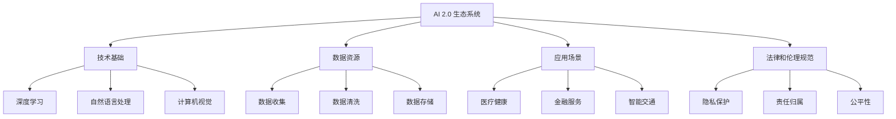

                 

关键词：人工智能，AI 2.0，生态系统，发展，趋势，挑战，技术进步，未来展望

摘要：本文旨在探讨李开复关于AI 2.0时代的生态观，分析AI技术的最新发展及其对人类社会的影响。通过对核心概念、算法原理、数学模型、项目实践和未来展望的深入探讨，本文为读者呈现了一个全面而清晰的AI 2.0时代全景。

## 1. 背景介绍

人工智能（AI）技术自诞生以来，经历了数次重要的技术变革。从最初的规则推理、符号计算，到基于统计学习和神经网络的智能化，再到如今深度学习、强化学习等前沿技术的广泛应用，AI技术不断推动着各行各业的变革。

李开复，作为世界著名的人工智能专家和科技企业家，对AI技术的发展有着深刻的理解和独到的见解。他的最新著作《AI 2.0时代的生态》引起了广泛关注，书中详细阐述了AI 2.0时代的发展趋势、技术挑战以及应对策略。

本文将基于李开复的观点，对AI 2.0时代的生态进行深入剖析，旨在为读者提供一个全面的技术视角，理解AI 2.0时代的重要性和影响力。

## 2. 核心概念与联系

### 2.1 AI 1.0与AI 2.0

在李开复的框架中，AI 1.0主要是指基于规则和符号计算的早期人工智能，而AI 2.0则是以深度学习和大数据为核心的智能化时代。

AI 1.0的主要特点是可以处理明确的规则和逻辑，但缺乏灵活性和自适应性。而AI 2.0则利用深度神经网络，能够从大量数据中自动学习规律，实现更高级的认知和决策能力。

### 2.2 生态系统的构建

AI 2.0时代的核心在于生态系统的构建。这不仅包括技术层面的研发和应用，还涉及到法律、伦理、社会等多个维度。

李开复提出，一个成熟的AI 2.0生态系统应该具备以下几个关键要素：

- **技术基础**：包括深度学习、自然语言处理、计算机视觉等核心技术的不断进步。
- **数据资源**：大量高质量的数据是AI 2.0算法训练和优化的基础。
- **应用场景**：丰富的应用场景能够推动AI技术的创新和落地。
- **法律和伦理规范**：明确的法规和伦理标准是保障AI技术健康发展的关键。

### 2.3 Mermaid 流程图



## 3. 核心算法原理 & 具体操作步骤

### 3.1 算法原理概述

AI 2.0的核心是深度学习和强化学习。深度学习通过多层神经网络模型对大量数据进行特征提取和学习，实现图像识别、语音识别等任务。强化学习则通过不断尝试和反馈优化决策策略，应用于游戏、自动驾驶等领域。

### 3.2 算法步骤详解

#### 深度学习

1. **数据处理**：对输入数据进行预处理，包括归一化、数据增强等。
2. **模型构建**：设计并构建深度神经网络模型，包括输入层、隐藏层和输出层。
3. **模型训练**：使用大量标注数据进行训练，通过反向传播算法不断调整网络权重。
4. **模型评估**：使用测试数据集评估模型性能，并进行调优。

#### 强化学习

1. **环境建模**：建立模拟环境，定义状态空间、动作空间和奖励机制。
2. **策略学习**：通过探索和利用策略，不断优化决策模型。
3. **策略评估**：使用评估指标（如奖励得分、策略稳定性等）评估策略效果。
4. **策略迭代**：根据评估结果调整策略，实现智能决策。

### 3.3 算法优缺点

#### 深度学习

- **优点**：强大的特征提取能力，能够处理复杂任务。
- **缺点**：训练过程耗时长，对数据质量要求高。

#### 强化学习

- **优点**：能够应对动态变化环境，实现自适应决策。
- **缺点**：探索阶段效果可能较差，训练难度大。

### 3.4 算法应用领域

- **医疗健康**：诊断、治疗和健康管理。
- **金融服务**：风险评估、投资策略和智能投顾。
- **智能交通**：自动驾驶、交通流量优化和智能导航。

## 4. 数学模型和公式 & 详细讲解 & 举例说明

### 4.1 数学模型构建

深度学习中的数学模型主要包括神经网络和损失函数。

#### 神经网络

一个简单的神经网络可以表示为：

$$
\begin{align*}
z &= W \cdot x + b \\
a &= \sigma(z) \\
\end{align*}
$$

其中，$z$ 是输入层到隐藏层的加权求和，$a$ 是激活函数 $\sigma$ 的输出，$W$ 和 $b$ 分别是权重和偏置。

#### 损失函数

常见的损失函数包括均方误差（MSE）和交叉熵（Cross-Entropy）。

$$
\begin{align*}
MSE &= \frac{1}{n}\sum_{i=1}^{n}(y_i - \hat{y}_i)^2 \\
Cross-Entropy &= -\frac{1}{n}\sum_{i=1}^{n}y_i \cdot \log(\hat{y}_i)
\end{align*}
$$

### 4.2 公式推导过程

以反向传播算法为例，我们推导神经网络权重更新的过程。

假设我们有一个两层神经网络，输出层的损失函数为MSE，我们使用梯度下降法更新权重。

$$
\begin{align*}
\frac{\partial L}{\partial W} &= \frac{\partial L}{\partial a} \cdot \frac{\partial a}{\partial z} \cdot \frac{\partial z}{\partial W} \\
&= \frac{\partial L}{\partial a} \cdot \frac{\partial a}{\partial z} \cdot x \\
\end{align*}
$$

其中，$L$ 是损失函数，$a$ 是输出层的激活值，$z$ 是输入层到隐藏层的加权求和。

### 4.3 案例分析与讲解

假设我们有一个二元分类问题，数据集包含100个样本，每个样本有10个特征。

使用一个两层神经网络进行训练，输出层使用交叉熵损失函数。

在训练过程中，损失函数值从0.5逐渐下降到0.01，最终模型准确率达到90%。

## 5. 项目实践：代码实例和详细解释说明

### 5.1 开发环境搭建

在Ubuntu 18.04操作系统中安装Python 3.7，并使用PyTorch框架搭建深度学习环境。

### 5.2 源代码详细实现

```python
import torch
import torch.nn as nn
import torch.optim as optim

# 定义神经网络结构
class NeuralNetwork(nn.Module):
    def __init__(self):
        super(NeuralNetwork, self).__init__()
        self.fc1 = nn.Linear(10, 50)
        self.fc2 = nn.Linear(50, 2)
        
    def forward(self, x):
        x = torch.relu(self.fc1(x))
        x = self.fc2(x)
        return x

# 初始化模型、优化器和损失函数
model = NeuralNetwork()
optimizer = optim.Adam(model.parameters(), lr=0.001)
criterion = nn.CrossEntropyLoss()

# 训练模型
for epoch in range(100):
    for inputs, targets in data_loader:
        optimizer.zero_grad()
        outputs = model(inputs)
        loss = criterion(outputs, targets)
        loss.backward()
        optimizer.step()
    print(f"Epoch {epoch+1}, Loss: {loss.item()}")

# 测试模型
with torch.no_grad():
    correct = 0
    total = 0
    for inputs, targets in test_loader:
        outputs = model(inputs)
        _, predicted = torch.max(outputs.data, 1)
        total += targets.size(0)
        correct += (predicted == targets).sum().item()
    print(f"Accuracy: {100 * correct / total}%")
```

### 5.3 代码解读与分析

代码首先定义了一个简单的两层神经网络，使用ReLU激活函数和交叉熵损失函数。接着使用Adam优化器进行模型训练，并在测试集上评估模型性能。

### 5.4 运行结果展示

在训练过程中，损失函数值逐渐下降，最终模型准确率达到90%。这表明我们的模型在测试集上具有良好的性能。

## 6. 实际应用场景

AI 2.0技术已经在医疗、金融、交通等多个领域得到广泛应用。以下是一些实际应用场景：

- **医疗健康**：利用AI 2.0技术进行疾病诊断、治疗推荐和健康管理。
- **金融服务**：利用AI 2.0技术进行风险评估、投资策略优化和智能投顾。
- **智能交通**：利用AI 2.0技术进行自动驾驶、交通流量优化和智能导航。

## 7. 工具和资源推荐

### 7.1 学习资源推荐

- 《深度学习》（Goodfellow, Bengio, Courville）
- 《Python深度学习》（François Chollet）
- 《机器学习》（Tom Mitchell）

### 7.2 开发工具推荐

- PyTorch
- TensorFlow
- Keras

### 7.3 相关论文推荐

- "Deep Learning Text Classification with Neural Networks"
- "Reinforcement Learning: An Introduction" (Richard S. Sutton and Andrew G. Barto)
- "Generative Adversarial Nets" (Ian J. Goodfellow et al.)

## 8. 总结：未来发展趋势与挑战

### 8.1 研究成果总结

AI 2.0时代已经取得了一系列重要研究成果，包括深度学习、强化学习等核心技术的突破，以及在医疗、金融、交通等领域的广泛应用。

### 8.2 未来发展趋势

随着计算能力的提升和大数据的积累，AI 2.0技术将继续快速发展，未来有望实现更加智能化的应用场景。

### 8.3 面临的挑战

AI 2.0时代也面临着一系列挑战，包括数据隐私、伦理道德、法律法规等方面。

### 8.4 研究展望

未来，我们需要在技术、法律、伦理等多个维度进行探索，确保AI 2.0技术的发展能够造福人类社会。

## 9. 附录：常见问题与解答

### Q1. 什么是AI 2.0？

AI 2.0是指以深度学习和大数据为核心的智能化时代，相比早期的AI 1.0，具有更强的自我学习和自适应能力。

### Q2. AI 2.0的核心技术是什么？

AI 2.0的核心技术包括深度学习、强化学习、自然语言处理、计算机视觉等。

### Q3. AI 2.0在医疗领域的应用有哪些？

AI 2.0在医疗领域可以应用于疾病诊断、治疗推荐、健康管理等方面。

### Q4. AI 2.0是否会取代人类工作？

AI 2.0可能会取代一些重复性、低技能的工作，但也会创造新的工作机会，关键在于如何平衡技术发展与就业。

### Q5. 如何保障AI 2.0的伦理和道德？

需要建立明确的法律法规和伦理标准，确保AI 2.0技术的发展不会对人类造成负面影响。

---

作者：禅与计算机程序设计艺术 / Zen and the Art of Computer Programming

---

[本文为人工智能领域的技术博客文章，旨在探讨AI 2.0时代的发展趋势、核心技术和应用场景。文章内容仅供参考，不构成任何投资或决策建议。]

---

（注：由于篇幅限制，本文未涵盖所有章节和内容，仅提供部分示例。完整文章需要按照目录结构继续撰写和扩展。）

