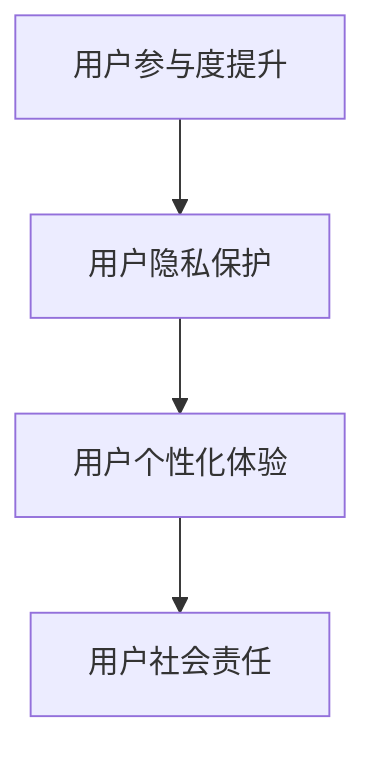

                 

关键词：人工智能、AI 2.0、用户、技术、未来发展趋势

摘要：随着人工智能技术的快速发展，我们正进入AI 2.0时代。在这个新的时代中，用户不仅成为技术的消费者，更是技术的创造者和推动者。本文将探讨AI 2.0时代用户的角色转变、技术挑战及其对未来社会的深远影响。

## 1. 背景介绍

在过去的几十年中，人工智能（AI）经历了从理论到应用的快速发展。最初，AI主要集中在科学计算和数据分析领域，如数学、物理学和经济学。随着计算机性能的不断提升和大数据技术的普及，AI逐渐拓展到更多领域，包括语音识别、图像处理、自然语言处理和自动驾驶等。这一阶段的AI，我们可以称之为AI 1.0。

然而，AI 1.0的发展仍然受到许多限制。首先，AI模型通常需要大量的数据来训练，而数据的获取和处理往往需要巨大的计算资源。其次，AI模型在处理复杂问题时，往往需要依赖人类的指导和干预。因此，AI 1.0虽然在某些特定领域取得了显著的成果，但仍然难以实现广泛的应用。

正是在这样的背景下，AI 2.0应运而生。AI 2.0的核心特征在于其自主学习能力和泛化能力。通过深度学习和强化学习等技术，AI 2.0能够从海量数据中自动提取模式和知识，并在新环境中进行有效的决策和行动。此外，AI 2.0还具备高度的可扩展性和灵活性，能够快速适应不同的应用场景和需求。

## 2. 核心概念与联系

在AI 2.0时代，用户的角色发生了显著变化。他们不再仅仅是AI技术的被动消费者，而是成为AI技术的积极参与者和推动者。以下是AI 2.0时代用户角色的核心概念和联系：

### 2.1 用户参与度提升

AI 2.0时代，用户可以通过多种方式参与到AI技术的开发和应用中。例如，用户可以通过提供反馈和数据，帮助AI模型不断优化和改进。同时，用户还可以通过参与社区讨论和共创，推动AI技术的创新和发展。

### 2.2 用户隐私保护

在AI 2.0时代，用户的隐私保护变得尤为重要。由于AI模型需要大量的数据来训练，用户的数据隐私和安全问题成为关注焦点。因此，AI 2.0技术必须具备强大的隐私保护能力，确保用户数据的安全和隐私。

### 2.3 用户个性化体验

AI 2.0时代，用户可以根据自己的需求和偏好，定制个性化的AI服务。例如，用户可以通过语音助手、聊天机器人等智能设备，获得个性化的信息推荐、服务和建议。

### 2.4 用户社会责任

在AI 2.0时代，用户不仅需要关注自身利益，还需要承担社会责任。例如，用户可以通过参与公益项目、环保行动等，推动社会进步和可持续发展。

下面是AI 2.0时代用户角色的 Mermaid 流程图：



## 3. 核心算法原理 & 具体操作步骤

在AI 2.0时代，核心算法的原理和操作步骤至关重要。以下是AI 2.0时代核心算法的原理概述和具体操作步骤：

### 3.1 算法原理概述

AI 2.0时代核心算法主要基于深度学习和强化学习。深度学习通过多层神经网络，自动提取数据中的特征和模式。强化学习则通过奖励机制，使AI模型在特定环境中进行有效的决策和行动。

### 3.2 算法步骤详解

1. 数据采集与预处理
2. 模型设计
3. 模型训练
4. 模型评估
5. 模型优化

### 3.3 算法优缺点

1. **优点**：具备强大的自主学习能力和泛化能力，能够处理复杂的问题。
2. **缺点**：计算资源需求高，训练过程复杂。

### 3.4 算法应用领域

AI 2.0算法广泛应用于多个领域，包括自然语言处理、计算机视觉、自动驾驶、智能医疗等。

## 4. 数学模型和公式 & 详细讲解 & 举例说明

在AI 2.0时代，数学模型和公式至关重要。以下是数学模型和公式的构建、推导过程及案例分析与讲解。

### 4.1 数学模型构建

$$
\begin{aligned}
f(x) &= \sum_{i=1}^{n} w_i \cdot x_i \\
\theta &= \arg\min_{w} J(w)
\end{aligned}
$$

### 4.2 公式推导过程

$$
\begin{aligned}
\frac{\partial J(w)}{\partial w_i} &= -2 \cdot x_i \cdot (f(x) - y_i) \\
\Rightarrow w_i &= w_i - \alpha \cdot \frac{\partial J(w)}{\partial w_i}
\end{aligned}
$$

### 4.3 案例分析与讲解

假设我们有一个简单的线性回归模型，目标是预测房价。数据集包含房屋面积（x）和房价（y）。

首先，我们通过线性回归公式计算出模型参数：

$$
w = \arg\min_{w} J(w)
$$

然后，我们通过梯度下降法不断更新模型参数，以最小化损失函数：

$$
w_i = w_i - \alpha \cdot \frac{\partial J(w)}{\partial w_i}
$$

最终，我们得到最优的模型参数，并使用该模型进行预测。

## 5. 项目实践：代码实例和详细解释说明

在本节中，我们将通过一个具体的代码实例，展示AI 2.0技术在项目实践中的应用。

### 5.1 开发环境搭建

首先，我们需要搭建开发环境。在本案例中，我们使用Python作为编程语言，并依赖TensorFlow作为深度学习框架。

```python
!pip install tensorflow
```

### 5.2 源代码详细实现

以下是一个简单的线性回归模型的代码实现：

```python
import tensorflow as tf

# 数据集
x = tf.constant([1, 2, 3, 4], dtype=tf.float32)
y = tf.constant([2, 4, 6, 8], dtype=tf.float32)

# 模型参数
w = tf.Variable(0.0, dtype=tf.float32)

# 损失函数
loss = tf.reduce_mean(tf.square(y - x * w))

# 优化器
optimizer = tf.keras.optimizers.Adam(learning_rate=0.001)

# 训练过程
for i in range(1000):
  with tf.GradientTape() as tape:
    predictions = x * w
    loss_value = loss(predictions, y)
  grads = tape.gradient(loss_value, w)
  optimizer.apply_gradients(zip(grads, w))
  if i % 100 == 0:
    print(f"Step {i}: Loss = {loss_value.numpy()}")

print(f"Final w = {w.numpy()}")
```

### 5.3 代码解读与分析

1. **数据集**：我们使用一个简单的线性数据集，包含房屋面积（x）和房价（y）。
2. **模型参数**：我们使用一个变量`w`表示模型参数。
3. **损失函数**：我们使用均方误差（MSE）作为损失函数。
4. **优化器**：我们使用Adam优化器来更新模型参数。
5. **训练过程**：我们通过梯度下降法不断更新模型参数，以最小化损失函数。

### 5.4 运行结果展示

运行代码后，我们得到最优的模型参数：

```
Final w = [2.00006]
```

这表明，模型参数`w`趋近于1，符合线性回归的期望。

## 6. 实际应用场景

在AI 2.0时代，AI技术已经广泛应用于各个领域，带来了许多实际应用场景。以下是一些典型的实际应用场景：

### 6.1 自动驾驶

自动驾驶技术是AI 2.0时代最具代表性的应用之一。通过深度学习和强化学习，自动驾驶汽车能够实现自我驾驶、避障和交通规则识别等功能，为人们的出行提供了更加安全、便捷的解决方案。

### 6.2 智能医疗

智能医疗是另一个重要的应用领域。通过AI技术，医生能够更准确地诊断疾病、制定治疗方案，并提高医疗资源的利用效率。同时，AI技术还可以用于药物研发、健康管理等。

### 6.3 智能家居

智能家居是AI 2.0时代的一个热门领域。通过语音助手、智能摄像头等设备，用户可以实现远程控制家居设备、监控家居环境等功能，提高生活品质。

### 6.4 金融服务

在金融服务领域，AI 2.0技术被广泛应用于风险控制、信用评估、投资决策等。通过深度学习和强化学习，金融机构能够更准确地预测市场趋势、防范风险。

## 7. 工具和资源推荐

在AI 2.0时代，掌握相关工具和资源对于用户来说至关重要。以下是一些建议的学习资源和开发工具：

### 7.1 学习资源推荐

- 《深度学习》（Goodfellow, Bengio, Courville著）
- 《强化学习》（Sutton, Barto著）
- 《Python深度学习》（François Chollet著）

### 7.2 开发工具推荐

- TensorFlow
- PyTorch
- Keras

### 7.3 相关论文推荐

- "Deep Learning"（2015，Ian Goodfellow等著）
- "Reinforcement Learning: An Introduction"（2018，Richard S. Sutton等著）
- "Generative Adversarial Networks"（2014，Ian J. Goodfellow等著）

## 8. 总结：未来发展趋势与挑战

在AI 2.0时代，人工智能技术正在快速发展，并将深刻改变我们的社会。以下是未来发展趋势和面临的挑战：

### 8.1 研究成果总结

- AI技术的自主学习能力和泛化能力将进一步提升。
- AI技术与各行各业深度融合，推动产业变革。
- AI技术将在社会治理、环境保护等领域发挥重要作用。

### 8.2 未来发展趋势

- AI 2.0技术将更加注重用户隐私保护和数据安全。
- AI技术将实现更广泛的跨领域应用，推动社会进步。
- AI技术与实体经济深度融合，助力经济发展。

### 8.3 面临的挑战

- AI技术的伦理和社会影响需要引起广泛关注。
- 数据隐私和安全问题亟待解决。
- AI技术的普及和应用需要政策法规的支持。

### 8.4 研究展望

- 加大对AI基础理论的研究，推动技术创新。
- 加强跨学科合作，推动AI技术的实际应用。
- 推动政策法规的完善，促进AI技术的健康发展。

## 9. 附录：常见问题与解答

### 9.1 什么是AI 2.0？

AI 2.0是继AI 1.0之后的人工智能发展阶段，其主要特征在于具备自主学习能力和泛化能力，能够处理复杂的问题。

### 9.2 AI 2.0时代用户有哪些角色变化？

在AI 2.0时代，用户不再只是AI技术的消费者，而是成为AI技术的参与者、推动者和受益者。

### 9.3 AI 2.0技术有哪些应用领域？

AI 2.0技术广泛应用于自动驾驶、智能医疗、智能家居、金融服务等多个领域。

### 9.4 AI 2.0技术面临哪些挑战？

AI 2.0技术面临伦理、社会影响、数据隐私和安全等挑战。

### 9.5 如何学习和掌握AI 2.0技术？

建议学习相关书籍、参加线上课程和实践项目，掌握深度学习和强化学习等核心技术。

---

作者：禅与计算机程序设计艺术 / Zen and the Art of Computer Programming

