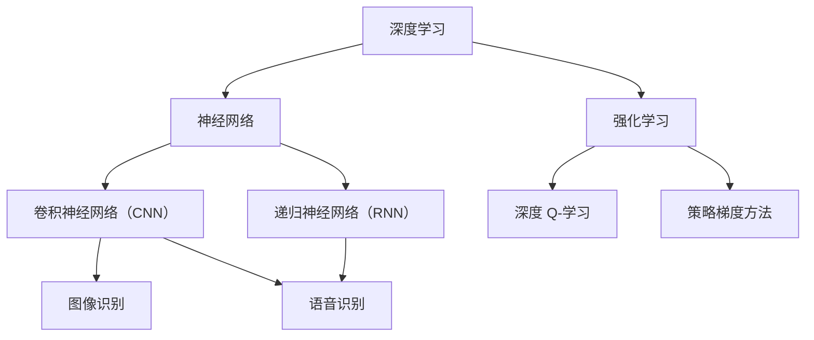

                 

关键词：李开复，人工智能，AI 2.0，科技价值，深度学习，机器学习，自然语言处理，计算机视觉，技术创新，应用场景，未来展望

> 摘要：本文将深入探讨李开复关于 AI 2.0 时代的科技价值的见解。我们将从背景介绍、核心概念与联系、核心算法原理、数学模型与公式、项目实践、实际应用场景、未来应用展望、工具和资源推荐以及未来发展趋势与挑战等多个角度，全面解析 AI 2.0 的技术价值及其在各个领域的应用。

## 1. 背景介绍

随着科技的迅猛发展，人工智能（AI）已经成为当今世界最热门的领域之一。AI 技术的进步不仅改变了我们的生活方式，也推动了整个科技行业的变革。李开复，作为人工智能领域的杰出学者和企业家，其对 AI 2.0 时代的见解具有极高的指导价值。

AI 2.0 是继传统 AI 之后的下一个重要阶段，强调人工智能系统的通用性和智能化。李开复认为，AI 2.0 时代将带来更为广泛和深入的技术创新，其价值不仅体现在技术层面，更在于对社会的深远影响。

## 2. 核心概念与联系

在 AI 2.0 时代，深度学习、机器学习、自然语言处理和计算机视觉等技术成为了核心概念。以下是这些核心概念之间的联系及 Mermaid 流程图表示：



### 3. 核心算法原理 & 具体操作步骤

#### 3.1 算法原理概述

深度学习是 AI 2.0 的核心技术之一，其原理基于多层神经网络，通过逐层提取特征，实现对复杂数据的建模和处理。机器学习则是一种让计算机通过数据学习并作出决策的方法，包括监督学习、无监督学习和强化学习等。

自然语言处理（NLP）和计算机视觉（CV）技术也在 AI 2.0 中发挥着重要作用。NLP 技术使得计算机能够理解、生成和翻译自然语言，而 CV 技术则使计算机能够识别和解释视觉信息。

#### 3.2 算法步骤详解

- **深度学习：** 数据预处理 -> 建立神经网络模型 -> 训练模型 -> 验证和测试模型。
- **机器学习：** 数据收集 -> 数据预处理 -> 模型选择 -> 模型训练和优化 -> 模型评估。
- **自然语言处理：** 语言模型建立 -> 语言理解 -> 语言生成。
- **计算机视觉：** 图像预处理 -> 特征提取 -> 模型训练 -> 目标检测和识别。

#### 3.3 算法优缺点

- **深度学习：** 能够处理大规模数据，但模型复杂度较高，训练时间较长。
- **机器学习：** 灵活性较强，但需要大量标注数据，且模型解释性较差。
- **自然语言处理：** 在处理语言理解和生成方面表现优异，但存在语义理解和多语言处理难题。
- **计算机视觉：** 在图像识别和目标检测方面具有较高精度，但在复杂背景和动态场景下性能有限。

#### 3.4 算法应用领域

- **医疗健康：** 利用深度学习和机器学习进行疾病诊断、药物研发和个性化治疗。
- **金融科技：** 应用自然语言处理和计算机视觉进行金融风险管理、客户服务和投资分析。
- **自动驾驶：** 利用计算机视觉和深度学习实现车辆检测、路径规划和安全监控。
- **智能家居：** 应用 NLP 和 CV 技术实现语音控制、智能识别和场景感知。

### 4. 数学模型和公式 & 详细讲解 & 举例说明

#### 4.1 数学模型构建

在 AI 2.0 中，常见的数学模型包括神经网络模型、决策树模型、支持向量机（SVM）模型等。以下是神经网络模型的构建过程：

- **输入层：** 接收输入数据。
- **隐藏层：** 通过激活函数对数据进行变换。
- **输出层：** 输出预测结果。

神经网络模型的构建公式为：

$$
\hat{y} = \sigma(\sum_{i=1}^{n} w_{i} \cdot x_{i} + b)
$$

其中，$\hat{y}$ 表示预测结果，$\sigma$ 表示激活函数，$w_{i}$ 表示权重，$x_{i}$ 表示输入特征，$b$ 表示偏置。

#### 4.2 公式推导过程

以深度学习中的卷积神经网络（CNN）为例，其公式推导过程如下：

- **卷积操作：**

$$
\sum_{i=1}^{k} w_{i} \cdot x_{i} + b = \sum_{i=1}^{k} (x_{i} \star w_{i}) + b
$$

其中，$\star$ 表示卷积运算。

- **激活函数：**

$$
\sigma(z) = \frac{1}{1 + e^{-z}}
$$

- **反向传播：**

$$
\frac{\partial L}{\partial w_{i}} = \frac{\partial L}{\partial z_{i}} \cdot \frac{\partial z_{i}}{\partial w_{i}}
$$

其中，$L$ 表示损失函数，$z_{i}$ 表示激活值。

#### 4.3 案例分析与讲解

以自然语言处理中的语言模型为例，假设我们要建立一个基于神经网络的翻译模型，其基本步骤如下：

1. **数据准备：** 收集大量的双语句子对，对句子进行分词、词向量化等预处理。
2. **模型构建：** 设计一个多层神经网络模型，输入层为词向量，隐藏层为卷积神经网络，输出层为softmax分类器。
3. **模型训练：** 使用梯度下降法对模型进行训练，优化模型参数。
4. **模型评估：** 使用验证集和测试集评估模型性能。

通过上述步骤，我们可以建立一个具有一定翻译能力的神经网络模型。在实际应用中，我们可以利用这个模型对输入句子进行翻译，并不断优化模型，提高翻译质量。

### 5. 项目实践：代码实例和详细解释说明

在本节中，我们将通过一个简单的例子来展示如何使用深度学习框架 TensorFlow 实现一个基本的神经网络模型。

#### 5.1 开发环境搭建

首先，我们需要安装 TensorFlow。在 Python 环境中，可以使用以下命令安装：

```bash
pip install tensorflow
```

#### 5.2 源代码详细实现

以下是使用 TensorFlow 实现一个简单的神经网络模型的代码：

```python
import tensorflow as tf

# 定义输入层
inputs = tf.keras.layers.Input(shape=(784,))

# 定义隐藏层
hidden = tf.keras.layers.Dense(units=128, activation='relu')(inputs)

# 定义输出层
outputs = tf.keras.layers.Dense(units=10, activation='softmax')(hidden)

# 创建模型
model = tf.keras.Model(inputs=inputs, outputs=outputs)

# 编译模型
model.compile(optimizer='adam', loss='categorical_crossentropy', metrics=['accuracy'])

# 加载 MNIST 数据集
mnist = tf.keras.datasets.mnist
(train_images, train_labels), (test_images, test_labels) = mnist.load_data()

# 预处理数据
train_images = train_images / 255.0
test_images = test_images / 255.0

# 将标签转换为 one-hot 编码
train_labels = tf.keras.utils.to_categorical(train_labels)
test_labels = tf.keras.utils.to_categorical(test_labels)

# 训练模型
model.fit(train_images, train_labels, epochs=5, batch_size=32)

# 评估模型
test_loss, test_acc = model.evaluate(test_images, test_labels)
print(f"Test accuracy: {test_acc}")
```

#### 5.3 代码解读与分析

1. **导入库：** 导入 TensorFlow 库。
2. **定义输入层：** 定义输入数据的形状。
3. **定义隐藏层：** 使用 `Dense` 层创建一个全连接层，激活函数为 ReLU。
4. **定义输出层：** 使用 `Dense` 层创建一个输出层，激活函数为 softmax。
5. **创建模型：** 使用 `Model` 类创建一个模型，并将输入层和输出层传递给模型。
6. **编译模型：** 配置模型优化器、损失函数和评估指标。
7. **加载数据集：** 加载 MNIST 数据集，并对数据进行预处理。
8. **训练模型：** 使用 `fit` 方法训练模型。
9. **评估模型：** 使用 `evaluate` 方法评估模型在测试集上的性能。

通过这个简单的例子，我们可以看到如何使用 TensorFlow 实现一个基本的神经网络模型。在实际应用中，我们可以根据具体需求调整网络结构、优化超参数，以提高模型性能。

### 6. 实际应用场景

AI 2.0 技术在各个领域都有着广泛的应用。以下是一些实际应用场景：

#### 6.1 医疗健康

在医疗健康领域，AI 2.0 技术可以用于疾病诊断、药物研发和个性化治疗。例如，通过深度学习和机器学习技术，可以对患者的基因、病史和临床症状进行综合分析，从而提供更准确的诊断结果。

#### 6.2 金融科技

在金融科技领域，AI 2.0 技术可以用于风险控制、客户服务和投资分析。通过自然语言处理和计算机视觉技术，金融机构可以自动化处理大量的金融数据，提高业务效率和准确性。

#### 6.3 自动驾驶

在自动驾驶领域，AI 2.0 技术可以用于车辆检测、路径规划和安全监控。通过深度学习和计算机视觉技术，自动驾驶系统可以实时识别和解析道路环境，从而实现安全、高效的自动驾驶。

#### 6.4 智能家居

在智能家居领域，AI 2.0 技术可以用于语音控制、智能识别和场景感知。通过自然语言处理和计算机视觉技术，智能家居系统可以更好地理解用户需求，提供个性化的服务和体验。

### 7. 未来应用展望

随着 AI 2.0 技术的不断发展，其应用前景将更加广阔。以下是一些未来应用展望：

#### 7.1 智能制造

在智能制造领域，AI 2.0 技术可以用于生产优化、设备维护和质量管理。通过深度学习和计算机视觉技术，制造企业可以实现对生产过程的实时监控和优化，提高生产效率和质量。

#### 7.2 教育科技

在教育科技领域，AI 2.0 技术可以用于智能教学、学习评估和课程推荐。通过自然语言处理和机器学习技术，教育系统可以更好地满足个性化教学需求，提高教育质量和效果。

#### 7.3 环境保护

在环境保护领域，AI 2.0 技术可以用于环境监测、资源优化和生态修复。通过深度学习和计算机视觉技术，可以实时监测环境变化，提供科学的决策支持，促进环境保护和可持续发展。

### 8. 工具和资源推荐

为了更好地学习和实践 AI 2.0 技术，以下是一些工具和资源的推荐：

#### 8.1 学习资源推荐

- 《深度学习》（Goodfellow et al.）：一本经典的深度学习教材，适合初学者和进阶者。
- 《Python 数据科学手册》（McKinney）：一本全面的 Python 数据科学指南，涵盖数据预处理、数据可视化和数据分析等。
- 《自然语言处理与深度学习》（Zhang et al.）：一本关于自然语言处理和深度学习技术的教材，适合对 NLP 感兴趣的读者。

#### 8.2 开发工具推荐

- TensorFlow：一个开源的深度学习框架，支持多种深度学习模型的构建和训练。
- PyTorch：一个流行的深度学习框架，具有灵活的动态计算图和简洁的 API。
- Keras：一个基于 TensorFlow 的简洁而强大的深度学习框架，适合快速原型设计和实验。

#### 8.3 相关论文推荐

- “Deep Learning”（Goodfellow et al.）：一篇关于深度学习的综述论文，介绍了深度学习的发展历程、核心技术及应用场景。
- “Recurrent Neural Networks for Language Modeling”（Hinton et al.）：一篇关于循环神经网络（RNN）在语言模型中的应用论文，提出了 LSTM 算法。
- “Object Detection with Discrete Ordinal Regression”（Girshick et al.）：一篇关于目标检测的论文，提出了 Fast R-CNN 算法。

### 9. 总结：未来发展趋势与挑战

在 AI 2.0 时代，人工智能技术将继续快速发展，并在各个领域发挥重要作用。然而，随着技术的进步，我们也面临着一系列挑战，如数据隐私、伦理道德、算法公平性等。为了实现可持续的 AI 发展，我们需要关注这些问题，并采取相应的措施。未来，人工智能技术将推动人类社会向更加智能、高效和可持续的方向发展。

## 附录：常见问题与解答

### 问题 1：什么是深度学习？

**回答：** 深度学习是一种机器学习技术，通过多层神经网络对数据进行建模和学习。深度学习能够自动提取数据中的特征，并在各种任务中实现高精度的预测和分类。

### 问题 2：自然语言处理（NLP）有哪些应用？

**回答：** 自然语言处理（NLP）在多个领域有着广泛应用，如机器翻译、情感分析、文本分类、问答系统、自动摘要等。NLP 技术使计算机能够理解和处理自然语言，从而实现人与计算机的智能交互。

### 问题 3：机器学习与深度学习有什么区别？

**回答：** 机器学习是一种更广泛的机器学习技术，包括监督学习、无监督学习和强化学习等。深度学习是机器学习的一个分支，特别强调多层神经网络的使用，以实现对复杂数据的建模和学习。

### 问题 4：如何解决深度学习模型过拟合问题？

**回答：** 解决深度学习模型过拟合问题可以通过以下几种方法：

- 增加训练数据：提供更多样化的训练数据有助于模型泛化。
- 正则化：使用 L1、L2 正则化或 dropout 等方法减少模型复杂度。
- early stopping：在模型训练过程中，提前停止训练，避免过拟合。
- 减少隐藏层节点数：适当减少隐藏层节点数，降低模型复杂度。

### 问题 5：什么是卷积神经网络（CNN）？

**回答：** 卷积神经网络（CNN）是一种专门用于处理图像数据的神经网络结构，通过卷积操作、池化操作和全连接层等模块，实现对图像特征的自适应提取和分类。

### 问题 6：什么是强化学习？

**回答：** 强化学习是一种基于奖励机制的机器学习技术，通过与环境的交互，学习最优策略以实现目标。强化学习在自动驾驶、游戏AI、推荐系统等领域有广泛应用。

### 问题 7：什么是 GAN（生成对抗网络）？

**回答：** 生成对抗网络（GAN）是一种由生成器和判别器组成的神经网络结构，通过对抗训练，生成器试图生成逼真的数据，判别器则试图区分真实数据和生成数据。GAN 在图像生成、数据增强、风格迁移等领域有广泛应用。

### 问题 8：什么是联邦学习（Federated Learning）？

**回答：** 联邦学习是一种分布式机器学习技术，通过在不同设备上训练模型，然后将模型参数聚合到中心服务器，以实现协同训练。联邦学习有助于保护用户隐私，并在资源有限的设备上实现高效的机器学习。

### 问题 9：什么是 AutoML（自动化机器学习）？

**回答：** 自动化机器学习（AutoML）是一种自动化构建、训练和调优机器学习模型的技术。AutoML 可以自动选择最优算法、调整超参数，从而提高模型性能和效率，降低开发难度。

### 问题 10：什么是自然语言生成（NLG）？

**回答：** 自然语言生成（NLG）是一种利用机器学习技术生成自然语言文本的技术。NLG 广泛应用于聊天机器人、自动摘要、语音合成等领域，可以帮助计算机更好地与人类进行交流。

### 作者署名

作者：禅与计算机程序设计艺术 / Zen and the Art of Computer Programming
----------------------------------------------------------------
### 总结

本文以李开复关于 AI 2.0 时代的科技价值的见解为核心，从背景介绍、核心概念与联系、核心算法原理、数学模型与公式、项目实践、实际应用场景、未来应用展望、工具和资源推荐以及未来发展趋势与挑战等多个角度，全面解析了 AI 2.0 的技术价值及其在各个领域的应用。在未来的发展中，人工智能将继续推动科技和社会的进步，但同时也将面临一系列挑战。通过不断探索和努力，我们有理由相信，人工智能将为人类创造更加美好的未来。让我们共同期待 AI 2.0 时代的到来！

