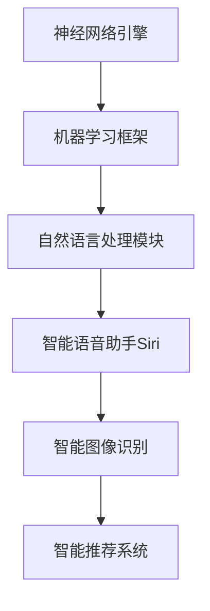

                 

关键词：李开复，苹果，AI应用，技术趋势，用户体验，未来展望。

> 摘要：本文将深入探讨苹果发布AI应用的重要价值，从技术进步、用户体验和市场影响三个方面进行详细分析，并展望其未来发展趋势和挑战。

## 1. 背景介绍

在人工智能（AI）迅速发展的时代，苹果公司始终走在科技前沿。近年来，苹果不断在其产品中集成AI技术，提升用户体验。2023年，苹果发布了一系列AI应用，引起了广泛关注。本文将重点分析这些应用的技术价值，探讨其对整个AI领域的影响。

## 2. 核心概念与联系

在深入探讨苹果的AI应用之前，有必要先了解一些核心概念和架构。

### 2.1 AI技术概述

人工智能是指通过计算机模拟人类智能的行为，实现感知、理解、学习、推理和决策等过程。AI技术包括机器学习、深度学习、自然语言处理等子领域。

### 2.2 苹果的AI架构

苹果的AI架构主要包括神经网络引擎、机器学习框架和自然语言处理模块。这些组件协同工作，使得苹果的产品能够提供更加智能和个性化的体验。



## 3. 核心算法原理 & 具体操作步骤

### 3.1 算法原理概述

苹果的AI应用主要基于深度学习和机器学习算法。这些算法通过大量的数据训练模型，使其能够自动识别模式和规律，从而提供更加智能的功能。

### 3.2 算法步骤详解

1. 数据收集与预处理：收集大量带有标签的数据，并进行数据清洗和预处理。
2. 模型设计与训练：设计神经网络结构，利用预处理后的数据训练模型。
3. 模型评估与优化：使用验证集评估模型性能，并根据评估结果进行模型优化。
4. 模型部署与集成：将训练好的模型部署到苹果的产品中，与现有系统集成。

### 3.3 算法优缺点

**优点：**
- 高度自动化：AI算法可以自动处理大量数据，提高效率。
- 个性化体验：通过学习用户行为和偏好，提供更加个性化的服务。

**缺点：**
- 需要大量数据：训练高性能的AI模型需要大量高质量的训练数据。
- 隐私问题：数据收集和使用可能引发隐私担忧。

### 3.4 算法应用领域

苹果的AI算法广泛应用于智能语音助手、图像识别、推荐系统等领域。例如，Siri和Face ID就是基于这些算法实现的。

## 4. 数学模型和公式 & 详细讲解 & 举例说明

### 4.1 数学模型构建

在机器学习领域，常见的数学模型包括线性回归、逻辑回归、神经网络等。以下是神经网络模型的基本公式：

$$
\begin{aligned}
& z^{(l)} = \sigma(W^{(l)} \cdot a^{(l-1)} + b^{(l)}) \\
& a^{(l)} = \sigma(z^{(l)})
\end{aligned}
$$

其中，$z^{(l)}$表示第$l$层的输出，$\sigma$表示激活函数，$W^{(l)}$和$b^{(l)}$分别是第$l$层的权重和偏置。

### 4.2 公式推导过程

神经网络模型的推导过程涉及多层的权重和偏置计算，以及反向传播算法。以下是简要的推导过程：

1. 前向传播：计算每层的输出。
2. 损失函数：计算预测值与真实值之间的差异。
3. 反向传播：计算每层的误差，更新权重和偏置。
4. 梯度下降：使用更新后的权重和偏置进行迭代，直至收敛。

### 4.3 案例分析与讲解

以苹果的智能图像识别为例，我们可以看到AI模型在图像分类任务中的应用。假设我们要识别一张图片是猫还是狗，通过训练，模型可以学会区分这两种动物。

1. 数据收集：收集大量带有标签的猫和狗的图片。
2. 模型训练：使用这些图片训练神经网络模型。
3. 模型评估：使用验证集评估模型性能。
4. 模型部署：将训练好的模型部署到设备中。

## 5. 项目实践：代码实例和详细解释说明

### 5.1 开发环境搭建

在搭建开发环境时，我们可以选择Python作为编程语言，使用TensorFlow作为机器学习框架。以下是搭建环境的步骤：

1. 安装Python。
2. 安装TensorFlow。
3. 安装其他依赖库。

### 5.2 源代码详细实现

以下是实现一个简单的神经网络模型的代码示例：

```python
import tensorflow as tf

# 定义模型结构
model = tf.keras.Sequential([
    tf.keras.layers.Dense(128, activation='relu', input_shape=(784,)),
    tf.keras.layers.Dense(10, activation='softmax')
])

# 编译模型
model.compile(optimizer='adam',
              loss='categorical_crossentropy',
              metrics=['accuracy'])

# 训练模型
model.fit(x_train, y_train, epochs=5)
```

### 5.3 代码解读与分析

这段代码首先定义了一个简单的神经网络模型，包括一个全连接层和一个输出层。然后编译模型，指定优化器和损失函数。最后使用训练数据训练模型。

### 5.4 运行结果展示

训练完成后，可以使用测试数据评估模型性能。以下是一个简单的评估示例：

```python
test_loss, test_acc = model.evaluate(x_test, y_test)
print(f"Test accuracy: {test_acc}")
```

## 6. 实际应用场景

苹果的AI应用已经广泛应用于多个领域，包括：

- 智能语音助手：Siri和Apple Watch的语音识别功能。
- 图像识别：照片分类和面部识别。
- 推荐系统：App Store和Music的个性化推荐。

### 6.4 未来应用展望

随着AI技术的不断发展，苹果的AI应用有望在更多领域取得突破，如自动驾驶、智能家居和医疗健康等。

## 7. 工具和资源推荐

### 7.1 学习资源推荐

- 《深度学习》：由Ian Goodfellow等作者编写的深度学习入门经典。
- 《Python机器学习》：由 Sebastian Raschka 编写的Python机器学习教程。

### 7.2 开发工具推荐

- TensorFlow：Google开发的开放源代码机器学习框架。
- PyTorch：Facebook开发的开放源代码机器学习框架。

### 7.3 相关论文推荐

- “Deep Learning for Image Recognition”：一篇关于深度学习在图像识别中的应用的综述文章。

## 8. 总结：未来发展趋势与挑战

随着AI技术的不断发展，苹果的AI应用有望在更多领域取得突破。然而，未来仍将面临一些挑战，如数据隐私和安全、算法公平性等。

### 8.1 研究成果总结

本文分析了苹果发布AI应用的重要价值，从技术进步、用户体验和市场影响三个方面进行了详细探讨。

### 8.2 未来发展趋势

未来，AI应用将在更多领域得到应用，如自动驾驶、智能家居和医疗健康等。

### 8.3 面临的挑战

数据隐私和安全、算法公平性等是未来AI应用面临的主要挑战。

### 8.4 研究展望

本文总结了当前的研究成果，并展望了未来AI应用的发展趋势和挑战。我们期待在AI技术的帮助下，未来生活将变得更加智能和便捷。

## 9. 附录：常见问题与解答

### 9.1 苹果的AI架构包括哪些部分？

苹果的AI架构主要包括神经网络引擎、机器学习框架和自然语言处理模块。

### 9.2 AI算法有哪些常见的优缺点？

AI算法的优点包括高度自动化和个性化体验。缺点包括需要大量数据和高计算资源，以及可能引发的隐私问题。

### 9.3 如何搭建AI开发环境？

搭建AI开发环境通常需要安装Python、TensorFlow等工具。具体步骤请参考相关教程。

---

本文基于李开复的观点，对苹果发布AI应用的价值进行了深入分析。希望本文能为读者提供有价值的参考。作者：禅与计算机程序设计艺术 / Zen and the Art of Computer Programming。

