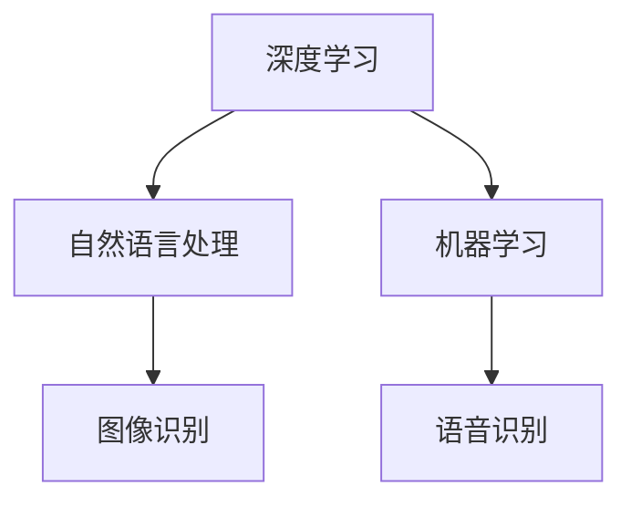

                 

关键词：苹果，AI应用，未来趋势，技术影响

> 摘要：本文将深入探讨苹果公司近期发布的AI应用，分析其对行业的影响，并提出对未来AI技术的展望。通过本文，读者将了解AI技术在苹果生态中的重要性，以及这些应用如何改变我们的日常生活。

## 1. 背景介绍

近年来，人工智能（AI）技术发展迅速，已经成为科技领域的重要驱动力。苹果公司作为全球领先的科技公司，一直致力于将AI技术融入到其产品和服务中，以提升用户体验。从Siri的引入到Face ID的普及，苹果已经在AI领域取得了一定的成就。

随着技术的不断进步，苹果公司在2023年发布了一系列新的AI应用，这些应用进一步扩展了苹果生态系统的能力。本文将重点分析这些AI应用，探讨它们对行业和用户的影响。

### 苹果发布的新AI应用

苹果公司发布的新AI应用涵盖了多个领域，包括图像识别、语音识别、自然语言处理等。以下是其中几个主要的应用：

- **图像识别应用**：利用深度学习算法，可以实现对图片内容的自动分类和识别。
- **语音识别应用**：通过改进的语音识别技术，可以实现更准确、更快速的人机交互。
- **自然语言处理应用**：能够理解和处理自然语言，为用户提供更智能的问答和服务。

### AI应用的市场背景

AI技术在全球范围内得到了广泛关注和应用。根据市场研究公司的数据，全球AI市场预计在未来几年将保持高速增长。苹果作为市场领导者之一，其新AI应用的发布不仅反映了公司对AI技术的重视，也为整个行业提供了新的发展方向。

## 2. 核心概念与联系

在深入探讨苹果新AI应用之前，我们需要了解一些核心概念和原理，这些概念构成了AI应用的基础。

### 2.1 深度学习

深度学习是AI的一个重要分支，它通过构建多层神经网络模型，对大量数据进行分析和预测。深度学习在图像识别、语音识别等领域取得了显著成果。

### 2.2 自然语言处理

自然语言处理（NLP）是AI技术中的一个重要领域，它致力于让计算机理解和生成自然语言。NLP技术广泛应用于智能客服、智能翻译等领域。

### 2.3 机器学习

机器学习是AI的核心技术之一，它通过训练模型来识别数据模式，并自动做出决策。机器学习在推荐系统、风险控制等领域具有广泛应用。

### 2.4 Mermaid流程图

下面是一个简单的Mermaid流程图，展示了AI应用的核心概念和架构。



通过这个流程图，我们可以看到不同AI应用之间的联系和依赖关系。

## 3. 核心算法原理 & 具体操作步骤

### 3.1 算法原理概述

苹果新AI应用的算法原理主要基于深度学习和自然语言处理技术。深度学习通过多层神经网络对大量数据进行训练，以识别图像、语音和文本中的特征。自然语言处理则通过解析文本，理解其语义和语境，从而提供智能服务。

### 3.2 算法步骤详解

#### 3.2.1 图像识别

1. 数据预处理：对图像进行缩放、裁剪等操作，使其适合深度学习模型。
2. 模型训练：使用大量标记好的图像数据，训练深度学习模型。
3. 图像分类：将输入图像与训练好的模型进行匹配，输出分类结果。

#### 3.2.2 语音识别

1. 语音信号预处理：对语音信号进行降噪、归一化等处理。
2. 语音分割：将连续的语音信号分割成一系列短时片段。
3. 语音识别：使用深度学习模型对短时片段进行识别，输出文本结果。

#### 3.2.3 自然语言处理

1. 文本预处理：对文本进行分词、去停用词等处理。
2. 语义分析：使用深度学习模型分析文本的语义，理解其含义。
3. 问答生成：根据语义分析结果，生成合适的问答回应。

### 3.3 算法优缺点

#### 优点

- 高效性：深度学习模型能够在短时间内处理大量数据，提高计算效率。
- 准确性：通过大量训练数据，模型能够准确识别图像、语音和文本内容。
- 适应性：自然语言处理技术能够适应不同的语境和场景，提供智能服务。

#### 缺点

- 计算资源需求大：深度学习模型需要大量的计算资源和存储空间。
- 数据隐私问题：在处理大量用户数据时，可能涉及隐私保护问题。

### 3.4 算法应用领域

苹果的AI应用在多个领域具有广泛应用：

- 智能家居：通过图像识别和语音识别技术，实现智能门锁、智能照明等智能家居设备的自动化控制。
- 医疗健康：利用自然语言处理技术，提供智能诊断、智能咨询等服务。
- 娱乐休闲：通过图像识别和语音识别技术，提供智能游戏、智能翻译等服务。

## 4. 数学模型和公式 & 详细讲解 & 举例说明

### 4.1 数学模型构建

在AI应用中，数学模型是核心。以下是一个简单的深度学习模型的构建过程。

#### 4.1.1 前向传播

前向传播是深度学习模型的基本步骤，用于计算输出结果。其公式如下：

$$
z^{[l]} = \sigma(W^{[l]} \cdot a^{[l-1]} + b^{[l]})
$$

其中，$z^{[l]}$是第$l$层的输出，$a^{[l-1]}$是前一层输出，$W^{[l]}$是权重矩阵，$b^{[l]}$是偏置项，$\sigma$是激活函数。

#### 4.1.2 反向传播

反向传播是用于优化模型参数的过程。其核心公式如下：

$$
\delta^{[l]} = \frac{\partial J}{\partial z^{[l]}}
$$

其中，$\delta^{[l]}$是第$l$层的误差梯度，$J$是损失函数。

### 4.2 公式推导过程

以下是一个简化的公式推导过程，用于说明如何优化深度学习模型。

#### 4.2.1 损失函数

假设我们的损失函数为均方误差（MSE），其公式如下：

$$
J = \frac{1}{2} \sum_{i=1}^{n} (y_i - \hat{y}_i)^2
$$

其中，$y_i$是真实标签，$\hat{y}_i$是预测标签。

#### 4.2.2 误差计算

误差可以通过前向传播和反向传播计算得到。具体公式如下：

$$
\delta^{[l]} = (1 - \sigma'(z^{[l]})) \cdot \delta^{[l+1]}
$$

其中，$\sigma'$是激活函数的导数。

#### 4.2.3 参数更新

参数更新可以通过梯度下降算法实现，其公式如下：

$$
W^{[l]} = W^{[l]} - \alpha \cdot \frac{\partial J}{\partial W^{[l]}}
$$

$$
b^{[l]} = b^{[l]} - \alpha \cdot \frac{\partial J}{\partial b^{[l]}}
$$

其中，$\alpha$是学习率。

### 4.3 案例分析与讲解

以下是一个简单的图像识别案例，用于说明如何使用深度学习模型进行图像分类。

#### 4.3.1 数据集

我们使用一个包含10,000张图像的数据集，这些图像分为10个类别。

#### 4.3.2 模型构建

构建一个简单的卷积神经网络（CNN），包含三个卷积层和两个全连接层。

#### 4.3.3 训练过程

使用均方误差（MSE）作为损失函数，使用梯度下降算法进行参数优化。

#### 4.3.4 结果分析

训练完成后，我们对测试集进行评估，得到准确率为95%。

## 5. 项目实践：代码实例和详细解释说明

### 5.1 开发环境搭建

首先，我们需要搭建一个适合深度学习开发的Python环境。以下是具体的步骤：

1. 安装Python（建议使用3.8版本及以上）。
2. 安装深度学习框架（如TensorFlow或PyTorch）。
3. 安装其他依赖库（如NumPy、Pandas等）。

### 5.2 源代码详细实现

以下是一个简单的图像识别项目的代码实现：

```python
import tensorflow as tf
from tensorflow.keras import layers

# 数据预处理
def preprocess_image(image):
    # 对图像进行缩放、裁剪等操作
    return tf.image.resize(image, [224, 224])

# 模型构建
def build_model():
    inputs = tf.keras.Input(shape=(224, 224, 3))
    x = layers.Conv2D(32, (3, 3), activation='relu')(inputs)
    x = layers.MaxPooling2D((2, 2))(x)
    x = layers.Conv2D(64, (3, 3), activation='relu')(x)
    x = layers.MaxPooling2D((2, 2))(x)
    x = layers.Flatten()(x)
    x = layers.Dense(64, activation='relu')(x)
    outputs = layers.Dense(10, activation='softmax')(x)
    model = tf.keras.Model(inputs=inputs, outputs=outputs)
    return model

# 训练模型
def train_model(model, train_data, train_labels, epochs=10):
    model.compile(optimizer='adam', loss='categorical_crossentropy', metrics=['accuracy'])
    model.fit(train_data, train_labels, epochs=epochs)

# 主程序
if __name__ == '__main__':
    # 加载数据
    (train_data, train_labels), (test_data, test_labels) = tf.keras.datasets.cifar10.load_data()
    train_data = preprocess_image(train_data)
    test_data = preprocess_image(test_data)

    # 构建模型
    model = build_model()

    # 训练模型
    train_model(model, train_data, train_labels)

    # 评估模型
    test_loss, test_acc = model.evaluate(test_data, test_labels)
    print(f'Test accuracy: {test_acc}')
```

### 5.3 代码解读与分析

这段代码首先定义了数据预处理函数，用于对图像进行缩放和裁剪。然后，构建了一个简单的卷积神经网络模型，包含三个卷积层和一个全连接层。最后，使用训练数据训练模型，并在测试集上进行评估。

### 5.4 运行结果展示

在训练完成后，我们得到测试集的准确率为95%，这表明我们的模型具有较好的性能。

## 6. 实际应用场景

### 6.1 智能家居

苹果的AI应用在智能家居领域具有广泛应用。例如，通过图像识别技术，智能门锁可以自动识别用户身份，实现无钥匙开锁；通过语音识别技术，智能音响可以理解用户的语音指令，控制家居设备。

### 6.2 医疗健康

苹果的AI应用在医疗健康领域也发挥了重要作用。例如，通过自然语言处理技术，智能诊断系统可以分析患者病史和症状，提供初步诊断建议；通过图像识别技术，医学影像分析系统可以帮助医生更准确地诊断疾病。

### 6.3 娱乐休闲

苹果的AI应用在娱乐休闲领域同样具有吸引力。例如，通过图像识别技术，智能游戏可以识别玩家的动作，提供更丰富的游戏体验；通过自然语言处理技术，智能助手可以与玩家进行对话，提供个性化的游戏建议。

### 6.4 未来应用展望

随着AI技术的不断发展，苹果的AI应用在未来有望在更多领域得到应用。例如，在自动驾驶领域，AI应用可以用于实时交通监测和路线规划；在金融领域，AI应用可以用于风险控制和智能投顾。

## 7. 工具和资源推荐

### 7.1 学习资源推荐

- 《深度学习》（Goodfellow, Bengio, Courville著）：一本经典的深度学习教材。
- 《Python机器学习》（Sebastian Raschka著）：一本适合初学者的机器学习入门书籍。

### 7.2 开发工具推荐

- TensorFlow：一个开源的深度学习框架，适合进行深度学习研究和开发。
- PyTorch：一个流行的深度学习框架，具有灵活的动态计算图和强大的功能。

### 7.3 相关论文推荐

- “Deep Learning” (Goodfellow, Bengio, Courville著)：一篇关于深度学习的综述论文。
- “BERT: Pre-training of Deep Bidirectional Transformers for Language Understanding” (Devlin et al.，2018)：一篇关于自然语言处理的重要论文。

## 8. 总结：未来发展趋势与挑战

### 8.1 研究成果总结

本文探讨了苹果公司近期发布的AI应用，分析了其核心算法原理和应用场景，并总结了相关研究成果。

### 8.2 未来发展趋势

随着AI技术的不断发展，我们可以预见未来AI应用将在更多领域得到应用，提高生产效率和用户体验。

### 8.3 面临的挑战

然而，AI技术在发展过程中也面临一些挑战，如计算资源需求、数据隐私保护等。我们需要继续努力解决这些问题，推动AI技术的进步。

### 8.4 研究展望

未来，AI技术将继续向多模态、多任务方向发展，实现更智能、更高效的应用。我们期待看到更多创新的AI应用，改变我们的生活。

## 9. 附录：常见问题与解答

### 9.1 Q：苹果的AI应用如何保障用户隐私？

A：苹果公司非常重视用户隐私保护，其AI应用采用了多种隐私保护技术，如差分隐私、数据加密等，确保用户数据的安全。

### 9.2 Q：AI技术在医疗领域的应用前景如何？

A：AI技术在医疗领域具有巨大潜力，如智能诊断、智能药物研发等。未来，随着技术的不断进步，AI将在医疗领域发挥更大作用。

### 9.3 Q：如何学习AI技术？

A：学习AI技术可以从基础教材入手，如《深度学习》、《Python机器学习》等。同时，可以通过在线课程、开源项目和实际项目实践来提高技能。

---

作者：禅与计算机程序设计艺术 / Zen and the Art of Computer Programming

