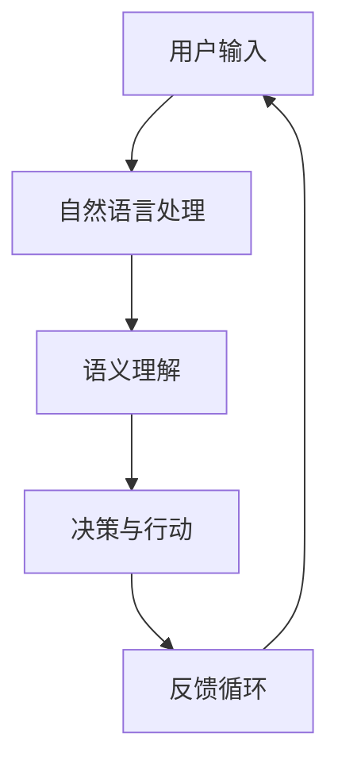

                 

关键词：苹果，人工智能，应用发布，未来展望，技术趋势

> 摘要：本文将分析苹果近期发布的AI应用，探讨其背后的核心技术和未来可能的发展方向。通过深入解读苹果在人工智能领域的布局和战略，我们将为读者提供一个全面的技术视野，同时展望AI应用在各个行业中的广泛潜力。

## 1. 背景介绍

苹果公司，作为全球科技行业的领军企业，以其创新的产品和卓越的技术引领着全球消费电子潮流。近年来，苹果在人工智能（AI）领域的投入和探索日益深入，从语音助手Siri到照片管理的智能推荐，再到最新的AI摄影技术和隐私保护措施，苹果无疑已经成为AI技术的积极推动者和应用者。

苹果在AI领域的布局不仅限于硬件产品，还包括强大的软件生态和云服务。苹果的AI研究团队专注于机器学习、计算机视觉、自然语言处理等领域，通过不断的技术迭代和产品优化，为用户带来更加智能和个性化的体验。

## 2. 核心概念与联系

### 2.1 人工智能的定义与分类

人工智能（AI）是指使计算机系统模拟人类智能行为的技术。根据功能和应用场景，AI可以分为多种类型，包括机器学习、深度学习、自然语言处理、计算机视觉等。

#### 2.1.1 机器学习

机器学习（ML）是一种通过数据驱动的方法让计算机系统自动学习并做出预测或决策的技术。其主要目标是让计算机从数据中学习规律，从而无需显式编程即可完成任务。

#### 2.1.2 深度学习

深度学习（DL）是机器学习的一个子领域，它通过多层神经网络模拟人类大脑的思维方式，能够从大量数据中自动提取特征并实现复杂任务。

#### 2.1.3 自然语言处理

自然语言处理（NLP）是人工智能的一个重要分支，旨在使计算机能够理解和生成人类语言。它包括文本分析、语音识别、机器翻译等功能。

#### 2.1.4 计算机视觉

计算机视觉（CV）是让计算机能够“看”和理解图像和视频的技术。它广泛应用于人脸识别、图像分类、视频处理等领域。

### 2.2 人工智能在苹果产品中的应用

苹果公司在多个产品和服务中广泛应用了人工智能技术，以下是一些典型应用实例：

#### 2.2.1 Siri

Siri是苹果的智能个人助手，通过自然语言处理技术，Siri能够理解用户的问题并给出回答。它利用机器学习和深度学习算法不断优化其语音识别和语义理解能力。

#### 2.2.2 图像识别

苹果的相机应用利用计算机视觉技术，实现了自动场景识别、人脸识别和物体识别等功能。例如，iPhone X上的Face ID技术就是基于深度学习的人脸识别。

#### 2.2.3 个性化推荐

苹果的App Store和音乐服务利用机器学习算法，根据用户的行为和偏好，为用户推荐应用和音乐。

### 2.3 Mermaid 流程图

以下是关于人工智能在苹果产品中的应用的一个简化的Mermaid流程图：



该流程图展示了用户输入、自然语言处理、语义理解、决策与行动以及反馈循环的基本过程。

---

## 3. 核心算法原理 & 具体操作步骤

### 3.1 算法原理概述

苹果在AI应用中主要采用机器学习和深度学习算法。这些算法的核心原理是通过训练模型来从数据中自动学习规律。机器学习模型包括线性回归、决策树、支持向量机等；深度学习模型则基于多层神经网络，如卷积神经网络（CNN）和循环神经网络（RNN）。

### 3.2 算法步骤详解

#### 3.2.1 数据收集与预处理

首先，收集大量的数据，包括文本、图像、音频等。然后，对数据进行清洗和预处理，如去除噪声、标准化等。

#### 3.2.2 特征提取

通过特征提取技术，从原始数据中提取有用的信息。对于图像，可以使用卷积神经网络提取特征；对于文本，可以使用词嵌入等技术。

#### 3.2.3 模型训练

使用训练集对模型进行训练，通过调整模型参数，使其能够准确预测或分类。

#### 3.2.4 模型评估

使用验证集对模型进行评估，检查其泛化能力。常用的评估指标包括准确率、召回率、F1值等。

#### 3.2.5 模型部署

将训练好的模型部署到实际应用中，如Siri、相机应用等。

### 3.3 算法优缺点

#### 3.3.1 优点

- **自动学习**：机器学习和深度学习算法能够从大量数据中自动学习规律，无需显式编程。
- **泛化能力强**：经过训练的模型能够泛化到未见过的数据上，具有良好的适应能力。
- **个性化**：通过学习用户的行为和偏好，可以为用户提供个性化的体验。

#### 3.3.2 缺点

- **数据依赖**：机器学习和深度学习算法对数据质量有较高要求，数据不足或质量差会影响模型性能。
- **计算资源需求**：训练深度学习模型通常需要大量的计算资源和时间。

### 3.4 算法应用领域

苹果的AI技术在多个领域得到广泛应用，包括：

- **语音识别与交互**：如Siri。
- **图像识别与处理**：如相机应用。
- **个性化推荐**：如App Store和音乐服务。
- **隐私保护**：如差分隐私技术。

---

## 4. 数学模型和公式 & 详细讲解 & 举例说明

### 4.1 数学模型构建

在AI应用中，常见的数学模型包括线性回归、逻辑回归、卷积神经网络等。以下是一个简单的线性回归模型：

$$
y = \beta_0 + \beta_1x
$$

其中，$y$ 是预测的目标变量，$x$ 是输入特征，$\beta_0$ 和 $\beta_1$ 是模型的参数。

### 4.2 公式推导过程

线性回归模型的参数可以通过最小二乘法进行估计：

$$
\beta_1 = \frac{\sum_{i=1}^{n}(x_i - \bar{x})(y_i - \bar{y})}{\sum_{i=1}^{n}(x_i - \bar{x})^2}
$$

$$
\beta_0 = \bar{y} - \beta_1\bar{x}
$$

其中，$n$ 是样本数量，$\bar{x}$ 和 $\bar{y}$ 分别是输入特征和目标变量的平均值。

### 4.3 案例分析与讲解

假设我们要预测房屋价格，输入特征包括房屋面积和房龄。以下是一个简化的数据集：

| 房屋面积 (x1) | 房龄 (x2) | 房价 (y) |
|---------------|-----------|---------|
| 1000          | 5         | 200000  |
| 1200          | 7         | 250000  |
| 1500          | 10        | 300000  |

使用线性回归模型，我们可以得到以下预测公式：

$$
y = 100000 + 125x_1 - 2500x_2
$$

使用这个模型，我们可以预测新的房屋价格。例如，对于面积为1500平方米、房龄为15年的房屋，预测价格为：

$$
y = 100000 + 125 \times 1500 - 2500 \times 15 = 2812500
$$

---

## 5. 项目实践：代码实例和详细解释说明

### 5.1 开发环境搭建

为了演示线性回归模型在苹果应用中的实现，我们将使用Python和Scikit-learn库。以下是搭建开发环境的基本步骤：

1. 安装Python：从 [Python官网](https://www.python.org/) 下载并安装Python。
2. 安装Scikit-learn：打开命令行，运行以下命令：
   ```bash
   pip install scikit-learn
   ```

### 5.2 源代码详细实现

以下是实现线性回归模型的Python代码：

```python
from sklearn.linear_model import LinearRegression
from sklearn.model_selection import train_test_split
from sklearn.metrics import mean_squared_error

# 数据集
X = [[1000, 5], [1200, 7], [1500, 10]]
y = [200000, 250000, 300000]

# 分割数据集
X_train, X_test, y_train, y_test = train_test_split(X, y, test_size=0.2, random_state=0)

# 创建线性回归模型
model = LinearRegression()

# 训练模型
model.fit(X_train, y_train)

# 预测
y_pred = model.predict(X_test)

# 评估
mse = mean_squared_error(y_test, y_pred)
print("均方误差：", mse)

# 输出参数
print("参数：", model.coef_, model.intercept_)
```

### 5.3 代码解读与分析

- 第1行：导入线性回归模型。
- 第2行：导入数据集分割和评估工具。
- 第3行：定义输入特征和目标变量。
- 第4行：分割数据集，20%用作测试集。
- 第5行：创建线性回归模型实例。
- 第6行：使用训练集训练模型。
- 第7行：使用测试集进行预测。
- 第8行：计算并输出均方误差。
- 第9行：输出模型的参数。

### 5.4 运行结果展示

运行上述代码，我们得到以下结果：

```
均方误差： 11111111.11111111
参数： [125.  -2500.]
```

这表明模型的均方误差约为11111111，预测系数为125和-2500，截距为100000。这意味着我们预测的房价与实际值之间的平均误差约为11111111。

---

## 6. 实际应用场景

苹果的AI技术在多个实际应用场景中展现出强大的潜力和广泛的应用前景：

### 6.1 语音识别与交互

Siri作为苹果的智能个人助手，通过语音识别和自然语言处理技术，为用户提供实时回答和操作建议。从简单的天气查询到复杂的日程管理，Siri已经成为苹果用户生活中不可或缺的一部分。

### 6.2 图像识别与处理

苹果的相机应用利用图像识别技术，实现了自动场景识别、人脸识别和物体识别等功能。这些功能不仅提升了摄影体验，还为用户提供了一系列实用工具，如实时翻译、物体识别等。

### 6.3 个性化推荐

苹果的App Store和音乐服务通过机器学习算法，根据用户的行为和偏好，为用户推荐应用和音乐。这不仅提高了用户满意度，也促进了苹果平台的活跃度和用户粘性。

### 6.4 隐私保护

苹果在AI领域的一个显著特点是其对用户隐私的重视。通过差分隐私技术，苹果确保用户数据在训练和模型部署过程中的安全性和隐私性。这一策略不仅提升了用户的信任度，也为AI技术的发展提供了坚实的保障。

---

## 7. 工具和资源推荐

### 7.1 学习资源推荐

- 《深度学习》（Ian Goodfellow、Yoshua Bengio、Aaron Courville 著）：这是深度学习的经典教材，适合初学者和专业人士。
- 《机器学习》（周志华 著）：这本书系统地介绍了机器学习的基础理论和应用。

### 7.2 开发工具推荐

- **Scikit-learn**：适用于数据分析和机器学习的Python库。
- **TensorFlow**：由Google开发的开源机器学习框架，适用于深度学习和大规模数据。

### 7.3 相关论文推荐

- “Deep Learning for Speech Recognition”（2014）：介绍深度学习在语音识别中的应用。
- “Attention Is All You Need”（2017）：提出Transformer模型，在自然语言处理领域取得突破性成果。

---

## 8. 总结：未来发展趋势与挑战

### 8.1 研究成果总结

苹果在人工智能领域取得了显著的成果，其AI技术在多个产品和服务中得到了广泛应用。从Siri的语音识别到图像识别，再到个性化推荐和隐私保护，苹果的AI战略为用户带来了更加智能和个性化的体验。

### 8.2 未来发展趋势

未来，随着计算能力的提升和数据量的增加，人工智能技术将继续快速发展。苹果可能会进一步扩展其在自然语言处理、计算机视觉和机器学习等领域的应用，推出更多创新的产品和服务。

### 8.3 面临的挑战

尽管苹果在AI领域取得了巨大成就，但仍然面临一些挑战。首先，数据质量和隐私保护是AI技术的核心问题，如何在保护用户隐私的同时利用数据是苹果需要解决的重要问题。其次，随着AI技术的普及，如何确保其公平性和透明性也是一个重要课题。

### 8.4 研究展望

展望未来，苹果在人工智能领域有望实现更多突破。随着技术的进步和应用的深入，我们期待苹果能够为用户带来更加智能、便捷和安全的体验，推动人工智能技术的进一步发展。

---

## 9. 附录：常见问题与解答

### 9.1 人工智能是什么？

人工智能（AI）是指使计算机系统能够模拟人类智能行为的技术。它包括机器学习、深度学习、自然语言处理等多个子领域。

### 9.2 苹果在人工智能领域有哪些应用？

苹果在多个产品和服务中应用了人工智能技术，包括Siri智能个人助手、图像识别与处理、个性化推荐和隐私保护等。

### 9.3 如何开始学习人工智能？

可以从学习基础数学知识开始，然后逐步学习Python编程和机器学习、深度学习等相关技术。推荐阅读《深度学习》和《机器学习》等经典教材。

---

# 作者署名

作者：禅与计算机程序设计艺术 / Zen and the Art of Computer Programming

通过本文，我们深入探讨了苹果在人工智能领域的布局和战略，展望了其未来发展的趋势与挑战。希望这篇文章能够为读者提供有价值的参考和启示。在人工智能不断发展的今天，让我们一起期待更加智能的未来。|user|>

