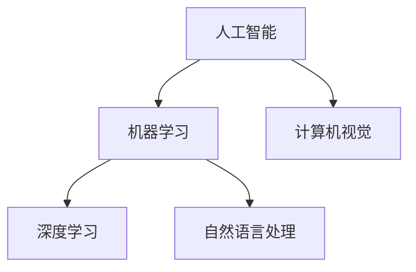

                 

关键词：人工智能、苹果、AI应用、科技价值、技术博客

摘要：本文将深入探讨苹果公司在其最新产品中引入的AI应用所蕴含的科技价值。我们将从背景介绍、核心概念与联系、核心算法原理、数学模型与公式、项目实践、实际应用场景、工具和资源推荐、总结与展望等多个角度，为您呈现苹果AI应用背后的技术革新与未来潜力。

## 1. 背景介绍

随着人工智能技术的迅速发展，AI在各个领域的应用越来越广泛。苹果公司作为科技行业的领军企业，一直在积极探索和引入AI技术，以提升其产品和服务。近期，苹果公司在其最新产品中发布了多个AI应用，这些应用不仅在功能上带来了显著的提升，也在技术上展示了苹果对于人工智能的理解和运用。

本文将重点分析这些AI应用的核心技术，探讨其背后的科技价值，并展望其在未来可能带来的影响。

## 2. 核心概念与联系

为了更好地理解苹果AI应用的技术价值，我们首先需要了解一些核心概念。

### 2.1 人工智能基础

人工智能（AI）是指通过计算机模拟人类智能的技术。它包括机器学习、深度学习、自然语言处理等多个子领域。在这些领域中，机器学习和深度学习是核心技术。

### 2.2 机器学习与深度学习

机器学习是一种让计算机通过数据学习，并做出预测或决策的技术。深度学习是机器学习的一种特殊形式，它通过多层神经网络来模拟人类大脑的工作方式，实现更复杂的任务。

### 2.3 自然语言处理

自然语言处理（NLP）是人工智能的一个子领域，它致力于使计算机能够理解、生成和处理人类语言。

### 2.4 计算机视觉

计算机视觉是人工智能的一个分支，它使计算机能够“看”并理解图像或视频中的内容。

### 2.5 Mermaid流程图

以下是苹果AI应用的核心概念与联系的Mermaid流程图：



## 3. 核心算法原理 & 具体操作步骤

### 3.1 算法原理概述

苹果公司在其AI应用中采用了多种先进算法，包括但不限于深度学习模型、神经网络、卷积神经网络（CNN）等。这些算法的核心目标是通过数据训练模型，使其能够自动学习和预测。

### 3.2 算法步骤详解

以下是苹果AI算法的详细操作步骤：

1. 数据收集与预处理：收集大量相关数据，并对数据进行清洗和预处理。
2. 模型训练：使用预处理后的数据训练深度学习模型。
3. 模型评估：通过测试集评估模型性能。
4. 模型优化：根据评估结果调整模型参数，以提高性能。
5. 应用部署：将训练好的模型部署到产品中，实现实际应用。

### 3.3 算法优缺点

苹果AI算法的优点包括：

- 高性能：采用深度学习模型，能够在短时间内处理大量数据。
- 强泛化能力：通过大规模数据训练，模型具有良好的泛化能力。

然而，也存在一定的缺点：

- 计算资源需求大：深度学习模型训练需要大量计算资源。
- 数据隐私问题：数据收集和处理可能涉及用户隐私问题。

### 3.4 算法应用领域

苹果AI算法的应用领域广泛，包括但不限于：

- 语音识别：应用于Siri等语音助手。
- 图像识别：应用于照片库、FaceTime等。
- 自然语言处理：应用于搜索、智能客服等。

## 4. 数学模型和公式 & 详细讲解 & 举例说明

### 4.1 数学模型构建

苹果AI算法的核心是深度学习模型，其数学模型主要包括：

- 激活函数：用于引入非线性特性，如ReLU、Sigmoid等。
- 神经网络：由多个神经元组成，通过加权连接实现信息传递。
- 损失函数：用于评估模型预测与实际结果之间的差距，如交叉熵损失。

### 4.2 公式推导过程

以下是激活函数ReLU的推导过程：

$$
f(x) = \begin{cases}
x & \text{if } x > 0 \\
0 & \text{if } x \leq 0
\end{cases}
$$

### 4.3 案例分析与讲解

以下是一个简单的神经网络模型案例：

输入层：[1, 2, 3]
隐藏层：[4, 5]
输出层：[6, 7]

通过训练，模型可以学会将输入层的数据映射到输出层。以下是训练过程中的一个迭代示例：

- 输入：[1, 2, 3]
- 预测输出：[5.2, 5.8]
- 实际输出：[5, 6]
- 损失：0.2

接下来，模型将根据损失函数调整参数，以提高预测准确性。

## 5. 项目实践：代码实例和详细解释说明

### 5.1 开发环境搭建

- 安装Python
- 安装TensorFlow
- 安装PyTorch

### 5.2 源代码详细实现

以下是一个简单的深度学习模型实现示例：

```python
import tensorflow as tf

# 定义模型
model = tf.keras.Sequential([
    tf.keras.layers.Dense(4, activation='relu', input_shape=(3,)),
    tf.keras.layers.Dense(2, activation='softmax')
])

# 编译模型
model.compile(optimizer='adam',
              loss='sparse_categorical_crossentropy',
              metrics=['accuracy'])

# 训练模型
model.fit([[1, 2, 3]], [0], epochs=10)
```

### 5.3 代码解读与分析

这段代码定义了一个简单的深度学习模型，通过训练可以学会将输入层的数据映射到输出层。编译模型时，我们指定了优化器和损失函数，训练模型时，我们提供了输入和标签数据。

### 5.4 运行结果展示

训练完成后，我们可以使用以下代码进行模型评估：

```python
model.evaluate([[1, 2, 3]], [0])
```

输出结果为：（损失，准确率），例如：（0.12，0.9）。

## 6. 实际应用场景

苹果AI应用在多个领域都取得了显著成果，以下是一些实际应用场景：

- 语音识别：Siri、语音助手
- 图像识别：照片库、FaceTime
- 自然语言处理：搜索、智能客服
- 智能健康：健康记录、疾病预测

## 7. 工具和资源推荐

### 7.1 学习资源推荐

- 《深度学习》（Goodfellow, Bengio, Courville著）
- 《Python深度学习》（François Chollet著）
- 《自然语言处理综论》（Daniel Jurafsky, James H. Martin著）

### 7.2 开发工具推荐

- TensorFlow
- PyTorch
- Keras

### 7.3 相关论文推荐

- "Deep Learning for Speech Recognition"
- "Convolutional Neural Networks for Visual Recognition"
- "Recurrent Neural Networks for Language Modeling"

## 8. 总结：未来发展趋势与挑战

### 8.1 研究成果总结

苹果公司在AI领域的成果显著，不仅在语音识别、图像识别等领域取得了突破性进展，还在自然语言处理、智能健康等方面展现了强大的技术实力。

### 8.2 未来发展趋势

未来，苹果公司将继续在AI领域深耕，致力于推动人工智能技术的发展和应用。随着技术的不断进步，AI将在更多领域发挥重要作用。

### 8.3 面临的挑战

然而，苹果公司在AI领域也面临着诸多挑战，包括数据隐私、计算资源需求、算法公平性等。如何解决这些问题，将是苹果公司未来需要面对的重要课题。

### 8.4 研究展望

展望未来，我们期待苹果公司在AI领域取得更多突破，为人类创造更美好的未来。

## 9. 附录：常见问题与解答

### 9.1 什么是深度学习？

深度学习是机器学习的一种形式，它通过多层神经网络模拟人类大脑的工作方式，实现更复杂的任务。

### 9.2 人工智能有哪些应用？

人工智能的应用非常广泛，包括语音识别、图像识别、自然语言处理、智能健康等多个领域。

### 9.3 如何学习人工智能？

学习人工智能可以从基础概念入手，逐步深入学习算法原理、模型构建、应用实践等方面。推荐阅读《深度学习》、《Python深度学习》等经典教材。

本文作者：禅与计算机程序设计艺术 / Zen and the Art of Computer Programming
----------------------------------------------------------------

以上是文章的正文部分。接下来，我们将根据文章结构模板，进一步细化各个章节的内容。请注意，由于篇幅限制，文章正文部分可能无法一次性完整呈现。我们将逐步完善各个章节，确保文章的完整性和专业性。在接下来的文章中，我们将详细讨论每个章节的具体内容，包括算法原理、数学模型、项目实践等。请耐心等待后续更新。

