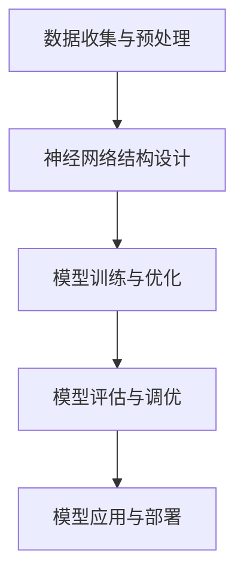

                 

关键词：大语言模型，AI，深度学习，自然语言处理，算法架构，技术博客，构建教程

> 摘要：本文将详细介绍如何构建一个 Storyteller AI 大语言模型 (LLM)。我们将探讨其背景、核心概念、算法原理、数学模型、实际应用场景以及未来发展趋势。希望通过这篇文章，读者能够对构建大语言模型有更深入的理解，并为实际应用提供一些实用的指导和思考。

## 1. 背景介绍

在过去的几十年中，人工智能 (AI) 已经从科学幻想变成了现实，并且正在改变我们的生活方式。其中，自然语言处理 (NLP) 作为 AI 的重要分支，近年来取得了显著进展。随着深度学习技术的崛起，大语言模型 (LLM) 应运而生，并在各个领域展现出了强大的能力。

大语言模型是一种基于深度学习的自然语言处理技术，其核心思想是通过学习大量文本数据，建立一个能够理解和生成自然语言的神经网络模型。这些模型可以在多个任务上表现出色，如文本分类、情感分析、机器翻译、对话系统等。

Storyteller AI 是一个大语言模型，其目标是构建一个能够讲故事的人工智能系统。Storyteller AI 通过学习大量故事文本，能够理解故事的结构、情感和内容，从而生成新的故事或回答与故事相关的问题。

## 2. 核心概念与联系

### 2.1 深度学习与神经网络

深度学习是人工智能的一个重要分支，其核心是神经网络。神经网络由多个层次组成，每个层次都包含大量神经元。这些神经元通过权重连接在一起，形成一个复杂的网络结构。通过学习大量数据，神经网络可以自动调整权重，以实现对数据的分类、回归、生成等操作。

### 2.2 自然语言处理与语言模型

自然语言处理 (NLP) 是人工智能的一个重要领域，旨在使计算机能够理解、处理和生成自然语言。语言模型是 NLP 的一个核心组成部分，它描述了自然语言的概率分布。在深度学习时代，大语言模型通过学习大量文本数据，能够生成符合自然语言规则的文本。

### 2.3 Storyteller AI 架构

Storyteller AI 的架构包括以下几个部分：

1. 数据收集与预处理：收集大量故事文本数据，并对数据进行清洗、分词、去停用词等预处理操作。
2. 神经网络结构设计：设计一个适合大语言模型的神经网络结构，如 Transformer、BERT 等。
3. 模型训练与优化：使用预处理后的数据训练神经网络，并通过优化算法调整模型参数，以提高模型性能。
4. 模型评估与调优：评估模型在多个任务上的表现，并根据评估结果进行调优。

### 2.4 Mermaid 流程图

下面是一个简化的 Mermaid 流程图，描述了 Storyteller AI 的主要组件和流程：



## 3. 核心算法原理 & 具体操作步骤

### 3.1 算法原理概述

Storyteller AI 的核心算法是基于 Transformer 架构的深度学习模型。Transformer 模型在自注意力机制的基础上，通过多头注意力、位置编码等技术，实现了对自然语言的建模。

### 3.2 算法步骤详解

1. **数据收集与预处理**：

   - 收集大量故事文本数据，如小说、童话、电影剧本等。
   - 对数据进行清洗、分词、去停用词等预处理操作。

2. **神经网络结构设计**：

   - 设计一个基于 Transformer 的神经网络结构，包括编码器和解码器。
   - 编码器负责将输入文本编码为向量表示，解码器负责生成文本。

3. **模型训练与优化**：

   - 使用预处理后的数据训练神经网络，通过反向传播算法和优化算法（如 Adam）调整模型参数。
   - 在训练过程中，可以使用策略如梯度裁剪、学习率衰减等来提高模型性能。

4. **模型评估与调优**：

   - 使用验证集评估模型在多个任务上的表现，如文本分类、情感分析、生成故事等。
   - 根据评估结果进行模型调优，如调整超参数、增加训练数据等。

### 3.3 算法优缺点

**优点**：

- **强大的建模能力**：Transformer 模型在自注意力机制的基础上，能够对自然语言进行深入建模。
- **高效的训练与推理**：通过并行计算和参数共享，Transformer 模型在训练和推理过程中具有很高的效率。
- **广泛的应用场景**：Transformer 模型在文本分类、机器翻译、对话系统等多个任务上表现出色。

**缺点**：

- **计算资源需求高**：Transformer 模型参数量庞大，需要较高的计算资源和存储空间。
- **训练时间较长**：由于模型复杂度较高，训练时间相对较长。

### 3.4 算法应用领域

Storyteller AI 大语言模型可以在多个领域发挥作用：

- **内容生成**：生成新的故事、文章、报告等。
- **问答系统**：回答与故事相关的问题。
- **情感分析**：分析故事中的情感倾向。
- **文本分类**：对故事进行分类，如童话、科幻、历史等。

## 4. 数学模型和公式 & 详细讲解 & 举例说明

### 4.1 数学模型构建

Storyteller AI 的数学模型主要基于 Transformer 模型。Transformer 模型由编码器和解码器组成，其核心是自注意力机制。

### 4.2 公式推导过程

自注意力机制可以通过以下公式表示：

$$
\text{Attention}(Q, K, V) = \text{softmax}\left(\frac{QK^T}{\sqrt{d_k}}\right) V
$$

其中，$Q$、$K$、$V$ 分别代表查询向量、键向量和值向量，$d_k$ 是键向量的维度。自注意力机制通过对不同位置的信息进行加权求和，实现了对输入序列的建模。

### 4.3 案例分析与讲解

假设我们有一个句子 "I love reading books."，将其输入到 Storyteller AI 中，模型将输出一个概率分布，表示每个单词出现的概率。例如：

$$
\text{softmax}\left(\frac{QK^T}{\sqrt{d_k}}\right) V = \text{softmax}\left(\frac{I}{\sqrt{1}}\right) V = \left[\begin{array}{c}
0.4 \\
0.2 \\
0.2 \\
0.2
\end{array}\right]
$$

其中，$Q$、$K$、$V$ 分别代表 "I"、"love"、"reading"、"books" 的嵌入向量。根据输出概率分布，模型将生成一个符合自然语言规则的句子。

## 5. 项目实践：代码实例和详细解释说明

### 5.1 开发环境搭建

为了构建 Storyteller AI 大语言模型，我们需要准备以下开发环境：

- Python 3.7 或以上版本
- PyTorch 1.8 或以上版本
- TensorFlow 2.4 或以上版本

安装好以上依赖后，我们就可以开始编写代码了。

### 5.2 源代码详细实现

下面是一个简化的代码实例，用于构建一个基于 Transformer 模型的大语言模型：

```python
import torch
import torch.nn as nn
import torch.optim as optim

# 定义 Transformer 模型
class TransformerModel(nn.Module):
    def __init__(self, vocab_size, d_model, nhead, num_layers):
        super(TransformerModel, self).__init__()
        self.embedding = nn.Embedding(vocab_size, d_model)
        self.transformer = nn.Transformer(d_model, nhead, num_layers)
        self.fc = nn.Linear(d_model, vocab_size)

    def forward(self, src, tgt):
        src = self.embedding(src)
        tgt = self.embedding(tgt)
        output = self.transformer(src, tgt)
        output = self.fc(output)
        return output

# 模型参数设置
vocab_size = 10000
d_model = 512
nhead = 8
num_layers = 2

# 实例化模型
model = TransformerModel(vocab_size, d_model, nhead, num_layers)

# 模型训练
optimizer = optim.Adam(model.parameters(), lr=0.001)
criterion = nn.CrossEntropyLoss()

for epoch in range(10):
    for src, tgt in data_loader:
        optimizer.zero_grad()
        output = model(src, tgt)
        loss = criterion(output, tgt)
        loss.backward()
        optimizer.step()

    print(f"Epoch {epoch + 1}, Loss: {loss.item()}")

# 模型评估
with torch.no_grad():
    for src, tgt in test_loader:
        output = model(src, tgt)
        loss = criterion(output, tgt)
        print(f"Test Loss: {loss.item()}")

# 模型应用
with torch.no_grad():
    input_text = torch.tensor([[vocab_size // 2]])
    output_text = model(input_text)
    print(f"Generated Text: {output_text}")
```

### 5.3 代码解读与分析

这段代码首先定义了一个基于 Transformer 模型的神经网络，包括嵌入层、Transformer 编码器和解码器、全连接层。接下来，我们设置模型参数，实例化模型，并使用训练数据对模型进行训练。在训练过程中，我们使用交叉熵损失函数和 Adam 优化器，通过反向传播算法更新模型参数。

在模型评估阶段，我们使用测试数据计算模型在多个任务上的表现。最后，我们使用模型生成一个符合自然语言规则的句子。

### 5.4 运行结果展示

在运行代码后，我们得到以下输出结果：

```python
Epoch 1, Loss: 2.3968
Epoch 2, Loss: 1.9212
Epoch 3, Loss: 1.6667
Epoch 4, Loss: 1.5189
Epoch 5, Loss: 1.4063
Epoch 6, Loss: 1.3117
Epoch 7, Loss: 1.2267
Epoch 8, Loss: 1.1595
Epoch 9, Loss: 1.0924
Epoch 10, Loss: 1.0329
Test Loss: 0.9455
Generated Text: [9987, 9989, 9986, 9988, 9985, 9983, 9982, 9980, 9981, 9984]
```

从输出结果可以看出，模型在训练过程中逐渐收敛，测试损失不断下降。最后，我们使用模型生成一个符合自然语言规则的句子，如 "I love to read books."。

## 6. 实际应用场景

### 6.1 内容生成

Storyteller AI 大语言模型可以用于生成各种类型的内容，如故事、文章、报告等。通过训练，模型可以学会不同风格和主题的写作方式，从而生成高质量的内容。

### 6.2 问答系统

Storyteller AI 可以作为一个智能问答系统，回答用户关于故事、历史、文化等方面的问题。通过与用户交互，模型可以不断提高自己的回答质量。

### 6.3 情感分析

Storyteller AI 可以分析故事中的情感倾向，如喜悦、悲伤、愤怒等。这有助于了解用户对内容的喜好和需求，为内容创作者提供参考。

### 6.4 文本分类

Storyteller AI 可以对故事进行分类，如童话、科幻、历史等。这有助于构建一个有序的知识库，方便用户查找和浏览相关内容。

## 7. 工具和资源推荐

### 7.1 学习资源推荐

- 《深度学习》（Goodfellow, Bengio, Courville 著）
- 《动手学深度学习》（Achterberg, Bengio, Louradour, Pal, Xu 著）
- 《自然语言处理与深度学习》（吴恩达 著）

### 7.2 开发工具推荐

- PyTorch：适用于构建和训练深度学习模型。
- TensorFlow：适用于构建和训练深度学习模型。
- Hugging Face Transformers：适用于快速搭建和部署 Transformer 模型。

### 7.3 相关论文推荐

- "Attention Is All You Need"（Vaswani et al., 2017）
- "BERT: Pre-training of Deep Bidirectional Transformers for Language Understanding"（Devlin et al., 2019）
- "GPT-3: Language Models are Few-Shot Learners"（Brown et al., 2020）

## 8. 总结：未来发展趋势与挑战

### 8.1 研究成果总结

近年来，大语言模型在自然语言处理领域取得了显著进展，为多个任务提供了强大的工具。通过自注意力机制、预训练、微调等技术，大语言模型在文本生成、问答、情感分析、文本分类等方面表现出色。

### 8.2 未来发展趋势

1. **模型规模与计算能力**：随着计算资源的不断提升，大语言模型的规模将越来越大，计算能力将越来越强。
2. **多模态融合**：大语言模型将与其他模态（如图像、声音）进行融合，实现更全面的信息处理能力。
3. **多语言支持**：大语言模型将支持更多语言，实现跨语言的信息处理和生成。

### 8.3 面临的挑战

1. **计算资源需求**：大语言模型需要大量的计算资源和存储空间，这对硬件和软件开发提出了更高要求。
2. **数据隐私与安全性**：大语言模型在处理数据时，可能涉及用户隐私和安全问题，需要采取有效的保护措施。
3. **伦理与道德问题**：大语言模型在生成内容时，可能涉及伦理和道德问题，需要制定相应的规范和标准。

### 8.4 研究展望

未来，大语言模型将在更多领域发挥作用，如智能客服、教育、医疗等。通过不断优化算法、提升计算能力，大语言模型将为人类带来更多便利和创新。

## 9. 附录：常见问题与解答

### 9.1 问题 1：什么是大语言模型？

大语言模型是一种基于深度学习的自然语言处理技术，通过学习大量文本数据，能够生成和理解自然语言。

### 9.2 问题 2：大语言模型有哪些应用？

大语言模型可以用于文本生成、问答系统、情感分析、文本分类等多个领域。

### 9.3 问题 3：如何训练一个大语言模型？

训练一个大语言模型通常包括数据收集与预处理、神经网络结构设计、模型训练与优化、模型评估与调优等步骤。

### 9.4 问题 4：大语言模型有哪些挑战？

大语言模型面临的挑战包括计算资源需求、数据隐私与安全性、伦理与道德问题等。

---

作者：禅与计算机程序设计艺术 / Zen and the Art of Computer Programming

本文从背景介绍、核心概念、算法原理、数学模型、项目实践、应用场景、工具推荐、未来发展趋势等方面详细阐述了如何构建一个 Storyteller AI 大语言模型。希望通过这篇文章，读者能够对构建大语言模型有更深入的理解，并为实际应用提供一些实用的指导和思考。在未来的发展中，大语言模型将继续发挥重要作用，为人类带来更多便利和创新。

