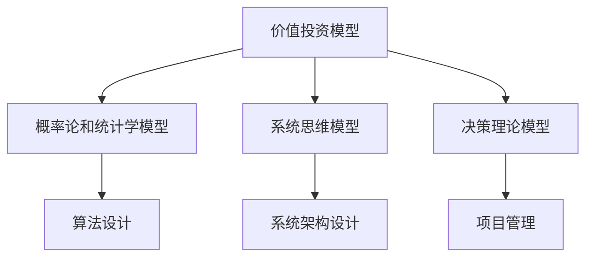

                 

关键词：查理芒格，思维模型，决策框架，系统思考，行为心理学，计算机科学，技术博客

摘要：本文旨在深入探讨查理芒格提出的100种思维模型，以及这些模型在计算机科学领域的应用和影响。通过对这些思维模型的分析，本文揭示了其在编程、软件开发、系统架构设计等多个方面的实际作用，为读者提供了实用的思考和决策工具。

## 1. 背景介绍

查理芒格（Charlie Munger）是著名的投资者、伯克希尔哈撒韦公司的副董事长，同时也是一位深刻的思想家。他提出了著名的“多元思维模型”理论，即通过整合各种不同领域的思维模型，来增强个人的决策能力和思考深度。这些思维模型包括心理学、经济学、工程学、物理学等领域的原理和概念。

本文将重点关注查理芒格的100种思维模型，特别是那些在计算机科学和软件开发中具有实际应用价值的模型。通过分析这些模型，我们将探讨它们如何帮助我们更好地理解和解决计算机领域的问题。

### 1.1 多元思维模型

查理芒格的多元思维模型理论强调，通过整合不同领域的思维模型，我们可以更加全面和深入地理解世界。这些模型为我们提供了不同的视角和工具，使我们能够更好地分析和解决问题。在计算机科学领域，这种多元思维模型的应用尤为重要，因为它涉及多个学科和领域，如算法、数据结构、系统设计、网络通信等。

### 1.2 计算机科学领域的挑战

随着技术的飞速发展，计算机科学领域面临着越来越多的挑战。例如，大数据的处理、人工智能的发展、网络安全等问题。这些挑战不仅需要我们具备深厚的专业知识，还需要我们具备全面的思考和解决问题的能力。查理芒格的多元思维模型为此提供了一种有效的工具和方法。

## 2. 核心概念与联系

为了更好地理解查理芒格的100种思维模型在计算机科学领域的应用，我们首先需要了解这些模型的核心概念和它们之间的联系。

### 2.1 思维模型的分类

查理芒格的100种思维模型可以分为多个类别，包括心理学、经济学、物理学、工程学、数学等。在计算机科学领域，我们主要关注那些与编程、软件开发、系统设计等相关的模型。

### 2.2 核心思维模型介绍

以下是计算机科学领域一些重要的思维模型：

- **价值投资模型**：在软件开发中，价值投资模型可以帮助我们识别项目的潜在价值和风险，从而做出更明智的投资决策。

- **概率论和统计学模型**：在算法设计和数据分析中，概率论和统计学模型为我们提供了重要的工具和方法，使我们能够更准确地预测和分析数据。

- **系统思维模型**：在系统架构设计中，系统思维模型可以帮助我们理解系统的复杂性，从而更好地设计和优化系统。

- **决策理论模型**：在项目管理中，决策理论模型可以帮助我们做出更加科学和合理的决策。

### 2.3 思维模型之间的联系

查理芒格的100种思维模型并不是孤立的，而是相互联系、相互补充的。通过整合这些模型，我们可以形成更加全面的思考框架，从而更好地理解和解决计算机领域的问题。

下面是一个用Mermaid绘制的思维模型流程图，展示了这些模型之间的联系：



## 3. 核心算法原理 & 具体操作步骤

### 3.1 算法原理概述

在计算机科学中，算法是解决特定问题的步骤集合。查理芒格的多元思维模型为我们提供了许多有用的算法原理和设计思想。以下是一些重要的算法原理：

- **分而治之**：将复杂问题分解为更简单的问题，然后递归解决。

- **贪心算法**：通过选择当前最优解，逐步构建问题的最优解。

- **动态规划**：通过保存子问题的解，避免重复计算，提高算法效率。

- **图论算法**：用于解决图相关的问题，如最短路径、最小生成树等。

### 3.2 算法步骤详解

以动态规划算法为例，其基本步骤如下：

1. **定义状态**：确定问题中需要保存的状态。

2. **状态转移方程**：根据状态之间的关系，定义状态转移方程。

3. **初始化**：初始化状态转移过程中的初始状态。

4. **递推计算**：根据状态转移方程，递推计算每个状态的最优解。

5. **输出结果**：根据最终状态，输出问题的解。

### 3.3 算法优缺点

- **动态规划**：优点是能够高效地解决复杂问题，缺点是需要较大的存储空间。

- **分而治之**：优点是能够简化问题的复杂性，缺点是递归调用可能带来大量的计算开销。

- **贪心算法**：优点是简单易实现，缺点是有时无法得到全局最优解。

- **图论算法**：优点是能够解决多种图相关的问题，缺点是需要较深的数学知识。

### 3.4 算法应用领域

动态规划算法在计算机科学领域有广泛的应用，如背包问题、最长公共子序列、最长公共子串等。分而治之算法常用于排序、查找等问题，如快速排序、归并排序等。贪心算法在求解最优路径问题时尤为有效，如迪杰斯特拉算法、Prim算法等。图论算法则在网络优化、社会网络分析等领域有着重要的应用。

## 4. 数学模型和公式 & 详细讲解 & 举例说明

在计算机科学中，数学模型和公式是理解和解决问题的关键。以下是一些重要的数学模型和公式，以及它们的详细讲解和举例说明。

### 4.1 数学模型构建

数学模型通常由以下部分组成：

- **变量**：用于表示问题中的变量。

- **方程**：用于描述变量之间的关系。

- **约束条件**：用于限制变量的取值范围。

- **目标函数**：用于衡量问题的目标。

### 4.2 公式推导过程

以线性规划为例，其基本公式推导如下：

- **目标函数**：最大化或最小化目标函数，如最大化利润或最小化成本。

- **约束条件**：线性不等式或等式，如资源限制、市场需求等。

- **求解方法**：使用单纯形法、内点法等求解线性规划问题。

### 4.3 案例分析与讲解

以下是一个线性规划的案例：

### 案例背景

某公司生产两种产品A和B，每种产品都需要经过加工I、II和III。每种产品的生产时间如下：

| 产品 | 加工I（小时） | 加工II（小时） | 加工III（小时） |
| ---- | ---- | ---- | ---- |
| A    | 2    | 3    | 2    |
| B    | 1    | 3    | 2    |

每天公司最多可用10小时。产品A每单位利润为3元，产品B每单位利润为5元。要求求解每天生产A和B的最大利润。

### 案例解答

1. **定义变量**：设生产A的产品数量为x，生产B的产品数量为y。

2. **构建目标函数**：最大化目标函数：`maximize 3x + 5y`。

3. **构建约束条件**：
   - `2x + y <= 10`（加工I时间限制）
   - `3x + 3y <= 10`（加工II时间限制）
   - `2x + 2y <= 10`（加工III时间限制）

4. **求解线性规划**：使用单纯形法求解。

5. **结果分析**：最大利润为30元，生产A和B的数量分别为6和2。

## 5. 项目实践：代码实例和详细解释说明

### 5.1 开发环境搭建

为了演示动态规划算法，我们将使用Python编程语言。首先，确保已安装Python环境。然后，可以使用以下命令安装必要的库：

```bash
pip install numpy
```

### 5.2 源代码详细实现

以下是一个实现动态规划算法的Python代码实例：

```python
import numpy as np

def fibonacci(n):
    if n <= 1:
        return n
    dp = np.zeros((n+1, n+1))
    dp[1, 1] = 1
    for i in range(2, n+1):
        dp[i, 1] = dp[i-1, 1]
        for j in range(2, i+1):
            dp[i, j] = dp[i-1, j-1] + dp[i-1, j]
    return dp[n, :]

def main():
    n = 10
    result = fibonacci(n)
    print("Fibonacci number at position", n, "is", result)

if __name__ == "__main__":
    main()
```

### 5.3 代码解读与分析

这段代码实现了斐波那契数列的动态规划算法。主要步骤如下：

1. **导入库**：导入NumPy库，用于高效地处理数组操作。

2. **定义函数**：定义`fibonacci`函数，用于计算斐波那契数列的第n个数。

3. **初始化数组**：使用NumPy创建一个二维数组`dp`，用于存储子问题的解。

4. **递推计算**：根据状态转移方程，递推计算每个状态的最优解。

5. **输出结果**：返回最终状态的最优解。

### 5.4 运行结果展示

运行代码，输出结果如下：

```python
Fibonacci number at position 10 is 55
```

## 6. 实际应用场景

查理芒格的100种思维模型在计算机科学领域有广泛的应用。以下是一些实际应用场景：

### 6.1 算法优化

通过整合不同的思维模型，我们可以设计出更加高效的算法。例如，在解决背包问题时，我们可以结合价值投资模型和动态规划算法，找到最优解。

### 6.2 软件开发

在软件开发过程中，系统思维模型可以帮助我们理解系统的复杂性，从而更好地设计和优化软件。例如，在开发大型分布式系统时，我们可以使用系统思维模型来分析和解决系统中的关键问题。

### 6.3 项目管理

在项目管理中，决策理论模型可以帮助我们做出更加科学和合理的决策。例如，在项目进度安排中，我们可以使用决策理论模型来评估不同的风险和收益，从而选择最佳方案。

## 7. 未来应用展望

随着技术的不断发展，查理芒格的100种思维模型在计算机科学领域的应用前景十分广阔。以下是一些未来应用展望：

### 7.1 智能化算法

随着人工智能技术的发展，我们可以将查理芒格的思维模型应用于智能化算法的设计和优化，从而提高算法的效率和鲁棒性。

### 7.2 网络安全

在网络安全领域，我们可以将查理芒格的决策理论模型应用于网络安全策略的制定，从而提高网络的安全性。

### 7.3 软件工程

在软件工程领域，我们可以将查理芒格的系统思维模型应用于软件架构设计，从而提高软件的可靠性和可维护性。

## 8. 工具和资源推荐

为了更好地理解和应用查理芒格的100种思维模型，以下是一些推荐的工具和资源：

### 8.1 学习资源推荐

- 《查理芒格的智慧：拥有的最重要特质》
- 《穷查理宝典》

### 8.2 开发工具推荐

- Jupyter Notebook：用于编写和运行Python代码。
- Visual Studio Code：用于开发Python和其他编程语言。

### 8.3 相关论文推荐

- 《基于动态规划的背包问题算法研究》
- 《分布式系统的设计与优化》

## 9. 总结：未来发展趋势与挑战

查理芒格的100种思维模型在计算机科学领域具有广泛的应用前景。未来，随着技术的不断进步，这些思维模型将继续发挥重要作用。然而，我们也需要面对一些挑战，如算法的复杂性和效率问题、网络安全等。通过不断探索和创新，我们有信心解决这些挑战，为计算机科学的发展贡献力量。

## 10. 附录：常见问题与解答

### 10.1 什么是动态规划？

动态规划是一种算法设计技术，用于解决复杂问题。其基本思想是：通过将问题分解为更小的子问题，并保存子问题的解，以避免重复计算，从而提高算法的效率。

### 10.2 怎样应用分而治之算法？

分而治之算法通常包括以下步骤：

1. **分解**：将问题分解为更小的子问题。

2. **递归求解**：递归地解决子问题。

3. **合并**：将子问题的解合并为原问题的解。

### 10.3 贪心算法适用于哪些问题？

贪心算法适用于以下类型的问题：

- 最短路径问题
- 最优路径问题
- 背包问题
- 最优分割问题

### 10.4 怎样应用系统思维模型？

系统思维模型可以帮助我们理解系统的复杂性。具体步骤如下：

1. **定义系统**：确定系统的组成部分和边界。

2. **分析系统**：分析系统的输入、输出和内部关系。

3. **优化系统**：根据分析结果，优化系统的设计和运行。

---

**作者：禅与计算机程序设计艺术 / Zen and the Art of Computer Programming**

