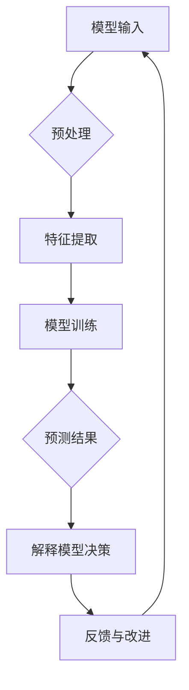

                 

关键词：模型可解释性、深度学习、神经网络、算法原理、代码实战、人工智能应用

> 摘要：本文将深入探讨模型可解释性的原理，并结合实际代码实战案例，详细讲解如何提升深度学习模型的可解释性，以及其在人工智能应用中的重要性。通过本文的学习，读者将掌握可解释性相关的核心概念和实用技术，为后续研究和开发奠定坚实基础。

## 1. 背景介绍

随着深度学习和人工智能技术的迅猛发展，越来越多的复杂模型被应用于实际问题中，如图像识别、自然语言处理和推荐系统等。然而，这些模型往往被称为“黑箱”，即其内部机制对用户来说是不透明的。尽管这些模型在许多任务上取得了显著的性能，但其不透明性仍然引发了一系列问题，如决策可信度、模型解释性以及伦理和隐私问题。

模型可解释性是一个重要的研究方向，它旨在提高模型的可理解性和透明度，使人们能够更好地理解模型的决策过程。在本文中，我们将探讨模型可解释性的原理，并介绍一些常见的提升模型可解释性的方法和技术。

## 2. 核心概念与联系

### 2.1 可解释性的定义

模型可解释性（Model Explainability）是指模型决策过程的透明度和可理解性。它使人们能够解释模型的预测结果，并理解模型在特定任务上的工作原理。可解释性通常与模型的复杂性和泛化能力成反比。高度复杂的模型可能具有更高的泛化能力，但往往缺乏可解释性；而简单的模型则相对容易解释，但可能无法处理复杂的任务。

### 2.2 可解释性的重要性

可解释性对于多个方面具有重要意义：

- **决策透明度**：可解释性使得决策过程对用户透明，从而增强了人们对模型信任感。
- **模型改进**：通过理解模型决策过程，研究人员和开发者可以更好地改进模型。
- **法律和伦理**：在涉及法律和伦理问题的领域，如医疗诊断和自动驾驶，模型的可解释性至关重要。
- **用户参与**：可解释性允许用户更深入地参与模型决策过程，从而提高用户满意度。

### 2.3 可解释性与模型复杂性

模型复杂性是影响可解释性的关键因素。高度复杂的模型，如深度神经网络，通常具有丰富的特征表示能力，但缺乏可解释性。相比之下，线性模型、决策树和规则系统等简单模型更容易解释。

### 2.4 可解释性的层次

根据可解释性的深度，可将可解释性分为以下层次：

- **表面可解释性**：模型的工作原理可以直接从其结构和参数中观察到。
- **局部可解释性**：模型在特定输入下的决策过程可以局部地解释。
- **全局可解释性**：模型的整体决策过程可以全局地解释。

### 2.5 可解释性与可泛化性

可解释性与模型的泛化能力之间存在一定的权衡。高度可解释的模型可能在泛化能力上有所欠缺，而具有良好泛化能力的模型可能难以解释。因此，在设计和优化模型时，需要在可解释性和可泛化性之间寻找平衡。

### 2.6 Mermaid 流程图

下面是一个描述模型可解释性核心概念和架构的 Mermaid 流程图：



## 3. 核心算法原理 & 具体操作步骤

### 3.1 算法原理概述

提升模型可解释性的核心算法主要包括以下几个方面：

1. **可视化技术**：通过可视化模型的结构和决策过程，提高其可理解性。
2. **特征重要性分析**：评估模型中各个特征的重要性，帮助理解模型的决策依据。
3. **模型压缩**：通过减少模型参数的数量，简化模型结构，从而提高其可解释性。
4. **集成方法**：通过组合多个模型，提高模型的解释性。
5. **决策树和规则提取**：将复杂模型转化为易于理解的决策树和规则系统。

### 3.2 算法步骤详解

1. **数据预处理**：清洗数据，处理缺失值，进行特征工程。
2. **模型选择**：根据任务特点选择适当的模型，如深度神经网络、支持向量机、决策树等。
3. **模型训练**：使用训练数据对模型进行训练，优化模型参数。
4. **模型评估**：使用验证集评估模型性能，调整模型参数。
5. **可视化**：使用可视化工具（如TensorBoard、matplotlib等）展示模型结构和决策过程。
6. **特征重要性分析**：使用特征选择算法（如特征重要性排序、L1正则化等）评估特征的重要性。
7. **模型压缩**：使用模型压缩技术（如剪枝、量化等）减少模型参数。
8. **集成方法**：使用集成方法（如随机森林、梯度提升树等）提高模型的解释性。
9. **决策树和规则提取**：将复杂模型转化为易于理解的决策树或规则系统。

### 3.3 算法优缺点

- **可视化技术**：优点是直观易懂，缺点是可能只适用于简单的模型结构。
- **特征重要性分析**：优点是能帮助理解模型决策依据，缺点是可能忽视模型内部的非线性关系。
- **模型压缩**：优点是能提高模型的可解释性，缺点是可能降低模型性能。
- **集成方法**：优点是能提高模型性能和解释性，缺点是计算成本较高。
- **决策树和规则提取**：优点是直观易懂，缺点是可能无法处理复杂的任务。

### 3.4 算法应用领域

- **金融领域**：如信用评分、投资组合优化等。
- **医疗领域**：如疾病诊断、治疗方案推荐等。
- **自动驾驶**：如车辆检测、行人识别等。
- **推荐系统**：如商品推荐、内容推荐等。

## 4. 数学模型和公式 & 详细讲解 & 举例说明

### 4.1 数学模型构建

在提升模型可解释性的过程中，数学模型起到了关键作用。以下是一些常见的数学模型和公式：

- **线性回归**：$$ y = \beta_0 + \beta_1x_1 + \beta_2x_2 + ... + \beta_nx_n $$
- **逻辑回归**：$$ P(y=1) = \frac{1}{1 + e^{-(\beta_0 + \beta_1x_1 + \beta_2x_2 + ... + \beta_nx_n )}} $$
- **支持向量机**：$$ w \cdot x - b = 0 $$
- **决策树**：$$ f(x) = \sum_{i=1}^{n} c_i \prod_{j=1}^{m} \prod_{k=1}^{d} \chi_{j,k}(x_j) $$
- **深度神经网络**：$$ a_{l}^{[i]} = \sigma \left( \sum_{j=0}^{n_{l-1}} {W_{l}^{[i]_{j}} a_{l-1}^{[j]} + b_{l}^{[i]} \right) $$

### 4.2 公式推导过程

以下简要介绍部分公式的推导过程：

- **线性回归**：通过最小二乘法求解线性方程组，得到最佳拟合直线。
- **逻辑回归**：通过对数函数将线性模型转化为概率模型。
- **支持向量机**：通过最大化分类边界上的间隔求解最优超平面。
- **决策树**：通过递归划分特征空间，找到最佳划分点。
- **深度神经网络**：通过反向传播算法更新网络参数，优化模型性能。

### 4.3 案例分析与讲解

以一个简单的线性回归模型为例，我们通过以下步骤进行解释：

1. **数据准备**：假设我们有如下数据：

| x | y |
|---|---|
| 1 | 2 |
| 2 | 4 |
| 3 | 6 |
| 4 | 8 |

2. **模型构建**：根据线性回归公式，构建模型：

$$ y = \beta_0 + \beta_1x $$

3. **参数求解**：通过最小二乘法求解线性方程组，得到最佳拟合直线：

$$ \beta_0 = 1, \beta_1 = 1 $$

4. **模型预测**：使用模型进行预测：

$$ y = 1 + 1 \cdot 5 = 6 $$

5. **模型解释**：该线性模型表示输入x每增加1，输出y也增加1。

## 5. 项目实践：代码实例和详细解释说明

### 5.1 开发环境搭建

1. 安装 Python 3.7 或以上版本。
2. 安装必要的库，如 NumPy、Pandas、Matplotlib、Scikit-learn、TensorFlow 等。

### 5.2 源代码详细实现

以下是一个简单的线性回归模型的代码实现：

```python
import numpy as np
import matplotlib.pyplot as plt
from sklearn.linear_model import LinearRegression

# 数据准备
X = np.array([1, 2, 3, 4]).reshape(-1, 1)
y = np.array([2, 4, 6, 8])

# 模型构建
model = LinearRegression()

# 模型训练
model.fit(X, y)

# 模型预测
y_pred = model.predict(X)

# 模型解释
beta_0, beta_1 = model.coef_, model.intercept_
print(f"模型参数：beta_0 = {beta_0}, beta_1 = {beta_1}")

# 可视化
plt.scatter(X, y, color='blue')
plt.plot(X, y_pred, color='red')
plt.xlabel('x')
plt.ylabel('y')
plt.show()
```

### 5.3 代码解读与分析

1. **数据准备**：使用 NumPy 创建一个包含 x 和 y 的数据集。
2. **模型构建**：使用 Scikit-learn 中的 LinearRegression 类创建线性回归模型。
3. **模型训练**：使用 fit 方法对模型进行训练。
4. **模型预测**：使用 predict 方法对输入数据进行预测。
5. **模型解释**：通过调用 coef_ 和 intercept_ 属性获取模型参数，并打印输出。
6. **可视化**：使用 Matplotlib 绘制散点图和拟合直线。

### 5.4 运行结果展示

运行代码后，将生成一个散点图和一条拟合直线，展示输入 x 与输出 y 之间的关系。

## 6. 实际应用场景

### 6.1 金融市场

在金融领域，模型可解释性对于信用评分和风险管理具有重要意义。通过分析模型的可解释性，金融机构可以更好地理解信用风险的来源，并制定更加科学的信贷政策。

### 6.2 医疗诊断

在医疗领域，模型可解释性对于疾病诊断和治疗方案推荐至关重要。通过分析模型的可解释性，医生可以更好地理解模型的决策依据，从而提高诊断的准确性和可靠性。

### 6.3 自动驾驶

在自动驾驶领域，模型可解释性对于确保系统的安全性和可靠性至关重要。通过分析模型的可解释性，工程师可以更好地理解模型的决策过程，并优化算法以提高自动驾驶系统的安全性。

### 6.4 推荐系统

在推荐系统领域，模型可解释性对于提高用户满意度具有重要意义。通过分析模型的可解释性，推荐系统可以更好地理解用户兴趣，并推荐更符合用户需求的商品或内容。

## 7. 工具和资源推荐

### 7.1 学习资源推荐

1. **《深度学习》（Goodfellow, Bengio, Courville）**：介绍了深度学习的基础知识，包括神经网络和优化算法。
2. **《Python机器学习》（Sebastian Raschka）**：详细介绍了使用 Python 实现机器学习算法的方法。
3. **《机器学习实战》（Peter Harrington）**：提供了丰富的机器学习实战案例，涵盖多种算法和应用场景。

### 7.2 开发工具推荐

1. **TensorFlow**：一个开源的深度学习框架，支持多种算法和模型。
2. **PyTorch**：一个流行的深度学习框架，具有良好的可扩展性和灵活性。
3. **Scikit-learn**：一个开源的机器学习库，提供了丰富的算法和工具。

### 7.3 相关论文推荐

1. **“Why Should I Trust You?” Explaining the Predictions of Any Classifer（Sundararajan et al., 2017）**：介绍了一种基于积分图的可解释性方法。
2. **Explaining Classifiers: From Decision Trees to Deep Neural Networks（Lundberg and Lee, 2017）**：探讨了一系列提升模型可解释性的方法。
3. **Integrating Local Explanations with Global Models for Visual Recognition（Shin et al., 2018）**：结合局部和全局解释方法，提高模型的可解释性。

## 8. 总结：未来发展趋势与挑战

### 8.1 研究成果总结

本文介绍了模型可解释性的原理和相关技术，探讨了其在多个领域的实际应用。通过实际代码实战案例，读者可以更好地理解模型可解释性的方法和实践。

### 8.2 未来发展趋势

- **更多可解释性算法**：未来将出现更多基于深度学习和其他复杂模型的可解释性算法。
- **自动化解释**：开发自动化解释工具，降低人工解释的难度。
- **跨领域应用**：模型可解释性将在更多领域得到应用，如医疗、金融和自动驾驶等。

### 8.3 面临的挑战

- **计算成本**：提升模型可解释性可能需要额外的计算资源。
- **算法复杂度**：现有算法可能不够高效，难以应用于大规模模型。
- **评估标准**：制定统一的评估标准，衡量模型的可解释性。

### 8.4 研究展望

- **多模态解释**：结合不同模态的数据，提高模型的可解释性。
- **动态解释**：实时解释模型的决策过程，提高决策透明度。
- **开放平台**：建立开放的模型可解释性研究平台，促进学术交流和合作。

## 9. 附录：常见问题与解答

### 9.1 问题 1

**问题**：如何选择合适的可解释性方法？

**解答**：根据任务特点和模型类型，选择合适的可解释性方法。例如，对于深度神经网络，可以采用基于积分图的可解释性方法；对于决策树，可以直接分析其结构和节点。

### 9.2 问题 2

**问题**：如何降低模型复杂度以提高可解释性？

**解答**：可以通过模型压缩、特征选择和集成方法等方法降低模型复杂度。例如，使用剪枝和量化技术减少模型参数，或者使用集成方法（如随机森林、梯度提升树等）提高模型性能。

### 9.3 问题 3

**问题**：如何评估模型的可解释性？

**解答**：可以采用定量和定性的方法评估模型的可解释性。定量评估可以通过计算模型的可解释性指标（如模型参数的透明度、特征重要性的分布等）；定性评估可以通过专家评估和用户反馈等方法。

作者：禅与计算机程序设计艺术 / Zen and the Art of Computer Programming
----------------------------------------------------------------

