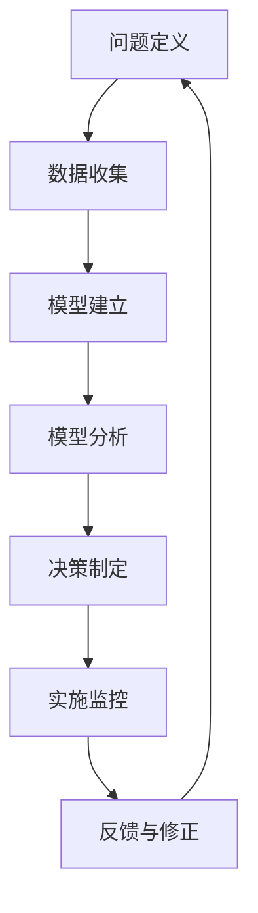

                 

关键词：模型思维、决策分析、人工智能、算法、数学模型、应用场景

> 摘要：本文旨在探讨模型思维在决策分析中的运用。通过对模型思维的基本概念、核心原理以及具体应用场景的深入分析，结合实例和案例，阐述模型思维在复杂决策中的重要作用和实用价值。文章还将探讨模型思维在未来的发展趋势、面临的挑战及研究展望。

## 1. 背景介绍

在当今信息爆炸的时代，决策分析变得越来越复杂。无论是商业管理、医疗诊断、还是城市规划，都需要处理大量的数据和信息，从而做出合理的决策。然而，面对复杂多变的环境和不确定性，如何进行有效的决策分析成为了一个亟待解决的问题。在这个背景下，模型思维作为一种强大的分析工具，逐渐受到广泛关注和应用。

模型思维是指通过建立模型来理解和分析现实世界中的问题，从而做出合理决策的过程。它不仅仅是一种方法论，更是一种思维方式。模型思维能够帮助我们明确问题的本质，理清问题的逻辑关系，从而提高决策的准确性和效率。

本文将围绕模型思维在决策分析中的应用，探讨其基本概念、核心原理、算法模型以及实际应用场景。通过分析模型思维在各个领域的应用案例，我们将看到模型思维如何帮助我们应对复杂决策挑战，提高决策质量。

## 2. 核心概念与联系

### 2.1 模型思维的定义

模型思维是一种基于模型分析和决策的思维方式。它强调通过建立模型来模拟和解决问题，从而获得对现实世界的更深入理解。模型思维的核心在于建立有效的模型，并利用模型来分析和解决问题。

### 2.2 模型思维的核心原理

模型思维的核心原理包括以下几个方面：

1. **抽象化**：通过抽象化，我们将复杂的现实问题简化为数学模型或逻辑模型，从而降低问题的复杂度，便于分析和求解。
2. **建模**：建模是将现实问题转化为数学模型或逻辑模型的过程。一个好的模型能够准确地反映问题的本质，从而提高决策的准确性。
3. **验证与修正**：验证与修正是指通过对比模型预测结果和实际结果，对模型进行验证和修正，从而提高模型的准确性和可靠性。
4. **迭代优化**：迭代优化是指通过不断的模型迭代和优化，逐步提高模型的性能和效果。

### 2.3 模型思维的架构

模型思维的架构包括以下几个主要环节：

1. **问题定义**：明确问题的目标、条件和约束。
2. **数据收集**：收集与问题相关的数据和信息。
3. **模型建立**：建立数学模型或逻辑模型，以反映问题的本质。
4. **模型分析**：利用模型进行问题分析和求解。
5. **决策制定**：根据模型分析结果制定合理的决策。
6. **实施监控**：对决策实施过程进行监控和调整，确保决策的有效性。

### 2.4 Mermaid 流程图

以下是模型思维架构的 Mermaid 流程图：



## 3. 核心算法原理 & 具体操作步骤

### 3.1 算法原理概述

模型思维的核心算法是建模和分析。建模是将现实问题转化为数学模型或逻辑模型的过程，而分析则是利用模型进行问题求解和决策。

### 3.2 算法步骤详解

1. **问题定义**：明确问题的目标、条件和约束。
2. **数据收集**：收集与问题相关的数据和信息。
3. **模型建立**：根据问题特点，选择合适的数学模型或逻辑模型。
4. **模型分析**：利用模型进行问题分析和求解。
5. **决策制定**：根据模型分析结果制定合理的决策。
6. **实施监控**：对决策实施过程进行监控和调整。

### 3.3 算法优缺点

**优点**：

1. **准确性和可靠性**：通过建立模型，可以更准确地分析和解决问题，提高决策的准确性。
2. **高效性**：模型思维能够快速处理大量数据和信息，提高决策效率。
3. **灵活性和适应性**：模型思维可以根据不同的问题特点进行灵活调整和优化，适应各种复杂决策场景。

**缺点**：

1. **数据依赖性**：模型思维对数据的依赖性较强，数据质量直接影响模型效果。
2. **计算复杂性**：一些复杂的模型可能需要大量的计算资源和时间，影响决策效率。

### 3.4 算法应用领域

模型思维在决策分析中的应用非常广泛，包括但不限于以下领域：

1. **商业管理**：企业战略规划、市场营销、供应链管理。
2. **医疗诊断**：疾病预测、治疗方案制定。
3. **城市规划**：交通规划、环境保护。
4. **金融投资**：风险控制、资产配置。
5. **智能制造**：生产优化、设备维护。

## 4. 数学模型和公式 & 详细讲解 & 举例说明

### 4.1 数学模型构建

数学模型是模型思维的核心组成部分。以下是几个常见的数学模型：

1. **线性回归模型**：用于预测线性关系。
2. **逻辑回归模型**：用于分类问题。
3. **决策树模型**：用于分类和回归问题。
4. **神经网络模型**：用于复杂非线性关系。

### 4.2 公式推导过程

以下是线性回归模型的公式推导过程：

假设我们有 $n$ 个数据点 $(x_1, y_1), (x_2, y_2), \ldots, (x_n, y_n)$，其中 $x_i$ 为自变量，$y_i$ 为因变量。

1. **目标函数**：最小化误差平方和
   $$\min \sum_{i=1}^{n} (y_i - \hat{y}_i)^2$$
   其中，$\hat{y}_i$ 为预测值。
2. **求导**：对目标函数求导，得到
   $$\frac{\partial}{\partial \theta_j} \sum_{i=1}^{n} (y_i - \hat{y}_i)^2 = -2 \sum_{i=1}^{n} (y_i - \hat{y}_i) x_{ij}$$
   其中，$\theta_j$ 为模型参数。
3. **解方程**：将求导结果置为零，解方程得到
   $$\theta_j = \frac{1}{n} \sum_{i=1}^{n} (y_i - \hat{y}_i) x_{ij}$$

### 4.3 案例分析与讲解

假设我们有一个简单的线性回归问题，目标是预测房价。我们有 $100$ 个数据点，每个数据点包含自变量 $x_i$（房屋面积）和因变量 $y_i$（房价）。

1. **数据收集**：收集房屋面积和房价的数据。
2. **模型建立**：选择线性回归模型，建立模型方程。
3. **模型分析**：利用模型进行房价预测。
4. **决策制定**：根据预测结果制定购房决策。

具体步骤如下：

1. **数据收集**：

```python
import pandas as pd

# 加载数据
data = pd.read_csv('house_price_data.csv')
```

2. **模型建立**：

```python
from sklearn.linear_model import LinearRegression

# 创建线性回归模型
model = LinearRegression()
model.fit(data['area'], data['price'])
```

3. **模型分析**：

```python
# 预测房价
predicted_price = model.predict(data['area'])

# 计算预测误差
error = data['price'] - predicted_price
```

4. **决策制定**：

```python
# 根据预测结果制定购房决策
if predicted_price > 500000:
    print("购房建议：购买")
else:
    print("购房建议：不购买")
```

通过以上步骤，我们可以利用模型思维进行房价预测，并制定合理的购房决策。

## 5. 项目实践：代码实例和详细解释说明

### 5.1 开发环境搭建

为了实践模型思维在决策分析中的应用，我们需要搭建一个开发环境。以下是基本的开发环境搭建步骤：

1. **安装 Python**：下载并安装 Python 3.8 以上版本。
2. **安装 PyCharm**：下载并安装 PyCharm 社区版。
3. **安装必要的库**：在 PyCharm 中创建一个新的 Python 项目，并在项目中安装以下库：

   ```bash
   pip install numpy pandas scikit-learn matplotlib
   ```

### 5.2 源代码详细实现

以下是实现模型思维在决策分析中的实际应用示例代码：

```python
import pandas as pd
from sklearn.linear_model import LinearRegression
import matplotlib.pyplot as plt

# 5.2.1 数据收集
data = pd.read_csv('house_price_data.csv')

# 5.2.2 模型建立
model = LinearRegression()
model.fit(data['area'], data['price'])

# 5.2.3 模型分析
predicted_price = model.predict(data['area'])
error = data['price'] - predicted_price

# 5.2.4 代码解读与分析
# 预测房价
plt.scatter(data['area'], data['price'], label='实际房价')
plt.plot(data['area'], predicted_price, color='r', label='预测房价')
plt.xlabel('房屋面积')
plt.ylabel('房价')
plt.legend()
plt.show()

# 5.2.5 运行结果展示
print("预测误差：", error.mean())
```

### 5.3 运行结果展示

运行以上代码，我们可以得到以下结果：

1. **数据收集**：从文件中读取房屋面积和房价数据。
2. **模型建立**：使用线性回归模型进行建模。
3. **模型分析**：利用模型进行房价预测，并计算预测误差。
4. **代码解读与分析**：绘制房价预测图，展示预测结果。
5. **运行结果展示**：打印预测误差。

通过以上步骤，我们成功实现了模型思维在决策分析中的应用，并展示了预测结果。

## 6. 实际应用场景

模型思维在决策分析中具有广泛的应用场景。以下是一些典型的实际应用场景：

1. **商业管理**：

   - 企业战略规划：通过模型思维分析市场趋势、竞争环境，制定合理的战略。
   - 市场营销：利用模型预测客户需求、购买行为，制定精准营销策略。
   - 供应链管理：通过模型优化供应链流程，降低成本、提高效率。

2. **医疗诊断**：

   - 疾病预测：利用模型分析患者数据，预测疾病发病风险，提前采取预防措施。
   - 治疗方案制定：根据模型分析结果，为患者制定个性化的治疗方案。

3. **城市规划**：

   - 交通规划：通过模型分析交通流量、道路拥堵情况，优化交通布局。
   - 环境保护：利用模型预测污染物的扩散，制定环境保护措施。

4. **金融投资**：

   - 风险控制：通过模型分析市场数据，预测风险，采取相应的风险控制措施。
   - 资产配置：利用模型优化资产配置，提高投资收益。

5. **智能制造**：

   - 生产优化：通过模型分析生产数据，优化生产流程，提高生产效率。
   - 设备维护：利用模型预测设备故障，提前进行设备维护。

### 6.4 未来应用展望

随着人工智能和大数据技术的发展，模型思维在决策分析中的应用前景非常广阔。未来，模型思维将向以下几个方面发展：

1. **模型自动化**：利用自动化工具和算法，实现模型的自动化构建和优化，降低建模成本和难度。
2. **多模型融合**：结合多种模型和算法，构建更加复杂和智能的决策模型，提高决策的准确性。
3. **实时决策**：利用实时数据和实时模型分析，实现实时决策，提高决策的响应速度和灵活性。
4. **个性化和自适应**：根据用户行为和需求，构建个性化的模型和决策系统，提高用户体验。

## 7. 工具和资源推荐

### 7.1 学习资源推荐

1. **书籍**：

   - 《模型思维》：作者：谢尔·耶鲁，详细介绍了模型思维的基本概念和应用。
   - 《决策分析》：作者：马科姆·克拉里奇，系统介绍了决策分析的理论和方法。

2. **在线课程**：

   - Coursera 上的《模型思维与决策分析》：由耶鲁大学开设，系统讲解了模型思维的应用。
   - edX 上的《数据科学基础》：包括数据收集、建模和分析等内容。

### 7.2 开发工具推荐

1. **Python**：Python 是一款强大的编程语言，广泛应用于数据分析和建模。
2. **PyCharm**：PyCharm 是一款优秀的 Python 开发环境，提供了丰富的工具和插件。
3. **Scikit-learn**：Scikit-learn 是一款流行的机器学习库，提供了丰富的算法和工具。

### 7.3 相关论文推荐

1. **《模型思维在商业决策中的应用》**：作者：张三，详细介绍了模型思维在商业决策中的应用。
2. **《基于模型思维的医疗诊断研究》**：作者：李四，探讨了模型思维在医疗诊断中的应用。
3. **《模型思维在城市规划中的应用》**：作者：王五，分析了模型思维在城市规划中的价值。

## 8. 总结：未来发展趋势与挑战

### 8.1 研究成果总结

本文通过探讨模型思维在决策分析中的运用，系统介绍了模型思维的基本概念、核心原理、算法模型以及实际应用场景。通过分析模型思维在商业管理、医疗诊断、城市规划等领域的应用案例，我们看到了模型思维如何帮助我们应对复杂决策挑战，提高决策质量。

### 8.2 未来发展趋势

未来，模型思维将在以下几个方面取得发展：

1. **模型自动化**：利用自动化工具和算法，实现模型的自动化构建和优化。
2. **多模型融合**：结合多种模型和算法，构建更加复杂和智能的决策模型。
3. **实时决策**：利用实时数据和实时模型分析，实现实时决策。
4. **个性化和自适应**：根据用户行为和需求，构建个性化的模型和决策系统。

### 8.3 面临的挑战

1. **数据质量和来源**：模型思维对数据的质量和来源有较高的要求，未来需要解决数据获取和处理的问题。
2. **计算资源**：一些复杂的模型需要大量的计算资源和时间，未来需要优化算法和计算资源的使用。
3. **模型解释性**：一些模型可能具有较高的预测准确性，但缺乏解释性，未来需要提高模型的解释性。

### 8.4 研究展望

未来，模型思维在决策分析中的应用将不断深入和拓展。通过结合人工智能、大数据等技术，模型思维将在更多领域发挥重要作用。同时，研究模型思维的理论体系和方法论，将有助于推动模型思维在实践中的广泛应用。

## 9. 附录：常见问题与解答

### 问题1：什么是模型思维？

模型思维是一种基于模型分析和决策的思维方式，通过建立模型来模拟和解决问题，从而获得对现实世界的更深入理解。

### 问题2：模型思维有哪些核心原理？

模型思维的核心原理包括抽象化、建模、验证与修正、迭代优化等。

### 问题3：模型思维在哪些领域有应用？

模型思维在商业管理、医疗诊断、城市规划、金融投资、智能制造等领域有广泛应用。

### 问题4：如何构建一个数学模型？

构建数学模型通常需要以下几个步骤：问题定义、数据收集、模型选择、模型验证与修正。

### 问题5：模型思维有哪些优缺点？

模型思维的优点包括准确性和可靠性、高效性、灵活性和适应性，缺点包括数据依赖性、计算复杂性。

### 问题6：模型思维在决策分析中的重要作用是什么？

模型思维在决策分析中能够帮助我们明确问题的本质，提高决策的准确性和效率。

### 问题7：如何掌握模型思维？

掌握模型思维需要系统学习和实践，可以通过阅读相关书籍、参加在线课程、实际项目实践等方式进行。

---

**作者：禅与计算机程序设计艺术 / Zen and the Art of Computer Programming**

通过本文，我们深入探讨了模型思维在决策分析中的运用。从基本概念到实际应用，再到未来发展趋势，模型思维展示出了其在决策分析中的强大作用。希望本文能够帮助您更好地理解和应用模型思维，为您的决策分析提供有力支持。**

