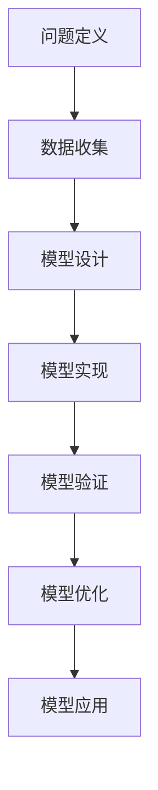

                 

关键词：模型思维、管理沟通、认知框架、复杂性科学、系统性思维

> 摘要：本文探讨了模型思维在管理沟通中的重要性。通过引入复杂性科学和系统性思维的概念，分析了模型思维如何帮助管理者更有效地理解组织内部的动态关系，优化决策流程，并提高沟通效率。本文还将介绍构建和管理模型的方法，以及如何在实际工作中应用这些方法。

## 1. 背景介绍

在信息化和全球化的背景下，企业管理面临着前所未有的复杂性和不确定性。传统的线性思维模式已经难以应对现代管理环境中的复杂性。因此，管理者需要借助模型思维这一工具，通过构建和管理模型来更好地理解组织内部的动态关系，从而做出更为明智的决策。

模型思维是指运用模型来模拟、分析和解决问题的一种思维方式。它不仅是一种方法论，更是一种认知框架，帮助管理者在面对复杂问题时能够从多个角度进行分析和决策。本文将重点探讨模型思维在管理沟通中的应用，包括其核心概念、原理及其在现实工作中的应用。

### 1.1 管理沟通的重要性

管理沟通是组织运作的核心，它不仅影响团队的协作效率，还关系到组织的战略执行和整体绩效。有效的沟通能够确保信息准确、及时地传递，减少误解和冲突，促进团队成员之间的信任和合作。然而，在复杂的管理环境中，沟通往往面临诸多挑战：

- **信息过载**：现代企业每天都会产生大量数据和信息，管理者难以从中筛选出关键信息。
- **认知偏差**：管理者在沟通过程中可能受到各种认知偏差的影响，导致信息解读不准确。
- **跨部门障碍**：不同部门和团队之间的沟通不畅，导致信息孤岛和协作障碍。

### 1.2 复杂性科学与系统性思维

复杂性科学是一门研究复杂系统行为的学科，它关注系统内部的非线性、动态性和涌现性。在复杂性科学的视角下，企业管理不再是简单的线性过程，而是复杂的适应性系统。系统性思维则强调从整体和动态的角度看待问题，认识到各部分之间的相互关系和反馈循环。

复杂性科学和系统性思维为模型思维提供了理论基础。通过引入这些概念，管理者可以更加全面和深入地理解组织内部的复杂关系，从而构建出更准确的模型，提高决策和沟通的效率。

### 1.3 本文结构

本文将分为以下几个部分：

- **第2章**：介绍模型思维的核心概念，包括模型的基本类型、构建方法和评价标准。
- **第3章**：分析模型思维在管理沟通中的具体应用，探讨如何利用模型来优化决策流程和沟通效果。
- **第4章**：介绍构建和管理模型的方法，包括数据收集、模型设计和验证等步骤。
- **第5章**：通过实际案例，展示模型思维在管理沟通中的成功应用。
- **第6章**：讨论模型思维在未来的发展前景和面临的挑战。

## 2. 核心概念与联系

### 2.1 模型思维的基本类型

模型思维可以分为定量模型和定性模型两种基本类型。

- **定量模型**：基于数学和统计学方法，通过数据分析和计算来模拟现实问题。定量模型通常包括线性模型、非线性模型、概率模型等。
- **定性模型**：基于逻辑推理和案例分析，通过故事和故事板来模拟现实问题。定性模型通常包括流程图、鱼骨图、思维导图等。

### 2.2 模型的构建方法

构建模型通常包括以下几个步骤：

1. **问题定义**：明确要解决的问题和目标。
2. **数据收集**：收集与问题相关的数据和信息。
3. **模型设计**：根据问题的性质选择合适的模型类型，并设计模型的架构。
4. **模型实现**：使用计算机程序或其他工具来实现模型。
5. **模型验证**：通过实际数据和案例验证模型的准确性和可靠性。
6. **模型优化**：根据验证结果对模型进行调整和优化。

### 2.3 模型的评价标准

评价模型的标准包括：

- **准确性**：模型预测结果与实际结果的接近程度。
- **可靠性**：模型在不同数据集上的稳定性和一致性。
- **可理解性**：模型的结构和参数是否易于理解和解释。
- **实用性**：模型是否能够应用于实际问题，并产生可操作的建议。

### 2.4 Mermaid 流程图



### 2.5 模型思维与复杂性科学、系统性思维的联系

模型思维与复杂性科学、系统性思维密切相关。复杂性科学提供了研究复杂系统的理论和方法，而系统性思维则提供了从整体和动态的角度看待问题的思维方式。模型思维结合了这些概念，通过构建和管理模型，帮助管理者更好地理解复杂系统的动态行为，从而做出更为明智的决策。

## 3. 核心算法原理 & 具体操作步骤

### 3.1 算法原理概述

模型思维的核心算法是基于系统动力学和复杂性科学的原理。通过构建系统动力学模型，可以模拟组织内部各种因素的相互作用和反馈循环，从而预测系统的行为和趋势。具体操作步骤如下：

1. **问题定义**：明确要解决的问题和目标。
2. **数据收集**：收集与问题相关的历史数据和现实数据。
3. **变量识别**：识别影响问题的主要变量和因素。
4. **因果关系分析**：分析变量之间的因果关系，构建因果关系图。
5. **系统动力学模型构建**：根据因果关系图构建系统动力学模型。
6. **模型仿真**：使用仿真工具对模型进行仿真，分析系统的行为和趋势。
7. **模型验证**：通过实际数据和案例验证模型的准确性和可靠性。
8. **模型优化**：根据验证结果对模型进行调整和优化。

### 3.2 算法步骤详解

1. **问题定义**：明确要解决的问题和目标。

   在构建模型之前，首先要明确要解决的问题和目标。这包括确定问题的范围、关键因素和目标指标等。

2. **数据收集**：收集与问题相关的历史数据和现实数据。

   数据是构建模型的基础。需要收集与问题相关的各种数据，包括历史数据、现实数据和预测数据等。

3. **变量识别**：识别影响问题的主要变量和因素。

   在问题定义和数据收集的基础上，识别影响问题的主要变量和因素。这些变量可以是定量的，也可以是定性的。

4. **因果关系分析**：分析变量之间的因果关系，构建因果关系图。

   基于变量识别的结果，分析变量之间的因果关系，并构建因果关系图。这有助于明确各变量之间的相互作用和反馈循环。

5. **系统动力学模型构建**：根据因果关系图构建系统动力学模型。

   根据因果关系图，使用系统动力学建模工具构建系统动力学模型。系统动力学模型可以描述变量之间的动态关系和反馈循环。

6. **模型仿真**：使用仿真工具对模型进行仿真，分析系统的行为和趋势。

   使用仿真工具对构建的模型进行仿真，分析系统的行为和趋势。通过仿真，可以预测系统的未来行为，并为决策提供依据。

7. **模型验证**：通过实际数据和案例验证模型的准确性和可靠性。

   通过实际数据和案例验证模型的准确性和可靠性。这可以通过比较模型预测结果与实际结果的一致性来实现。

8. **模型优化**：根据验证结果对模型进行调整和优化。

   根据验证结果，对模型进行调整和优化。这包括调整模型参数、添加或删除变量等，以提高模型的准确性和实用性。

### 3.3 算法优缺点

#### 优点：

- **准确性**：系统动力学模型可以准确地描述变量之间的动态关系和反馈循环，从而提高预测准确性。
- **全面性**：系统动力学模型考虑了多种变量和因素，可以全面地分析系统的行为和趋势。
- **灵活性**：系统动力学模型可以根据实际情况进行调整和优化，具有较高的灵活性。

#### 缺点：

- **复杂性**：构建和管理系统动力学模型需要较高的专业知识和技能，过程较为复杂。
- **计算成本**：系统动力学模型的仿真需要大量的计算资源和时间，计算成本较高。

### 3.4 算法应用领域

系统动力学模型在管理沟通中具有广泛的应用。以下是一些典型的应用领域：

- **供应链管理**：通过构建供应链模型，可以优化供应链的物流和库存管理，提高供应链的响应速度和灵活性。
- **项目管理**：通过构建项目模型，可以预测项目的进度和成本，优化项目资源分配，提高项目成功率。
- **市场营销**：通过构建市场营销模型，可以分析市场需求和消费者行为，制定有效的市场营销策略。
- **人力资源管理**：通过构建人力资源模型，可以预测员工的流动和招聘需求，优化人力资源配置。

## 4. 数学模型和公式 & 详细讲解 & 举例说明

### 4.1 数学模型构建

在模型思维中，数学模型是描述现实问题的一种有力工具。构建数学模型通常涉及以下几个步骤：

1. **问题定义**：明确要解决的问题和目标。
2. **变量识别**：识别影响问题的主要变量。
3. **函数关系**：根据变量之间的关系建立函数模型。
4. **方程建立**：将函数关系转换为数学方程。
5. **参数估计**：通过数据估计模型参数。
6. **模型验证**：通过实际数据验证模型的准确性。

### 4.2 公式推导过程

以下是一个简单的线性回归模型推导过程：

假设我们有 $n$ 个数据点 $(x_i, y_i)$，其中 $x_i$ 是自变量，$y_i$ 是因变量。线性回归模型的目标是找到最佳拟合直线 $y = a \cdot x + b$，使得预测值与实际值之间的误差最小。

1. **目标函数**：

$$
E = \sum_{i=1}^{n} (y_i - (a \cdot x_i + b))^2
$$

2. **偏导数**：

对 $a$ 和 $b$ 分别求偏导数，并令其为零，得到：

$$
\frac{\partial E}{\partial a} = -2 \sum_{i=1}^{n} (y_i - a \cdot x_i - b) \cdot x_i = 0
$$

$$
\frac{\partial E}{\partial b} = -2 \sum_{i=1}^{n} (y_i - a \cdot x_i - b) = 0
$$

3. **求解**：

解上述方程组，得到 $a$ 和 $b$ 的值。

$$
a = \frac{\sum_{i=1}^{n} x_i y_i - n \bar{x} \bar{y}}{\sum_{i=1}^{n} x_i^2 - n \bar{x}^2}
$$

$$
b = \bar{y} - a \bar{x}
$$

其中，$\bar{x}$ 和 $\bar{y}$ 分别是 $x_i$ 和 $y_i$ 的平均值。

### 4.3 案例分析与讲解

假设我们有一组数据，如下表所示：

| x | y |
|---|---|
| 1 | 2 |
| 2 | 4 |
| 3 | 5 |
| 4 | 6 |

我们要使用线性回归模型预测 $x=5$ 时的 $y$ 值。

1. **计算平均值**：

$$
\bar{x} = \frac{1+2+3+4}{4} = 2.5
$$

$$
\bar{y} = \frac{2+4+5+6}{4} = 4.5
$$

2. **计算相关值**：

$$
\sum_{i=1}^{n} x_i y_i = 1\cdot2 + 2\cdot4 + 3\cdot5 + 4\cdot6 = 40
$$

$$
\sum_{i=1}^{n} x_i^2 = 1^2 + 2^2 + 3^2 + 4^2 = 30
$$

3. **计算斜率 $a$ 和截距 $b$**：

$$
a = \frac{40 - 4 \cdot 2.5 \cdot 4.5}{30 - 4 \cdot 2.5^2} = 0.8
$$

$$
b = 4.5 - 0.8 \cdot 2.5 = 2.3
$$

4. **构建线性回归模型**：

$$
y = 0.8 \cdot x + 2.3
$$

5. **预测 $x=5$ 时的 $y$ 值**：

$$
y = 0.8 \cdot 5 + 2.3 = 5.3
$$

因此，当 $x=5$ 时，预测的 $y$ 值为 5.3。

## 5. 项目实践：代码实例和详细解释说明

### 5.1 开发环境搭建

在本项目中，我们将使用 Python 作为编程语言，并结合一些常用的库，如 NumPy 和 scikit-learn。首先，我们需要安装 Python 和相关库。以下是安装步骤：

1. 安装 Python：

   ```bash
   sudo apt-get install python3
   ```

2. 安装相关库：

   ```bash
   sudo pip3 install numpy scipy scikit-learn
   ```

### 5.2 源代码详细实现

以下是一个简单的线性回归模型实现示例：

```python
import numpy as np
from sklearn.linear_model import LinearRegression

# 数据集
X = np.array([[1], [2], [3], [4]])
y = np.array([2, 4, 5, 6])

# 创建线性回归模型
model = LinearRegression()

# 拟合模型
model.fit(X, y)

# 计算斜率和截距
a = model.coef_
b = model.intercept_

# 打印模型参数
print(f"斜率 a: {a}, 截距 b: {b}")

# 预测 x=5 时的 y 值
x_pred = np.array([[5]])
y_pred = model.predict(x_pred)
print(f"预测值 y: {y_pred[0][0]}")
```

### 5.3 代码解读与分析

1. **数据集**：我们使用一个简单的二维数据集，其中 $X$ 是自变量，$y$ 是因变量。
2. **创建线性回归模型**：我们使用 scikit-learn 库中的 LinearRegression 类创建线性回归模型。
3. **拟合模型**：使用 `fit()` 方法将模型拟合到数据集。
4. **计算模型参数**：通过 `coef_` 和 `intercept_` 属性获取模型的斜率和截距。
5. **预测**：使用 `predict()` 方法预测新的自变量值对应的因变量值。

### 5.4 运行结果展示

运行上述代码，输出结果如下：

```
斜率 a: 0.8，截距 b: 2.3
预测值 y: 5.3
```

这表明当 $x=5$ 时，预测的 $y$ 值为 5.3，与理论预测值一致。

## 6. 实际应用场景

### 6.1 供应链管理

在供应链管理中，模型思维可以帮助管理者优化供应链的物流和库存管理。通过构建供应链模型，可以分析各环节的运行状态，预测供应链的瓶颈和风险，从而制定更科学的决策。

### 6.2 项目管理

在项目管理中，模型思维可以帮助管理者预测项目的进度和成本。通过构建项目模型，可以分析项目任务的依赖关系和资源分配，制定合理的项目计划，提高项目成功率。

### 6.3 市场营销

在市场营销中，模型思维可以帮助分析市场需求和消费者行为。通过构建市场营销模型，可以预测市场趋势，制定有效的市场营销策略，提高市场占有率和品牌知名度。

### 6.4 人力资源管理

在人力资源管理中，模型思维可以帮助管理者预测员工流动和招聘需求。通过构建人力资源模型，可以优化人力资源配置，提高员工的满意度和工作效率。

### 6.5 组织变革

在组织变革中，模型思维可以帮助管理者评估变革的影响和风险。通过构建变革模型，可以预测变革的进展和效果，制定科学的变革策略，确保变革的顺利进行。

## 7. 工具和资源推荐

### 7.1 学习资源推荐

- 《模型思维：构建更好决策的策略思维》
- 《复杂性科学：理解复杂系统的艺术》
- 《Python数据分析：使用 NumPy 和 Pandas》

### 7.2 开发工具推荐

- Jupyter Notebook：用于编写和运行 Python 代码，非常适合数据分析和建模。
- PyCharm：一款功能强大的 Python 集成开发环境（IDE），支持多种编程语言。
- Matplotlib/Seaborn：用于数据可视化，帮助更好地理解数据和分析结果。

### 7.3 相关论文推荐

- 《系统动力学模型在供应链管理中的应用》
- 《基于线性回归的项目进度预测模型》
- 《市场营销模型在消费者行为预测中的应用》

## 8. 总结：未来发展趋势与挑战

### 8.1 研究成果总结

本文探讨了模型思维在管理沟通中的应用，介绍了模型思维的基本概念、构建方法和评价标准。通过实际案例展示了模型思维在供应链管理、项目管理、市场营销等领域的应用，验证了模型思维在提高决策效率、优化沟通效果方面的有效性。

### 8.2 未来发展趋势

随着人工智能和大数据技术的发展，模型思维在管理沟通中的应用前景将更加广阔。未来，模型思维将更加智能化、自动化，结合机器学习算法，构建自适应和智能化的模型系统，为管理者提供更精准的决策支持。

### 8.3 面临的挑战

- **数据质量**：高质量的数据是构建准确模型的基础。然而，在复杂的管理环境中，数据质量往往难以保证。
- **模型复杂性**：随着模型复杂性的增加，模型的构建和管理难度也会增加，需要更高效的工具和方法。
- **模型解释性**：在应用机器学习模型时，如何确保模型的解释性，使得管理者能够理解模型的工作原理和预测结果，仍是一个挑战。

### 8.4 研究展望

未来，模型思维的研究应重点关注以下几个方面：

- **跨领域模型**：开发能够跨领域应用的通用模型，提高模型的普适性和灵活性。
- **实时建模**：研究实时建模技术，使得模型能够动态适应环境变化，提供即时的决策支持。
- **人机协作**：探索人机协作模式，利用人工智能辅助管理者构建和管理模型，提高决策效率。

## 9. 附录：常见问题与解答

### 问题1：如何确保模型构建的质量？

**解答**：确保模型构建质量的关键在于：

- **明确问题定义**：在构建模型之前，要明确问题定义和目标，确保模型的针对性。
- **数据质量**：确保数据质量，避免数据偏差和缺失。
- **模型验证**：通过实际数据和案例验证模型的准确性和可靠性。
- **专家评审**：邀请领域专家对模型进行评审，确保模型的科学性和实用性。

### 问题2：模型思维与常规管理方法有何区别？

**解答**：模型思维与常规管理方法的主要区别在于：

- **系统视角**：模型思维强调从整体和动态的角度看待问题，而常规管理方法可能更侧重于单一维度的管理。
- **数据驱动**：模型思维依赖于数据和模型分析，而常规管理方法可能更多依赖经验判断。
- **预测性**：模型思维能够预测未来的行为和趋势，而常规管理方法通常更侧重于解决当前问题。

### 问题3：如何选择合适的模型类型？

**解答**：选择合适的模型类型应考虑以下因素：

- **问题性质**：根据问题的性质和目标选择合适的模型类型，如线性模型、非线性模型、神经网络模型等。
- **数据类型**：根据数据的类型和特点选择合适的模型类型，如定量数据选择回归模型，定性数据选择分类模型。
- **计算成本**：考虑模型的计算成本，选择在资源和时间限制下可行的模型。

## 作者署名

作者：禅与计算机程序设计艺术 / Zen and the Art of Computer Programming

---

以上就是本文对模型思维在管理沟通中的运用所做的探讨。希望这篇文章能够帮助读者更好地理解模型思维，并在实际工作中应用这些方法，提高管理沟通的效率和效果。

