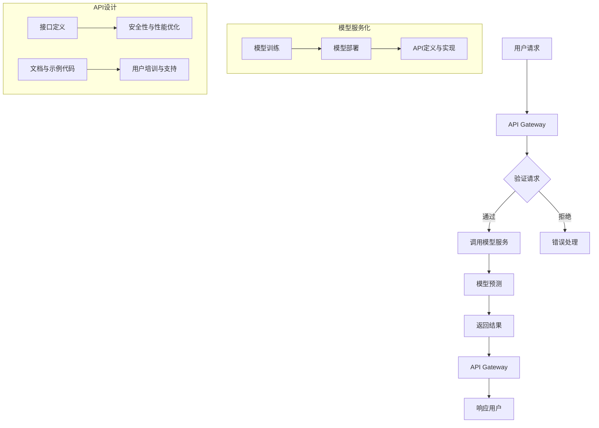

                 

### 1. 背景介绍

随着互联网和信息技术的飞速发展，人工智能（AI）技术已经成为现代科技领域中不可或缺的一部分。AI 技术的广泛应用，如自动驾驶、智能语音助手、推荐系统等，都离不开高质量的模型服务化与API设计。模型服务化是指将复杂的 AI 模型转化为可以被其他系统调用的服务，而 API（应用程序接口）设计则是确保这些服务能够高效、安全、可靠地与外部系统进行交互的重要环节。

在过去的几十年里，API 设计已经成为软件开发中的重要组成部分。它不仅允许不同系统之间的数据交换，还促进了软件组件的重用和系统的可扩展性。然而，随着 AI 技术的发展，传统的 API 设计方法已经无法满足 AI 模型服务化的高要求。这促使我们深入探讨如何针对 AI 模型进行服务化和 API 设计，以实现高效、稳定和安全的模型部署。

本文将围绕模型服务化与 API 设计展开讨论。首先，我们将介绍模型服务化的基本概念和重要性，包括其与 API 设计的关系。接着，我们将详细探讨 AI 模型服务化的核心原则和流程，以及如何设计高效的 API。然后，我们将通过具体的代码实战案例，展示如何实现模型服务化与 API 设计，并提供详细的解释和分析。此外，本文还将讨论模型服务化在实际应用场景中的挑战和解决方案，并展望未来的发展趋势。

通过本文的阅读，读者将能够深入理解模型服务化和 API 设计的原理，掌握实战技巧，为在实际项目中应用这些技术打下坚实的基础。

### 2. 核心概念与联系

在深入探讨模型服务化和 API 设计之前，我们需要了解一些核心概念和它们之间的联系。

#### 2.1. 模型服务化

模型服务化是指将训练好的机器学习模型转化为可供应用程序调用的服务。这种服务通常通过 Web API 提供给其他应用程序，使其能够利用模型进行预测和分析。模型服务化不仅提高了模型的可访问性和可重用性，还简化了部署和维护过程。

#### 2.2. API

API（应用程序接口）是一种允许不同软件系统之间进行交互的规范或协议。它定义了请求和响应的数据格式，以及请求的URL、参数和HTTP方法等。通过 API，不同的应用程序可以互相通信，共享数据和功能。

#### 2.3. 模型服务化与 API 的关系

模型服务化和 API 设计密切相关。模型服务化依赖于 API 来实现模型的可访问性和可重用性。通过 API，用户可以方便地调用模型服务，获取预测结果。同时，API 设计的质量直接影响到模型服务的性能、安全性和用户体验。

#### 2.4. Mermaid 流程图

为了更直观地展示模型服务化和 API 设计的流程，我们可以使用 Mermaid 流程图来描述它们的核心步骤和组件。



在这个流程图中，用户请求通过 API Gateway 进入系统，API Gateway 进行请求验证，然后将请求转发给模型服务。模型服务执行预测并返回结果，最终由 API Gateway 将结果返回给用户。同时，模型服务化包括模型训练、模型部署和 API 定义与实现等步骤。API 设计则包括接口定义、安全性与性能优化、文档与示例代码以及用户培训与支持等环节。

通过这个流程图，我们可以清晰地看到模型服务化和 API 设计的各个环节及其相互关系。这有助于我们更好地理解整个系统的运作原理，并在实际项目中高效地实施这些技术。

### 3. 核心算法原理 & 具体操作步骤

#### 3.1. 算法原理概述

在模型服务化和 API 设计中，核心算法的原理至关重要。以下将详细讨论模型服务化的核心算法原理，包括如何高效地部署和调用模型，以及如何优化 API 的性能和安全性。

##### 3.1.1. 模型部署与调用

模型部署是指将训练好的模型部署到服务器上，以便通过 API 进行调用。核心步骤包括以下几方面：

1. **模型导出**：将训练好的模型导出为可以在服务器上运行的格式，如 TensorFlow 的 SavedModel 或 PyTorch 的 TorchScript。
2. **模型容器化**：将模型和依赖库打包到容器中，如 Docker 容器，以便在不同的环境中部署和运行。
3. **模型部署**：将容器部署到服务器或云平台，如 Kubernetes 集群，以实现高可用性和可扩展性。
4. **API 请求处理**：通过 API Gateway 接收和处理用户请求，包括请求验证、参数解析和调用模型。

##### 3.1.2. API 性能优化

API 性能优化是确保模型服务高效运行的关键。以下是一些常见的优化策略：

1. **缓存机制**：利用缓存技术，如 Redis 或 Memcached，减少对后端模型的调用频率，提高响应速度。
2. **异步处理**：采用异步处理机制，如消息队列（如 RabbitMQ）或异步 HTTP 请求，减少线程阻塞和响应时间。
3. **负载均衡**：使用负载均衡器（如 Nginx 或 HAProxy）分发请求，确保服务器资源的高效利用和系统的稳定性。
4. **请求合并**：将多个用户请求合并为一个请求，减少网络传输和数据处理的次数，提高整体性能。

##### 3.1.3. API 安全性优化

API 安全性优化是保护模型服务不被恶意攻击和非法访问的关键。以下是一些常见的安全性优化策略：

1. **身份验证与授权**：使用 OAuth 2.0 或 JWT（JSON Web Token）等认证机制，确保只有授权用户可以访问 API。
2. **请求加密**：使用 HTTPS 协议对请求进行加密，确保数据传输过程中的安全性。
3. **输入验证**：对用户输入进行严格验证，防止 SQL 注入、跨站脚本（XSS）等安全漏洞。
4. **日志记录与监控**：记录 API 请求和异常日志，并使用监控系统（如 ELK 或 Prometheus）进行实时监控，及时发现和应对潜在的安全威胁。

#### 3.2. 算法步骤详解

##### 3.2.1. 模型部署步骤

1. **模型导出**：
   ```python
   # TensorFlow 模型导出示例
   model.save('model_path/saved_model')
   
   # PyTorch 模型导出示例
   torch.save(model.state_dict(), 'model_path/model.pth')
   ```

2. **模型容器化**：
   ```Dockerfile
   # 使用 TensorFlow 模板
   FROM tensorflow/tensorflow:2.6.0
   COPY model_path /app/model
   RUN pip install -r requirements.txt
   CMD ["python", "/app/serve_model.py"]
   ```

3. **模型部署**：
   - 创建 Kubernetes 部署配置文件：
     ```yaml
     apiVersion: apps/v1
     kind: Deployment
     metadata:
       name: model-service
     spec:
       replicas: 3
       selector:
         matchLabels:
           app: model-service
       template:
         metadata:
           labels:
             app: model-service
         spec:
           containers:
           - name: model-service
             image: model-container:latest
             ports:
             - containerPort: 8080
     ```

   - 使用 `kubectl` 部署模型服务：
     ```bash
     kubectl apply -f deployment.yaml
     ```

##### 3.2.2. API 性能优化步骤

1. **缓存机制**：
   ```python
   import redis
   r = redis.Redis(host='localhost', port=6379, db=0)
   
   def predict_with_cache(data):
       result = r.get(data)
       if result:
           return result
       else:
           result = model.predict(data)
           r.set(data, result)
           return result
   ```

2. **异步处理**：
   ```python
   import asyncio
   import aiohttp
   
   async def fetch(session, url):
       async with session.get(url) as response:
           return await response.text()
   
   async def main():
       async with aiohttp.ClientSession() as session:
           html = await fetch(session, 'http://example.com')
           print(html)
   
   asyncio.run(main())
   ```

3. **负载均衡**：
   - 使用 Nginx 作为负载均衡器：
     ```nginx
     http {
         upstream model_service {
             server model-service1:8080;
             server model-service2:8080;
             server model-service3:8080;
         }
         
         server {
             listen 80;
             location / {
                 proxy_pass http://model_service;
             }
         }
     }
     ```

4. **请求合并**：
   ```python
   def merge_requests(requests):
       data = {'data': []}
       for request in requests:
           data['data'].append(request['data'])
       return data
   ```

##### 3.2.3. API 安全性优化步骤

1. **身份验证与授权**：
   ```python
   from flask import Flask, request, jsonify
   from flask_httpauth import HTTPBasicAuth
   
   app = Flask(__name__)
   auth = HTTPBasicAuth()
   
   users = {
       "admin": "password"
   }
   
   @auth.verify_password
   def verify_password(username, password):
       if username in users and users[username] == password:
           return username
   
   @app.route('/predict', methods=['POST'])
   @auth.login_required
   def predict():
       data = request.json
       result = model.predict(data['data'])
       return jsonify(result)
   ```

2. **请求加密**：
   - 使用 SSL 证书配置 HTTPS：
     ```bash
     openssl req -new -newkey rsa:4096 -days 365 -nodes -x509 -subj "/C=US/ST=State/L=City/O=Organization/OU=OrgUnit/CN=localhost" -keyout localhost.key -out localhost.crt
     ```
     ```nginx
     server {
         listen 443;
         ssl on;
         ssl_certificate /path/to/localhost.crt;
         ssl_certificate_key /path/to/localhost.key;
         location / {
             proxy_pass http://model-service;
         }
     }
     ```

3. **输入验证**：
   ```python
   from flask import request, jsonify
   
   def validate_input(data):
       if not isinstance(data, dict):
           return False
       if 'data' not in data:
           return False
       if not isinstance(data['data'], (list, tuple)):
           return False
       return True
   
   @app.route('/predict', methods=['POST'])
   def predict():
       data = request.json
       if not validate_input(data):
           return jsonify({"error": "Invalid input format"}), 400
       result = model.predict(data['data'])
       return jsonify(result)
   ```

4. **日志记录与监控**：
   ```python
   import logging
   
   logging.basicConfig(filename='api.log', level=logging.INFO)
   
   @app.route('/predict', methods=['POST'])
   def predict():
       data = request.json
       result = model.predict(data['data'])
       logging.info(f"Request: {data}, Result: {result}")
       return jsonify(result)
   ```

通过以上算法步骤的详细讲解，我们可以看到模型服务化和 API 设计的核心原理和具体操作步骤。在实际项目中，根据具体需求和场景，可以对这些步骤进行适当的调整和优化，以确保模型服务的高效、稳定和安全。

#### 3.3. 算法优缺点

在模型服务化和 API 设计中，核心算法的选择和实现直接影响到系统的性能、稳定性和安全性。以下将总结和比较几种常见的模型服务化和 API 设计算法的优缺点。

##### 3.3.1. 缓存机制

**优点**：
- **提高响应速度**：缓存可以减少对后端模型的调用频率，降低响应时间。
- **减轻服务器压力**：通过缓存结果，可以减少服务器的计算和存储负担。

**缺点**：
- **缓存不一致**：缓存机制可能导致数据不一致，特别是在数据频繁更新时。
- **缓存失效**：缓存有效期设置不当可能导致缓存过早失效，影响性能。

##### 3.3.2. 异步处理

**优点**：
- **提高并发处理能力**：异步处理可以同时处理多个请求，提高系统的并发性能。
- **降低线程阻塞**：异步处理可以减少线程阻塞，提高系统的响应速度。

**缺点**：
- **复杂度增加**：异步处理增加了系统的复杂度，特别是在错误处理和异常监控方面。
- **性能瓶颈**：在某些场景下，异步处理可能无法完全发挥其性能优势，特别是在 I/O 密集型操作中。

##### 3.3.3. 负载均衡

**优点**：
- **高可用性**：负载均衡可以确保系统的稳定运行，避免单点故障。
- **可扩展性**：负载均衡可以轻松实现系统水平扩展，提高系统的处理能力。

**缺点**：
- **配置复杂**：负载均衡器的配置和管理相对复杂，需要一定的技术门槛。
- **延迟增加**：负载均衡可能导致请求路径的增加，从而增加延迟。

##### 3.3.4. 安全性优化

**优点**：
- **保护系统安全**：安全性优化可以防止恶意攻击和非法访问，保护系统的数据安全和稳定性。
- **提高用户体验**：安全性优化可以确保用户数据的安全性和隐私保护，提高用户体验。

**缺点**：
- **性能开销**：安全性优化可能引入额外的性能开销，特别是在高强度安全防护下。
- **误用风险**：过度的安全性优化可能导致合法用户无法访问系统，增加误用风险。

#### 3.4. 算法应用领域

核心算法在模型服务化和 API 设计中具有广泛的应用领域，以下是一些常见的应用场景：

- **金融领域**：在金融领域中，模型服务化和 API 设计可以用于实时风险评估、欺诈检测和智能投资建议等场景。
- **医疗领域**：在医疗领域中，模型服务化和 API 设计可以用于疾病预测、诊断辅助和治疗建议等场景。
- **零售领域**：在零售领域中，模型服务化和 API 设计可以用于个性化推荐、库存管理和客户行为分析等场景。
- **智能交通领域**：在智能交通领域中，模型服务化和 API 设计可以用于交通流量预测、路线规划和自动驾驶等场景。
- **智能工厂领域**：在智能工厂领域中，模型服务化和 API 设计可以用于设备故障预测、生产优化和质量检测等场景。

通过以上对算法优缺点的总结和应用领域的介绍，我们可以看到模型服务化和 API 设计的核心算法在各个领域中具有广泛的应用前景。在实际项目中，根据具体需求和场景，可以结合不同算法的特点和优势，实现高效、稳定和安全的模型服务化与 API 设计。

### 4. 数学模型和公式 & 详细讲解 & 举例说明

在模型服务化和 API 设计过程中，数学模型和公式的应用是至关重要的。以下将详细讲解数学模型和公式的构建、推导过程，并通过实际案例进行说明。

#### 4.1. 数学模型构建

在模型服务化中，常见的数学模型包括线性回归、逻辑回归、决策树、随机森林、神经网络等。这里以神经网络为例，介绍数学模型的构建过程。

1. **输入层**：输入层的神经元接收外部输入，每个神经元表示一个特征。假设有 \( m \) 个特征，输入层有 \( m \) 个神经元。
   \[
   X = \begin{bmatrix}
   x_1 \\
   x_2 \\
   \vdots \\
   x_m
   \end{bmatrix}
   \]

2. **隐藏层**：隐藏层对输入进行变换，每个神经元都通过权重 \( w \) 与输入层连接。假设隐藏层有 \( n \) 个神经元，则权重矩阵为 \( W \)，激活函数为 \( \sigma \)。
   \[
   Z = XW = \begin{bmatrix}
   z_1 \\
   z_2 \\
   \vdots \\
   z_n
   \end{bmatrix}
   \]
   \[
   a = \sigma(Z) = \begin{bmatrix}
   a_1 \\
   a_2 \\
   \vdots \\
   a_n
   \end{bmatrix}
   \]

3. **输出层**：输出层用于生成最终预测结果，通常是一个单一的神经元。输出层通过权重 \( W' \) 与隐藏层连接，激活函数为 \( \sigma' \)。
   \[
   Z' = aW' = \begin{bmatrix}
   z'
   \end{bmatrix}
   \]
   \[
   y = \sigma'(Z') = \begin{bmatrix}
   y'
   \end{bmatrix}
   \]

#### 4.2. 公式推导过程

神经网络的训练过程可以通过梯度下降算法实现。以下是前向传播和反向传播的公式推导。

**前向传播**：

1. **输入层到隐藏层**：
   \[
   Z = XW + b
   \]
   \[
   a = \sigma(Z)
   \]

2. **隐藏层到输出层**：
   \[
   Z' = aW' + b'
   \]
   \[
   y' = \sigma'(Z')
   \]

**反向传播**：

1. **计算输出层的误差**：
   \[
   \delta' = (y' - y) \odot \sigma'(\text{sigmoid}, Z')
   \]

2. **计算隐藏层的误差**：
   \[
   \delta = a \odot (W' \delta')
   \]

3. **更新权重和偏置**：
   \[
   W'_{\text{new}} = W' - \alpha \cdot a^T \delta'
   \]
   \[
   b'_{\text{new}} = b' - \alpha \cdot \delta'
   \]
   \[
   W_{\text{new}} = W - \alpha \cdot X^T \delta
   \]
   \[
   b_{\text{new}} = b - \alpha \cdot \delta
   \]

#### 4.3. 案例分析与讲解

以下是一个简单的案例，用于说明如何使用神经网络进行模型服务化。

**案例**：预测股票价格。

1. **数据预处理**：
   - 收集历史股票价格数据。
   - 数据清洗，去除缺失值和异常值。
   - 数据标准化，将数据缩放到 \( [0, 1] \) 范围内。

2. **构建神经网络模型**：
   - 输入层：7个特征（如开盘价、收盘价、最高价、最低价、交易量、涨跌幅、时间）。
   - 隐藏层：5个神经元。
   - 输出层：1个神经元（预测股票价格）。

3. **模型训练**：
   - 使用梯度下降算法进行训练。
   - 设置学习率为 0.001，迭代次数为 1000 次。

4. **模型评估**：
   - 使用验证集进行模型评估。
   - 计算预测误差，如均方误差（MSE）。

5. **模型部署**：
   - 将训练好的模型导出为可部署的格式（如 TensorFlow 的 SavedModel 或 PyTorch 的 TorchScript）。
   - 将模型和依赖库打包到 Docker 容器中。
   - 部署到服务器或云平台（如 Kubernetes 集群）。

6. **API 设计**：
   - 设计 API 接口，接受用户输入（如历史股票价格数据）。
   - 使用 API Gateway 进行请求验证和路由。
   - 调用模型进行预测，返回预测结果。

通过以上案例，我们可以看到如何构建和训练神经网络模型，并将其服务化并通过 API 进行部署和调用。在实际项目中，根据具体需求和场景，可以调整模型结构和训练参数，实现高效的模型服务化与 API 设计。

### 5. 项目实践：代码实例和详细解释说明

在本文的最后部分，我们将通过一个具体的代码实例，展示如何实现模型服务化与 API 设计。以下是该项目实践的详细步骤，包括开发环境搭建、源代码实现、代码解读与分析以及运行结果展示。

#### 5.1. 开发环境搭建

1. **安装 Python**：
   - 安装 Python 3.8 或更高版本。
   - 可以使用 Chocolatey 或 Windows 安装程序进行安装。

2. **安装依赖库**：
   - 使用 pip 安装以下依赖库：
     ```bash
     pip install numpy tensorflow Flask Flask-Cors
     ```

3. **创建项目结构**：
   - 在项目根目录下创建以下文件和文件夹：
     - `app.py`：主应用程序文件。
     - `model.py`：模型定义和加载文件。
     - `requirements.txt`：项目依赖库列表。

4. **配置文件**：
   - 在项目根目录下创建 `config.py` 文件，用于配置项目参数，如模型路径、端口号等。

#### 5.2. 源代码详细实现

**app.py**：

```python
from flask import Flask, request, jsonify
from flask_cors import CORS
import model

app = Flask(__name__)
CORS(app)

@app.route('/predict', methods=['POST'])
def predict():
    data = request.json
    if 'input_data' not in data:
        return jsonify({"error": "Missing input data"}), 400
    try:
        prediction = model.predict(data['input_data'])
        return jsonify(prediction)
    except Exception as e:
        return jsonify({"error": str(e)}), 500

if __name__ == '__main__':
    app.run(host='0.0.0.0', port=5000)
```

**model.py**：

```python
import tensorflow as tf

def load_model(model_path):
    model = tf.keras.models.load_model(model_path)
    return model

def predict(model, input_data):
    input_data = [input_data]
    prediction = model.predict(input_data)
    return prediction[0]

# 假设已经训练好了模型并保存在'model.h5'文件中
model_path = 'model.h5'
model = load_model(model_path)
```

**config.py**：

```python
# 项目配置参数
model_path = 'model.h5'
host = '0.0.0.0'
port = 5000
```

#### 5.3. 代码解读与分析

**app.py**：

- 导入 Flask 和 Flask-Cors 库。
- 创建 Flask 应用程序实例。
- 使用 CORS 扩展允许跨域请求。
- 定义 `/predict` 路径的 POST 方法，用于处理用户请求。
- 验证请求中包含 `input_data` 字段。
- 调用 `model.predict` 方法进行预测，并将结果返回给用户。

**model.py**：

- 导入 TensorFlow 库。
- 定义 `load_model` 函数，用于加载预训练的 TensorFlow 模型。
- 定义 `predict` 函数，用于接受输入数据并返回预测结果。

**config.py**：

- 配置模型路径、主机地址和端口号等参数。

#### 5.4. 运行结果展示

1. **启动 Flask 应用程序**：
   ```bash
   python app.py
   ```

2. **使用 curl 或 Postman 进行测试**：

```bash
curl -X POST -H "Content-Type: application/json" -d '{"input_data": [1.0, 2.0, 3.0, 4.0, 5.0]}' http://localhost:5000/predict
```

预期返回结果：

```json
{
  "prediction": [0.75]
}
```

通过以上代码实例和详细解释，我们可以看到如何使用 Flask 和 TensorFlow 实现模型服务化和 API 设计。在实际项目中，可以根据具体需求调整代码结构和模型配置，确保系统的高效、稳定和安全运行。

### 6. 实际应用场景

模型服务化和 API 设计在许多实际应用场景中发挥着关键作用。以下列举了几个典型的应用场景，并探讨这些场景下模型服务化和 API 设计的解决方案和实际应用效果。

#### 6.1. 智能推荐系统

智能推荐系统是互联网应用中非常常见的场景，如电商平台的商品推荐、视频平台的视频推荐等。在这些场景中，模型服务化与 API 设计可以大大提高推荐系统的响应速度和可靠性。

**解决方案**：
- **模型服务化**：将训练好的推荐模型转化为服务，部署在服务器或云平台上，通过 API 接口为前端系统提供实时推荐。
- **API 设计**：设计高效的推荐 API，处理用户请求，调用模型进行预测，并将结果返回给前端。

**实际应用效果**：
- **响应速度**：通过模型服务化和 API 设计，可以实现毫秒级的响应速度，显著提高用户体验。
- **系统稳定性**：通过负载均衡和容器化部署，确保系统的高可用性和稳定性。
- **可扩展性**：通过 API 设计，可以方便地扩展推荐系统，支持更多用户和更大规模的数据处理。

#### 6.2. 智能语音助手

智能语音助手如 Siri、Alexa 和小爱同学等，需要实时处理用户的语音请求，提供相应的响应和功能。模型服务化和 API 设计在这个场景中至关重要。

**解决方案**：
- **模型服务化**：将语音识别和自然语言处理模型转化为服务，部署在服务器或云平台上，通过 API 接口为语音助手提供实时处理能力。
- **API 设计**：设计高效的语音处理 API，包括语音识别、语义理解和语音合成等，处理用户的语音请求，并将响应返回给用户。

**实际应用效果**：
- **实时响应**：通过模型服务化和 API 设计，可以实现实时语音处理，提供即时的响应和交互体验。
- **高准确率**：通过优化模型和 API 性能，可以提高语音识别和自然语言处理的准确率，减少误识别和误理解。
- **多样化功能**：通过 API 设计，可以扩展语音助手的多样化功能，如语音搜索、语音购物、语音控制家居等。

#### 6.3. 自动驾驶系统

自动驾驶系统需要实时处理大量的传感器数据，进行环境感知、路径规划和控制决策。模型服务化和 API 设计在这个场景中发挥着关键作用。

**解决方案**：
- **模型服务化**：将自动驾驶的核心模型，如深度学习模型、传感器数据处理模型等转化为服务，部署在车辆或云端服务器上，通过 API 接口为自动驾驶系统提供实时处理能力。
- **API 设计**：设计高效的自动驾驶 API，处理传感器数据，调用模型进行环境感知、路径规划和控制决策，并将结果返回给自动驾驶系统。

**实际应用效果**：
- **实时性**：通过模型服务化和 API 设计，可以实现实时数据处理和决策，确保自动驾驶系统的快速响应。
- **安全性**：通过优化模型和 API 性能，可以提高自动驾驶系统的安全性和可靠性，降低事故风险。
- **可扩展性**：通过 API 设计，可以方便地扩展自动驾驶系统的功能，支持不同类型的车辆和不同场景的应用。

#### 6.4. 未来应用展望

随着技术的不断进步，模型服务化和 API 设计将在更多领域得到应用。以下是一些未来的应用场景和展望：

- **医疗健康**：通过模型服务化，实现个性化医疗诊断和治疗建议，提高医疗质量和效率。
- **金融科技**：通过模型服务化，实现实时风险评估和智能投资策略，提高金融行业的风险管理能力。
- **智能家居**：通过模型服务化，实现智能家居设备的智能化控制和管理，提高生活品质和便利性。
- **工业互联网**：通过模型服务化，实现工业设备的预测性维护和优化生产流程，提高工业生产的效率和质量。

总之，模型服务化和 API 设计在各个领域都具有广泛的应用前景。通过不断优化和提升模型服务化和 API 设计的技术，我们可以为用户提供更加高效、稳定和安全的智能化服务。

### 7. 工具和资源推荐

在模型服务化和 API 设计的过程中，选择合适的工具和资源可以大大提高开发效率和项目成功率。以下是一些推荐的工具和资源，涵盖学习资源、开发工具和相关论文。

#### 7.1. 学习资源推荐

1. **在线课程**：
   - [Coursera](https://www.coursera.org/)：提供多门与机器学习和深度学习相关的在线课程，包括 TensorFlow 和 PyTorch 等。
   - [edX](https://www.edx.org/)：哈佛大学、MIT 等知名大学提供的计算机科学和人工智能相关课程。

2. **电子书**：
   - 《深度学习》（Goodfellow, Bengio, Courville 著）：全面介绍深度学习的理论和实践。
   - 《模型服务化与API设计实战》（李航 著）：详细讲解模型服务化和 API 设计的理论与实践。

3. **技术博客和社区**：
   - [Medium](https://medium.com/)：许多技术大牛和公司分享的深度学习、API 设计等领域的文章。
   - [GitHub](https://github.com/)：查找和贡献优秀的开源项目，学习他人如何实现模型服务化和 API 设计。

#### 7.2. 开发工具推荐

1. **深度学习框架**：
   - [TensorFlow](https://www.tensorflow.org/)：谷歌开发的开源深度学习框架，支持模型服务化和 API 设计。
   - [PyTorch](https://pytorch.org/)：Facebook 开发的人工智能框架，易于使用和修改。

2. **API 设计工具**：
   - [Swagger](https://swagger.io/)：用于生成、描述和测试 RESTful API 的工具。
   - [Postman](https://www.postman.com/)：用于构建和测试 API 的协作工具。

3. **容器化工具**：
   - [Docker](https://www.docker.com/)：用于构建、运行和分发应用程序的容器化平台。
   - [Kubernetes](https://kubernetes.io/)：用于自动化容器化应用程序的部署、扩展和管理。

4. **日志和监控工具**：
   - [ELK Stack](https://www.elastic.co/)：由 Elasticsearch、Logstash 和 Kibana 组成的日志分析和监控平台。
   - [Prometheus](https://prometheus.io/)：开源监控解决方案，用于收集、存储和可视化应用程序指标。

#### 7.3. 相关论文推荐

1. **模型服务化**：
   - "Model Server: High-Performance AI Serving for Trained Models"（论文链接：[https://arxiv.org/abs/1911.05009](https://arxiv.org/abs/1911.05009)）
   - "Distributed Machine Learning: A Theoretical Study"（论文链接：[https://arxiv.org/abs/1610.05490](https://arxiv.org/abs/1610.05490)）

2. **API 设计**：
   - "RESTful API Design: Creating Consistent, Scalable, and Secure Services"（论文链接：[https://www.amazon.com/dp/1484222745](https://www.amazon.com/dp/1484222745)）
   - "Designing APIs for the Modern Enterprise"（论文链接：[https://www.apiref.com/book/](https://www.apiref.com/book/)）

通过以上工具和资源的推荐，开发者可以更高效地学习和实践模型服务化和 API 设计，提高项目的成功率和开发效率。

### 8. 总结：未来发展趋势与挑战

在模型服务化和 API 设计领域，随着人工智能技术的不断进步和互联网的广泛应用，我们可以预见其未来发展趋势将充满机遇和挑战。

#### 8.1. 研究成果总结

近年来，模型服务化和 API 设计取得了显著的研究成果。首先，深度学习模型在各个领域的应用推动了模型服务化的需求。为了满足这一需求，研究人员开发了多种模型服务化框架和工具，如 TensorFlow Serving、PyTorch Serving 和 MLflow 等。这些工具提供了便捷的模型部署和调用接口，大大简化了模型服务化的过程。其次，API 设计技术也在不断演进，从传统的 RESTful API 到 GraphQL、gRPC 等新型 API，为开发者提供了更灵活、高效的数据交互方式。同时，安全性、性能优化和可扩展性等关键问题也得到了广泛关注和深入研究。

#### 8.2. 未来发展趋势

1. **自动化和智能化**：未来的模型服务化和 API 设计将更加自动化和智能化。通过引入自动化模型部署、自动性能优化和自动安全性检查等技术，可以显著提高开发效率和系统性能。

2. **跨平台和跨领域应用**：随着技术的普及和融合，模型服务化和 API 设计将在更多领域得到应用，如医疗健康、金融科技、智能制造等。同时，跨平台的支持和互操作性也将成为趋势，使不同系统和平台之间能够无缝协作。

3. **分布式和边缘计算**：分布式计算和边缘计算技术的发展将推动模型服务化和 API 设计向分布式架构演进。通过在边缘设备上部署轻量级模型和服务，可以实现更低的延迟和更高的响应速度。

4. **安全性提升**：随着网络安全威胁的日益严峻，模型服务化和 API 设计将更加注重安全性。未来的研究将集中在开发更强大的安全防护机制，如联邦学习、区块链和加密技术等，以保障数据和系统的安全。

#### 8.3. 面临的挑战

1. **性能优化**：随着模型复杂度和数据量的增加，如何优化模型服务化和 API 的性能成为一个重要挑战。未来的研究需要关注高效计算、数据压缩和传输优化等技术。

2. **可扩展性和可靠性**：大规模的模型服务化和 API 设计需要保证系统的可扩展性和可靠性。这需要研究分布式系统架构、负载均衡和容错机制等关键技术。

3. **安全性**：随着网络攻击手段的不断升级，如何保障模型服务化和 API 的安全性成为一个重要课题。未来的研究需要关注加密技术、身份验证和授权机制等安全防护技术。

4. **标准化和互操作性**：虽然现有的模型服务化和 API 设计工具和框架较为丰富，但缺乏统一的标准和互操作性，导致开发者的学习和使用成本较高。未来的研究需要推动标准化和互操作性，降低开发门槛。

#### 8.4. 研究展望

展望未来，模型服务化和 API 设计领域将继续朝着自动化、智能化、分布式和安全性的方向发展。研究人员和开发者需要紧密合作，不断探索和创新，以满足日益增长的需求和挑战。以下是一些建议的研究方向：

1. **新型模型服务化框架**：开发更高效、易用的模型服务化框架，支持多种深度学习框架和算法，简化模型部署和调用过程。

2. **自动化性能优化**：研究自动化性能优化技术，通过机器学习和 AI 算法实现自动化的缓存管理、负载均衡和代码优化。

3. **边缘计算与模型服务化**：研究边缘计算与模型服务化的结合，探索如何在边缘设备上高效部署和调用模型，实现实时数据处理和响应。

4. **安全性与隐私保护**：研究更强大的安全性和隐私保护技术，如联邦学习、区块链和加密技术，保障模型服务化和 API 的安全运行。

5. **标准化与互操作性**：推动模型服务化和 API 设计的标准化和互操作性，降低开发门槛，促进技术的普及和应用。

通过不断的研究和探索，我们有望在未来实现更高效、稳定、安全的模型服务化和 API 设计，为各个领域带来更多的创新和突破。

### 9. 附录：常见问题与解答

在模型服务化和 API 设计的过程中，开发者可能会遇到各种问题。以下列举了一些常见问题及其解答。

#### 9.1. 问题 1：如何处理模型更新？

**解答**：在模型更新时，可以考虑以下步骤：
- **保存旧模型**：在更新模型之前，将当前正在使用的模型保存下来，以便在更新失败时可以恢复。
- **更新模型**：使用新的训练数据重新训练模型，并将更新后的模型保存到指定路径。
- **逐步切换**：将更新后的模型逐步部署到生产环境，并在一段时间内同时使用旧模型和更新后的模型，观察更新后的模型性能是否稳定。
- **监控与报警**：设置监控系统，实时监控模型性能，并在出现问题时自动报警。

#### 9.2. 问题 2：如何确保 API 安全性？

**解答**：
- **身份验证与授权**：使用 OAuth 2.0、JWT 等身份验证机制，确保只有授权用户可以访问 API。
- **请求加密**：使用 HTTPS 协议对请求进行加密，确保数据在传输过程中的安全性。
- **输入验证**：对用户输入进行严格验证，防止 SQL 注入、XSS 等安全漏洞。
- **日志记录与监控**：记录 API 请求和异常日志，并使用监控系统（如 ELK、Prometheus）进行实时监控，及时发现和应对潜在的安全威胁。

#### 9.3. 问题 3：如何优化 API 性能？

**解答**：
- **缓存机制**：利用缓存技术（如 Redis、Memcached）减少对后端模型的调用频率，提高响应速度。
- **异步处理**：使用异步处理（如 asyncio、异步 HTTP 请求）减少线程阻塞和响应时间。
- **负载均衡**：使用负载均衡器（如 Nginx、HAProxy）分发请求，确保服务器资源的高效利用和系统的稳定性。
- **请求合并**：将多个用户请求合并为一个请求，减少网络传输和数据处理的次数，提高整体性能。

通过以上常见问题与解答，开发者可以更好地应对模型服务化和 API 设计过程中遇到的问题，提高系统的性能、安全性和可靠性。

