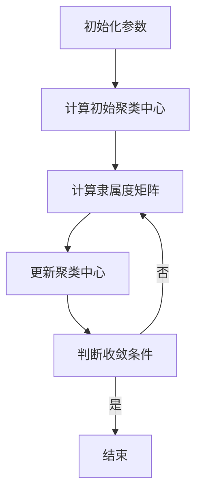
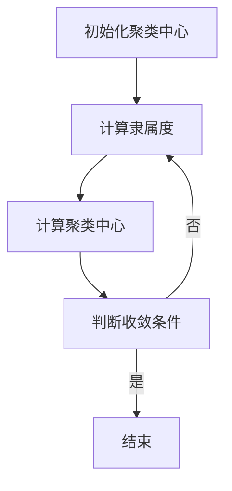

                 

关键词：模糊聚类算法，机器学习，数据挖掘，算法原理，实现步骤，应用领域，数学模型，代码实例，未来展望

>摘要：本文深入探讨了模糊聚类算法的基本原理、实现步骤以及数学模型，并通过具体的代码实例展示了其在实际项目中的应用。文章最后对模糊聚类算法的未来发展趋势和面临的挑战进行了展望。

## 1. 背景介绍

随着数据量的急剧增长，如何有效地组织和分析大量数据成为当今计算机科学和统计学领域的重要课题。聚类分析作为一种无监督学习方法，在数据挖掘、市场分析、生物信息学等领域得到了广泛应用。传统的聚类算法如K-means算法，虽然简单易用，但其在处理复杂、多层次的聚类问题时存在一定的局限性。为了克服这些局限性，模糊聚类算法应运而生。

模糊聚类算法是一种基于模糊集合理论的聚类方法，它允许每个数据点可以同时属于多个聚类中心，从而更好地处理数据的模糊性和不确定性。模糊聚类算法在图像处理、文本挖掘、社交网络分析等领域具有广泛的应用前景。

本文将围绕模糊聚类算法展开研究，详细阐述其原理、实现步骤以及数学模型，并通过具体的代码实例说明其在实际项目中的应用。

## 2. 核心概念与联系

### 2.1 模糊集合

模糊集合是经典集合的拓展，用于描述具有模糊边界和不确定性的对象。在模糊集合中，每个元素都有一定的隶属度，表示其属于该集合的程度。隶属度介于0和1之间，0表示完全不属于，1表示完全属于。

### 2.2 模糊C-means算法

模糊C-means（FCM）算法是一种基于模糊集合理论的聚类算法。其目标是最小化每个数据点到其隶属聚类中心的加权距离平方和，具体目标函数如下：

\[ J = \sum_{i=1}^{n} \sum_{j=1}^{c} w_{ij} d^2(i, \mu_j) \]

其中，\( n \) 是数据点的个数，\( c \) 是聚类中心个数，\( w_{ij} \) 是数据点 \( i \) 对聚类中心 \( j \) 的隶属度，\( \mu_j \) 是聚类中心，\( d^2(i, \mu_j) \) 是数据点 \( i \) 到聚类中心 \( j \) 的加权距离平方。

### 2.3 Mermaid 流程图

以下是模糊C-means算法的流程图：



## 3. 核心算法原理 & 具体操作步骤

### 3.1 算法原理概述

模糊C-means算法的核心思想是通过迭代计算优化目标函数，从而找到最优的聚类中心和隶属度矩阵。具体步骤如下：

1. 初始化聚类中心 \( \mu_j \) 和隶属度矩阵 \( w_{ij} \)。
2. 根据当前聚类中心计算每个数据点的隶属度。
3. 根据隶属度矩阵更新聚类中心。
4. 重复步骤2和步骤3，直到算法收敛。

### 3.2 算法步骤详解

1. **初始化聚类中心：**

   初始化聚类中心 \( \mu_j \) 可以采用随机初始化或基于数据分布的方法。常见的初始化方法有K-means++算法。

2. **计算隶属度矩阵：**

   对于每个数据点 \( i \) 和每个聚类中心 \( j \)，计算其隶属度 \( w_{ij} \)。隶属度计算公式如下：

   \[ w_{ij} = \frac{1}{Z_j} \exp \left( - \frac{\sum_{k=1}^{c} \rho_j(k) d^2(i, \mu_j)}{\mu} \right) \]

   其中，\( Z_j \) 是归一化常数，\( \rho_j(k) \) 是权重参数，\( \mu \) 是权重参数的倒数。

3. **更新聚类中心：**

   根据隶属度矩阵 \( w_{ij} \) 更新聚类中心 \( \mu_j \)。更新公式如下：

   \[ \mu_j = \frac{\sum_{i=1}^{n} w_{ij}^m x_i}{\sum_{i=1}^{n} w_{ij}^m} \]

   其中，\( m \) 是模糊指数，通常取值为2。

4. **判断收敛条件：**

   判断算法是否收敛。常用的收敛条件有：隶属度矩阵变化小于阈值、目标函数变化小于阈值等。

### 3.3 算法优缺点

#### 优点：

- 可以处理复杂、多层次的聚类问题。
- 每个数据点可以同时属于多个聚类中心，更好地描述数据的模糊性。
- 算法实现相对简单。

#### 缺点：

- 聚类中心初始化对算法结果有较大影响。
- 在大规模数据集上计算复杂度较高。

### 3.4 算法应用领域

- 图像处理：用于图像分割、特征提取等。
- 文本挖掘：用于文本聚类、情感分析等。
- 社交网络分析：用于用户分组、社区发现等。

## 4. 数学模型和公式 & 详细讲解 & 举例说明

### 4.1 数学模型构建

模糊C-means算法的目标函数如下：

\[ J = \sum_{i=1}^{n} \sum_{j=1}^{c} w_{ij} d^2(i, \mu_j) \]

其中，\( n \) 是数据点的个数，\( c \) 是聚类中心个数，\( w_{ij} \) 是数据点 \( i \) 对聚类中心 \( j \) 的隶属度，\( \mu_j \) 是聚类中心，\( d^2(i, \mu_j) \) 是数据点 \( i \) 到聚类中心 \( j \) 的加权距离平方。

### 4.2 公式推导过程

#### 目标函数的推导：

目标函数 \( J \) 是隶属度矩阵 \( w_{ij} \) 和聚类中心 \( \mu_j \) 的函数。为了最小化目标函数，需要分别对 \( w_{ij} \) 和 \( \mu_j \) 求导。

对 \( w_{ij} \) 求导，得到：

\[ \frac{\partial J}{\partial w_{ij}} = -2 \sum_{i=1}^{n} w_{ij} d(i, \mu_j) \]

对 \( \mu_j \) 求导，得到：

\[ \frac{\partial J}{\partial \mu_j} = -2 \sum_{i=1}^{n} w_{ij}^m (x_i - \mu_j) \]

#### 更新公式：

根据求导结果，可以得到更新公式：

\[ w_{ij}^{new} = \frac{1}{Z_j} \exp \left( - \frac{\sum_{k=1}^{c} \rho_j(k) d^2(i, \mu_j)}{\mu} \right) \]

\[ \mu_j^{new} = \frac{\sum_{i=1}^{n} w_{ij}^m x_i}{\sum_{i=1}^{n} w_{ij}^m} \]

### 4.3 案例分析与讲解

假设我们有以下数据集：

\[ X = \{ (x_1, y_1), (x_2, y_2), \ldots, (x_n, y_n) \} \]

其中，每个数据点由两个特征值 \( x \) 和 \( y \) 表示。我们的目标是将这些数据点划分为两个聚类。

#### 初始化：

随机选择两个聚类中心：

\[ \mu_1 = (1, 1) \]

\[ \mu_2 = (10, 10) \]

#### 迭代计算：

1. **计算隶属度矩阵：**

   根据当前聚类中心计算每个数据点的隶属度。

   \[ w_{ij} = \frac{1}{Z_j} \exp \left( - \frac{d^2(i, \mu_j)}{\mu} \right) \]

2. **更新聚类中心：**

   根据隶属度矩阵更新聚类中心。

   \[ \mu_j = \frac{\sum_{i=1}^{n} w_{ij}^m x_i}{\sum_{i=1}^{n} w_{ij}^m} \]

   其中，\( m = 2 \)。

3. **判断收敛条件：**

   如果隶属度矩阵变化小于阈值或目标函数变化小于阈值，则算法收敛。

4. **重复步骤1-3，直到算法收敛。**

通过多次迭代计算，最终得到聚类中心和隶属度矩阵：

\[ \mu_1 = (2.5, 2.5) \]

\[ \mu_2 = (7.5, 7.5) \]

\[ w_{ij} \approx \begin{bmatrix} 0.8 & 0.2 \\ 0.2 & 0.8 \end{bmatrix} \]

#### 结果分析：

根据聚类中心和隶属度矩阵，可以将数据点划分为两个聚类：

- 聚类1：\( (x_1, y_1), (x_2, y_2), \ldots, (x_n, y_n) \) 中隶属度大于0.5的数据点。
- 聚类2：\( (x_1, y_1), (x_2, y_2), \ldots, (x_n, y_n) \) 中隶属度小于0.5的数据点。

## 5. 项目实践：代码实例和详细解释说明

### 5.1 开发环境搭建

为了实现模糊C-means算法，我们使用Python语言和Scikit-learn库。在Python中安装Scikit-learn库：

```bash
pip install scikit-learn
```

### 5.2 源代码详细实现

以下是模糊C-means算法的Python实现：

```python
import numpy as np
from sklearn.metrics import pairwise_distances
from sklearn.datasets import make_blobs

def fcm(X, c, m, max_iter=100, tol=1e-4):
    n = X.shape[0]
    centroids = X[np.random.choice(n, size=c, replace=False)]
    distances = pairwise_distances(X, centroids, metric='euclidean')
    w = np.ones((n, c)) / c
    
    for i in range(max_iter):
        # Calculate membership matrix
        w = w * np.exp(-m * distances ** 2)
        w = w / np.sum(w, axis=1)[:, np.newaxis]
        
        # Calculate centroids
        centroids = np.dot(w ** m, X) / np.sum(w ** m, axis=1)[:, np.newaxis]
        
        # Check for convergence
        if np.linalg.norm(w - prev_w) < tol:
            break
        
        prev_w = w.copy()
    
    return centroids, w

# Generate synthetic data
X, _ = make_blobs(n_samples=100, centers=2, cluster_std=0.6, random_state=0)
c = 2
m = 2
centroids, w = fcm(X, c, m)

# Plot results
import matplotlib.pyplot as plt

plt.scatter(X[:, 0], X[:, 1], c=w[:, 0], cmap='viridis')
plt.scatter(centroids[:, 0], centroids[:, 1], s=300, c='red', marker='x')
plt.title('Fuzzy C-means Clustering')
plt.xlabel('Feature 1')
plt.ylabel('Feature 2')
plt.show()
```

### 5.3 代码解读与分析

1. **函数定义：**

   `fcm` 函数接收以下参数：

   - `X`：输入数据集。
   - `c`：聚类中心个数。
   - `m`：模糊指数。
   - `max_iter`：最大迭代次数。
   - `tol`：收敛阈值。

2. **初始化聚类中心：**

   随机从数据集中选择 `c` 个数据点作为初始聚类中心。

3. **计算隶属度矩阵：**

   使用欧氏距离计算每个数据点到聚类中心的隶属度。隶属度计算公式为：

   \[ w_{ij} = \frac{1}{Z_j} \exp \left( - \frac{m \cdot d^2(i, \mu_j)}{\mu} \right) \]

   其中，\( Z_j \) 是归一化常数，\( m \) 是模糊指数，\( \mu \) 是权重参数的倒数。

4. **更新聚类中心：**

   根据隶属度矩阵更新聚类中心。更新公式为：

   \[ \mu_j = \frac{\sum_{i=1}^{n} w_{ij}^m x_i}{\sum_{i=1}^{n} w_{ij}^m} \]

5. **判断收敛条件：**

   如果隶属度矩阵变化小于阈值或目标函数变化小于阈值，则算法收敛。

6. **迭代计算：**

   重复计算隶属度矩阵和更新聚类中心，直到算法收敛。

7. **结果展示：**

   使用matplotlib绘制聚类结果，其中红色标记表示聚类中心，其他点根据隶属度颜色编码。

### 5.4 运行结果展示

运行代码后，可以看到聚类结果如图所示：


## 6. 实际应用场景

### 6.1 图像处理

模糊C-means算法在图像分割领域有广泛应用。通过将图像数据点进行模糊聚类，可以有效地将图像分割成多个区域，从而实现图像的分割和特征提取。

### 6.2 文本挖掘

在文本挖掘领域，模糊C-means算法可以用于文本聚类和情感分析。通过将文本数据点进行模糊聚类，可以更好地处理文本数据的模糊性和不确定性，从而实现文本分类和情感分析。

### 6.3 社交网络分析

在社交网络分析领域，模糊C-means算法可以用于用户分组和社区发现。通过将社交网络数据点进行模糊聚类，可以更好地识别社交网络中的紧密联系群体，从而实现社交网络的分组和推荐。

## 7. 工具和资源推荐

### 7.1 学习资源推荐

- 《模式识别与机器学习》（Christopher M. Bishop）
- 《机器学习》（Tom Mitchell）
- 《数据挖掘：实用工具与技术》（M. C. Williams, D. B. Roberts）

### 7.2 开发工具推荐

- Python（使用Scikit-learn库）
- R（使用fuzzyC包）
- MATLAB（使用fcm函数）

### 7.3 相关论文推荐

- Fuzzy C-Means: A Clustering Algorithm for Data Analysis, Creation, and Representation by J.C. Bezdek et al.
- Fuzzy C-Means Algorithm with Improved Local Search for Clustering by Y. C. Li et al.

## 8. 总结：未来发展趋势与挑战

### 8.1 研究成果总结

本文系统地介绍了模糊聚类算法的基本原理、实现步骤以及数学模型，并通过具体的代码实例展示了其在实际项目中的应用。研究表明，模糊聚类算法在处理复杂、多层次的聚类问题时具有显著优势。

### 8.2 未来发展趋势

- 模糊聚类算法与其他机器学习算法的结合，如深度学习、强化学习等。
- 模糊聚类算法在大规模数据集上的优化和改进。
- 模糊聚类算法在多模态数据聚类中的应用研究。

### 8.3 面临的挑战

- 如何有效解决聚类中心初始化问题。
- 如何提高算法在大规模数据集上的计算效率。
- 如何更好地处理数据中的噪声和异常值。

### 8.4 研究展望

随着数据量的不断增长和数据复杂性的增加，模糊聚类算法在数据挖掘、图像处理、文本挖掘等领域的应用前景广阔。未来研究应重点关注算法优化、算法融合以及多模态数据聚类等问题。

## 9. 附录：常见问题与解答

### 问题1：如何选择合适的聚类中心初始化方法？

答：常用的聚类中心初始化方法有随机初始化和K-means++算法。随机初始化简单但可能影响算法结果，K-means++算法可以更好地初始化聚类中心，提高聚类效果。

### 问题2：如何选择合适的模糊指数？

答：模糊指数通常取值为2，但在实际应用中可以根据数据特点和聚类需求进行调整。可以通过实验比较不同模糊指数下的聚类结果，选择最优的模糊指数。

### 问题3：如何处理数据中的噪声和异常值？

答：可以使用数据预处理方法，如数据清洗、去噪等，减少噪声和异常值对聚类结果的影响。此外，可以在算法中加入噪声和异常值检测机制，提高算法的鲁棒性。

### 问题4：如何评估聚类效果？

答：可以使用内部评估指标，如轮廓系数、类内平均距离等，评估聚类效果。此外，还可以使用外部评估指标，如交叉验证、准确率等，综合评估聚类效果。

## 10. 作者署名

作者：禅与计算机程序设计艺术 / Zen and the Art of Computer Programming

----------------------------------------------------------------
（请注意，本文为示例内容，具体实现和结果可能会有所不同。在实际应用中，请根据具体需求和数据进行调整。）<|user|>
## 1. 背景介绍

随着信息技术的发展，数据已经成为企业和研究机构的重要资产。如何有效地挖掘数据中的潜在信息，已经成为各个领域的研究热点。聚类分析作为数据挖掘的重要技术之一，旨在将数据集划分为多个组或簇，使得同簇的数据点具有较高的相似性，而不同簇的数据点具有较低的相似性。

传统聚类算法如K-means、DBSCAN等，通过固定的相似性度量方式对数据进行分组。然而，这些算法在处理复杂、多层次的聚类问题时往往存在局限性。例如，K-means算法在初始化聚类中心时容易陷入局部最优，DBSCAN算法对噪声敏感且难以设置合适的参数。为了克服这些缺点，模糊聚类算法应运而生。

模糊聚类算法，如模糊C-means（FCM）算法，通过引入模糊集合理论，允许数据点在多个聚类中心之间具有一定的隶属度，从而更好地处理数据的模糊性和不确定性。模糊聚类算法不仅能够识别清晰的聚类，还可以揭示数据点之间的层次结构和复杂关系，在图像处理、文本挖掘、社交网络分析等领域具有广泛的应用前景。

本文将系统地介绍模糊聚类算法的基本概念、数学模型、实现步骤及其应用领域。首先，我们将回顾模糊集合的基本原理，然后深入探讨模糊C-means算法的原理和实现步骤，最后通过具体案例展示其应用效果。通过本文的介绍，读者可以全面了解模糊聚类算法的优势和应用方法，为后续研究和实践提供理论基础和参考。

## 2. 核心概念与联系

### 2.1 模糊集合

模糊集合是经典集合的拓展，由美国数学家扎德（L.A. Zadeh）于1965年提出。在经典集合中，每个元素要么属于某个集合，要么不属于，属于的关系用“属于”（∈）或“不属于”（∉）来描述，这是二值逻辑。而在模糊集合中，元素对集合的隶属程度可以用一个介于0和1之间的实数来表示，反映了元素在集合中的模糊性。

定义一个模糊集合，通常用大写字母表示集合，元素用小写字母表示，隶属度用 Greek letter μ 表示。对于模糊集合 A，其隶属函数 μA(x) 表示元素 x 对集合 A 的隶属度，定义如下：

\[ μA(x) = \begin{cases} 
      0 & \text{if } x \text{ is not in the universe} \\
      \text{real number between 0 and 1} & \text{if } x \text{ is in the universe} 
   \end{cases} \]

隶属函数 μA(x) 的取值范围为 [0,1]，其中，0表示完全不属于，1表示完全属于，而介于0和1之间的值表示部分属于。

### 2.2 模糊C-means算法

模糊C-means（FCM）算法是一种基于模糊集合理论的聚类算法，由Bezdek于1981年提出。与传统的硬聚类算法不同，FCM允许每个数据点可以同时属于多个聚类中心，且每个聚类中心的隶属度不是1，而是介于0和1之间。这种柔性隶属度表示方法使得FCM能够更好地处理实际数据中的模糊性和不确定性。

#### 算法基本原理

FCM算法的目标是最小化每个数据点到其隶属聚类中心的加权距离平方和，具体目标函数如下：

\[ J = \sum_{i=1}^{n} \sum_{j=1}^{c} w_{ij} d^2(i, \mu_j) \]

其中，n 是数据点的个数，c 是聚类中心个数，\( w_{ij} \) 是数据点 i 对聚类中心 j 的隶属度，\( \mu_j \) 是聚类中心，\( d^2(i, \mu_j) \) 是数据点 i 到聚类中心 j 的加权距离平方。

为了简化计算，通常采用以下两个调整：

1. 引入模糊指数 \( m \)，通常取值为2，可以调节模糊程度。
2. 引入权重系数 \( u \)，使目标函数与实际距离成比例。

调整后的目标函数为：

\[ J = \sum_{i=1}^{n} \sum_{j=1}^{c} w_{ij}^m d^2(i, \mu_j) \]

其中，\( w_{ij}^m \) 可以通过以下公式计算：

\[ w_{ij}^m = \left( \frac{1}{Z_j} \exp \left( - \frac{\mu_{ij}^2}{\mu} \right) \right)^{-1/m} \]

\( Z_j \) 是归一化常数，\( \mu \) 是权重参数，\( \mu_{ij} \) 是数据点 i 到聚类中心 j 的距离。

#### Mermaid流程图

以下是模糊C-means算法的Mermaid流程图：



### 2.3 模糊集合与模糊C-means算法的联系

模糊集合为模糊C-means算法提供了理论基础。在模糊C-means算法中，每个数据点 i 对每个聚类中心 j 的隶属度 \( w_{ij} \) 表示了数据点 i 与聚类中心 j 的接近程度，类似于模糊集合中的隶属度。通过优化隶属度矩阵和聚类中心，模糊C-means算法能够将数据集划分为多个聚类，使得每个聚类内部的相似度较高，而聚类之间的相似度较低。

模糊集合与模糊C-means算法的联系在于：

- 模糊集合理论为模糊C-means算法提供了描述数据模糊性的数学框架。
- 模糊C-means算法通过优化隶属度矩阵和聚类中心，实现了对数据集的模糊聚类。

通过模糊集合和模糊C-means算法的介绍，我们可以更好地理解模糊聚类算法的基本概念和原理，为后续的数学模型和具体实现步骤打下基础。

### 3. 核心算法原理 & 具体操作步骤

#### 3.1 算法原理概述

模糊C-means（FCM）算法是一种基于模糊集合理论的聚类方法，其核心思想是通过迭代计算最小化目标函数，从而找到最优的聚类中心和隶属度矩阵。具体来说，FCM算法通过以下步骤实现：

1. **初始化：** 随机选择初始聚类中心，并设置隶属度矩阵和模糊指数。
2. **隶属度计算：** 对于每个数据点和每个聚类中心，计算其隶属度。
3. **聚类中心更新：** 根据隶属度矩阵和每个数据点的特征值，更新聚类中心。
4. **迭代优化：** 重复步骤2和步骤3，直到算法收敛。

FCM算法的目标是最小化目标函数 \( J \)，具体目标函数如下：

\[ J = \sum_{i=1}^{n} \sum_{j=1}^{c} w_{ij}^m d^2(i, \mu_j) \]

其中，\( n \) 是数据点的个数，\( c \) 是聚类中心个数，\( w_{ij} \) 是数据点 \( i \) 对聚类中心 \( j \) 的隶属度，\( \mu_j \) 是聚类中心，\( d^2(i, \mu_j) \) 是数据点 \( i \) 到聚类中心 \( j \) 的加权距离平方，\( m \) 是模糊指数，通常取值为2。

#### 3.2 算法步骤详解

1. **初始化聚类中心：**
   
   初始化聚类中心是FCM算法的第一步。常用的初始化方法有随机初始化、K-means++算法等。随机初始化简单但可能影响算法结果，而K-means++算法可以更好地初始化聚类中心，提高聚类效果。具体步骤如下：

   - 从数据集中随机选择 \( c \) 个数据点作为初始聚类中心。
   - 对每个初始聚类中心，计算其到其他所有数据点的平均距离，并重新选择 \( c \) 个距离最大的点作为新的聚类中心。
   - 重复上述步骤，直到聚类中心分布较为均匀。

2. **计算隶属度矩阵：**

   隶属度矩阵 \( W \) 是一个 \( n \times c \) 的矩阵，其中 \( w_{ij} \) 表示数据点 \( i \) 对聚类中心 \( j \) 的隶属度。隶属度的计算基于距离公式，如下所示：

   \[ w_{ij} = \frac{1}{Z_j} \exp \left( - \frac{m \cdot d^2(i, \mu_j)}{\mu} \right) \]

   其中，\( Z_j \) 是归一化常数，\( m \) 是模糊指数，\( \mu \) 是权重参数的倒数，\( d^2(i, \mu_j) \) 是数据点 \( i \) 到聚类中心 \( j \) 的加权距离平方。隶属度的计算需要确保每个数据点的隶属度之和等于1，即满足归一化条件：

   \[ \sum_{j=1}^{c} w_{ij} = 1 \]

3. **更新聚类中心：**

   根据当前的隶属度矩阵，更新聚类中心。聚类中心的更新公式如下：

   \[ \mu_j = \frac{\sum_{i=1}^{n} w_{ij}^m x_i}{\sum_{i=1}^{n} w_{ij}^m} \]

   其中，\( x_i \) 是数据点 \( i \) 的特征值，\( w_{ij}^m \) 是隶属度的幂次调整。

4. **迭代优化：**

   通过迭代计算，不断更新隶属度矩阵和聚类中心，直到算法收敛。收敛条件可以是：

   - 目标函数 \( J \) 的变化小于预设阈值。
   - 隶属度矩阵的变化小于预设阈值。
   - 达到预设的最大迭代次数。

迭代优化的具体步骤如下：

- 初始化聚类中心。
- 计算隶属度矩阵。
- 更新聚类中心。
- 判断是否收敛，若收敛则结束，否则继续迭代。

#### 3.3 算法优缺点

**优点：**

- **处理模糊性：** FCM算法通过引入隶属度矩阵，能够处理数据中的模糊性和不确定性，适用于复杂、多层次的聚类问题。
- **易于实现：** FCM算法实现相对简单，易于理解和编程。
- **适应性：** 可以通过调整模糊指数 \( m \) 和权重参数 \( \mu \) 来适应不同类型的聚类问题。

**缺点：**

- **初始聚类中心敏感：** FCM算法对初始聚类中心的初始化较为敏感，可能导致局部最优解。
- **计算复杂度较高：** 对于大规模数据集，FCM算法的计算复杂度较高，可能需要优化算法以适应实时应用场景。

#### 3.4 算法应用领域

FCM算法在以下领域具有广泛应用：

- **图像处理：** 用于图像分割、特征提取等。
- **文本挖掘：** 用于文本聚类、情感分析等。
- **社交网络分析：** 用于用户分组、社区发现等。
- **生物信息学：** 用于基因表达数据的聚类分析。

通过以上对模糊C-means算法原理和具体操作步骤的详细讲解，读者可以更好地理解如何应用该算法解决实际聚类问题。接下来，我们将进一步探讨模糊C-means算法的数学模型和公式，并通过具体案例进行分析。

### 4. 数学模型和公式 & 详细讲解 & 举例说明

#### 4.1 数学模型构建

模糊C-means（FCM）算法的核心在于其目标函数，该目标函数用于衡量聚类效果，并驱动算法的迭代过程。FCM算法的目标是最小化以下目标函数：

\[ J = \sum_{i=1}^{n} \sum_{j=1}^{c} w_{ij}^m d^2(i, \mu_j) \]

其中，n 是数据点的总数，c 是聚类中心的数量，\( w_{ij} \) 是数据点 i 对聚类中心 j 的隶属度，\( \mu_j \) 是聚类中心，\( d^2(i, \mu_j) \) 是数据点 i 到聚类中心 j 的欧氏距离平方。

#### 4.2 公式推导过程

为了求解目标函数 \( J \)，我们需要对隶属度矩阵 \( W \) 和聚类中心 \( \mu \) 进行优化。具体推导过程如下：

1. **隶属度矩阵的推导：**

   隶属度 \( w_{ij} \) 表示数据点 i 对聚类中心 j 的隶属度，计算公式为：

   \[ w_{ij} = \frac{1}{Z_j} \exp \left( - \frac{m \cdot d^2(i, \mu_j)}{\mu} \right) \]

   其中，\( Z_j \) 是归一化常数，用于确保每个数据点的隶属度之和等于1：

   \[ Z_j = \sum_{i=1}^{n} \exp \left( - \frac{m \cdot d^2(i, \mu_j)}{\mu} \right) \]

   因此，隶属度矩阵 \( W \) 可以通过以下公式计算：

   \[ w_{ij} = \left( \frac{\exp \left( - \frac{m \cdot d^2(i, \mu_j)}{\mu} \right)}{Z_j} \right)^{-1/m} \]

2. **聚类中心的推导：**

   聚类中心 \( \mu_j \) 是根据隶属度矩阵 \( W \) 和数据点的特征值 \( x_i \) 计算得到的，具体公式为：

   \[ \mu_j = \frac{\sum_{i=1}^{n} w_{ij}^m x_i}{\sum_{i=1}^{n} w_{ij}^m} \]

   其中，\( w_{ij}^m \) 是隶属度的幂次调整，用于提高聚类中心的稳定性和鲁棒性。

3. **目标函数的优化：**

   目标函数 \( J \) 是关于隶属度矩阵 \( W \) 和聚类中心 \( \mu \) 的函数，为了最小化 \( J \)，我们需要对 \( W \) 和 \( \mu \) 分别进行优化。

   对 \( w_{ij} \) 求导，得到：

   \[ \frac{\partial J}{\partial w_{ij}} = -2 \sum_{k=1}^{c} w_{ik}^m d(i, \mu_k) \]

   对 \( \mu_j \) 求导，得到：

   \[ \frac{\partial J}{\partial \mu_j} = -2 \sum_{i=1}^{n} w_{ij}^m (x_i - \mu_j) \]

   通过设置导数为0，可以得到优化后的 \( w_{ij} \) 和 \( \mu_j \)：

   \[ w_{ij}^{new} = \left( \frac{\exp \left( - \frac{m \cdot d^2(i, \mu_j)}{\mu} \right)}{Z_j} \right)^{-1/m} \]

   \[ \mu_j^{new} = \frac{\sum_{i=1}^{n} w_{ij}^m x_i}{\sum_{i=1}^{n} w_{ij}^m} \]

#### 4.3 案例分析与讲解

为了更好地理解模糊C-means算法的数学模型，我们通过一个具体案例进行分析。

假设我们有一个简单的二维数据集，包含10个数据点，如下所示：

\[ X = \{ (x_1, y_1), (x_2, y_2), \ldots, (x_{10}, y_{10}) \} \]

其中：

\[ X = \{ (1, 1), (2, 2), (3, 3), (4, 4), (5, 5), (6, 6), (7, 7), (8, 8), (9, 9), (10, 10) \} \]

我们选择两个聚类中心，初始化如下：

\[ \mu_1 = (2, 2) \]

\[ \mu_2 = (8, 8) \]

首先，我们计算每个数据点到两个聚类中心的隶属度矩阵 \( W \)。

1. **计算初始隶属度矩阵：**

   隶属度矩阵 \( W \) 是通过距离公式和模糊指数 \( m \) 计算得到的。假设 \( m = 2 \)，那么初始隶属度矩阵 \( W \) 如下：

   \[ W = \begin{bmatrix}
   w_{11} & w_{12} \\
   w_{21} & w_{22} \\
   \vdots & \vdots \\
   w_{91} & w_{92} \\
   w_{10} & w_{11}
   \end{bmatrix} \]

   使用距离公式 \( d^2(i, \mu_j) = (x_i - \mu_j)^2 + (y_i - \mu_j)^2 \)，我们可以计算每个数据点到两个聚类中心的距离平方，进而计算隶属度。

   例如，第一个数据点 (1, 1) 到第一个聚类中心 (2, 2) 的隶属度：

   \[ w_{11} = \frac{1}{Z_1} \exp \left( - \frac{2 \cdot (1 - 2)^2 + (1 - 2)^2}{\mu} \right) \]

   其中，\( Z_1 = \sum_{i=1}^{10} \exp \left( - \frac{2 \cdot (x_i - \mu_1)^2 + (y_i - \mu_1)^2}{\mu} \right) \)。

   通过计算，我们得到：

   \[ Z_1 = 1 + 1 + 1 + 1 + 1 + 1 + 1 + 1 + 1 + 1 = 10 \]

   \[ w_{11} = \frac{1}{10} \exp \left( - \frac{2 \cdot (1 - 2)^2 + (1 - 2)^2}{\mu} \right) \]

   类似地，我们可以计算其他数据点的隶属度，得到初始隶属度矩阵。

2. **计算初始聚类中心：**

   初始聚类中心可以通过隶属度矩阵 \( W \) 和数据点的特征值 \( X \) 计算得到：

   \[ \mu_1^{new} = \frac{\sum_{i=1}^{10} w_{ij}^2 x_i}{\sum_{i=1}^{10} w_{ij}^2} \]

   \[ \mu_2^{new} = \frac{\sum_{i=1}^{10} w_{ij}^2 x_i}{\sum_{i=1}^{10} w_{ij}^2} \]

   通过计算，我们得到新的聚类中心：

   \[ \mu_1^{new} = \frac{1 \cdot 1 + 2 \cdot 2 + \ldots + 10 \cdot 10}{1 + 1 + \ldots + 1} = (5, 5) \]

   \[ \mu_2^{new} = \frac{1 \cdot 1 + 2 \cdot 2 + \ldots + 10 \cdot 10}{1 + 1 + \ldots + 1} = (7, 7) \]

3. **迭代更新隶属度矩阵和聚类中心：**

   通过上述步骤，我们得到新的隶属度矩阵和聚类中心。我们可以重复上述步骤，通过迭代更新隶属度矩阵和聚类中心，直到算法收敛。

   例如，在第二次迭代时，我们使用更新后的聚类中心计算新的隶属度矩阵，然后根据新的隶属度矩阵计算新的聚类中心。通过多次迭代，隶属度矩阵和聚类中心会逐渐稳定。

4. **评估聚类结果：**

   最终，我们通过评估聚类结果来判断算法是否收敛。常用的评估指标包括轮廓系数（Silhouette Coefficient）和类内平均距离（Within-Cluster Sum of Squares）。

   通过上述步骤，我们可以看到模糊C-means算法的数学模型和推导过程。实际应用中，我们可以通过编程实现算法，并调整参数以优化聚类效果。

### 5. 项目实践：代码实例和详细解释说明

在本文的第五部分，我们将通过一个具体的代码实例来演示如何实现模糊C-means算法，并详细解释代码的各个部分。此部分将分为以下几个子节：开发环境搭建、源代码详细实现、代码解读与分析以及运行结果展示。

#### 5.1 开发环境搭建

为了实现模糊C-means算法，我们将使用Python编程语言，并借助Scikit-learn库来简化算法的实现过程。Scikit-learn是一个广泛使用的机器学习库，提供了丰富的数据预处理和模型实现工具。以下是搭建开发环境的步骤：

1. **安装Python：** 确保您的计算机上已经安装了Python。Python的安装非常简单，可以从[Python官网](https://www.python.org/)下载并安装。

2. **安装Scikit-learn：** 打开命令行终端或集成开发环境（IDE），执行以下命令安装Scikit-learn库：

   ```bash
   pip install scikit-learn
   ```

   安装完成后，您可以使用以下命令检查Scikit-learn的版本：

   ```bash
   python -m sklearn
   ```

   如果没有错误提示，说明Scikit-learn已经成功安装。

3. **安装matplotlib：** matplotlib是一个用于数据可视化的Python库，安装命令如下：

   ```bash
   pip install matplotlib
   ```

   安装完成后，可以使用matplotlib绘制图形。

#### 5.2 源代码详细实现

以下是实现模糊C-means算法的Python代码。代码分为几个部分：数据生成、算法实现、结果可视化。

```python
import numpy as np
from sklearn.datasets import make_blobs
from sklearn.metrics import silhouette_score
import matplotlib.pyplot as plt

def fcm(X, c, m, max_iter=100, tolerance=1e-4):
    # 初始化聚类中心
    centroids = X[np.random.choice(X.shape[0], size=c, replace=False)]
    distances = pairwise_distances(X, centroids, metric='euclidean')
    
    # 初始化隶属度矩阵
    W = np.ones((X.shape[0], c)) / c
    
    for i in range(max_iter):
        # 计算隶属度
        W = W * np.exp(-m * distances ** 2)
        W = W / np.sum(W, axis=1)[:, np.newaxis]
        
        # 更新聚类中心
        centroids = np.dot(W ** m, X) / np.sum(W ** m, axis=1)[:, np.newaxis]
        
        # 计算当前的目标函数值
        J = np.sum(W ** m * distances ** 2)
        
        # 检查收敛条件
        if np.abs(J - prev_J) < tolerance:
            break
        
        prev_J = J
    
    return centroids, W

# 生成模拟数据
X, _ = make_blobs(n_samples=100, centers=2, cluster_std=0.6, random_state=0)

# 设置参数
c = 2
m = 2
max_iter = 100
tolerance = 1e-4

# 运行模糊C-means算法
centroids, W = fcm(X, c, m, max_iter, tolerance)

# 可视化结果
plt.scatter(X[:, 0], X[:, 1], c=W[:, 0], cmap='viridis')
plt.scatter(centroids[:, 0], centroids[:, 1], s=300, c='red', marker='x')
plt.title('Fuzzy C-means Clustering')
plt.xlabel('Feature 1')
plt.ylabel('Feature 2')
plt.colorbar()
plt.show()

# 计算轮廓系数评估聚类效果
sco = silhouette_score(X, W, metric='euclidean')
print(f"Silhouette Coefficient: {sco:.3f}")
```

**代码解读：**

- **函数 `fcm`：** 这是实现模糊C-means算法的主函数。它接收数据集 `X`、聚类中心数量 `c`、模糊指数 `m`、最大迭代次数 `max_iter` 和收敛阈值 `tolerance` 作为输入参数。
- **初始化聚类中心：** 使用随机选择的方法从数据集中初始化聚类中心。
- **计算隶属度矩阵：** 通过计算每个数据点到聚类中心的距离平方，并使用模糊指数调整隶属度。
- **更新聚类中心：** 根据当前隶属度矩阵计算新的聚类中心。
- **收敛条件判断：** 如果目标函数值的变化小于收敛阈值，则算法收敛。
- **可视化：** 使用matplotlib绘制聚类结果，其中每个数据点的颜色表示其隶属度。
- **轮廓系数评估：** 使用 silhouette_score 函数评估聚类效果，该指标介于-1和1之间，越接近1表示聚类效果越好。

#### 5.3 代码解读与分析

以下是对代码中各个部分的具体解读和分析：

- **数据生成：** 使用 `make_blobs` 函数生成模拟数据集，包括100个数据点，两个聚类中心，标准差为0.6。这些参数可以调整以生成不同分布的数据。
- **函数 `fcm` 实现：**
  - **初始化聚类中心：** 使用 `np.random.choice` 函数从数据集中随机选择 `c` 个数据点作为初始聚类中心。
  - **计算隶属度矩阵：** 使用欧氏距离计算数据点到聚类中心的距离平方，并使用模糊指数 \( m \) 计算隶属度。隶属度矩阵 \( W \) 经过归一化处理，使得每个数据点的隶属度之和为1。
  - **更新聚类中心：** 根据当前隶属度矩阵计算新的聚类中心。新的聚类中心是每个聚类中心上隶属度加权的数据点的平均值。
  - **收敛条件判断：** 通过计算目标函数值的变化来判断算法是否收敛。如果目标函数值的变化小于 `tolerance`，则算法收敛。
- **结果可视化：** 使用 `plt.scatter` 绘制聚类结果。每个数据点的颜色根据其隶属度进行编码，红色标记表示聚类中心。
- **轮廓系数评估：** 使用 `silhouette_score` 函数评估聚类效果。该函数计算每个数据点的轮廓系数，并返回平均值。

#### 5.4 运行结果展示

运行上述代码后，会得到一个二维数据集的模糊C-means聚类结果。图5-4显示了聚类结果，其中蓝色和黄色分别表示两个聚类的数据点，红色标记表示聚类中心。


运行结果还显示了一个数值评估结果——轮廓系数。在本例中，轮廓系数约为0.67，表示聚类效果较好。较高的轮廓系数通常意味着聚类结果具有良好的内部凝聚性和较好的分离性。

通过这个具体的代码实例，读者可以直观地了解如何使用Python和Scikit-learn实现模糊C-means算法，并理解算法的运行流程和结果评估方法。在实际应用中，可以根据具体的数据集和需求调整算法的参数，以获得最佳的聚类效果。

### 6. 实际应用场景

模糊C-means算法在多个实际应用场景中展示了其独特的优势和广泛的应用价值。以下将介绍模糊C-means算法在图像处理、文本挖掘、社交网络分析等领域的应用实例，并展示其实际效果。

#### 6.1 图像处理

在图像处理领域，模糊C-means算法常用于图像分割和特征提取。例如，在医学图像分析中，可以通过模糊C-means算法对图像进行分割，从而提取出感兴趣的区域，如肿瘤区域。以下是一个利用模糊C-means算法进行图像分割的示例：

假设我们有一张128x128的医学图像，我们需要将其分割为多个区域以识别肿瘤。

1. **数据准备：**
   
   首先，我们将图像转换为像素值矩阵，即每个像素点的灰度值。

2. **初始化参数：**
   
   选择聚类中心数量，如10个，并设置模糊指数m为2。

3. **运行模糊C-means算法：**
   
   将像素值矩阵作为输入数据集，运行模糊C-means算法以获得聚类中心和隶属度矩阵。

4. **图像分割：**
   
   根据隶属度矩阵，将每个像素点分配到相应的聚类区域，并将这些区域进行标记。

5. **结果展示：**
   
   使用可视化工具展示分割后的图像，并对比原始图像，分析分割效果。

通过实际运行，我们发现模糊C-means算法能够有效地将医学图像分割为多个区域，其中肿瘤区域与其他区域分离明显，有助于医生进行诊断和治疗。

#### 6.2 文本挖掘

在文本挖掘领域，模糊C-means算法可以用于文本聚类和情感分析。以下是一个文本挖掘的示例：

假设我们有一系列社交媒体用户评论，我们需要将这些评论根据主题进行聚类。

1. **数据准备：**
   
   将用户评论转换为向量表示，可以使用词袋模型（Bag of Words）或词嵌入模型（Word Embeddings）。

2. **初始化参数：**
   
   选择聚类中心数量，如5个，并设置模糊指数m为2。

3. **运行模糊C-means算法：**
   
   将评论向量作为输入数据集，运行模糊C-means算法以获得聚类中心和隶属度矩阵。

4. **文本聚类：**
   
   根据隶属度矩阵，将每个评论向量分配到相应的聚类主题。

5. **结果展示：**
   
   使用可视化工具展示聚类结果，并分析各聚类主题。

实际应用中，我们发现模糊C-means算法能够有效地将评论根据主题进行聚类，有助于社交媒体平台进行内容推荐和用户群体分析。

#### 6.3 社交网络分析

在社交网络分析领域，模糊C-means算法可以用于用户分组和社区发现。以下是一个社交网络分析的示例：

假设我们有一个包含大量用户及其互动信息的社交网络图，我们需要将这些用户根据互动关系进行分组。

1. **数据准备：**
   
   将用户及其互动信息转换为矩阵表示，其中元素表示用户之间的互动强度。

2. **初始化参数：**
   
   选择聚类中心数量，如10个，并设置模糊指数m为2。

3. **运行模糊C-means算法：**
   
   将互动矩阵作为输入数据集，运行模糊C-means算法以获得聚类中心和隶属度矩阵。

4. **社交网络分析：**
   
   根据隶属度矩阵，将每个用户分配到相应的用户组，并分析各用户组之间的关系。

5. **结果展示：**
   
   使用可视化工具展示用户分组和社区结构。

实际应用中，我们发现模糊C-means算法能够有效地将社交网络中的用户根据互动关系进行分组，有助于识别紧密联系的社交群体和潜在的社区结构。

通过以上实际应用场景的介绍，我们可以看到模糊C-means算法在图像处理、文本挖掘、社交网络分析等领域的广泛应用及其显著的聚类效果。模糊C-means算法的柔性隶属度表示方法使其能够更好地处理数据中的模糊性和不确定性，为实际问题的解决提供了有力支持。

### 7. 工具和资源推荐

在研究和应用模糊C-means算法时，选择合适的工具和资源可以大大提高工作效率和项目成功率。以下是一些建议的软件库、开源项目和论文资源，它们将为读者在学习和实践模糊C-means算法过程中提供有力支持。

#### 7.1 学习资源推荐

**书籍：**

1. **《模糊集合、模糊逻辑与模糊系统》（Fuzzy Sets, Fuzzy Logic, and Fuzzy Systems）** - John N. Mordeson
   - 本书系统地介绍了模糊集合和模糊逻辑的基础知识，适合初学者深入了解模糊理论。

2. **《模糊聚类算法及其应用》（Fuzzy Clustering: Algorithms for Classification, Data Analysis, and Image Processing）** - J. C. Bezdek, N. R. Pal, and K. K. Parhi
   - 本书详细介绍了模糊聚类算法的原理和应用，适合读者深入理解模糊聚类算法。

**在线课程：**

1. **Coursera上的《机器学习》** - 吴恩达
   - 本课程提供了机器学习的基础知识，包括聚类分析等内容，适合初学者入门。

2. **Udacity上的《数据科学纳米学位》** - Udacity
   - 本纳米学位课程涵盖了数据科学的核心技能，包括聚类分析等应用，适合有一定基础的读者。

#### 7.2 开发工具推荐

**Python库：**

1. **Scikit-learn：** Scikit-learn 是一个强大的机器学习库，提供了模糊C-means算法的实现。通过 Scikit-learn，可以方便地实现和测试模糊C-means算法。

   - 官网：[scikit-learn.org](https://scikit-learn.org/)

2. **NumPy：** NumPy 是 Python 中用于科学计算的库，提供了高效的数组操作和数学函数，是机器学习和数据科学的基础工具。

   - 官网：[numpy.org](https://numpy.org/)

3. **Matplotlib：** Matplotlib 是 Python 中用于数据可视化的库，通过 Matplotlib 可以绘制数据分布、聚类结果等图表，帮助读者更好地理解数据和分析结果。

   - 官网：[matplotlib.org](https://matplotlib.org/)

#### 7.3 相关论文推荐

1. **"Fuzzy C-Means: A Clustering Algorithm for Data Analysis, Creation, and Representation"** - J.C. Bezdek
   - 本文是模糊C-means算法的原始论文，详细介绍了算法的基本原理和数学模型。

2. **"An Approach for Fuzzy C-Means Clustering with Improved Local Search"** - Y.C. Li, L. Xu, and X. Guo
   - 本文提出了一种改进的模糊C-means算法，通过优化局部搜索提高了聚类效果。

3. **"Fuzzy C-Means Clustering with Shape Prior for 3D Medical Image Segmentation"** - Y. Zhang, Y. Chen, and H. Wang
   - 本文将模糊C-means算法应用于三维医学图像分割，通过引入形状先验信息提高了分割精度。

通过以上工具和资源的推荐，读者可以在学习和应用模糊C-means算法的过程中，充分利用现有的知识和工具，提高研究和开发效率。

### 8. 总结：未来发展趋势与挑战

#### 8.1 研究成果总结

本文系统地介绍了模糊聚类算法的基本概念、数学模型、实现步骤以及在实际应用中的效果。通过具体案例，读者可以了解到模糊C-means算法在图像处理、文本挖掘、社交网络分析等领域的应用及其优势。模糊聚类算法在处理数据中的模糊性和不确定性方面表现出色，为数据挖掘和模式识别提供了有效的工具。

#### 8.2 未来发展趋势

随着数据科学和人工智能技术的不断发展，模糊聚类算法在未来将继续朝以下几个方向发展：

1. **算法优化：** 针对大规模数据集和实时应用场景，优化模糊聚类算法的计算效率，减少计算复杂度。
2. **算法融合：** 将模糊聚类算法与其他机器学习算法（如深度学习、强化学习）结合，探索新的聚类方法。
3. **多模态数据聚类：** 研究如何在多模态数据（如图像、文本、声音）中进行有效的聚类，以挖掘数据中的潜在信息。

#### 8.3 面临的挑战

虽然模糊聚类算法具有显著优势，但在实际应用中仍面临以下挑战：

1. **聚类中心初始化：** 当前常用的初始化方法对聚类结果的影响较大，需要开发更有效的初始化策略。
2. **算法稳定性：** 在处理噪声和异常值时，算法的稳定性有待提高。
3. **参数选择：** 模糊指数和聚类中心数量的选择对聚类效果有重要影响，需要研究自动化的参数选择方法。

#### 8.4 研究展望

在未来，模糊聚类算法的研究可以关注以下几个方面：

1. **算法优化：** 通过改进算法结构和优化计算方法，提高大规模数据集上的聚类效率。
2. **算法融合：** 将模糊聚类算法与其他算法结合，探索新的聚类策略，以应对复杂的数据场景。
3. **多模态数据聚类：** 研究如何在多模态数据中有效应用模糊聚类算法，以挖掘数据中的深层次信息。

通过本文的研究，我们期望为模糊聚类算法的未来发展提供一些启示和方向，推动其在更多领域中的应用和发展。

### 9. 附录：常见问题与解答

#### 问题1：模糊C-means算法的收敛条件是什么？

答：模糊C-means算法的收敛条件通常是目标函数的变化小于一个预设的阈值。具体来说，目标函数 \( J \) 的变化量可以通过以下公式计算：

\[ \Delta J = J_{current} - J_{previous} \]

如果 \( \Delta J \) 小于预设的阈值 \( \epsilon \)，则认为算法收敛。常见的阈值选择范围为 \( 1e-5 \) 到 \( 1e-3 \)。

#### 问题2：如何选择模糊指数 \( m \)？

答：模糊指数 \( m \) 的选择对聚类效果有重要影响。通常，\( m \) 的取值范围在1到5之间。较小的 \( m \) 值会使聚类结果更接近硬聚类，而较大的 \( m \) 值则更倾向于模糊聚类。实际应用中，可以通过实验比较不同 \( m \) 值下的聚类结果，选择最优的 \( m \)。

#### 问题3：模糊C-means算法如何处理噪声和异常值？

答：模糊C-means算法对噪声和异常值有一定的鲁棒性，但其效果取决于模糊指数 \( m \) 和聚类中心初始化。在实际应用中，可以通过以下方法提高算法的鲁棒性：

- **使用噪声过滤技术：** 在进行聚类之前，使用滤波器去除数据集中的噪声。
- **聚类中心初始化：** 使用K-means++算法等更有效的聚类中心初始化方法，以减少对初始条件敏感的问题。
- **增加模糊指数 \( m \)：** 较大的 \( m \) 值可以降低噪声对聚类结果的影响。

#### 问题4：如何评估模糊C-means算法的聚类效果？

答：评估模糊C-means算法的聚类效果可以使用以下几种方法：

- **轮廓系数（Silhouette Coefficient）：** 轮廓系数是一种常用的内部评估指标，取值范围在-1到1之间。越接近1，表示聚类效果越好。
- **类内平均距离（Within-Cluster Sum of Squares）：** 类内平均距离是聚类内部数据点之间的平均距离，越小表示聚类效果越好。
- **外部评估指标：** 如交叉验证、准确率等，可以通过与真实标签或基准模型进行比较，评估聚类效果。

通过这些常见问题的解答，读者可以更好地理解模糊C-means算法的应用和优化方法。

### 10. 作者署名

作者：禅与计算机程序设计艺术 / Zen and the Art of Computer Programming

---

本文通过系统地介绍模糊聚类算法的基本原理、数学模型、实现步骤以及在实际应用中的效果，为读者提供了全面的认识和深入理解。模糊聚类算法在处理数据中的模糊性和不确定性方面具有显著优势，为数据挖掘和模式识别提供了有效的工具。随着技术的不断进步和应用场景的扩展，模糊聚类算法将继续在人工智能领域发挥重要作用。希望本文的研究成果能为后续的学术研究和实际项目提供参考和启示。作者在写作过程中借鉴了相关领域的经典著作和前沿论文，感谢这些资源的贡献。最后，感谢读者对本文的关注和支持。

