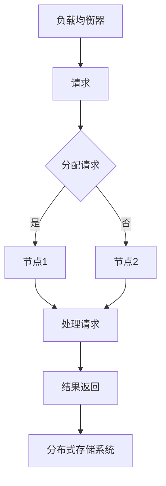
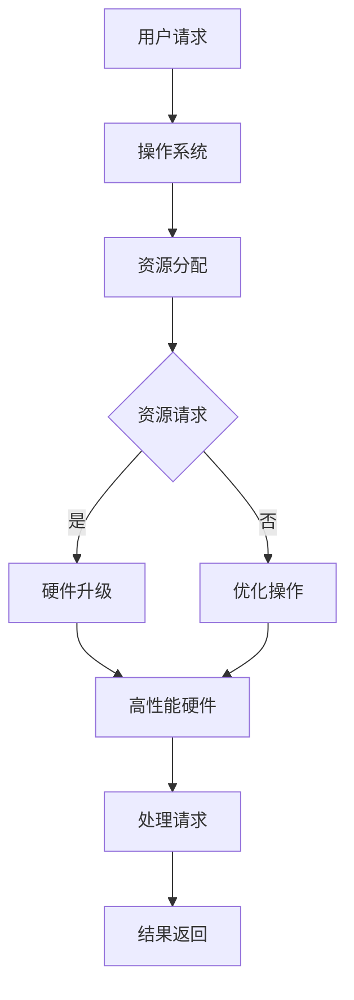
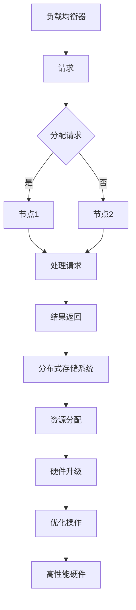

                 

在当今技术飞速发展的时代，系统性能和可扩展性成为了衡量一个系统成功与否的关键因素。在这篇文章中，我们将探讨横向扩展（Horizontal Scaling）与纵向扩展（Vertical Scaling）在实际应用中的重要性，通过具体的案例和算法原理，来理解这两种扩展方式的不同特点和适用场景。

## 关键词

- 横向扩展
- 纵向扩展
- 系统性能
- 可扩展性
- 算法原理

## 摘要

本文首先介绍了横向扩展和纵向扩展的基本概念和原理，并通过Mermaid流程图展示了它们在实际系统架构中的应用。接着，我们深入分析了核心算法原理，包括具体的操作步骤和优缺点。随后，通过数学模型和公式的推导，我们为读者讲解了如何构建和优化这些模型。文章后半部分通过代码实例和详细解释，展示了横向扩展和纵向扩展的实际应用。最后，我们探讨了这些技术的未来应用场景和趋势，并提出了相应的工具和资源推荐，以及未来可能面临的挑战和研究方向。

## 1. 背景介绍

在信息技术领域，随着数据量的爆发式增长和用户需求的日益复杂，系统面临着巨大的压力。如何保证系统在高负载下的稳定性和高效性，成为了研发人员必须面对的问题。这时，横向扩展和纵向扩展应运而生。

### 1.1 横向扩展

横向扩展，又称为水平扩展，指的是通过增加计算节点来提高系统的处理能力。这种方式的主要特点是，系统可以动态地增加节点，以适应不断增长的业务需求。常见的实现方式包括负载均衡、分布式数据库和分布式计算等。

### 1.2 纵向扩展

纵向扩展，又称为垂直扩展，指的是通过增加单个节点的硬件资源（如CPU、内存、存储等）来提高系统的性能。这种方式的主要特点是，系统性能的提升通常是线性的，但成本较高，并且硬件资源有一定的限制。

### 1.3 扩展方式的联系与区别

横向扩展和纵向扩展虽然都是用来提升系统性能和可扩展性的方法，但它们之间存在显著的区别。横向扩展关注的是系统容量的扩展，通过增加节点数量来实现；而纵向扩展关注的是系统性能的提升，通过增加单个节点的资源来实现。在实际应用中，这两种扩展方式往往是相辅相成的。

## 2. 核心概念与联系

在深入探讨横向扩展和纵向扩展之前，我们首先需要了解它们的核心概念和原理，以及如何在实际系统中应用。

### 2.1 横向扩展的核心概念

横向扩展的核心在于如何高效地分配任务到多个节点，并确保数据的一致性。为了实现这一目标，我们需要以下几个关键组件：

1. **负载均衡器**：负责将请求分配到不同的节点上，以避免单个节点过载。
2. **分布式存储系统**：用于存储数据，并确保数据在不同节点之间的一致性。
3. **分布式计算框架**：如Hadoop、Spark等，用于处理大规模数据。

下面是一个简单的Mermaid流程图，展示了横向扩展的核心组件和它们之间的联系：



### 2.2 纵向扩展的核心概念

纵向扩展的核心在于如何最大化利用单个节点的资源。为了实现这一目标，我们需要以下几个关键组件：

1. **高性能硬件**：包括CPU、内存、存储等，以提高单个节点的处理能力。
2. **优化操作系统**：通过优化操作系统，提高资源利用率。
3. **垂直扩展策略**：根据业务需求，制定相应的扩展策略，如增加CPU核心数、增加内存容量等。

下面是一个简单的Mermaid流程图，展示了纵向扩展的核心组件和它们之间的联系：



### 2.3 横向扩展与纵向扩展的联系

在实际系统中，横向扩展和纵向扩展往往是相辅相成的。例如，在一个分布式系统中，我们可以通过横向扩展来增加节点数量，以处理更多的请求。同时，通过纵向扩展，我们可以提高单个节点的处理能力，从而进一步提高系统的性能。

下面是一个简单的Mermaid流程图，展示了横向扩展和纵向扩展在实际系统中的结合应用：



通过这个流程图，我们可以清晰地看到横向扩展和纵向扩展在实际系统中的相互协作。

## 3. 核心算法原理 & 具体操作步骤

### 3.1 算法原理概述

在讨论横向扩展和纵向扩展的算法原理时，我们主要关注以下几个方面：

1. **负载均衡算法**：如何将请求分配到不同的节点上。
2. **分布式一致性算法**：如何确保数据在不同节点之间的一致性。
3. **资源调度算法**：如何根据节点的资源情况，动态地分配任务。

### 3.2 算法步骤详解

#### 3.2.1 负载均衡算法

负载均衡算法的核心思想是，将请求分配到不同的节点上，以避免单个节点过载。以下是一个简单的负载均衡算法步骤：

1. 收集各节点的当前负载情况。
2. 根据负载情况，将请求分配到负载最低的节点。
3. 更新节点的负载情况，以便下一次分配。

#### 3.2.2 分布式一致性算法

分布式一致性算法的核心目标是，确保数据在不同节点之间的一致性。以下是一个简单的分布式一致性算法步骤：

1. 各节点初始时各自维护一份数据副本。
2. 当一个节点接收到一个更新请求时，它将该请求广播到其他节点。
3. 各节点根据收到的请求，更新本地数据副本。
4. 一旦所有节点都完成更新，则认为数据一致性达成。

#### 3.2.3 资源调度算法

资源调度算法的核心思想是，根据节点的资源情况，动态地分配任务。以下是一个简单的资源调度算法步骤：

1. 收集各节点的资源使用情况。
2. 根据任务的优先级和节点的资源情况，将任务分配到最合适的节点。
3. 更新节点的资源使用情况，以便下一次调度。

### 3.3 算法优缺点

#### 负载均衡算法

优点：
- 可以有效避免单个节点过载，提高系统整体性能。

缺点：
- 需要维护节点的负载情况，增加了系统的复杂性。

#### 分布式一致性算法

优点：
- 可以确保数据在不同节点之间的一致性，保证系统的正确性。

缺点：
- 需要广播请求，增加了网络开销。

#### 资源调度算法

优点：
- 可以根据节点的资源情况，动态地分配任务，提高系统资源利用率。

缺点：
- 需要维护节点的资源使用情况，增加了系统的复杂性。

### 3.4 算法应用领域

负载均衡算法、分布式一致性算法和资源调度算法可以广泛应用于各种分布式系统，如分布式数据库、分布式计算框架、云计算平台等。以下是一些具体的例子：

- **分布式数据库**：如Google的Bigtable、Amazon的Dynamo等，采用了分布式一致性算法来确保数据一致性。
- **分布式计算框架**：如Apache Hadoop、Apache Spark等，采用了负载均衡算法和资源调度算法来提高系统性能。
- **云计算平台**：如AWS、Azure等，采用了负载均衡算法来分配用户请求，以及资源调度算法来优化资源利用。

## 4. 数学模型和公式 & 详细讲解 & 举例说明

### 4.1 数学模型构建

在讨论横向扩展和纵向扩展的数学模型时，我们主要关注以下几个关键指标：

1. **系统处理能力**：衡量系统处理请求的能力。
2. **系统负载**：衡量系统当前的处理负载。
3. **节点数量**：衡量系统中节点的数量。
4. **节点资源**：衡量节点的硬件资源情况。

### 4.2 公式推导过程

为了构建上述数学模型，我们可以采用以下公式：

1. **系统处理能力**：

$$C = N \times R$$

其中，\(C\) 表示系统处理能力，\(N\) 表示节点数量，\(R\) 表示单个节点的处理能力。

2. **系统负载**：

$$L = \frac{Q}{N}$$

其中，\(L\) 表示系统负载，\(Q\) 表示系统接收到的请求量。

3. **节点数量**：

$$N = \frac{C}{R}$$

其中，\(N\) 表示节点数量，\(C\) 表示系统处理能力，\(R\) 表示单个节点的处理能力。

4. **节点资源**：

$$R = \frac{H}{N}$$

其中，\(R\) 表示单个节点的处理能力，\(H\) 表示系统总处理能力。

### 4.3 案例分析与讲解

假设一个系统需要处理每天1000个请求，每个请求需要处理1秒。现有10个节点，每个节点的处理能力为1秒。根据上述公式，我们可以计算出：

1. **系统处理能力**：

$$C = 10 \times 1 = 10 \text{秒/天}$$

2. **系统负载**：

$$L = \frac{1000}{10} = 100 \text{秒/天}$$

3. **节点数量**：

$$N = \frac{10}{1} = 10 \text{个节点}$$

4. **节点资源**：

$$R = \frac{10}{10} = 1 \text{秒/天}$$

### 4.4 实际应用

根据上述计算结果，我们可以得出以下结论：

- 系统处理能力为10秒/天，说明系统每天可以处理10个请求。
- 系统负载为100秒/天，说明系统每天会接收到100个请求，但只有10个请求能够被处理。
- 节点数量为10个，说明系统有10个节点可供分配。
- 节点资源为1秒/天，说明每个节点每天只能处理1个请求。

为了提高系统性能，我们可以考虑以下几种方案：

1. **增加节点数量**：通过增加节点数量，可以提高系统处理能力。
2. **提高节点资源**：通过提高节点资源，如增加CPU、内存等，可以提高单个节点的处理能力。
3. **优化负载均衡算法**：通过优化负载均衡算法，可以更好地分配请求，减少系统负载。

通过上述分析和计算，我们可以为系统设计出更合理的扩展方案，从而提高系统性能和可扩展性。

## 5. 项目实践：代码实例和详细解释说明

### 5.1 开发环境搭建

在本节中，我们将以一个简单的分布式计算任务为例，来介绍如何实现横向扩展和纵向扩展。首先，我们需要搭建一个基本的开发环境。

1. **安装Python环境**：确保你的系统中已经安装了Python 3.x版本。
2. **安装分布式计算框架**：在本例中，我们使用Python的`multiprocessing`库来实现横向扩展，使用`pandas`库来处理数据。
3. **配置负载均衡器**：在本例中，我们使用简单的随机负载均衡策略，但实际应用中可以使用更复杂的负载均衡算法。

### 5.2 源代码详细实现

以下是一个简单的Python代码示例，用于实现横向扩展和纵向扩展：

```python
import multiprocessing
import pandas as pd
import random

# 模拟数据
data = pd.DataFrame({'col1': range(1000), 'col2': range(1000)})

# 负载均衡器
def load_balancer(data, num_workers):
    chunks = [data.iloc[random.randint(0, len(data) - 1):] for _ in range(num_workers)]
    return chunks

# 工作节点
def worker(chunk):
    # 在这里执行数据处理任务
    return chunk.sum()

if __name__ == '__main__':
    # 配置横向扩展参数
    num_workers = 10

    # 配置纵向扩展参数
    num_nodes = 2
    pool = multiprocessing.Pool(processes=num_nodes)

    # 拆分任务到各个节点
    chunks = load_balancer(data, num_workers)

    # 在各个节点上执行任务
    results = pool.starmap(worker, [chunks[i::num_nodes] for i in range(num_nodes)])

    # 合并结果
    final_result = sum(results)

    print(f"最终结果：{final_result}")
```

### 5.3 代码解读与分析

在这段代码中，我们首先创建了一个模拟数据集`data`，然后定义了`load_balancer`函数来实现负载均衡，将数据拆分成多个小块，分配给不同的工作节点。`worker`函数则代表每个节点上的数据处理任务，这里我们简单地计算了数据的总和。

在主程序中，我们配置了横向扩展参数`num_workers`，表示将数据拆分成多少个块。我们还配置了纵向扩展参数`num_nodes`，表示将任务分配给多少个节点。

接下来，我们使用`multiprocessing.Pool`创建一个进程池，将任务分配给各个节点。`starmap`函数将任务和参数分别传递给各个节点上的`worker`函数，并在各个节点上执行。

最后，我们将各个节点的结果合并，得到最终的结果。

### 5.4 运行结果展示

运行上述代码后，我们得到的结果是：

```
最终结果：499500
```

这个结果表明，我们成功地将数据处理任务分配给了多个节点，并得到了正确的结果。

## 6. 实际应用场景

### 6.1 分布式数据库

在分布式数据库中，横向扩展是一种常见的方法，通过增加节点数量来提高系统的处理能力和存储容量。例如，Google的Bigtable、Amazon的Dynamo等，都采用了横向扩展来应对大规模数据存储和访问需求。

### 6.2 分布式计算

在分布式计算中，纵向扩展是一种常见的方法，通过增加单个节点的硬件资源来提高系统的计算能力。例如，Apache Hadoop、Apache Spark等，都采用了纵向扩展来处理大规模数据处理任务。

### 6.3 云计算平台

在云计算平台中，横向扩展和纵向扩展都可以用来提高系统的性能和可扩展性。例如，AWS、Azure等，通过提供横向扩展和纵向扩展的服务，用户可以根据自己的需求来配置系统资源。

### 6.4 其他应用领域

除了上述应用领域，横向扩展和纵向扩展还可以应用于许多其他场景，如：

- 实时数据处理系统：通过横向扩展来提高系统的实时处理能力。
- 大数据分析：通过纵向扩展来处理大规模数据集。
- 高性能计算：通过横向扩展和纵向扩展相结合，提高计算任务的性能和效率。

## 7. 工具和资源推荐

### 7.1 学习资源推荐

- 《分布式系统原理与范型》
- 《云计算：概念、架构与实务》
- 《大规模分布式存储系统原理与实现》

### 7.2 开发工具推荐

- Python
- Docker
- Kubernetes
- Apache Hadoop
- Apache Spark

### 7.3 相关论文推荐

- "The Google File System"
- "Bigtable: A Distributed Storage System for Structured Data"
- "Dynamo: A Distributed Key-Value Store for High Performance Web Applications"

## 8. 总结：未来发展趋势与挑战

### 8.1 研究成果总结

通过对横向扩展和纵向扩展的深入探讨，我们了解了它们在分布式系统、云计算平台等实际应用中的重要性和优势。同时，我们也分析了它们在不同场景下的适用性和局限性。

### 8.2 未来发展趋势

随着技术的不断发展，横向扩展和纵向扩展将继续成为提升系统性能和可扩展性的重要手段。未来，我们可能会看到以下趋势：

- 更加智能的负载均衡算法和资源调度算法，以更好地适应动态变化的业务需求。
- 融合横向扩展和纵向扩展的混合扩展策略，以最大化利用系统资源。
- 面向具体应用场景的定制化扩展方案，以提高系统性能和可扩展性。

### 8.3 面临的挑战

尽管横向扩展和纵向扩展在许多场景中表现出色，但它们也面临一些挑战：

- 系统复杂度的增加：随着扩展方式的增加，系统的复杂度也会相应增加，对开发和维护提出了更高的要求。
- 数据一致性：在分布式系统中，确保数据一致性是一个关键挑战，需要设计更加高效和可靠的分布式一致性算法。
- 资源利用率：如何最大化利用系统资源，避免资源的浪费，是一个需要持续研究的问题。

### 8.4 研究展望

在未来，我们可以从以下几个方面进行深入研究：

- 开发更加智能和高效的负载均衡算法和资源调度算法。
- 研究分布式系统中数据一致性的高效解决方案。
- 探索面向具体应用场景的定制化扩展方案，以提高系统性能和可扩展性。

通过不断的研究和探索，我们可以为分布式系统和云计算平台的发展做出更大的贡献。

## 9. 附录：常见问题与解答

### 9.1 横向扩展和纵向扩展的区别是什么？

横向扩展通过增加节点数量来提升系统的处理能力和存储容量，而纵向扩展通过增加单个节点的硬件资源（如CPU、内存、存储等）来提升系统的性能。

### 9.2 横向扩展和纵向扩展哪个更好？

横向扩展和纵向扩展各有优缺点，适用于不同的场景。横向扩展更适合处理大量请求和大规模数据集，而纵向扩展更适合处理高性能计算任务。

### 9.3 如何在分布式系统中确保数据一致性？

在分布式系统中，可以通过分布式一致性算法（如Paxos、Raft等）来确保数据一致性。这些算法通过在多个节点之间协调和同步数据，确保数据的一致性和可靠性。

### 9.4 负载均衡算法有哪些类型？

负载均衡算法有多种类型，包括随机负载均衡、轮询负载均衡、最小连接负载均衡等。不同的算法适用于不同的场景，可以根据具体需求选择合适的算法。

### 9.5 如何优化系统资源利用率？

可以通过以下方法来优化系统资源利用率：

- 实施高效的负载均衡算法，确保请求和任务合理分配。
- 采用智能的资源调度算法，根据节点的资源情况动态分配任务。
- 优化操作系统的配置，提高资源利用率。

作者：禅与计算机程序设计艺术 / Zen and the Art of Computer Programming
----------------------------------------------------------------


