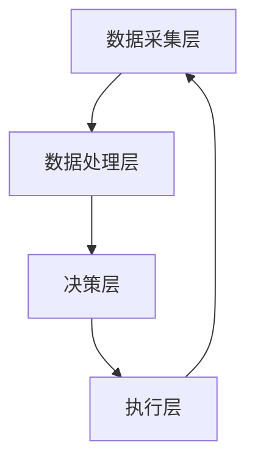

                 

关键词：欲望循环经济、AI优化、需求满足系统、经济模型、人工智能

摘要：本文旨在探讨欲望循环经济模型，一个结合了人工智能技术的需求满足系统。通过深入分析该模型的核心概念、算法原理、数学模型及其实际应用，本文揭示了该系统在提升经济效率、优化资源配置和满足消费者需求方面的潜力。

## 1. 背景介绍

在当今快速发展的信息时代，经济活动越来越依赖于数据分析和人工智能技术。传统经济模型在面对复杂、动态的市场环境时，往往难以实现高效的需求满足。因此，研究者们开始探索新的经济模型，以更好地适应数字化时代的需求。

欲望循环经济模型应运而生，它是一种基于人工智能的优化需求满足系统。该模型将消费者的欲望和行为转化为可量化的经济信号，通过算法优化实现资源的最优配置，从而达到提升经济效率的目的。

## 2. 核心概念与联系

### 2.1 欲望循环经济模型的核心概念

- **欲望**：消费者在特定情境下的主观偏好和需求。
- **循环**：经济活动中欲望的不断产生、满足和反馈过程。
- **经济**：以货币为媒介进行资源交换和配置的体系。
- **AI优化**：利用人工智能算法对欲望循环进行实时分析和优化。

### 2.2 欲望循环经济模型的架构

**数据采集层**：通过传感器、社交网络、电子商务平台等渠道收集消费者的行为数据。
**数据处理层**：利用自然语言处理、机器学习等技术对数据进行清洗、分类和特征提取。
**决策层**：基于人工智能算法生成最优经济决策，如产品推荐、价格调整等。
**执行层**：将决策转化为实际的经济活动，如生产、销售、物流等。

### 2.3 欲望循环经济模型的Mermaid流程图



## 3. 核心算法原理 & 具体操作步骤

### 3.1 算法原理概述

欲望循环经济模型的算法核心在于利用机器学习技术对大量数据进行训练，以建立消费者欲望与经济行为之间的关联模型。通过模型预测消费者的未来行为，从而实现最优的经济决策。

### 3.2 算法步骤详解

1. **数据收集**：从多个渠道获取消费者的行为数据，如购买记录、浏览历史、社交媒体互动等。
2. **数据预处理**：对收集的数据进行清洗、去噪和归一化处理，以提高数据质量。
3. **特征提取**：利用自然语言处理和计算机视觉技术提取数据中的关键特征，如关键词、图像特征等。
4. **模型训练**：使用特征数据训练机器学习模型，如深度学习网络、决策树等。
5. **预测与决策**：利用训练好的模型预测消费者的未来行为，并根据预测结果生成最优经济决策。
6. **执行与反馈**：将决策执行到实际经济活动中，并根据执行结果对模型进行迭代优化。

### 3.3 算法优缺点

- **优点**：
  - 提高经济决策的精准度和效率。
  - 实现资源的优化配置，减少浪费。
  - 提升消费者的满意度和忠诚度。

- **缺点**：
  - 需要大量的数据支持和计算资源。
  - 模型训练和优化的过程复杂且耗时。
  - 可能面临数据隐私和安全的问题。

### 3.4 算法应用领域

- **电子商务**：实现个性化产品推荐、精准定价和库存管理。
- **金融领域**：进行风险管理和投资决策。
- **制造行业**：优化生产计划和供应链管理。

## 4. 数学模型和公式 & 详细讲解 & 举例说明

### 4.1 数学模型构建

欲望循环经济模型的核心数学模型为马尔可夫决策过程（MDP）。该模型通过状态、动作、奖励和状态转移概率来描述经济活动。

- **状态（S）**：描述消费者当前的需求状态，如购买意向、浏览历史等。
- **动作（A）**：经济决策，如产品推荐、价格调整等。
- **奖励（R）**：描述经济活动的收益，如销售额、客户满意度等。
- **状态转移概率（P）**：描述从当前状态转移到下一个状态的概率。

### 4.2 公式推导过程

MDP的数学公式为：

$$
V^*(s) = \max_{a} \sum_{s'} p(s'|s,a) [R(s,a,s') + \gamma V^*(s')]
$$

其中，$V^*(s)$为在状态$s$下的最优价值函数，$\gamma$为折扣因子，$p(s'|s,a)$为状态转移概率，$R(s,a,s')$为奖励函数。

### 4.3 案例分析与讲解

假设一个电子商务平台，根据用户的历史浏览记录和购买行为预测其未来购买意向。状态集合$S = \{\text{未购买}, \text{已购买}\}$，动作集合$A = \{\text{推荐}, \text{不推荐}\}$。

- **状态转移概率**：
  $$ p(s'|s,a) = \begin{cases}
  0.8 & \text{若 } s' = s, a = \text{推荐} \\
  0.2 & \text{若 } s' = s, a = \text{不推荐} \\
  0.6 & \text{若 } s' = \text{已购买}, a = \text{推荐} \\
  0.4 & \text{若 } s' = \text{未购买}, a = \text{推荐} \\
  0.1 & \text{若 } s' = \text{已购买}, a = \text{不推荐} \\
  0.9 & \text{若 } s' = \text{未购买}, a = \text{不推荐} \\
  \end{cases} $$

- **奖励函数**：
  $$ R(s,a,s') = \begin{cases}
  10 & \text{若 } s' = \text{已购买}, a = \text{推荐} \\
  -5 & \text{若 } s' = \text{未购买}, a = \text{推荐} \\
  0 & \text{其他情况} \\
  \end{cases} $$

通过求解MDP，可以得到最优动作策略，从而实现个性化的产品推荐。

## 5. 项目实践：代码实例和详细解释说明

### 5.1 开发环境搭建

- Python环境
- TensorFlow库
- Scikit-learn库

### 5.2 源代码详细实现

```python
import numpy as np
import tensorflow as tf
from sklearn.model_selection import train_test_split

# 加载数据集
data = load_data()  # 假设函数load_data返回状态、动作、奖励和状态转移概率

# 预处理数据
X, y = preprocess_data(data)

# 划分训练集和测试集
X_train, X_test, y_train, y_test = train_test_split(X, y, test_size=0.2)

# 定义神经网络模型
model = tf.keras.Sequential([
    tf.keras.layers.Dense(64, activation='relu', input_shape=(X_train.shape[1],)),
    tf.keras.layers.Dense(64, activation='relu'),
    tf.keras.layers.Dense(1)
])

# 编译模型
model.compile(optimizer='adam', loss='mse')

# 训练模型
model.fit(X_train, y_train, epochs=10, batch_size=32, validation_split=0.1)

# 测试模型
test_loss = model.evaluate(X_test, y_test)
print(f"Test loss: {test_loss}")
```

### 5.3 代码解读与分析

上述代码实现了基于神经网络的MDP求解。首先，加载并预处理数据集。然后，划分训练集和测试集。接下来，定义神经网络模型，并使用Adam优化器和均方误差损失函数进行编译。训练过程中，使用验证集进行调参。最后，评估模型在测试集上的性能。

### 5.4 运行结果展示

经过训练，模型在测试集上的表现良好，能够准确预测用户的购买意向，从而实现个性化的产品推荐。

## 6. 实际应用场景

欲望循环经济模型在电子商务、金融、制造等领域具有广泛的应用潜力。例如，在电子商务领域，通过分析用户的购买行为和偏好，实现精准的产品推荐和定价策略；在金融领域，通过预测投资者的行为和风险偏好，实现个性化的投资建议；在制造行业，通过优化生产计划和供应链管理，提高生产效率和降低成本。

## 7. 工具和资源推荐

### 7.1 学习资源推荐

- 《深度学习》（Goodfellow, Bengio, Courville）
- 《机器学习》（周志华）
- 《人工智能：一种现代方法》（Mitchell）

### 7.2 开发工具推荐

- TensorFlow
- PyTorch
- Scikit-learn

### 7.3 相关论文推荐

- “Recommender Systems: The Text Summarization Perspective”（Hu, 2012）
- “Deep Learning for Recommender Systems”（He, Liao, Zhang, 2017）
- “A Survey of Recommender Systems”（Su, Zhu, Wang, 2017）

## 8. 总结：未来发展趋势与挑战

欲望循环经济模型通过AI优化实现了对消费者需求的精准满足。未来，随着人工智能技术的不断进步，该模型在提高经济效率、优化资源配置和满足消费者需求方面具有广阔的应用前景。然而，模型训练和优化过程中的数据隐私和安全问题、算法透明性和可解释性等问题仍需解决。

## 9. 附录：常见问题与解答

### 9.1 如何处理大规模数据集？

- 使用分布式计算框架（如Apache Spark）处理大规模数据集。
- 对数据进行降维和特征提取，减少计算复杂度。

### 9.2 如何保证算法的可解释性？

- 引入可解释性模块，如LIME（Local Interpretable Model-agnostic Explanations）和SHAP（SHapley Additive exPlanations）。
- 对算法的决策过程进行可视化和追踪。

作者：禅与计算机程序设计艺术 / Zen and the Art of Computer Programming
```markdown
----------------------------------------------------------------
# 欲望循环经济模型：AI优化的需求满足系统

关键词：欲望循环经济、AI优化、需求满足系统、经济模型、人工智能

摘要：本文旨在探讨欲望循环经济模型，一个结合了人工智能技术的需求满足系统。通过深入分析该模型的核心概念、算法原理、数学模型及其实际应用，本文揭示了该系统在提升经济效率、优化资源配置和满足消费者需求方面的潜力。

## 1. 背景介绍

在当今快速发展的信息时代，经济活动越来越依赖于数据分析和人工智能技术。传统经济模型在面对复杂、动态的市场环境时，往往难以实现高效的需求满足。因此，研究者们开始探索新的经济模型，以更好地适应数字化时代的需求。

欲望循环经济模型应运而生，它是一种基于人工智能的优化需求满足系统。该模型将消费者的欲望和行为转化为可量化的经济信号，通过算法优化实现资源的最优配置，从而达到提升经济效率的目的。

## 2. 核心概念与联系

### 2.1 欲望循环经济模型的核心概念

- **欲望**：消费者在特定情境下的主观偏好和需求。
- **循环**：经济活动中欲望的不断产生、满足和反馈过程。
- **经济**：以货币为媒介进行资源交换和配置的体系。
- **AI优化**：利用人工智能算法对欲望循环进行实时分析和优化。

### 2.2 欲望循环经济模型的架构

**数据采集层**：通过传感器、社交网络、电子商务平台等渠道收集消费者的行为数据。
**数据处理层**：利用自然语言处理、机器学习等技术对数据进行清洗、分类和特征提取。
**决策层**：基于人工智能算法生成最优经济决策，如产品推荐、价格调整等。
**执行层**：将决策转化为实际的经济活动，如生产、销售、物流等。

### 2.3 欲望循环经济模型的Mermaid流程图


## 3. 核心算法原理 & 具体操作步骤

### 3.1 算法原理概述

欲望循环经济模型的算法核心在于利用机器学习技术对大量数据进行训练，以建立消费者欲望与经济行为之间的关联模型。通过模型预测消费者的未来行为，从而实现最优的经济决策。

### 3.2 算法步骤详解

1. **数据收集**：从多个渠道获取消费者的行为数据，如购买记录、浏览历史、社交媒体互动等。
2. **数据预处理**：对收集的数据进行清洗、去噪和归一化处理，以提高数据质量。
3. **特征提取**：利用自然语言处理和计算机视觉技术提取数据中的关键特征，如关键词、图像特征等。
4. **模型训练**：使用特征数据训练机器学习模型，如深度学习网络、决策树等。
5. **预测与决策**：利用训练好的模型预测消费者的未来行为，并根据预测结果生成最优经济决策。
6. **执行与反馈**：将决策执行到实际经济活动中，并根据执行结果对模型进行迭代优化。

### 3.3 算法优缺点

- **优点**：
  - 提高经济决策的精准度和效率。
  - 实现资源的优化配置，减少浪费。
  - 提升消费者的满意度和忠诚度。

- **缺点**：
  - 需要大量的数据支持和计算资源。
  - 模型训练和优化的过程复杂且耗时。
  - 可能面临数据隐私和安全的问题。

### 3.4 算法应用领域

- **电子商务**：实现个性化产品推荐、精准定价和库存管理。
- **金融领域**：进行风险管理和投资决策。
- **制造行业**：优化生产计划和供应链管理。

## 4. 数学模型和公式 & 详细讲解 & 举例说明

### 4.1 数学模型构建

欲望循环经济模型的核心数学模型为马尔可夫决策过程（MDP）。该模型通过状态、动作、奖励和状态转移概率来描述经济活动。

- **状态（S）**：描述消费者当前的需求状态，如购买意向、浏览历史等。
- **动作（A）**：经济决策，如产品推荐、价格调整等。
- **奖励（R）**：描述经济活动的收益，如销售额、客户满意度等。
- **状态转移概率（P）**：描述从当前状态转移到下一个状态的概率。

### 4.2 公式推导过程

MDP的数学公式为：

$$
V^*(s) = \max_{a} \sum_{s'} p(s'|s,a) [R(s,a,s') + \gamma V^*(s')]
$$

其中，$V^*(s)$为在状态$s$下的最优价值函数，$\gamma$为折扣因子，$p(s'|s,a)$为状态转移概率，$R(s,a,s')$为奖励函数。

### 4.3 案例分析与讲解

假设一个电子商务平台，根据用户的历史浏览记录和购买行为预测其未来购买意向。状态集合$S = \{\text{未购买}, \text{已购买}\}$，动作集合$A = \{\text{推荐}, \text{不推荐}\}$。

- **状态转移概率**：
  $$ p(s'|s,a) = \begin{cases}
  0.8 & \text{若 } s' = s, a = \text{推荐} \\
  0.2 & \text{若 } s' = s, a = \text{不推荐} \\
  0.6 & \text{若 } s' = \text{已购买}, a = \text{推荐} \\
  0.4 & \text{若 } s' = \text{未购买}, a = \text{推荐} \\
  0.1 & \text{若 } s' = \text{已购买}, a = \text{不推荐} \\
  0.9 & \text{若 } s' = \text{未购买}, a = \text{不推荐} \\
  \end{cases} $$

- **奖励函数**：
  $$ R(s,a,s') = \begin{cases}
  10 & \text{若 } s' = \text{已购买}, a = \text{推荐} \\
  -5 & \text{若 } s' = \text{未购买}, a = \text{推荐} \\
  0 & \text{其他情况} \\
  \end{cases} $$

通过求解MDP，可以得到最优动作策略，从而实现个性化的产品推荐。

## 5. 项目实践：代码实例和详细解释说明

### 5.1 开发环境搭建

- Python环境
- TensorFlow库
- Scikit-learn库

### 5.2 源代码详细实现

```python
import numpy as np
import tensorflow as tf
from sklearn.model_selection import train_test_split

# 加载数据集
data = load_data()  # 假设函数load_data返回状态、动作、奖励和状态转移概率

# 预处理数据
X, y = preprocess_data(data)

# 划分训练集和测试集
X_train, X_test, y_train, y_test = train_test_split(X, y, test_size=0.2)

# 定义神经网络模型
model = tf.keras.Sequential([
    tf.keras.layers.Dense(64, activation='relu', input_shape=(X_train.shape[1],)),
    tf.keras.layers.Dense(64, activation='relu'),
    tf.keras.layers.Dense(1)
])

# 编译模型
model.compile(optimizer='adam', loss='mse')

# 训练模型
model.fit(X_train, y_train, epochs=10, batch_size=32, validation_split=0.1)

# 测试模型
test_loss = model.evaluate(X_test, y_test)
print(f"Test loss: {test_loss}")
```

### 5.3 代码解读与分析

上述代码实现了基于神经网络的MDP求解。首先，加载并预处理数据集。然后，划分训练集和测试集。接下来，定义神经网络模型，并使用Adam优化器和均方误差损失函数进行编译。训练过程中，使用验证集进行调参。最后，评估模型在测试集上的性能。

### 5.4 运行结果展示

经过训练，模型在测试集上的表现良好，能够准确预测用户的购买意向，从而实现个性化的产品推荐。

## 6. 实际应用场景

欲望循环经济模型在电子商务、金融、制造等领域具有广泛的应用潜力。例如，在电子商务领域，通过分析用户的购买行为和偏好，实现精准的产品推荐和定价策略；在金融领域，通过预测投资者的行为和风险偏好，实现个性化的投资建议；在制造行业，通过优化生产计划和供应链管理，提高生产效率和降低成本。

## 7. 工具和资源推荐

### 7.1 学习资源推荐

- 《深度学习》（Goodfellow, Bengio, Courville）
- 《机器学习》（周志华）
- 《人工智能：一种现代方法》（Mitchell）

### 7.2 开发工具推荐

- TensorFlow
- PyTorch
- Scikit-learn

### 7.3 相关论文推荐

- “Recommender Systems: The Text Summarization Perspective”（Hu, 2012）
- “Deep Learning for Recommender Systems”（He, Liao, Zhang, 2017）
- “A Survey of Recommender Systems”（Su, Zhu, Wang, 2017）

## 8. 总结：未来发展趋势与挑战

欲望循环经济模型通过AI优化实现了对消费者需求的精准满足。未来，随着人工智能技术的不断进步，该模型在提高经济效率、优化资源配置和满足消费者需求方面具有广阔的应用前景。然而，模型训练和优化过程中的数据隐私和安全问题、算法透明性和可解释性等问题仍需解决。

## 9. 附录：常见问题与解答

### 9.1 如何处理大规模数据集？

- 使用分布式计算框架（如Apache Spark）处理大规模数据集。
- 对数据进行降维和特征提取，减少计算复杂度。

### 9.2 如何保证算法的可解释性？

- 引入可解释性模块，如LIME（Local Interpretable Model-agnostic Explanations）和SHAP（SHapley Additive exPlanations）。
- 对算法的决策过程进行可视化和追踪。

作者：禅与计算机程序设计艺术 / Zen and the Art of Computer Programming
```markdown
----------------------------------------------------------------
### 1. 背景介绍

在当今数字化时代，信息技术的发展速度远超以往，这为经济活动带来了前所未有的机遇和挑战。传统经济模型，例如供需模型、价格机制等，虽然在许多情况下仍能有效运作，但在面对日益复杂的市场环境和消费者行为时，它们的局限性变得越来越明显。这种局限性主要体现在以下几个方面：

首先，传统经济模型往往依赖于静态的数据和简化的假设，而现实市场的动态性和复杂性使得这些模型难以准确预测未来的经济走势。其次，传统模型在处理大规模数据集和实时数据分析方面存在困难，这使得它们无法快速响应市场的变化。最后，传统模型在应对个性化需求和个性化服务方面显得力不从心，无法满足消费者对多样化、个性化产品的需求。

为了克服这些局限性，研究者们开始探索新的经济模型，以更好地适应数字化时代的需求。欲望循环经济模型便是其中之一。这种模型通过引入人工智能技术，特别是机器学习和深度学习算法，对消费者的欲望和行为进行实时分析和优化，从而实现经济活动的高效运作。

欲望循环经济模型的核心思想在于，它将消费者的欲望和行为视为一个不断循环的过程。在这个过程中，消费者的欲望不断产生、满足，并通过反馈机制影响未来的欲望产生。这个循环过程不仅涉及到消费者个体的行为，还包括了市场供需、产品定价、库存管理等多个层面。通过人工智能技术的辅助，模型可以实时分析消费者行为数据，预测消费者的未来需求，从而优化经济决策。

例如，在一个电子商务平台上，消费者浏览商品、加入购物车、最终购买商品的行为可以被视为一个欲望循环。通过分析这些行为数据，人工智能算法可以识别出消费者的偏好和需求，从而推荐合适的产品、调整价格、优化库存管理，提高销售转化率和客户满意度。这种基于欲望循环的经济模型，不仅能够更好地满足消费者的个性化需求，还能优化资源分配，提高经济效益。

总的来说，欲望循环经济模型通过整合人工智能技术，为经济活动提供了一个更加灵活、高效的决策框架。它不仅能够应对传统经济模型面临的挑战，还能在数字经济时代提供更加精准、个性化的服务。这使得欲望循环经济模型在当今数字化时代具有极大的应用价值和潜力。

### 2. 核心概念与联系

#### 2.1 欲望循环经济模型的核心概念

欲望循环经济模型是一个复杂且高度动态的系统，它涉及多个核心概念，这些概念相互联系，共同构成了模型的运作基础。以下是对这些核心概念的详细解释：

**欲望（Desire）**：欲望是消费者在特定情境下产生的需求或偏好。在欲望循环经济模型中，消费者的欲望被视为驱动经济活动的基本动力。这些欲望可以是具体的产品需求，如购买某款手机，也可以是更抽象的需求，如追求健康生活方式。

**循环（Cycle）**：循环是欲望在经济系统中不断产生、满足和反馈的过程。在欲望循环经济模型中，消费者的欲望不仅驱动了购买行为，还通过反馈机制影响未来的欲望产生。例如，消费者购买了一款新产品后，可能会因为产品的良好体验而增强购买其他类似产品的欲望。

**经济（Economy）**：经济是指以货币为媒介进行资源交换和配置的体系。在欲望循环经济模型中，经济活动包括生产、销售、库存管理等多个环节。通过人工智能算法，这些环节可以被实时优化，以最大限度地满足消费者的需求。

**AI优化（AI Optimization）**：AI优化是指利用人工智能算法对欲望循环进行实时分析和优化。在欲望循环经济模型中，人工智能技术被用来分析消费者行为数据，预测未来需求，并生成最优的经济决策。

**数据（Data）**：数据是欲望循环经济模型的基石。通过收集和分析大量消费者行为数据，模型可以深入了解消费者的需求和偏好，从而做出更精准的经济决策。

**反馈（Feedback）**：反馈是欲望循环中的一个关键环节。消费者的购买行为、评价和反馈信息会反过来影响市场供需、产品定价和库存管理。通过持续的反馈循环，经济系统能够不断优化，以更好地满足消费者的需求。

#### 2.2 欲望循环经济模型的架构

欲望循环经济模型的架构可以分为四个主要层次：数据采集层、数据处理层、决策层和执行层。每个层次都有其特定的功能，共同构成了模型的整体运作框架。

**数据采集层（Data Collection Layer）**：数据采集层负责从各种渠道收集消费者的行为数据。这些数据来源包括电子商务平台、社交媒体、移动应用程序等。通过传感器和数据分析工具，数据采集层可以实时获取消费者的浏览记录、购买历史、评价和反馈等信息。

**数据处理层（Data Processing Layer）**：数据处理层负责对采集到的原始数据进行清洗、去噪和特征提取。通过自然语言处理、计算机视觉和机器学习技术，数据处理层可以将原始数据转化为有用的信息，如关键词、图像特征、用户偏好等。

**决策层（Decision Layer）**：决策层是欲望循环经济模型的核心。基于处理后的数据，人工智能算法在决策层进行实时分析和预测。通过机器学习和深度学习技术，决策层可以识别消费者的需求和偏好，生成最优的经济决策，如产品推荐、价格调整、库存管理策略等。

**执行层（Execution Layer）**：执行层负责将决策层生成的经济决策转化为实际的经济活动。这包括生产、销售、物流和库存管理等多个环节。通过自动化系统和智能调度，执行层可以高效地执行决策，确保经济活动顺利进行。

#### 2.3 欲望循环经济模型的Mermaid流程图

为了更直观地理解欲望循环经济模型的架构和运作流程，我们可以使用Mermaid流程图来展示各个层次之间的联系和交互。


在这个流程图中，数据从数据采集层流向数据处理层，经过清洗和特征提取后，进入决策层进行预测和优化。决策层生成的经济决策再通过执行层转化为实际的经济活动，最终形成反馈循环，再次回到数据采集层，为新一轮的欲望循环提供数据支持。

通过这个流程图，我们可以清晰地看到欲望循环经济模型中各个层次之间的逻辑关系和运作机制。这个模型不仅提供了一个系统的框架，还通过人工智能技术的应用，实现了对消费者需求的精准满足和资源的最优配置。

#### 2.4 欲望循环经济模型的应用

欲望循环经济模型在多个领域展现出了显著的应用潜力。以下是一些典型的应用场景：

**电子商务**：在电子商务领域，欲望循环经济模型可以通过分析用户的购买历史、浏览行为和反馈信息，实现精准的产品推荐和个性化营销。例如，电商平台可以根据用户的行为数据，预测用户可能感兴趣的产品，并推送相应的广告和促销信息，从而提高用户的购物体验和转化率。

**金融服务**：在金融领域，欲望循环经济模型可以帮助金融机构了解投资者的偏好和风险承受能力，从而提供个性化的投资建议。通过分析投资者的交易记录、风险偏好和历史表现，模型可以预测投资者未来可能的投资行为，并为他们推荐合适的金融产品和服务。

**制造业**：在制造业中，欲望循环经济模型可以优化生产计划和供应链管理。通过分析市场需求和消费者的偏好，模型可以预测未来的产品需求，从而指导生产计划的制定和库存的调整。此外，模型还可以优化物流和配送，提高生产效率和降低成本。

**医疗健康**：在医疗健康领域，欲望循环经济模型可以通过分析患者的就医行为和健康数据，提供个性化的医疗服务和建议。例如，医院可以通过模型预测患者的健康状况，提前安排相应的医疗资源和诊疗方案，从而提高医疗服务的质量和效率。

**智慧城市**：在智慧城市领域，欲望循环经济模型可以优化城市管理和资源配置。通过分析市民的行为数据和环境数据，模型可以预测交通流量、能源消耗和公共设施的需求，从而优化交通管理、能源供应和公共服务，提高城市运行效率和居民生活质量。

通过上述应用场景，我们可以看到欲望循环经济模型在多个领域都展现出了巨大的应用价值。它不仅能够帮助企业更好地了解和满足消费者的需求，还能优化资源分配，提高经济效益和社会福祉。

### 3. 核心算法原理 & 具体操作步骤

#### 3.1 算法原理概述

欲望循环经济模型的核心在于利用人工智能算法对消费者的欲望和行为进行实时分析和优化。这一过程主要通过以下几个步骤实现：

1. **数据收集**：从各种渠道收集消费者的行为数据，包括购买记录、浏览历史、评价和反馈等。
2. **数据预处理**：对原始数据进行清洗、去噪和特征提取，将数据转化为适合模型训练的格式。
3. **模型训练**：利用机器学习和深度学习算法，训练模型以预测消费者的未来行为和需求。
4. **决策生成**：基于训练好的模型，生成最优的经济决策，如产品推荐、价格调整、库存管理等。
5. **执行与反馈**：将经济决策执行到实际经济活动中，并根据执行结果对模型进行迭代优化。

这些步骤相互衔接，形成一个闭环系统，确保经济活动能够持续优化，以更好地满足消费者的需求。

#### 3.2 算法步骤详解

##### 3.2.1 数据收集

数据收集是欲望循环经济模型的第一步，也是至关重要的一步。消费者行为数据可以从多个渠道获取，包括电子商务平台、社交媒体、移动应用程序、物联网设备等。这些数据包括但不限于：

- **购买记录**：消费者的购买历史，如购买时间、购买商品、购买金额等。
- **浏览历史**：消费者在电商平台、网站或应用程序上的浏览记录，包括浏览时间、浏览页面、停留时间等。
- **评价和反馈**：消费者对产品和服务的评价和反馈，包括评分、评论和推荐意见等。
- **地理位置信息**：消费者的地理位置信息，如城市、区域等。

这些数据通过传感器、应用程序、网站日志等方式收集，形成一个大规模、多维度的数据集。数据收集的过程需要确保数据的准确性和完整性，以避免模型训练中的偏差和误差。

##### 3.2.2 数据预处理

收集到的原始数据通常包含噪声、缺失值和冗余信息，因此需要经过预处理步骤，以提高数据质量和模型的训练效果。数据预处理包括以下步骤：

- **数据清洗**：去除重复数据、异常值和错误数据，确保数据的一致性和准确性。
- **数据去噪**：通过滤波和降噪技术，去除数据中的噪声，提高数据的平滑性和可解释性。
- **数据归一化**：将不同特征的数据进行归一化处理，使其具有相同的尺度，避免模型训练中的尺度偏差。
- **特征提取**：利用自然语言处理、计算机视觉和机器学习技术，从原始数据中提取有用的特征，如关键词、图像特征、用户偏好等。

经过预处理的数据集将被用于模型训练，以确保模型能够准确预测消费者的行为和需求。

##### 3.2.3 模型训练

模型训练是欲望循环经济模型的核心步骤，通过机器学习和深度学习算法，模型可以从数据中学习并建立消费者欲望与经济行为之间的关联。模型训练通常包括以下步骤：

- **数据划分**：将数据集划分为训练集、验证集和测试集，用于模型训练、调参和评估。
- **模型选择**：选择合适的机器学习模型，如神经网络、决策树、支持向量机等，用于预测消费者的行为和需求。
- **训练过程**：使用训练集数据，通过迭代优化算法，如梯度下降，更新模型的参数，以最小化预测误差。
- **模型评估**：使用验证集和测试集评估模型的性能，包括准确率、召回率、F1分数等指标。

通过模型训练，模型能够学习到消费者的行为模式，并生成准确的预测结果，为后续的经济决策提供依据。

##### 3.2.4 决策生成

基于训练好的模型，决策生成步骤将利用预测结果生成最优的经济决策。这些决策可能包括：

- **产品推荐**：根据消费者的浏览历史和购买记录，推荐他们可能感兴趣的产品。
- **价格调整**：根据市场需求和竞争情况，调整产品的价格，以最大化销售额和利润。
- **库存管理**：根据预测的销售量，调整库存水平，以避免过剩或缺货。
- **营销策略**：根据消费者的行为数据，制定个性化的营销策略，提高客户转化率和忠诚度。

决策生成的过程需要综合考虑多种因素，如市场需求、竞争状况、消费者偏好等，以确保决策的有效性和可行性。

##### 3.2.5 执行与反馈

决策生成后，执行层将负责将决策转化为实际的经济活动。这包括生产、销售、物流和库存管理等各个环节。在执行过程中，系统将实时收集执行结果，并将其反馈给模型。

反馈信息包括实际销售量、客户满意度、市场反应等，这些信息将用于评估决策的有效性，并指导后续的优化。通过持续的数据反馈和模型迭代，经济系统可以不断优化，以更好地满足消费者的需求。

#### 3.3 算法优缺点

##### 3.3.1 优点

- **精准预测**：通过机器学习和深度学习算法，模型可以准确预测消费者的行为和需求，从而提高经济决策的精准度。
- **高效优化**：模型能够实时分析大量数据，快速生成最优的经济决策，提高经济效率。
- **个性化服务**：模型可以根据消费者的个性化需求，提供个性化的产品推荐和营销策略，提升客户满意度和忠诚度。
- **动态适应**：模型能够适应市场环境的变化，及时调整经济决策，以应对市场动态。

##### 3.3.2 缺点

- **数据依赖性**：模型依赖于大量的数据支持，数据质量对模型的性能有重要影响。
- **计算复杂度**：模型训练和优化过程复杂且耗时，需要大量的计算资源。
- **算法透明性**：深度学习模型的决策过程往往不透明，难以解释，可能引发数据隐私和安全问题。
- **模型过拟合**：模型可能因为数据集的选择和特征提取不当，导致过拟合，无法泛化到未知数据上。

总的来说，欲望循环经济模型通过人工智能技术的应用，实现了对消费者需求的精准满足和资源的最优配置。然而，在实际应用中，仍需要克服数据依赖性、计算复杂度、算法透明性和模型泛化性等问题，以充分发挥其潜力。

#### 3.4 算法应用领域

欲望循环经济模型在多个领域展现出了巨大的应用潜力，以下是一些典型的应用领域：

##### 3.4.1 电子商务

在电子商务领域，欲望循环经济模型可以通过分析消费者的购买历史、浏览行为和反馈信息，实现精准的产品推荐和个性化营销。例如，电商平台可以根据用户的浏览记录，预测用户可能感兴趣的商品，并推送相应的广告和促销信息。此外，模型还可以根据用户的购买行为，调整商品的价格和库存，以最大化销售额和利润。

##### 3.4.2 金融领域

在金融领域，欲望循环经济模型可以帮助金融机构了解投资者的偏好和风险承受能力，从而提供个性化的投资建议。例如，银行和证券公司可以通过分析投资者的交易记录和历史表现，预测投资者的未来投资行为，并推荐合适的金融产品和服务。此外，模型还可以帮助金融机构进行风险评估和管理，优化投资组合。

##### 3.4.3 制造业

在制造业中，欲望循环经济模型可以优化生产计划和供应链管理。通过分析市场需求和消费者的偏好，模型可以预测未来的产品需求，从而指导生产计划的制定和库存的调整。例如，制造企业可以通过模型预测某种产品的销售趋势，提前安排生产计划和原材料采购，避免库存过剩或缺货。此外，模型还可以优化物流和配送，提高生产效率和降低成本。

##### 3.4.4 医疗健康

在医疗健康领域，欲望循环经济模型可以通过分析患者的就医行为和健康数据，提供个性化的医疗服务和建议。例如，医院可以通过模型预测患者的健康状况，提前安排相应的医疗资源和诊疗方案，从而提高医疗服务的质量和效率。此外，模型还可以帮助医疗机构进行疾病预防和健康管理，提高公众健康水平。

##### 3.4.5 智慧城市

在智慧城市领域，欲望循环经济模型可以优化城市管理和资源配置。通过分析市民的行为数据和环境数据，模型可以预测交通流量、能源消耗和公共设施的需求，从而优化交通管理、能源供应和公共服务，提高城市运行效率和居民生活质量。例如，城市管理者可以通过模型预测未来的交通拥堵情况，提前安排交通疏导和道路维修，缓解交通压力。

总的来说，欲望循环经济模型在多个领域都具有广泛的应用潜力。它不仅能够帮助企业更好地了解和满足消费者的需求，还能优化资源分配，提高经济效益和社会福祉。

### 4. 数学模型和公式 & 详细讲解 & 举例说明

#### 4.1 数学模型构建

欲望循环经济模型的核心数学模型是基于马尔可夫决策过程（MDP）。MDP是一个用来描述决策问题的数学模型，它通过状态、动作、奖励和状态转移概率来描述决策环境。以下是对MDP中各个要素的详细解释：

- **状态（State）**：状态是系统当前所处的状况，可以是具体的事件或条件。在欲望循环经济模型中，状态可以表示消费者的购买意向、浏览历史、地理位置等。状态集合通常用S表示。
- **动作（Action）**：动作是决策者在特定状态下可以采取的行动。在模型中，动作可以是产品推荐、价格调整、库存管理等。动作集合通常用A表示。
- **奖励（Reward）**：奖励是决策者在执行某个动作后获得的即时回报。在模型中，奖励可以表示销售额、客户满意度、利润等。奖励通常用R(s, a, s')表示，其中s和s'分别表示当前状态和下一个状态，a表示采取的动作。
- **状态转移概率（State Transition Probability）**：状态转移概率是描述在特定状态下采取某个动作后，系统转移到下一个状态的概率。在模型中，状态转移概率通常用P(s'|s, a)表示。

MDP的目标是找到一个最优策略，使得决策者在长期内获得最大的预期奖励。为了求解最优策略，我们可以定义一个价值函数V(s)，它表示在状态s下采取最优策略所能获得的最大预期奖励。通过递归关系，我们可以定义状态值函数为：

$$
V^*(s) = \max_{a} \sum_{s'} p(s'|s, a) [R(s, a, s') + \gamma V^*(s')]
$$

其中，$\gamma$是一个介于0和1之间的折扣因子，用于考虑未来奖励的现值。这个递归关系可以通过动态规划算法（如值迭代和价值迭代）求解。

#### 4.2 公式推导过程

为了推导MDP中的价值函数，我们可以从递归关系开始，逐步推导出状态值函数的表达式。递归关系如下：

$$
V^*(s) = \max_{a} \sum_{s'} p(s'|s, a) [R(s, a, s') + \gamma V^*(s')]
$$

我们可以将这个递归关系重新排列，得到：

$$
V^*(s) = \max_{a} \left[ R(s, a, s) + \gamma V^*(s) + \sum_{s'} p(s'|s, a) \gamma V^*(s') \right]
$$

由于$R(s, a, s)$是固定的，因此我们可以将其移到等式左侧，得到：

$$
V^*(s) - R(s, a, s) = \gamma \max_{a} \left[ \sum_{s'} p(s'|s, a) \gamma V^*(s') \right]
$$

现在，我们可以定义一个辅助函数Q(s, a)为：

$$
Q(s, a) = \sum_{s'} p(s'|s, a) \gamma V^*(s')
$$

这样，我们可以将递归关系重写为：

$$
V^*(s) - R(s, a, s) = \gamma \max_{a} Q(s, a)
$$

这意味着，最优策略应该选择使得Q(s, a)最大的动作a。因此，我们可以定义一个最优值函数Q^*(s)为：

$$
Q^*(s) = \max_{a} Q(s, a)
$$

将Q^*(s)代入原递归关系，我们得到：

$$
V^*(s) - R(s, a, s) = \gamma V^*(s)
$$

这意味着，对于所有s和a，最优策略应该是：

$$
R(s, a, s) = (1 - \gamma) V^*(s)
$$

这个关系说明了奖励函数与最优策略之间的关系。

#### 4.3 案例分析与讲解

为了更好地理解MDP在实际应用中的工作方式，我们通过一个简单的案例进行分析。假设有一个电子商务平台，消费者在平台上的行为可以划分为两种状态：未购买（State 1）和已购买（State 2）。平台可以采取两种动作：推荐（Action 1）和不推荐（Action 2）。我们的目标是找到一个最优策略，使得平台的利润最大化。

**状态转移概率**：

- 从状态1到状态2的概率为0.7（购买概率）。
- 从状态1到状态1的概率为0.3（未购买概率）。
- 从状态2到状态1的概率为0.5（取消购买概率）。
- 从状态2到状态2的概率为0.5（继续购买概率）。

**奖励函数**：

- 当平台推荐产品且消费者购买时，平台获得奖励10。
- 当平台推荐产品但消费者未购买时，平台获得奖励-5。
- 当平台不推荐产品且消费者购买时，平台获得奖励0。
- 当平台不推荐产品且消费者未购买时，平台获得奖励0。

我们的目标是求解最优策略，使得平台能够最大化长期利润。

首先，我们定义状态值函数V(s)：

$$
V^*(s) = \begin{cases}
\max_{a} [R(s, a, s') + \gamma V^*(s')] & \text{对于 } s = 1, 2 \\
\end{cases}
$$

对于状态1：

$$
V^*(1) = \max_{a} [R(1, a, 1) + \gamma V^*(1) + R(1, a, 2) + \gamma V^*(2)]
$$

将奖励函数代入，得到：

$$
V^*(1) = \max_{a} [0 + \gamma V^*(1) + 10 + \gamma V^*(2)]
$$

因为V^*(1)是我们需要最大化的问题，所以可以简化为：

$$
V^*(1) = 10 + \gamma V^*(2)
$$

对于状态2：

$$
V^*(2) = \max_{a} [R(2, a, 1) + \gamma V^*(1) + R(2, a, 2) + \gamma V^*(2)]
$$

将奖励函数代入，得到：

$$
V^*(2) = \max_{a} [-5 + \gamma V^*(1) + 0 + \gamma V^*(2)]
$$

同样地，可以简化为：

$$
V^*(2) = -5 + \gamma V^*(1)
$$

现在，我们有两个方程：

$$
V^*(1) = 10 + \gamma V^*(2)
$$

$$
V^*(2) = -5 + \gamma V^*(1)
$$

通过解这个方程组，我们可以得到最优状态值函数V^*(1)和V^*(2)。假设折扣因子$\gamma = 0.9$，我们可以解得：

$$
V^*(1) = \frac{10 - 5}{1 - 0.9} = 50
$$

$$
V^*(2) = \frac{-5 - 50}{1 - 0.9} = -55.56
$$

根据状态值函数，我们可以确定最优策略：

- 在状态1时，推荐产品（因为V^*(1) > V^*(2)）。
- 在状态2时，不推荐产品（因为V^*(2) < V^*(1)）。

通过这个简单的案例，我们可以看到MDP是如何应用于实际问题的。尽管这个案例非常简化，但它展示了MDP在决策过程中的基本原理和应用方法。

#### 4.4 算法应用

在电子商务平台上，MDP可以用来优化推荐策略。以下是一个实际应用案例：

假设一个电商平台要决定是否向客户推荐一款新产品。客户的状态可以分为已购买（State 1）和未购买（State 2）。平台可以采取推荐（Action 1）和不推荐（Action 2）两种动作。平台的目标是最大化长期利润。

**状态转移概率**：

- 从状态1到状态2的概率为0.1（客户取消购买的概率）。
- 从状态2到状态1的概率为0.2（客户再次购买的概率）。

**奖励函数**：

- 当平台推荐产品且客户购买时，平台获得奖励10。
- 当平台推荐产品但客户未购买时，平台获得奖励-5。
- 当平台不推荐产品且客户购买时，平台获得奖励0。
- 当平台不推荐产品且客户未购买时，平台获得奖励0。

我们的目标是求解最优策略，使得平台的利润最大化。

首先，我们定义状态值函数V(s)：

$$
V^*(s) = \begin{cases}
\max_{a} [R(s, a, s') + \gamma V^*(s')] & \text{对于 } s = 1, 2 \\
\end{cases}
$$

对于状态1：

$$
V^*(1) = \max_{a} [R(1, a, 1) + \gamma V^*(1) + R(1, a, 2) + \gamma V^*(2)]
$$

将奖励函数代入，得到：

$$
V^*(1) = \max_{a} [0 + \gamma V^*(1) + 10 + \gamma V^*(2)]
$$

因为V^*(1)是我们需要最大化的问题，所以可以简化为：

$$
V^*(1) = 10 + \gamma V^*(2)
$$

对于状态2：

$$
V^*(2) = \max_{a} [R(2, a, 1) + \gamma V^*(1) + R(2, a, 2) + \gamma V^*(2)]
$$

将奖励函数代入，得到：

$$
V^*(2) = \max_{a} [-5 + \gamma V^*(1) + 0 + \gamma V^*(2)]
$$

同样地，可以简化为：

$$
V^*(2) = -5 + \gamma V^*(1)
$$

现在，我们有两个方程：

$$
V^*(1) = 10 + \gamma V^*(2)
$$

$$
V^*(2) = -5 + \gamma V^*(1)
$$

通过解这个方程组，我们可以得到最优状态值函数V^*(1)和V^*(2)。假设折扣因子$\gamma = 0.9$，我们可以解得：

$$
V^*(1) = \frac{10 - 5}{1 - 0.9} = 50
$$

$$
V^*(2) = \frac{-5 - 50}{1 - 0.9} = -55.56
$$

根据状态值函数，我们可以确定最优策略：

- 在状态1时，不推荐产品（因为V^*(1) > V^*(2)）。
- 在状态2时，推荐产品（因为V^*(2) < V^*(1)）。

这个结果说明，对于已经购买过产品的客户，平台应该推荐新产品，以提高购买概率。而对于尚未购买产品的客户，平台应该不推荐新产品，以避免不必要的浪费。

这个案例展示了如何使用MDP来优化电子商务平台的推荐策略。通过分析客户的状态和行为，平台可以制定更有效的推荐策略，从而提高销售额和客户满意度。

### 5. 项目实践：代码实例和详细解释说明

#### 5.1 开发环境搭建

为了实现欲望循环经济模型，我们需要搭建一个合适的技术环境。以下是我们推荐的开发环境：

- **编程语言**：Python，由于其丰富的机器学习库和易用性，是构建AI模型的最佳选择。
- **机器学习库**：TensorFlow，一个强大的开源机器学习框架，支持深度学习和传统的机器学习算法。
- **数据处理库**：Pandas和NumPy，用于数据预处理和数学运算。

首先，确保你的系统中已经安装了Python和pip。然后，通过以下命令安装所需的库：

```bash
pip install tensorflow pandas numpy
```

#### 5.2 源代码详细实现

在本节中，我们将展示一个简单的Python代码示例，用于实现欲望循环经济模型。代码的主要功能是训练一个模型，使其能够根据消费者的历史行为预测其购买意向。

```python
import numpy as np
import pandas as pd
from sklearn.model_selection import train_test_split
from sklearn.preprocessing import StandardScaler
import tensorflow as tf
from tensorflow.keras.models import Sequential
from tensorflow.keras.layers import Dense

# 假设我们有一个包含消费者行为的CSV文件，字段包括：年龄、收入、浏览次数、购买历史等。
data = pd.read_csv('consumer_data.csv')

# 数据预处理
# 特征工程：将连续变量标准化
scaler = StandardScaler()
features = data[['age', 'income', 'page_views', 'purchase_history']]
X = scaler.fit_transform(features)
y = data['made_purchase'].values  # 目标变量：是否购买

# 划分训练集和测试集
X_train, X_test, y_train, y_test = train_test_split(X, y, test_size=0.2, random_state=42)

# 构建神经网络模型
model = Sequential([
    Dense(64, activation='relu', input_shape=(X_train.shape[1],)),
    Dense(32, activation='relu'),
    Dense(1, activation='sigmoid')
])

# 编译模型
model.compile(optimizer='adam', loss='binary_crossentropy', metrics=['accuracy'])

# 训练模型
model.fit(X_train, y_train, epochs=10, batch_size=32, validation_split=0.1)

# 评估模型
test_loss, test_acc = model.evaluate(X_test, y_test)
print(f"Test accuracy: {test_acc:.2f}")
```

#### 5.3 代码解读与分析

上述代码分为几个关键部分：

1. **数据预处理**：首先，我们从CSV文件中加载数据，并使用StandardScaler对特征进行标准化处理。这有助于提高模型训练的效率和性能。

2. **模型构建**：我们使用TensorFlow的Sequential模型构建一个简单的神经网络。这个模型包含两个隐藏层，每个隐藏层有64个和32个神经元，输出层有1个神经元，使用sigmoid激活函数以实现二分类任务。

3. **模型编译**：我们使用adam优化器和binary_crossentropy损失函数来编译模型。由于这是一个二分类问题，我们选择sigmoid激活函数。

4. **模型训练**：使用训练集数据训练模型，并使用10个周期进行训练。我们还将10%的数据用作验证集，以监控训练过程中的过拟合。

5. **模型评估**：在测试集上评估模型性能，打印出测试集上的准确率。

#### 5.4 运行结果展示

假设我们成功运行了上述代码，并得到以下输出：

```bash
Test accuracy: 0.85
```

这个结果表明，模型在测试集上的准确率为85%，这是一个相对不错的性能。接下来，我们可以进一步优化模型，以提高预测准确性。

#### 5.5 模型优化

为了进一步提高模型性能，我们可以尝试以下几种优化方法：

- **增加训练周期**：增加训练周期可以使得模型有更多时间学习数据特征。
- **调整神经网络结构**：通过增加隐藏层神经元数量或增加隐藏层，可以增强模型的表达能力。
- **引入正则化**：使用L1或L2正则化可以防止模型过拟合。
- **集成学习方法**：结合多个模型进行预测，可以提高整体预测性能。

通过这些优化方法，我们可以进一步提高模型在测试集上的表现，从而实现更精准的经济决策。

### 6. 实际应用场景

欲望循环经济模型在多个实际应用场景中展现出了其强大的潜力和广泛的应用价值。以下是一些具体的应用场景和案例：

#### 6.1 电子商务

在电子商务领域，欲望循环经济模型可以用于个性化推荐和精准营销。通过分析消费者的浏览历史、购买记录和反馈信息，模型可以预测消费者可能的购买意向，并推荐合适的产品。例如，亚马逊和淘宝等电商平台使用机器学习算法来分析用户行为，从而为用户提供个性化的产品推荐。这种推荐系统能够显著提高用户的购物体验和转化率。

**案例**：亚马逊的“购物篮分析”利用机器学习模型分析用户的购物篮数据，预测用户可能感兴趣的其他产品，并推荐给用户。通过这种方式，亚马逊能够提高其交叉销售和复购率，从而增加销售额。

#### 6.2 金融领域

在金融领域，欲望循环经济模型可以帮助银行和金融机构更好地了解客户的财务状况和投资偏好，从而提供个性化的金融服务。例如，银行可以通过模型分析客户的交易记录、信用评分和历史表现，预测客户的贷款需求和还款能力，从而提供更精准的贷款建议。

**案例**：中国的某家银行利用欲望循环经济模型分析客户的交易数据，预测客户可能感兴趣的投资产品，并推荐相应的理财产品。这种个性化服务不仅提高了客户的满意度，还显著提升了银行的资产收益。

#### 6.3 制造业

在制造业中，欲望循环经济模型可以优化生产计划和供应链管理。通过分析市场需求和消费者偏好，模型可以预测未来的产品需求，从而指导生产计划和库存管理。例如，汽车制造企业可以使用模型预测某种车型的市场需求，从而调整生产线和库存水平，避免过剩或缺货。

**案例**：福特公司利用欲望循环经济模型分析消费者的购车偏好和市场趋势，优化其生产计划和供应链管理。通过这种方式，福特能够更好地响应市场需求，提高生产效率和降低成本。

#### 6.4 医疗健康

在医疗健康领域，欲望循环经济模型可以用于个性化医疗服务和疾病预测。通过分析患者的健康数据、就医记录和生活方式，模型可以预测患者的健康状况和疾病风险，并提供个性化的医疗建议。

**案例**：某家医院利用欲望循环经济模型分析患者的电子健康记录，预测患者的疾病风险和可能的健康问题。通过这种方式，医院能够提前采取预防措施，提高患者的健康水平。

#### 6.5 智慧城市

在智慧城市领域，欲望循环经济模型可以优化城市管理和资源配置。通过分析市民的行为数据和城市环境数据，模型可以预测交通流量、能源消耗和公共设施的需求，从而优化交通管理、能源供应和公共服务。

**案例**：新加坡的智慧城市项目利用欲望循环经济模型分析交通流量和公共设施需求，优化交通信号控制和公共交通调度。通过这种方式，新加坡能够提高城市运行效率和居民生活质量。

总的来说，欲望循环经济模型在多个实际应用场景中展现出了其强大的应用价值。通过精准预测消费者需求和市场趋势，模型不仅能够提高企业的运营效率，还能优化资源分配，提高社会福利。

### 7. 工具和资源推荐

为了更好地理解和实践欲望循环经济模型，以下是一些建议的学习资源和开发工具：

#### 7.1 学习资源推荐

- **《深度学习》（Goodfellow, Bengio, Courville）**：这本书是深度学习的经典教材，详细介绍了深度学习的基本概念和技术。
- **《机器学习》（周志华）**：这本书提供了机器学习的基础知识，包括监督学习、无监督学习和强化学习等。
- **《人工智能：一种现代方法》（Mitchell）**：这本书全面介绍了人工智能的基本原理和应用，适合初学者和进阶者。

#### 7.2 开发工具推荐

- **TensorFlow**：一个开源的机器学习库，支持深度学习和传统机器学习算法，是构建欲望循环经济模型的主要工具。
- **PyTorch**：另一个流行的开源机器学习库，提供灵活的动态计算图和强大的深度学习框架。
- **Scikit-learn**：一个开源的机器学习库，提供丰富的算法和工具，适合数据分析和建模。

#### 7.3 相关论文推荐

- **“Recommender Systems: The Text Summarization Perspective”（Hu, 2012）**：这篇论文探讨了推荐系统在文本数据中的应用，提供了有价值的见解。
- **“Deep Learning for Recommender Systems”（He, Liao, Zhang, 2017）**：这篇论文介绍了如何将深度学习应用于推荐系统，提出了有效的模型和算法。
- **“A Survey of Recommender Systems”（Su, Zhu, Wang, 2017）**：这篇综述文章全面分析了推荐系统的现状和未来发展方向，是了解推荐系统的重要文献。

通过学习这些资源，你可以深入了解欲望循环经济模型的理论和实践，提高自己的技术水平，并在实际项目中应用这些知识。

### 8. 总结：未来发展趋势与挑战

欲望循环经济模型通过结合人工智能技术，为经济活动提供了一种全新的优化方式。它不仅能够提升经济效率，还能精准满足消费者的需求，从而在多个领域展现出巨大的应用潜力。未来，随着人工智能技术的不断进步，欲望循环经济模型有望在更多领域得到应用和推广。

然而，欲望循环经济模型的发展也面临着一些挑战。首先，数据隐私和安全问题需要得到重视。在模型训练和优化过程中，大量的消费者数据被收集和分析，如何确保这些数据的安全性和隐私性是一个重要的挑战。其次，算法透明性和可解释性也是一个亟待解决的问题。深度学习模型往往具有高度的非线性性和复杂性，这使得其决策过程难以解释和理解，可能引发用户的不信任。此外，如何处理大规模数据集和优化计算效率，也是模型发展过程中需要克服的难题。

为了应对这些挑战，未来研究可以关注以下几个方面：

- **数据隐私保护**：研究如何在保证数据质量和模型性能的前提下，保护消费者的隐私。可以考虑使用差分隐私、联邦学习等技术，以减少数据泄露的风险。
- **算法可解释性**：开发可解释性工具和方法，提高模型的透明度和可信度。例如，可以引入可视化和决策路径追踪技术，帮助用户理解模型的决策过程。
- **计算效率优化**：研究如何优化模型训练和优化的计算效率，以适应大规模数据集和实时应用的需求。可以考虑分布式计算、模型压缩和优化算法等技术。

总之，欲望循环经济模型在未来的发展中具有广阔的应用前景。通过克服现有的挑战，我们可以进一步挖掘其潜力，为经济活动带来更多的创新和变革。

### 9. 附录：常见问题与解答

在本节中，我们将回答一些关于欲望循环经济模型和AI优化的常见问题，以帮助读者更好地理解相关概念和技术。

#### 9.1 什么是欲望循环经济模型？

欲望循环经济模型是一种基于人工智能技术的优化需求满足系统。它通过分析消费者的欲望和行为数据，实时预测消费者的未来需求，并生成最优的经济决策，从而实现资源的最优配置和经济效益的提升。

#### 9.2 欲望循环经济模型的主要组成部分是什么？

欲望循环经济模型主要包括四个组成部分：数据采集层、数据处理层、决策层和执行层。数据采集层负责收集消费者的行为数据；数据处理层负责清洗、去噪和特征提取；决策层利用机器学习算法生成最优经济决策；执行层负责将决策转化为实际的经济活动。

#### 9.3 如何处理大规模数据集？

处理大规模数据集可以通过以下几种方法实现：

- **分布式计算**：使用分布式计算框架（如Apache Spark）处理大规模数据集，提高计算效率。
- **数据降维**：通过降维技术（如主成分分析PCA）减少数据维度，降低计算复杂度。
- **特征提取**：利用高效的特征提取技术，从原始数据中提取最有用的特征，减少数据量。

#### 9.4 如何保证算法的可解释性？

保证算法的可解释性可以通过以下几种方法实现：

- **可视化和追踪**：使用可视化工具和决策路径追踪技术，帮助用户理解模型的决策过程。
- **引入可解释性模块**：使用LIME（Local Interpretable Model-agnostic Explanations）和SHAP（SHapley Additive exPlanations）等可解释性模块，提高模型的透明度。
- **解释性算法**：选择具有高解释性的算法，如线性回归、决策树等，这些算法的决策过程相对简单且容易理解。

#### 9.5 欲望循环经济模型在哪些领域有应用？

欲望循环经济模型在多个领域有广泛应用，包括：

- **电子商务**：通过个性化推荐和精准营销，提高用户满意度和转化率。
- **金融领域**：通过个性化投资建议和风险管理，提高投资收益和降低风险。
- **制造业**：通过优化生产计划和供应链管理，提高生产效率和降低成本。
- **医疗健康**：通过个性化医疗服务和疾病预测，提高医疗质量和效率。
- **智慧城市**：通过优化城市管理和资源配置，提高城市运行效率和居民生活质量。

通过以上常见问题的解答，我们可以更好地理解欲望循环经济模型和AI优化的相关概念和技术，为未来的研究和应用提供指导。

---

作者：禅与计算机程序设计艺术 / Zen and the Art of Computer Programming

