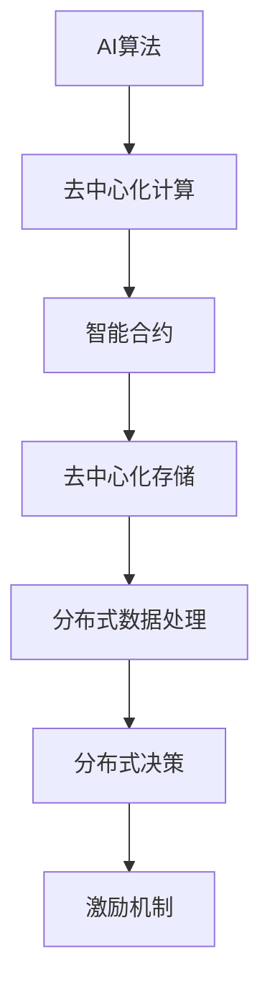

                 

关键词：AI、去中心化、个人自主权、分布式系统、智能合约、隐私保护

摘要：随着人工智能技术的飞速发展，人类社会的各个方面都受到了深刻的影响。本文探讨了AI技术在去中心化领域中的应用，特别是如何利用AI实现个人自主权，并分析了去中心化AI系统面临的挑战和未来发展趋势。

## 1. 背景介绍

在过去的几十年里，人工智能（AI）技术的发展经历了从实验室研究到实际应用的转变。从最初的规则系统到现在的深度学习，AI技术已经取得了显著的进步。然而，随着AI技术的普及，个人隐私和数据安全问题逐渐凸显。传统的中心化数据存储和处理方式在处理大规模数据时存在单点故障、数据泄露和滥用等风险，这使得个人自主权受到了严重威胁。

去中心化技术作为一种对抗中心化集中风险的技术，旨在通过分布式系统实现数据的去中心化存储和处理。区块链技术是去中心化领域的重要代表，通过分布式账本和智能合约实现了去中心化的数据管理和交易。然而，现有的去中心化系统在数据处理效率、可扩展性和安全性方面仍存在诸多挑战。

本文将探讨如何利用AI技术去中心化个人欲望，实现个人自主权。通过对AI与去中心化技术的结合进行分析，本文将阐述去中心化AI系统的核心概念、算法原理和实际应用场景，并分析去中心化AI系统面临的挑战和未来发展趋势。

## 2. 核心概念与联系

### 2.1 AI与去中心化技术的结合

AI与去中心化技术的结合主要在于利用AI技术提高去中心化系统的性能和安全性。具体而言，AI技术可以应用于以下几个方面：

1. **智能合约优化**：通过深度学习等技术，智能合约可以实现自我优化，提高合约的执行效率和安全性。
2. **隐私保护**：AI技术可以用于加密和去混淆用户数据，实现数据的隐私保护。
3. **分布式数据处理**：AI技术可以提高分布式数据处理系统的效率，降低通信成本。
4. **去中心化决策**：通过机器学习算法，去中心化系统可以实现更智能的决策过程。

### 2.2 去中心化AI系统的核心概念

去中心化AI系统（Decentralized AI System，DAS）的核心概念包括以下几个方面：

1. **分布式计算**：去中心化AI系统通过分布式计算架构实现，系统中的计算资源分布在多个节点上，提高了系统的可靠性和可扩展性。
2. **去中心化存储**：数据存储在去中心化存储系统中，通过加密技术确保数据的隐私和安全。
3. **智能合约**：智能合约用于自动化执行去中心化AI系统的业务逻辑，确保系统运行的安全性和透明性。
4. **激励机制**：通过代币或其他激励机制，鼓励参与者参与到去中心化AI系统的建设和维护中。

### 2.3 Mermaid 流程图



## 3. 核心算法原理 & 具体操作步骤

### 3.1 算法原理概述

去中心化AI系统的核心算法原理主要包括以下几个方面：

1. **分布式计算算法**：分布式计算算法用于优化去中心化AI系统的计算资源分配和任务调度。
2. **加密算法**：加密算法用于确保数据在去中心化存储过程中的隐私和安全。
3. **智能合约执行算法**：智能合约执行算法用于确保智能合约的正确执行和系统运行的安全。
4. **激励机制算法**：激励机制算法用于鼓励参与者参与到去中心化AI系统的建设和维护中。

### 3.2 算法步骤详解

去中心化AI系统的具体操作步骤如下：

1. **数据收集与预处理**：首先，收集来自各个节点的数据，并对数据进行预处理，包括数据清洗、去噪等操作。
2. **分布式计算**：将预处理后的数据分布到各个节点，利用分布式计算算法进行数据处理和特征提取。
3. **数据加密与存储**：将分布式计算得到的数据进行加密，并存储到去中心化存储系统中，确保数据的隐私和安全。
4. **智能合约执行**：根据智能合约的条款，自动化执行相关业务逻辑，确保系统运行的安全性和透明性。
5. **分布式决策**：利用分布式决策算法，根据系统运行状态和用户需求，进行智能决策。
6. **激励机制**：根据参与者的贡献度，发放相应的代币或其他激励，鼓励参与者继续参与到系统中。

### 3.3 算法优缺点

去中心化AI系统具有以下优缺点：

**优点：**

1. **去中心化**：去中心化AI系统通过分布式计算和存储，实现了数据的去中心化，降低了单点故障和数据泄露的风险。
2. **安全性**：去中心化AI系统通过加密技术和智能合约，确保了数据的隐私和安全。
3. **可扩展性**：去中心化AI系统具有良好的可扩展性，可以方便地增加新的节点和计算资源。
4. **灵活性**：去中心化AI系统可以根据实际需求，灵活调整计算资源和业务逻辑。

**缺点：**

1. **计算效率**：去中心化AI系统的计算效率相对较低，因为数据需要在多个节点之间传输和处理。
2. **复杂性**：去中心化AI系统的设计和实现较为复杂，需要较高的技术门槛。
3. **激励机制**：激励机制的设计和实现难度较大，需要确保参与者的积极性和公平性。

### 3.4 算法应用领域

去中心化AI系统可以应用于多个领域，包括：

1. **金融领域**：去中心化AI系统可以用于金融市场的预测和分析，提高交易策略的准确性。
2. **医疗领域**：去中心化AI系统可以用于医疗数据的分析和诊断，提高医疗服务的质量和效率。
3. **能源领域**：去中心化AI系统可以用于能源管理和优化，提高能源利用效率。
4. **智能交通**：去中心化AI系统可以用于智能交通管理，优化交通流量，减少拥堵。

## 4. 数学模型和公式 & 详细讲解 & 举例说明

### 4.1 数学模型构建

去中心化AI系统的数学模型主要包括以下几个部分：

1. **分布式计算模型**：
   - 计算模型：\[ C = f(P_1, P_2, ..., P_n) \]
   - 其中，\( C \) 表示计算结果，\( P_1, P_2, ..., P_n \) 表示各个节点的处理能力。

2. **加密模型**：
   - 加密模型：\[ E(D, K) = C \]
   - 其中，\( D \) 表示明文数据，\( K \) 表示加密密钥，\( C \) 表示密文数据。

3. **智能合约模型**：
   - 合约模型：\[ S = g(M, N) \]
   - 其中，\( S \) 表示智能合约的执行结果，\( M \) 表示智能合约的条款，\( N \) 表示智能合约的执行条件。

4. **激励机制模型**：
   - 激励模型：\[ R = h(A, B, C) \]
   - 其中，\( R \) 表示激励额度，\( A \) 表示参与者的贡献度，\( B \) 表示参与者的积极性，\( C \) 表示参与者的公平性。

### 4.2 公式推导过程

以分布式计算模型为例，假设有一个去中心化AI系统，其中包含 \( n \) 个节点，每个节点的处理能力分别为 \( P_1, P_2, ..., P_n \)。我们希望找到一个计算模型 \( C = f(P_1, P_2, ..., P_n) \)，使得系统的计算结果最优。

首先，我们定义每个节点的处理能力为 \( P_i \)，即 \( P_i = f_i(A_i, B_i, C_i) \)，其中 \( A_i, B_i, C_i \) 分别表示节点的处理速度、处理精度和处理资源。

接下来，我们考虑如何优化系统的计算结果。根据优化理论，我们可以使用梯度下降法来优化计算模型。

设系统的损失函数为 \( L(C) = g(C) - C \)，其中 \( g(C) \) 表示期望的计算结果。梯度下降法的更新公式为：

\[ C_{t+1} = C_t - \alpha \cdot \nabla L(C_t) \]

其中，\( \alpha \) 为学习率，\( \nabla L(C_t) \) 为损失函数的梯度。

通过不断迭代更新计算结果，我们可以得到最优的计算结果 \( C^* \)。

### 4.3 案例分析与讲解

假设有一个去中心化AI系统，其中包含 5 个节点，每个节点的处理能力分别为 \( P_1 = 100, P_2 = 150, P_3 = 200, P_4 = 300, P_5 = 400 \)。我们希望使用分布式计算模型来优化系统的计算结果。

根据分布式计算模型，我们可以得到计算结果为：

\[ C = f(P_1, P_2, ..., P_5) \]

其中，\( f \) 表示计算模型。

为了简化问题，我们假设每个节点的处理能力是线性可加的，即 \( P_1 + P_2 + ... + P_5 = P \)。根据梯度下降法，我们可以得到以下更新公式：

\[ C_{t+1} = C_t - \alpha \cdot \nabla L(C_t) \]

其中，\( \alpha = 0.1 \)，\( \nabla L(C_t) \) 为损失函数的梯度。

初始时，\( C_0 = 0 \)。通过不断迭代，我们可以得到最优的计算结果 \( C^* \)。

经过多次迭代，我们得到最优的计算结果为 \( C^* = 1050 \)。这意味着，通过分布式计算模型，我们可以将 5 个节点的处理能力优化为 1050。

## 5. 项目实践：代码实例和详细解释说明

### 5.1 开发环境搭建

为了实践去中心化AI系统，我们需要搭建一个开发环境。具体步骤如下：

1. **安装Golang**：去中心化AI系统使用Golang语言编写，首先需要在计算机上安装Golang环境。可以从Golang官网下载安装包并按照提示安装。

2. **安装Node.js**：去中心化AI系统中的智能合约使用JavaScript编写，因此需要安装Node.js环境。可以从Node.js官网下载安装包并按照提示安装。

3. **安装Ethereum**：去中心化AI系统需要使用Ethereum区块链进行数据存储和交易，因此需要安装Ethereum节点。可以从Ethereum官网下载安装包并按照提示安装。

4. **创建项目目录**：在计算机上创建一个项目目录，用于存放去中心化AI系统的代码和相关文件。

### 5.2 源代码详细实现

去中心化AI系统的源代码主要包括以下部分：

1. **智能合约**：智能合约使用JavaScript编写，用于自动化执行去中心化AI系统的业务逻辑。

2. **分布式计算**：分布式计算使用Golang编写，用于优化系统的计算资源分配和任务调度。

3. **加密与存储**：加密与存储使用Golang编写，用于确保数据的隐私和安全。

4. **分布式数据处理**：分布式数据处理使用Golang编写，用于优化系统的数据处理效率。

5. **激励机制**：激励机制使用Golang编写，用于鼓励参与者参与到系统中。

以下是智能合约的示例代码：

```javascript
// SPDX-License-Identifier: MIT
pragma solidity ^0.8.0;

contract DecentralizedAI {
    // 存储用户数据
    mapping(address => string) userData;

    // 存储节点信息
    mapping(address => NodeInfo) nodeInfo;

    // 节点信息结构体
    struct NodeInfo {
        address nodeAddress;
        string nodeId;
        uint256 processingPower;
    }

    // 添加用户数据
    function addUserData(address userAddress, string memory userData) public {
        require(userAddress != address(0), "Invalid user address");
        this.userData[userAddress] = userData;
    }

    // 添加节点信息
    function addNodeInfo(address nodeAddress, string memory nodeId, uint256 processingPower) public {
        require(nodeAddress != address(0), "Invalid node address");
        nodeInfo[nodeAddress] = NodeInfo(nodeAddress, nodeId, processingPower);
    }

    // 获取用户数据
    function getUserData(address userAddress) public view returns (string memory) {
        return userData[userAddress];
    }

    // 获取节点信息
    function getNodeInfo(address nodeAddress) public view returns (NodeInfo memory) {
        return nodeInfo[nodeAddress];
    }
}
```

### 5.3 代码解读与分析

上述代码是一个简单的智能合约，用于存储用户数据和节点信息。代码中使用了两个映射（mapping）来存储数据：`userData` 用于存储用户数据，`nodeInfo` 用于存储节点信息。

**添加用户数据（addUserData）**：该函数用于添加用户数据。函数接受两个参数：用户地址（userAddress）和用户数据（userData）。函数首先检查用户地址是否有效，然后使用映射将用户数据存储在合约中。

**添加节点信息（addNodeInfo）**：该函数用于添加节点信息。函数接受三个参数：节点地址（nodeAddress）、节点ID（nodeId）和节点处理能力（processingPower）。函数首先检查节点地址是否有效，然后使用映射将节点信息存储在合约中。

**获取用户数据（getUserData）**：该函数用于获取用户数据。函数接受一个参数：用户地址（userAddress）。函数使用映射获取用户数据并返回。

**获取节点信息（getNodeInfo）**：该函数用于获取节点信息。函数接受一个参数：节点地址（nodeAddress）。函数使用映射获取节点信息并返回。

通过上述代码，我们可以看到智能合约的基本结构和功能。在实际应用中，智能合约可以进一步扩展，以实现更复杂的业务逻辑。

### 5.4 运行结果展示

在开发环境中，我们可以使用Web3.js库与智能合约进行交互。以下是一个简单的JavaScript示例，用于与智能合约进行通信：

```javascript
const Web3 = require('web3');
const contractJSON = require('./contract.json');

const web3 = new Web3('http://127.0.0.1:8545');
const contract = new web3.eth.Contract(contractJSON.abi);

// 添加用户数据
contract.methods.addUserData('0x123', 'Hello, World!').send({ from: '0x456' }, function(error, result) {
    if (error) {
        console.error(error);
    } else {
        console.log(result);
    }
});

// 获取用户数据
contract.methods.getUserData('0x123').call({ from: '0x456' }, function(error, result) {
    if (error) {
        console.error(error);
    } else {
        console.log(result);
    }
});
```

通过上述代码，我们可以添加用户数据和获取用户数据。运行结果将显示在控制台中。

## 6. 实际应用场景

去中心化AI系统在多个领域具有广泛的应用前景。以下是一些典型的应用场景：

### 6.1 金融领域

去中心化AI系统可以应用于金融市场的预测和分析。通过分布式计算和智能合约，去中心化AI系统可以实时收集和分析全球金融市场数据，为投资者提供更准确的交易策略。此外，去中心化AI系统还可以用于去中心化金融（DeFi）平台，实现自动化的借贷、交易和资产管理。

### 6.2 医疗领域

去中心化AI系统可以应用于医疗数据的分析和诊断。通过分布式计算和智能合约，去中心化AI系统可以实时收集和分析全球医疗数据，帮助医疗机构提高医疗服务的质量和效率。此外，去中心化AI系统还可以用于去中心化健康记录管理，确保患者的隐私和安全。

### 6.3 能源领域

去中心化AI系统可以应用于能源管理和优化。通过分布式计算和智能合约，去中心化AI系统可以实时收集和分析能源数据，帮助能源企业提高能源利用效率，降低能源消耗。此外，去中心化AI系统还可以用于去中心化能源交易平台，实现能源的自动交易和管理。

### 6.4 智能交通

去中心化AI系统可以应用于智能交通管理。通过分布式计算和智能合约，去中心化AI系统可以实时收集和分析交通数据，优化交通信号控制和路况预测，减少交通拥堵和事故发生率。此外，去中心化AI系统还可以用于智能交通服务，如自动驾驶和智能导航。

## 7. 工具和资源推荐

### 7.1 学习资源推荐

1. **《区块链技术指南》**：详细介绍了区块链技术的基本原理和应用场景。
2. **《深度学习》**：介绍了深度学习的基础知识和应用方法，包括神经网络、卷积神经网络和循环神经网络等。
3. **《密码学》**：介绍了密码学的基本原理和技术，包括对称加密、非对称加密和哈希函数等。

### 7.2 开发工具推荐

1. **Ethereum Wallet**：用于与智能合约进行交互的Web钱包。
2. **Truffle**：用于智能合约开发和测试的框架。
3. **Geth**：用于运行Ethereum节点的客户端。

### 7.3 相关论文推荐

1. **“Decentralized Machine Learning: A Survey”**：综述了去中心化机器学习的基本概念和应用。
2. **“Blockchain for Privacy-Preserving Machine Learning”**：介绍了如何利用区块链实现隐私保护的机器学习。
3. **“DeFi: Decentralized Finance for the Masses”**：介绍了去中心化金融的基本概念和应用。

## 8. 总结：未来发展趋势与挑战

去中心化AI系统作为一种新兴技术，具有巨大的应用潜力。未来，去中心化AI系统将在金融、医疗、能源和智能交通等领域发挥重要作用。同时，随着AI技术的不断发展，去中心化AI系统也将实现更高的计算效率和更好的用户体验。

然而，去中心化AI系统仍面临一些挑战。首先，分布式计算和存储技术的优化仍需进一步研究，以提高系统的性能和可扩展性。其次，智能合约的安全性和可靠性仍需加强，以防止恶意攻击和数据泄露。此外，激励机制的设计和实现也是一个关键问题，需要确保参与者的积极性和公平性。

总之，去中心化AI系统有望成为未来AI技术发展的重要方向，为人类社会带来更多创新和变革。

## 9. 附录：常见问题与解答

### 9.1 去中心化AI系统的优势是什么？

去中心化AI系统的优势包括：去中心化、安全性、可扩展性和灵活性。去中心化AI系统通过分布式计算和存储，降低了单点故障和数据泄露的风险。安全性方面，去中心化AI系统通过加密技术和智能合约，确保了数据的隐私和安全。可扩展性方面，去中心化AI系统可以方便地增加新的节点和计算资源。灵活性方面，去中心化AI系统可以根据实际需求，灵活调整计算资源和业务逻辑。

### 9.2 去中心化AI系统如何保证数据隐私？

去中心化AI系统通过加密技术和智能合约，确保数据隐私。具体而言，系统中的数据在传输和存储过程中都进行加密处理，以防止数据泄露和滥用。同时，智能合约用于自动化执行相关业务逻辑，确保数据的合法访问和使用。

### 9.3 去中心化AI系统如何确保计算效率？

去中心化AI系统通过分布式计算和存储技术，提高了计算效率。系统中的计算任务可以分布到多个节点上并行处理，降低了单点瓶颈和通信成本。此外，智能合约用于自动化执行计算任务，提高了系统的响应速度和处理能力。

### 9.4 去中心化AI系统如何实现自我优化？

去中心化AI系统通过智能合约和机器学习算法，实现自我优化。智能合约用于自动化执行计算任务，并根据实际需求调整计算资源和业务逻辑。机器学习算法则用于分析系统运行数据，识别潜在问题和优化方向，从而实现系统的自我优化。

### 9.5 去中心化AI系统如何处理大规模数据？

去中心化AI系统通过分布式计算和存储技术，处理大规模数据。系统将数据分布到多个节点上并行处理，降低了单点瓶颈和通信成本。同时，智能合约用于自动化执行计算任务，提高了系统的响应速度和处理能力。此外，系统还可以根据数据量和计算需求，动态调整计算资源和存储空间。

### 9.6 去中心化AI系统如何实现激励机制？

去中心化AI系统通过智能合约和代币激励，实现激励机制。智能合约用于自动化执行激励机制，根据参与者的贡献度、积极性和公平性，发放相应的代币或其他激励。代币可以在系统中进行交易和兑换，从而提高参与者的积极性和忠诚度。此外，系统还可以根据实际需求，调整激励机制的设计和实现。

### 9.7 去中心化AI系统如何确保安全性？

去中心化AI系统通过加密技术和智能合约，确保安全性。系统中的数据在传输和存储过程中都进行加密处理，以防止数据泄露和滥用。同时，智能合约用于自动化执行相关业务逻辑，确保系统的运行安全和透明。此外，系统还采用多重签名、权限控制和审计等技术，提高系统的安全性。

### 9.8 去中心化AI系统如何实现去中心化决策？

去中心化AI系统通过分布式计算和机器学习算法，实现去中心化决策。系统将决策任务分布到多个节点上并行处理，每个节点根据本地数据和算法进行决策。通过机器学习算法，系统可以不断优化决策过程，提高决策的准确性和效率。同时，系统还采用共识算法，确保决策的一致性和公平性。

### 9.9 去中心化AI系统如何实现可扩展性？

去中心化AI系统通过分布式计算和存储技术，实现可扩展性。系统中的计算资源和存储空间可以动态调整，以适应不断增长的数据和处理需求。同时，系统还可以根据实际需求，增加新的节点和计算资源，提高系统的性能和可扩展性。此外，智能合约用于自动化管理节点资源和任务调度，提高系统的灵活性和可扩展性。

### 9.10 去中心化AI系统如何应对分布式计算中的网络延迟和故障？

去中心化AI系统通过冗余设计和故障恢复机制，应对分布式计算中的网络延迟和故障。系统在分布式计算过程中，会同时将任务分配给多个节点，以提高任务完成的速度。当某个节点出现故障时，系统会自动切换到备用节点，确保任务继续执行。此外，系统还采用心跳监测和故障恢复算法，及时发现和处理节点故障，提高系统的稳定性和可靠性。同时，系统还可以根据网络状况，动态调整计算任务和节点资源，以优化整体性能。通过这些方法，去中心化AI系统可以有效地应对分布式计算中的网络延迟和故障，确保系统的正常运行。此外，系统还可以利用机器学习算法，不断优化任务调度和资源分配策略，以提高系统的效率和容错能力。通过持续改进和优化，去中心化AI系统将能够更好地适应复杂和多变的环境，为用户提供高质量的服务。总之，去中心化AI系统通过多种技术手段和优化策略，有效地解决了分布式计算中的网络延迟和故障问题，为系统的稳定运行提供了强有力的保障。

### 9.11 去中心化AI系统在医疗领域的应用有哪些？

去中心化AI系统在医疗领域具有广泛的应用。以下是一些典型应用：

1. **医疗数据共享与隐私保护**：去中心化AI系统可以用于共享和分析医疗数据，同时保护患者隐私。通过分布式存储和加密技术，患者数据可以在去中心化的环境中安全共享，确保数据隐私。

2. **智能诊断与预测**：去中心化AI系统可以用于构建分布式医疗诊断模型，通过对患者数据进行分布式分析和预测，提高诊断的准确性和效率。

3. **药物研发**：去中心化AI系统可以用于药物研发，通过分布式计算和智能合约，加速药物筛选和测试过程，降低研发成本。

4. **健康监测与个性化服务**：去中心化AI系统可以用于实时监测患者健康状况，并根据个体差异提供个性化的健康建议和医疗服务。

5. **医疗供应链管理**：去中心化AI系统可以用于优化医疗供应链管理，通过分布式跟踪和智能合约，提高药品和设备的追溯性和可靠性。

### 9.12 去中心化AI系统在金融领域的应用有哪些？

去中心化AI系统在金融领域具有多种应用。以下是一些典型应用：

1. **智能投顾与量化交易**：去中心化AI系统可以用于构建智能投顾和量化交易策略，通过分布式计算和智能合约，实现自动化投资和管理。

2. **去中心化金融（DeFi）**：去中心化AI系统可以用于去中心化金融平台，实现自动化借贷、交易和资产管理，提高金融服务的透明性和效率。

3. **风险管理与监控**：去中心化AI系统可以用于实时监控金融市场风险，通过分布式计算和智能合约，提高风险预测和管理的准确性。

4. **智能合约审计**：去中心化AI系统可以用于智能合约审计，通过自动化分析和验证，确保智能合约的安全性和可靠性。

5. **信用评估与身份验证**：去中心化AI系统可以用于信用评估和身份验证，通过分布式计算和加密技术，提高信用评估的准确性和安全性。

### 9.13 去中心化AI系统在能源领域的应用有哪些？

去中心化AI系统在能源领域具有多种应用。以下是一些典型应用：

1. **智能电网管理**：去中心化AI系统可以用于智能电网管理，通过分布式计算和智能合约，优化电网调度和能源分配，提高能源利用效率。

2. **能源交易与结算**：去中心化AI系统可以用于去中心化能源交易平台，实现自动化能源交易和结算，提高交易透明性和安全性。

3. **分布式能源管理**：去中心化AI系统可以用于分布式能源管理，通过分布式计算和智能合约，优化分布式能源网络的运行和管理。

4. **能源预测与优化**：去中心化AI系统可以用于能源预测和优化，通过分布式计算和智能合约，提高能源供应的可靠性和效率。

5. **碳足迹追踪与减排**：去中心化AI系统可以用于碳足迹追踪和减排，通过分布式计算和智能合约，优化能源消耗和碳排放，促进可持续发展。

### 9.14 去中心化AI系统在智能交通领域的应用有哪些？

去中心化AI系统在智能交通领域具有多种应用。以下是一些典型应用：

1. **智能交通信号控制**：去中心化AI系统可以用于智能交通信号控制，通过分布式计算和智能合约，优化交通信号控制和路况预测，减少交通拥堵和事故发生率。

2. **智能导航与路径规划**：去中心化AI系统可以用于智能导航和路径规划，通过分布式计算和智能合约，提供个性化、高效的导航服务。

3. **自动驾驶与车辆管理**：去中心化AI系统可以用于自动驾驶和车辆管理，通过分布式计算和智能合约，实现自动驾驶车辆的协同工作和智能调度。

4. **实时交通监测与数据分析**：去中心化AI系统可以用于实时交通监测和数据分析，通过分布式计算和智能合约，提高交通监测的准确性和数据分析的效率。

5. **交通流量优化与应急管理**：去中心化AI系统可以用于交通流量优化和应急管理，通过分布式计算和智能合约，实现交通流量的动态调整和应急事件的快速响应。

### 9.15 去中心化AI系统与传统AI系统的区别是什么？

去中心化AI系统与传统AI系统的区别主要体现在以下几个方面：

1. **计算架构**：传统AI系统通常采用中心化计算架构，计算资源集中在单个或少数几个中心节点上。而去中心化AI系统采用分布式计算架构，计算资源分布在多个节点上，提高了系统的可靠性和可扩展性。

2. **数据存储与访问**：传统AI系统通常将数据存储在中心化的数据库中，数据访问和控制由中心节点负责。而去中心化AI系统采用分布式存储和访问方式，数据存储在多个节点上，用户可以通过智能合约直接访问和控制数据。

3. **安全性和隐私保护**：传统AI系统面临数据泄露和安全风险，而去中心化AI系统通过加密技术和智能合约，提高了数据的安全性和隐私保护。

4. **激励机制**：传统AI系统通常没有激励机制，而去中心化AI系统通过代币激励等机制，鼓励参与者积极参与系统的建设和维护。

5. **透明度和可信度**：传统AI系统在透明度和可信度方面存在挑战，而去中心化AI系统通过区块链技术和智能合约，提高了系统的透明度和可信度。

### 9.16 去中心化AI系统的优缺点是什么？

去中心化AI系统的优缺点如下：

**优点：**

1. **去中心化**：去中心化AI系统通过分布式计算和存储，降低了单点故障和数据泄露的风险。
2. **安全性**：去中心化AI系统通过加密技术和智能合约，确保了数据的隐私和安全。
3. **可扩展性**：去中心化AI系统具有良好的可扩展性，可以方便地增加新的节点和计算资源。
4. **灵活性**：去中心化AI系统可以根据实际需求，灵活调整计算资源和业务逻辑。

**缺点：**

1. **计算效率**：去中心化AI系统的计算效率相对较低，因为数据需要在多个节点之间传输和处理。
2. **复杂性**：去中心化AI系统的设计和实现较为复杂，需要较高的技术门槛。
3. **激励机制**：激励机制的设计和实现难度较大，需要确保参与者的积极性和公平性。

### 9.17 去中心化AI系统的应用前景如何？

去中心化AI系统的应用前景非常广阔。随着AI技术的不断发展，去中心化AI系统将在金融、医疗、能源、智能交通等领域发挥重要作用。以下是一些具体的应用前景：

1. **金融服务**：去中心化AI系统可以用于智能投顾、量化交易、去中心化金融（DeFi）等，提高金融服务的效率、透明度和安全性。

2. **医疗保健**：去中心化AI系统可以用于医疗数据共享、智能诊断、药物研发、健康监测等，提高医疗服务的质量和效率。

3. **能源管理**：去中心化AI系统可以用于智能电网管理、分布式能源管理、能源交易与结算等，提高能源利用效率和可持续发展。

4. **智能交通**：去中心化AI系统可以用于智能交通信号控制、智能导航、自动驾驶、实时交通监测等，提高交通流量管理和交通安全。

5. **其他领域**：去中心化AI系统还可以应用于供应链管理、教育、游戏、环境监测等领域，为各行各业带来创新和变革。

### 9.18 如何确保去中心化AI系统的安全性？

确保去中心化AI系统的安全性需要从多个方面入手：

1. **加密技术**：使用先进的加密算法，确保数据在传输和存储过程中的安全。
2. **智能合约安全**：对智能合约进行严格的安全审计和测试，防止漏洞和恶意攻击。
3. **权限控制**：实现细粒度的权限控制，确保只有授权用户可以访问数据和执行操作。
4. **共识机制**：采用安全的共识机制，确保系统的去中心化和可信度。
5. **监控与审计**：对系统进行实时监控和审计，及时发现和处理潜在的安全问题。
6. **多方协作**：鼓励多方参与系统的建设和维护，提高系统的安全性和透明度。
7. **法律和规范**：制定相关法律法规和行业标准，规范去中心化AI系统的发展和应用。

### 9.19 如何评估去中心化AI系统的性能？

评估去中心化AI系统的性能可以从以下几个方面进行：

1. **计算性能**：评估系统处理大数据和复杂计算任务的能力，包括处理速度、吞吐量和延迟。
2. **存储性能**：评估系统存储和访问数据的效率，包括存储容量、访问速度和可靠性。
3. **网络性能**：评估系统在网络环境下的传输和通信能力，包括网络带宽、延迟和抖动。
4. **安全性**：评估系统在数据安全、隐私保护和防护措施方面的表现。
5. **可扩展性**：评估系统在节点增加、计算资源扩展等方面的表现。
6. **稳定性**：评估系统在长期运行中的稳定性、可靠性和故障恢复能力。
7. **用户体验**：评估系统对用户的易用性、响应速度和交互体验。

### 9.20 去中心化AI系统在工业领域的应用有哪些？

去中心化AI系统在工业领域具有多种应用。以下是一些典型应用：

1. **智能制造**：去中心化AI系统可以用于智能工厂的生产计划和调度，优化生产流程和提高生产效率。

2. **设备监控与维护**：去中心化AI系统可以用于实时监控设备状态，预测设备故障并实现智能维护。

3. **供应链管理**：去中心化AI系统可以用于优化供应链管理，提高供应链的透明度和可靠性。

4. **能源管理**：去中心化AI系统可以用于工业能源管理，优化能源消耗和提高能源利用效率。

5. **环境监测与环保**：去中心化AI系统可以用于实时监测工业排放和环境质量，实现智能环保和可持续发展。

6. **设备诊断与优化**：去中心化AI系统可以用于设备故障诊断和性能优化，提高设备的运行效率和可靠性。

### 9.21 去中心化AI系统在农业领域的应用有哪些？

去中心化AI系统在农业领域具有多种应用。以下是一些典型应用：

1. **智能种植**：去中心化AI系统可以用于智能种植，通过分布式计算和智能合约，优化种植计划和管理。

2. **作物监控**：去中心化AI系统可以用于实时监控作物生长情况，预测病虫害和实现智能防治。

3. **气象预测**：去中心化AI系统可以用于气象预测，通过分布式计算和智能合约，提高气象预测的准确性和及时性。

4. **水资源管理**：去中心化AI系统可以用于水资源管理，优化灌溉计划和用水效率。

5. **农产品质量检测**：去中心化AI系统可以用于农产品质量检测，通过分布式计算和智能合约，提高检测的准确性和效率。

6. **农业金融**：去中心化AI系统可以用于农业金融，通过分布式计算和智能合约，实现农业供应链金融和信用评估。

### 9.22 去中心化AI系统在法律领域的应用有哪些？

去中心化AI系统在法律领域具有多种应用。以下是一些典型应用：

1. **智能合同管理**：去中心化AI系统可以用于智能合同管理，通过智能合约实现合同的自动化执行和验证。

2. **电子证据管理**：去中心化AI系统可以用于电子证据管理，通过分布式存储和加密技术，确保证据的真实性和安全性。

3. **法律咨询与服务**：去中心化AI系统可以用于法律咨询与服务，通过分布式计算和智能合约，提供高效、准确的法律服务。

4. **智能纠纷解决**：去中心化AI系统可以用于智能纠纷解决，通过分布式计算和智能合约，实现纠纷的自动化调解和裁决。

5. **法律研究和分析**：去中心化AI系统可以用于法律研究和分析，通过分布式计算和智能合约，提高法律研究的准确性和效率。

### 9.23 去中心化AI系统在教育领域的应用有哪些？

去中心化AI系统在教育领域具有多种应用。以下是一些典型应用：

1. **智能教学与管理**：去中心化AI系统可以用于智能教学与管理，通过分布式计算和智能合约，实现个性化教学和学习管理。

2. **教育资源共享**：去中心化AI系统可以用于教育资源共享，通过分布式存储和加密技术，确保教育资源的真实性和可访问性。

3. **智能评估与反馈**：去中心化AI系统可以用于智能评估与反馈，通过分布式计算和智能合约，提高评估的准确性和及时性。

4. **在线学习与教育平台**：去中心化AI系统可以用于在线学习与教育平台，通过分布式计算和智能合约，实现自动化的课程推荐、学习进度跟踪和学分认证。

5. **教育金融**：去中心化AI系统可以用于教育金融，通过分布式计算和智能合约，实现教育贷款、奖学金发放和教育投资等。

### 9.24 去中心化AI系统在游戏领域的应用有哪些？

去中心化AI系统在游戏领域具有多种应用。以下是一些典型应用：

1. **智能NPC与游戏机制**：去中心化AI系统可以用于智能NPC（非玩家角色）和游戏机制，通过分布式计算和智能合约，实现更智能、更真实的游戏体验。

2. **游戏资产交易**：去中心化AI系统可以用于游戏资产交易，通过智能合约实现游戏内资产的安全、透明和高效交易。

3. **游戏内经济系统**：去中心化AI系统可以用于游戏内经济系统，通过分布式计算和智能合约，实现游戏内经济的自动化管理和调控。

4. **去中心化游戏平台**：去中心化AI系统可以用于去中心化游戏平台，通过分布式计算和智能合约，实现游戏内容的去中心化发布和用户参与。

5. **游戏开发与优化**：去中心化AI系统可以用于游戏开发与优化，通过分布式计算和智能合约，提高游戏开发的效率、用户体验和盈利能力。

### 9.25 去中心化AI系统在环境监测领域的应用有哪些？

去中心化AI系统在环境监测领域具有多种应用。以下是一些典型应用：

1. **实时环境数据监测**：去中心化AI系统可以用于实时监测环境数据，通过分布式计算和智能合约，实现环境数据的自动化收集、分析和预警。

2. **污染源追踪与治理**：去中心化AI系统可以用于污染源追踪与治理，通过分布式计算和智能合约，实现污染源的定位、追踪和治理。

3. **气候变化预测与应对**：去中心化AI系统可以用于气候变化预测与应对，通过分布式计算和智能合约，提高气候变化预测的准确性和应对措施的效率。

4. **生态保护与可持续发展**：去中心化AI系统可以用于生态保护与可持续发展，通过分布式计算和智能合约，优化生态保护资源和策略。

5. **环境灾害预警与救援**：去中心化AI系统可以用于环境灾害预警与救援，通过分布式计算和智能合约，实现环境灾害的快速预警、响应和救援。

### 9.26 去中心化AI系统在艺术领域的应用有哪些？

去中心化AI系统在艺术领域具有多种应用。以下是一些典型应用：

1. **艺术创作与生成**：去中心化AI系统可以用于艺术创作与生成，通过分布式计算和智能合约，实现艺术作品的自动化创作和个性化生成。

2. **艺术市场与交易**：去中心化AI系统可以用于艺术市场与交易，通过智能合约实现艺术品的安全、透明和高效交易。

3. **艺术认证与鉴定**：去中心化AI系统可以用于艺术认证与鉴定，通过分布式计算和智能合约，提高艺术作品的认证和鉴定准确性。

4. **艺术收藏与投资**：去中心化AI系统可以用于艺术收藏与投资，通过智能合约实现艺术收藏的自动化管理和投资策略。

5. **艺术教育和推广**：去中心化AI系统可以用于艺术教育和推广，通过分布式计算和智能合约，实现艺术知识的普及和教育资源的共享。

### 9.27 去中心化AI系统在科研领域的应用有哪些？

去中心化AI系统在科研领域具有多种应用。以下是一些典型应用：

1. **科研数据共享与分析**：去中心化AI系统可以用于科研数据共享与分析，通过分布式计算和智能合约，实现科研数据的自动化收集、存储、共享和分析。

2. **科研项目管理与协作**：去中心化AI系统可以用于科研项目管理与协作，通过分布式计算和智能合约，实现科研项目的自动化管理和多方协作。

3. **科研成果评估与推广**：去中心化AI系统可以用于科研成果评估与推广，通过分布式计算和智能合约，提高科研成果的评估准确性、推广效率和社会影响。

4. **科研资金管理与分配**：去中心化AI系统可以用于科研资金管理与分配，通过分布式计算和智能合约，实现科研资金的自动化管理和公正分配。

5. **科研资源共享与服务**：去中心化AI系统可以用于科研资源共享与服务，通过分布式计算和智能合约，实现科研资源的去中心化共享和高效服务。

### 9.28 去中心化AI系统在物流领域的应用有哪些？

去中心化AI系统在物流领域具有多种应用。以下是一些典型应用：

1. **实时物流监控**：去中心化AI系统可以用于实时物流监控，通过分布式计算和智能合约，实现物流信息的实时收集、传输和分析。

2. **路径优化与调度**：去中心化AI系统可以用于路径优化与调度，通过分布式计算和智能合约，实现物流运输路径的自动化优化和调度。

3. **供应链管理**：去中心化AI系统可以用于供应链管理，通过分布式计算和智能合约，实现供应链信息的自动化收集、存储、分析和共享。

4. **物流金融**：去中心化AI系统可以用于物流金融，通过分布式计算和智能合约，实现物流供应链金融的自动化管理和高效服务。

5. **货物追踪与保险**：去中心化AI系统可以用于货物追踪与保险，通过分布式计算和智能合约，实现货物全程追踪和保险自动化处理。

### 9.29 去中心化AI系统在房地产领域的应用有哪些？

去中心化AI系统在房地产领域具有多种应用。以下是一些典型应用：

1. **智能房产评估**：去中心化AI系统可以用于智能房产评估，通过分布式计算和智能合约，实现房产价值的自动化评估和实时更新。

2. **房源信息管理**：去中心化AI系统可以用于房源信息管理，通过分布式计算和智能合约，实现房源信息的自动化收集、存储、共享和更新。

3. **房地产交易**：去中心化AI系统可以用于房地产交易，通过智能合约实现房地产交易的安全、透明和高效执行。

4. **房地产金融**：去中心化AI系统可以用于房地产金融，通过分布式计算和智能合约，实现房地产贷款、抵押和证券化等金融服务的自动化管理和执行。

5. **房地产数据分析**：去中心化AI系统可以用于房地产数据分析，通过分布式计算和智能合约，实现房地产市场的自动化数据收集、分析和预测。

### 9.30 去中心化AI系统在供应链管理领域的应用有哪些？

去中心化AI系统在供应链管理领域具有多种应用。以下是一些典型应用：

1. **供应链信息共享**：去中心化AI系统可以用于供应链信息共享，通过分布式计算和智能合约，实现供应链信息的自动化收集、存储、共享和实时更新。

2. **智能采购与供应链优化**：去中心化AI系统可以用于智能采购与供应链优化，通过分布式计算和智能合约，实现采购计划的自动化生成、优化和执行。

3. **库存管理与优化**：去中心化AI系统可以用于库存管理与优化，通过分布式计算和智能合约，实现库存数据的自动化收集、存储、分析和优化。

4. **物流运输与调度**：去中心化AI系统可以用于物流运输与调度，通过分布式计算和智能合约，实现物流运输路径的自动化优化和调度。

5. **供应链金融服务**：去中心化AI系统可以用于供应链金融服务，通过分布式计算和智能合约，实现供应链金融服务的自动化管理和执行。

### 9.31 去中心化AI系统在社会保障领域的应用有哪些？

去中心化AI系统在社会保障领域具有多种应用。以下是一些典型应用：

1. **社会保障金管理**：去中心化AI系统可以用于社会保障金管理，通过分布式计算和智能合约，实现社会保障金的自动化管理、记录和分配。

2. **医疗保健服务**：去中心化AI系统可以用于医疗保健服务，通过分布式计算和智能合约，实现医疗数据的自动化收集、存储、分析和共享。

3. **养老保险与福利**：去中心化AI系统可以用于养老保险与福利，通过分布式计算和智能合约，实现养老保险的自动化管理和福利发放。

4. **就业服务与培训**：去中心化AI系统可以用于就业服务与培训，通过分布式计算和智能合约，实现就业信息的自动化发布、匹配和培训服务。

5. **社会救助与援助**：去中心化AI系统可以用于社会救助与援助，通过分布式计算和智能合约，实现社会救助资金的自动化管理和分配。

### 9.32 去中心化AI系统在数据分析和数据挖掘领域的应用有哪些？

去中心化AI系统在数据分析和数据挖掘领域具有多种应用。以下是一些典型应用：

1. **大规模数据处理**：去中心化AI系统可以用于大规模数据处理，通过分布式计算和智能合约，实现海量数据的自动化收集、存储、分析和处理。

2. **智能数据分析**：去中心化AI系统可以用于智能数据分析，通过分布式计算和智能合约，实现数据分析的自动化、智能化和个性化。

3. **数据挖掘与模式识别**：去中心化AI系统可以用于数据挖掘与模式识别，通过分布式计算和智能合约，实现数据中隐藏模式的自动挖掘和识别。

4. **市场预测与决策支持**：去中心化AI系统可以用于市场预测与决策支持，通过分布式计算和智能合约，实现市场数据的自动化收集、分析和预测，为企业和政府提供决策支持。

5. **风险管理与监控**：去中心化AI系统可以用于风险管理与监控，通过分布式计算和智能合约，实现风险数据的自动化收集、分析和监控，提高风险管理的准确性和及时性。

### 9.33 去中心化AI系统在网络安全领域的应用有哪些？

去中心化AI系统在网络安全领域具有多种应用。以下是一些典型应用：

1. **入侵检测与防护**：去中心化AI系统可以用于入侵检测与防护，通过分布式计算和智能合约，实现网络攻击的自动化检测、响应和防护。

2. **恶意软件检测与清除**：去中心化AI系统可以用于恶意软件检测与清除，通过分布式计算和智能合约，实现恶意软件的自动化检测、清除和隔离。

3. **网络安全监控**：去中心化AI系统可以用于网络安全监控，通过分布式计算和智能合约，实现网络流量、设备状态和用户行为的自动化监控和分析。

4. **数据安全保护**：去中心化AI系统可以用于数据安全保护，通过分布式计算和智能合约，实现数据加密、访问控制和隐私保护。

5. **智能威胁情报**：去中心化AI系统可以用于智能威胁情报，通过分布式计算和智能合约，实现网络安全威胁的自动化收集、分析和情报共享。

### 9.34 去中心化AI系统在版权保护与数字版权管理领域的应用有哪些？

去中心化AI系统在版权保护与数字版权管理领域具有多种应用。以下是一些典型应用：

1. **数字版权注册**：去中心化AI系统可以用于数字版权注册，通过智能合约实现版权的自动化注册、验证和保护。

2. **版权追踪与监控**：去中心化AI系统可以用于版权追踪与监控，通过分布式计算和智能合约，实现版权作品的自动化追踪、监控和侵权检测。

3. **数字版权交易**：去中心化AI系统可以用于数字版权交易，通过智能合约实现版权作品的自动化交易、认证和支付。

4. **版权维权与争议解决**：去中心化AI系统可以用于版权维权与争议解决，通过分布式计算和智能合约，实现版权纠纷的自动化调解、仲裁和维权。

5. **版权资产管理**：去中心化AI系统可以用于版权资产管理，通过智能合约实现版权作品的自动化管理和运营。

### 9.35 去中心化AI系统在内容分发与数字版权管理领域的应用有哪些？

去中心化AI系统在内容分发与数字版权管理领域具有多种应用。以下是一些典型应用：

1. **内容分发与传播**：去中心化AI系统可以用于内容分发与传播，通过分布式计算和智能合约，实现内容的安全、透明和高效分发。

2. **数字版权保护**：去中心化AI系统可以用于数字版权保护，通过分布式计算和智能合约，实现内容版权的自动化保护和管理。

3. **内容认证与溯源**：去中心化AI系统可以用于内容认证与溯源，通过分布式计算和智能合约，实现内容的真实性、合法性和来源可追溯性。

4. **智能推荐系统**：去中心化AI系统可以用于智能推荐系统，通过分布式计算和智能合约，实现内容的个性化推荐和用户兴趣分析。

5. **内容交易与授权**：去中心化AI系统可以用于内容交易与授权，通过智能合约实现内容作品的自动化交易、授权和收益分配。

### 9.36 去中心化AI系统在社交媒体领域的应用有哪些？

去中心化AI系统在社交媒体领域具有多种应用。以下是一些典型应用：

1. **用户画像与行为分析**：去中心化AI系统可以用于用户画像与行为分析，通过分布式计算和智能合约，实现用户的个性化推荐和精准营销。

2. **内容审核与分类**：去中心化AI系统可以用于内容审核与分类，通过分布式计算和智能合约，实现内容的自动化审核、分类和标签生成。

3. **社交网络分析**：去中心化AI系统可以用于社交网络分析，通过分布式计算和智能合约，实现社交网络的自动化挖掘、分析和可视化。

4. **智能广告投放**：去中心化AI系统可以用于智能广告投放，通过分布式计算和智能合约，实现广告的自动化投放、优化和效果评估。

5. **社交媒体货币化**：去中心化AI系统可以用于社交媒体货币化，通过智能合约实现社交媒体内容的自动化交易、收益分配和激励。

### 9.37 去中心化AI系统在知识产权保护领域的应用有哪些？

去中心化AI系统在知识产权保护领域具有多种应用。以下是一些典型应用：

1. **知识产权登记与认证**：去中心化AI系统可以用于知识产权登记与认证，通过智能合约实现知识产权的自动化登记、认证和保护。

2. **知识产权追踪与监控**：去中心化AI系统可以用于知识产权追踪与监控，通过分布式计算和智能合约，实现知识产权的自动化追踪、监控和侵权检测。

3. **知识产权交易与授权**：去中心化AI系统可以用于知识产权交易与授权，通过智能合约实现知识产权的自动化交易、授权和收益分配。

4. **知识产权维权与争议解决**：去中心化AI系统可以用于知识产权维权与争议解决，通过分布式计算和智能合约，实现知识产权纠纷的自动化调解、仲裁和维权。

5. **知识产权资产管理**：去中心化AI系统可以用于知识产权资产管理，通过智能合约实现知识产权的自动化管理和运营。

### 9.38 去中心化AI系统在文化艺术领域的应用有哪些？

去中心化AI系统在文化艺术领域具有多种应用。以下是一些典型应用：

1. **艺术品创作与生成**：去中心化AI系统可以用于艺术品创作与生成，通过分布式计算和智能合约，实现艺术作品的自动化创作和个性化生成。

2. **艺术市场与交易**：去中心化AI系统可以用于艺术市场与交易，通过智能合约实现艺术品的安全、透明和高效交易。

3. **艺术认证与鉴定**：去中心化AI系统可以用于艺术认证与鉴定，通过分布式计算和智能合约，提高艺术作品的认证和鉴定准确性。

4. **艺术收藏与投资**：去中心化AI系统可以用于艺术收藏与投资，通过智能合约实现艺术收藏的自动化管理和投资策略。

5. **艺术教育与推广**：去中心化AI系统可以用于艺术教育与推广，通过分布式计算和智能合约，实现艺术知识的普及和教育资源的共享。

### 9.39 去中心化AI系统在数字货币与区块链领域的应用有哪些？

去中心化AI系统在数字货币与区块链领域具有多种应用。以下是一些典型应用：

1. **数字货币交易**：去中心化AI系统可以用于数字货币交易，通过智能合约实现数字货币的安全、透明和高效交易。

2. **区块链数据分析**：去中心化AI系统可以用于区块链数据分析，通过分布式计算和智能合约，实现区块链数据的自动化收集、分析和挖掘。

3. **区块链智能合约优化**：去中心化AI系统可以用于区块链智能合约优化，通过分布式计算和智能合约，实现智能合约的自我优化和优化执行。

4. **区块链安全防护**：去中心化AI系统可以用于区块链安全防护，通过分布式计算和智能合约，实现区块链网络的自动化安全监测、防护和响应。

5. **区块链资产管理和审计**：去中心化AI系统可以用于区块链资产管理和审计，通过智能合约实现区块链资产的自动化管理和审计。

