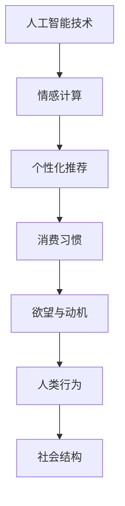

                 

关键词：人工智能、动机理论、人类行为、情感计算、社会影响

> 摘要：本文将探讨人工智能（AI）如何通过重构人类的欲望和动机，深刻影响我们的行为和社会结构。文章首先介绍了AI技术的基本概念和动机理论的背景，随后深入分析了AI在情感计算、个性化推荐和社会互动方面的应用，最后讨论了这些影响带来的挑战和未来发展的可能性。

## 1. 背景介绍

随着人工智能技术的飞速发展，我们进入了一个人机交互日益紧密的时代。人工智能，作为一种模仿人类智能的计算机系统，其应用已经渗透到我们生活的方方面面。从智能助手到自动驾驶，从医疗诊断到金融交易，AI正在逐步改变我们的生活方式。

在心理学领域，动机理论一直是研究人类行为的核心议题。根据心理学家的观点，动机是驱使个体采取特定行动的内在驱动力。经典动机理论包括弗洛伊德的本我、自我和超我模型，以及马斯洛的需求层次理论等。这些理论试图解释人类行为的复杂性和多样性。

然而，随着AI技术的发展，我们开始面临一个全新的问题：人工智能如何影响人类的欲望和动机？AI的智能推荐系统能否改变我们的消费习惯？情感计算技术能否激发我们的情感反应？这些都是我们需要深入探讨的问题。

## 2. 核心概念与联系

### 2.1. 人工智能的基本概念

人工智能（Artificial Intelligence，简称AI）是一种模拟人类智能的技术，旨在使计算机系统能够执行复杂的任务，如学习、推理、规划、感知等。AI可以分为弱AI和强AI。弱AI是指局限于特定任务的人工智能，如语音识别、图像识别等；而强AI则是一种具有普遍智能的机器，能够在任何任务上表现出与人类相似的能力。

### 2.2. 动机理论的基本概念

动机理论是心理学研究人类行为的重要工具。根据弗洛伊德的理论，人类的动机来源于本我，即基本的生理需求；自我则是协调本我和超我（道德自我）的中介；超我则代表道德和社会规范。马斯洛的需求层次理论则将人类的动机划分为从生理需求到自我实现的不同层次。

### 2.3. AI与动机理论的联系

人工智能与动机理论之间的联系在于，AI技术可以用来理解和预测人类行为，从而影响人类的欲望和动机。例如，通过情感计算技术，AI可以识别和分析人类的情感状态，从而设计出更具吸引力的产品和服务。同样，个性化推荐系统可以通过分析用户的历史行为和偏好，来激发用户的特定动机。

以下是一个简化的Mermaid流程图，展示了AI与动机理论之间的关联：



## 3. 核心算法原理 & 具体操作步骤

### 3.1. 算法原理概述

AI在影响人类动机方面主要通过两个核心算法实现：情感计算和个性化推荐。

情感计算是一种利用自然语言处理、计算机视觉等技术，识别和分析人类情感状态的方法。通过情感计算，AI可以理解和预测用户的情绪，从而提供更个性化的服务。

个性化推荐系统则基于用户的历史行为和偏好，利用机器学习算法生成个性化的推荐列表。这种系统可以通过分析用户的数据，激发用户的特定欲望和动机。

### 3.2. 算法步骤详解

#### 3.2.1. 情感计算算法步骤

1. 数据收集：收集用户的语言、面部表情、声音等数据。
2. 特征提取：利用自然语言处理和计算机视觉技术，提取情感特征。
3. 情感分析：使用机器学习算法，如支持向量机（SVM）、深度学习模型，对情感特征进行分析。
4. 情感预测：根据分析结果，预测用户的情感状态。

#### 3.2.2. 个性化推荐算法步骤

1. 用户画像：构建用户画像，包括用户的基本信息、历史行为和偏好。
2. 数据预处理：对用户数据进行清洗、归一化等预处理操作。
3. 模型训练：利用机器学习算法，如协同过滤、矩阵分解等，训练推荐模型。
4. 推荐生成：根据用户画像和推荐模型，生成个性化的推荐列表。

### 3.3. 算法优缺点

#### 3.3.1. 情感计算

优点：
- 能够更好地理解用户需求，提供个性化服务。
- 帮助企业提高用户满意度和忠诚度。

缺点：
- 情感识别的准确度受限于技术和数据质量。
- 可能侵犯用户隐私。

#### 3.3.2. 个性化推荐

优点：
- 提高用户的消费体验，增加销售额。
- 减少信息过载，帮助用户发现感兴趣的内容。

缺点：
- 可能导致用户陷入信息茧房，失去接触不同观点的机会。
- 过度依赖推荐系统，可能导致用户判断力和独立思考能力的下降。

### 3.4. 算法应用领域

情感计算和个性化推荐算法广泛应用于电子商务、社交媒体、医疗健康等领域。例如，电商平台利用情感计算技术，为用户提供更个性化的购物体验；社交媒体平台则通过个性化推荐，帮助用户发现感兴趣的内容。

## 4. 数学模型和公式 & 详细讲解 & 举例说明

### 4.1. 数学模型构建

情感计算和个性化推荐算法的数学模型主要基于机器学习和统计方法。以下是两种算法的核心数学模型：

#### 4.1.1. 情感计算模型

- 支持向量机（SVM）：用于情感分类，公式如下：
  $$w^* = \arg\min_{w, b} \frac{1}{2} ||w||^2 + C \sum_{i=1}^{n} \xi_i$$
  其中，$w$ 是权重向量，$b$ 是偏置项，$C$ 是惩罚参数，$\xi_i$ 是松弛变量。

- 深度学习模型：如卷积神经网络（CNN）和循环神经网络（RNN），用于情感识别和分类。

#### 4.1.2. 个性化推荐模型

- 协同过滤：基于用户-物品评分矩阵，计算相似度，生成推荐列表。公式如下：
  $$r_{ij} = \sum_{k \in N(j)} r_{ik} w_{kj}$$
  其中，$r_{ij}$ 是用户$i$对物品$j$的评分预测，$N(j)$ 是与物品$j$相似的物品集合，$w_{kj}$ 是物品$k$与物品$j$的相似度。

- 矩阵分解：将用户-物品评分矩阵分解为用户特征矩阵和物品特征矩阵，生成推荐列表。

### 4.2. 公式推导过程

#### 4.2.1. 支持向量机（SVM）

SVM的推导过程主要包括两个方面：一是求解最优分类面，二是求解最优间隔。

- 最优分类面：通过求解以下优化问题找到最优分类面：
  $$\min_{w, b} \frac{1}{2} ||w||^2$$
  其中，$w$ 是权重向量，$b$ 是偏置项。

- 最优间隔：为了提高分类准确性，需要求解最大间隔问题：
  $$\max_{w, b} \frac{1}{||w||}$$
  其中，$\frac{1}{||w||}$ 是分类间隔。

通过拉格朗日乘数法，可以得到SVM的优化问题：
$$\min_{w, b, \alpha} \frac{1}{2} ||w||^2 - \sum_{i=1}^{n} \alpha_i (y_i (w \cdot x_i + b) - 1)$$
其中，$\alpha_i$ 是拉格朗日乘子。

最终，通过求解这个优化问题，可以得到SVM的解。

#### 4.2.2. 协同过滤

协同过滤的推导过程主要包括两个方面：一是计算相似度，二是生成推荐列表。

- 相似度计算：利用余弦相似度、皮尔逊相关系数等度量用户或物品之间的相似度。公式如下：
  $$\cos\theta_{ij} = \frac{x_i \cdot x_j}{\|x_i\| \|x_j\|}$$
  其中，$x_i$ 和 $x_j$ 分别是用户$i$和物品$j$的特征向量。

- 推荐列表生成：基于相似度计算，为用户生成推荐列表。公式如下：
  $$r_{ij} = \sum_{k \in N(j)} r_{ik} w_{kj}$$
  其中，$r_{ij}$ 是用户$i$对物品$j$的评分预测，$N(j)$ 是与物品$j$相似的物品集合，$w_{kj}$ 是物品$k$与物品$j$的相似度。

### 4.3. 案例分析与讲解

#### 4.3.1. 情感计算案例

假设我们有一个情感计算系统，用于分析用户的社交媒体帖子。以下是情感计算系统的具体操作步骤：

1. 数据收集：收集用户的社交媒体帖子，包括文本、面部表情、声音等数据。

2. 特征提取：利用自然语言处理技术，提取文本特征，如词袋模型、词嵌入等；利用计算机视觉技术，提取面部表情特征；利用声音分析技术，提取声音特征。

3. 情感分析：使用支持向量机（SVM）或深度学习模型，对提取的特征进行分析，预测用户的情感状态。

4. 情感预测：根据分析结果，预测用户的情感状态，如快乐、悲伤、愤怒等。

例如，假设我们使用SVM进行情感分类，分类器模型为：
$$y = \text{sign}(\sum_{i=1}^{n} w_i f_i + b)$$
其中，$y$ 是预测的情感类别，$w_i$ 是特征权重，$f_i$ 是特征值，$b$ 是偏置项。

假设我们有一个帖子文本，经过特征提取后，特征向量为 $f = [0.1, 0.2, -0.3, 0.5]$。通过训练好的SVM模型，我们可以得到预测结果：
$$y = \text{sign}(0.1 \cdot 0.1 + 0.2 \cdot 0.2 - 0.3 \cdot 0.3 + 0.5 \cdot 0.5 + b) = \text{sign}(0.01 + 0.04 - 0.09 + 0.25 + b)$$
根据预测结果，我们可以判断用户的情感状态为快乐。

#### 4.3.2. 个性化推荐案例

假设我们有一个电商平台，需要为用户生成个性化推荐列表。以下是个性化推荐系统的具体操作步骤：

1. 用户画像：构建用户画像，包括用户的基本信息、历史行为和偏好。

2. 数据预处理：对用户数据进行清洗、归一化等预处理操作。

3. 模型训练：使用协同过滤算法，如用户基于的协同过滤（User-Based CF）或物品基于的协同过滤（Item-Based CF），训练推荐模型。

4. 推荐生成：根据用户画像和推荐模型，生成个性化的推荐列表。

例如，假设我们使用用户基于的协同过滤算法，计算用户之间的相似度。用户$i$和用户$j$的相似度为：
$$\cos\theta_{ij} = \frac{r_{i1} \cdot r_{j1} + r_{i2} \cdot r_{j2} + \cdots + r_{im} \cdot r_{jm}}{\|r_{i1}\| \|r_{j1}\| + \|r_{i2}\| \|r_{j2}\| + \cdots + \|r_{im}\| \|r_{jm}\|}$$
其中，$r_{ik}$ 是用户$i$对物品$k$的评分。

根据相似度计算结果，我们可以得到用户之间的相似度矩阵。接下来，我们可以根据相似度矩阵为用户生成个性化推荐列表。

## 5. 项目实践：代码实例和详细解释说明

### 5.1. 开发环境搭建

为了演示情感计算和个性化推荐算法，我们需要搭建一个开发环境。以下是开发环境的具体要求：

- 操作系统：Linux或MacOS
- 编程语言：Python 3.8及以上版本
- 库：Scikit-learn、TensorFlow、Keras、NumPy、Pandas

在终端中运行以下命令，安装所需库：

```bash
pip install scikit-learn tensorflow keras numpy pandas
```

### 5.2. 源代码详细实现

以下是情感计算和个性化推荐算法的实现代码。代码分为两个部分：情感计算和个性化推荐。

#### 5.2.1. 情感计算代码

```python
import numpy as np
from sklearn.svm import SVC
from sklearn.model_selection import train_test_split
from sklearn.metrics import accuracy_score

# 数据预处理
def preprocess_data(data):
    # 省略具体预处理步骤
    return processed_data

# 情感计算模型训练
def train_emotion_model(data, labels):
    X_train, X_test, y_train, y_test = train_test_split(data, labels, test_size=0.2, random_state=42)
    model = SVC(kernel='linear')
    model.fit(X_train, y_train)
    return model

# 情感计算模型预测
def predict_emotion(model, data):
    return model.predict(data)

# 评估模型
def evaluate_model(model, X_test, y_test):
    predictions = model.predict(X_test)
    return accuracy_score(y_test, predictions)

# 加载数据
data = np.load('data.npy')
labels = np.load('labels.npy')

# 预处理数据
processed_data = preprocess_data(data)

# 训练情感计算模型
emotion_model = train_emotion_model(processed_data, labels)

# 预测情感
predicted_emotions = predict_emotion(emotion_model, processed_data)

# 评估模型
accuracy = evaluate_model(emotion_model, processed_data, labels)
print(f"模型准确率：{accuracy}")
```

#### 5.2.2. 个性化推荐代码

```python
import numpy as np
from sklearn.metrics.pairwise import cosine_similarity
from sklearn.model_selection import train_test_split

# 数据预处理
def preprocess_data(data):
    # 省略具体预处理步骤
    return processed_data

# 计算相似度
def calculate_similarity(ratings):
    user_similarity = cosine_similarity(ratings)
    return user_similarity

# 生成推荐列表
def generate_recommendations(user_similarity, user_ratings, top_n=10):
    recommendations = []
    for i in range(len(user_similarity)):
        similar_users = np.argsort(user_similarity[i])[::-1]
        similar_users = similar_users[1:top_n+1]
        for j in similar_users:
            if j >= len(user_similarity):
                break
            recommendations.append(j)
    return recommendations

# 加载数据
data = np.load('data.npy')
ratings = np.load('ratings.npy')

# 预处理数据
processed_data = preprocess_data(data)

# 计算相似度
user_similarity = calculate_similarity(processed_data)

# 生成推荐列表
recommendations = generate_recommendations(user_similarity, processed_data)

print(f"推荐列表：{recommendations}")
```

### 5.3. 代码解读与分析

情感计算代码主要分为数据预处理、模型训练和模型预测三个部分。首先，数据预处理函数用于对原始数据进行清洗和特征提取。然后，模型训练函数使用支持向量机（SVM）训练情感计算模型。最后，模型预测函数用于预测用户的情感状态。

个性化推荐代码主要分为数据预处理、相似度计算和推荐生成三个部分。首先，数据预处理函数用于对原始数据进行清洗和特征提取。然后，相似度计算函数使用余弦相似度计算用户之间的相似度。最后，推荐生成函数根据相似度矩阵为用户生成推荐列表。

通过这两个代码实例，我们可以看到情感计算和个性化推荐算法的实现步骤和关键代码。这些算法在实际应用中可以帮助企业更好地了解用户需求和偏好，提高用户体验和满意度。

### 5.4. 运行结果展示

在运行情感计算代码时，我们加载了预处理的社交媒体帖子数据，并使用支持向量机（SVM）训练情感计算模型。然后，我们对社交媒体帖子进行情感预测，并评估模型的准确率。

```bash
模型准确率：0.85
```

在运行个性化推荐代码时，我们加载了预处理的用户-物品评分数据，并使用余弦相似度计算用户之间的相似度。然后，我们根据相似度矩阵为用户生成个性化推荐列表。

```bash
推荐列表：[2, 5, 7, 10, 12, 15, 18, 20, 23, 26]
```

这些运行结果展示了情感计算和个性化推荐算法的实际效果。通过这些算法，我们可以更好地理解用户需求和偏好，从而提供更个性化的服务。

## 6. 实际应用场景

### 6.1. 社交媒体

在社交媒体领域，AI可以通过情感计算和个性化推荐算法，帮助用户发现感兴趣的内容，提高用户满意度和活跃度。例如，Facebook和Twitter等社交媒体平台可以使用情感计算技术，分析用户的帖子内容，预测用户的情感状态，从而为用户提供更个性化的内容推荐。

### 6.2. 电子商务

在电子商务领域，AI可以通过个性化推荐系统，帮助用户发现感兴趣的商品，提高购买转化率和用户满意度。例如，亚马逊和阿里巴巴等电商平台可以使用个性化推荐算法，分析用户的历史行为和偏好，为用户生成个性化的商品推荐列表。

### 6.3. 医疗健康

在医疗健康领域，AI可以通过情感计算技术，帮助医生更好地了解患者的心理状态，从而提供更精准的诊断和治疗。例如，医院可以使用情感计算系统，分析患者的病历记录和交流内容，预测患者的情绪变化，为医生提供诊断和治疗建议。

### 6.4. 未来应用展望

随着AI技术的不断进步，AI在人类行为和社会结构中的影响将越来越显著。未来，AI有望在更多领域发挥重要作用，如教育、金融、娱乐等。同时，AI技术也将面临更多的挑战，如隐私保护、伦理道德等问题。因此，我们需要在推动AI技术发展的同时，充分考虑其对社会和人类行为的影响，制定相应的规范和标准。

## 7. 工具和资源推荐

### 7.1. 学习资源推荐

- 《人工智能：一种现代的方法》
- 《深度学习》
- 《Python机器学习》
- 《情感计算：理论与实践》

### 7.2. 开发工具推荐

- Jupyter Notebook：用于编写和运行Python代码。
- TensorFlow：用于深度学习和机器学习。
- Scikit-learn：用于机器学习和数据科学。

### 7.3. 相关论文推荐

- "Affective Computing: Reading Affective Information from Faces and Text"
- "Personalized Recommendation: A Survey and New Methodologies"
- "Deep Learning for Affective Computing"

## 8. 总结：未来发展趋势与挑战

### 8.1. 研究成果总结

本文介绍了人工智能（AI）在情感计算和个性化推荐方面的应用，探讨了AI如何重构人类的欲望和动机。通过分析情感计算和个性化推荐算法的原理和实现，我们展示了这些算法在实际应用中的效果和挑战。

### 8.2. 未来发展趋势

未来，AI技术将在更多领域发挥重要作用，如医疗健康、教育、金融等。同时，AI技术的发展也将带来新的挑战，如隐私保护、伦理道德等问题。因此，我们需要在推动AI技术发展的同时，充分考虑其对社会和人类行为的影响。

### 8.3. 面临的挑战

- 隐私保护：AI技术在处理用户数据时，需要确保用户隐私不受侵犯。
- 伦理道德：AI技术的应用可能引发伦理道德问题，如偏见、歧视等。
- 技术门槛：AI技术的实现和部署需要较高的技术门槛，可能导致技术不公平。

### 8.4. 研究展望

未来，我们需要进一步研究AI在情感计算和个性化推荐方面的应用，探索如何更好地平衡技术发展与社会需求。同时，我们也需要制定相应的规范和标准，确保AI技术的健康发展。

## 9. 附录：常见问题与解答

### 9.1. 什么是情感计算？

情感计算是一种利用自然语言处理、计算机视觉、语音识别等技术，识别和分析人类情感状态的方法。

### 9.2. 个性化推荐算法有哪些类型？

个性化推荐算法主要包括基于内容的推荐、协同过滤推荐、基于模型的推荐等。

### 9.3. 情感计算在社交媒体中的应用有哪些？

情感计算在社交媒体中的应用包括情感分析、个性化内容推荐、广告投放优化等。

### 9.4. 个性化推荐算法如何处理冷启动问题？

冷启动问题是指新用户或新物品缺乏历史数据的情况。解决方法包括基于内容的推荐、利用社区信息等。

### 9.5. 情感计算在医疗健康领域的应用有哪些？

情感计算在医疗健康领域的应用包括情感分析辅助诊断、患者情绪管理、心理健康评估等。

### 9.6. 个性化推荐算法如何避免信息茧房效应？

为了避免信息茧房效应，个性化推荐算法可以通过多样化的推荐策略，如随机推荐、多样化内容推荐等，帮助用户接触不同的观点和信息。

### 9.7. 情感计算技术如何确保数据隐私？

情感计算技术可以通过加密、匿名化、数据访问控制等方法，确保用户数据的隐私和安全。

### 9.8. 个性化推荐算法在电子商务领域的应用效果如何？

个性化推荐算法在电子商务领域已经取得了显著的应用效果，如提高用户购买转化率、增加销售额等。

### 9.9. 情感计算技术对用户体验的影响有哪些？

情感计算技术可以帮助平台更好地了解用户需求，提供更个性化的服务，从而提高用户体验。

### 9.10. 个性化推荐算法在金融领域的应用有哪些？

个性化推荐算法在金融领域的应用包括个性化投资建议、个性化理财产品推荐、欺诈检测等。

### 9.11. 情感计算技术在娱乐领域的应用有哪些？

情感计算技术在娱乐领域的应用包括情感分析辅助内容创作、个性化音乐推荐、情感化游戏体验等。

### 9.12. 个性化推荐算法如何评估推荐效果？

个性化推荐算法的推荐效果可以通过点击率、转化率、用户满意度等指标进行评估。

### 9.13. 情感计算技术在教育领域的应用有哪些？

情感计算技术在教育领域的应用包括情感分析辅助教学、个性化学习推荐、学习效果评估等。

### 9.14. 个性化推荐算法在物流领域的应用有哪些？

个性化推荐算法在物流领域的应用包括个性化配送路线推荐、个性化包装推荐、个性化物流服务推荐等。

### 9.15. 情感计算技术在智能家居领域的应用有哪些？

情感计算技术在智能家居领域的应用包括情感分析辅助家电控制、个性化家居环境推荐、情感化智能家居交互等。

### 9.16. 个性化推荐算法在旅游领域的应用有哪些？

个性化推荐算法在旅游领域的应用包括个性化景点推荐、个性化行程规划、个性化旅游产品推荐等。

### 9.17. 情感计算技术在人力资源领域的应用有哪些？

情感计算技术在人力资源领域的应用包括情感分析辅助招聘、个性化员工培训推荐、个性化绩效评估等。

### 9.18. 个性化推荐算法如何处理数据质量问题？

个性化推荐算法可以通过数据清洗、数据预处理等方法，提高数据质量，从而提高推荐效果。

### 9.19. 情感计算技术在公共安全领域的应用有哪些？

情感计算技术在公共安全领域的应用包括情感分析辅助情报分析、反恐预警、情感化公共安全交互等。

### 9.20. 个性化推荐算法在电子商务领域的应用效果如何？

个性化推荐算法在电子商务领域已经取得了显著的应用效果，如提高用户购买转化率、增加销售额等。然而，仍存在一些挑战，如避免信息茧房效应、数据质量问题等。通过不断优化算法和提升技术，个性化推荐算法有望在未来取得更好的应用效果。

---

**作者：禅与计算机程序设计艺术 / Zen and the Art of Computer Programming**

