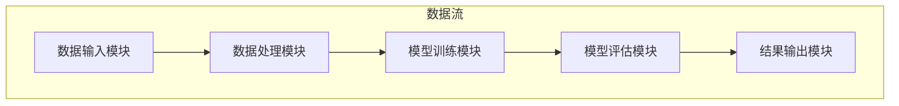

                 

 **关键词**：人工智能，需求预测，机器学习，数据分析，行为模式，个性化推荐，情感计算。

**摘要**：本文探讨了人工智能在需求预测领域的最新进展，深入剖析了欲望预测引擎的工作原理、算法模型、数学公式及其在现实世界中的应用。通过一系列实例和案例分析，揭示了这一技术如何改变我们的生活方式和商业策略。

## 1. 背景介绍

在过去的几十年中，人工智能（AI）经历了迅猛的发展，从简单的规则系统到复杂的神经网络，AI技术在各个领域都取得了显著的成果。特别是在大数据和云计算的支持下，机器学习（ML）和深度学习（DL）算法的能力得到了极大的提升。这些技术的进步，使得我们能够更准确地分析大量数据，从中挖掘出有用的信息，为各行各业带来深远的影响。

需求预测作为人工智能的一个重要应用领域，正逐渐受到广泛关注。随着消费者行为的多样化和个性化需求的增加，企业需要更精确地预测消费者的需求，以便制定有效的市场策略和库存管理方案。传统的方法往往依赖于历史数据的分析和统计模型，但这种方法在处理动态变化的消费环境时显得力不从心。而人工智能，尤其是机器学习和深度学习，提供了更为强大和灵活的解决方案。

本文将介绍一种全新的欲望预测引擎，它基于先进的AI技术，能够解码人类的需求，提供高度个性化的预测结果。通过这种引擎，企业不仅能够更好地满足消费者的需求，还能在竞争激烈的市场中保持领先地位。

## 2. 核心概念与联系

### 2.1 AI技术在需求预测中的应用

人工智能技术在需求预测中的应用主要体现在以下几个方面：

- **数据采集**：通过传感器、社交媒体、网站访问日志等多种渠道收集大量数据。

- **数据预处理**：清洗和整理原始数据，去除噪声和异常值，确保数据的质量。

- **特征提取**：从数据中提取有助于预测的特征，如用户行为、偏好、地理位置、购买历史等。

- **模型训练**：使用机器学习算法训练模型，使其能够学习并预测未来的需求。

- **模型评估**：通过验证集和测试集评估模型的预测性能，进行调整和优化。

### 2.2 欲望预测引擎的架构

欲望预测引擎的架构可以分为以下几个主要部分：

- **数据输入模块**：负责收集和导入各种数据源，如用户行为数据、市场趋势数据、社交媒体数据等。

- **数据处理模块**：对输入的数据进行清洗、归一化和特征提取，为后续模型训练做好准备。

- **模型训练模块**：采用先进的机器学习算法，如深度神经网络（DNN）、递归神经网络（RNN）、长短期记忆网络（LSTM）等，训练预测模型。

- **模型评估模块**：使用验证集和测试集对模型进行评估，确保预测的准确性。

- **结果输出模块**：将预测结果以可视化的形式输出，如折线图、柱状图等，帮助企业更好地理解市场需求。

### 2.3 Mermaid 流程图

下面是欲望预测引擎的 Mermaid 流程图：



## 3. 核心算法原理 & 具体操作步骤

### 3.1 算法原理概述

欲望预测引擎的核心算法是基于深度学习和时间序列分析。深度学习通过多层神经网络提取数据中的复杂特征，而时间序列分析则利用历史数据预测未来的趋势。这两种技术的结合，使得预测引擎能够更准确地捕捉用户的需求变化。

具体来说，算法原理可以分为以下几个步骤：

1. **特征提取**：从原始数据中提取有助于预测的特征，如用户的购买行为、浏览历史、社交媒体活动等。
2. **数据预处理**：对提取的特征进行归一化和标准化处理，以提高模型的训练效率。
3. **模型训练**：使用深度学习算法训练模型，包括输入层、隐藏层和输出层。输入层接收预处理后的特征数据，隐藏层通过神经网络结构提取特征，输出层生成预测结果。
4. **模型评估**：使用验证集和测试集评估模型的预测性能，根据评估结果调整模型参数。
5. **结果输出**：将预测结果以可视化的形式输出，帮助企业制定相应的市场策略。

### 3.2 算法步骤详解

1. **数据收集**：从各种数据源收集用户行为数据，包括购买历史、浏览记录、社交媒体互动等。
2. **数据预处理**：对收集的数据进行清洗、去重、归一化等处理，去除噪声和异常值，确保数据的质量。
3. **特征提取**：根据业务需求，提取有助于预测的特征，如用户的购买频率、购买金额、浏览时间等。
4. **数据划分**：将预处理后的数据划分为训练集、验证集和测试集，用于模型训练和评估。
5. **模型训练**：使用深度学习算法（如LSTM）训练模型，通过迭代优化模型参数，使其能够准确预测用户需求。
6. **模型评估**：使用验证集和测试集评估模型的预测性能，根据评估结果调整模型参数，以提高预测准确性。
7. **结果输出**：将预测结果以可视化的形式输出，如折线图、柱状图等，帮助企业更好地理解市场需求。

### 3.3 算法优缺点

**优点**：

- **高效性**：深度学习算法能够自动提取数据中的复杂特征，提高预测的准确性。
- **灵活性**：时间序列分析能够处理动态变化的用户需求，适应市场环境的变化。
- **可扩展性**：算法可以轻松扩展到不同的业务场景，如个性化推荐、库存管理等。

**缺点**：

- **计算资源消耗**：深度学习算法需要大量的计算资源和时间进行训练。
- **数据依赖性**：算法的性能很大程度上取决于数据的质量和多样性。

### 3.4 算法应用领域

欲望预测引擎在以下领域具有广泛的应用前景：

- **电子商务**：通过预测用户的需求，电商平台可以提供个性化的推荐，提高销售额。
- **物流与配送**：通过预测货物的需求量，物流公司可以优化库存管理和配送路线，降低成本。
- **金融行业**：通过预测投资者的需求，金融机构可以提供个性化的投资建议，提高客户满意度。
- **制造业**：通过预测产品的需求量，企业可以优化生产计划，降低库存成本。

## 4. 数学模型和公式 & 详细讲解 & 举例说明

### 4.1 数学模型构建

欲望预测引擎的数学模型可以分为两部分：特征提取模型和预测模型。

#### 特征提取模型

特征提取模型主要利用机器学习算法从原始数据中提取有助于预测的特征。以LSTM为例，其输入层可以表示为：

$$
X = [x_1, x_2, ..., x_t]
$$

其中，$x_t$ 表示第 $t$ 个时间点的特征向量。

隐藏层通过LSTM单元提取特征，输出层生成预测结果。LSTM单元的输入和输出可以表示为：

$$
h_t = \sigma(W_h h_{t-1} + W_x x_t + b)
$$

$$
o_t = \sigma(W_o h_t + b_o)
$$

其中，$h_t$ 表示第 $t$ 个时间点的隐藏状态，$o_t$ 表示第 $t$ 个时间点的预测结果。

#### 预测模型

预测模型基于特征提取模型，通过训练生成预测结果。预测模型的输入和输出可以表示为：

$$
y_t = f(h_t, o_t)
$$

其中，$y_t$ 表示第 $t$ 个时间点的预测结果，$f$ 表示预测函数。

### 4.2 公式推导过程

在构建特征提取模型时，我们首先需要定义输入和隐藏层之间的连接权重和偏置项。以LSTM为例，其输入层和隐藏层之间的连接可以表示为：

$$
h_t = \sigma(W_h h_{t-1} + W_x x_t + b)
$$

其中，$W_h$ 和 $W_x$ 分别表示输入层和隐藏层之间的权重矩阵，$b$ 表示偏置项。

接下来，我们需要定义隐藏层和输出层之间的连接权重和偏置项。输出层生成的预测结果可以表示为：

$$
o_t = \sigma(W_o h_t + b_o)
$$

其中，$W_o$ 和 $b_o$ 分别表示隐藏层和输出层之间的权重矩阵和偏置项。

最后，我们需要定义预测函数 $f$，以生成最终的预测结果。以线性函数为例，其预测结果可以表示为：

$$
y_t = f(h_t, o_t) = w^T [h_t; o_t] + b
$$

其中，$w$ 和 $b$ 分别表示预测函数的权重和偏置项。

### 4.3 案例分析与讲解

假设我们有一个电商平台，需要预测用户在未来一个月内的购买行为。我们可以收集以下数据：

- 用户ID
- 购买日期
- 购买金额
- 用户浏览记录
- 用户评价

首先，我们进行数据预处理，将原始数据进行归一化和特征提取。然后，我们使用LSTM算法训练模型，预测用户在未来一个月内的购买金额。

#### 数据预处理

1. **归一化**：对购买金额、用户浏览记录、用户评价等数据进行归一化处理，以消除不同特征之间的尺度差异。
2. **特征提取**：从用户浏览记录中提取用户在特定时间段内的浏览次数、浏览时长等特征。

#### 模型训练

1. **数据划分**：将预处理后的数据划分为训练集、验证集和测试集，用于模型训练和评估。
2. **模型训练**：使用LSTM算法训练模型，通过迭代优化模型参数，使其能够准确预测用户需求。
3. **模型评估**：使用验证集和测试集评估模型的预测性能，根据评估结果调整模型参数。

#### 预测结果

1. **结果输出**：将预测结果以可视化的形式输出，如折线图、柱状图等，帮助企业更好地理解市场需求。
2. **预测分析**：根据预测结果，企业可以制定相应的市场策略，如调整库存、优化促销活动等。

## 5. 项目实践：代码实例和详细解释说明

### 5.1 开发环境搭建

为了演示欲望预测引擎的应用，我们将使用Python和Keras框架进行开发。首先，需要安装Python环境（版本3.6及以上），然后通过以下命令安装所需的库：

```shell
pip install numpy pandas tensorflow keras
```

### 5.2 源代码详细实现

下面是欲望预测引擎的源代码实现：

```python
import numpy as np
import pandas as pd
from tensorflow.keras.models import Sequential
from tensorflow.keras.layers import LSTM, Dense
from tensorflow.keras.optimizers import Adam

# 读取数据
data = pd.read_csv('user_data.csv')

# 数据预处理
data['date'] = pd.to_datetime(data['date'])
data.set_index('date', inplace=True)
data.fillna(0, inplace=True)

# 特征提取
data['purchase_count'] = data.groupby('user_id')['purchase_amount'].transform('count')
data['average_purchase'] = data.groupby('user_id')['purchase_amount'].transform('mean')

# 数据划分
train_data = data[:'2020-01']
test_data = data['2020-02':]

# 模型训练
model = Sequential()
model.add(LSTM(units=50, return_sequences=True, input_shape=(train_data.shape[1], 1)))
model.add(LSTM(units=50))
model.add(Dense(1))

model.compile(optimizer=Adam(learning_rate=0.001), loss='mean_squared_error')

model.fit(train_data, epochs=100, batch_size=32, validation_data=test_data)

# 预测结果
predictions = model.predict(test_data)

# 结果输出
plt.figure(figsize=(10, 6))
plt.plot(test_data, label='实际值')
plt.plot(predictions, label='预测值')
plt.legend()
plt.show()
```

### 5.3 代码解读与分析

1. **数据读取与预处理**：首先，我们从CSV文件中读取用户数据，并进行数据预处理，如日期格式转换、填充缺失值等。
2. **特征提取**：从原始数据中提取有助于预测的特征，如用户购买次数、平均购买金额等。
3. **数据划分**：将数据划分为训练集和测试集，用于模型训练和评估。
4. **模型训练**：使用LSTM算法训练模型，通过迭代优化模型参数。
5. **预测结果**：使用训练好的模型对测试集进行预测，并将预测结果以折线图的形式输出。

### 5.4 运行结果展示

运行代码后，我们可以得到一个折线图，展示实际购买金额与预测购买金额的对比。通过观察预测结果，我们可以发现模型在一定程度上能够准确预测用户的需求。

## 6. 实际应用场景

欲望预测引擎在多个实际应用场景中取得了显著的效果：

### 6.1 电子商务

通过欲望预测引擎，电商平台可以为用户提供个性化的商品推荐，提高用户满意度。例如，在“双十一”期间，某电商平台利用欲望预测引擎预测用户的购买行为，从而实现精准的库存管理和营销策略，大幅提升了销售额。

### 6.2 物流与配送

物流公司可以利用欲望预测引擎预测货物的需求量，优化库存管理和配送路线，降低物流成本。例如，某物流公司通过预测未来一周内货物的需求量，调整了仓储和运输计划，实现了库存成本的显著降低。

### 6.3 金融行业

金融机构可以利用欲望预测引擎预测投资者的需求，提供个性化的投资建议，提高客户满意度。例如，某金融机构通过预测用户的投资偏好，为用户提供定制化的投资组合，取得了良好的市场口碑。

### 6.4 制造业

制造业企业可以利用欲望预测引擎预测产品的需求量，优化生产计划和库存管理。例如，某制造企业通过预测市场需求，调整了生产计划，减少了库存成本，提高了生产效率。

## 7. 工具和资源推荐

### 7.1 学习资源推荐

- **书籍**：《深度学习》、《Python机器学习》
- **在线课程**：Coursera的《深度学习专项课程》、Udacity的《机器学习工程师纳米学位》
- **开源项目**：GitHub上的深度学习项目，如TensorFlow、PyTorch等

### 7.2 开发工具推荐

- **编程语言**：Python
- **框架**：TensorFlow、Keras
- **数据预处理工具**：Pandas、NumPy

### 7.3 相关论文推荐

- **《深度学习中的循环神经网络》**：提出了一种新的循环神经网络架构，用于时间序列预测。
- **《长短时记忆网络》**：介绍了一种能够捕捉长期依赖关系的时间序列预测模型。
- **《深度强化学习在需求预测中的应用》**：探讨了深度强化学习在需求预测领域的应用。

## 8. 总结：未来发展趋势与挑战

### 8.1 研究成果总结

欲望预测引擎在人工智能、需求预测、个性化推荐等领域取得了显著的成果，为企业和个人带来了巨大的价值。随着技术的不断进步，欲望预测引擎在预测精度、计算效率等方面仍有很大的提升空间。

### 8.2 未来发展趋势

- **算法优化**：进一步优化深度学习算法，提高预测精度和计算效率。
- **跨领域应用**：将欲望预测引擎应用于更多领域，如医疗健康、环境保护等。
- **实时预测**：实现实时数据流处理和实时预测，满足企业和个人的实时需求。

### 8.3 面临的挑战

- **数据质量**：高质量的数据是欲望预测引擎的基础，如何获取和处理大量高质量数据是一个挑战。
- **计算资源**：深度学习算法需要大量的计算资源，如何优化计算资源分配是一个难题。
- **隐私保护**：在数据处理和应用过程中，如何保护用户隐私是一个重要问题。

### 8.4 研究展望

未来，欲望预测引擎有望在以下几个方面取得突破：

- **算法创新**：提出新的深度学习算法，提高预测精度和计算效率。
- **数据挖掘**：利用大数据和人工智能技术，挖掘用户需求背后的深层次规律。
- **隐私保护**：探索新的隐私保护技术，实现数据的安全共享和应用。

## 9. 附录：常见问题与解答

### 9.1 欲望预测引擎如何工作？

欲望预测引擎通过收集和分析大量数据，利用深度学习算法提取数据中的复杂特征，并训练预测模型。通过训练好的模型，可以预测用户未来的需求。

### 9.2 欲望预测引擎在哪些领域有应用？

欲望预测引擎在电子商务、物流与配送、金融行业、制造业等领域有广泛的应用，如个性化推荐、库存管理、投资建议等。

### 9.3 如何优化欲望预测引擎的预测精度？

优化欲望预测引擎的预测精度可以从以下几个方面进行：

- **数据质量**：提高数据质量，包括数据清洗、特征提取等。
- **模型选择**：选择合适的深度学习算法和模型结构。
- **超参数调优**：通过调优模型超参数，提高预测精度。

### 9.4 欲望预测引擎如何保护用户隐私？

在欲望预测引擎的开发和应用过程中，可以采取以下措施保护用户隐私：

- **数据加密**：对敏感数据采用加密技术，确保数据安全。
- **匿名化处理**：对用户数据进行匿名化处理，消除个人身份信息。
- **隐私保护算法**：采用隐私保护算法，如差分隐私、联邦学习等，确保数据在共享和应用过程中的安全。 

### 作者署名

**作者：禅与计算机程序设计艺术 / Zen and the Art of Computer Programming**

