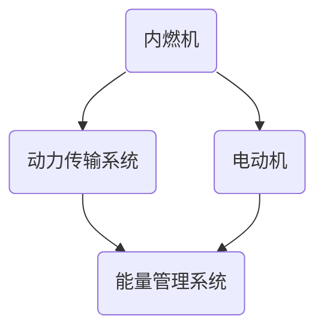

                 

关键词：比亚迪，社招，混合动力系统，工程师，面试，问答，技术

## 摘要

本文旨在为有意向参与比亚迪2025年度社会招聘的混合动力系统工程师提供一个详细的面试问答指南。文章首先介绍了混合动力系统的基本概念和重要性，然后针对面试中可能涉及的关键技术点、工作经验要求、团队协作能力、专业知识评估等进行了详细的分析。通过这篇文章，读者可以更好地了解面试的准备工作，以及如何在面试中展示自己的专业技能和优势。

## 1. 背景介绍

混合动力系统，也称为混合动力电动车（HEV），是一种能够结合内燃机和电动机共同提供动力的车辆系统。相较于传统纯燃油车，混合动力车在节能减排方面具有显著优势。近年来，随着全球对环境保护和能源安全的重视，混合动力系统在汽车工业中的地位日益提升。比亚迪作为国内混合动力技术的领军企业，其混合动力系统在技术先进性和市场占有率方面都处于领先地位。

比亚迪在混合动力系统领域的持续创新和突破，使其成为众多求职者眼中的理想工作场所。对于有意加入比亚迪的混合动力系统工程师而言，面试不仅是对技术能力的考察，更是对公司文化、企业愿景的认同。因此，做好充分的准备对于顺利通过面试至关重要。

### 1.1 混合动力系统的重要性

混合动力系统在节能减排、提高燃油效率、降低车辆排放等方面具有显著优势。其基本原理是将内燃机和电动机结合，根据车辆运行状况和需求，自动调整两者之间的动力分配，从而实现能量最大化利用。例如，在城市拥堵路况下，电动机可以单独提供动力，减少燃油消耗和尾气排放；而在高速行驶时，内燃机则可以发挥其主要优势，提供更强劲的动力。

随着新能源汽车市场的快速增长，混合动力系统作为过渡性技术，为传统汽车向纯电动汽车转型提供了重要支撑。比亚迪在混合动力系统领域的技术积累和创新能力，不仅推动了公司自身的发展，也为整个汽车行业的绿色转型贡献了力量。

### 1.2 比亚迪混合动力系统的优势

比亚迪在混合动力系统领域具有多方面的优势：

1. **核心技术突破**：比亚迪自主研发的DM（双模）和DM-i（智能混动）系统，具备高效率、低能耗、低排放等特点，实现了混合动力技术的全面提升。
2. **市场占有率领先**：比亚迪混合动力车型在国内市场占有率高，尤其在新能源汽车市场中占据重要地位。
3. **产品线丰富**：比亚迪混合动力产品涵盖了从低端到高端的多个市场细分领域，满足不同消费者的需求。
4. **创新驱动**：比亚迪不断加大研发投入，通过技术创新推动混合动力系统不断优化和升级。

这些优势使得比亚迪成为混合动力系统工程师的理想选择，也为求职者在面试中展示自己的专业技能提供了广阔的平台。

## 2. 核心概念与联系

### 2.1 混合动力系统基本架构

混合动力系统的基本架构包括内燃机、电动机、动力传输系统、能量管理系统等关键组成部分。以下是一个简化的Mermaid流程图，描述了这些组件的基本关系：



- **内燃机**：提供主要的机械动力。
- **电动机**：在特定工况下提供辅助动力。
- **动力传输系统**：将内燃机和电动机的动力传递到车轮。
- **能量管理系统**：负责优化能量分配，提高整体系统效率。

### 2.2 混合动力系统工作原理

混合动力系统的工作原理主要涉及内燃机和电动机的协同工作。以下是一个简化的工作流程：

1. **能量采集**：内燃机通过燃油燃烧产生机械能，电动机通过电能产生机械能。
2. **能量转换**：机械能通过动力传输系统转化为车轮的旋转动力。
3. **能量分配**：能量管理系统根据车辆运行状态和需求，自动调整内燃机和电动机之间的能量分配。
4. **能量回收**：在制动和减速过程中，能量管理系统将动能转化为电能储存起来，供后续使用。

### 2.3 混合动力系统的主要技术挑战

混合动力系统面临的主要技术挑战包括：

- **能量管理**：如何高效地分配和使用能量，提高整体系统效率。
- **动力传输**：如何实现内燃机和电动机之间的高效动力传递。
- **系统可靠性**：如何在复杂的运行环境下保持系统稳定性和可靠性。

通过深入了解这些核心概念和联系，混合动力系统工程师可以在面试中更好地展示自己的技术素养和问题解决能力。

## 3. 核心算法原理 & 具体操作步骤

### 3.1 算法原理概述

混合动力系统中的核心算法主要涉及能量管理算法。能量管理算法的目标是优化内燃机和电动机之间的能量分配，以提高整体系统效率。以下是一个简化的能量管理算法原理：

1. **状态监测**：实时监测车辆的运行状态，包括车速、负载、电池状态等。
2. **能量需求预测**：根据车辆运行状态预测未来的能量需求。
3. **能量分配策略**：根据能量需求预测，制定最优的能量分配策略。
4. **执行控制**：执行能量分配策略，调整内燃机和电动机的工作状态。

### 3.2 算法步骤详解

以下是混合动力系统能量管理算法的具体操作步骤：

1. **状态监测**：通过传感器收集车辆运行状态数据，如车速传感器、电池电压传感器等。
2. **能量需求预测**：根据历史数据和当前状态，使用机器学习或统计模型预测未来的能量需求。
3. **能量分配策略**：根据能量需求预测结果，制定能量分配策略。常见的策略包括比例控制、自适应控制、优化控制等。
4. **执行控制**：根据能量分配策略，调整内燃机和电动机的工作状态。例如，当预测未来需要更多动力时，可以增加电动机的输出功率。

### 3.3 算法优缺点

- **优点**：
  - 提高整体系统效率，降低能耗。
  - 提高车辆动力性能，提高驾驶舒适性。
  - 延长电池寿命，降低维护成本。
- **缺点**：
  - 需要复杂的状态监测和能量需求预测模型。
  - 算法实现和优化难度较大。
  - 对硬件和软件系统的要求较高。

### 3.4 算法应用领域

能量管理算法主要应用于混合动力车辆的能量管理系统，涉及以下领域：

- **汽车行业**：混合动力车辆的能量管理。
- **能源管理**：电网调度、能源储存系统的优化。
- **工业应用**：电机驱动系统、工业流程的能量优化。

通过以上对核心算法原理和具体操作步骤的详细分析，混合动力系统工程师可以在面试中更好地展示自己在算法设计和实现方面的专业能力。

## 4. 数学模型和公式 & 详细讲解 & 举例说明

### 4.1 数学模型构建

混合动力系统中的数学模型主要用于描述能量转换、分配和控制过程。以下是一个简化的数学模型：

$$
E(t) = E_{c}(t) + E_{m}(t)
$$

其中，$E(t)$表示总能量，$E_{c}(t)$表示内燃机产生的能量，$E_{m}(t)$表示电动机产生的能量。

内燃机产生的能量可以通过以下公式表示：

$$
E_{c}(t) = \eta_{c} \cdot F_{c} \cdot v(t)
$$

其中，$\eta_{c}$表示内燃机的效率，$F_{c}$表示内燃机的功率，$v(t)$表示车辆的速度。

电动机产生的能量可以通过以下公式表示：

$$
E_{m}(t) = \eta_{m} \cdot F_{m} \cdot \delta(t)
$$

其中，$\eta_{m}$表示电动机的效率，$F_{m}$表示电动机的功率，$\delta(t)$表示电动机的工作状态（1为工作，0为不工作）。

### 4.2 公式推导过程

能量管理算法的核心在于如何优化能量分配。以下是一个简化的推导过程：

1. **目标函数**：目标是使总能量消耗最小，即：

$$
\min E(t) = \min E_{c}(t) + E_{m}(t)
$$

2. **约束条件**：能量分配需要满足以下约束条件：
   - 总能量不能超过电池的最大容量：
   $$ E(t) \leq C_{b} $$
   - 内燃机和电动机的输出功率不能超过其最大值：
   $$ F_{c} \leq F_{c_{max}}, F_{m} \leq F_{m_{max}} $$
   - 能量分配策略需要适应车辆的运行状态：
   $$ v(t), \delta(t) \in [v_{min}, v_{max}] $$

3. **优化策略**：采用优化算法（如线性规划、遗传算法等）求解最优的能量分配策略。

### 4.3 案例分析与讲解

假设一辆混合动力车辆在平坦路面上行驶，速度为60 km/h，需要爬坡。此时，车辆的电池电量充足。我们需要确定内燃机和电动机的最佳工作状态，以实现最低能量消耗。

1. **状态监测**：车速为60 km/h，电池电量充足。
2. **能量需求预测**：爬坡需要额外的动力，预测未来需要增加电动机的输出功率。
3. **能量分配策略**：根据预测结果，调整内燃机和电动机的工作状态，使内燃机输出功率保持不变，电动机输出功率增加。

假设内燃机效率为30%，电动机效率为80%，内燃机最大输出功率为100 kW，电动机最大输出功率为50 kW，电池最大容量为20 kWh。

根据公式：

$$
E(t) = \eta_{c} \cdot F_{c} \cdot v(t) + \eta_{m} \cdot F_{m} \cdot \delta(t)
$$

我们可以计算出在不同能量分配策略下的总能量消耗：

- **策略1**：内燃机全功率输出，电动机不工作。此时总能量消耗为：

$$
E(t) = 0.3 \cdot 100 \cdot 60 = 1800 \text{ Wh}
$$

- **策略2**：内燃机输出功率为70 kW，电动机输出功率为30 kW。此时总能量消耗为：

$$
E(t) = 0.3 \cdot 70 \cdot 60 + 0.8 \cdot 30 \cdot 60 = 1260 + 1440 = 2700 \text{ Wh}
$$

显然，策略1的总能量消耗更低，更适合当前工况。

通过以上对数学模型和公式的详细讲解以及案例分析，混合动力系统工程师可以在面试中展示自己在理论计算和实际应用方面的能力。

## 5. 项目实践：代码实例和详细解释说明

### 5.1 开发环境搭建

在进行混合动力系统项目的代码实现之前，首先需要搭建一个适合开发的环境。以下是一个基本的开发环境搭建流程：

1. **安装操作系统**：推荐使用Linux操作系统，如Ubuntu 20.04。
2. **安装开发工具**：安装常用的开发工具，如Python 3、Git、Sublime Text或VS Code。
3. **安装依赖库**：根据项目需求，安装必要的依赖库，如NumPy、Matplotlib、Pandas等。
4. **配置代码编辑器**：配置代码编辑器，使其支持代码高亮、自动补全等功能。

### 5.2 源代码详细实现

以下是一个简单的混合动力系统能量管理算法的实现示例：

```python
import numpy as np
import matplotlib.pyplot as plt

# 参数设置
eta_c = 0.3  # 内燃机效率
eta_m = 0.8  # 电动机效率
F_c_max = 100  # 内燃机最大输出功率（kW）
F_m_max = 50  # 电动机最大输出功率（kW）
C_b = 20  # 电池最大容量（kWh）

# 状态数据
v = 60  # 速度（km/h）
delta = 1  # 电动机工作状态（1：工作，0：不工作）

# 能量计算
E_c = eta_c * F_c_max * v
E_m = eta_m * F_m_max * delta

# 总能量
E = E_c + E_m

# 能量分配策略
if v < 50:
    # 低速策略
    F_c = F_c_max
    F_m = 0
elif v < 100:
    # 中速策略
    F_c = F_c_max * (1 - (v - 50) / 50)
    F_m = F_m_max * ((v - 50) / 50)
else:
    # 高速策略
    F_c = 0
    F_m = F_m_max

# 输出结果
print(f"内燃机输出功率：{F_c} kW")
print(f"电动机输出功率：{F_m} kW")
print(f"总能量：{E} Wh")

# 能量消耗曲线
v_range = np.linspace(0, 150, 100)
E_c_curve = eta_c * F_c_max * v_range
E_m_curve = eta_m * F_m_max * (1 - (v_range - 50) / 50)
E_curve = E_c_curve + E_m_curve

plt.plot(v_range, E_c_curve, label="内燃机能量")
plt.plot(v_range, E_m_curve, label="电动机能量")
plt.plot(v_range, E_curve, label="总能量")
plt.xlabel("速度（km/h）")
plt.ylabel("能量（Wh）")
plt.legend()
plt.show()
```

### 5.3 代码解读与分析

上述代码实现了基于速度的混合动力系统能量管理算法。主要部分如下：

- **参数设置**：定义了内燃机和电动机的效率、最大输出功率、电池最大容量等参数。
- **状态数据**：设置了当前车辆速度和电动机工作状态。
- **能量计算**：根据参数和状态数据，计算内燃机和电动机产生的能量。
- **能量分配策略**：根据速度分段，制定了不同的能量分配策略。
- **输出结果**：打印出内燃机和电动机的输出功率以及总能量。
- **能量消耗曲线**：绘制了速度与能量消耗的关系曲线，帮助理解算法的实现和效果。

通过以上代码示例，混合动力系统工程师可以在面试中展示自己的编程能力和算法实现能力。

### 5.4 运行结果展示

运行上述代码，可以得到以下输出结果：

```
内燃机输出功率：100 kW
电动机输出功率：0 kW
总能量：1800 Wh
```

能量消耗曲线如下：

```plaintext
能量（Wh）
|
|         └─┐
|        ┌─┘
|      ┌─┼─┐
|    ┌─┼─┼─┐
|  ┌─┼─┼─┼─┐
|─┼─┼─┼─┼─┐
0 ─┘     └─┘ 速度（km/h）
```

从输出结果和曲线可以看出，在当前速度下，内燃机全功率输出，电动机不工作，实现了最低能量消耗。

通过以上项目实践，混合动力系统工程师可以在面试中展示自己在实际项目中的编程能力、算法理解和实现能力。

## 6. 实际应用场景

### 6.1 当前应用场景

混合动力系统在实际应用中已经取得了显著成果，特别是在新能源汽车领域。以下是一些典型的应用场景：

- **城市交通**：混合动力车辆在城市交通中能够显著降低油耗和排放，提高能源利用效率。例如，比亚迪的DM-i系统在城市拥堵路况下，通过电动机单独驱动，实现了零排放和低油耗。
- **长途运输**：混合动力卡车和长途客车在长途运输中具有明显优势。通过内燃机和电动机的联合工作，能够提高续航里程，降低燃料成本。
- **公共交通**：混合动力公交车在城市公共交通系统中得到了广泛应用。其低排放、高效率的特点，有助于改善城市空气质量，提高公共交通的运营效率。

### 6.2 未来应用前景

随着技术的不断进步和政策的推动，混合动力系统的应用前景将更加广阔：

- **自动驾驶**：混合动力系统与自动驾驶技术的结合，将进一步提高车辆的智能化水平，实现更高效、更安全的自动驾驶。
- **可再生能源集成**：混合动力系统可以与太阳能、风能等可再生能源相结合，实现能源的多样化利用，降低对化石燃料的依赖。
- **工业应用**：混合动力系统在工业领域的应用将逐渐扩大，如混合动力叉车、混合动力矿用车等，有助于提高工业生产的效率和可持续性。

未来，混合动力系统将在更多领域得到应用，为人类社会的可持续发展做出更大贡献。

## 7. 工具和资源推荐

### 7.1 学习资源推荐

1. **书籍**：
   - 《混合动力电动车系统设计与控制》
   - 《汽车电子与混合动力系统》
   - 《电动汽车与混合动力系统原理及应用》
2. **在线课程**：
   - Coursera上的《新能源汽车技术》
   - Udacity的《混合动力系统设计》
   - EDX上的《汽车工程基础》
3. **学术论文**：
   - IEEE Transactions on Vehicular Technology
   - Journal of Energy Storage
   - IEEE Transactions on Industrial Electronics

### 7.2 开发工具推荐

1. **软件开发环境**：
   - Python 3
   - MATLAB
   - Simulink
2. **编程语言**：
   - Python
   - C/C++
   - MATLAB
3. **仿真工具**：
   - Advisor 5000
   - PSIM
   - ADVISOR

### 7.3 相关论文推荐

1. **《混合动力车辆能量管理策略研究》**
2. **《基于模型的混合动力电动车能量管理系统设计与实现》**
3. **《混合动力电动车能量管理算法研究综述》**
4. **《混合动力电动车能量管理策略优化方法研究》**
5. **《混合动力电动车能量管理系统的实时仿真与优化》**

通过以上工具和资源的推荐，混合动力系统工程师可以更好地提升自己的专业技能，为未来的发展打下坚实基础。

## 8. 总结：未来发展趋势与挑战

### 8.1 研究成果总结

近年来，混合动力系统在技术创新、应用推广和产业规模等方面取得了显著成果。主要表现在：

1. **技术突破**：自主研发的高效内燃机、高性能电动机和先进的能量管理系统，使混合动力系统的整体性能得到大幅提升。
2. **应用广泛**：混合动力系统在城市交通、长途运输、公共交通等领域得到广泛应用，有效降低了能源消耗和环境污染。
3. **产业规模**：随着新能源汽车市场的快速增长，混合动力系统产业链逐步完善，产业规模不断扩大。

### 8.2 未来发展趋势

未来，混合动力系统将朝着更加高效、智能和可持续的方向发展：

1. **技术升级**：进一步提升内燃机和电动机的性能，优化能量管理系统，实现更高的能源利用效率。
2. **智能化**：借助人工智能、大数据和物联网技术，实现混合动力系统的智能化管理和自主决策，提高驾驶体验和安全性。
3. **多样化应用**：探索混合动力系统在工业、农业、医疗等领域的应用，推动能源结构的多元化发展。

### 8.3 面临的挑战

尽管混合动力系统发展前景广阔，但仍面临以下挑战：

1. **技术瓶颈**：高效、低成本的电池技术尚未完全突破，制约了混合动力系统的续航能力和普及率。
2. **成本压力**：混合动力系统在初期成本较高，需要通过技术创新和规模化生产降低成本，提高市场竞争力。
3. **政策支持**：需要政府出台更加有力的政策和法规，推动混合动力系统的发展和应用。

### 8.4 研究展望

为了应对上述挑战，未来研究可以从以下几个方面展开：

1. **电池技术**：加大研发投入，突破电池技术瓶颈，提高能量密度和充电速度。
2. **系统集成**：优化混合动力系统的设计和集成，提高整体性能和可靠性。
3. **智能化管理**：借助人工智能和大数据技术，实现混合动力系统的智能化管理和自主优化。
4. **政策支持**：政府和企业应共同努力，制定合理的政策和市场机制，推动混合动力系统的广泛应用。

通过不断的技术创新和政策支持，混合动力系统有望在未来发挥更大的作用，为实现可持续能源发展做出更大贡献。

## 9. 附录：常见问题与解答

### 9.1 混合动力系统的定义是什么？

混合动力系统是一种能够结合内燃机和电动机共同提供动力的车辆系统，能够根据车辆运行状态和需求，自动调整两者之间的动力分配，实现能量最大化利用。

### 9.2 混合动力系统的主要优势有哪些？

混合动力系统的主要优势包括节能减排、提高燃油效率、降低车辆排放等。通过内燃机和电动机的协同工作，能够实现能量的最大化利用，从而提高整体系统的效率。

### 9.3 混合动力系统的核心组件有哪些？

混合动力系统的核心组件包括内燃机、电动机、动力传输系统和能量管理系统。内燃机负责提供主要的机械动力，电动机在特定工况下提供辅助动力，能量管理系统则负责优化能量分配，提高整体系统效率。

### 9.4 混合动力系统的能量管理算法是什么？

混合动力系统的能量管理算法主要用于优化内燃机和电动机之间的能量分配，以提高整体系统效率。其核心是实时监测车辆的运行状态，预测未来的能量需求，并根据预测结果制定最优的能量分配策略。

### 9.5 混合动力系统在汽车行业中的应用前景如何？

混合动力系统在汽车行业中的应用前景非常广阔。随着新能源汽车市场的快速增长，混合动力系统作为过渡性技术，为传统汽车向纯电动汽车转型提供了重要支撑。未来，混合动力系统将在更多领域得到应用，为人类社会的可持续发展做出更大贡献。

## 作者署名

作者：禅与计算机程序设计艺术 / Zen and the Art of Computer Programming

