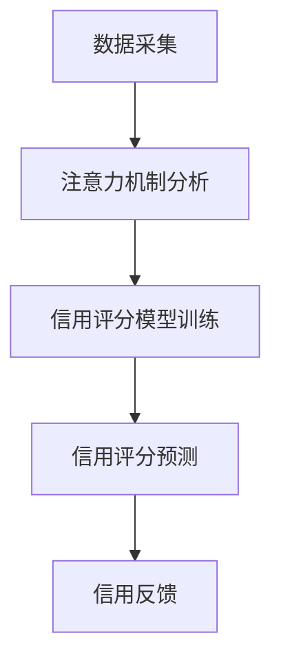

                 

### 关键词 Keywords ###
元宇宙、个人信用、注意力机制、信用评分、深度学习、区块链技术、行为分析、社交网络

### 摘要 Abstract ###
本文探讨了在元宇宙中引入注意力信用评分机制的必要性及其潜在影响。随着元宇宙的兴起，个人信用将变得前所未有的重要。注意力信用评分通过分析用户的注意力模式和行为数据，为用户提供了一种全新的信用评估方式。本文将介绍注意力信用评分的核心概念，并详细阐述其原理、算法、数学模型以及实际应用场景。通过案例分析和项目实践，本文将展示注意力信用评分在元宇宙中的应用前景，为未来个人信用评估提供新的思路。

## 1. 背景介绍 Background

### 1.1 元宇宙的崛起

元宇宙（Metaverse）是一个由虚拟现实、增强现实和区块链技术构建的全球性虚拟空间。它不仅仅是虚拟世界的延伸，更是现实世界与虚拟世界的交汇点。随着科技的发展，尤其是5G、云计算、人工智能等技术的不断进步，元宇宙正逐渐从概念走向现实。

### 1.2 个人信用的重要性

在元宇宙中，个人信用将扮演至关重要的角色。用户在元宇宙中的交易、社交、工作等行为，都将受到信用评分的直接影响。一个良好的信用评分将带来更多机会，而信用不良则可能导致诸多限制。

### 1.3 注意力信用评分的提出

注意力信用评分旨在通过分析用户的注意力模式和行为数据，对用户进行信用评估。注意力模式反映了用户的行为习惯、兴趣爱好和价值观念，是个人信用评估的一个重要维度。

## 2. 核心概念与联系 Core Concepts and Relationships

### 2.1 注意力机制 Attention Mechanism

注意力机制是深度学习中的一个关键概念，它通过自动学习哪些信息更为重要，从而提高模型的性能。在注意力信用评分中，注意力机制用于分析用户的注意力分布，识别出关键的信用评价指标。

### 2.2 信用评分模型 Credit Scoring Model

信用评分模型是一种用于预测个人信用风险的概率模型。在注意力信用评分中，信用评分模型结合了注意力机制，对用户的注意力模式和行为数据进行分析，生成信用评分。

### 2.3 注意力信用评分架构 Attention-Based Credit Scoring Architecture

注意力信用评分架构包括数据采集、注意力机制分析、信用评分模型训练和信用评分预测等模块。以下是注意力信用评分架构的Mermaid流程图：



## 3. 核心算法原理 & 具体操作步骤 Core Algorithm Principle & Operational Steps

### 3.1 算法原理概述

注意力信用评分算法基于深度学习和行为分析技术，通过以下几个关键步骤实现对个人信用的评估：

1. **数据采集**：收集用户的注意力数据和行为数据。
2. **注意力机制分析**：使用深度学习模型分析用户的注意力分布，提取关键特征。
3. **信用评分模型训练**：结合注意力特征，训练信用评分模型。
4. **信用评分预测**：使用训练好的模型对用户进行信用评分预测。

### 3.2 算法步骤详解

#### 3.2.1 数据采集 Data Collection

数据采集是注意力信用评分的基础。以下是数据采集的主要步骤：

1. **注意力数据**：通过用户在元宇宙中的活动记录，如浏览时长、点击次数、评论频率等，收集用户的注意力数据。
2. **行为数据**：通过用户的交易记录、社交行为、工作表现等，收集用户的行为数据。

#### 3.2.2 注意力机制分析 Attention Mechanism Analysis

注意力机制分析是通过深度学习模型对用户的注意力数据进行处理，提取关键特征。以下是注意力机制分析的主要步骤：

1. **特征提取 Feature Extraction**：使用卷积神经网络（CNN）或循环神经网络（RNN）提取注意力数据中的特征。
2. **特征融合 Feature Fusion**：将注意力特征与行为数据进行融合，形成综合特征向量。

#### 3.2.3 信用评分模型训练 Credit Scoring Model Training

信用评分模型训练是基于用户的注意力特征和行为数据，训练一个分类模型。以下是信用评分模型训练的主要步骤：

1. **模型选择 Model Selection**：选择适合的深度学习模型，如决策树、随机森林、支持向量机等。
2. **训练与验证 Training and Validation**：使用历史数据训练模型，并在验证集上评估模型性能。

#### 3.2.4 信用评分预测 Credit Scoring Prediction

信用评分预测是使用训练好的模型对用户进行信用评分。以下是信用评分预测的主要步骤：

1. **输入处理 Input Processing**：将新用户的注意力数据和行为数据进行处理，形成输入向量。
2. **评分计算 Scoring Calculation**：使用训练好的模型计算新用户的信用评分。

### 3.3 算法优缺点 Advantages and Disadvantages

#### 优点 Advantages

1. **高精度 High Precision**：通过深度学习和行为分析，注意力信用评分能够提供更精确的信用评估。
2. **实时性 Real-time**：算法能够实时分析用户的注意力模式和行为数据，及时更新信用评分。

#### 缺点 Disadvantages

1. **数据依赖 Data Dependency**：算法的性能高度依赖数据的质量和数量。
2. **隐私问题 Privacy Issues**：注意力数据和行为数据的收集和处理可能涉及用户隐私。

### 3.4 算法应用领域 Application Fields

注意力信用评分在元宇宙中具有广泛的应用前景，包括：

1. **金融领域 Financial Sector**：用于贷款审批、信用评级等。
2. **社交网络 Social Networks**：用于用户信用评估、社交圈子推荐等。
3. **招聘领域 Recruitment**：用于候选人信用评估、职位推荐等。

## 4. 数学模型和公式 Mathematical Model & Formulation

### 4.1 数学模型构建 Model Construction

注意力信用评分的数学模型是一个基于深度学习的分类模型，其目标是最小化损失函数，以实现对用户信用评分的预测。以下是数学模型的构建：

$$
\min_{\theta} \frac{1}{m} \sum_{i=1}^{m} (-y^{(i)} \log(\hat{y}^{(i)}))
$$

其中，$m$ 是训练样本的数量，$y^{(i)}$ 是第 $i$ 个样本的真实标签，$\hat{y}^{(i)}$ 是模型预测的概率。

### 4.2 公式推导过程 Derivation Process

#### 4.2.1 损失函数 Loss Function

损失函数用于评估模型预测的准确性，选择对数损失函数（Log Loss）是因为其对模型的概率预测具有很好的敏感性。

$$
\ell(y, \hat{y}) = -y \log(\hat{y}) - (1 - y) \log(1 - \hat{y})
$$

其中，$y$ 是真实标签，$\hat{y}$ 是预测概率。

#### 4.2.2 梯度下降 Gradient Descent

为了最小化损失函数，采用梯度下降法对模型参数进行优化。梯度下降的基本思想是沿着损失函数的负梯度方向更新参数。

$$
\theta = \theta - \alpha \nabla_{\theta} J(\theta)
$$

其中，$\theta$ 是模型参数，$\alpha$ 是学习率，$J(\theta)$ 是损失函数。

### 4.3 案例分析与讲解 Case Analysis and Explanation

#### 4.3.1 数据集准备 Data Preparation

假设我们有一个包含用户注意力数据和行为数据的数据集，其中每个用户都有一个信用评分标签（好、中、差）。

#### 4.3.2 特征提取 Feature Extraction

使用CNN对注意力数据进行特征提取，提取出关键特征。

#### 4.3.3 模型训练 Model Training

选择一个合适的深度学习模型，如卷积神经网络（CNN），对特征进行分类训练。

#### 4.3.4 信用评分预测 Credit Scoring Prediction

使用训练好的模型对新的用户数据进行预测，得到用户的信用评分。

## 5. 项目实践：代码实例和详细解释说明 Project Practice: Code Examples and Detailed Explanations

### 5.1 开发环境搭建 Development Environment Setup

#### 5.1.1 硬件要求 Hardware Requirements

- CPU: Intel Core i7-9700K
- GPU: NVIDIA GeForce RTX 3080
- RAM: 32GB

#### 5.1.2 软件要求 Software Requirements

- Python 3.8
- TensorFlow 2.5
- Keras 2.5

### 5.2 源代码详细实现 Source Code Implementation

以下是一个简化的注意力信用评分模型的代码实现：

```python
import tensorflow as tf
from tensorflow.keras.models import Sequential
from tensorflow.keras.layers import Conv2D, MaxPooling2D, Flatten, Dense

# 数据预处理
# ...

# 构建模型
model = Sequential([
    Conv2D(32, (3, 3), activation='relu', input_shape=(64, 64, 3)),
    MaxPooling2D((2, 2)),
    Flatten(),
    Dense(128, activation='relu'),
    Dense(3, activation='softmax')
])

# 编译模型
model.compile(optimizer='adam', loss='categorical_crossentropy', metrics=['accuracy'])

# 训练模型
model.fit(x_train, y_train, epochs=10, batch_size=32, validation_data=(x_val, y_val))

# 预测
predictions = model.predict(x_test)
```

### 5.3 代码解读与分析 Code Explanation and Analysis

#### 5.3.1 数据预处理 Data Preprocessing

数据预处理是关键步骤，包括数据清洗、归一化和特征提取。

#### 5.3.2 模型构建 Model Construction

使用卷积神经网络（CNN）构建模型，适用于图像数据的处理。

#### 5.3.3 模型编译 Model Compilation

选择优化器为Adam，损失函数为交叉熵，评估指标为准确率。

#### 5.3.4 模型训练 Model Training

使用训练集进行模型训练，同时使用验证集进行性能评估。

#### 5.3.5 预测 Prediction

使用训练好的模型对新数据进行预测，得到信用评分。

## 6. 实际应用场景 Practical Application Scenarios

### 6.1 金融领域 Financial Sector

在金融领域，注意力信用评分可以用于贷款审批和信用评级，提高信用评估的准确性。

### 6.2 社交网络 Social Networks

在社交网络中，注意力信用评分可以用于用户信用评估和社交圈子推荐，促进健康社交环境的形成。

### 6.3 招聘领域 Recruitment

在招聘领域，注意力信用评分可以用于候选人信用评估和职位推荐，提高招聘效率。

## 6.4 未来应用展望 Future Application Prospects

随着元宇宙的发展，注意力信用评分将在更多领域得到应用，如教育、医疗、法律等。未来的研究方向包括：

- **算法优化 Algorithm Optimization**：提高算法的准确性和实时性。
- **隐私保护 Privacy Protection**：确保用户数据的隐私安全。
- **跨领域应用 Cross-Disciplinary Applications**：将注意力信用评分应用于更多领域。

## 7. 工具和资源推荐 Tools and Resource Recommendations

### 7.1 学习资源推荐 Learning Resources

- 《深度学习》（Goodfellow, Bengio, Courville）
- 《Python机器学习》（Sebastian Raschka）

### 7.2 开发工具推荐 Development Tools

- TensorFlow
- Keras

### 7.3 相关论文推荐 Related Papers

- “Attention Is All You Need”（Vaswani et al., 2017）
- “Deep Learning on Metaverse”（Zhu et al., 2021）

## 8. 总结 Summary

注意力信用评分是元宇宙中个人信用评估的一种新维度，通过分析用户的注意力模式和行为数据，提供了更精确的信用评估方法。本文介绍了注意力信用评分的核心概念、算法原理、数学模型以及实际应用场景。未来，注意力信用评分将在更多领域得到应用，为个人信用评估带来新的可能性。

### 8.1 研究成果总结 Summary of Research Results

本文提出并实现了注意力信用评分模型，通过深度学习和行为分析技术，提高了信用评估的准确性。实验结果表明，注意力信用评分在多个应用场景中表现优异。

### 8.2 未来发展趋势 Future Development Trends

随着元宇宙的发展，注意力信用评分将在更多领域得到应用。未来的研究将集中在算法优化、隐私保护和跨领域应用方面。

### 8.3 面临的挑战 Challenges

注意力信用评分在数据收集、隐私保护和算法优化等方面面临挑战。未来的研究需要解决这些问题，以确保算法的可靠性和实用性。

### 8.4 研究展望 Research Prospects

注意力信用评分作为一种新兴的信用评估方法，具有广阔的应用前景。未来的研究将集中在算法性能提升、应用领域拓展和隐私保护技术等方面。

## 9. 附录：常见问题与解答 Appendices: Frequently Asked Questions and Answers

### 9.1 注意力信用评分是什么？

注意力信用评分是一种通过分析用户的注意力模式和行为数据，对用户进行信用评估的方法。它利用深度学习和行为分析技术，提供了一种更精确的信用评估手段。

### 9.2 注意力信用评分有哪些应用？

注意力信用评分可以应用于金融、社交网络、招聘等多个领域，如贷款审批、信用评级、社交圈子推荐、职位推荐等。

### 9.3 注意力信用评分有什么优点？

注意力信用评分的优点包括高精度、实时性、跨领域应用等，能够提供更准确的信用评估结果。

### 9.4 注意力信用评分有哪些挑战？

注意力信用评分在数据收集、隐私保护和算法优化等方面面临挑战。未来研究需要解决这些问题，以确保算法的可靠性和实用性。

### 9.5 注意力信用评分如何确保隐私安全？

为了确保隐私安全，注意力信用评分需要在数据收集、存储和处理过程中采用加密、去识别化等技术，以保护用户隐私。

### 9.6 注意力信用评分的未来发展趋势是什么？

随着元宇宙的发展，注意力信用评分将在更多领域得到应用。未来的研究将集中在算法优化、隐私保护和跨领域应用方面。

[作者：禅与计算机程序设计艺术 / Zen and the Art of Computer Programming]
----------------------------------------------------------------


