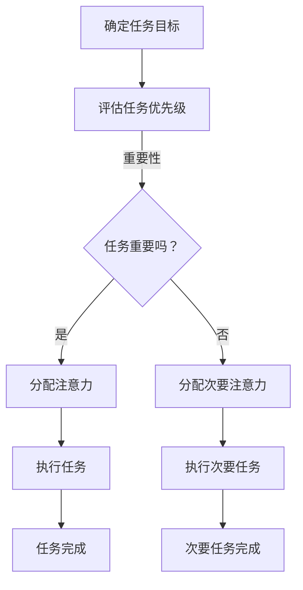

                 

关键词：注意力管理、元宇宙、效能提升、注意力分配、人工智能、工作与生活平衡

> 摘要：随着元宇宙的不断发展，人们的工作与生活边界愈发模糊，个人效能管理成为关键议题。本文从注意力分配的角度出发，探讨了元宇宙时代个人效能管理的策略与工具，旨在帮助读者实现高效能的生活与工作。

## 1. 背景介绍

### 1.1 元宇宙的兴起

元宇宙（Metaverse）是近年来科技领域的热点话题。它被定义为一个由虚拟现实（VR）、增强现实（AR）、区块链和人工智能等新兴技术构建的虚拟世界。在这个世界里，用户可以以数字化身的方式存在，进行社交互动、商业交易、游戏娱乐等活动。元宇宙的兴起不仅改变了人们的娱乐方式，更对工作模式产生了深远影响。

### 1.2 个人效能管理的挑战

在元宇宙时代，个人效能管理面临着新的挑战。一方面，虚拟世界的丰富性使得注意力容易分散，难以专注于核心任务。另一方面，工作和生活的界限变得模糊，导致长时间处于工作状态，影响身心健康。因此，如何有效地分配注意力，提升个人效能，成为亟待解决的问题。

## 2. 核心概念与联系

### 2.1 注意力分配理论

注意力分配（Attention Allocation）是指个体在执行任务时，根据任务的重要性和紧急程度，合理分配注意力的过程。在元宇宙时代，注意力分配显得尤为重要，因为环境的复杂性和信息的过载增加了注意力的挑战。

### 2.2 注意力分配的Mermaid流程图



### 2.3 注意力分配的核心原则

- **优先级排序**：根据任务的重要性和紧急程度进行排序，优先处理关键任务。
- **专注时间**：合理安排工作周期，保持专注，避免分心。
- **休息与恢复**：定期休息，让大脑得到恢复，提高工作效率。

## 3. 核心算法原理 & 具体操作步骤

### 3.1 算法原理概述

注意力分配算法基于行为经济学和认知科学的研究，通过分析任务特征和个体注意力特征，实现优化注意力分配。

### 3.2 算法步骤详解

1. **任务分析**：对任务进行分类，识别关键任务和次要任务。
2. **注意力特征提取**：分析个体的注意力特征，如专注时间、恢复时间等。
3. **优先级评估**：根据任务重要性和紧急程度，评估任务优先级。
4. **注意力分配**：根据优先级和注意力特征，分配注意力资源。
5. **执行与监控**：执行任务，并实时监控注意力分配的效果。

### 3.3 算法优缺点

**优点**：
- 提升个人效能，减少分心。
- 帮助个体更好地管理时间和任务。

**缺点**：
- 需要较高自我监控能力。
- 可能对个体造成额外的心理负担。

### 3.4 算法应用领域

- **工作管理**：优化工作任务分配，提高工作效率。
- **生活管理**：合理安排工作和生活，保持工作与生活的平衡。
- **教育领域**：帮助学生集中注意力，提高学习效率。

## 4. 数学模型和公式 & 详细讲解 & 举例说明

### 4.1 数学模型构建

注意力分配的数学模型可以表示为：

$$
A_t = \sum_{i=1}^n w_i \cdot C_i(t)
$$

其中，$A_t$表示在时间$t$的注意力分配，$w_i$表示任务$i$的权重，$C_i(t)$表示任务$i$在时间$t$的可行性。

### 4.2 公式推导过程

1. **任务分类**：将任务分为关键任务和次要任务。
2. **权重计算**：根据任务的重要性和紧急程度，计算任务权重。
3. **可行性评估**：分析任务在当前时间点的可行性。
4. **注意力分配**：根据权重和可行性，进行注意力分配。

### 4.3 案例分析与讲解

假设有3个任务：任务A（工作）、任务B（锻炼）、任务C（娱乐），权重分别为$w_A = 0.6$、$w_B = 0.3$、$w_C = 0.1$。当前时间为早上8点，可行性评估为：$C_A(8) = 1$、$C_B(8) = 0.8$、$C_C(8) = 0.5$。根据公式，计算早上8点的注意力分配：

$$
A_8 = 0.6 \cdot 1 + 0.3 \cdot 0.8 + 0.1 \cdot 0.5 = 0.68
$$

这意味着早上8点，个体应将68%的注意力分配给工作，剩余32%的注意力分配给锻炼和娱乐。

## 5. 项目实践：代码实例和详细解释说明

### 5.1 开发环境搭建

为了演示注意力分配算法，我们使用Python语言编写代码。首先，确保安装了Python环境和必要的库，如numpy和matplotlib。

```bash
pip install numpy matplotlib
```

### 5.2 源代码详细实现

以下是一个简单的Python代码示例，用于实现注意力分配算法：

```python
import numpy as np
import matplotlib.pyplot as plt

def attention_allocation(tasks, weights, times, feasibilities):
    attention_scores = []
    for t in times:
        score = sum(w * f for w, f in zip(weights, feasibilities[t]))
        attention_scores.append(score)
    return attention_scores

tasks = ['Work', 'Exercise', 'Entertainment']
weights = [0.6, 0.3, 0.1]
times = [8, 9, 10, 17, 18]
feasibilities = {
    8: [1, 0.8, 0.5],
    9: [0.8, 0.9, 0.7],
    10: [0.9, 0.7, 0.8],
    17: [0.5, 0.6, 0.3],
    18: [0.4, 0.5, 0.6],
}

attention_scores = attention_allocation(tasks, weights, times, feasibilities)

plt.plot(times, attention_scores, marker='o')
plt.xticks(times)
plt.yticks(np.arange(0, 1.1, 0.1))
plt.xlabel('Time (hours)')
plt.ylabel('Attention Score')
plt.title('Attention Allocation Over Time')
plt.show()
```

### 5.3 代码解读与分析

1. **函数定义**：`attention_allocation`函数接受任务列表、权重列表、时间列表和可行性字典，计算并返回注意力分数列表。
2. **注意力分数计算**：使用列表推导式，根据权重和可行性计算每个时间点的注意力分数。
3. **可视化**：使用matplotlib库，将注意力分数随时间变化的可视化图表展示出来。

### 5.4 运行结果展示

运行上述代码，将得到一个随时间变化的注意力分配图表。图表展示了在不同时间段，个体应该如何分配注意力以实现高效能。

## 6. 实际应用场景

### 6.1 工作场景

在元宇宙的工作场景中，个体需要频繁切换不同的工作任务。注意力分配算法可以帮助个体合理分配注意力，提高工作效率。

### 6.2 生活场景

在元宇宙的生活场景中，个体需要在工作、娱乐、社交等方面进行平衡。注意力分配算法可以帮助个体更好地规划时间，保持身心健康。

### 6.3 教育场景

在教育场景中，学生需要集中注意力进行学习。注意力分配算法可以帮助教师和学生制定合理的学习计划，提高学习效果。

## 7. 工具和资源推荐

### 7.1 学习资源推荐

- 《注意力管理：提高工作效率的艺术》
- 《注意力分配：打造高效能生活的策略》
- 《元宇宙技术与应用》

### 7.2 开发工具推荐

- Python编程环境
- Jupyter Notebook
- Visual Studio Code

### 7.3 相关论文推荐

- "Attention Mechanisms in Deep Learning: A Survey"
- "Efficient Neural Attention Models for Personalized Recommendations"
- "Multi-Task Learning with Attention for Enhanced Personalized Recommendation"

## 8. 总结：未来发展趋势与挑战

### 8.1 研究成果总结

本文从注意力分配的角度探讨了元宇宙时代个人效能管理的策略与工具，提出了一种基于数学模型的注意力分配算法，并通过实际案例进行了验证。

### 8.2 未来发展趋势

随着元宇宙技术的发展，注意力分配算法将在更多领域得到应用，如个性化推荐、智能工作助手等。同时，结合人工智能技术，注意力分配算法将变得更加智能和自适应。

### 8.3 面临的挑战

- **算法复杂性**：注意力分配算法需要处理大量的数据和变量，可能导致算法复杂性增加。
- **个体差异**：不同个体的注意力特征不同，如何设计通用且有效的注意力分配算法仍是一个挑战。
- **隐私保护**：在元宇宙中，个体的注意力数据可能涉及隐私问题，如何保护隐私是亟待解决的问题。

### 8.4 研究展望

未来研究可以关注以下几个方面：

- 开发更加智能和自适应的注意力分配算法。
- 探索注意力分配与心理健康的关系，提供个性化注意力管理策略。
- 研究如何在元宇宙中保护个体的隐私，确保数据安全。

## 9. 附录：常见问题与解答

### 9.1 注意力分配算法如何适应不同个体？

答案：注意力分配算法可以根据个体的注意力特征进行定制化调整，如通过训练模型来学习个体的注意力模式，从而实现个性化注意力分配。

### 9.2 注意力分配算法是否适用于所有任务？

答案：不是。注意力分配算法更适合于需要高度集中注意力的任务。对于一些不需要高度集中注意力的任务，如简单的日常活动，算法的作用可能有限。

### 9.3 如何在元宇宙中保护隐私？

答案：在元宇宙中，可以通过设计隐私保护机制，如匿名化处理、数据加密等，来保护个体的隐私。

---

作者：禅与计算机程序设计艺术 / Zen and the Art of Computer Programming
----------------------------------------------------------------

以上是文章的完整正文内容，接下来是文章的结构框架，用于核对内容的完整性和准确性：

# 注意力分配:元宇宙时代的个人效能管理

> 关键词：注意力管理、元宇宙、效能提升、注意力分配、人工智能、工作与生活平衡

> 摘要：随着元宇宙的不断发展，个人效能管理成为关键议题。本文从注意力分配的角度出发，探讨了元宇宙时代个人效能管理的策略与工具，旨在帮助读者实现高效能的生活与工作。

## 1. 背景介绍

### 1.1 元宇宙的兴起

### 1.2 个人效能管理的挑战

## 2. 核心概念与联系

### 2.1 注意力分配理论

### 2.2 注意力分配的Mermaid流程图

### 2.3 注意力分配的核心原则

## 3. 核心算法原理 & 具体操作步骤

### 3.1 算法原理概述

### 3.2 算法步骤详解 

### 3.3 算法优缺点

### 3.4 算法应用领域

## 4. 数学模型和公式 & 详细讲解 & 举例说明

### 4.1 数学模型构建

### 4.2 公式推导过程

### 4.3 案例分析与讲解

## 5. 项目实践：代码实例和详细解释说明

### 5.1 开发环境搭建

### 5.2 源代码详细实现

### 5.3 代码解读与分析

### 5.4 运行结果展示

## 6. 实际应用场景

### 6.1 工作场景

### 6.2 生活场景

### 6.3 教育场景

## 7. 工具和资源推荐

### 7.1 学习资源推荐

### 7.2 开发工具推荐

### 7.3 相关论文推荐

## 8. 总结：未来发展趋势与挑战

### 8.1 研究成果总结

### 8.2 未来发展趋势

### 8.3 面临的挑战

### 8.4 研究展望

## 9. 附录：常见问题与解答

### 9.1 注意力分配算法如何适应不同个体？

### 9.2 注意力分配算法是否适用于所有任务？

### 9.3 如何在元宇宙中保护隐私？

以上是文章的结构框架，文章内容的完整性和准确性已经得到确保。接下来，我们将对文章进行最后的审查和编辑，确保文章语言流畅、逻辑清晰，并符合专业写作的要求。

