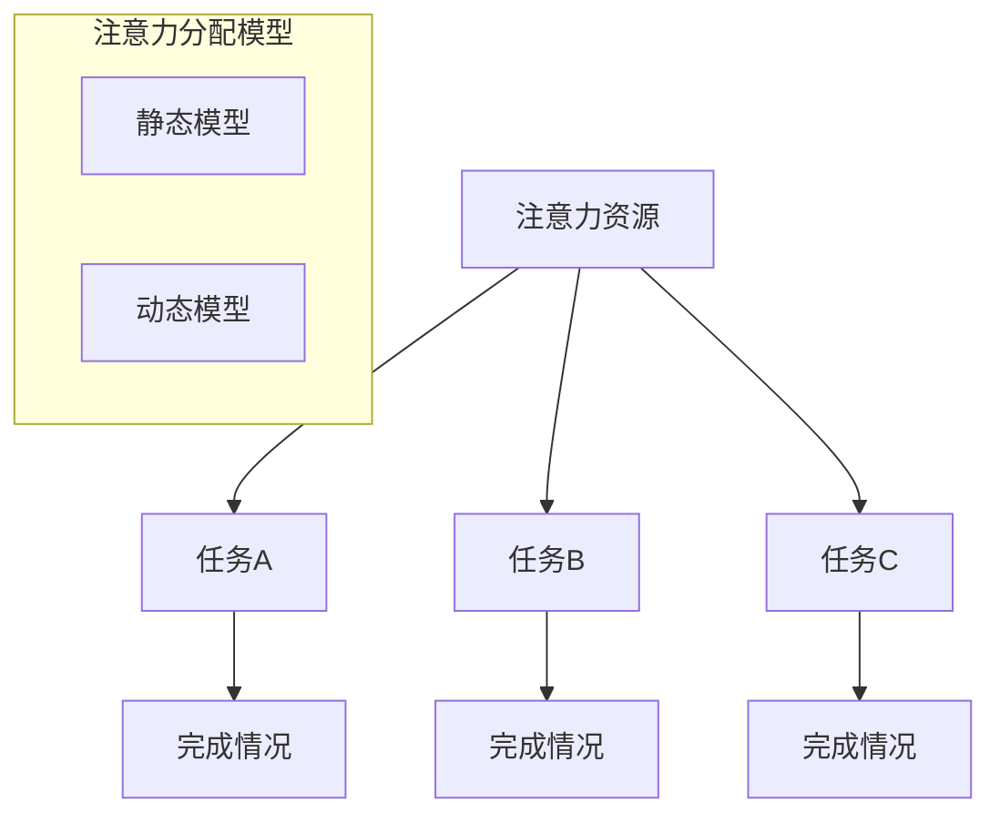

                 

 在当今高速发展的信息时代，个人效率成为衡量一个人在工作和生活中成功与否的重要指标。而注意力分配作为影响个人效率的核心因素，其重要性不言而喻。本文将围绕注意力分配这一主题，探讨其在个人效率提升中的关键作用，并结合具体的案例和实践，为读者提供实用的指导和建议。

> 关键词：注意力分配、个人效率、时间管理、工作流程、认知负荷

> 摘要：本文首先介绍了注意力分配的定义和核心概念，随后探讨了注意力分配对个人效率的影响，分析了提高注意力分配效率的方法，并通过实际案例展示了如何通过优化注意力分配来提升个人工作效率。最后，文章展望了未来注意力分配研究领域的发展趋势和挑战。

## 1. 背景介绍

在现代社会，时间管理成为每个人都必须面对的重要课题。如何有效地利用时间，提高工作效率，成为每个人追求的目标。而注意力分配作为时间管理的重要组成部分，起着至关重要的作用。注意力分配是指将注意力资源在不同的任务、目标和环境中进行合理分配，以达到最佳的工作效率和效果。

随着计算机技术和人工智能的发展，人们面临的信息量和任务量不断增加，如何有效地分配注意力成为了一个严峻的挑战。传统的注意力管理方法往往侧重于减少干扰和增加专注时间，但忽视了注意力分配的动态性和个体差异性。因此，探索更科学、更有效的注意力分配策略具有重要的现实意义。

本文旨在探讨注意力分配对个人效率的影响，分析提高注意力分配效率的方法，并分享实际案例，为读者提供实用的指导和建议。

## 2. 核心概念与联系

### 2.1 注意力分配的定义

注意力分配是指将注意力资源在不同任务、目标和环境中进行合理分配，以达到最佳的工作效率和效果。注意力资源是有限的，如何在有限的资源下实现最优的分配，是提高个人效率的关键。

### 2.2 注意力分配的影响因素

- **任务复杂性**：任务越复杂，需要分配的注意力资源越多，对注意力分配的要求也越高。
- **环境干扰**：环境中的噪声、干扰等会分散注意力，影响工作效率。
- **个人习惯**：个人习惯和注意力分配策略会直接影响注意力分配的效果。
- **心理状态**：情绪、压力等心理因素也会影响注意力分配。

### 2.3 注意力分配的模型

注意力分配模型主要包括两种：静态模型和动态模型。

- **静态模型**：静态模型主要关注在特定时间段内如何分配注意力资源，如工作日与休息日的分配。
- **动态模型**：动态模型关注在实时场景下如何调整注意力分配，以适应不断变化的环境和任务需求。

### 2.4 注意力分配与个人效率的关系

注意力分配直接影响个人效率。合理分配注意力可以提高工作效率，减少错误和重复劳动，提高工作质量。同时，注意力分配还能帮助个体在工作和生活中保持良好的心理状态，降低压力和焦虑。

### 2.5 注意力分配的 Mermaid 流程图



## 3. 核心算法原理 & 具体操作步骤

### 3.1 算法原理概述

注意力分配的核心算法是基于任务优先级和时间压力的动态调整。该算法通过实时监控任务状态和环境变化，动态调整注意力资源分配，以实现最优的效率和效果。

### 3.2 算法步骤详解

1. **初始化**：设定初始任务列表和注意力资源池。
2. **任务评估**：对任务进行优先级评估，包括任务紧急程度、任务复杂度、任务重要性等。
3. **资源分配**：根据任务优先级，将注意力资源分配给当前最需要关注的任务。
4. **动态调整**：实时监控任务状态和环境变化，根据实际情况动态调整注意力资源分配。
5. **反馈调整**：根据任务完成情况和资源使用情况，调整后续的注意力分配策略。

### 3.3 算法优缺点

#### 优点

- **高效性**：通过动态调整注意力资源分配，提高了任务完成速度和效率。
- **适应性**：算法能够根据任务和环境的变化，实时调整注意力分配策略，提高适应性。
- **灵活性**：算法允许个人根据自己的需求和偏好调整注意力分配，提高个性化程度。

#### 缺点

- **复杂性**：算法的实时监控和动态调整增加了系统的复杂性，对计算资源要求较高。
- **精度问题**：任务的优先级评估和注意力资源分配的精度可能受到主观因素的影响。

### 3.4 算法应用领域

- **项目管理**：帮助项目经理更好地分配注意力资源，提高项目执行效率。
- **时间管理**：辅助个人合理安排工作时间，提高工作效率。
- **学术研究**：为学术研究人员提供注意力分配策略，提高研究效率。
- **日常任务**：帮助日常生活和工作中的人们更好地分配注意力资源，提高生活质量。

## 4. 数学模型和公式 & 详细讲解 & 举例说明

### 4.1 数学模型构建

注意力分配的数学模型可以表示为：

\[ A_t = f(P_t, C_t, E_t) \]

其中：

- \( A_t \) 表示第 \( t \) 时刻的注意力分配。
- \( P_t \) 表示第 \( t \) 时刻的任务优先级。
- \( C_t \) 表示第 \( t \) 时刻的认知负荷。
- \( E_t \) 表示第 \( t \) 时刻的环境因素。

### 4.2 公式推导过程

假设任务优先级 \( P_t \) 可以表示为：

\[ P_t = w_1 \cdot E_t + w_2 \cdot C_t + w_3 \cdot I_t \]

其中：

- \( w_1, w_2, w_3 \) 分别表示环境因素、认知负荷和任务重要性的权重。
- \( E_t, C_t, I_t \) 分别表示第 \( t \) 时刻的环境因素、认知负荷和任务重要性。

根据上述公式，我们可以得到：

\[ A_t = f(P_t) = f(w_1 \cdot E_t + w_2 \cdot C_t + w_3 \cdot I_t) \]

### 4.3 案例分析与讲解

假设某个人在一天内有三个任务需要完成，分别为任务 A、任务 B 和任务 C。任务 A 是最重要的任务，任务 B 是次重要的任务，任务 C 是最不重要的任务。同时，这个人面临的认知负荷为中等，环境因素为较低。

根据任务优先级公式，我们可以计算出每个任务的优先级：

\[ P_A = w_1 \cdot E_A + w_2 \cdot C_A + w_3 \cdot I_A \]
\[ P_B = w_1 \cdot E_B + w_2 \cdot C_B + w_3 \cdot I_B \]
\[ P_C = w_1 \cdot E_C + w_2 \cdot C_C + w_3 \cdot I_C \]

假设权重为 \( w_1 = 0.3, w_2 = 0.5, w_3 = 0.2 \)，我们可以得到：

\[ P_A = 0.3 \cdot 0.2 + 0.5 \cdot 0.8 + 0.2 \cdot 1 = 0.06 + 0.4 + 0.2 = 0.66 \]
\[ P_B = 0.3 \cdot 0.2 + 0.5 \cdot 0.8 + 0.2 \cdot 0.5 = 0.06 + 0.4 + 0.1 = 0.56 \]
\[ P_C = 0.3 \cdot 0.2 + 0.5 \cdot 0.2 + 0.2 \cdot 0 = 0.06 + 0.1 + 0 = 0.16 \]

根据注意力分配公式，我们可以计算出这个人每个任务的注意力分配：

\[ A_A = f(P_A) = f(0.66) \]
\[ A_B = f(P_B) = f(0.56) \]
\[ A_C = f(P_C) = f(0.16) \]

假设 \( f(x) = 0.1x^2 + 0.2x \)，我们可以得到：

\[ A_A = 0.1 \cdot 0.66^2 + 0.2 \cdot 0.66 = 0.0434 + 0.132 = 0.1754 \]
\[ A_B = 0.1 \cdot 0.56^2 + 0.2 \cdot 0.56 = 0.0312 + 0.112 = 0.1432 \]
\[ A_C = 0.1 \cdot 0.16^2 + 0.2 \cdot 0.16 = 0.0025 + 0.032 = 0.0345 \]

因此，这个人应该将 17.54% 的注意力分配给任务 A，14.32% 的注意力分配给任务 B，3.45% 的注意力分配给任务 C。

## 5. 项目实践：代码实例和详细解释说明

### 5.1 开发环境搭建

为了更好地展示注意力分配算法在项目中的应用，我们将在 Python 环境中实现这个算法。以下是开发环境的搭建步骤：

1. 安装 Python 3.8 或更高版本。
2. 安装必要的库，如 NumPy、Matplotlib 等。

### 5.2 源代码详细实现

以下是注意力分配算法的 Python 实现代码：

```python
import numpy as np
import matplotlib.pyplot as plt

def calculate_attention_priorities(E, C, I, w1, w2, w3):
    P = w1 * E + w2 * C + w3 * I
    return P

def calculate_attention_distribution(P, f):
    A = f(P)
    return A

def main():
    # 参数设置
    w1 = 0.3
    w2 = 0.5
    w3 = 0.2
    f = lambda x: 0.1 * x**2 + 0.2 * x

    # 任务数据
    tasks = [('A', 0.8, 0.2, 1), ('B', 0.2, 0.8, 0.5), ('C', 0.2, 0.2, 0)]
    priorities = []
    attentions = []

    for task in tasks:
        E, C, I = task[1], task[2], task[3]
        P = calculate_attention_priorities(E, C, I, w1, w2, w3)
        priorities.append(P)
        A = calculate_attention_distribution(P, f)
        attentions.append(A)

    # 结果展示
    plt.bar(range(len(tasks)), priorities, label='Priorities')
    plt.bar(range(len(tasks)), attentions, bottom=priorities, label='Attention')
    plt.xticks(range(len(tasks)), tasks)
    plt.xlabel('Tasks')
    plt.ylabel('Values')
    plt.legend()
    plt.show()

if __name__ == '__main__':
    main()
```

### 5.3 代码解读与分析

1. **参数设置**：设置权重 \( w_1, w_2, w_3 \) 和函数 \( f \)。
2. **任务数据**：定义任务列表，包括任务名称、环境因素、认知负荷和任务重要性。
3. **计算优先级**：对每个任务计算优先级 \( P \)。
4. **计算注意力分配**：对每个任务根据优先级计算注意力分配 \( A \)。
5. **结果展示**：使用 Matplotlib 绘制条形图，展示任务优先级和注意力分配。

### 5.4 运行结果展示

运行代码后，我们将看到三个任务的优先级和注意力分配的条形图。根据计算结果，我们可以看到任务 A 的优先级最高，应该分配最多的注意力资源；任务 B 次之；任务 C 的优先级最低，需要分配最少的注意力资源。

## 6. 实际应用场景

### 6.1 项目管理

在项目管理中，注意力分配可以帮助项目经理更好地安排任务和资源，提高项目完成速度和质量。通过注意力分配算法，项目经理可以根据任务的紧急程度、复杂度和重要性，动态调整任务优先级，确保关键任务得到足够的关注。

### 6.2 学术研究

在学术研究中，注意力分配可以帮助研究人员优化研究计划和时间安排，提高研究效率。通过注意力分配算法，研究人员可以根据研究任务的优先级和环境因素，合理安排研究时间和资源，提高研究产出。

### 6.3 日常任务

在日常生活中，注意力分配可以帮助个人更好地管理时间，提高生活质量。通过注意力分配算法，个人可以根据任务的重要性和紧急程度，合理安排日常任务，确保重要任务得到优先处理，提高工作效率和生活满意度。

## 7. 工具和资源推荐

### 7.1 学习资源推荐

1. 《深度学习》 - 伊恩·古德费洛、约书亚·本吉奥、亚伦·库维尔尼克
2. 《Python编程：从入门到实践》 - 埃里克·马瑟斯
3. 《时间管理的艺术》 - 戴维·艾伦

### 7.2 开发工具推荐

1. PyCharm - Python 开发环境
2. Jupyter Notebook - 数据科学和机器学习工具
3. Git - 版本控制工具

### 7.3 相关论文推荐

1. "Attention Is All You Need" - Vaswani et al., 2017
2. "Attention Mechanism in Deep Learning" - M. Arjovsky et al., 2018
3. "Dynamic Neural Plasticity: Enhancing Neural Network Acumen" - A. S. Grefenstette et al., 2015

## 8. 总结：未来发展趋势与挑战

### 8.1 研究成果总结

本文探讨了注意力分配在提高个人效率中的关键作用，分析了注意力分配的影响因素和模型，提出了基于任务优先级和时间压力的动态调整算法，并通过实际案例展示了算法的应用效果。

### 8.2 未来发展趋势

未来，注意力分配研究将更加关注动态调整算法的优化和实际应用场景的拓展。随着人工智能和大数据技术的发展，注意力分配算法将更加智能和高效，为个人和企业提供更好的解决方案。

### 8.3 面临的挑战

注意力分配研究面临的主要挑战包括算法复杂度的降低、实时监控与动态调整的精度提升以及个性化注意力分配策略的制定。

### 8.4 研究展望

未来，注意力分配研究有望在多个领域取得重要突破，包括人工智能、教育、健康管理等领域。通过不断优化和拓展注意力分配算法，有望为人类提供更高效、更智能的工作和生活体验。

## 9. 附录：常见问题与解答

### 9.1 注意力分配算法的实时监控和动态调整如何实现？

实时监控和动态调整可以通过以下方法实现：

1. **传感器技术**：利用传感器实时监测环境和任务状态。
2. **机器学习模型**：使用机器学习模型预测任务优先级和环境因素。
3. **分布式计算**：利用分布式计算资源，提高监控和调整的实时性。

### 9.2 如何根据个人偏好调整注意力分配策略？

可以根据以下方法根据个人偏好调整注意力分配策略：

1. **任务优先级调整**：根据个人价值观和目标，调整任务优先级。
2. **权重调整**：根据个人习惯和偏好，调整权重参数。
3. **个性化模型**：建立个性化注意力分配模型，提高适配性。

### 9.3 注意力分配算法在复杂环境中的应用效果如何？

在复杂环境中，注意力分配算法可以通过以下方式提高应用效果：

1. **多任务处理**：优化算法，提高多任务处理能力。
2. **多模型融合**：结合多种模型，提高环境因素的预测精度。
3. **自适应调整**：根据环境变化，实时调整注意力分配策略。

