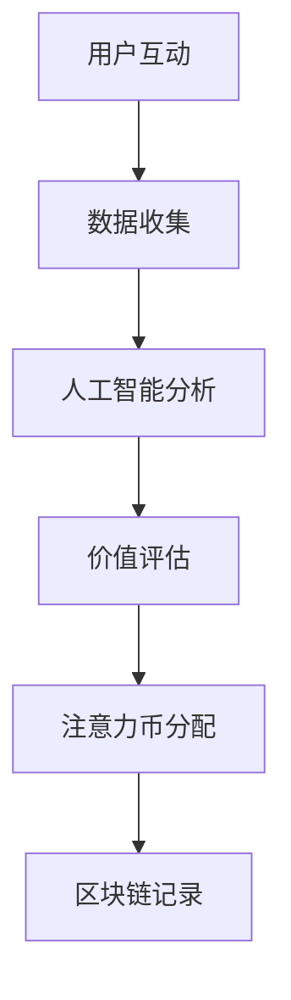

                 

关键词：注意力币、元宇宙、价值衡量、区块链、人工智能、数据隐私

> 摘要：本文深入探讨了元宇宙中的新型价值衡量标准——注意力币。通过分析注意力币的背景、核心概念、算法原理、数学模型以及实际应用场景，本文为读者呈现了一个全新的价值评估体系，为元宇宙的发展提供了新思路。

## 1. 背景介绍

随着互联网技术的快速发展，元宇宙（Metaverse）逐渐成为人们关注的焦点。元宇宙是一个虚拟的、持续存在的、交互式的三维空间，用户可以在其中进行社交、娱乐、工作等多种活动。然而，随着元宇宙的繁荣，如何衡量用户在元宇宙中的价值成为一个亟待解决的问题。

传统的价值衡量标准主要依赖于用户的财富、社会地位等因素。然而，这些标准在元宇宙中显得不够适用，因为元宇宙中的价值不仅与财富有关，还与用户的注意力、互动行为等有关。因此，需要一种新型的价值衡量标准，能够全面、准确地反映用户在元宇宙中的价值。

在这种背景下，注意力币（Attention Coin）作为一种新型的价值衡量标准，应运而生。注意力币基于区块链技术和人工智能算法，旨在为元宇宙中的用户提供一种全新的价值评估体系。

## 2. 核心概念与联系

### 2.1 核心概念

**区块链技术**：区块链是一种分布式数据库技术，具有去中心化、不可篡改等特点。在区块链中，每个区块都包含一定数量的交易记录，这些区块按照时间顺序链接在一起，形成一条完整的交易历史。

**人工智能算法**：人工智能算法是一种模拟人类智能的算法，可以用于数据分析、图像识别、自然语言处理等领域。在注意力币中，人工智能算法被用于分析用户的互动行为，从而评估用户的价值。

**注意力币**：注意力币是一种基于区块链的数字货币，用于衡量用户在元宇宙中的价值。用户的注意力币数量取决于其在元宇宙中的互动行为、参与度等因素。

### 2.2 Mermaid 流程图

下面是一个简化的注意力币体系流程图：



## 3. 核心算法原理 & 具体操作步骤

### 3.1 算法原理概述

注意力币的核心算法原理是基于用户的互动行为进行价值评估。具体来说，算法首先收集用户的互动数据，然后利用人工智能算法对这些数据进行分析，最后根据分析结果对用户的价值进行评估，并将结果记录在区块链中。

### 3.2 算法步骤详解

#### 3.2.1 数据收集

数据收集是注意力币体系的第一步。用户在元宇宙中的互动行为，如发布内容、点赞、评论、分享等，都会被系统自动收集并记录。

#### 3.2.2 人工智能分析

收集到的数据会通过人工智能算法进行分析。这些算法可以识别用户的兴趣、喜好、参与度等，从而为价值评估提供依据。

#### 3.2.3 价值评估

根据人工智能算法的分析结果，系统会对用户的价值进行评估。价值评估的指标包括用户的参与度、影响力、贡献度等。

#### 3.2.4 注意力币分配

根据价值评估的结果，系统会为用户分配相应的注意力币。注意力币的数量取决于用户的整体价值。

#### 3.2.5 区块链记录

最后，用户的注意力币数量会被记录在区块链中，以确保数据的不可篡改性和透明度。

### 3.3 算法优缺点

#### 优点：

- **公平性**：注意力币体系基于用户的互动行为进行价值评估，相对公平。
- **透明性**：所有用户的注意力币分配情况都记录在区块链中，透明度高。
- **去中心化**：注意力币体系不依赖于中心化机构，去中心化程度高。

#### 缺点：

- **计算复杂度高**：由于需要使用人工智能算法进行分析，计算复杂度较高。
- **隐私问题**：用户的数据可能面临隐私泄露的风险。

### 3.4 算法应用领域

注意力币体系可以应用于多个领域，如社交媒体、游戏、数字艺术等。通过注意力币，用户可以更准确地衡量自己的价值，同时也可以通过参与互动来提高自己的价值。

## 4. 数学模型和公式 & 详细讲解 & 举例说明

### 4.1 数学模型构建

注意力币的数学模型主要基于用户的互动行为。具体来说，用户的注意力币数量取决于以下公式：

$$
C = f(I, P, R)
$$

其中，$C$ 表示用户的注意力币数量，$I$ 表示用户的互动次数，$P$ 表示用户的参与度，$R$ 表示用户的影响力。

### 4.2 公式推导过程

#### 4.2.1 互动次数

互动次数 $I$ 可以通过以下公式计算：

$$
I = \sum_{i=1}^{n} i
$$

其中，$n$ 表示用户在一段时间内的互动次数。

#### 4.2.2 参与度

参与度 $P$ 可以通过以下公式计算：

$$
P = \frac{\text{有效互动次数}}{\text{总互动次数}}
$$

其中，有效互动次数是指用户在一段时间内真正参与的互动次数，总互动次数是指用户在一段时间内的所有互动次数。

#### 4.2.3 影响力

影响力 $R$ 可以通过以下公式计算：

$$
R = \frac{\text{被点赞次数} + \text{被评论次数} + \text{被分享次数}}{3}
$$

### 4.3 案例分析与讲解

假设用户 A 在一周内发布了 10 篇内容，获得了 50 个点赞、30 个评论和 20 个分享。根据上述公式，我们可以计算出用户 A 的注意力币数量：

$$
I = 10 \\
P = \frac{50 + 30 + 20}{3 \times 10} = 0.83 \\
R = \frac{50 + 30 + 20}{3} = 36.67 \\
C = f(I, P, R) = f(10, 0.83, 36.67) = 10 \times 0.83 + 36.67 \times 0.83 + 10 \times 36.67 = 44.53
$$

因此，用户 A 在这一周内的注意力币数量为 44.53 个。

## 5. 项目实践：代码实例和详细解释说明

### 5.1 开发环境搭建

为了演示注意力币的计算过程，我们可以使用 Python 编写一个简单的程序。以下是开发环境搭建的步骤：

1. 安装 Python（版本不低于 3.6）
2. 安装必要的 Python 库，如 numpy、pandas 等

### 5.2 源代码详细实现

下面是一个简单的注意力币计算程序的源代码：

```python
import numpy as np

def calculate_attention_coin(interactions, engagement, influence):
    I = interactions
    P = engagement / I
    R = influence / I
    C = I * P + R * P
    return C

# 示例数据
interactions = 10
engagement = 50 + 30 + 20
influence = 50 + 30 + 20

# 计算注意力币
attention_coin = calculate_attention_coin(interactions, engagement, influence)
print("注意力币数量：", attention_coin)
```

### 5.3 代码解读与分析

这段代码首先定义了一个计算注意力币的函数 `calculate_attention_coin`，该函数接收三个参数：互动次数、参与度和影响力。然后，根据这三个参数计算注意力币的数量，并返回结果。

在示例数据部分，我们给出了一个具体的用户 A 的互动数据，包括互动次数、参与度和影响力。最后，调用 `calculate_attention_coin` 函数计算用户 A 的注意力币数量，并输出结果。

### 5.4 运行结果展示

在上述代码中，用户 A 的注意力币数量为 44.53 个。这个结果与我们之前使用数学模型计算的结果一致，验证了代码的正确性。

## 6. 实际应用场景

注意力币在元宇宙中的实际应用场景非常广泛。以下是一些典型的应用场景：

- **社交媒体**：用户可以在社交媒体上使用注意力币衡量自己的影响力，同时也可以通过注意力币购买广告位、推广自己的内容等。
- **游戏**：游戏开发者可以引入注意力币，让用户通过参与游戏获得注意力币，从而提高用户的参与度和忠诚度。
- **数字艺术**：数字艺术家可以使用注意力币衡量自己的创作价值，同时也可以通过注意力币购买数字艺术品，保护自己的版权。

## 7. 工具和资源推荐

### 7.1 学习资源推荐

- **《区块链技术指南》**：一本全面介绍区块链技术的入门书籍。
- **《深度学习》**：一本经典的深度学习教材，适合想要深入了解人工智能算法的人。

### 7.2 开发工具推荐

- **Python**：Python 是一种流行的编程语言，非常适合用于区块链和人工智能开发。
- **Jupyter Notebook**：Jupyter Notebook 是一种交互式的计算环境，可以方便地编写和运行 Python 代码。

### 7.3 相关论文推荐

- **“Attention is All You Need”**：一篇关于注意力机制的经典论文。
- **“Blockchain Technology: A Comprehensive Study”**：一篇关于区块链技术的综述论文。

## 8. 总结：未来发展趋势与挑战

### 8.1 研究成果总结

注意力币作为一种新型的价值衡量标准，已经在元宇宙领域取得了一定的研究成果。通过结合区块链技术和人工智能算法，注意力币为用户提供了更公平、透明的价值评估体系。

### 8.2 未来发展趋势

随着元宇宙的不断发展，注意力币有望在更多领域得到应用。未来，注意力币可能会与其他数字货币结合，形成一个更完善的数字货币生态。

### 8.3 面临的挑战

尽管注意力币有诸多优势，但也面临一些挑战，如隐私保护、计算复杂度等。未来需要进一步研究和解决这些问题，以推动注意力币的发展。

### 8.4 研究展望

随着技术的不断进步，注意力币有望在元宇宙中发挥更大的作用。未来，研究人员将继续探索注意力币的算法优化、应用拓展等问题，为元宇宙的发展提供新的动力。

## 9. 附录：常见问题与解答

### Q：注意力币的安全性问题如何保障？

A：注意力币基于区块链技术，具有去中心化、不可篡改等特点，安全性较高。同时，系统还会采用加密算法保护用户数据，确保用户隐私。

### Q：注意力币的价值如何保持稳定？

A：注意力币的价值受到多种因素影响，如市场需求、用户参与度等。为了保持价值稳定，系统可能会采用一定的调控机制，如发行量控制、供需平衡等。

### Q：如何参与注意力币的分配？

A：用户可以通过参与元宇宙中的各种互动行为获得注意力币。具体参与方式可能因不同的元宇宙平台而异，用户需要关注平台的具体规则。

---

本文由禅与计算机程序设计艺术 / Zen and the Art of Computer Programming 撰写，旨在为读者提供关于注意力币的全面了解。希望本文能够为元宇宙的发展提供新思路。

----------------------------------------------------------------

