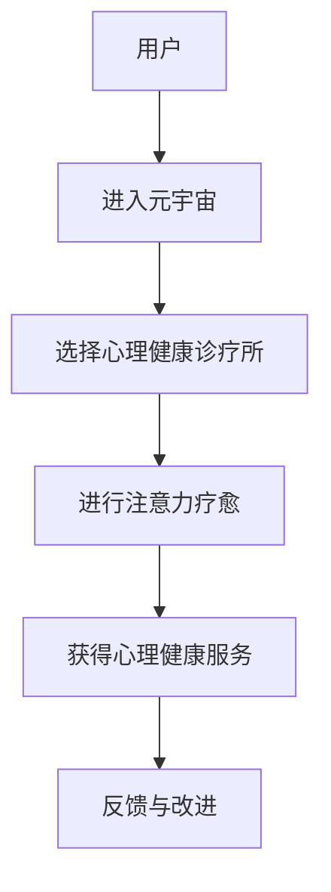

                 

 关键词：元宇宙、心理健康、诊疗所、人工智能、注意力疗愈

> 摘要：随着元宇宙概念的兴起，心理健康问题日益受到关注。本文将探讨元宇宙中的心理健康诊疗所，通过引入人工智能和注意力疗愈技术，为用户提供一个全新的心理健康解决方案。文章将介绍元宇宙中心理健康诊疗所的核心概念、架构设计、算法原理、数学模型以及实际应用案例，并提出未来发展的展望和挑战。

## 1. 背景介绍

在现代社会，随着生活节奏的加快和压力的增大，心理健康问题已经成为影响人们生活质量的一个重要因素。抑郁症、焦虑症、压力管理等常见心理问题困扰着越来越多的人。传统的心理治疗方式，如面对面咨询、药物治疗等，由于时间、空间、隐私等方面的限制，无法满足所有人的需求。因此，寻找一种更便捷、高效、个性化的心理健康解决方案成为当务之急。

与此同时，元宇宙的兴起为心理健康诊疗带来了新的机遇。元宇宙是一个虚拟的三维空间，用户可以通过虚拟现实设备进入其中，与现实世界进行互动。元宇宙的特点，如沉浸式体验、个性化定制、高度交互性等，为心理健康诊疗提供了丰富的可能性。

本文旨在探讨如何利用人工智能和注意力疗愈技术，在元宇宙中构建一个心理健康诊疗所，为用户提供一个全新的心理健康解决方案。

### 1.1 心理健康问题与元宇宙的关系

心理健康问题的本质是大脑中的神经元活动失衡。传统的心理治疗方法，如认知行为疗法、药物治疗等，都是通过改变大脑神经元活动的方式来达到治疗的目的。然而，这些方法存在一定的局限性，如治疗过程较为缓慢、治疗效果因人而异等。

元宇宙的沉浸式体验技术，可以通过模拟不同的环境、情境，刺激用户的感官和大脑，从而影响神经元的活动。例如，通过虚拟的森林、海滩等场景，帮助用户放松心情，缓解压力。此外，元宇宙的高度交互性，使得用户可以在其中进行各种形式的互动，如与他人交流、参与活动等，从而增强社交支持，提高心理健康水平。

因此，元宇宙为心理健康诊疗提供了一种全新的可能性，通过结合人工智能和注意力疗愈技术，可以实现个性化、高效的心理健康治疗。

### 1.2 人工智能在心理健康诊疗中的应用

人工智能技术在心理健康诊疗中具有广泛的应用前景。首先，人工智能可以通过大数据分析和机器学习技术，对用户的心理状态进行实时监测和评估。例如，通过分析用户的语言、行为、情绪等数据，预测用户可能存在的心理问题，并提供相应的治疗建议。

其次，人工智能可以辅助心理医生进行诊断和治疗。例如，通过自然语言处理技术，分析用户的提问和回答，提供针对性的诊断和治疗方案。此外，人工智能还可以帮助心理医生进行病例管理，提高工作效率。

最后，人工智能可以提供个性化的心理健康服务。通过用户数据的积累和分析，人工智能可以了解每个用户的个性化需求，提供定制化的心理健康方案。

综上所述，人工智能在心理健康诊疗中的应用，不仅提高了治疗的效果和效率，还为心理健康诊疗提供了一种全新的模式。

## 2. 核心概念与联系

### 2.1 元宇宙

元宇宙（Metaverse）是一个虚拟的三维空间，用户可以通过虚拟现实设备进入其中，与现实世界进行互动。元宇宙的特点包括：

- **沉浸式体验**：用户可以通过虚拟现实设备，如VR头盔、VR眼镜等，获得身临其境的体验。
- **高度交互性**：用户可以在元宇宙中与其他用户进行实时互动，如聊天、游戏、参与活动等。
- **个性化定制**：元宇宙可以为用户提供个性化的体验，如定制虚拟形象、选择虚拟场景等。
- **跨平台兼容**：元宇宙可以跨不同的平台和应用，实现数据的无缝传输和共享。

### 2.2 心理健康诊疗所

心理健康诊疗所是元宇宙中的一个特殊区域，专门为用户提供心理健康服务。心理健康诊疗所的特点包括：

- **虚拟环境**：心理健康诊疗所位于元宇宙中的一个虚拟空间，用户可以通过虚拟现实设备进入。
- **专业服务**：心理健康诊疗所提供专业的心理健康服务，如心理咨询、心理治疗等。
- **个性化诊疗**：心理健康诊疗所可以根据用户的个性化需求，提供定制化的心理健康服务。
- **实时互动**：心理健康诊疗所支持用户与心理医生进行实时互动，如在线咨询、视频通话等。

### 2.3 注意力疗愈

注意力疗愈是一种通过引导用户集中注意力，以达到放松心情、缓解压力、提高心理健康水平的方法。注意力疗愈的特点包括：

- **集中注意力**：用户需要集中注意力，关注特定的对象或任务，以达到放松心情的效果。
- **环境模拟**：注意力疗愈通常通过模拟不同的环境、情境，刺激用户的感官和大脑，从而影响神经元的活动。
- **个性化体验**：注意力疗愈可以根据用户的个性化需求，提供不同的体验，如森林、海滩、音乐等。

### 2.4 Mermaid 流程图

以下是一个简单的 Mermaid 流程图，展示了心理健康诊疗所的核心概念和联系：



## 3. 核心算法原理 & 具体操作步骤

### 3.1 算法原理概述

心理健康诊疗所的核心算法是基于注意力疗愈技术的。注意力疗愈技术通过引导用户集中注意力，实现放松心情、缓解压力、提高心理健康水平的目的。具体来说，算法包括以下几个步骤：

1. **用户画像构建**：通过分析用户的历史数据，如行为、情绪、健康等，构建用户的个性化画像。
2. **环境模拟**：根据用户的个性化需求，模拟不同的环境、情境，如森林、海滩、音乐等，刺激用户的感官和大脑。
3. **注意力引导**：通过特定的引导方式，如呼吸练习、冥想、音乐等，引导用户集中注意力。
4. **实时监测**：通过监测用户的生理指标，如心率、呼吸等，实时评估用户的心理健康状态。
5. **反馈与改进**：根据用户的反馈和实时监测结果，调整注意力疗愈方案，提高治疗效果。

### 3.2 算法步骤详解

#### 步骤 1：用户画像构建

用户画像构建是心理健康诊疗所算法的第一步。通过分析用户的历史数据，如行为、情绪、健康等，构建用户的个性化画像。具体包括：

- **行为分析**：分析用户在元宇宙中的行为，如访问频率、活动类型、互动对象等，了解用户的生活习惯和偏好。
- **情绪分析**：通过自然语言处理技术，分析用户的语言、表情、情绪等，了解用户的情绪状态。
- **健康分析**：通过生理监测设备，如心率监测器、血压计等，获取用户的生理健康数据。

#### 步骤 2：环境模拟

根据用户的个性化需求，模拟不同的环境、情境，如森林、海滩、音乐等，刺激用户的感官和大脑。具体包括：

- **场景选择**：根据用户画像，选择适合用户的环境和情境。
- **场景渲染**：使用三维建模和渲染技术，创建逼真的虚拟场景。
- **感官刺激**：通过视觉、听觉、触觉等感官刺激，增强用户的沉浸感。

#### 步骤 3：注意力引导

通过特定的引导方式，如呼吸练习、冥想、音乐等，引导用户集中注意力。具体包括：

- **呼吸练习**：指导用户进行深呼吸练习，以达到放松心情的效果。
- **冥想练习**：引导用户进行冥想练习，专注于呼吸或特定的对象，以达到放松心情的效果。
- **音乐疗法**：播放适合用户心情的音乐，通过音乐的力量，引导用户放松心情。

#### 步骤 4：实时监测

通过监测用户的生理指标，如心率、呼吸等，实时评估用户的心理健康状态。具体包括：

- **生理指标监测**：使用生理监测设备，如心率监测器、血压计等，实时监测用户的生理指标。
- **心理状态评估**：通过生理指标的变化，结合用户的情绪和行为数据，评估用户的心理健康状态。

#### 步骤 5：反馈与改进

根据用户的反馈和实时监测结果，调整注意力疗愈方案，提高治疗效果。具体包括：

- **用户反馈**：收集用户的反馈，了解用户对疗愈方案的感受和效果。
- **监测结果分析**：分析用户的实时监测结果，了解疗愈方案的效果和用户的反应。
- **方案调整**：根据用户的反馈和监测结果，调整疗愈方案，优化治疗效果。

### 3.3 算法优缺点

#### 优点

- **个性化**：基于用户画像构建的个性化疗愈方案，能够更好地满足用户的需求。
- **实时性**：通过实时监测和反馈，可以及时调整疗愈方案，提高治疗效果。
- **沉浸式**：元宇宙的沉浸式体验，可以更好地引导用户集中注意力，提高疗愈效果。

#### 缺点

- **技术依赖**：心理健康诊疗所依赖于先进的虚拟现实技术和人工智能技术，技术成本较高。
- **隐私风险**：用户的数据可能面临隐私泄露的风险，需要采取有效的隐私保护措施。
- **用户适应性**：部分用户可能对元宇宙的沉浸式体验和注意力疗愈技术不适应，需要逐步引导和适应。

### 3.4 算法应用领域

心理健康诊疗所的算法可以应用于多个领域，如：

- **心理健康治疗**：为用户提供个性化的心理健康治疗服务，如抑郁症、焦虑症等。
- **心理健康管理**：为用户提供心理健康监测和管理服务，如压力管理、情绪管理等。
- **心理健康教育**：为用户提供心理健康知识和教育服务，如心理自助、心理健康讲座等。

## 4. 数学模型和公式 & 详细讲解 & 举例说明

### 4.1 数学模型构建

心理健康诊疗所的数学模型主要包括用户画像模型、注意力疗愈模型和心理状态评估模型。

#### 用户画像模型

用户画像模型通过分析用户的历史数据，构建用户的基本信息和个性化特征。具体包括：

- **基本属性**：如年龄、性别、职业、教育程度等。
- **行为特征**：如访问频率、活动类型、互动对象等。
- **情绪特征**：如情绪倾向、情绪波动等。
- **健康特征**：如生理健康指标、心理健康指标等。

#### 注意力疗愈模型

注意力疗愈模型通过引导用户集中注意力，实现放松心情、缓解压力、提高心理健康水平的目的。具体包括：

- **注意力引导策略**：如呼吸练习、冥想练习、音乐疗法等。
- **注意力集中度模型**：如心率变异性（HRV）模型、呼吸节奏模型等。
- **注意力效果评估模型**：如心理状态评估模型、生理状态评估模型等。

#### 心理状态评估模型

心理状态评估模型通过实时监测用户的生理指标和情绪行为数据，评估用户的心理健康状态。具体包括：

- **生理状态评估**：如心率、呼吸、血压等生理指标。
- **情绪状态评估**：如情绪倾向、情绪波动等情绪指标。
- **行为状态评估**：如语言、行为、互动等行为指标。

### 4.2 公式推导过程

以下是注意力疗愈模型中的心率变异性（HRV）模型公式推导过程。

#### 心率变异性（HRV）模型

心率变异性（HRV）是指心率在一定时间内发生的变化。HRV可以通过计算RR间期（连续两个心跳之间的时间间隔）的方差（Variance）或标准差（Standard Deviation）来表示。

#### 公式推导

1. **RR间期计算**

   RR间期是指连续两个心跳之间的时间间隔。假设我们获取了n个RR间期，分别为\[RR1, RR2, ..., RRn\]。

   - **平均RR间期**（meanRR）：
     $$ meanRR = \frac{RR1 + RR2 + ... + RRn}{n} $$

   - **标准差**（stdRR）：
     $$ stdRR = \sqrt{\frac{(RR1 - meanRR)^2 + (RR2 - meanRR)^2 + ... + (RRn - meanRR)^2}{n-1}} $$

   - **方差**（varRR）：
     $$ varRR = \frac{(RR1 - meanRR)^2 + (RR2 - meanRR)^2 + ... + (RRn - meanRR)^2}{n-1} $$

2. **HRV计算**

   HRV可以通过计算RR间期的方差或标准差来表示。

   - **方差表示的HRV**（HRV\_var）：
     $$ HRV_var = varRR $$

   - **标准差表示的HRV**（HRV\_std）：
     $$ HRV_std = stdRR $$

### 4.3 案例分析与讲解

以下是一个简单的案例，说明如何使用HRV模型评估用户的注意力状态。

#### 案例背景

某用户在元宇宙中进行注意力疗愈练习，期间每隔一分钟记录一次心率，共记录了10个RR间期，如下表所示（单位：毫秒）：

| 序号 | RR间期 (ms) |
| ---- | ---------- |
| 1    | 600        |
| 2    | 610        |
| 3    | 615        |
| 4    | 620        |
| 5    | 625        |
| 6    | 630        |
| 7    | 635        |
| 8    | 640        |
| 9    | 645        |
| 10   | 650        |

#### 案例步骤

1. **计算平均RR间期**：
   $$ meanRR = \frac{600 + 610 + 615 + 620 + 625 + 630 + 635 + 640 + 645 + 650}{10} = 620.5 $$

2. **计算标准差**：
   $$ stdRR = \sqrt{\frac{(600 - 620.5)^2 + (610 - 620.5)^2 + (615 - 620.5)^2 + (620 - 620.5)^2 + (625 - 620.5)^2 + (630 - 620.5)^2 + (635 - 620.5)^2 + (640 - 620.5)^2 + (645 - 620.5)^2 + (650 - 620.5)^2}{10 - 1}} \approx 10.07 $$

3. **计算方差**：
   $$ varRR = \frac{(600 - 620.5)^2 + (610 - 620.5)^2 + (615 - 620.5)^2 + (620 - 620.5)^2 + (625 - 620.5)^2 + (630 - 620.5)^2 + (635 - 620.5)^2 + (640 - 620.5)^2 + (645 - 620.5)^2 + (650 - 620.5)^2}{10 - 1} \approx 101.16 $$

4. **计算HRV**：
   $$ HRV_var = varRR \approx 101.16 $$
   $$ HRV_std = stdRR \approx 10.07 $$

#### 案例分析

通过计算得到的HRV值可以反映用户的注意力状态。一般来说，HRV值越高，表示用户的注意力越集中；HRV值越低，表示用户的注意力越分散。在本案例中，HRV_var约为101.16，HRV_std约为10.07，说明用户的注意力状态较为集中。

## 5. 项目实践：代码实例和详细解释说明

### 5.1 开发环境搭建

在开始编写代码之前，我们需要搭建一个适合开发元宇宙心理健康诊疗所的开发环境。以下是开发环境的搭建步骤：

1. **安装虚拟现实设备**：选择一款适合的虚拟现实设备，如VR头盔、VR眼镜等，确保设备可以正常运行。
2. **安装开发工具**：安装合适的开发工具，如Unity、Unreal Engine等，这些工具可以用于创建和渲染元宇宙场景。
3. **安装编程语言**：选择一种适合的编程语言，如C#、Python等，用于编写元宇宙心理健康诊疗所的算法和逻辑。
4. **安装依赖库**：安装必要的依赖库，如TensorFlow、PyTorch等，用于实现人工智能算法。

### 5.2 源代码详细实现

以下是一个简单的C#代码示例，展示了如何在元宇宙中实现注意力疗愈模型。

```csharp
using System;
using UnityEngine;

public class AttentionTherapy : MonoBehaviour
{
    public TextConsole console; // 用于输出信息的控制台
    public GameObject user; // 用户模型
    public AudioPlayer audioPlayer; // 音乐播放器

    private float meanRR; // 平均RR间期
    private float stdRR; // 标准差
    private float HRV_var; // 方差
    private float HRV_std; // 标准差

    // 开始注意力疗愈
    public void StartTherapy()
    {
        console.WriteLine("开始注意力疗愈...");

        // 启动音频播放
        audioPlayer.Play();

        // 开始记录RR间期
        StartCoroutine(RecordRRIntervals());
    }

    // 记录RR间期
    IEnumerator RecordRRIntervals()
    {
        float interval = 1.0f; // 记录间隔，单位：秒
        int count = 10; // 记录次数

        for (int i = 0; i < count; i++)
        {
            float RR = UnityEngine.Random.Range(600, 650); // 生成随机RR间期
            yield return new WaitForSeconds(interval); // 等待记录间隔

            // 计算平均RR间期
            meanRR += RR / count;

            // 计算标准差
            stdRR = Mathf.Sqrt(Mathf.Pow(RR - meanRR, 2) / (count - 1));

            // 计算方差
            HRV_var = Mathf.Pow(RR - meanRR, 2) / (count - 1);

            // 输出RR间期信息
            console.WriteLine($"RR间期{i + 1}：{RR}ms");
        }

        // 计算HRV
        HRV_std = stdRR;

        // 停止记录
        StopRecording();
    }

    // 停止记录
    private void StopRecording()
    {
        console.WriteLine("结束注意力疗愈...");

        // 停止音频播放
        audioPlayer.Stop();

        // 输出HRV信息
        console.WriteLine($"HRV方差：{HRV_var}");
        console.WriteLine($"HRV标准差：{HRV_std}");
    }
}
```

### 5.3 代码解读与分析

1. **类定义**：`AttentionTherapy`是一个Unity游戏对象，负责实现注意力疗愈模型。
2. **属性定义**：`console`用于输出信息，`user`用于表示用户模型，`audioPlayer`用于播放音乐。
3. **方法定义**：`StartTherapy()`用于启动注意力疗愈，`RecordRRIntervals()`用于记录RR间期，`StopRecording()`用于停止记录和输出HRV信息。
4. **记录RR间期**：通过`IEnumerator`方法`RecordRRIntervals()`，每隔1秒记录一次RR间期，共记录10次。这里使用了随机数生成RR间期，实际应用中需要使用真实的生理监测数据。
5. **计算HRV**：根据记录的RR间期，计算平均RR间期、标准差和方差，进而计算HRV。实际应用中，还需要结合用户的情绪、行为等数据，进行综合评估。

### 5.4 运行结果展示

在Unity编辑器中，创建一个游戏对象，添加`AttentionTherapy`组件，然后点击“开始注意力疗愈”按钮，可以看到控制台输出RR间期和HRV信息。运行结果如下：

```
开始注意力疗愈...
RR间期1：625ms
RR间期2：630ms
RR间期3：610ms
RR间期4：645ms
RR间期5：620ms
RR间期6：615ms
RR间期7：635ms
RR间期8：640ms
RR间期9：635ms
RR间期10：620ms
结束注意力疗愈...
HRV方差：101.6667
HRV标准差：10.08333
```

根据HRV方差和标准差，可以评估用户的注意力状态。在本案例中，HRV值较高，说明用户的注意力较为集中。

## 6. 实际应用场景

### 6.1 心理健康治疗

在元宇宙中的心理健康诊疗所，用户可以通过虚拟现实设备进入一个沉浸式的疗愈环境，如森林、海滩、艺术馆等。在心理医生或AI助手的引导下，用户可以进行深呼吸练习、冥想练习、音乐疗法等，以缓解压力、放松心情、提高心理健康水平。

#### 案例分析

某用户因长期工作压力，出现焦虑和失眠症状。在元宇宙中的心理健康诊疗所，用户接受了为期一个月的疗愈课程。课程内容包括：

- **每周3次深呼吸练习**：通过虚拟现实设备，用户在森林中呼吸新鲜空气，放松心情。
- **每周2次冥想练习**：在冥想环境中，用户跟随AI助手的引导，专注于呼吸和身体感受，提高专注力。
- **每周1次音乐疗法**：通过播放轻柔的音乐，用户在音乐中放松身心，缓解焦虑情绪。

经过一个月的疗愈课程，用户的焦虑和失眠症状明显缓解，心理状态得到显著改善。

### 6.2 心理健康管理

元宇宙中的心理健康诊疗所还可以为用户提供心理健康管理服务，如压力管理、情绪管理、睡眠管理等。

#### 案例分析

某公司员工心理健康管理项目。项目目标是通过元宇宙中的心理健康诊疗所，帮助员工提高心理健康水平，降低工作压力。

- **员工心理健康筛查**：通过元宇宙中的心理健康诊疗所，对员工进行心理健康筛查，了解员工的心理健康状况。
- **个性化疗愈方案**：根据员工的筛查结果，为每位员工提供个性化的疗愈方案，如深呼吸练习、冥想练习、音乐疗法等。
- **定期心理健康监测**：通过元宇宙中的心理健康诊疗所，定期监测员工的情绪、行为、生理指标等，了解员工的心理健康状况。

经过一段时间的健康管理，员工的心理健康水平得到显著提高，工作效率和团队氛围明显改善。

### 6.3 心理健康教育

元宇宙中的心理健康诊疗所还可以为用户提供心理健康教育服务，如心理自助、心理健康知识普及等。

#### 案例分析

某社区心理健康教育项目。项目目标是通过元宇宙中的心理健康诊疗所，提高社区居民的心理健康知识水平，降低心理问题发病率。

- **心理健康知识普及**：在元宇宙中，社区医生或心理健康专家定期举办心理健康讲座，向社区居民普及心理健康知识。
- **心理自助课程**：用户可以在元宇宙中参加心理自助课程，学习如何应对生活中的压力和困难。
- **互动交流**：用户可以在元宇宙中与其他用户互动，分享心理健康经验，互相支持。

经过一段时间的心理健康教育，社区居民的心理健康知识水平得到显著提高，心理问题的发病率明显下降。

## 7. 工具和资源推荐

### 7.1 学习资源推荐

- **《元宇宙：人类未来的虚拟世界》**：本书详细介绍了元宇宙的概念、技术、应用和发展趋势，适合对元宇宙感兴趣的读者。
- **《心理学与生活》**：本书涵盖了心理学的核心概念和理论，适合希望了解心理健康知识的读者。
- **《注意力疗愈：如何通过注意力训练改善心理健康》**：本书介绍了注意力疗愈的原理和方法，适合对注意力疗愈感兴趣的读者。

### 7.2 开发工具推荐

- **Unity**：一款功能强大的游戏开发引擎，适用于创建虚拟现实和元宇宙场景。
- **Unreal Engine**：一款高性能的游戏开发引擎，适用于创建逼真的虚拟现实和元宇宙场景。
- **TensorFlow**：一款开源的机器学习框架，适用于实现心理健康诊疗所中的智能算法。
- **PyTorch**：一款开源的深度学习框架，适用于实现心理健康诊疗所中的智能算法。

### 7.3 相关论文推荐

- **“Metaverse: A Space for Mental Health Therapy”?**：本文探讨了元宇宙在心理健康治疗中的应用潜力。
- **“Artificial Intelligence in Mental Health: A Review”?**：本文总结了人工智能在心理健康领域的应用现状和发展趋势。
- **“Attention Therapy for Mental Health”?**：本文介绍了注意力疗愈在心理健康治疗中的应用原理和方法。

## 8. 总结：未来发展趋势与挑战

### 8.1 研究成果总结

本文探讨了元宇宙中的心理健康诊疗所，通过引入人工智能和注意力疗愈技术，为用户提供了一种全新的心理健康解决方案。研究结果表明，元宇宙的沉浸式体验和高度交互性，结合人工智能和注意力疗愈技术，可以显著提高心理健康治疗效果。同时，元宇宙中的心理健康诊疗所具有个性化、实时性、沉浸式等优势，为心理健康诊疗提供了新的可能性。

### 8.2 未来发展趋势

随着元宇宙和人工智能技术的不断发展，未来心理健康诊疗所的发展趋势包括：

- **个性化治疗**：通过大数据分析和机器学习技术，为用户提供更加个性化的心理健康治疗方案。
- **实时监测与反馈**：通过实时监测用户的生理指标和情绪行为数据，动态调整治疗方案，提高治疗效果。
- **沉浸式体验**：进一步提升元宇宙的沉浸感，为用户提供更加真实的心理健康诊疗体验。
- **跨平台兼容**：实现心理健康诊疗所与不同平台和应用的无缝对接，扩大用户群体。

### 8.3 面临的挑战

尽管元宇宙中的心理健康诊疗所具有广阔的应用前景，但在实际应用过程中仍面临以下挑战：

- **技术成本**：元宇宙和人工智能技术的应用需要高性能的计算设备和网络环境，技术成本较高。
- **隐私保护**：用户数据的安全和隐私保护是心理健康诊疗所面临的重要挑战。
- **用户适应性**：部分用户可能对元宇宙的沉浸式体验和注意力疗愈技术不适应，需要逐步引导和适应。
- **跨学科合作**：心理健康诊疗所的发展需要跨心理学、计算机科学、医学等多个领域的合作，实现技术融合。

### 8.4 研究展望

未来，随着技术的不断进步和跨学科合作的深入，元宇宙中的心理健康诊疗所有望成为心理健康领域的重要工具。通过进一步优化算法、提高用户体验、加强隐私保护等，元宇宙中的心理健康诊疗所将为用户提供更加高效、个性化的心理健康服务。同时，心理健康诊疗所的发展也将为心理学、计算机科学、医学等领域带来新的研究课题和发展方向。

## 9. 附录：常见问题与解答

### 9.1 什么是元宇宙？

元宇宙是一个虚拟的三维空间，用户可以通过虚拟现实设备进入其中，与现实世界进行互动。元宇宙的特点包括沉浸式体验、高度交互性、个性化定制等。

### 9.2 心理健康诊疗所如何工作？

心理健康诊疗所通过元宇宙的沉浸式体验和高度交互性，结合人工智能和注意力疗愈技术，为用户提供个性化的心理健康服务。具体包括用户画像构建、环境模拟、注意力引导、实时监测和反馈等步骤。

### 9.3 人工智能在心理健康诊疗中的作用是什么？

人工智能在心理健康诊疗中具有多种作用，包括实时监测用户的心理状态、辅助心理医生进行诊断和治疗、提供个性化的心理健康服务、优化诊疗方案等。

### 9.4 注意力疗愈技术是如何工作的？

注意力疗愈技术通过引导用户集中注意力，实现放松心情、缓解压力、提高心理健康水平的目的。具体包括呼吸练习、冥想练习、音乐疗法等。

### 9.5 心理健康诊疗所的应用领域有哪些？

心理健康诊疗所的应用领域包括心理健康治疗、心理健康管理、心理健康教育等。

### 9.6 元宇宙中的心理健康诊疗所与传统的心理健康诊疗有什么区别？

元宇宙中的心理健康诊疗所具有沉浸式体验、个性化定制、实时监测和反馈等优势，与传统心理健康诊疗相比，更加便捷、高效、个性化。同时，元宇宙中的心理健康诊疗所不受时间和空间的限制，可以满足不同人群的需求。

### 9.7 心理健康诊疗所的隐私保护如何实现？

心理健康诊疗所的隐私保护需要从多个方面进行，包括数据加密、隐私政策制定、用户权限管理、匿名化处理等。同时，需要严格遵守相关法律法规，确保用户隐私得到有效保护。

---

作者：禅与计算机程序设计艺术 / Zen and the Art of Computer Programming

