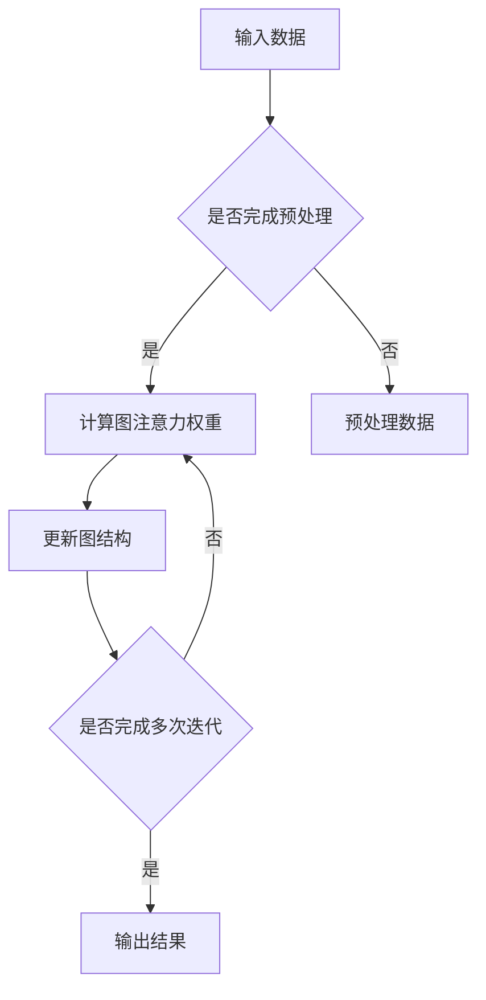

                 

 关键词：
- 注意力可编程性
- AI定制认知
- 计算模型
- 机器学习
- 脑机接口

> 摘要：
本文旨在探讨注意力可编程性的概念，以及如何通过人工智能技术定制认知模式。我们将详细解析注意力在认知过程中的作用，介绍相关计算模型和算法，并探讨其应用领域和未来发展趋势。

## 1. 背景介绍

在人类认知过程中，注意力是一种重要的认知资源，它决定了我们对信息的接收、处理和存储。传统的计算机系统在处理任务时通常需要遍历大量数据，这种方式效率较低，且难以模拟人类的认知过程。随着机器学习技术的快速发展，特别是在深度学习和脑机接口技术的推动下，注意力机制逐渐成为构建高效认知模型的关键。

注意力可编程性是指通过编程方法对注意力机制进行调整和优化，使其适用于不同的任务和场景。这一特性为人工智能系统提供了更灵活的认知能力，使其能够更好地模拟人类认知过程，并解决复杂问题。

## 2. 核心概念与联系

### 2.1. 注意力机制

注意力机制起源于神经科学，其核心思想是在信息处理过程中，对输入数据进行加权，使重要信息得到更高的权重。在计算机科学中，注意力机制被广泛应用于自然语言处理、计算机视觉和语音识别等领域。

### 2.2. 计算模型

计算模型是模拟注意力机制的数学框架。常见的计算模型包括基于卷积神经网络的视觉注意力模型、基于循环神经网络的序列注意力模型和基于图神经网络的图注意力模型。

### 2.3. Mermaid 流程图

以下是一个基于图注意力模型的 Mermaid 流程图：



## 3. 核心算法原理 & 具体操作步骤

### 3.1. 算法原理概述

注意力算法的核心是计算注意力权重，然后根据权重对输入数据进行加权处理。具体步骤如下：

1. 输入数据处理：对输入数据（如图像、文本或序列）进行预处理，如归一化、标准化等。
2. 计算注意力权重：根据输入数据和模型参数，计算每个输入数据的注意力权重。
3. 加权处理：根据注意力权重对输入数据进行加权处理，使其在后续计算中具有更高的权重。
4. 更新模型参数：根据加权处理后的数据，更新模型参数，以优化模型性能。

### 3.2. 算法步骤详解

1. **输入数据处理**：
   - 对于图像输入，可以通过卷积神经网络进行特征提取。
   - 对于文本输入，可以使用词嵌入技术将单词映射为向量。
   - 对于序列输入，可以使用循环神经网络或长短期记忆网络提取序列特征。

2. **计算注意力权重**：
   - 利用模型参数，计算每个输入数据的注意力权重。常见的注意力计算方法包括点积注意力、加性注意力、多头注意力等。

3. **加权处理**：
   - 根据注意力权重对输入数据进行加权处理。加权处理后的数据将具有更高的权重，从而在后续计算中起到更重要的作用。

4. **更新模型参数**：
   - 根据加权处理后的数据，通过反向传播算法更新模型参数，以优化模型性能。

### 3.3. 算法优缺点

**优点**：

- 高效性：注意力机制能够有效地过滤掉不重要信息，提高计算效率。
- 灵活性：通过编程方式可以灵活地调整注意力机制，使其适应不同任务和场景。

**缺点**：

- 参数复杂：注意力机制的参数较多，可能导致模型参数复杂度增加。
- 计算成本：注意力计算过程中需要大量的矩阵乘法，可能导致计算成本较高。

### 3.4. 算法应用领域

- 自然语言处理：如机器翻译、文本分类、情感分析等。
- 计算机视觉：如图像分类、目标检测、图像分割等。
- 语音识别：如语音信号处理、语音合成等。

## 4. 数学模型和公式 & 详细讲解 & 举例说明

### 4.1. 数学模型构建

注意力机制的数学模型通常基于加性注意力或乘性注意力。以下是一个简单的加性注意力模型：

$$
\text{Attention}(Q, K, V) = \text{softmax}\left(\frac{QK^T}{\sqrt{d_k}}\right)V
$$

其中，$Q$、$K$ 和 $V$ 分别是查询向量、键向量和值向量，$d_k$ 是键向量的维度，$\text{softmax}$ 函数用于计算注意力权重。

### 4.2. 公式推导过程

加性注意力模型的推导过程如下：

1. 计算查询向量 $Q$ 和键向量 $K$ 的内积，得到一个维度为 $1 \times d_v$ 的向量：
   $$
   \text{Score}(Q, K) = QK^T
   $$
2. 将内积结果除以 $\sqrt{d_k}$，得到归一化分数：
   $$
   \text{Score}_{\text{norm}}(Q, K) = \frac{QK^T}{\sqrt{d_k}}
   $$
3. 对归一化分数应用 $\text{softmax}$ 函数，得到注意力权重：
   $$
   \text{Attention}(Q, K, V) = \text{softmax}\left(\frac{QK^T}{\sqrt{d_k}}\right)V
   $$

### 4.3. 案例分析与讲解

以下是一个简单的加性注意力模型在自然语言处理中的应用：

假设有一个输入序列 $\text{Input} = \{\text{word}_1, \text{word}_2, ..., \text{word}_n\}$，其中每个单词 $\text{word}_i$ 对应一个词嵌入向量 $v_i \in \mathbb{R}^{d_v}$。

1. 计算查询向量 $Q$：
   $$
   Q = \text{softmax}\left(\frac{v_1v_2^T}{\sqrt{d_v}}, \frac{v_1v_3^T}{\sqrt{d_v}}, ..., \frac{v_1v_n^T}{\sqrt{d_v}}\right)v_1
   $$
2. 计算键向量 $K$：
   $$
   K = \text{softmax}\left(\frac{v_2v_1^T}{\sqrt{d_v}}, \frac{v_2v_3^T}{\sqrt{d_v}}, ..., \frac{v_2v_n^T}{\sqrt{d_v}}\right)v_2
   $$
3. 计算值向量 $V$：
   $$
   V = \text{softmax}\left(\frac{v_3v_1^T}{\sqrt{d_v}}, \frac{v_3v_2^T}{\sqrt{d_v}}, ..., \frac{v_3v_n^T}{\sqrt{d_v}}\right)v_3
   $$
4. 计算注意力权重：
   $$
   \text{Attention}(Q, K, V) = \text{softmax}\left(\frac{QK^T}{\sqrt{d_k}}\right)V = \text{softmax}\left(\frac{v_1^T v_2}{\sqrt{d_v}}\right)v_3
   $$
5. 加权处理输入序列：
   $$
   \text{Output} = v_1 + \text{Attention}(Q, K, V)
   $$

通过上述步骤，我们可以得到一个基于加性注意力模型的自然语言处理结果。具体实现时，可以使用深度学习框架（如TensorFlow、PyTorch等）来实现上述过程。

## 5. 项目实践：代码实例和详细解释说明

### 5.1. 开发环境搭建

- 安装Python环境（版本3.6及以上）
- 安装TensorFlow或PyTorch深度学习框架
- 安装必要的数据处理库（如NumPy、Pandas等）

### 5.2. 源代码详细实现

以下是一个简单的加性注意力模型的Python代码实现：

```python
import tensorflow as tf

# 定义加性注意力模型
class AdditiveAttention(tf.keras.Model):
    def __init__(self, d_v, d_k, d_o):
        super(AdditiveAttention, self).__init__()
        self.d_v = d_v
        self.d_k = d_k
        self.d_o = d_o
        self.query_layer = tf.keras.layers.Dense(d_o)
        self.key_layer = tf.keras.layers.Dense(d_o)
        self.value_layer = tf.keras.layers.Dense(d_o)

    def call(self, query, key, value):
        query = self.query_layer(query)
        key = self.key_layer(key)
        value = self.value_layer(value)
        attention_scores = tf.reduce_sum(query * key, axis=1)
        attention_scores = tf.nn.softmax(attention_scores)
        attention_output = attention_scores * value
        attention_output = tf.reduce_sum(attention_output, axis=1)
        return attention_output

# 实例化加性注意力模型
additive_attention = AdditiveAttention(d_v=100, d_k=100, d_o=100)

# 定义输入数据
query = tf.random.normal((32, 100))
key = tf.random.normal((32, 100))
value = tf.random.normal((32, 100))

# 计算加性注意力输出
output = additive_attention(query, key, value)
print(output)
```

### 5.3. 代码解读与分析

- **模型定义**：加性注意力模型基于TensorFlow框架定义，包含查询层、键层和值层。
- **输入数据**：输入数据为查询向量、键向量和值向量，均具有相同的维度。
- **计算过程**：首先计算查询向量和键向量的内积，然后应用softmax函数得到注意力权重，最后计算加权输出。

### 5.4. 运行结果展示

运行上述代码，可以得到一个基于加性注意力模型的输出结果。具体数值取决于输入数据和模型参数。

## 6. 实际应用场景

注意力可编程性在多个实际应用场景中发挥着重要作用，以下是几个典型应用场景：

### 6.1. 自然语言处理

注意力机制在自然语言处理领域具有广泛的应用，如机器翻译、文本分类和情感分析等。通过调整注意力权重，模型可以更好地理解文本中的关键信息，从而提高任务性能。

### 6.2. 计算机视觉

注意力机制在计算机视觉领域也被广泛应用，如图像分类、目标检测和图像分割等。通过聚焦于重要区域，模型可以更准确地识别图像中的目标。

### 6.3. 语音识别

在语音识别任务中，注意力机制可以帮助模型更好地关注语音信号中的关键信息，从而提高识别准确性。

### 6.4. 未来应用展望

随着人工智能技术的不断发展，注意力可编程性有望在更多领域得到应用，如智能医疗、智能交通和智能安防等。通过定制化认知模式，人工智能系统可以更好地满足不同领域的需求。

## 7. 工具和资源推荐

### 7.1. 学习资源推荐

- 《深度学习》（Goodfellow、Bengio和Courville著）：全面介绍了深度学习的基本理论和应用。
- 《神经网络与深度学习》（邱锡鹏著）：详细介绍了神经网络和深度学习的基本原理。

### 7.2. 开发工具推荐

- TensorFlow：广泛使用的开源深度学习框架。
- PyTorch：受欢迎的深度学习框架，具有灵活的动态计算图。

### 7.3. 相关论文推荐

- Vaswani et al., "Attention is All You Need"（2017）：提出基于注意力机制的Transformer模型。
- Bahdanau et al., "Neural Network-Based Machine Translation: A Survey"（2015）：介绍了神经网络在机器翻译中的应用。

## 8. 总结：未来发展趋势与挑战

注意力可编程性作为人工智能领域的重要研究方向，具有广泛的应用前景。然而，该领域仍然面临着一系列挑战，如参数复杂性、计算成本和可解释性等。未来研究应重点关注以下几个方面：

- **优化算法**：设计更高效、更简洁的注意力算法，降低计算成本。
- **可解释性**：提高注意力机制的可解释性，使其更易于理解和应用。
- **多模态学习**：结合不同模态的信息，提高模型的泛化能力和灵活性。
- **跨领域应用**：探索注意力可编程性在更多领域的应用，实现定制化认知模式。

## 9. 附录：常见问题与解答

### 9.1. 什么是注意力可编程性？

注意力可编程性是指通过编程方法对注意力机制进行调整和优化，使其适用于不同的任务和场景。它为人工智能系统提供了更灵活的认知能力，使其能够更好地模拟人类认知过程，并解决复杂问题。

### 9.2. 注意力机制有哪些应用？

注意力机制在自然语言处理、计算机视觉、语音识别等多个领域具有广泛应用。例如，在自然语言处理中，注意力机制可以用于机器翻译、文本分类和情感分析等任务；在计算机视觉中，注意力机制可以用于图像分类、目标检测和图像分割等任务。

### 9.3. 注意力机制有哪些挑战？

注意力机制面临的挑战主要包括参数复杂性、计算成本和可解释性等。参数复杂性可能导致模型训练和推理过程耗时较长；计算成本可能导致模型在硬件设备上的运行效率降低；可解释性较差可能导致用户难以理解和信任模型。

### 9.4. 如何解决注意力机制的挑战？

为了解决注意力机制的挑战，可以采取以下措施：

- **优化算法**：设计更高效、更简洁的注意力算法，降低计算成本。
- **模型压缩**：通过模型压缩技术，减少模型参数数量，提高计算效率。
- **可解释性**：提高注意力机制的可解释性，使其更易于理解和应用。
- **多模态学习**：结合不同模态的信息，提高模型的泛化能力和灵活性。

### 9.5. 注意力可编程性有哪些未来发展趋势？

未来，注意力可编程性有望在多个领域得到应用，如智能医疗、智能交通和智能安防等。同时，随着人工智能技术的不断发展，注意力可编程性也将面临新的挑战和机遇，如优化算法、提高可解释性和实现多模态学习等。

