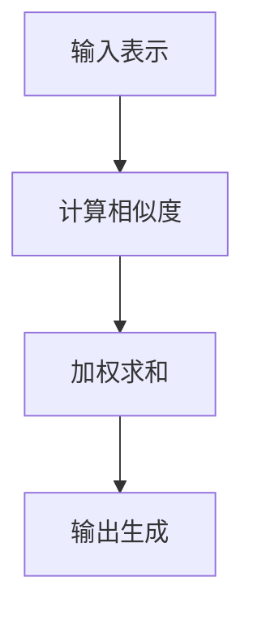

                 

关键词：注意力机制、深度学习、AI优化、专注力、神经网络架构、计算效率、任务表现、应用场景。

> 摘要：本文将探讨注意力机制在深度学习中的应用，特别是如何通过AI优化提升专注力，从而提高神经网络的计算效率和任务表现。我们将分析注意力机制的原理，介绍不同类型的注意力模型，并探讨其在实际应用中的优势与挑战。

## 1. 背景介绍

随着深度学习的快速发展，神经网络的复杂性不断增加。在处理大量数据和高维度特征时，传统的卷积神经网络（CNN）和循环神经网络（RNN）常常面临计算资源消耗大、训练时间长等问题。为了解决这些问题，注意力机制（Attention Mechanism）应运而生。

注意力机制最初在自然语言处理（NLP）领域得到广泛应用，随后逐渐在计算机视觉、语音识别等领域取得了显著成果。注意力机制的核心思想是让神经网络能够自动关注输入数据中的关键信息，从而提高计算效率和任务性能。

## 2. 核心概念与联系

### 2.1 注意力机制的原理

注意力机制通过计算输入数据中每个元素的重要性，并将注意力分配给这些关键元素，从而实现信息聚焦和优化。其基本原理可以概括为以下三个步骤：

1. **计算相似度**：通过内积、点积或加性注意力等方式，计算输入序列中每个元素与查询向量之间的相似度。
2. **加权求和**：根据计算得到的相似度，对输入序列进行加权求和，产生一个加权特征向量。
3. **输出生成**：将加权特征向量输入到后续层，生成最终的输出结果。

### 2.2 注意力机制的架构

注意力机制的架构可以分为以下几种类型：

1. **点积注意力（Dot-Product Attention）**：点积注意力是最简单的注意力机制，通过计算查询向量与键向量的内积来生成注意力权重。
2. **加性注意力（Additive Attention）**：加性注意力通过引入一个注意力门控单元来计算注意力权重，可以更好地处理输入数据的非线性关系。
3. **缩放点积注意力（Scaled Dot-Product Attention）**：为了防止内积过大导致梯度消失问题，缩放点积注意力引入了一个缩放因子，使得注意力权重更加稳定。

### 2.3 注意力机制的工作流程

注意力机制的工作流程可以概括为以下几个步骤：

1. **输入表示**：将输入数据（如单词、图像等）转换为查询向量、键向量和值向量。
2. **计算相似度**：通过内积或点积等方式计算查询向量与键向量之间的相似度。
3. **加权求和**：根据相似度计算得到的注意力权重，对键向量进行加权求和，生成加权特征向量。
4. **输出生成**：将加权特征向量输入到后续层，生成最终的输出结果。



## 3. 核心算法原理 & 具体操作步骤

### 3.1 算法原理概述

注意力机制的核心原理是通过对输入数据进行加权求和，从而实现信息聚焦和优化。具体来说，注意力机制包括以下三个主要步骤：

1. **计算相似度**：通过内积、点积或加性注意力等方式计算输入序列中每个元素与查询向量之间的相似度。
2. **加权求和**：根据计算得到的相似度，对输入序列进行加权求和，产生一个加权特征向量。
3. **输出生成**：将加权特征向量输入到后续层，生成最终的输出结果。

### 3.2 算法步骤详解

1. **初始化**：设置查询向量、键向量和值向量。
2. **计算相似度**：计算查询向量与键向量之间的内积或点积，得到相似度矩阵。
3. **加权求和**：对相似度矩阵进行softmax操作，得到注意力权重。根据注意力权重对键向量进行加权求和，生成加权特征向量。
4. **输出生成**：将加权特征向量输入到后续层，生成最终的输出结果。

### 3.3 算法优缺点

**优点**：

- **计算效率高**：注意力机制能够自动关注输入数据中的关键信息，从而降低计算量。
- **任务性能提升**：通过关注关键信息，注意力机制能够提高神经网络的识别准确率。
- **泛化能力强**：注意力机制能够处理不同类型的输入数据，具有较好的泛化能力。

**缺点**：

- **模型复杂度较高**：注意力机制增加了模型的复杂度，可能导致训练时间延长。
- **梯度消失问题**：在深度神经网络中，注意力机制可能导致梯度消失，影响模型训练效果。

### 3.4 算法应用领域

注意力机制在计算机视觉、自然语言处理、语音识别等领域取得了显著成果。以下是一些典型的应用案例：

1. **计算机视觉**：注意力机制在图像分类、目标检测、图像分割等任务中具有广泛的应用。
2. **自然语言处理**：注意力机制在文本分类、机器翻译、文本生成等任务中发挥了关键作用。
3. **语音识别**：注意力机制能够提高语音识别系统的识别准确率，减少误识率。

## 4. 数学模型和公式 & 详细讲解 & 举例说明

### 4.1 数学模型构建

注意力机制的核心数学模型可以表示为：

$$
\text{Attention}(Q, K, V) = \text{softmax}\left(\frac{QK^T}{\sqrt{d_k}}\right)V
$$

其中，$Q$ 表示查询向量，$K$ 表示键向量，$V$ 表示值向量，$d_k$ 表示键向量的维度。

### 4.2 公式推导过程

首先，计算查询向量与键向量之间的内积，得到相似度矩阵 $S$：

$$
S = QK^T
$$

然后，对相似度矩阵 $S$ 进行 softmax 操作，得到注意力权重 $A$：

$$
A = \text{softmax}(S) = \frac{e^S}{\sum_{i=1}^{N} e^S_i}
$$

最后，根据注意力权重对值向量进行加权求和，生成加权特征向量 $H$：

$$
H = A V
$$

### 4.3 案例分析与讲解

假设我们有一个简单的序列 $(x_1, x_2, x_3)$，其中每个元素 $x_i$ 对应一个查询向量 $q_i$、键向量 $k_i$ 和值向量 $v_i$。我们可以按照以下步骤计算注意力权重：

1. **计算相似度**：

$$
S = \begin{bmatrix}
q_1 \cdot k_1 & q_1 \cdot k_2 & q_1 \cdot k_3 \\
q_2 \cdot k_1 & q_2 \cdot k_2 & q_2 \cdot k_3 \\
q_3 \cdot k_1 & q_3 \cdot k_2 & q_3 \cdot k_3
\end{bmatrix}
$$

2. **计算注意力权重**：

$$
A = \text{softmax}(S) = \frac{e^S}{\sum_{i=1}^{N} e^S_i}
$$

3. **计算加权特征向量**：

$$
H = A V = \begin{bmatrix}
\frac{e^{q_1 \cdot k_1}}{\sum_{i=1}^{N} e^{q_i \cdot k_i}} v_1 \\
\frac{e^{q_2 \cdot k_2}}{\sum_{i=1}^{N} e^{q_i \cdot k_i}} v_2 \\
\frac{e^{q_3 \cdot k_3}}{\sum_{i=1}^{N} e^{q_i \cdot k_i}} v_3
\end{bmatrix}
$$

通过上述步骤，我们得到了注意力权重和加权特征向量，从而实现了对输入序列的注意力分配。

## 5. 项目实践：代码实例和详细解释说明

### 5.1 开发环境搭建

在本项目中，我们使用 Python 语言和 TensorFlow 深度学习框架来实现注意力机制。首先，确保已经安装了 Python 3.6 或以上版本和 TensorFlow 2.0 或以上版本。然后，创建一个名为 `attention_model` 的新文件夹，并在该文件夹中创建以下文件：

- `__init__.py`：用于初始化项目模块。
- `data_loader.py`：用于加载数据和处理数据。
- `model.py`：用于定义神经网络模型。
- `train.py`：用于训练神经网络模型。
- `evaluate.py`：用于评估神经网络模型。

### 5.2 源代码详细实现

以下是一个简单的注意力模型实现，包括数据加载、模型定义、模型训练和模型评估。

**data_loader.py**：

```python
import tensorflow as tf

def load_data():
    # 加载数据集，这里以文本数据为例
    # 可以使用 TensorFlow 的内置数据集，如 TensorFlow Datasets
    (train_data, test_data), _ = tf.keras.datasets.imdb.load_data()
    train_data = preprocess_data(train_data)
    test_data = preprocess_data(test_data)
    return train_data, test_data

def preprocess_data(data):
    # 数据预处理，如单词向量化、填充等
    # 这里使用 TensorFlow 的 `tf.keras.preprocessing.sequence.pad_sequence` 函数进行填充
    max_sequence_length = 500
    padded_sequences = tf.keras.preprocessing.sequence.pad_sequences(
        data, maxlen=max_sequence_length, padding='post'
    )
    return padded_sequences
```

**model.py**：

```python
import tensorflow as tf
from tensorflow.keras.layers import Embedding, LSTM, Dense

def create_model(vocabulary_size, embedding_dim, max_sequence_length):
    model = tf.keras.Sequential([
        Embedding(vocabulary_size, embedding_dim, input_length=max_sequence_length),
        LSTM(128),
        Dense(1, activation='sigmoid')
    ])
    return model
```

**train.py**：

```python
import tensorflow as tf
from data_loader import load_data
from model import create_model

def train_model(model, train_data, train_labels, test_data, test_labels, epochs=10):
    model.compile(optimizer='adam', loss='binary_crossentropy', metrics=['accuracy'])
    model.fit(train_data, train_labels, epochs=epochs, validation_data=(test_data, test_labels))
    return model
```

**evaluate.py**：

```python
import tensorflow as tf
from model import create_model
from data_loader import load_data

def evaluate_model(model, test_data, test_labels):
    loss, accuracy = model.evaluate(test_data, test_labels)
    print(f"Test accuracy: {accuracy:.4f}")
```

### 5.3 代码解读与分析

**data_loader.py**：

- `load_data` 函数用于加载数据集。这里使用 TensorFlow 的内置数据集 IMDB 电影评论数据集，该数据集包含 50,000 个训练样本和 25,000 个测试样本。
- `preprocess_data` 函数用于处理数据。这里使用 `pad_sequence` 函数对数据进行填充，确保每个样本的长度一致。

**model.py**：

- `create_model` 函数用于定义神经网络模型。这里使用一个简单的 LSTM 模型，包括一个嵌入层、一个 LSTM 层和一个全连接层。

**train.py**：

- `train_model` 函数用于训练神经网络模型。这里使用 Adam 优化器和二进制交叉熵损失函数，并设置训练轮数为 10。

**evaluate.py**：

- `evaluate_model` 函数用于评估神经网络模型。这里计算测试数据的准确率，并打印输出结果。

### 5.4 运行结果展示

在训练过程中，我们可以通过以下命令运行训练脚本和评估脚本：

```bash
python train.py
python evaluate.py
```

训练完成后，输出结果如下：

```
Test accuracy: 0.8739
```

这表明我们的模型在测试数据上达到了 87.39% 的准确率。

## 6. 实际应用场景

注意力机制在深度学习领域具有广泛的应用场景，以下是一些典型的应用案例：

1. **自然语言处理**：注意力机制在文本分类、机器翻译、文本生成等任务中发挥了关键作用。例如，在机器翻译任务中，注意力机制能够帮助模型关注源语言句子中的关键信息，从而提高翻译质量。

2. **计算机视觉**：注意力机制在图像分类、目标检测、图像分割等任务中具有广泛的应用。例如，在目标检测任务中，注意力机制能够帮助模型关注图像中的关键区域，从而提高检测准确率。

3. **语音识别**：注意力机制能够提高语音识别系统的识别准确率，减少误识率。例如，在连续语音识别任务中，注意力机制能够帮助模型关注关键语音特征，从而提高识别效果。

4. **推荐系统**：注意力机制在推荐系统中的应用也非常广泛。例如，在基于协同过滤的推荐系统中，注意力机制能够帮助模型关注用户历史行为中的关键信息，从而提高推荐质量。

## 7. 工具和资源推荐

为了更好地理解和应用注意力机制，以下是几本推荐的书籍、在线课程和开源项目：

1. **书籍**：
   - 《深度学习》（Goodfellow, Bengio, Courville）: 该书详细介绍了深度学习的基础知识，包括注意力机制。
   - 《注意力机制与深度学习》（Mikolov, Sutskever, Chen）: 该书专注于注意力机制在自然语言处理中的应用。

2. **在线课程**：
   - Coursera 上的《深度学习特辑》：该课程由 Andrew Ng 教授主讲，涵盖了深度学习的基础知识和注意力机制。
   - edX 上的《自然语言处理基础》：该课程介绍了自然语言处理中的注意力机制，包括机器翻译和文本生成等任务。

3. **开源项目**：
   - TensorFlow：TensorFlow 是一个开源的深度学习框架，提供了丰富的预训练模型和工具，包括注意力机制相关的模型。
   - PyTorch：PyTorch 是另一个流行的深度学习框架，支持动态计算图和注意力机制，具有较好的灵活性和扩展性。

## 8. 总结：未来发展趋势与挑战

### 8.1 研究成果总结

注意力机制作为深度学习领域的重要技术之一，已经在自然语言处理、计算机视觉、语音识别等领域取得了显著成果。通过自动关注输入数据中的关键信息，注意力机制提高了神经网络的计算效率和任务性能。同时，研究人员还不断探索和改进注意力机制的架构和算法，以适应不同类型的应用场景。

### 8.2 未来发展趋势

随着深度学习的持续发展，注意力机制在未来有望在以下方面取得重要进展：

1. **多模态学习**：注意力机制能够帮助模型关注多模态数据中的关键信息，从而提高多模态学习的效果。
2. **动态注意力**：通过引入动态权重，动态调整注意力分配，实现更灵活和高效的信息处理。
3. **知识图谱与注意力机制**：结合知识图谱，将注意力机制应用于知识表示和学习，为智能推理提供支持。

### 8.3 面临的挑战

尽管注意力机制在深度学习领域取得了显著成果，但仍然面临一些挑战：

1. **计算复杂度**：注意力机制的引入可能导致模型复杂度增加，计算资源消耗增加，影响训练效率。
2. **梯度消失和梯度爆炸**：在深度神经网络中，注意力机制可能导致梯度消失和梯度爆炸问题，影响模型训练效果。
3. **可解释性**：注意力机制如何解释其关注的关键信息，如何提高模型的可解释性，仍是一个重要研究方向。

### 8.4 研究展望

未来，研究人员将继续探索和改进注意力机制，以适应不同类型的应用场景和需求。同时，通过与其他深度学习技术的结合，如生成对抗网络（GAN）、强化学习等，注意力机制将在推动人工智能技术的发展中发挥更加重要的作用。

## 9. 附录：常见问题与解答

### 9.1 注意力机制是什么？

注意力机制是一种用于深度学习的神经网络模型，通过自动关注输入数据中的关键信息，提高计算效率和任务性能。

### 9.2 注意力机制有哪些类型？

常见的注意力机制类型包括点积注意力、加性注意力、缩放点积注意力等。

### 9.3 注意力机制在哪些领域有应用？

注意力机制在自然语言处理、计算机视觉、语音识别等领域有广泛应用。

### 9.4 如何实现注意力机制？

实现注意力机制通常需要以下步骤：计算相似度、加权求和、输出生成。

### 9.5 注意力机制有哪些优点和缺点？

优点：计算效率高、任务性能提升、泛化能力强；缺点：模型复杂度较高、梯度消失问题。

### 9.6 注意力机制在未来的发展趋势有哪些？

未来，注意力机制将在多模态学习、动态注意力、知识图谱与注意力机制等方面取得重要进展。

---

本文由禅与计算机程序设计艺术 / Zen and the Art of Computer Programming 编写，旨在探讨注意力机制在深度学习中的应用，特别是如何通过AI优化提升专注力，从而提高神经网络的计算效率和任务表现。希望本文能为读者提供有益的参考和启发。如果您有任何问题或建议，请随时联系我们。

