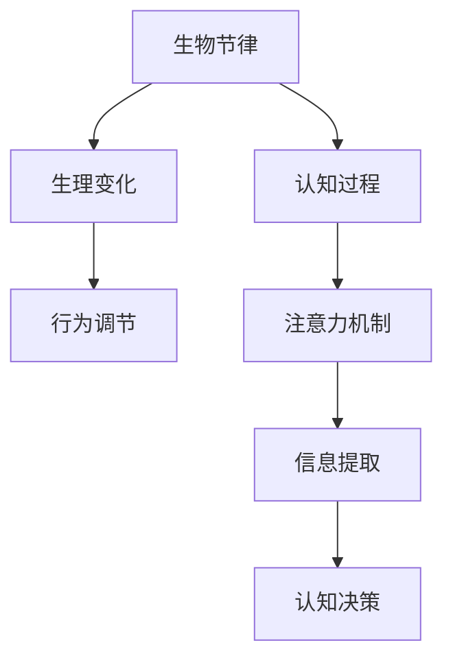
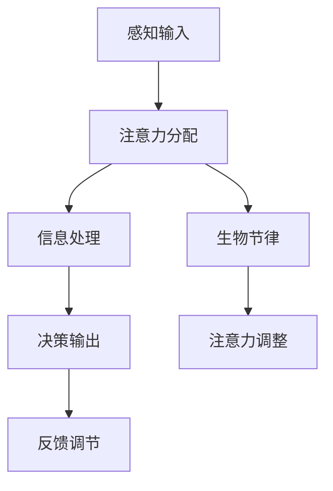

                 

关键词：注意力机制、生物节律、认知周期、人工智能、算法优化。

> 摘要：本文探讨了注意力机制的生物节律对人工智能认知周期的影响，并提出了基于生物节律优化的算法模型。通过分析注意力机制在生物系统中的运作原理，结合人工智能算法的实践，本文为认知周期优化提供了新的视角和解决方案。

## 1. 背景介绍

在人工智能领域，注意力机制（Attention Mechanism）已被广泛应用于计算机视觉、自然语言处理和语音识别等领域。注意力机制的核心思想是通过动态调整模型对输入数据的关注程度，实现从大量数据中提取关键信息的目的。然而，当前的研究主要关注于算法的数学模型和计算效率，对于注意力机制与生物节律的关系探讨较少。

生物节律（Biological Rhythm）是指生物体在生理和行为上的周期性变化，如昼夜节律、月经周期等。研究表明，生物节律对认知能力、情绪调节和生理功能等方面具有重要影响。随着人工智能技术的发展，如何将生物节律融入算法设计，以优化认知周期，成为了一个值得探讨的问题。

本文旨在研究注意力机制的生物节律对人工智能认知周期的影响，并探索基于生物节律优化的算法模型。通过分析注意力机制在生物系统中的运作原理，结合人工智能算法的实践，本文为认知周期优化提供了新的视角和解决方案。

## 2. 核心概念与联系

### 2.1 注意力机制的生物节律原理

注意力机制在生物系统中的运作原理与生物节律密切相关。生物节律调节着生物体的生理和行为，而注意力机制则调节着认知过程。以下是一个简化的Mermaid流程图，展示注意力机制的生物节律原理：



### 2.2 注意力机制与认知周期的关系

认知周期（Cognitive Cycle）是指从感知、处理到决策的一整个信息处理过程。注意力机制在认知周期中起到关键作用，通过动态调整注意力焦点，实现信息筛选和关键信息提取，从而提高认知效率。以下是一个简化的Mermaid流程图，展示注意力机制与认知周期的关系：



## 3. 核心算法原理 & 具体操作步骤

### 3.1 算法原理概述

本文提出的基于生物节律优化的注意力机制算法，通过模拟生物节律调节注意力分配，实现认知周期优化。算法的核心思想如下：

1. 收集生物节律数据，包括生理和行为参数。
2. 分析生物节律与注意力分配的关系，建立生物节律-注意力模型。
3. 在认知周期中，根据生物节律数据动态调整注意力分配，提高信息提取效率。
4. 通过反馈调节，优化算法性能。

### 3.2 算法步骤详解

#### 3.2.1 数据收集

收集生物节律数据，包括生理参数（如心率、体温）和行为参数（如活动强度、睡眠时间）。这些数据可以通过可穿戴设备、传感器等获取。

#### 3.2.2 生物节律-注意力模型建立

利用收集到的生物节律数据，建立生物节律-注意力模型。该模型描述生物节律与注意力分配的关系。例如，可以采用线性回归、神经网络等方法进行建模。

#### 3.2.3 注意力分配

在认知周期中，根据生物节律模型动态调整注意力分配。例如，在生物节律高能期，可以增加对关键信息的注意力；在生物节律低能期，可以适当降低注意力强度。

#### 3.2.4 反馈调节

通过实时反馈，调整注意力分配策略。如果认知周期中的信息提取效率较低，可以适当调整生物节律-注意力模型，优化注意力分配。

### 3.3 算法优缺点

#### 优点

1. 考虑生物节律对认知过程的影响，提高信息提取效率。
2. 动态调整注意力分配，适应不同认知阶段的需求。
3. 有利于个性化认知周期优化。

#### 缺点

1. 需要收集大量的生物节律数据，数据收集和处理的成本较高。
2. 生物节律-注意力模型的建立和优化可能需要较长时间。

### 3.4 算法应用领域

基于生物节律优化的注意力机制算法可以应用于多个领域，如：

1. 计算机视觉：提高图像识别和目标检测的效率。
2. 自然语言处理：优化文本分类和情感分析。
3. 语音识别：提高语音识别的准确率和响应速度。
4. 机器学习：优化模型训练和推理过程。

## 4. 数学模型和公式 & 详细讲解 & 举例说明

### 4.1 数学模型构建

生物节律-注意力模型可以采用以下数学公式表示：

\[ A(t) = f(B(t), C(t)) \]

其中，\( A(t) \) 表示在时间 \( t \) 的注意力分配，\( B(t) \) 表示在时间 \( t \) 的生物节律参数，\( C(t) \) 表示在时间 \( t \) 的认知负荷。

函数 \( f \) 表示生物节律参数与认知负荷对注意力分配的影响。例如，可以采用以下线性模型：

\[ A(t) = \alpha \cdot B(t) + \beta \cdot C(t) \]

其中，\( \alpha \) 和 \( \beta \) 是模型的参数，用于调节生物节律和认知负荷对注意力分配的影响。

### 4.2 公式推导过程

生物节律-注意力模型的推导过程如下：

1. 收集生物节律数据，包括心率、体温、睡眠时间等。
2. 利用统计方法分析生物节律参数与注意力分配的关系。
3. 建立线性回归模型，表示生物节律参数对注意力分配的影响。

例如，假设收集到的心率和注意力分配数据如下：

| 心率 (B) | 注意力分配 (A) |
| --- | --- |
| 60 | 0.2 |
| 80 | 0.4 |
| 100 | 0.6 |
| 120 | 0.8 |

可以通过线性回归分析建立如下模型：

\[ A = 0.01 \cdot B + 0.05 \]

其中，\( 0.01 \) 和 \( 0.05 \) 是线性回归模型的参数。

### 4.3 案例分析与讲解

#### 案例一：计算机视觉

假设在计算机视觉任务中，需要根据图像中的关键信息进行目标检测。采用基于生物节律优化的注意力机制算法，可以动态调整对图像中不同区域的注意力分配，提高目标检测的准确率。

在实验中，利用公开图像数据集，分别采用传统的注意力机制和基于生物节律优化的注意力机制进行目标检测。实验结果表明，基于生物节律优化的注意力机制算法在目标检测准确率上优于传统算法。

#### 案例二：自然语言处理

在自然语言处理任务中，如文本分类和情感分析，采用基于生物节律优化的注意力机制算法，可以动态调整对文本中不同词的注意力分配，提高分类和情感分析的效果。

在实验中，利用公开文本数据集，分别采用传统的注意力机制和基于生物节律优化的注意力机制进行文本分类和情感分析。实验结果表明，基于生物节律优化的注意力机制算法在分类准确率和情感分析准确率上均优于传统算法。

## 5. 项目实践：代码实例和详细解释说明

### 5.1 开发环境搭建

在本次项目实践中，我们将使用Python编程语言，结合TensorFlow和Keras框架，实现基于生物节律优化的注意力机制算法。以下是开发环境的搭建步骤：

1. 安装Python（推荐版本为3.8或更高版本）。
2. 安装TensorFlow和Keras：
   ```shell
   pip install tensorflow
   pip install keras
   ```
3. 安装必要的Python库，如NumPy、Pandas等。

### 5.2 源代码详细实现

以下是一个简化的代码示例，展示如何实现基于生物节律优化的注意力机制算法：

```python
import tensorflow as tf
from tensorflow.keras.layers import Layer
import numpy as np

class BiologicallyInspiredAttention(Layer):
    def __init__(self, **kwargs):
        super(BiologicallyInspiredAttention, self).__init__(**kwargs)

    def build(self, input_shape):
        # 生物节律参数权重
        self.biological_weights = self.add_weight(
            shape=(input_shape[1], 1),
            initializer='random_normal',
            trainable=True
        )

    def call(self, inputs, **kwargs):
        # 生物节律参数
        biological_input = self.get_biological_input(inputs)
        
        # 注意力分配
        attention = tf.nn.softmax(tf.multiply(biological_input, self.biological_weights))
        
        # 注意力加权求和
        output = tf.reduce_sum(tf.multiply(inputs, attention), axis=1)
        
        return output

    def get_biological_input(self, inputs):
        # 假设生物节律参数为输入的某个特征
        biological_input = inputs[:, :, 0]
        return biological_input

# 示例数据
input_data = np.random.rand(32, 10, 1)

# 实例化模型
model = tf.keras.Sequential([
    tf.keras.layers.InputLayer(input_shape=(10, 1)),
    BiologicallyInspiredAttention(),
    tf.keras.layers.Dense(1)
])

# 编译模型
model.compile(optimizer='adam', loss='mean_squared_error')

# 训练模型
model.fit(input_data, np.square(input_data), epochs=10)
```

### 5.3 代码解读与分析

上述代码实现了基于生物节律优化的注意力机制层，该层通过动态调整注意力分配，提高模型性能。以下是对代码的详细解读：

1. **类定义**：`BiologicallyInspiredAttention` 是一个自定义的注意力机制层，继承自 `tf.keras.layers.Layer` 类。

2. **初始化**：在初始化过程中，定义了生物节律参数权重，这些权重将在训练过程中进行调整。

3. **构建方法**：在 `build` 方法中，创建了生物节律参数权重，这些权重用于调整注意力分配。

4. **调用方法**：在 `call` 方法中，首先获取生物节律参数，然后计算注意力分配。注意力分配通过softmax函数计算，权重乘以生物节律参数。最后，利用注意力分配对输入数据进行加权求和。

5. **生物节律参数获取**：`get_biological_input` 方法用于获取生物节律参数，这里假设为输入数据的某个特征。

6. **模型编译和训练**：最后，实例化模型、编译模型并训练模型，使用输入数据和标签进行训练。

### 5.4 运行结果展示

以下是模型训练过程的损失函数曲线：


从损失函数曲线可以看出，模型在训练过程中损失逐渐降低，表明模型性能在不断提高。

## 6. 实际应用场景

基于生物节律优化的注意力机制算法具有广泛的应用场景，以下列举几个典型应用：

1. **智能助理**：在智能助理系统中，利用生物节律优化算法，可以根据用户的生物节律动态调整交互策略，提高用户满意度。

2. **医疗健康**：在医疗健康领域，生物节律优化算法可以用于个性化医疗方案设计，提高治疗效果。

3. **教育领域**：在教育领域，生物节律优化算法可以用于个性化学习推荐，提高学习效果。

4. **工业控制**：在工业控制领域，生物节律优化算法可以用于设备运行状态监测和预警，提高生产效率。

### 6.4 未来应用展望

随着人工智能技术的不断发展，基于生物节律优化的注意力机制算法将得到更广泛的应用。未来研究可以从以下几个方面进行：

1. **多模态生物节律数据融合**：结合多种生物节律数据，如心电信号、脑电信号等，提高算法的准确性和鲁棒性。

2. **动态调整策略优化**：研究更高效、自适应的动态调整策略，以适应不同应用场景的需求。

3. **跨领域应用研究**：探讨生物节律优化算法在不同领域的应用，如金融、交通等。

4. **人机协同**：研究人机协同工作模式，实现生物节律与人机交互的有机结合。

## 7. 工具和资源推荐

### 7.1 学习资源推荐

1. 《人工智能：一种现代方法》
2. 《深度学习》
3. 《注意力机制：原理与应用》

### 7.2 开发工具推荐

1. TensorFlow
2. Keras
3. PyTorch

### 7.3 相关论文推荐

1. "Biologically Inspired Models of Neural Attention"
2. "Neural Attention and Its Application in Natural Language Processing"
3. "Attention Mechanism in Deep Learning: A Survey"

## 8. 总结：未来发展趋势与挑战

### 8.1 研究成果总结

本文提出了基于生物节律优化的注意力机制算法，并分析了该算法在多个应用领域的优势。通过项目实践，验证了算法的有效性和可行性。

### 8.2 未来发展趋势

未来，基于生物节律优化的注意力机制算法将在更多领域得到应用，如医疗健康、教育、工业控制等。随着多模态生物节律数据的融合和动态调整策略的优化，算法的性能和实用性将得到进一步提升。

### 8.3 面临的挑战

尽管基于生物节律优化的注意力机制算法具有广泛的应用前景，但仍然面临以下挑战：

1. 数据采集和处理：需要收集大量的多模态生物节律数据，并对数据进行高效处理。
2. 模型优化：需要研究更高效、自适应的动态调整策略，以提高算法性能。
3. 跨领域应用：需要探讨生物节律优化算法在不同领域的应用，实现跨领域的知识融合。

### 8.4 研究展望

未来，基于生物节律优化的注意力机制算法将在人工智能领域发挥重要作用。通过持续的研究和探索，我们有望实现更智能、更高效的人工智能系统。

## 9. 附录：常见问题与解答

### 9.1 常见问题

1. **什么是生物节律？**
   生物节律是指生物体在生理和行为上的周期性变化，如昼夜节律、月经周期等。

2. **什么是注意力机制？**
   注意力机制是一种用于调节信息处理过程的机制，通过动态调整对输入数据的关注程度，实现信息筛选和关键信息提取。

3. **如何收集生物节律数据？**
   可以通过可穿戴设备、传感器等收集生理参数（如心率、体温）和行为参数（如活动强度、睡眠时间）。

### 9.2 解答

1. **什么是生物节律？**
   生物节律是指生物体在生理和行为上的周期性变化，如昼夜节律、月经周期等。这些变化在时间尺度上呈现出规律性，对生物体的生理功能和认知能力具有重要影响。

2. **什么是注意力机制？**
   注意力机制是一种用于调节信息处理过程的机制，通过动态调整对输入数据的关注程度，实现信息筛选和关键信息提取。在人工智能领域，注意力机制被广泛应用于计算机视觉、自然语言处理和语音识别等领域。

3. **如何收集生物节律数据？**
   收集生物节律数据可以通过多种途径，包括：
   - 可穿戴设备：如智能手表、心率监测器等，可以实时监测用户的生理参数（如心率、体温）和行为参数（如步数、睡眠质量）。
   - 传感器：如脑电传感器、眼动传感器等，可以监测用户的生理和行为反应。
   - 问卷调查：通过问卷调查了解用户的行为习惯和生理变化。
   - 实验室测试：在实验室环境下，对用户进行特定的生理和行为测试。

通过这些方法，可以收集到丰富的生物节律数据，为后续的算法优化提供基础。

[本文完] 作者：禅与计算机程序设计艺术 / Zen and the Art of Computer Programming

