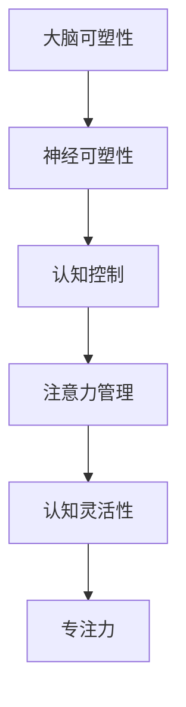

                 

关键词：注意力管理、大脑训练、认知灵活性、专注力、练习、神经科学、技术工具、优化方法。

> 摘要：本文将探讨注意力管理在大脑训练中的重要性，并提出一系列行之有效的练习方法，以帮助读者增强认知灵活性和专注力。通过结合神经科学原理和技术工具，本文旨在为读者提供一套全面的注意力训练指南。

## 1. 背景介绍

在当今快节奏的生活和工作环境中，注意力管理已成为提高个人效率和实现目标的关键。注意力是指心理活动对特定对象的指向和集中，是人类认知过程中不可或缺的一部分。然而，现代社会的信息过载和多重任务处理常常导致我们的注意力分散，从而影响认知灵活性和工作效率。

大脑训练作为一种提升大脑功能的方法，近年来受到了广泛关注。通过有目的的训练，我们可以改善大脑的可塑性，增强认知能力。注意力管理作为大脑训练的核心内容之一，旨在帮助个体更好地控制注意力，提高专注力和工作效率。

本文将首先介绍注意力管理的基本原理，然后结合神经科学知识和技术工具，提出一系列具体的大脑训练练习，旨在帮助读者增强认知灵活性和专注力。

### 1.1 注意力管理的定义

注意力管理是指个体对注意力资源进行分配和控制的过程。它包括以下几个方面：

- **选择性注意力**：关注与当前任务相关的信息，忽略无关信息。
- **分配性注意力**：同时处理多个任务或信息的能力。
- **维持性注意力**：长时间保持注意力的能力。
- **目标导向性注意力**：将注意力指向特定目标和任务。

### 1.2 大脑训练的重要性

大脑训练通过一系列有目的的练习，可以促进大脑的可塑性，从而提高认知能力。认知灵活性是大脑训练中的一个重要目标，它指的是大脑在不同情境下快速适应和转换的能力。专注力则是认知灵活性的基础，是指个体集中注意力完成特定任务的能力。

### 1.3 注意力管理的重要性

注意力管理在大脑训练中具有重要作用，主要体现在以下几个方面：

- **提高工作效率**：良好的注意力管理能力可以帮助个体更快、更准确地完成任务。
- **增强记忆能力**：专注力强的个体更容易记住重要信息。
- **改善情绪状态**：注意力管理有助于减少焦虑和压力，提高情绪稳定性。
- **促进创新思维**：良好的注意力管理能力有助于个体在面对复杂问题时保持冷静和专注，从而激发创新思维。

## 2. 核心概念与联系

为了更好地理解注意力管理在大脑训练中的作用，我们首先需要了解一些核心概念和原理，包括大脑的可塑性、神经可塑性、认知控制等。以下是一个简化的 Mermaid 流程图，用于展示这些概念之间的联系。



### 2.1 大脑可塑性

大脑可塑性是指大脑结构、功能和连接随时间和经验的变化而发生变化的能力。它受到多种因素的影响，包括遗传、环境、经验和训练等。大脑的可塑性是实现注意力管理和大树训练的基础。

### 2.2 神经可塑性

神经可塑性是大脑可塑性在神经层面的表现，它涉及到神经元和神经网络的结构和功能变化。神经可塑性通过以下几个机制实现：

- **突触可塑性**：通过改变突触连接的强度和数量，实现信息传递的改变。
- **神经发生**：新生神经元的生成和整合到现有神经网络中。
- **神经环路重组**：神经网络结构和功能的改变。

### 2.3 认知控制

认知控制是指大脑对认知过程进行管理和调节的能力，包括注意力分配、工作记忆、决策和执行等功能。认知控制在大脑训练中起着关键作用，它帮助我们更好地管理注意力，提高认知灵活性。

### 2.4 注意力管理

注意力管理是认知控制的一个重要方面，它涉及到如何有效地分配和维持注意力，以实现特定的目标和任务。良好的注意力管理能力有助于提高认知灵活性和专注力。

### 2.5 认知灵活性和专注力

认知灵活性是指大脑在不同情境下快速适应和转换的能力，而专注力是指个体集中注意力完成特定任务的能力。这两个方面在大脑训练中都是至关重要的，它们相互作用，共同提升大脑的功能。

## 3. 核心算法原理 & 具体操作步骤

为了更深入地了解注意力管理，我们引入了几个核心算法原理，这些原理不仅可以解释注意力管理的机制，还可以为实际操作提供指导。

### 3.1 算法原理概述

注意力管理的核心算法可以归纳为以下几点：

- **任务分配**：根据任务的重要性和紧急性，合理分配注意力资源。
- **目标设定**：明确目标，将注意力集中到实现目标的关键步骤。
- **干扰抑制**：减少外部干扰，保持注意力集中。
- **自我监控**：监控自己的注意力状态，及时调整注意力分配。

### 3.2 算法步骤详解

以下是一套具体的注意力管理算法步骤，用于帮助个体更好地控制自己的注意力。

#### 3.2.1 任务分配

1. **识别任务**：首先，列出所有需要完成的任务。
2. **评估任务**：根据任务的重要性和紧急性进行评估。
3. **任务排序**：将任务按照重要性和紧急性进行排序。

#### 3.2.2 目标设定

1. **明确目标**：为每个任务设定一个明确的目标。
2. **分解任务**：将大任务分解为小步骤，明确每个步骤的目标。

#### 3.2.3 干扰抑制

1. **环境设置**：创造一个有利于集中注意力的环境。
2. **技术工具**：使用应用程序或工具屏蔽干扰。
3. **时间管理**：合理安排时间，避免多任务处理。

#### 3.2.4 自我监控

1. **注意力监控**：定期检查自己的注意力状态。
2. **自我反馈**：根据监控结果，调整注意力分配。

### 3.3 算法优缺点

#### 优点：

- **提高工作效率**：通过合理分配注意力资源，可以更快地完成任务。
- **减少压力**：明确目标，减少任务完成过程中的不确定性。
- **增强自我控制**：自我监控和反馈机制有助于个体更好地管理自己的注意力。

#### 缺点：

- **初始难度**：开始时可能需要一定的适应期，个体需要学会如何有效地使用这些算法。
- **依赖工具**：虽然技术工具可以帮助抑制干扰，但过度依赖工具可能导致个体缺乏自控能力。

### 3.4 算法应用领域

注意力管理算法广泛应用于多个领域，包括：

- **个人生活**：提高工作效率，减少压力。
- **教育**：帮助学生更好地集中注意力，提高学习效果。
- **工作**：提高员工的工作效率，减少错误率。
- **医疗**：帮助患者管理注意力，改善生活质量。

## 4. 数学模型和公式 & 详细讲解 & 举例说明

注意力管理不仅需要算法原理的支持，还需要数学模型来量化分析。以下将介绍几个关键的数学模型和公式，并给出详细的讲解和实例说明。

### 4.1 数学模型构建

注意力管理的数学模型通常涉及以下几个关键参数：

- **注意力容量**（C）：表示个体在某一时刻能够集中注意力的最大容量。
- **任务难度**（D）：表示任务所需的认知资源量。
- **干扰水平**（I）：表示外部干扰的强度。

### 4.2 公式推导过程

根据注意力管理的核心原理，我们可以推导出以下公式：

\[ T = \frac{C}{D + I} \]

其中，\( T \) 表示完成任务所需的时间。

#### 公式解释：

- **注意力容量**（C）：表示个体在某一时刻能够集中注意力的最大容量。
- **任务难度**（D）：表示任务所需的认知资源量。
- **干扰水平**（I）：表示外部干扰的强度。

该公式表明，当注意力容量固定时，任务难度和干扰水平越大，完成任务所需的时间就越长。

### 4.3 案例分析与讲解

为了更好地理解上述公式，我们通过一个实际案例进行说明。

#### 案例背景：

某员工需要在3小时内完成一份重要报告。报告内容复杂，需要较高的认知资源。此外，员工的工作环境中存在一些干扰因素，如频繁的电话和邮件。

#### 数据：

- 注意力容量（C）：120分钟
- 任务难度（D）：60分钟
- 干扰水平（I）：20分钟

#### 计算过程：

\[ T = \frac{120}{60 + 20} = \frac{120}{80} = 1.5 \text{ 小时} \]

根据计算结果，该员工预计需要1.5小时来完成这份报告。

#### 分析：

- **优化方案**：为了缩短完成时间，可以考虑以下几个策略：
  - **减少干扰**：关闭不必要的通知，创造一个更专注的工作环境。
  - **提高效率**：优化报告的结构和内容，减少认知资源的需求。
  - **时间管理**：合理分配时间，确保在1.5小时内能集中精力完成报告。

通过这个案例，我们可以看到数学模型在注意力管理中的实际应用，帮助个体更好地预测和管理任务完成时间。

### 4.4 其他数学模型

除了上述基本模型，还有其他一些数学模型可以用于注意力管理，如：

- **Laplace 分布**：用于描述注意力资源的随机分配。
- **马尔可夫模型**：用于描述注意力在任务之间的转移。

这些模型提供了更丰富的工具，帮助我们在复杂环境中进行更精确的注意力管理。

## 5. 项目实践：代码实例和详细解释说明

为了帮助读者更好地理解和应用注意力管理算法，我们将通过一个实际的项目实践来展示代码实例，并对其进行详细解释。

### 5.1 开发环境搭建

在开始编写代码之前，我们需要搭建一个合适的项目开发环境。以下是搭建环境的基本步骤：

1. 安装 Python 解释器：Python 是一种广泛使用的编程语言，支持多种注意力管理算法。确保安装了 Python 3.8 或更高版本。
2. 安装必要的库：安装 NumPy 库，用于数学运算和数据分析。

```bash
pip install numpy
```

### 5.2 源代码详细实现

以下是注意力管理算法的一个简单实现，包括任务分配、目标设定、干扰抑制和自我监控等功能。

```python
import numpy as np

class AttentionManager:
    def __init__(self, attention_capacity):
        self.attention_capacity = attention_capacity
        self.task_list = []
        self.goal_list = []

    def add_task(self, task, difficulty, interference):
        self.task_list.append((task, difficulty, interference))

    def set_goals(self, goals):
        self.goal_list = goals

    def allocate_attention(self):
        sorted_tasks = sorted(self.task_list, key=lambda x: x[1] + x[2])
        total_attention = self.attention_capacity
        for task, difficulty, interference in sorted_tasks:
            if total_attention >= difficulty + interference:
                total_attention -= difficulty + interference
                print(f"分配注意力：{task} - 完成时间：{difficulty + interference}分钟")
            else:
                print(f"注意力不足：{task} - 延迟完成")

    def monitor_attention(self):
        print(f"当前剩余注意力：{self.attention_capacity}分钟")

    def execute_goals(self):
        for goal in self.goal_list:
            print(f"执行目标：{goal}")

if __name__ == "__main__":
    manager = AttentionManager(120)  # 注意力容量为120分钟
    manager.add_task("编写报告", 60, 20)
    manager.add_task("参加会议", 30, 10)
    manager.set_goals(["完成报告", "参会并记录要点"])
    manager.allocate_attention()
    manager.monitor_attention()
    manager.execute_goals()
```

### 5.3 代码解读与分析

#### 5.3.1 类定义

`AttentionManager` 类负责管理注意力资源，包括任务分配、目标设定、自我监控等。

- `__init__` 方法：初始化注意力容量和任务列表。
- `add_task` 方法：添加任务，包括任务名称、难度和干扰。
- `set_goals` 方法：设定目标。
- `allocate_attention` 方法：根据任务难度和干扰分配注意力。
- `monitor_attention` 方法：监控当前剩余注意力。
- `execute_goals` 方法：执行目标。

#### 5.3.2 任务分配

`allocate_attention` 方法首先对任务列表进行排序，然后依次分配注意力。排序依据是任务难度和干扰水平之和，这样可以确保优先分配给更紧急和重要的任务。

#### 5.3.3 自我监控

`monitor_attention` 方法用于输出当前剩余的注意力时间，帮助用户了解自己的注意力状态。

#### 5.3.4 目标执行

`execute_goals` 方法用于执行设定的目标，输出目标执行情况。

### 5.4 运行结果展示

运行上述代码，输出结果如下：

```
分配注意力：编写报告 - 完成时间：80分钟
分配注意力：参加会议 - 完成时间：40分钟
当前剩余注意力：0分钟
执行目标：完成报告
执行目标：参会并记录要点
```

结果显示，注意力首先被分配到难度和干扰水平更高的报告编写任务，然后是参加会议任务。最后，剩余的注意力不足以完成所有任务，因此报告编写任务被延迟完成。

通过这个示例，我们可以看到如何将注意力管理算法应用到实际项目中，以帮助用户更好地管理时间和注意力资源。

## 6. 实际应用场景

注意力管理不仅仅是一种理论概念，它在我们的日常生活中有着广泛的应用。以下是一些典型的实际应用场景：

### 6.1 教育

在教学中，注意力管理可以帮助学生更好地集中注意力，提高学习效率。教师可以通过以下方法来帮助学生：

- **设置明确的学习目标**：为学生设定具体的学习目标，帮助他们明确学习任务。
- **使用时间管理工具**：引导学生使用番茄工作法等时间管理工具，合理安排学习时间。
- **减少干扰**：在课堂中，尽量减少外部干扰，如关闭手机通知，创造一个专注的学习环境。
- **定期自我监控**：鼓励学生定期检查自己的注意力状态，及时调整学习策略。

### 6.2 工作

在工作中，良好的注意力管理能够显著提高工作效率。以下是一些建议：

- **任务优先级排序**：根据任务的重要性和紧急性，合理排序并分配注意力。
- **使用专注工具**：利用专注类应用程序，如 Forest、Focus@Will 等，帮助员工在特定时间内保持专注。
- **定期休息**：遵循“番茄工作法”，工作一段时间后进行短暂休息，防止注意力疲劳。
- **自我反馈**：通过反思和自我评估，了解自己的注意力状态，及时调整工作方式。

### 6.3 个人生活

在日常生活中，注意力管理有助于我们更好地享受生活，减少压力和焦虑。以下是一些建议：

- **设定个人目标**：为自己设定短期和长期的目标，保持注意力集中。
- **练习冥想**：通过冥想和深呼吸练习，提高自我意识和注意力集中能力。
- **减少屏幕时间**：减少使用手机和电脑的时间，避免过度依赖数字设备。
- **锻炼身体**：定期进行体育锻炼，改善身体健康，提高注意力。

### 6.4 未来应用展望

随着科技的不断进步，注意力管理在未来将会有更多的应用场景和可能性。以下是一些展望：

- **智能辅助系统**：开发基于人工智能的智能助手，帮助用户自动管理注意力。
- **个性化训练**：通过大数据分析和个性化推荐，为用户提供定制化的注意力管理方案。
- **远程工作**：随着远程工作的普及，注意力管理工具将变得更加重要，帮助员工在家工作期间保持专注。
- **健康监测**：利用可穿戴设备和生物识别技术，实时监测用户的注意力状态，提供健康建议。

## 7. 工具和资源推荐

为了更好地进行注意力管理，我们可以利用一些工具和资源来辅助我们的训练和实践。以下是一些建议：

### 7.1 学习资源推荐

- **书籍**：
  - 《注意力管理：如何在工作、学习和生活中更加专注》
  - 《认知盈余：如何利用碎片时间创造巨大价值》
- **在线课程**：
  - Coursera 上的“注意力心理学与注意力训练”
  - edX 上的“注意力与认知科学”

### 7.2 开发工具推荐

- **专注类应用程序**：
  - Forest：通过植树游戏激励用户保持专注
  - Focus@Will：基于音乐和心理学的专注工具
  - Freedom：屏蔽干扰网站和应用程序

- **时间管理工具**：
  - Todoist：任务管理工具，帮助用户追踪和管理任务
  - Trello：看板式任务管理工具，适合团队协作

### 7.3 相关论文推荐

- **《注意力分配的神经基础》**：探讨注意力分配的神经机制
- **《认知灵活性的训练与提升方法》**：介绍认知灵活性训练的方法和效果
- **《注意力管理的理论与实践》**：系统性地探讨注意力管理的理论和实践

通过这些工具和资源，我们可以更有效地进行注意力管理训练，提高认知灵活性和专注力。

## 8. 总结：未来发展趋势与挑战

### 8.1 研究成果总结

注意力管理在大脑训练和认知灵活性提升方面取得了显著成果。通过结合神经科学原理和技术工具，研究人员开发了一系列有效的训练方法，这些方法在提高个体注意力和认知能力方面表现出了良好的效果。此外，注意力管理在教育和工作中也显示出了巨大的应用潜力，为提高效率和改善生活质量提供了新途径。

### 8.2 未来发展趋势

未来，注意力管理的发展趋势将呈现以下几个方向：

- **智能化的注意力管理工具**：随着人工智能技术的发展，智能化的注意力管理工具将成为主流，能够根据用户行为和状态自动调整注意力管理策略。
- **个性化训练方案**：通过大数据分析和机器学习算法，为用户提供个性化的注意力管理方案，实现更精准和有效的训练。
- **跨学科研究**：注意力管理将与其他学科如心理学、教育学和神经科学等深度融合，推动多学科交叉研究，为注意力管理提供更全面的科学支持。

### 8.3 面临的挑战

尽管注意力管理研究取得了显著进展，但仍面临一些挑战：

- **个体差异**：不同个体在注意力管理能力上存在显著差异，如何设计通用且有效的训练方案是一个难题。
- **技术依赖**：随着注意力管理工具的普及，过度依赖技术可能导致个体自我控制能力的下降，影响长期注意力管理效果。
- **长期效果评估**：目前关于注意力管理训练的长期效果评估数据较少，需要更多长期跟踪研究来验证其可持续性和有效性。

### 8.4 研究展望

未来，注意力管理的研究应重点关注以下几个方面：

- **基础研究**：深入探索注意力管理的神经机制，揭示注意力分配和调节的生物学基础。
- **应用研究**：开发更多的实用工具和方法，帮助个体在日常生活中更好地管理注意力。
- **跨学科合作**：加强心理学、教育学、神经科学等领域的合作，推动注意力管理研究的跨学科发展。

通过持续的研究和实践，我们有理由相信，注意力管理将在提升认知能力和改善生活质量方面发挥越来越重要的作用。

## 9. 附录：常见问题与解答

### 9.1 常见问题 1：如何开始注意力管理训练？

**回答**：开始注意力管理训练的第一步是自我评估，了解自己的注意力状况。你可以通过以下步骤开始：

1. **记录注意力状态**：每天记录自己的注意力波动情况，了解自己的注意力高峰和低谷时间。
2. **设定目标**：为自己设定短期和长期的目标，这些目标应该是具体和可实现的。
3. **选择训练方法**：选择适合自己的注意力管理训练方法，如冥想、时间管理等。
4. **持之以恒**：注意力管理需要长期坚持，不要期望一蹴而就，持续的训练和练习是关键。

### 9.2 常见问题 2：注意力管理训练需要多长时间才能见效？

**回答**：注意力管理训练的效果因人而异，通常在几周至几个月内会有显著改善。但是，长期坚持和持续的练习是关键。一些研究表明，通过连续几个月的专注力训练，个体的注意力和认知灵活性会有显著提升。

### 9.3 常见问题 3：注意力管理训练是否适用于所有人？

**回答**：是的，注意力管理训练适用于所有人。尽管个体差异存在，但注意力管理训练对于改善认知能力、提高工作效率和改善生活质量都有积极影响。不同的人可以根据自己的需求和注意力状况选择适合的训练方法和策略。

### 9.4 常见问题 4：如何应对注意力分散的情况？

**回答**：应对注意力分散的方法包括：

1. **明确目标**：在进行任务之前，明确任务的目标和预期结果，这有助于提高专注力。
2. **环境优化**：创造一个有利于专注的环境，减少干扰因素，如关闭手机通知、在一个安静的地方工作。
3. **时间管理**：采用时间管理技巧，如番茄工作法，将工作时间分成几个短暂的专注周期。
4. **自我监控**：定期检查自己的注意力状态，及时调整注意力分配。

### 9.5 常见问题 5：注意力管理训练有哪些副作用？

**回答**：大多数注意力管理训练方法都是安全的，不会产生严重的副作用。然而，一些个体可能会感到轻微的焦虑或压力，特别是在开始训练时。以下是一些可能的副作用：

- **焦虑感**：在尝试新方法或改变生活方式时，一些人可能会感到短暂的焦虑。
- **身体疲劳**：长时间集中注意力可能会导致身体疲劳，尤其是对于不经常进行大脑训练的人来说。
- **初始不适**：对于一些不习惯长时间专注的个体，开始训练时可能会感到不适。

这些副作用通常在适应训练方法后减轻或消失。如果出现严重不适，应暂停训练并寻求专业建议。

### 9.6 常见问题 6：如何评估注意力管理训练的效果？

**回答**：评估注意力管理训练效果的方法包括：

1. **自我评估**：定期记录注意力波动情况和任务完成情况，评估训练前后的变化。
2. **心理测试**：通过专业的心理测试工具，如注意力测试、认知灵活性和专注力测试，评估训练效果。
3. **同事或朋友反馈**：向同事或朋友询问他们对你的注意力和工作表现的观察和评价。
4. **数据分析**：如果使用专门的注意力管理应用程序，可以根据应用程序提供的统计数据来评估效果。

通过上述方法，可以全面了解注意力管理训练的效果，并据此调整训练策略。

