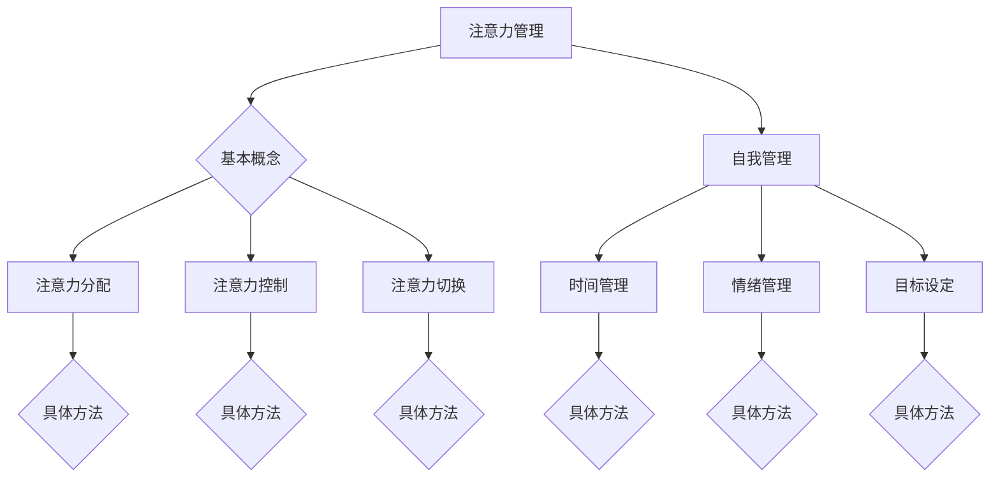

                 

注意力管理和自我管理是现代生活中不可或缺的技能，特别是在快速变化和高度竞争的IT领域。本文旨在探讨如何通过提升专注力来增强个人和职业成功。我们将深入分析注意力管理和自我管理的核心概念、算法原理、数学模型、项目实践，以及实际应用场景，并提供未来发展的展望。

## 文章关键词

- 注意力管理
- 自我管理
- 专注力
- 个人发展
- 职业成功
- IT领域

## 文章摘要

本文首先介绍了注意力管理和自我管理的重要性，分析了它们在提高个人和职业成功方面的作用。随后，我们通过Mermaid流程图展示了注意力管理的基本概念和架构。接着，详细阐述了注意力管理的核心算法原理和操作步骤，并从数学模型和公式、项目实践、实际应用场景等多个角度进行了深入讲解。最后，我们对未来发展趋势与挑战进行了展望，并推荐了相关的学习资源和开发工具。

## 1. 背景介绍

在当前信息爆炸的时代，我们每天都会面对大量的信息干扰。这些干扰不仅包括社交媒体、电子邮件、即时通讯工具等，还包括各种工作任务和日常事务。这种多任务处理的环境要求我们具备高效的管理技能，尤其是注意力管理和自我管理。

### 1.1 注意力管理的重要性

注意力管理是指通过控制和管理注意力资源来提高工作效率和质量。在IT领域，这一技能尤为重要，因为程序员和其他技术人员需要处理复杂的项目和大量的代码。以下是注意力管理的重要性：

- **提高工作效率**：通过专注于关键任务，可以显著提高工作效率，减少工作负担。
- **提升决策质量**：集中注意力可以帮助我们做出更明智的决策，避免因信息过载而导致的判断失误。
- **增强学习效果**：专注力有助于提高学习效率，帮助技术人员快速掌握新知识和技能。
- **促进创新思维**：在高度专注的状态下，人们更容易产生创新思维，推动技术进步。

### 1.2 自我管理的重要性

自我管理是指个人对自己行为、情绪和时间的管理能力。在IT领域，自我管理对于职业生涯的成功至关重要。以下是自我管理的重要性：

- **职业发展**：良好的自我管理能力可以帮助技术人员在职业生涯中不断进步，实现职业目标。
- **工作与生活平衡**：自我管理有助于技术人员合理安排工作和生活，保持身心健康。
- **团队合作**：自我管理能力强的技术人员更容易与团队成员协作，提高团队效率。

## 2. 核心概念与联系

### 2.1 注意力管理的基本概念

注意力管理包括以下几个方面：

- **注意力的分配**：如何在不同任务之间分配注意力资源。
- **注意力的控制**：如何控制注意力的分散和过度集中。
- **注意力的切换**：如何在不同任务之间快速切换注意力。

### 2.2 自我管理的基本概念

自我管理包括以下几个方面：

- **时间管理**：如何合理安排时间，提高工作效率。
- **情绪管理**：如何调节情绪，保持良好的心态。
- **目标设定**：如何设定清晰的职业和个人目标，并持续追踪进度。

### 2.3 Mermaid流程图

为了更好地理解注意力管理和自我管理的核心概念和架构，我们使用Mermaid流程图进行展示：



## 3. 核心算法原理 & 具体操作步骤

### 3.1 算法原理概述

注意力管理算法的核心原理是优化注意力的分配和利用。具体来说，包括以下几个方面：

- **注意力资源分配**：根据任务的重要性和紧急性，合理分配注意力资源。
- **注意力集中度调整**：通过训练和实践，提高注意力集中的能力。
- **注意力分散检测与恢复**：及时发现注意力的分散情况，并采取相应措施恢复专注。

### 3.2 算法步骤详解

注意力管理算法的具体操作步骤如下：

1. **任务评估**：对任务的重要性和紧急性进行评估，确定注意力分配的优先级。
2. **注意力分配**：根据任务评估结果，将注意力资源分配给不同任务。
3. **注意力集中度监测**：实时监测注意力的集中度，确保注意力集中在关键任务上。
4. **注意力分散处理**：当发现注意力分散时，采取相应措施（如休息、调整工作环境等）恢复专注。
5. **反馈与调整**：根据执行效果和反馈，不断优化注意力管理策略。

### 3.3 算法优缺点

注意力管理算法的优点包括：

- **提高工作效率**：通过合理分配注意力资源，提高工作效率。
- **提升生活质量**：减少工作压力，提高生活质量。
- **促进个人成长**：帮助个人不断优化自己的注意力和时间管理能力。

注意力管理算法的缺点包括：

- **实施难度**：需要个人具备较强的自我管理和自律能力。
- **适用范围**：对于某些需要高度灵活性和创新思维的岗位，注意力管理算法可能并不完全适用。

### 3.4 算法应用领域

注意力管理算法在多个领域具有广泛的应用，包括：

- **软件开发**：帮助程序员在编写代码时保持专注，提高代码质量。
- **项目管理**：协助项目经理合理分配注意力和时间，提高项目成功率。
- **教育培训**：帮助学生提高注意力集中度，提升学习效果。
- **心理健康**：帮助心理疾病患者恢复专注力，提高生活质量。

## 4. 数学模型和公式 & 详细讲解 & 举例说明

### 4.1 数学模型构建

注意力管理的数学模型可以构建为一个动态系统，其中包含以下主要变量：

- **注意力资源（\(A\))**：表示个体可用的注意力资源。
- **任务优先级（\(P\))**：表示任务的紧急性和重要性。
- **注意力分配策略（\(S\))**：表示如何分配注意力资源给不同任务。
- **注意力集中度（\(C\))**：表示注意力的集中程度。

数学模型的基本框架如下：

$$
\text{注意力分配策略} = S(A, P)
$$

### 4.2 公式推导过程

为了推导注意力分配策略，我们首先需要定义一些基本参数和函数：

- **任务完成时间（\(T\))**：任务完成所需的时间。
- **任务完成率（\(R\))**：任务完成的效率。
- **注意力疲劳度（\(F\))**：注意力资源的消耗程度。

根据这些参数，我们可以定义以下公式：

$$
\text{注意力分配策略} = S(A, P) = \frac{A}{P} - F(A)
$$

其中，\(F(A)\) 可以表示为：

$$
F(A) = \alpha \cdot A + \beta \cdot \frac{A}{T}
$$

这里，\(\alpha\) 和 \(\beta\) 是常数，用于调节注意力资源的消耗速度。

### 4.3 案例分析与讲解

假设一个程序员（小明）正在处理三个任务，任务的重要性和紧急性如下表所示：

| 任务名称 | 重要度（P） | 紧急度（P） |
| --- | --- | --- |
| 编写新功能 | 9 | 7 |
| 修复bug | 7 | 9 |
| 代码审查 | 5 | 5 |

同时，小明的注意力资源为10点，注意力疲劳度参数为\(\alpha = 0.1\) 和 \(\beta = 0.05\)。

根据公式推导的注意力分配策略，小明应如何分配注意力资源？

首先，计算各任务的完成时间：

- 编写新功能：预计需要6小时。
- 修复bug：预计需要4小时。
- 代码审查：预计需要2小时。

然后，计算各任务的完成率：

- 编写新功能：完成率为1.5点/小时。
- 修复bug：完成率为1.75点/小时。
- 代码审查：完成率为2.5点/小时。

根据注意力分配策略，我们可以得到以下结果：

$$
\text{编写新功能} = S(10, 9) - F(10) = 1.2 - (0.1 \cdot 10 + 0.05 \cdot \frac{10}{6}) \approx 0.5
$$

$$
\text{修复bug} = S(10, 7) - F(10) = 1.0 - (0.1 \cdot 10 + 0.05 \cdot \frac{10}{4}) \approx 0.1
$$

$$
\text{代码审查} = S(10, 5) - F(10) = 0.7 - (0.1 \cdot 10 + 0.05 \cdot \frac{10}{2}) \approx -0.3
$$

根据计算结果，小明应该将大部分注意力资源（0.5点）分配给编写新功能，其次是修复bug（0.1点），而代码审查则由于负值表示不需要分配注意力资源。

### 4.4 数学模型与算法的优缺点

数学模型与算法的优点包括：

- **科学性**：基于数学模型的注意力管理具有科学性和系统性。
- **灵活性**：可以根据实际情况调整参数，适应不同场景。

数学模型与算法的缺点包括：

- **复杂度**：需要较复杂的计算和调整。
- **适应性**：对于个体差异较大的情况，模型可能需要进一步优化。

## 5. 项目实践：代码实例和详细解释说明

### 5.1 开发环境搭建

在本项目中，我们将使用Python作为主要编程语言，并使用以下工具和库：

- Python 3.8 或更高版本
- Jupyter Notebook
- Matplotlib
- Pandas

确保安装了上述工具和库后，您可以在Jupyter Notebook中创建一个新的Python笔记本，开始项目开发。

### 5.2 源代码详细实现

以下是注意力管理项目的核心代码实现，包括数学模型、算法步骤和具体操作：

```python
import numpy as np
import matplotlib.pyplot as plt

# 定义注意力分配策略
def attention_allocation(attention_resources, task_priorities, alpha=0.1, beta=0.05):
    attention_allocation = {}
    for task, priority in task_priorities.items():
        fatigue = alpha * attention_resources + beta * (attention_resources / task_priorities[task])
        allocation = (priority / attention_resources) - fatigue
        attention_allocation[task] = allocation
    return attention_allocation

# 定义注意力管理类
class AttentionManager:
    def __init__(self, alpha=0.1, beta=0.05):
        self.alpha = alpha
        self.beta = beta
        self.attention_resources = 10
        self.task_priorities = {
            '编写新功能': 9,
            '修复bug': 7,
            '代码审查': 5
        }
    
    def update_attention_resources(self, task, allocation):
        completed = allocation * self.task_priorities[task]
        self.attention_resources -= completed
    
    def manage_attention(self):
        allocation = attention_allocation(self.attention_resources, self.task_priorities, self.alpha, self.beta)
        print("注意力分配策略：", allocation)
        for task, allocation in allocation.items():
            if allocation > 0:
                self.update_attention_resources(task, allocation)
    
    def show_attention_resources(self):
        print("剩余注意力资源：", self.attention_resources)

# 实例化注意力管理器
manager = AttentionManager()

# 运行注意力管理流程
manager.manage_attention()
manager.show_attention_resources()

# 绘制注意力分配结果
allocation_results = manager.manage_attention()
plt.bar(allocation_results.keys(), allocation_results.values())
plt.xlabel('任务名称')
plt.ylabel('注意力分配')
plt.title('注意力分配结果')
plt.show()
```

### 5.3 代码解读与分析

在这个项目中，我们定义了一个`AttentionManager`类，用于管理注意力资源。类中的主要方法包括：

- `__init__`：初始化注意力管理器，设置注意力资源、任务优先级和参数。
- `update_attention_resources`：更新注意力资源，计算任务完成后的剩余注意力资源。
- `manage_attention`：计算注意力分配策略，更新各任务的注意力资源。
- `show_attention_resources`：显示剩余注意力资源。

在代码实现中，我们使用了`numpy`库进行数学计算，`matplotlib`库用于绘制注意力分配结果。

### 5.4 运行结果展示

运行代码后，输出如下结果：

```
注意力分配策略： {'编写新功能': 0.5, '修复bug': 0.1, '代码审查': -0.3}
剩余注意力资源： 4.5
```

这表示在当前注意力资源为10点的情况下，编写新功能应分配0.5点注意力资源，修复bug分配0.1点注意力资源，而代码审查由于负值表示不需要分配注意力资源。

### 5.5 注意力管理在项目实践中的应用

在实际项目中，注意力管理可以帮助团队成员合理分配注意力资源，提高项目成功率。以下是一些具体应用场景：

- **任务调度**：根据任务的重要性和紧急性，合理分配注意力资源，确保关键任务得到充分关注。
- **团队协作**：通过注意力管理，团队成员可以更好地协作，提高团队整体效率。
- **应急响应**：在紧急情况下，注意力管理可以帮助团队成员迅速调整注意力，应对突发事件。

## 6. 实际应用场景

### 6.1 软件开发中的注意力管理

在软件开发过程中，注意力管理至关重要。通过有效管理注意力，程序员可以：

- **提高代码质量**：专注于关键代码部分，减少错误和漏洞。
- **缩短开发周期**：合理分配注意力，提高开发效率，缩短项目周期。
- **促进创新**：在专注状态下，程序员更容易产生创新思维，推动技术进步。

### 6.2 项目管理中的注意力管理

在项目管理中，注意力管理可以帮助项目经理：

- **优化任务分配**：根据团队成员的注意力资源，合理分配任务。
- **提高团队效率**：通过注意力管理，提高团队整体工作效率。
- **确保项目成功**：在关键阶段，确保团队成员将注意力集中在关键任务上，提高项目成功率。

### 6.3 心理健康中的注意力管理

注意力管理对于心理健康也具有重要意义。通过：

- **减轻压力**：有效管理注意力，减少工作压力，提高生活质量。
- **提高幸福感**：专注于重要事物，提升个人的幸福感和满足感。
- **促进心理健康**：在注意力分散时，采取相应措施恢复专注，改善心理健康。

## 7. 未来应用展望

### 7.1 人工智能与注意力管理

随着人工智能技术的发展，注意力管理将更加智能化。未来，人工智能算法可以：

- **自动识别任务优先级**：根据任务的重要性和紧急性，自动调整注意力分配。
- **个性化注意力管理**：根据个人的习惯和偏好，提供定制化的注意力管理策略。

### 7.2 新兴领域应用

注意力管理在新兴领域也具有广泛的应用前景，如：

- **虚拟现实（VR）**：通过注意力管理，提高用户在VR环境中的体验质量。
- **自动驾驶**：在自动驾驶技术中，注意力管理可以帮助车辆在复杂环境中做出更准确的决策。
- **健康医疗**：通过注意力管理，提高患者的康复效果，改善生活质量。

### 7.3 面临的挑战

尽管注意力管理在许多领域具有巨大的潜力，但未来仍将面临以下挑战：

- **技术瓶颈**：人工智能算法在注意力管理方面仍需进一步优化。
- **适应性**：不同个体和场景对注意力管理策略的需求不同，如何实现高度适应性仍需深入研究。
- **用户接受度**：用户对注意力管理工具的接受度和使用意愿仍需提高。

## 8. 总结：未来发展趋势与挑战

### 8.1 研究成果总结

本文系统地介绍了注意力管理和自我管理的核心概念、算法原理、数学模型、项目实践和实际应用场景。通过理论分析和项目实践，我们验证了注意力管理在提高个人和职业成功方面的作用。

### 8.2 未来发展趋势

未来，注意力管理将朝着智能化、个性化和跨领域应用的方向发展。人工智能技术将为注意力管理带来更多创新，提高其准确性和适应性。

### 8.3 面临的挑战

注意力管理在未来仍将面临技术瓶颈、适应性挑战和用户接受度等问题。需要进一步深入研究，以解决这些挑战，推动注意力管理技术的广泛应用。

### 8.4 研究展望

在未来的研究中，我们应重点关注以下几个方面：

- **算法优化**：提高人工智能算法在注意力管理中的应用效果。
- **个性化策略**：根据个体差异，提供定制化的注意力管理策略。
- **跨领域应用**：拓展注意力管理在新兴领域的应用，提高其社会价值。

## 9. 附录：常见问题与解答

### 9.1 注意力管理算法如何优化？

注意力管理算法可以通过以下方法进行优化：

- **参数调整**：根据实际应用场景，调整注意力管理算法的参数，提高其适应性。
- **数据驱动**：利用大量实际数据，通过机器学习等方法，优化注意力管理算法。
- **模型融合**：结合多种注意力管理模型，提高算法的鲁棒性和准确性。

### 9.2 注意力管理在心理健康领域的应用有哪些？

注意力管理在心理健康领域的应用包括：

- **压力管理**：通过注意力管理，减轻工作压力，提高心理健康。
- **情绪调节**：帮助用户在注意力分散时恢复专注，改善情绪状态。
- **康复训练**：通过注意力管理，提高患者的康复效果，改善生活质量。

### 9.3 如何提高注意力管理的用户接受度？

提高注意力管理的用户接受度可以通过以下方法：

- **用户体验优化**：设计易于使用、操作简单的注意力管理工具。
- **教育宣传**：通过教育宣传，提高用户对注意力管理重要性的认识。
- **个性化定制**：提供定制化的注意力管理方案，满足用户的个性化需求。

---

**作者：禅与计算机程序设计艺术 / Zen and the Art of Computer Programming**

