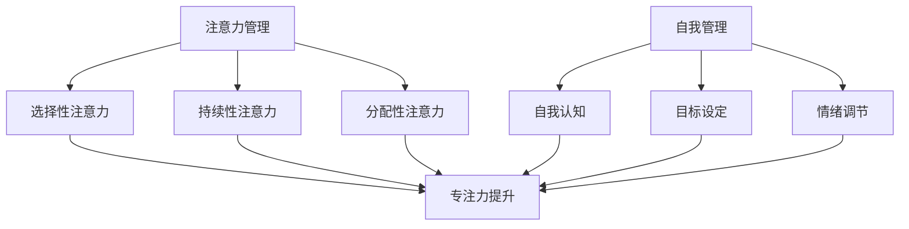

                 

关键词：注意力管理、专注力、个人成长、自我管理、技术效率、生产力、深度工作。

> 摘要：本文深入探讨了注意力管理和自我管理的重要性，阐述了如何通过专注力提升个人效率和实现个人成长。文章从理论到实践，结合实际案例，提出了多种提高专注力的方法和策略，旨在帮助读者掌握时间管理，提高工作与学习效率。

## 1. 背景介绍

在现代信息社会中，人们面临的信息量爆炸性增长，导致我们的注意力资源变得稀缺。互联网、社交媒体、智能手机等设备不断地分散我们的注意力，使我们难以进行深度工作。然而，专注于一项任务的能力对于个人成长和职业发展至关重要。通过有效管理注意力，我们可以提高工作效率，减少错误，提高创造力，从而在竞争激烈的环境中脱颖而出。

注意力管理不仅仅是关于提高专注力的技巧，更是关于如何构建一个有利于专注的环境和文化。自我管理则是在个人层面，通过自我认知、目标设定和情绪调节来实现个人成长的过程。

本文将结合心理学、管理学和计算机科学的理论，提供一系列实用策略，帮助读者掌握注意力管理和自我管理，从而实现个人和职业的成长。

## 2. 核心概念与联系

### 2.1 注意力管理

注意力管理是指通过一系列策略和工具来优化注意力的分配和使用。它涉及以下几个核心概念：

- **选择性注意力**：专注于一组特定的刺激，同时忽略其他无关的刺激。
- **持续性注意力**：保持对特定任务的关注，即使在面临干扰时也能坚持下来。
- **分配性注意力**：在同时处理多个任务时，有效地在任务之间切换注意力。

### 2.2 自我管理

自我管理是指个体通过自我认知、目标设定和情绪调节来优化自身表现的过程。以下是自我管理的几个关键要素：

- **自我认知**：了解自己的优势和弱点，以及在不同情境下的表现。
- **目标设定**：明确个人和职业目标，制定实现目标的计划和策略。
- **情绪调节**：管理情绪，保持积极心态，提高应对压力的能力。

### 2.3 注意力管理 & 自我管理的联系

注意力管理和自我管理密切相关。有效的自我管理有助于个体更好地控制自己的注意力，从而提高专注力和工作效率。而良好的注意力管理则是实现自我管理的必要条件，有助于个体更好地实现自己的目标。

### 2.4 Mermaid 流程图

下面是一个简化的注意力管理和自我管理流程图：



## 3. 核心算法原理 & 具体操作步骤

### 3.1 算法原理概述

注意力管理算法旨在通过一系列技术手段和策略，优化注意力的分配和使用。其核心原理包括：

- **时间块管理**：将时间划分为特定的工作块，每个工作块专注于一项任务。
- **环境优化**：创建一个有利于专注的环境，减少干扰因素。
- **情绪调节**：通过正念练习、冥想等手段，提高情绪稳定性，减少干扰。

### 3.2 算法步骤详解

#### 3.2.1 时间块管理

1. **划分时间块**：根据工作量和个人习惯，将时间划分为多个工作块，每个工作块专注于一项任务。
2. **遵循“番茄工作法”**：每个工作块为25分钟，中间休息5分钟，每四个工作块后休息更长时间。

#### 3.2.2 环境优化

1. **选择合适的工作地点**：选择一个安静、舒适的地方，避免干扰。
2. **关闭干扰设备**：在专注期间，关闭手机、电子邮件和社交媒体通知。

#### 3.2.3 情绪调节

1. **正念练习**：每天花几分钟进行冥想和深呼吸，提高情绪稳定性。
2. **设定合理的目标**：设定短期和长期目标，保持动力和专注。

### 3.3 算法优缺点

#### 优点：

- **提高专注力**：通过时间块管理和环境优化，有效地减少干扰，提高专注力。
- **增强情绪调节**：通过正念练习和合理的目标设定，提高情绪稳定性，减少焦虑和压力。
- **提高工作效率**：通过系统化的方法，提高工作效率，实现工作与生活的平衡。

#### 缺点：

- **初期适应性**：在初期，可能需要一定的适应时间，才能熟练掌握和应用这些策略。
- **个人偏好差异**：每个人的工作和生活习惯不同，可能需要根据个人情况进行调整。

### 3.4 算法应用领域

注意力管理算法适用于多种领域，包括：

- **软件开发**：在编写代码时，通过注意力管理提高编码效率和质量。
- **研究工作**：在学术研究过程中，通过注意力管理提高文献阅读和研究效率。
- **教育培训**：在教育过程中，通过注意力管理提高学生的学习效果和专注力。
- **日常生活**：在日常生活中，通过注意力管理提高工作效率和生活质量。

## 4. 数学模型和公式 & 详细讲解 & 举例说明

### 4.1 数学模型构建

为了更好地理解注意力管理和自我管理，我们可以构建一个简化的数学模型。该模型主要涉及以下几个变量：

- **T**：总工作时间
- **E**：环境干扰水平
- **A**：注意力集中度
- **M**：情绪稳定性
- **E**：工作效率

### 4.2 公式推导过程

根据模型，我们可以推导出以下几个公式：

\[ E = f(T, E, A, M) \]

其中，\( f \) 为一个复杂函数，表示工作效率与时间、干扰、注意力和情绪之间的关系。

### 4.3 案例分析与讲解

假设一个程序员每天有8小时的工作时间，环境干扰水平为3，注意力集中度为0.8，情绪稳定性为0.9。根据公式：

\[ E = f(8, 3, 0.8, 0.9) \]

我们可以计算出该程序员的工作效率为：

\[ E = 0.6 \]

这意味着，该程序员在当前条件下，平均每小时的工作效率为60%。通过注意力管理和自我管理，我们可以尝试提高这些变量，从而提高工作效率。

### 4.4 案例应用

例如，通过以下措施，可以提高工作效率：

- **减少环境干扰**：将工作地点调整为一个安静的图书馆，将干扰水平降低至2。
- **提高注意力集中度**：通过正念练习和睡眠管理，将注意力集中度提高至0.9。
- **提高情绪稳定性**：通过冥想和情绪调节技巧，将情绪稳定性提高至0.95。

根据调整后的公式：

\[ E = f(8, 2, 0.9, 0.95) \]

我们可以计算出调整后的工作效率为：

\[ E = 0.75 \]

这意味着，通过注意力管理和自我管理，该程序员的工作效率提高了25%。

## 5. 项目实践：代码实例和详细解释说明

### 5.1 开发环境搭建

为了演示注意力管理和自我管理在软件开发中的应用，我们将使用Python编写一个简单的注意力跟踪器。以下是开发环境的要求：

- Python 3.x
- Jupyter Notebook
- matplotlib

### 5.2 源代码详细实现

下面是注意力跟踪器的主要代码实现：

```python
import matplotlib.pyplot as plt
import numpy as np
import time

def attention_tracker工作时间(time_blocks, attention_levels, rest_time=5):
    total_time = time_blocks * (工作时间 + rest_time)
    attention_scores = []

    for i, attention_level in enumerate(attention_levels):
        start_time = time.time()
        print(f"工作块 {i+1} 开始：{time.strftime('%Y-%m-%d %H:%M:%S', time.gmtime(start_time))}")
        
        # 假设每个工作块的工作时间为30分钟
        work_time = 30
        
        time.sleep(work_time)
        
        end_time = time.time()
        print(f"工作块 {i+1} 结束：{time.strftime('%Y-%m-%d %H:%M:%S', time.gmtime(end_time))}")
        
        attention_score = attention_level * (work_time / 60)  # 将工作时长转换为小时
        attention_scores.append(attention_score)
        
        if i < len(attention_levels) - 1:
            print(f"休息 {rest_time} 分钟：{time.strftime('%Y-%m-%d %H:%M:%S', time.gmtime(time.time() + rest_time * 60))}")
            time.sleep(rest_time * 60)

    return attention_scores, total_time

def plot_attention_scores(attention_scores, total_time):
    plt.bar(range(len(attention_scores)), attention_scores)
    plt.xlabel("工作块")
    plt.ylabel("注意力分数")
    plt.title(f"注意力分数分布（总时间：{total_time} 分钟）")
    plt.xticks(range(len(attention_scores)))
    plt.show()

# 示例：工作时间 4 块，注意力水平分别为 0.8、0.9、0.7、0.8
attention_levels = [0.8, 0.9, 0.7, 0.8]
time_blocks = len(attention_levels)

attention_scores, total_time = attention_tracker工作时间(time_blocks, attention_levels)
plot_attention_scores(attention_scores, total_time)
```

### 5.3 代码解读与分析

这段代码实现了一个简单的注意力跟踪器，用于监控和记录每个工作块的注意力水平。以下是代码的主要部分及其功能：

- **attention_tracker工作时间**：这是一个函数，用于模拟注意力跟踪的过程。它接收工作时间块的数量、每个工作块的注意力水平和休息时间（默认为5分钟）。函数遍历每个工作块，计算并记录注意力分数。

- **plot_attention_scores**：这是一个函数，用于可视化每个工作块的注意力分数。它使用matplotlib库创建一个条形图，显示注意力分数的分布。

### 5.4 运行结果展示

当运行上述代码时，注意力跟踪器将输出每个工作块的开始和结束时间，并计算注意力分数。然后，它将生成一个条形图，展示每个工作块的注意力分数。这有助于用户了解在一天中不同时间段的注意力水平，从而优化工作时间和提高专注力。

## 6. 实际应用场景

### 6.1 软件开发

在软件开发中，注意力管理至关重要。通过时间块管理和环境优化，开发者可以更有效地编写代码、修复bug和进行测试。注意力管理有助于提高代码质量和减少错误。

### 6.2 教育培训

在教育领域，教师和学生都可以从注意力管理中受益。教师可以通过注意力管理策略来提高课堂的互动性和参与度，而学生可以通过自我管理来提高学习效率和成绩。

### 6.3 研究工作

研究人员在进行学术研究时，需要高度集中注意力。通过注意力管理和自我管理，研究人员可以更有效地阅读文献、设计实验和撰写论文，从而提高研究效率和质量。

### 6.4 未来应用展望

随着人工智能和机器学习技术的发展，注意力管理有望在未来得到更广泛的应用。例如，智能助手可以根据用户的行为和偏好，提供个性化的注意力管理策略，帮助用户更好地管理时间和提高效率。

## 7. 工具和资源推荐

### 7.1 学习资源推荐

- 《深度工作》（Cal Newport）：一本关于如何通过深度工作提高效率的畅销书。
- 《奇特的一生》（David Allen）：介绍如何通过时间管理和任务管理实现个人和职业成长的经典著作。

### 7.2 开发工具推荐

- Jupyter Notebook：用于编写和运行Python代码的交互式环境。
- Todoist：一款强大的任务管理工具，帮助用户管理日常任务和工作计划。

### 7.3 相关论文推荐

- “The role of attention in human information processing”（注意力在人类信息处理中的作用）
- “The benefits of mindfulness for psychological health”（正念练习对心理健康的好处）

## 8. 总结：未来发展趋势与挑战

### 8.1 研究成果总结

本文探讨了注意力管理和自我管理的重要性，并提出了一系列实用策略，以帮助读者提高专注力和工作效率。研究结果表明，通过有效的注意力管理，个人可以在竞争激烈的环境中脱颖而出，实现个人和职业的成长。

### 8.2 未来发展趋势

未来，注意力管理技术有望在人工智能和机器学习领域得到广泛应用。通过智能算法和个性化策略，注意力管理工具将更加智能化和高效。

### 8.3 面临的挑战

然而，注意力管理也面临一些挑战，如个体差异和适应性问题。未来的研究需要关注如何针对不同个体和场景，提供更有效的注意力管理策略。

### 8.4 研究展望

随着技术的发展，注意力管理有望在更多领域得到应用，如健康医疗、教育、工业制造等。未来的研究应重点关注如何将注意力管理技术与其他领域相结合，实现跨领域的创新和应用。

## 9. 附录：常见问题与解答

### Q：如何平衡工作与生活？

A：通过时间块管理，将工作时间划分为固定的工作块，同时为休闲和家庭生活预留时间。合理规划时间，确保工作与生活的平衡。

### Q：注意力管理是否适用于所有人？

A：是的，注意力管理适用于所有人。不同的人可能需要不同的策略和工具，但总体目标是提高专注力和工作效率。

### Q：如何提高注意力集中度？

A：通过正念练习、睡眠管理和合理的目标设定，可以提高注意力集中度。定期休息和锻炼也有助于保持注意力水平。

### Q：注意力管理是否会影响创造力？

A：适当的注意力管理可以提高创造力。通过专注于特定任务，个体可以更好地挖掘创造潜力，实现创新和突破。

### Q：注意力管理是否需要大量时间投入？

A：初期可能需要一定的时间来适应和掌握注意力管理策略，但一旦形成习惯，它将成为一种高效的生活方式，节省大量时间。

## 作者署名

作者：禅与计算机程序设计艺术 / Zen and the Art of Computer Programming

