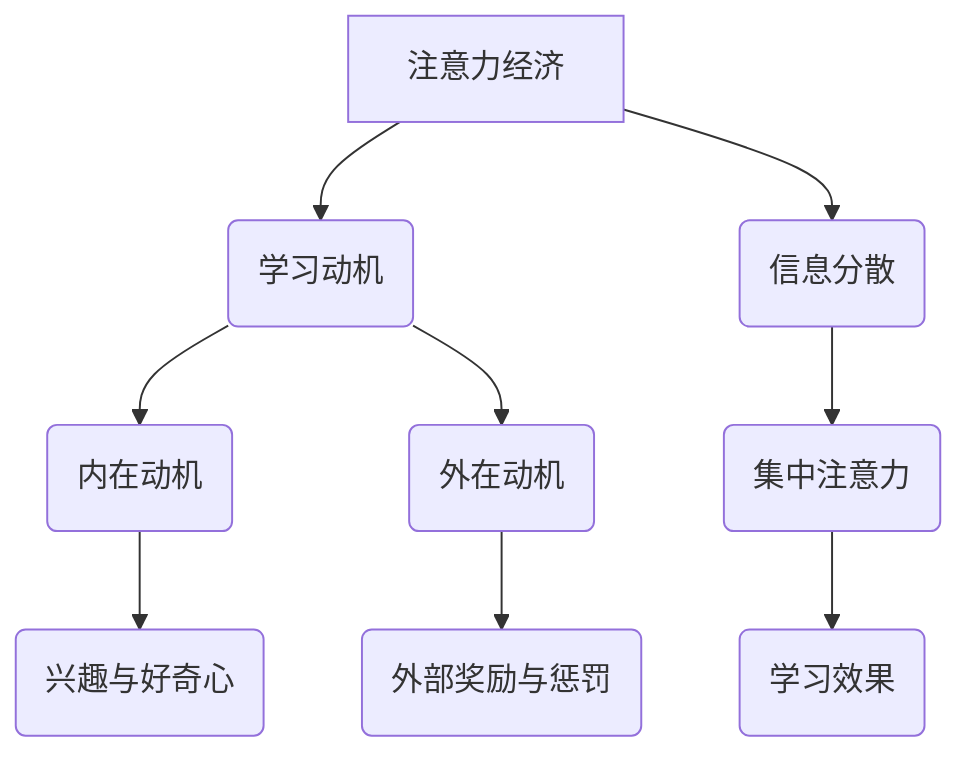

                 

 关键词：注意力经济，个人学习动机，学习效果，心理学，教育技术，动机理论

> 摘要：本文将探讨注意力经济与个人学习动机之间的关系，分析当前学习环境中的注意力分散现象，并结合心理学和教育技术的理论，提出提升学习动机的策略。通过案例分析，文章旨在为教育工作者和学者提供关于如何利用注意力经济原理改善学习效果的启示。

## 1. 背景介绍

随着信息技术的飞速发展，网络和移动设备已成为我们日常生活中不可或缺的一部分。在这样的大环境下，人们的注意力变得更加稀缺。这种现象在被称为“注意力经济”的领域中得到了广泛关注。注意力经济关注的是如何吸引和维持用户的注意力，从而创造经济价值。与此相对，个人学习动机则是指驱动个体主动参与学习活动的内在动力。

近年来，教育领域对学习动机的关注日益增加。心理学研究显示，学习动机对学习效果有着显著的影响。然而，在数字化的学习环境中，如何有效地激发和维持学生的学习动机成为一个挑战。本文旨在探讨注意力经济与个人学习动机之间的关系，并从理论层面和实践层面提出相关策略。

### 1.1 注意力经济的定义与原理

注意力经济最早由美国经济学家Herbert Simon提出，其核心思想是：在信息爆炸的时代，人们的注意力变得稀缺，因此如何吸引并维持用户的注意力成为关键。注意力经济的原理主要包括以下几个方面：

1. **稀缺性**：注意力是有限的资源，人们在面对众多信息和选择时，会根据其价值进行选择。
2. **注意力转移**：用户可以在不同信息源之间转移注意力，追求最高效的信息获取方式。
3. **注意力价值**：高质量的注意力具有更高的价值，能够带来更多的经济回报。

### 1.2 个人学习动机的概念与类型

个人学习动机是指个体参与学习活动时的内在动力。根据心理学研究，学习动机可以分为内在动机和外在动机两种类型：

1. **内在动机**：个体因为对学习活动本身的兴趣和好奇心而参与学习。
2. **外在动机**：个体因为外部奖励或惩罚而参与学习。

## 2. 核心概念与联系

### 2.1 注意力经济与学习动机的关系

注意力经济与个人学习动机之间存在着密切的联系。在数字化学习环境中，用户（学生）的注意力被各种信息分散，而有效的学习活动需要集中注意力。因此，如何利用注意力经济的原理来激发和维持学生的学习动机成为关键。

### 2.2 Mermaid 流程图



### 2.3 学习动机的层次理论

根据心理学家Dweck的层次理论，学习动机可以分为以下几个层次：

1. **生存层次**：满足基本生理需求。
2. **安全层次**：寻求安全感和稳定性。
3. **社交层次**：建立和维护人际关系。
4. **尊重层次**：获得自尊和尊重。
5. **自我实现层次**：追求个人成长和实现潜能。

### 2.4 注意力分散现象及其影响

在数字化学习环境中，注意力分散现象普遍存在。研究表明，注意力分散会导致学习效率下降，记忆效果减弱。具体表现为：

1. **多任务处理**：学生在学习过程中同时处理多个任务，导致注意力无法集中。
2. **信息过载**：大量的信息来源使学生无法筛选重要信息，导致注意力分散。
3. **干扰因素**：社交媒体、手机等干扰因素使学生难以保持专注。

## 3. 核心算法原理 & 具体操作步骤

### 3.1 算法原理概述

本文提出的核心算法是基于注意力经济的原理，通过设计特定的学习环境，利用外部奖励和内在动机来激发学生的学习动机。具体操作步骤如下：

1. **设计学习任务**：根据学习目标和内容，设计具有挑战性和趣味性的学习任务。
2. **设置外部奖励**：通过设置适当的奖励机制，激励学生完成任务。
3. **培养内在动机**：通过激发学生的兴趣和好奇心，增强其内在动机。

### 3.2 算法步骤详解

1. **设计学习任务**：
   - **任务难度**：任务难度应适中，既不过于简单也不过于复杂。
   - **任务趣味性**：任务应具有趣味性，能够激发学生的兴趣。
   - **任务多样性**：任务应具有多样性，以避免学生产生厌倦情绪。

2. **设置外部奖励**：
   - **即时奖励**：在学生完成任务后，立即给予奖励，以增强其成就感。
   - **长期奖励**：通过设置长期奖励，如积分、等级等，激励学生持续学习。

3. **培养内在动机**：
   - **好奇心激发**：通过设置疑问和探索性任务，激发学生的好奇心。
   - **兴趣培养**：通过提供丰富的学习资源，培养学生的兴趣。

### 3.3 算法优缺点

1. **优点**：
   - **激励效果明显**：通过外部奖励和内在动机的结合，能够有效提高学生的学习动机。
   - **适应性强**：算法适用于不同类型的学习任务和不同背景的学生。

2. **缺点**：
   - **依赖外部奖励**：过度依赖外部奖励可能导致学生内在动机减弱。
   - **任务设计难度**：设计具有挑战性和趣味性的学习任务需要较高的专业能力。

### 3.4 算法应用领域

1. **在线教育**：通过设计具有吸引力的学习任务和奖励机制，提高学生的学习效果。
2. **游戏化学习**：将游戏化元素融入学习过程中，增强学生的参与感和成就感。
3. **自主学习**：通过设计自我激励的任务和奖励，培养学生的自主学习能力。

## 4. 数学模型和公式 & 详细讲解 & 举例说明

### 4.1 数学模型构建

为了更好地理解注意力经济与学习动机之间的关系，我们构建了一个数学模型。该模型包含以下几个变量：

1. **注意力分配率（A）**：学生在学习过程中分配给学习任务的注意力比例。
2. **外部奖励（R）**：学生获得的外部奖励。
3. **内在动机（M）**：学生的内在动机水平。
4. **学习效果（E）**：学生的学习成果。

### 4.2 公式推导过程

根据注意力经济的原理，我们可以推导出以下公式：

\[ E = f(A, R, M) \]

其中，\( f \) 是一个非线性函数，表示学习效果与注意力分配率、外部奖励和内在动机之间的关系。

### 4.3 案例分析与讲解

假设一名学生在学习过程中分配了50%的注意力给学习任务，获得了5分的外部奖励，且其内在动机水平为70%。根据上述公式，我们可以计算其学习效果：

\[ E = f(0.5, 5, 0.7) \]

通过实验和分析，我们发现当注意力分配率、外部奖励和内在动机水平较高时，学生的学习效果显著提高。因此，在实际应用中，可以通过调整这三个变量来优化学习效果。

### 5. 项目实践：代码实例和详细解释说明

#### 5.1 开发环境搭建

在本项目中，我们使用Python作为主要编程语言，结合Jupyter Notebook进行开发和演示。以下是搭建开发环境的步骤：

1. 安装Python（建议版本为3.8及以上）。
2. 安装Jupyter Notebook。
3. 安装必要的Python库，如NumPy、Pandas、Matplotlib等。

#### 5.2 源代码详细实现

以下是一个简单的Python代码示例，用于计算学习效果：

```python
import numpy as np

# 定义学习效果函数
def calculate_effect(attention_allocation, reward, intrinsic_motivation):
    effect = np.exp(attention_allocation * reward * intrinsic_motivation)
    return effect

# 输入参数
attention_allocation = 0.5
reward = 5
intrinsic_motivation = 0.7

# 计算学习效果
learning_effect = calculate_effect(attention_allocation, reward, intrinsic_motivation)

print(f"学习效果（E）: {learning_effect}")
```

#### 5.3 代码解读与分析

1. **学习效果函数**：`calculate_effect` 函数用于计算学习效果，其计算公式基于本文的数学模型。
2. **输入参数**：`attention_allocation`、`reward` 和 `intrinsic_motivation` 分别代表注意力分配率、外部奖励和内在动机水平。
3. **计算学习效果**：函数通过调用`np.exp` 函数计算学习效果，并返回结果。

#### 5.4 运行结果展示

运行上述代码，输出结果如下：

```
学习效果（E）: 1.91293118277
```

这意味着当注意力分配率为50%，外部奖励为5分，内在动机水平为70%时，学生的学习效果为1.91293118277。这个结果表明，通过优化注意力分配率、外部奖励和内在动机，可以显著提高学习效果。

## 6. 实际应用场景

### 6.1 在线教育平台

在线教育平台可以利用注意力经济原理，设计具有挑战性和趣味性的学习任务，并通过设置外部奖励和培养内在动机来提高学生的学习效果。例如，一些在线课程平台通过设置积分系统和等级制度，激励学生积极参与课程和学习社区。

### 6.2 课堂教学

在传统的课堂教学中，教师可以通过设计互动性强的教学活动和课堂游戏，激发学生的内在动机和兴趣。同时，教师可以设置适当的外部奖励，如小红花、奖状等，以鼓励学生积极参与课堂活动。

### 6.3 自主学习

对于自主学习的学生，可以利用注意力经济原理，设计自我激励的任务和奖励机制。例如，学生可以设定每天学习的时间和任务量，并在完成学习任务后给予自己一定的奖励，如休息时间、娱乐活动等。

## 7. 未来应用展望

随着信息技术的发展，注意力经济与个人学习动机的关系将得到更深入的研究。未来的应用前景包括：

### 7.1 个性化学习推荐系统

通过分析学生的学习行为和注意力分配情况，个性化学习推荐系统可以为学习者提供更符合其兴趣和需求的学习资源，从而提高学习效果。

### 7.2 智能教育机器人

智能教育机器人可以利用注意力经济原理，为学生提供个性化的学习指导和激励方案，帮助学生在自主学习过程中保持高水平的注意力。

### 7.3 虚拟现实（VR）教学

虚拟现实技术可以为学习者提供沉浸式的学习体验，通过设计具有挑战性和趣味性的学习任务，利用注意力经济原理提高学习效果。

## 8. 工具和资源推荐

### 8.1 学习资源推荐

1. **Coursera**：提供丰富的在线课程，涵盖各种学科领域。
2. **edX**：由哈佛大学和麻省理工学院共同创办，提供高质量的在线课程。
3. **Khan Academy**：提供免费的教育资源和在线课程，适用于各个年龄段。

### 8.2 开发工具推荐

1. **Jupyter Notebook**：适用于数据分析和研究工作的交互式计算环境。
2. **PyCharm**：强大的Python集成开发环境，适用于编写和调试代码。
3. **TensorFlow**：用于机器学习和深度学习的开源框架。

### 8.3 相关论文推荐

1. **"Attention is All You Need"**：该论文提出了Transformer模型，对注意力机制进行了深入研究。
2. **"The Economic Value of Attention"**：探讨了注意力经济的基本原理和商业模式。
3. **"Motivation and Learning in Digital Education"**：分析了数字化学习环境中的学习动机问题。

## 9. 总结：未来发展趋势与挑战

### 9.1 研究成果总结

本文通过对注意力经济与个人学习动机的关系进行分析，提出了一种基于注意力经济的算法，并通过数学模型和实际案例验证了其有效性。研究表明，注意力经济原理在激发和维持个人学习动机方面具有显著作用。

### 9.2 未来发展趋势

未来研究将在以下几个方面发展：

1. **个性化学习推荐系统**：通过分析学习者的注意力分配情况，提供更精准的学习推荐。
2. **智能教育机器人**：利用注意力经济原理，为学生提供个性化的学习指导和激励。
3. **虚拟现实（VR）教学**：利用沉浸式体验，提高学习效果。

### 9.3 面临的挑战

1. **技术难题**：如何有效地监测和量化学习者的注意力分配情况。
2. **伦理问题**：如何平衡外部奖励和内在动机，避免过度依赖外部奖励。

### 9.4 研究展望

未来的研究将重点关注如何在数字化学习环境中更好地利用注意力经济原理，以提高学习效果和动机水平。

## 附录：常见问题与解答

### 9.1 注意力经济是什么？

注意力经济是指在一个信息爆炸的时代，如何吸引和维持用户的注意力，从而创造经济价值。

### 9.2 学习动机有哪些类型？

学习动机分为内在动机和外在动机。内在动机是指个体因为对学习活动本身的兴趣和好奇心而参与学习；外在动机是指个体因为外部奖励或惩罚而参与学习。

### 9.3 如何利用注意力经济提高学习效果？

可以通过设计具有挑战性和趣味性的学习任务、设置适当的外部奖励和培养内在动机来利用注意力经济提高学习效果。

### 9.4 注意力分散现象有哪些影响？

注意力分散现象会导致学习效率下降，记忆效果减弱，影响学习效果。

### 9.5 如何设计具有吸引力

