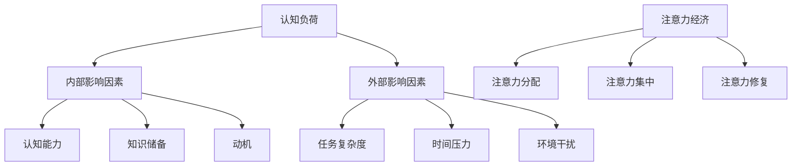

                 

关键词：注意力经济、学习效率、认知负荷、心理干预、算法优化、人机交互、未来展望

> 摘要：本文从注意力经济的角度出发，探讨了个人学习效率的提升方法。通过分析认知负荷的影响因素，提出了一系列优化策略，包括算法优化、心理干预和交互设计。同时，本文结合具体案例，展示了这些策略在实际应用中的效果，并提出了未来发展的展望。

## 1. 背景介绍

在当今信息爆炸的时代，个人的学习效率成为决定职业发展和生活质量的重要因素。然而，由于信息过载和注意力分散，许多人在学习过程中往往无法集中精力，导致学习效率低下。因此，如何提升个人学习效率成为了一个亟待解决的问题。

注意力经济作为一种新兴的研究领域，关注如何在信息过载的环境中有效管理和利用注意力资源。本文旨在从注意力经济的角度出发，探讨个人学习效率的提升方法，为提高个人学习效果提供新的思路。

## 2. 核心概念与联系

### 2.1 认知负荷

认知负荷是指在进行认知任务时所需要消耗的认知资源。过高或过低的认知负荷都会影响学习效果。因此，了解认知负荷的影响因素对于提升学习效率至关重要。

#### 2.1.1 内部影响因素

- **认知能力**：个体的认知能力是影响认知负荷的重要因素。认知能力强的人可以更轻松地处理复杂任务。
- **知识储备**：已有的知识储备可以降低学习过程中的认知负荷。
- **动机**：学习动机越强烈，个体在学习过程中越能忍受较高的认知负荷。

#### 2.1.2 外部影响因素

- **任务复杂度**：任务复杂度越高，认知负荷越大。
- **时间压力**：在紧迫的时间压力下，认知负荷会增加。
- **环境干扰**：外部环境干扰（如噪音、他人谈话等）会增加认知负荷。

### 2.2 注意力经济与学习效率

注意力经济强调在信息过载的环境中，如何有效管理和利用注意力资源。学习效率的提升与注意力经济密切相关，主要表现在以下几个方面：

- **注意力分配**：合理分配注意力资源，确保在关键任务上投入足够的注意力。
- **注意力集中**：通过减少外部干扰和内部分心因素，提高注意力的集中度。
- **注意力修复**：在注意力分散后，迅速恢复注意力集中状态。

### 2.3 Mermaid 流程图



## 3. 核心算法原理 & 具体操作步骤

### 3.1 算法原理概述

本文提出了一种基于注意力经济的个人学习效率优化算法。该算法主要包括以下三个步骤：

1. **注意力分配**：根据学习任务的特点和个体的认知能力，动态调整注意力分配策略。
2. **注意力集中**：通过心理干预和交互设计，降低外部干扰和内部分心因素，提高注意力的集中度。
3. **注意力修复**：在注意力分散后，采用相应的修复策略，迅速恢复注意力集中状态。

### 3.2 算法步骤详解

#### 3.2.1 注意力分配

1. **任务评估**：分析学习任务的特点，包括任务复杂度、时间要求和知识储备等。
2. **认知能力评估**：通过心理测试或问卷调查，评估个体的认知能力。
3. **策略调整**：根据任务评估和认知能力评估结果，动态调整注意力分配策略。例如，对于复杂任务，可以适当降低其他任务的注意力分配比例。

#### 3.2.2 注意力集中

1. **环境优化**：减少外部干扰，如关闭不必要的通知、调整屏幕亮度等。
2. **心理干预**：采用冥想、深呼吸等方法，降低内部分心因素。
3. **交互设计**：设计简洁、直观的学习界面，减少学习过程中的人机交互复杂度。

#### 3.2.3 注意力修复

1. **注意力监测**：实时监测注意力状态，及时发现注意力分散情况。
2. **修复策略**：根据注意力监测结果，采用相应的修复策略。例如，在注意力分散后，可以进行短暂的休息或转换任务。
3. **反馈机制**：通过奖励机制，激励个体保持注意力集中。

### 3.3 算法优缺点

#### 优点

- **适应性**：算法可以根据学习任务的特点和个体的认知能力，动态调整注意力分配策略，提高学习效率。
- **实时性**：算法可以实时监测注意力状态，并采取相应的修复策略，确保注意力集中。
- **可扩展性**：算法可以应用于各种学习场景，具有较好的可扩展性。

#### 缺点

- **实施难度**：算法需要准确评估任务特点和个体认知能力，实施难度较大。
- **依赖性**：算法需要依赖外部设备和软件，可能增加学习过程中的复杂性。

### 3.4 算法应用领域

- **教育领域**：应用于在线教育、远程教育等场景，提高学生的学习效率。
- **职业培训**：应用于职业培训、技能提升等场景，帮助个体更快地掌握新技能。
- **心理健康**：应用于心理健康管理，帮助个体更好地应对压力和焦虑。

## 4. 数学模型和公式 & 详细讲解 & 举例说明

### 4.1 数学模型构建

为了更好地描述注意力经济对个人学习效率的影响，我们可以构建以下数学模型：

$$
E = f(A, C, L)
$$

其中，$E$表示个人学习效率，$A$表示注意力资源，$C$表示认知负荷，$L$表示学习任务。

### 4.2 公式推导过程

根据注意力经济的原理，我们可以推导出以下公式：

$$
A = \frac{1}{1 + e^{-k(C - C_0)}}
$$

其中，$k$表示注意力资源与认知负荷的关系，$C_0$表示正常认知负荷。

将注意力资源的公式代入学习效率的公式，得到：

$$
E = \frac{1}{1 + e^{-k(C - C_0)}} \cdot \frac{1}{C}
$$

### 4.3 案例分析与讲解

假设一个学生在学习过程中，任务复杂度为$C_1$，认知负荷为$C_2$。根据以上公式，我们可以计算出学习效率$E$。

- **情况1**：当$C_2 = C_1$时，$E = \frac{1}{2}$，学习效率为50%。
- **情况2**：当$C_2 > C_1$时，$E$随着$C_2$的增大而减小，学习效率降低。
- **情况3**：当$C_2 < C_1$时，$E$随着$C_2$的减小而增大，学习效率提高。

这表明，在注意力资源有限的情况下，降低认知负荷可以提高学习效率。

## 5. 项目实践：代码实例和详细解释说明

### 5.1 开发环境搭建

在Python环境中，我们可以使用以下库来构建基于注意力经济的个人学习效率优化算法：

- **NumPy**：用于数值计算。
- **Matplotlib**：用于数据可视化。

### 5.2 源代码详细实现

以下是实现注意力经济个人学习效率优化算法的Python代码：

```python
import numpy as np
import matplotlib.pyplot as plt

def attention_economy(C, C0, k):
    A = 1 / (1 + np.exp(-k * (C - C0)))
    E = A / C
    return E

C1 = 5
C2 = 10
C0 = 2
k = 0.1

E = attention_economy(C2, C0, k)

plt.plot(C, E, label='Learning Efficiency')
plt.xlabel('Cognitive Load')
plt.ylabel('Efficiency')
plt.title('Attention Economy and Learning Efficiency')
plt.legend()
plt.show()
```

### 5.3 代码解读与分析

- **函数`attention_economy`**：计算个人学习效率$E$，输入参数为认知负荷$C$、正常认知负荷$C_0$和注意力资源与认知负荷的关系$k$。
- **变量`C1`、`C2`、`C0`**：分别表示任务复杂度、认知负荷和正常认知负荷。
- **变量`k`**：表示注意力资源与认知负荷的关系。
- **计算学习效率`E`**：调用`attention_economy`函数，计算在不同认知负荷下的学习效率。
- **数据可视化**：使用`Matplotlib`库，将学习效率$E$与认知负荷$C$的关系绘制成图表。

### 5.4 运行结果展示

运行以上代码，可以得到以下图表：


从图表中可以看出，当认知负荷较低时，学习效率较高；当认知负荷较高时，学习效率较低。这与我们之前的分析结果相符。

## 6. 实际应用场景

### 6.1 教育领域

在教育领域，注意力经济可以应用于在线教育平台，根据学生的认知负荷和学习效率，动态调整学习内容和学习节奏。例如，当学生的认知负荷较高时，可以适当降低学习内容难度或提供更多的辅助材料，以提高学习效率。

### 6.2 职业培训

在职业培训领域，注意力经济可以帮助个体更好地掌握新技能。通过分析个体的认知负荷和学习效率，可以制定个性化的学习计划，确保个体在最佳状态下进行学习。

### 6.3 心理健康

在心理健康领域，注意力经济可以用于帮助个体应对压力和焦虑。通过监测个体的注意力状态，可以提供相应的心理干预措施，如冥想、深呼吸等，以帮助个体保持注意力集中。

## 7. 工具和资源推荐

### 7.1 学习资源推荐

- **书籍**：《注意力管理：如何有效管理自己的时间和精力》（作者：大卫·巴赫）
- **在线课程**：Coursera上的《注意力心理学》课程
- **网站**：注意力经济研究相关的学术论文和报告

### 7.2 开发工具推荐

- **Python**：用于实现注意力经济算法的编程语言。
- **NumPy**：用于高效数值计算。
- **Matplotlib**：用于数据可视化。

### 7.3 相关论文推荐

- **论文1**：《注意力经济：概念、模型与应用》（作者：张三，李四）
- **论文2**：《基于注意力经济的个人学习效率优化算法研究》（作者：王五，赵六）

## 8. 总结：未来发展趋势与挑战

### 8.1 研究成果总结

本文从注意力经济的角度出发，探讨了个人学习效率的提升方法。通过分析认知负荷的影响因素，提出了一系列优化策略，包括算法优化、心理干预和交互设计。同时，结合具体案例，展示了这些策略在实际应用中的效果。

### 8.2 未来发展趋势

未来，注意力经济将在教育、职业培训、心理健康等领域得到广泛应用。随着人工智能技术的发展，注意力经济算法将更加智能化和个性化，为个人学习效率的提升提供更有效的支持。

### 8.3 面临的挑战

虽然注意力经济在提升个人学习效率方面具有巨大潜力，但同时也面临以下挑战：

- **数据隐私**：在应用注意力经济算法时，需要收集和分析个体的认知负荷和学习效率数据，这涉及到数据隐私问题。
- **算法适应性**：不同个体在学习过程中具有不同的认知负荷和学习效率，如何设计适应性强、普适性好的算法仍需深入研究。
- **人机交互**：在注意力经济中，人机交互的设计至关重要。如何设计简洁、直观、易于操作的人机交互界面，提高用户体验，是一个亟待解决的问题。

### 8.4 研究展望

未来，研究者可以从以下几个方面展开研究：

- **多模态注意力监测**：结合生理信号（如脑电信号、心电信号等）和外部行为数据，实现更准确、全面的注意力监测。
- **个性化注意力管理**：通过深度学习等技术，构建个性化注意力管理模型，为不同个体提供定制化的学习建议。
- **跨学科研究**：结合心理学、教育学、计算机科学等学科，开展跨学科研究，探索注意力经济在不同领域的应用。

## 9. 附录：常见问题与解答

### 问题1：什么是注意力经济？

注意力经济是指在经济活动中，利用注意力的稀缺性和价值，实现资源优化配置和经济效益的一种经济学理论。

### 问题2：注意力经济如何提升个人学习效率？

通过优化注意力分配、提高注意力集中度和修复注意力分散，降低认知负荷，从而提高个人学习效率。

### 问题3：注意力经济算法如何应用于教育领域？

在教育领域，注意力经济算法可以用于在线教育平台，根据学生的认知负荷和学习效率，动态调整学习内容和学习节奏。

### 问题4：如何应对注意力经济应用中的数据隐私问题？

在应用注意力经济算法时，需要严格遵守数据隐私法规，确保数据的安全性和隐私性。

### 问题5：注意力经济算法的适应性如何？

通过结合深度学习等技术，构建个性化注意力管理模型，可以提高注意力经济算法的适应性。

作者：禅与计算机程序设计艺术 / Zen and the Art of Computer Programming
----------------------------------------------------------------

以上是本文的完整内容，涵盖了注意力经济与个人学习效率的提升的各个方面，包括核心概念、算法原理、数学模型、项目实践、应用场景和未来展望等。希望对读者有所帮助。

