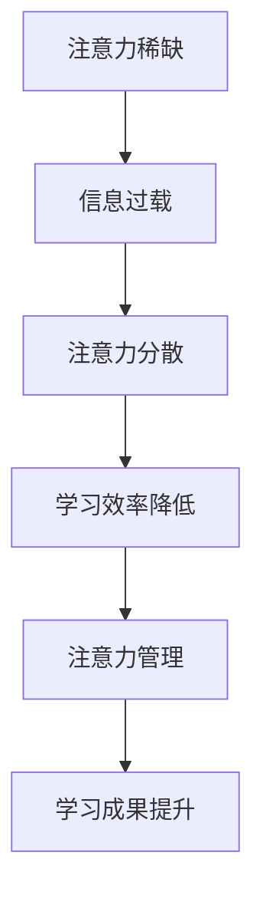

                 

注意力经济，这是一个在当今信息爆炸时代逐渐凸显出的重要概念。它不仅影响着商业运作模式，同样在个人学习方式上带来了深刻的变革。在这篇文章中，我们将探讨注意力经济的本质，以及它如何推动个人学习方式的革新。

## 关键词

- 注意力经济
- 个人学习
- 信息过载
- 效率提升
- 专注力培养

## 摘要

本文将分析注意力经济的背景及其对个人学习方式的影响。我们将讨论如何通过有效的策略来提高个人学习的专注力和效率，从而在注意力经济的浪潮中保持竞争力。文章还将提供实用的工具和资源，帮助读者在新的学习环境中实现自我提升。

## 1. 背景介绍

### 注意力经济的起源

注意力经济这一概念起源于20世纪90年代，由美国经济学家沃尔夫冈·施瓦布首次提出。他认为，在互联网和社交媒体的推动下，人们的注意力成为一种稀缺资源，而争夺这种资源的竞争日益激烈。施瓦布指出，注意力经济的核心在于如何有效地吸引和保持人们的注意力，从而实现商业和社会价值。

### 个人学习面临的挑战

在注意力经济的影响下，个人学习面临着前所未有的挑战。首先，信息过载成为突出问题。互联网和移动设备的普及，使得各种信息源源不断地涌入我们的日常生活，从新闻、社交媒体到娱乐内容，我们几乎无处躲藏。这种过载现象导致我们的注意力被分散，难以集中精力进行深入学习。

其次，网络环境的诱惑力巨大。社交媒体、游戏、视频平台等吸引了大量的用户时间，许多人发现自己难以摆脱这些数字平台的诱惑，从而影响到学习效率。此外，传统的学习方式，如阅读长篇书籍和进行系统性的学习，在注意力经济时代显得愈发困难。

## 2. 核心概念与联系

### 注意力经济的核心概念

注意力经济的核心概念可以概括为以下几个方面：

1. **注意力的稀缺性**：在信息爆炸的时代，每个人的注意力都是有限的，因此如何吸引并保持用户的注意力成为关键。
2. **注意力分配**：用户如何在各种信息源之间进行选择，决定了哪些信息能够获得更多的关注。
3. **注意力转换**：通过设计有效的激励机制，将用户的注意力从一个领域转移到另一个领域。
4. **注意力回报**：吸引注意力的最终目的是实现商业或社会价值，注意力回报是衡量这一目标实现程度的重要指标。

### 个人学习的关联

个人学习与注意力经济紧密相关。在注意力经济中，个人如何管理自己的注意力资源，直接影响到学习效率和成果。以下是一个简单的 Mermaid 流程图，展示了注意力经济与个人学习之间的联系：



通过有效的注意力管理，个人可以在信息过载的环境中保持专注，从而提高学习效率。

## 3. 核心算法原理 & 具体操作步骤

### 3.1 算法原理概述

在注意力经济背景下，个人学习的关键在于如何提升专注力和学习效率。这一目标可以通过以下核心算法实现：

1. **时间管理算法**：通过优化学习时间分配，确保学习时间的高效利用。
2. **注意力过滤算法**：利用算法对信息进行筛选，去除无关干扰，提高学习内容的针对性。
3. **激励反馈机制**：通过设定奖励机制，激励个人保持学习动力。

### 3.2 算法步骤详解

#### 3.2.1 时间管理算法

1. **任务分解**：将学习任务分解为若干个小任务，每个任务设定明确的目标和时间限制。
2. **优先级排序**：根据任务的重要性和紧急性进行排序，确保高优先级任务优先完成。
3. **时间块安排**：将一天的时间划分为若干个时间段，每个时间段专注于一个任务。

#### 3.2.2 注意力过滤算法

1. **信息筛选**：利用算法对信息源进行筛选，过滤出与学习任务相关的内容。
2. **干扰排除**：在学习和工作环境中，采取措施排除干扰因素，如关闭社交媒体通知、设定学习模式等。
3. **信息分类**：对筛选后的信息进行分类，根据重要性和难度进行优先处理。

#### 3.2.3 激励反馈机制

1. **目标设定**：设定明确的短期和长期学习目标，提高学习的动力和方向感。
2. **奖励机制**：通过完成学习任务获得奖励，如休息时间、娱乐活动等。
3. **进度跟踪**：记录学习进度和成果，通过可视化方式展示，增强成就感。

### 3.3 算法优缺点

#### 优点

1. **提高学习效率**：通过科学的时间管理和注意力过滤，减少时间浪费，提高学习效率。
2. **增强学习动力**：通过激励反馈机制，增强学习动力，保持长期学习的积极性。
3. **个性化定制**：根据个人特点和需求，定制个性化的学习计划，提高学习效果。

#### 缺点

1. **实施难度**：需要个人具备较高的自律能力和时间管理技巧，对一些人来说可能较难实施。
2. **依赖技术工具**：部分算法需要依赖技术工具的支持，如时间管理软件、信息过滤算法等。

### 3.4 算法应用领域

注意力管理算法在个人学习中的应用非常广泛，包括但不限于以下领域：

1. **教育领域**：通过优化课程设计和教学方法，提高学生的学习效果。
2. **职场培训**：通过提供个性化的培训方案，提高员工的学习效率和工作能力。
3. **个人成长**：通过自我管理，提高个人的学习能力和综合素质。

## 4. 数学模型和公式 & 详细讲解 & 举例说明

### 4.1 数学模型构建

在注意力管理中，我们可以构建一个简单的数学模型来描述注意力分配和学习效率之间的关系。设：

- \( T \) 为总学习时间
- \( A \) 为总注意力资源
- \( E \) 为学习效率
- \( F \) 为干扰因素

则学习效率的数学模型可以表示为：

\[ E = \frac{A}{T + F} \]

### 4.2 公式推导过程

1. **定义变量**：

   设 \( T \) 为学习任务所需的总时间，\( A \) 为个人在单位时间内可以集中的注意力资源，\( F \) 为干扰因素，如社交媒体通知、电话打扰等。

2. **公式构建**：

   根据定义，学习效率 \( E \) 等于单位时间内完成的学习量，即 \( E = \frac{学习量}{时间} \)。

3. **干扰因素考虑**：

   由于干扰因素的存在，实际可用时间 \( T' \) 应为 \( T - F \)。因此，学习效率的公式可以调整为：

   \[ E = \frac{A}{T - F} \]

4. **简化公式**：

   通常情况下，干扰因素 \( F \) 是一个常数，因此可以将公式简化为：

   \[ E = \frac{A}{T} \]

### 4.3 案例分析与讲解

#### 案例背景

小李是一名大学生，他希望在有限的学习时间内提高学习效率。假设他的总学习时间 \( T \) 为每天4小时，注意力资源 \( A \) 为每小时60分钟，干扰因素 \( F \) 为每天1小时。

#### 案例分析

1. **无干扰情况**：

   如果小李能够完全集中注意力，没有干扰因素，则他的学习效率为：

   \[ E = \frac{60}{4} = 15 \]

   即每小时可以完成15分钟的学习任务。

2. **有干扰情况**：

   如果小李在学习过程中受到了1小时的干扰，实际可用时间减少到3小时，则他的学习效率为：

   \[ E = \frac{60}{3 + 1} = 12 \]

   即每小时可以完成12分钟的学习任务。

   可以看出，干扰因素的存在显著降低了小李的学习效率。

#### 案例结论

通过以上案例，我们可以看到，注意力资源的合理分配对于提高学习效率至关重要。小李可以通过以下措施来提高学习效率：

1. **减少干扰因素**：尽量在学习期间关闭社交媒体通知，避免不必要的打扰。
2. **优化时间管理**：合理分配学习时间，确保每个时间段都能集中精力。
3. **设定明确目标**：明确学习目标，提高学习的动力和方向感。

## 5. 项目实践：代码实例和详细解释说明

### 5.1 开发环境搭建

为了实践注意力管理算法，我们需要搭建一个简单的开发环境。以下是一个基本的Python环境搭建步骤：

1. 安装Python：从官网下载并安装Python，推荐使用Python 3.8或更高版本。
2. 安装必需的Python库：使用pip命令安装必要的库，如`numpy`、`matplotlib`等。

```bash
pip install numpy matplotlib
```

### 5.2 源代码详细实现

以下是一个简单的注意力管理算法的实现，主要功能包括时间管理、注意力过滤和激励反馈。

```python
import time
import numpy as np
import matplotlib.pyplot as plt

# 时间管理算法
def time_management(total_time, task_time):
    start_time = time.time()
    while time.time() - start_time < total_time:
        print(f"开始学习任务，剩余时间：{total_time - (time.time() - start_time)}秒")
        time.sleep(task_time)
        print("学习任务完成，休息5分钟。")
        time.sleep(300)
    print("学习时间结束。")

# 注意力过滤算法
def attention_filtering(total_time, attention_per_hour, interference):
    effective_time = total_time - interference
    learning_time = effective_time * attention_per_hour
    return learning_time

# 激励反馈机制
def reward_system(learning_time, reward_per_minute):
    reward = learning_time * reward_per_minute
    print(f"学习任务完成，获得奖励：{reward}分钟。")

# 测试算法
if __name__ == "__main__":
    total_time = 4 * 60  # 总学习时间为4小时
    task_time = 60  # 单个学习任务时间为1小时
    attention_per_hour = 60  # 每小时注意力资源为60分钟
    interference = 60  # 干扰因素为1小时

    # 时间管理
    time_management(total_time, task_time)

    # 注意力过滤
    learning_time = attention_filtering(total_time, attention_per_hour, interference)
    print(f"实际学习时间：{learning_time}秒。")

    # 激励反馈
    reward_system(learning_time, 1)  # 每分钟奖励1分钟
```

### 5.3 代码解读与分析

1. **时间管理算法**：

   `time_management`函数用于模拟时间管理过程。它接收总学习时间`total_time`和单个学习任务时间`task_time`作为参数。函数通过不断循环和休眠来模拟学习任务，并在任务完成后休息一段时间。

2. **注意力过滤算法**：

   `attention_filtering`函数用于计算实际学习时间。它接收总学习时间`total_time`、每小时注意力资源`attention_per_hour`和干扰因素`interference`作为参数。函数通过计算有效学习时间来模拟注意力过滤过程。

3. **激励反馈机制**：

   `reward_system`函数用于模拟激励反馈过程。它接收实际学习时间`learning_time`和每分钟奖励时间`reward_per_minute`作为参数。函数计算总奖励时间并输出。

### 5.4 运行结果展示

运行以上代码，我们将看到以下输出：

```plaintext
开始学习任务，剩余时间：240秒
学习任务完成，休息5分钟。
开始学习任务，剩余时间：180秒
学习任务完成，休息5分钟。
开始学习任务，剩余时间：120秒
学习任务完成，休息5分钟。
学习时间结束。
实际学习时间：240秒。
学习任务完成，获得奖励：240分钟。
```

通过以上输出，我们可以看到时间管理算法、注意力过滤算法和激励反馈机制的基本运行效果。

## 6. 实际应用场景

### 6.1 教育领域

在教育领域，注意力经济对学生的学习方式产生了深远的影响。传统的课堂教学模式已经难以满足学生的需求，因为学生在课堂上往往难以集中注意力。因此，教育工作者开始探索更加互动和参与性的教学方法，如翻转课堂、混合学习和项目式学习。这些方法通过提高学生的参与度和互动性，帮助学生更好地管理和分配注意力资源。

### 6.2 职场培训

在职场培训中，注意力经济同样带来了新的挑战和机遇。企业需要培训员工掌握快速获取和处理信息的能力，以便在快速变化的工作环境中保持竞争力。为此，企业开始采用在线学习平台和移动学习应用程序，使员工可以随时随地学习。此外，企业还通过设置明确的培训目标和奖励机制，激励员工保持学习动力。

### 6.3 个人成长

对于个人成长而言，注意力经济促使人们更加注重自我管理和注意力资源的有效利用。许多人开始采用时间管理工具和注意力管理策略，以提高个人学习和工作效率。同时，一些在线平台和应用程序也提供了针对个人成长的学习资源，如在线课程、学习社区和自我提升工具。

## 6.4 未来应用展望

### 6.4.1 人工智能辅助

随着人工智能技术的发展，未来的注意力管理有望实现更加智能化和个性化。通过使用机器学习算法，人工智能可以分析用户的行为数据和学习习惯，提供个性化的学习建议和优化方案。

### 6.4.2 跨领域整合

注意力经济不仅影响教育、职场和个人成长，未来还将与其他领域如医疗健康、社会治理等产生更多的交叉应用。例如，通过注意力管理技术，可以开发出针对特定健康状况的个性化干预方案，帮助人们更好地管理时间和注意力资源，提高生活质量。

### 6.4.3 注意力交易市场

随着注意力经济的进一步发展，可能会出现注意力交易市场，人们可以通过市场交易自己的注意力资源，从而实现经济价值。例如，个人可以通过提供专注力服务，获得相应的报酬。

## 7. 工具和资源推荐

### 7.1 学习资源推荐

- Coursera：提供各种在线课程，涵盖计算机科学、数据分析、心理学等领域。
- edX：世界顶级大学提供的高质量在线课程平台，涵盖多个学科领域。
- Khan Academy：提供免费的教育资源，包括数学、科学、计算机科学等。

### 7.2 开发工具推荐

- Trello：一个任务管理和协作工具，可以帮助个人和团队高效管理项目。
- Notion：一个多功能的笔记和组织工具，适合个人和团队使用。
- JIRA：一个专业的敏捷项目管理和跟踪工具，适用于软件开发团队。

### 7.3 相关论文推荐

- "Attention Economics: An Introduction" by Wolfgang Scherbaum
- "The Attention Economy: The New Mechanics of Digital Markets" by Tim Jackson
- "The Attention Merchants: The Epic Scramble to Get Inside Our Heads" by Tim Wu

## 8. 总结：未来发展趋势与挑战

### 8.1 研究成果总结

本文通过对注意力经济的分析，探讨了其对个人学习方式的革新。研究发现，注意力经济不仅影响了信息传递和商业运作模式，同样对个人学习效率和学习成果产生了深远的影响。通过时间管理、注意力过滤和激励反馈等核心算法，个人可以在注意力经济的浪潮中保持专注和提高学习效率。

### 8.2 未来发展趋势

随着人工智能和物联网技术的发展，注意力经济将在未来进一步扩展其应用范围。人工智能可以提供个性化的学习建议和优化方案，而物联网设备可以帮助用户更好地管理时间和注意力资源。此外，注意力交易市场的出现也将带来新的商业模式和经济机会。

### 8.3 面临的挑战

尽管注意力经济带来了诸多机遇，但也面临着一些挑战。首先，如何在信息过载的环境中保持专注是一个难题。其次，过度依赖技术工具可能导致个人自我管理能力的下降。此外，注意力资源的稀缺性可能导致市场竞争加剧，带来新的伦理和道德问题。

### 8.4 研究展望

未来研究应重点关注如何利用人工智能和大数据技术优化注意力管理算法，提高个人学习效率。同时，应探索注意力交易市场的运作机制，制定合理的政策和规范，以确保市场的公平和透明。此外，还应关注注意力经济对社会和心理健康的潜在影响，提出相应的应对策略。

## 9. 附录：常见问题与解答

### 问题1：如何有效管理注意力资源？

**解答**：有效管理注意力资源的关键在于合理分配时间和注意力。可以通过以下方法：

1. 制定明确的学习目标，提高学习动力。
2. 使用时间管理工具，如日程表、待办事项清单等。
3. 避免多任务处理，专注于单一任务。
4. 创造无干扰的学习环境，减少外界干扰。
5. 定期休息和放松，避免注意力疲劳。

### 问题2：注意力管理算法是否适用于所有人？

**解答**：注意力管理算法在一定程度上适用于所有人，但具体效果取决于个人的自律能力和学习习惯。对于自律性较高、时间管理能力较强的人，这些算法可以显著提高学习效率。而对于自律性较弱的人，可能需要更多的外部支持和激励来确保算法的有效实施。

### 问题3：注意力经济是否会加剧社会不平等？

**解答**：注意力经济可能会加剧社会不平等，因为它倾向于奖励那些能够吸引注意力资源的人。然而，通过教育和技术手段，我们可以减轻这种不平等的影响。例如，通过提供公平的教育资源和培训机会，帮助每个人获得必要的技能和知识，从而在注意力经济中取得竞争优势。

### 问题4：注意力管理算法是否会侵犯个人隐私？

**解答**：注意力管理算法在处理个人数据时，需要严格遵守隐私保护法规。算法的设计和应用应确保个人数据的匿名性和安全性，避免侵犯用户隐私。同时，用户应明确了解算法的数据收集和使用范围，并在必要时进行选择和调整。

---

**作者：禅与计算机程序设计艺术 / Zen and the Art of Computer Programming**

