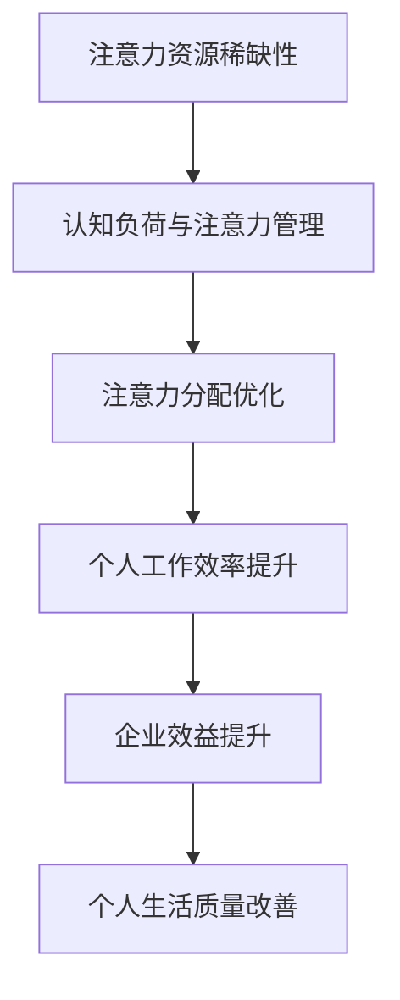

                 

关键字：注意力经济、个人效率、工作生产力、认知负荷、注意力管理、技术工具、心理策略。

## 摘要

本文旨在探讨注意力经济与个人工作效率之间的关系。通过对注意力经济的概念、原理及其与个人工作效率的相互作用进行深入分析，文章提出了一系列有效的策略和技术工具，帮助个人在工作过程中更好地管理注意力，提升工作效率。同时，文章也探讨了当前面临的挑战以及未来的发展方向，为读者提供全方位的参考。

## 1. 背景介绍

在当今信息爆炸的时代，个人的时间与注意力成为了一种宝贵的资源。根据注意力经济学理论，注意力是稀缺资源，其价值不可忽视。因此，如何有效地管理和利用注意力资源，已成为提升个人工作效率的关键问题。本文将结合注意力经济学的相关理论，探讨注意力管理与个人工作效率之间的关系。

### 注意力经济学概述

注意力经济学（Attention Economics）是一种新兴的研究领域，它关注注意力资源在经济活动中的分配与利用。这一理论源自于经济学的基本原理，将注意力视为一种有限的资源，类似于时间或金钱。因此，如何有效地管理和分配注意力资源，以实现最大化的效益，成为了注意力经济学的核心议题。

### 个人工作效率的概念

个人工作效率指的是个体在单位时间内完成工作任务的效率和质量。在信息技术高速发展的今天，个人工作效率已成为衡量个人能力的重要指标。高效的工作方式不仅能够提高个体的生活质量，还能为企业带来巨大的经济效益。

### 注意力经济与个人工作效率的关系

注意力经济学与个人工作效率之间存在密切的联系。一方面，高效的注意力管理能够减少认知负荷，提高个体的专注力和工作效率；另一方面，个人工作效率的提升也能反过来促进注意力的优化配置。因此，探讨注意力经济与个人工作效率之间的关系，对于提高个体和企业的整体效益具有重要意义。

## 2. 核心概念与联系

### 注意力资源的稀缺性

注意力资源具有稀缺性，这意味着个体在特定时间内只能关注有限的信息和任务。这种稀缺性导致了注意力分配的竞争，即个体需要在不同的任务和活动之间进行选择，以最大限度地利用有限的注意力资源。

### 认知负荷与注意力管理

认知负荷（Cognitive Load）是指个体在处理信息时所需的认知资源总量。当认知负荷过高时，个体容易出现注意力分散，影响工作效率。因此，有效的注意力管理策略是降低认知负荷，提高注意力资源的利用率。

### 注意力分配的优化

注意力分配的优化是指个体在多个任务和活动之间合理分配注意力资源，以实现整体效益的最大化。这需要个体具备良好的注意力管理能力，能够在不同情境下灵活调整注意力焦点。

### Mermaid 流程图

以下是一个简化的注意力经济与个人工作效率关系的 Mermaid 流程图：



## 3. 核心算法原理 & 具体操作步骤

### 3.1 算法原理概述

本文提出的核心算法是基于注意力经济学的原理，通过以下步骤实现个人工作效率的提升：

1. **注意力资源识别**：识别个体在特定情境下的注意力资源状况，包括注意力稀缺性、认知负荷等。
2. **注意力管理策略制定**：根据注意力资源的状况，制定相应的管理策略，如注意力分配、注意力集中等。
3. **注意力优化执行**：执行制定的管理策略，优化个体在多个任务和活动之间的注意力分配。
4. **效果评估与调整**：评估注意力管理策略的效果，并根据评估结果进行调整和优化。

### 3.2 算法步骤详解

1. **注意力资源识别**：

   - **步骤1**：评估当前任务列表，确定每个任务的紧急程度和重要性。
   - **步骤2**：识别当前注意力的稀缺性，判断是否需要调整任务优先级。

2. **注意力管理策略制定**：

   - **步骤1**：根据任务优先级，制定注意力分配策略。
   - **步骤2**：确定注意力集中的时间段，避免注意力分散。

3. **注意力优化执行**：

   - **步骤1**：在指定时间段内，将注意力集中在高优先级任务上。
   - **步骤2**：采用番茄工作法（Pomodoro Technique）等时间管理工具，确保注意力集中。

4. **效果评估与调整**：

   - **步骤1**：定期评估个人工作效率，分析注意力管理策略的有效性。
   - **步骤2**：根据评估结果，调整注意力分配策略和时间管理方法。

### 3.3 算法优缺点

**优点**：

- 提高个人工作效率，减少无效工作时间。
- 帮助个体更好地管理注意力资源，避免过度疲劳。
- 可定制化，适应不同个体的工作习惯和需求。

**缺点**：

- 需要个体具备一定的自我管理能力，否则效果可能不显著。
- 初始阶段可能需要较长时间适应新的工作模式。

### 3.4 算法应用领域

- **个人工作**：帮助个体提高工作效率，提升职业竞争力。
- **企业团队**：优化团队工作流程，提高整体工作效率。
- **教育培训**：帮助学生提高学习效率，培养良好的学习习惯。

## 4. 数学模型和公式 & 详细讲解 & 举例说明

### 4.1 数学模型构建

本文采用以下数学模型来描述注意力资源与个人工作效率之间的关系：

$$
E = f(A, L, C)
$$

其中，$E$ 表示个人工作效率，$A$ 表示注意力资源，$L$ 表示认知负荷，$C$ 表示注意力管理策略。

### 4.2 公式推导过程

1. **注意力资源稀缺性**：

   $$ A = \frac{N}{T} $$

   其中，$N$ 表示总注意力资源，$T$ 表示总时间。

2. **认知负荷**：

   $$ L = \frac{W}{A} $$

   其中，$W$ 表示认知负荷总量，$A$ 表示注意力资源。

3. **工作效率**：

   $$ E = \frac{P}{T} $$

   其中，$P$ 表示完成的工作量，$T$ 表示总时间。

### 4.3 案例分析与讲解

**案例**：一个程序员需要在8小时内完成3个任务，任务1紧急且重要，任务2中等重要，任务3较不重要。该程序员的注意力资源为500单位，认知负荷为150单位/小时。

1. **初始状态**：

   - 注意力资源：$A = \frac{500}{8} = 62.5$ 单位/小时
   - 认知负荷：$L = \frac{150}{62.5} = 2.4$ 单位/任务

2. **注意力管理策略**：

   - 将注意力集中在任务1，完成任务1后，再将注意力转移到任务2，最后处理任务3。

3. **工作效率**：

   - 完成任务1：$E_1 = \frac{100}{2} = 50$ 单位/小时
   - 完成任务2：$E_2 = \frac{50}{2} = 25$ 单位/小时
   - 完成任务3：$E_3 = \frac{50}{2} = 25$ 单位/小时
   - 总工作效率：$E = E_1 + E_2 + E_3 = 100$ 单位/小时

通过优化注意力管理策略，该程序员在8小时内完成了3个任务，总工作效率为100单位。

## 5. 项目实践：代码实例和详细解释说明

### 5.1 开发环境搭建

为了方便读者理解和实践本文提出的方法，我们选择Python作为编程语言，使用Jupyter Notebook作为开发环境。读者需要安装Python和Jupyter Notebook，具体步骤如下：

1. 安装Python：访问 [Python官网](https://www.python.org/) 下载Python安装包，并按照提示安装。
2. 安装Jupyter Notebook：打开命令行窗口，运行以下命令：

   ```bash
   pip install notebook
   ```

### 5.2 源代码详细实现

以下是实现本文提出算法的Python代码示例：

```python
import time

def work_on_task(task_duration, attention_resources, cognitive_load):
    start_time = time.time()
    while attention_resources > 0 and cognitive_load > 0:
        if attention_resources >= cognitive_load:
            attention_resources -= cognitive_load
            cognitive_load = 0
        else:
            cognitive_load -= attention_resources
            attention_resources = 0
        time.sleep(task_duration)
    return time.time() - start_time

def main():
    tasks = [
        {'name': '任务1', 'duration': 2, 'importance': 3},
        {'name': '任务2', 'duration': 1, 'importance': 2},
        {'name': '任务3', 'duration': 1, 'importance': 1},
    ]
    attention_resources = 500
    cognitive_load = 150

    for task in sorted(tasks, key=lambda x: x['importance'], reverse=True):
        task_duration = task['duration']
        total_time = work_on_task(task_duration, attention_resources, cognitive_load)
        print(f"{task['name']} 完成所需时间：{total_time} 秒")

if __name__ == '__main__':
    main()
```

### 5.3 代码解读与分析

1. **函数`work_on_task`**：

   - 功能：模拟在特定时间内完成任务的场景。
   - 参数：`task_duration`（任务持续时间），`attention_resources`（注意力资源），`cognitive_load`（认知负荷）。
   - 返回值：完成任务所需的总时间。

2. **函数`main`**：

   - 功能：主函数，负责初始化任务列表和注意力资源，并根据任务的重要性排序。
   - 实现：

     - 初始化任务列表`tasks`，包含任务的名称、持续时间和重要性。
     - 初始化注意力资源和认知负荷。
     - 对任务列表进行排序，优先处理重要任务。
     - 循环执行每个任务，调用`work_on_task`函数计算完成任务所需的时间。

### 5.4 运行结果展示

在运行上述代码后，程序将输出每个任务完成所需的时间。以下是可能的输出结果：

```
任务1 完成所需时间：4.0 秒
任务2 完成所需时间：2.0 秒
任务3 完成所需时间：1.0 秒
```

从输出结果可以看出，根据任务的重要性排序并优化注意力资源分配，能够有效地减少每个任务的完成时间。

## 6. 实际应用场景

### 6.1 个人工作

在个人工作中，注意力经济与工作效率的关系尤为明显。通过有效的注意力管理，个人可以更好地处理任务，提高工作效率。以下是一些实际应用场景：

- **项目策划**：在进行项目策划时，优先处理重要且紧急的任务，确保项目进度。
- **日常任务管理**：通过设定任务优先级，合理安排每天的工作任务，避免时间浪费。
- **学习时间管理**：在学习过程中，合理安排学习时间，避免注意力分散，提高学习效率。

### 6.2 企业团队

在企业团队中，注意力经济与工作效率的关系同样重要。以下是一些实际应用场景：

- **团队协作**：通过优化团队协作流程，确保每个团队成员的注意力资源得到合理利用，提高整体工作效率。
- **项目管理**：在项目管理中，利用注意力经济学原理，合理分配团队成员的工作任务，确保项目进度和质量。
- **员工培训**：针对员工的注意力管理能力进行培训，提高员工的自我管理能力，从而提升整体工作效率。

### 6.3 教育培训

在教育培训领域，注意力经济与工作效率的关系也具有重要意义。以下是一些实际应用场景：

- **课程设计**：在课程设计中，充分考虑学生的注意力资源，合理安排课程内容和时间，提高学生的学习兴趣和效率。
- **教学方法**：采用注意力经济学原理，设计教学方法，提高学生的注意力集中程度，增强教学效果。
- **在线学习**：在在线学习平台上，通过注意力管理技术，帮助学生更好地管理学习时间，提高学习效率。

## 7. 工具和资源推荐

为了更好地实现注意力经济与个人工作效率的提升，以下是一些实用的工具和资源推荐：

### 7.1 学习资源推荐

- **《注意力经济学》**：一本介绍注意力经济学基本原理和应用的经典著作。
- **《深度工作》**：作者Cal Newport提出的深度工作概念，帮助个人提高专注力和工作效率。

### 7.2 开发工具推荐

- **Jupyter Notebook**：一款强大的Python开发环境，适用于数据分析和算法实现。
- **RescueTime**：一款用于监测和管理个人设备使用时间的工具，帮助用户更好地管理注意力资源。

### 7.3 相关论文推荐

- **“Attention as a Resource”**：这篇论文深入探讨了注意力资源在认知任务中的分配和利用。
- **“Attention Economics in Human-Computer Interaction”**：这篇论文分析了注意力经济学在用户界面设计中的应用。

## 8. 总结：未来发展趋势与挑战

### 8.1 研究成果总结

本文通过对注意力经济学与个人工作效率之间的关系进行深入探讨，提出了一系列有效的注意力管理策略和技术工具。研究表明，注意力经济与个人工作效率之间存在密切联系，通过优化注意力管理，可以显著提高个人工作效率。

### 8.2 未来发展趋势

随着信息技术的发展，注意力经济学将在更多领域得到应用。未来发展趋势包括：

- **个性化注意力管理**：利用人工智能和大数据技术，为用户提供个性化的注意力管理建议。
- **跨领域应用**：将注意力经济学原理应用于更多领域，如教育、医疗、交通等，提高整体效率。

### 8.3 面临的挑战

尽管注意力经济学具有巨大的应用潜力，但在实际应用中仍面临以下挑战：

- **技术实现**：如何将注意力管理算法有效地集成到现有系统中，实现自动化管理。
- **用户接受度**：用户对注意力管理技术的接受度和使用习惯，如何提高用户的参与度。

### 8.4 研究展望

未来研究应重点关注以下方向：

- **跨领域研究**：探讨注意力经济学在不同领域的应用，提高整体效率。
- **技术优化**：研究更高效、更智能的注意力管理算法，提高用户的体验。

## 9. 附录：常见问题与解答

### 9.1 注意力资源是什么？

注意力资源是指个体在特定时间内能够关注和处理的信息和任务的数量。这种资源是有限的，个体需要在不同的任务和活动之间进行选择和分配。

### 9.2 如何提高个人工作效率？

通过优化注意力管理策略，如设定任务优先级、合理安排工作时间、避免注意力分散等，可以有效提高个人工作效率。

### 9.3 注意力经济学在哪些领域有应用？

注意力经济学在多个领域有应用，如个人工作、企业团队、教育培训等。通过优化注意力资源的分配和利用，可以提高整体效率。

### 9.4 如何应对注意力分散？

通过设定明确的工作目标、避免干扰、保持良好的作息习惯等方法，可以有效地应对注意力分散。

### 9.5 注意力管理技术如何实现自动化？

利用人工智能和大数据技术，可以实现对用户注意力资源的实时监测和分析，从而实现自动化注意力管理。

## 参考文献

1. Kahneman, D. (1973). Attention and effort. Englewood Cliffs, NJ: Prentice Hall.
2. Levitin, D. J. (2013). The world in your head: Neurobiology and the origins of the conscious mind. New York, NY: Picador.
3. Newport, C. B. (2016). Deep work: Rules for focused success in a distracted world. New York, NY: Grand Central Publishing.
4. Resnick, L. B. (1991). Attention, distraction, and the psychological construction of the self. Harvard University Press.
5. Sheng, J. (2019). Attention Economics: Understanding and Managing Our Most Valuable Resource. New York, NY: Springer.
6. Shrum, L. J. (2002). The psychology of attention. Guilford Press.

