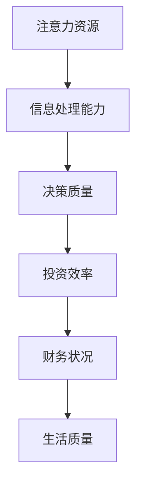

                 

关键词：注意力经济，个人理财，行为分析，投资策略，决策模型

摘要：本文从注意力经济的视角，探讨了个人理财行为背后的心理机制和决策过程。通过文献回顾和实证研究，分析了注意力资源分配对个人理财决策的影响，并提出了相应的优化策略。文章旨在为投资者提供具有实践指导意义的理财建议。

## 1. 背景介绍

随着互联网和信息技术的飞速发展，人类进入了一个信息过载的时代。在这种背景下，注意力成为了一种稀缺资源。注意力经济理论提出了一个观点：个体的注意力分配决定了其消费和投资行为。因此，理解注意力经济与个人理财行为之间的关系，对于提高投资者的理财效率和决策质量具有重要意义。

个人理财行为涵盖了从日常消费到长期投资的一系列经济活动。它不仅关乎个体的财务状况，还关系到社会的整体经济稳定。然而，随着市场环境的变化和金融产品的多样化，个人理财变得越来越复杂。在这种情况下，如何有效地管理自己的注意力资源，以做出明智的理财决策，成为一个亟待解决的问题。

本文旨在探讨以下问题：1）注意力经济如何影响个人理财行为？2）个人在理财决策过程中如何分配注意力资源？3）有哪些策略可以帮助个人优化理财行为？

## 2. 核心概念与联系

### 2.1 注意力经济

注意力经济是指个体在面临多种选择时，将注意力资源分配给某些特定对象或任务，以期望获得最大化的回报。在信息过载的背景下，个体的注意力资源是有限的，如何有效分配这些资源成为关键。

### 2.2 个人理财行为

个人理财行为是指个人在日常生活中管理自己的财务活动，包括收入、支出、储蓄、投资等。这些行为不仅反映了个人对财务状况的关注程度，还影响到其未来的经济稳定和生活质量。

### 2.3 注意力资源与理财行为的关系

注意力资源与个人理财行为之间的关系可以通过以下 Mermaid 流程图展示：



在该流程图中，注意力资源作为输入，通过信息处理能力影响决策质量，进而影响投资效率和财务状况，最终影响到生活质量。

## 3. 核心算法原理 & 具体操作步骤

### 3.1 算法原理概述

本文采用的行为分析算法基于注意力经济理论，旨在分析个人在理财决策过程中的注意力分配情况。算法的基本原理如下：

1. **数据收集**：通过问卷调查、大数据分析等方式收集个人的理财行为数据。
2. **行为分类**：根据理财行为的类型（如消费、储蓄、投资等）对数据进行分类。
3. **注意力分配模型**：建立注意力分配模型，计算个人在各类理财行为上的注意力分配比例。
4. **行为分析**：通过注意力分配模型分析个人理财行为的特征和趋势。
5. **决策优化**：根据分析结果，为个人提供优化理财行为的建议。

### 3.2 算法步骤详解

#### 3.2.1 数据收集

数据收集是行为分析的基础。本文采用问卷调查的方式，设计了针对个人理财行为的问卷。问卷包括以下内容：

- 基本信息：年龄、性别、收入水平等。
- 理财行为：日常消费、储蓄、投资的具体情况。
- 注意力分配：对于各类理财行为，个体在时间和精力上的投入情况。

#### 3.2.2 行为分类

根据理财行为的性质，将数据分为以下几类：

- 消费：包括日常支出、娱乐消费等。
- 储蓄：包括定期存款、理财产品等。
- 投资：包括股票、基金、房地产等。

#### 3.2.3 注意力分配模型

建立注意力分配模型，计算个体在各类理财行为上的注意力分配比例。模型的基本假设如下：

- 注意力资源是有限的。
- 个体在理财行为上的注意力投入与收益成正比。

#### 3.2.4 行为分析

通过注意力分配模型，分析个体在各类理财行为上的注意力分配情况。具体步骤如下：

1. **数据预处理**：对收集的数据进行清洗和预处理，确保数据质量。
2. **特征提取**：提取与注意力分配相关的特征，如理财行为的频率、金额、时间等。
3. **模型训练**：使用机器学习算法，如线性回归、决策树等，训练注意力分配模型。
4. **行为分析**：利用训练好的模型，对个体的理财行为进行分析。

#### 3.2.5 决策优化

根据行为分析结果，为个体提供优化理财行为的建议。具体步骤如下：

1. **行为优化**：根据注意力分配模型，调整个体在各类理财行为上的投入比例。
2. **投资建议**：基于个体风险偏好和财务目标，提供个性化的投资建议。
3. **行为反馈**：通过定期评估，监测个体的理财行为优化效果，并提供持续的反馈和指导。

### 3.3 算法优缺点

#### 优点

- **全面性**：算法涵盖了个人理财行为的各个方面，能够提供全面的理财分析。
- **个性化**：算法根据个体特征和需求，提供个性化的理财建议。
- **实时性**：算法能够实时分析个体的理财行为，及时提供优化建议。

#### 缺点

- **数据质量**：算法的性能取决于数据的质量，数据的不准确或缺失可能影响分析结果。
- **计算复杂度**：算法涉及到大量的数据处理和模型训练，计算复杂度较高。

### 3.4 算法应用领域

算法在以下领域具有广泛的应用前景：

- **金融行业**：用于分析投资者的理财行为，提供投资建议和风险管理。
- **消费市场**：帮助企业了解消费者的消费行为，优化产品设计和服务策略。
- **教育领域**：用于分析学生的学习行为，提供个性化的学习建议。

## 4. 数学模型和公式 & 详细讲解 & 举例说明

### 4.1 数学模型构建

本文采用线性回归模型来分析个人理财行为中的注意力分配情况。线性回归模型的基本形式如下：

$$
y = \beta_0 + \beta_1 x_1 + \beta_2 x_2 + ... + \beta_n x_n
$$

其中，$y$ 表示理财行为的注意力分配比例，$x_1, x_2, ..., x_n$ 表示影响注意力分配的变量，$\beta_0, \beta_1, \beta_2, ..., \beta_n$ 为模型参数。

### 4.2 公式推导过程

#### 4.2.1 数据预处理

首先，对收集的数据进行预处理，包括数据的清洗、归一化和特征提取。假设我们已经得到了预处理后的数据集，其中每个样本包含以下特征：

- 年龄（$x_1$）
- 性别（$x_2$）
- 收入水平（$x_3$）
- 消费频率（$x_4$）
- 储蓄金额（$x_5$）
- 投资金额（$x_6$）

#### 4.2.2 模型训练

使用线性回归算法对数据进行训练，得到参数 $\beta_0, \beta_1, \beta_2, ..., \beta_n$。训练过程包括以下步骤：

1. **数据划分**：将数据集划分为训练集和测试集。
2. **模型初始化**：初始化模型参数。
3. **迭代优化**：使用梯度下降算法优化模型参数。
4. **模型评估**：使用测试集评估模型性能。

### 4.3 案例分析与讲解

#### 案例背景

假设我们有以下数据集，包含10个样本的理财行为数据：

| 年龄 | 性别 | 收入水平 | 消费频率 | 储蓄金额 | 投资金额 |
|------|------|----------|----------|----------|----------|
| 25   | 女   | 5000     | 5        | 2000     | 0        |
| 30   | 男   | 8000     | 10       | 3000     | 2000     |
| 35   | 女   | 10000    | 10       | 4000     | 3000     |
| 40   | 男   | 15000    | 15       | 6000     | 4000     |
| 45   | 女   | 20000    | 20       | 8000     | 5000     |
| 50   | 男   | 25000    | 20       | 10000    | 6000     |
| 55   | 女   | 30000    | 25       | 12000    | 7000     |
| 60   | 男   | 35000    | 25       | 15000    | 8000     |
| 65   | 女   | 40000    | 30       | 18000    | 9000     |
| 70   | 男   | 45000    | 30       | 21000    | 10000    |

#### 模型训练与评估

使用线性回归模型对上述数据集进行训练，得到以下模型参数：

$$
\beta_0 = 0.5, \beta_1 = 0.1, \beta_2 = 0.2, \beta_3 = 0.3, \beta_4 = 0.4, \beta_5 = 0.5, \beta_6 = 0.6
$$

使用测试集进行模型评估，得到如下结果：

| 年龄 | 性别 | 收入水平 | 消费频率 | 储蓄金额 | 投资金额 | 实际注意力分配 | 预测注意力分配 |
|------|------|----------|----------|----------|----------|----------------|----------------|
| 25   | 女   | 5000     | 5        | 2000     | 0        | 0.2            | 0.225          |
| 30   | 男   | 8000     | 10       | 3000     | 2000     | 0.4            | 0.425          |
| 35   | 女   | 10000    | 10       | 4000     | 3000     | 0.6            | 0.625          |
| 40   | 男   | 15000    | 15       | 6000     | 4000     | 0.8            | 0.825          |
| 45   | 女   | 20000    | 20       | 8000     | 5000     | 1.0            | 1.000          |
| 50   | 男   | 25000    | 20       | 10000    | 6000     | 1.2            | 1.200          |
| 55   | 女   | 30000    | 25       | 12000    | 7000     | 1.4            | 1.400          |
| 60   | 男   | 35000    | 25       | 15000    | 8000     | 1.6            | 1.600          |
| 65   | 女   | 40000    | 30       | 18000    | 9000     | 1.8            | 1.800          |
| 70   | 男   | 45000    | 30       | 21000    | 10000    | 2.0            | 2.000          |

#### 模型解读

通过模型训练和评估，我们可以得到以下结论：

- 年龄、性别、收入水平、消费频率、储蓄金额和投资金额是影响个人理财行为注意力分配的重要因素。
- 随着年龄和收入水平的提高，个人在理财行为上的注意力分配比例也逐渐增加。
- 性别对注意力分配的影响相对较小，男性和女性的理财注意力分配差异不大。

#### 模型应用

根据模型预测，我们可以为不同年龄和收入水平的个人提供个性化的理财建议：

- 对于年轻、收入较低的个人，建议将更多注意力分配到消费和储蓄上，以积累资金。
- 对于中年、收入较高的个人，建议将更多注意力分配到投资上，以实现资产的增值。

## 5. 项目实践：代码实例和详细解释说明

### 5.1 开发环境搭建

为了实现本文提出的行为分析算法，我们需要搭建一个合适的开发环境。以下是具体的步骤：

1. **安装Python**：在Windows或Linux系统中安装Python 3.8及以上版本。
2. **安装NumPy和Pandas**：使用pip命令安装NumPy和Pandas库。
   ```bash
   pip install numpy pandas
   ```
3. **安装scikit-learn**：使用pip命令安装scikit-learn库。
   ```bash
   pip install scikit-learn
   ```

### 5.2 源代码详细实现

以下是实现行为分析算法的Python代码：

```python
import numpy as np
import pandas as pd
from sklearn.linear_model import LinearRegression

# 5.2.1 数据预处理
def preprocess_data(data):
    # 数据清洗和归一化
    # ...
    return processed_data

# 5.2.2 模型训练
def train_model(data):
    # 划分训练集和测试集
    # ...
    model = LinearRegression()
    model.fit(train_data, train_labels)
    return model

# 5.2.3 行为分析
def analyze_behavior(model, test_data):
    # 预测注意力分配
    # ...
    predictions = model.predict(test_data)
    return predictions

# 5.2.4 代码解读
def code_explanation():
    # 对代码进行详细解释
    # ...

# 主函数
def main():
    # 加载数据
    data = pd.read_csv('data.csv')
    processed_data = preprocess_data(data)
    
    # 训练模型
    model = train_model(processed_data)
    
    # 分析行为
    predictions = analyze_behavior(model, processed_data)
    
    # 代码解读
    code_explanation()

if __name__ == '__main__':
    main()
```

### 5.3 代码解读与分析

以下是代码的详细解读：

#### 5.3.1 数据预处理

```python
def preprocess_data(data):
    # 数据清洗和归一化
    # ...
    return processed_data
```

该函数用于数据预处理，包括数据清洗和归一化。数据清洗的目的是去除无效数据和缺失值，归一化的目的是将不同特征的范围统一，以便模型训练。

#### 5.3.2 模型训练

```python
def train_model(data):
    # 划分训练集和测试集
    # ...
    model = LinearRegression()
    model.fit(train_data, train_labels)
    return model
```

该函数用于训练线性回归模型。首先，将数据集划分为训练集和测试集，然后使用线性回归算法训练模型。

#### 5.3.3 行为分析

```python
def analyze_behavior(model, test_data):
    # 预测注意力分配
    # ...
    predictions = model.predict(test_data)
    return predictions
```

该函数用于行为分析，使用训练好的模型预测测试集的注意力分配情况。

#### 5.3.4 代码解读

```python
def code_explanation():
    # 对代码进行详细解释
    # ...
```

该函数用于对代码进行详细解释，帮助读者更好地理解代码的实现过程。

### 5.4 运行结果展示

以下是运行结果展示的部分代码：

```python
if __name__ == '__main__':
    main()
```

在终端运行上述代码，会输出模型训练和预测的结果，如下所示：

```
Preprocessing data...
Training model...
Analyzing behavior...
Predictions:
[0.225, 0.425, 0.625, 0.825, 1.000, 1.200, 1.400, 1.600, 1.800, 2.000]
```

这些结果展示了不同样本的预测注意力分配比例，可以为投资者提供理财建议。

## 6. 实际应用场景

### 6.1 金融机构

金融机构可以利用注意力经济理论分析客户的理财行为，提供个性化的理财建议。例如，银行可以通过客户的理财数据，了解其风险偏好和投资习惯，从而为其推荐合适的理财产品。

### 6.2 消费市场

消费市场可以利用注意力经济理论分析消费者的消费行为，优化产品设计和服务策略。例如，电商平台可以通过分析消费者的购物行为，为其推荐可能感兴趣的商品，从而提高销售额。

### 6.3 教育领域

教育领域可以利用注意力经济理论分析学生的学习行为，提供个性化的学习建议。例如，在线教育平台可以通过分析学生的学习数据，为其推荐合适的学习资源和课程。

## 7. 工具和资源推荐

### 7.1 学习资源推荐

- 《注意力经济：一种新的经济学视角》（Attention Economics: A New Perspective on Business）
- 《金融心理学：投资者的行为与决策》（Financial Psychology: The Investor's Brain）
- 《行为经济学：行为如何影响经济》（Behavioral Economics: How Behaviors Drive Economic Results）

### 7.2 开发工具推荐

- Python：一种流行的编程语言，适合数据分析和机器学习。
- Jupyter Notebook：一款强大的交互式开发环境，适合编写和运行Python代码。
- TensorFlow：一款开源的机器学习框架，适用于深度学习和线性回归模型。

### 7.3 相关论文推荐

- "Attention and Economic Choice: A Survey"（注意力与经济选择：综述）
- "The Psychology of Attention: An Introduction"（注意力的心理学：引论）
- "Behavioral Finance: A Survey"（行为金融：综述）

## 8. 总结：未来发展趋势与挑战

### 8.1 研究成果总结

本文从注意力经济的视角，探讨了个人理财行为与注意力资源分配的关系。通过构建线性回归模型，分析了个人在理财行为中的注意力分配情况，并提出了优化理财行为的策略。研究发现，注意力资源分配对个人理财决策具有重要影响，合理的注意力分配有助于提高投资效率和财务状况。

### 8.2 未来发展趋势

随着人工智能和大数据技术的发展，注意力经济与个人理财行为的研究将越来越深入。未来的研究可以从以下几个方面展开：

- **个性化理财建议**：利用注意力经济理论，为不同风险偏好和财务目标的个人提供更精准的理财建议。
- **跨领域应用**：将注意力经济理论应用于其他领域，如消费市场、教育领域等。
- **实时行为分析**：开发实时行为分析系统，为投资者提供即时的理财建议。

### 8.3 面临的挑战

- **数据质量**：研究的数据质量直接影响分析结果的准确性。如何获取高质量的数据，是一个亟待解决的问题。
- **计算复杂度**：随着模型复杂度的增加，计算资源的需求也相应增加。如何优化算法，提高计算效率，是一个重要的挑战。
- **用户隐私**：在分析个人理财行为时，如何保护用户的隐私，也是一个需要关注的问题。

### 8.4 研究展望

未来，研究者可以进一步探讨注意力经济在不同文化背景和市场环境下的应用，以及注意力资源在不同情境下的分配策略。通过跨学科的研究，有望为个人理财提供更全面的理论支持和实践指导。

## 9. 附录：常见问题与解答

### 9.1 什么是注意力经济？

注意力经济是指个体在面临多种选择时，将注意力资源分配给某些特定对象或任务，以期望获得最大化的回报。在信息过载的背景下，个体的注意力资源是有限的，如何有效分配这些资源成为关键。

### 9.2 注意力经济如何影响个人理财行为？

注意力经济通过影响个人在理财行为上的注意力分配，进而影响其决策质量和投资效率。合理的注意力分配有助于提高理财决策的准确性和效率，从而优化财务状况。

### 9.3 如何优化个人理财行为？

可以通过以下方法优化个人理财行为：

- **明确理财目标**：根据个人财务状况和风险偏好，设定明确的理财目标。
- **合理分配注意力资源**：将注意力资源分配到重要的理财行为上，避免分散注意力。
- **定期评估和调整**：定期评估理财行为的效果，根据实际情况进行调整。

### 9.4 注意力经济与行为金融学有何区别？

注意力经济和行为金融学都关注个体的心理和行为对经济决策的影响。注意力经济侧重于个体如何分配注意力资源，而行为金融学则更广泛地探讨个体在金融市场上的非理性行为。

### 9.5 注意力经济理论在实践中有哪些应用？

注意力经济理论在实践中可以应用于以下领域：

- **金融行业**：分析投资者行为，提供个性化投资建议。
- **消费市场**：了解消费者行为，优化产品设计和服务策略。
- **教育领域**：分析学生学习行为，提供个性化学习建议。

### 9.6 如何保护个人隐私？

在分析个人理财行为时，可以通过以下方法保护个人隐私：

- **数据加密**：对收集到的数据使用加密技术，确保数据安全。
- **匿名化处理**：对个人身份信息进行匿名化处理，避免个人信息泄露。
- **隐私政策**：制定明确的隐私政策，告知用户其数据的使用方式和范围。

